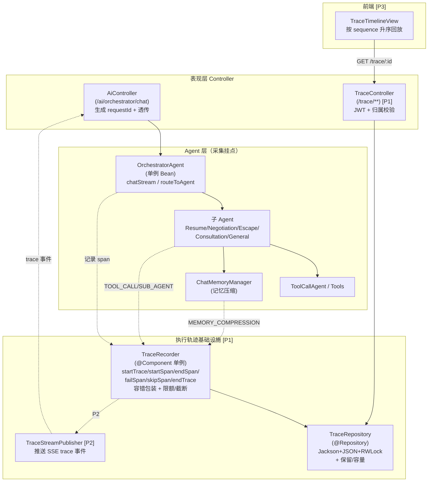
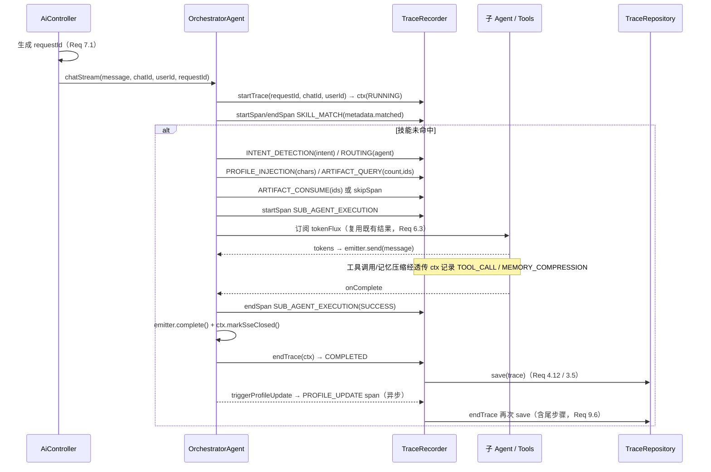
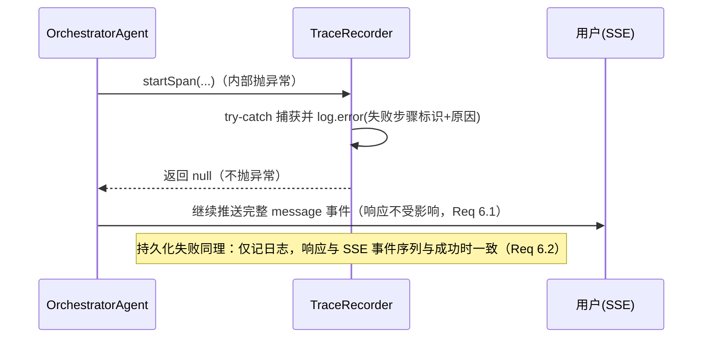

# Design Document: Agent 执行轨迹可视化（Execution Trace / Timeline）

## Overview

本设计在现有职场 AI Agent 系统（Java 21 + Spring Boot 3.4 + Spring AI 1.0）之上，新增一套**执行轨迹（Execution Trace）**基础设施：在每一次对话请求经过 `OrchestratorAgent` 的完整执行链路上，采集一条可回放的轨迹（`ExecutionTrace`），覆盖技能匹配 → LLM 意图识别 → 路由 → 子 Agent 执行 → 工具调用 → 货架 READY 交付物查询 → 交付物 CONSUMED 标记 → 用户画像注入 → 对话结束异步画像更新 → 对话记忆压缩共 10 类步骤（`TraceSpan`）。轨迹通过受 JWT 保护的 REST 接口按 `traceId` / `chatId` / `userId` 查询（P1）；可在对话 SSE 连接上以独立 `trace` 命名事件实时推送（P2）；并在前端以时间线视图回放（P3）。

轨迹采集遵循两个硬约束：

- **对主对话流程零阻塞、零破坏**：任何采集/持久化异常都被捕获，用户始终得到完整、未截断的对话响应（Req 6.1/6.2/4.15）。
- **零额外副作用**：采集只复用主流程已产生的执行结果，不额外触发任何 LLM 意图识别、子 Agent 或工具调用（Req 6.3）。

### 1.1 设计目标与对齐原则

| 目标 | 对齐方式 |
|------|---------|
| 持久化风格一致 | `TraceRepository` 完全复用 `AppointmentRepository` / `ArtifactRepository` 范式：`ObjectMapper + JavaTimeModule`、`ConcurrentHashMap` 内存索引、`ReentrantReadWriteLock`、`@PostConstruct` 加载（`mkdirs + loadFromFile`）、`@Value` 配置存储目录（默认 `./tmp/traces`）、`writerWithDefaultPrettyPrinter` 写盘 |
| 货架式记录器 | `TraceRecorder` 借鉴 `ArtifactShelf`：作为唯一采集入口，返回值化（不向调用方抛异常）、`Optional` / 句柄式返回、内部委托 `TraceRepository` 持久化 |
| Bean 注入风格一致 | `TraceRepository` 用 `@Repository`、`TraceRecorder` / `TraceController` 用 `@Component` / `@RestController` 注册为单例；`OrchestratorAgent` 在 `AgentConfig` 中通过构造注入新增 `TraceRecorder` 协作者，保持其单例装配范式 |
| 不阻塞响应 | 采集挂接在 `OrchestratorAgent.chatStream` 现有的 `CompletableFuture.runAsync` + reactor `Flux` 回调上；持久化在轨迹结束时一次性写盘，`trace` 事件推送为轻量小负载 |
| 鉴权风格一致 | `TraceController` 复用 `JwtUtil.validateToken(token) -> userId` 与 `SessionManager.isOwner(userId, chatId)`，统一用 `com.yupi.yuaiagent.common.Result` 包装响应 |
| 渐进交付 | 严格按 requirements 的 P1/P2/P3 优先级落地，P1 为完整闭环（详细设计），P2/P3 留出扩展点（概要设计） |

### 1.2 交付优先级映射

- **P1（核心闭环，本文档做详细设计）**：轨迹与步骤数据模型（Req 1）、步骤类型与状态枚举（Req 2）、文件持久化（Req 3）、编排流程采集（Req 4）、步骤计时与状态（Req 5）、容错与非侵入（Req 6）、轨迹标识与请求关联（Req 7）、查询 REST 接口（Req 8）。
- **P2（概要设计）**：实时轨迹事件流（Req 9）。
- **P3（概要设计）**：前端时间线可视化入口（Req 10）、数据保留与容量限制（Req 11，其中存储/容量上限的服务端实现在 P1 的 `TraceRepository`/`TraceRecorder` 中已落地，前端入口在 P3）。

> 说明：Req 11 的容量与保留逻辑（单轨迹 span 上限、metadata 值截断、单 userId 轨迹上限）属于存储正确性，必须在 P1 的记录器/仓库中实现以保证长期运行可控；其对应的前端展示属于 P3。本文档在 P1 组件中给出完整实现设计。

---

## Architecture

### 2.1 采集与回放总览



### 2.2 数据流分层

| 层 | 组件 | 职责 | 新增/修改 |
|----|------|------|----------|
| 表现层 | `AiController` | 在对话入口生成 `requestId`，透传给 `OrchestratorAgent`（Req 7.1） | 修改 [P1] |
| 表现层 | `TraceController` | 按 traceId/chatId/userId 查询轨迹，JWT + 归属校验，`Result` 包装 | 新增 [P1] |
| Agent 层 | `OrchestratorAgent` | 在各执行环节调用 `TraceRecorder` 采集 span；管理轨迹生命周期 | 修改 [P1] |
| Agent 层 | 子 Agent / `ToolCallAgent` / `ChatMemoryManager` | 透传 `TraceContext`，记录 SUB_AGENT_EXECUTION / TOOL_CALL / MEMORY_COMPRESSION | 修改 [P1] |
| 服务层 | `TraceRecorder` | 唯一采集入口：建轨迹/建步骤/结束步骤/结束轨迹；容错、限额、截断、状态推导 | 新增 [P1] |
| 服务层 | `TraceStreamPublisher` | 将 span 状态变化推送为 SSE `trace` 事件 | 新增 [P2] |
| 数据层 | `TraceRepository` | 轨迹文件持久化 + 保留/容量策略 | 新增 [P1] |
| 前端 | `TraceTimelineView` | 时间线回放某条 `ExecutionTrace` | 新增 [P3] |

### 2.3 包结构规划

```
com.yupi.yuaiagent
├── trace                              # 执行轨迹基础设施 [P1]
│   ├── model
│   │   ├── ExecutionTrace.java        # 轨迹实体（含 spans 列表）
│   │   ├── TraceSpan.java             # 步骤实体
│   │   ├── TraceStatus.java           # RUNNING / COMPLETED / FAILED
│   │   ├── TraceStepType.java         # 10 类步骤类型 + 中文显示名
│   │   └── TraceStepStatus.java       # RUNNING / SUCCESS / ERROR / SKIPPED
│   ├── TraceContext.java              # 请求级上下文（持有当前 ExecutionTrace + 同步状态）
│   ├── TraceRecorder.java             # @Component 唯一采集入口（容错门面）
│   ├── TraceRepository.java           # @Repository 文件持久化 + 保留/容量
│   ├── TraceStreamPublisher.java      # @Component 实时事件流 [P2]
│   └── TraceProperties.java           # @ConfigurationProperties 轨迹配置
└── controller
    └── TraceController.java           # [P1] 轨迹查询 REST 接口
```

### 2.4 关键架构决策：采集上下文如何在异步/响应式链路中传播

`OrchestratorAgent.chatStream` 的执行链路横跨 `CompletableFuture.runAsync` 与 reactor `Flux`（`doOnNext` / `doOnComplete` / `doOnError` 回调运行在不同调度线程上），异步画像更新（PROFILE_UPDATE）更是在 SSE 关闭之后才发生。轨迹采集必须在这些跨线程边界上稳定关联同一条轨迹。

| 方案 | 说明 | 取舍 |
|------|------|------|
| A. `ThreadLocal` 上下文 | 用 `ThreadLocal<TraceContext>` 隐式传递 | ❌ reactor 在 `subscribe`/操作符间切换调度线程，`CompletableFuture` 也跨线程，`ThreadLocal` 不随线程切换传播，会丢失上下文或串号，且需手动清理易泄漏 |
| B. 显式传参 `TraceContext` | 在 `routeToAgent`、子 Agent 流式方法、`ToolCallAgent` 上新增一个可空 `TraceContext` 参数，闭包捕获后跨线程安全可用 | ✅ 线程安全、传播确定、改动局限于方法签名；`TraceContext` 为 `null` 时所有采集静默跳过，不影响其它入口的既有行为 |

**选定方案 B（显式传播 `TraceContext`）**。`TraceContext` 是请求级对象，由 `TraceRecorder.startTrace(...)` 创建，持有当前 `ExecutionTrace`、序号计数器与并发保护（详见 3.3），通过 lambda 闭包在 `runAsync` 与 `Flux` 回调中被捕获，从而在任意调度线程上都能正确关联到同一条轨迹。`TraceRecorder` 自身保持单例无请求级可变状态（与现有 `ArtifactShelf` 一致），可变状态全部收敛到 `TraceContext`。

边界上的采集分工：

- **编排器边界即可采集（无需深入子 Agent）**：SKILL_MATCH、INTENT_DETECTION、ROUTING、ARTIFACT_QUERY、ARTIFACT_CONSUME、PROFILE_INJECTION、PROFILE_UPDATE、SUB_AGENT_EXECUTION（围绕子 Agent `Flux` 的订阅/完成时机记录）。
- **需要把 `TraceContext` 传播进组件内部**：TOOL_CALL（在 `ToolCallAgent` 每次工具调用处记录）、MEMORY_COMPRESSION（在 `ChatMemoryManager`/压缩服务触发处记录）。这两类透传一个可空 `TraceContext` 参数，缺省为 `null` 时不记录，保证既有调用方零影响。

---

## Components and Interfaces

### 3.1 TraceRecorder（唯一采集入口，@Component 单例）[P1]

`TraceRecorder` 是所有轨迹采集的门面，借鉴 `ArtifactShelf` 的"唯一入口 + 不抛异常"风格。**每个公开方法都用 try-catch 包裹，绝不向 `OrchestratorAgent` 主流程抛出异常**（Req 4.15/6.1），并在异常时记录包含失败步骤标识与原因的日志。

```java
package com.yupi.yuaiagent.trace;

import com.yupi.yuaiagent.trace.model.*;
import lombok.extern.slf4j.Slf4j;
import org.springframework.stereotype.Component;

import jakarta.annotation.Resource;
import java.util.Map;

/**
 * 执行轨迹采集门面（唯一采集入口）。
 * <p>所有方法均为容错包装：内部异常被捕获并记录日志，绝不抛给调用方，
 * 以保证主对话流程零中断（Req 4.15 / 6.1）。线程安全由 {@link TraceContext} 内部同步保证，
 * 本类自身无请求级可变状态。
 */
@Slf4j
@Component
public class TraceRecorder {

    @Resource private TraceRepository traceRepository;
    @Resource private TraceProperties props;
    @Resource(required = false) private TraceStreamPublisher streamPublisher; // P2，可空

    /**
     * 开始一条轨迹：生成 traceId、startTime=now、status=RUNNING，并关联 requestId/chatId/userId。
     * userId 可为 null/空（匿名调用方），仍创建轨迹（Req 7.4）。
     *
     * @return 请求级 TraceContext；即使内部异常也返回一个"无操作"上下文，调用方无需判空逻辑
     */
    public TraceContext startTrace(String requestId, String chatId, String userId) {
        try {
            ExecutionTrace trace = ExecutionTrace.start(requestId, chatId, userId); // 生成 traceId, RUNNING
            return new TraceContext(this, trace);
        } catch (Exception e) {
            log.error("[trace] startTrace 失败 requestId={}, chatId={}", requestId, chatId, e);
            return TraceContext.noop(); // 后续所有调用均空操作
        }
    }

    /** 开始一个步骤：startTime=now、status=RUNNING、sequence 连续递增；达到 span 上限则不追加（Req 11.2）。 */
    public TraceSpan startSpan(TraceContext ctx, TraceStepType type, String stepName) {
        if (ctx == null || ctx.isNoop()) return null;
        try {
            TraceSpan span = ctx.appendSpan(type, stepName, props.getMaxSpansPerTrace()); // 返回 null 表示达上限
            if (span != null && streamPublisher != null) {
                streamPublisher.publish(ctx, span); // P2：RUNNING 事件；SSE 已关闭则内部跳过（Req 9.6）
            }
            return span;
        } catch (Exception e) {
            log.error("[trace] startSpan 失败 traceId={}, type={}", ctx.traceId(), type, e);
            return null;
        }
    }

    /** 正常结束步骤为 SUCCESS：endTime=now、durationMs=diff（Req 5.2），可附加 metadata（限额/截断）。 */
    public void endSpan(TraceContext ctx, TraceSpan span, Map<String, String> metadata) {
        finish(ctx, span, TraceStepStatus.SUCCESS, metadata, null);
    }

    public void endSpan(TraceContext ctx, TraceSpan span) { endSpan(ctx, span, null); }

    /** 结束步骤为 ERROR：endTime=now、durationMs=diff、errorMessage=截断后的异常信息（Req 5.3）。 */
    public void failSpan(TraceContext ctx, TraceSpan span, Throwable error) {
        finish(ctx, span, TraceStepStatus.ERROR, null,
                truncate(describe(error), TraceConstants.MAX_ERROR_CHARS));
    }

    /** 记录一个未实际执行的步骤为 SKIPPED：endTime=now、durationMs=diff（Req 2.4 / 5.7）。 */
    public void skipSpan(TraceContext ctx, TraceStepType type, String stepName, Map<String, String> metadata) {
        TraceSpan span = startSpan(ctx, type, stepName);
        finish(ctx, span, TraceStepStatus.SKIPPED, metadata, null);
    }

    /**
     * 结束轨迹：endTime=now，按 spans 推导 status（含 ERROR→FAILED，否则 COMPLETED），
     * durationMs=diff，并通过 TraceRepository 持久化（Req 4.12/4.14, 1.10/1.11）。幂等可重复调用。
     */
    public void endTrace(TraceContext ctx) {
        if (ctx == null || ctx.isNoop()) return;
        try {
            ExecutionTrace trace = ctx.finalizeTrace(); // 设 endTime、推导 status、算 durationMs
            traceRepository.save(trace);                // 失败仅记日志，不影响响应（Req 6.2 / 3.11）
        } catch (Exception e) {
            log.error("[trace] endTrace 失败 traceId={}", ctx.traceId(), e);
        }
    }

    /**
     * 因主流程异常而结束轨迹：将当前 RUNNING 步骤（若有）置 ERROR，并将轨迹置 FAILED 后持久化（Req 4.14）。
     */
    public void failTrace(TraceContext ctx, Throwable error) {
        if (ctx == null || ctx.isNoop()) return;
        try {
            ctx.failRunningSpan(truncate(describe(error), TraceConstants.MAX_ERROR_CHARS));
            ExecutionTrace trace = ctx.finalizeTrace();
            traceRepository.save(trace);
        } catch (Exception e) {
            log.error("[trace] failTrace 失败 traceId={}", ctx.traceId(), e);
        }
    }

    /** 统一的步骤收尾：写入 endTime/status/durationMs、metadata（限额+截断），并推送 P2 终态事件。 */
    private void finish(TraceContext ctx, TraceSpan span, TraceStepStatus status,
                        Map<String, String> metadata, String errorMessage) {
        if (ctx == null || ctx.isNoop() || span == null) return;
        try {
            ctx.finishSpan(span, status, sanitize(metadata), errorMessage); // 幂等：终态步骤再次结束不变
            if (streamPublisher != null) streamPublisher.publish(ctx, span);
        } catch (Exception e) {
            log.error("[trace] finish span 失败 traceId={}, spanId={}", ctx.traceId(),
                    span != null ? span.getSpanId() : null, e);
        }
    }

    /** metadata 限额（≤50 键、键≤128 字符）+ 单值按 Unicode 码点截断到配置上限（Req 1.6 / 11.4）。 */
    private Map<String, String> sanitize(Map<String, String> metadata) { /* 见 3.1.1 */ return metadata; }

    private static String describe(Throwable t) { /* 异常类名 + message，非空兜底 */ return ""; }
    private static String truncate(String s, int maxCodePoints) { /* 按码点截断 */ return s; }
}
```

#### 3.1.1 metadata 限额与截断（Req 1.6 / 11.4）

```java
private Map<String, String> sanitize(Map<String, String> metadata) {
    if (metadata == null || metadata.isEmpty()) return Map.of();
    int maxVal = props.getMetadataMaxValueChars();          // 默认 2000，范围 [1,4096]
    Map<String, String> out = new LinkedHashMap<>();        // 保序
    for (Map.Entry<String, String> e : metadata.entrySet()) {
        if (out.size() >= TraceConstants.MAX_METADATA_ENTRIES) break;     // ≤50 键
        String key = e.getKey();
        if (key == null || key.length() > TraceConstants.MAX_METADATA_KEY_CHARS) continue; // 键≤128
        out.put(key, truncateByCodePoints(e.getValue(), maxVal));         // 值按码点截断
    }
    return out;
}
```

> `truncateByCodePoints` 以 Unicode 码点（而非 `char`）计数，避免把代理对（emoji 等）截成半个字符（Req 11.4 明确"按 Unicode 码点计数"）。

### 3.2 TraceRepository（文件持久化 + 保留/容量，@Repository）[P1]

完全对齐 `AppointmentRepository` / `ArtifactRepository`：`ObjectMapper + JavaTimeModule`、`ConcurrentHashMap` 索引、`ReentrantReadWriteLock`、`@PostConstruct` 加载、`@Value` 配置目录、`writerWithDefaultPrettyPrinter` 写盘。

```java
@Slf4j
@Repository
public class TraceRepository {

    @Value("${trace.storage.dir:./tmp/traces}")
    private String storageDir;

    private final ObjectMapper objectMapper;
    private final Map<String, ExecutionTrace> traces = new ConcurrentHashMap<>(); // traceId -> trace
    private final ReadWriteLock lock = new ReentrantReadWriteLock();
    private File storageFile;

    @Resource private TraceProperties props;

    public TraceRepository() {
        this.objectMapper = new ObjectMapper();
        this.objectMapper.registerModule(new JavaTimeModule()); // Req 3.1：JavaTimeModule
    }

    @PostConstruct
    public void init() {
        try {
            File dir = new File(storageDir);
            if (!dir.exists()) dir.mkdirs();              // Req 3.10：目录不存在则创建
            storageFile = new File(dir, "traces.json");
            loadFromFile();                                // Req 3.4：启动加载
            log.info("执行轨迹存储初始化完成，存储路径：{}", storageFile.getAbsolutePath());
        } catch (Exception e) {
            log.error("初始化执行轨迹存储失败", e);            // Req 3.7：记录日志且以空集合完成初始化
        }
    }

    /**
     * 保存或更新轨迹：先更新内存索引，再写盘（Req 3.5），随后执行单 userId 保留策略（Req 11.6）。
     * 写盘失败仅记日志且保留内存中其它轨迹（Req 3.11）。
     */
    public ExecutionTrace save(ExecutionTrace trace) {
        lock.writeLock().lock();
        try {
            traces.put(trace.getTraceId(), trace);        // 先更新内存索引（Req 3.5）
            enforceUserRetention(trace.getUserId());      // Req 11.6：超额按 startTime 升序删最早
            saveToFile();                                  // save 返回前写盘（Req 3.5）
            return trace;
        } finally {
            lock.writeLock().unlock();
        }
    }

    public Optional<ExecutionTrace> findById(String traceId) {
        lock.readLock().lock();
        try { return Optional.ofNullable(traces.get(traceId)); }
        finally { lock.readLock().unlock(); }
    }

    /** 按 chatId 查询，startTime 倒序（Req 8.2 / 8.4） */
    public List<ExecutionTrace> findByChatId(String chatId) {
        lock.readLock().lock();
        try {
            return traces.values().stream()
                    .filter(t -> Objects.equals(chatId, t.getChatId()))
                    .sorted(Comparator.comparing(ExecutionTrace::getStartTime,
                            Comparator.nullsLast(Comparator.naturalOrder())).reversed())
                    .toList();
        } finally { lock.readLock().unlock(); }
    }

    /** 按 userId 查询，startTime 倒序（Req 8.3 / 8.4） */
    public List<ExecutionTrace> findByUserId(String userId) {
        lock.readLock().lock();
        try {
            return traces.values().stream()
                    .filter(t -> userId != null && userId.equals(t.getUserId()))
                    .sorted(Comparator.comparing(ExecutionTrace::getStartTime,
                            Comparator.nullsLast(Comparator.naturalOrder())).reversed())
                    .toList();
        } finally { lock.readLock().unlock(); }
    }

    /** 单 userId 保留上限：超额则按 startTime 升序删除最早的，直到不超过上限（Req 11.6） */
    private void enforceUserRetention(String userId) {
        if (userId == null || userId.isBlank()) return;       // 匿名轨迹不参与按用户保留
        int cap = props.getMaxTracesPerUser();                // 默认 500，范围 [1,100000]
        List<ExecutionTrace> mine = traces.values().stream()
                .filter(t -> userId.equals(t.getUserId()))
                .sorted(Comparator.comparing(ExecutionTrace::getStartTime,
                        Comparator.nullsLast(Comparator.naturalOrder())))  // 升序，最早在前
                .toList();
        for (int i = 0; i < mine.size() - cap; i++) {
            traces.remove(mine.get(i).getTraceId());
        }
    }

    private void loadFromFile() {                              // 与 ArtifactRepository 一致
        if (storageFile.exists() && storageFile.length() > 0) {
            try {
                Map<String, ExecutionTrace> loaded = objectMapper.readValue(
                        storageFile, new TypeReference<Map<String, ExecutionTrace>>() {});
                traces.putAll(loaded);                          // Req 3.8：成功加载，不记错误日志
                log.info("从文件加载执行轨迹：{} 条", loaded.size());
            } catch (IOException e) {
                log.error("加载执行轨迹文件失败", e);             // Req 3.7
            }
        }
    }

    private void saveToFile() {
        try {
            objectMapper.writerWithDefaultPrettyPrinter().writeValue(storageFile, traces);
        } catch (IOException e) {
            log.error("保存执行轨迹文件失败", e);                 // Req 3.11：仅记日志，内存不受影响
        }
    }
}
```

> **往返一致性（Req 3.6）**：`ExecutionTrace` / `TraceSpan` 为纯 POJO（Lombok `@Data`），字段为 `String` / 枚举 / `Long` / `LocalDateTime` / `List` / `Map<String,String>`。`JavaTimeModule` 默认以数组形式（保留到纳秒）序列化 `LocalDateTime`，反序列化后逐字段相等（含毫秒级精度与 `spans` 列表顺序）；这与现有仓库不额外配置 `WRITE_DATES_AS_TIMESTAMPS` 的行为一致，无需自定义。该不变量由属性测试 P9 守护。

### 3.3 TraceContext（请求级上下文，线程安全）[P1]

`TraceContext` 收敛单条轨迹在异步/响应式链路上的全部可变状态，并提供内部同步，使跨线程的 span 追加/结束安全有序。

```java
package com.yupi.yuaiagent.trace;

/**
 * 请求级轨迹上下文：持有当前 ExecutionTrace、序号计数与并发保护。
 * 由 TraceRecorder 创建，经显式传参在 runAsync / Flux 回调间传播（见 2.4）。
 */
public final class TraceContext {

    private final TraceRecorder recorder;       // 仅用于回调（P2 推送），可为 null（noop）
    private final ExecutionTrace trace;          // 当前轨迹（noop 时为 null）
    private final Object monitor = new Object(); // 保护 spans 追加/结束与 sequence
    private volatile boolean sseClosed = false;  // SSE 是否已关闭（Req 9.6）

    static TraceContext noop() { return new TraceContext(null, null); }
    boolean isNoop() { return trace == null; }
    public String traceId() { return trace != null ? trace.getTraceId() : null; }

    /** 追加一个 RUNNING 步骤：sequence 从 1 连续递增；达到上限返回 null 且不改变已有 spans（Req 11.2 / 1.9）。 */
    TraceSpan appendSpan(TraceStepType type, String stepName, int maxSpans) {
        synchronized (monitor) {
            int cap = Math.min(maxSpans, TraceConstants.ABSOLUTE_MAX_SPANS); // ≤1000（Req 1.1）
            if (trace.getSpans().size() >= cap) {
                log.warn("[trace] span 数达上限 {}，丢弃新步骤 type={} traceId={}", cap, type, traceId());
                return null;
            }
            int seq = trace.getSpans().size() + 1;                 // 连续递增、反映实际发生顺序
            TraceSpan span = TraceSpan.start(trace.getTraceId(), seq, type, stepName);
            trace.getSpans().add(span);
            return span;
        }
    }

    /** 结束步骤：终态步骤再次结束为幂等（不改变 status/endTime/durationMs）。 */
    void finishSpan(TraceSpan span, TraceStepStatus status, Map<String,String> metadata, String errorMessage) {
        synchronized (monitor) {
            if (span.isTerminal()) return;                          // 幂等（支持容错重入）
            span.terminate(status, LocalDateTime.now(), metadata, errorMessage); // 设 endTime/durationMs
        }
    }

    /** 主流程异常时把仍处于 RUNNING 的最后一个步骤置 ERROR（Req 4.14）。 */
    void failRunningSpan(String errorMessage) {
        synchronized (monitor) {
            trace.getSpans().stream().filter(s -> !s.isTerminal())
                 .reduce((a, b) -> b)   // 取最后一个 RUNNING
                 .ifPresent(s -> s.terminate(TraceStepStatus.ERROR, LocalDateTime.now(), null, errorMessage));
        }
    }

    /** 推导并固化轨迹终态：endTime=now、status=（任一 ERROR→FAILED 否则 COMPLETED）、durationMs=diff。幂等。 */
    ExecutionTrace finalizeTrace() {
        synchronized (monitor) {
            trace.finalizeStatus(LocalDateTime.now()); // 见 4.1 ExecutionTrace.finalizeStatus
            return trace;
        }
    }

    void markSseClosed() { this.sseClosed = true; }
    boolean isSseClosed() { return sseClosed; }
    ExecutionTrace snapshotForStream() { /* 供 P2 读取最小事件字段 */ return trace; }
}
```

### 3.4 OrchestratorAgent 采集挂点（修改）[P1]

在不改变既有路由/画像/货架逻辑的前提下，于现有方法中插入 `TraceRecorder` 调用。下面给出 `chatStream` 与 `routeToAgent` 的采集骨架（省略号处为现有逻辑，原样保留）。

```java
// AgentConfig 中为 OrchestratorAgent 新增构造注入：TraceRecorder traceRecorder
public SseEmitter chatStream(String message, String chatId, String userId) {
    return chatStream(message, chatId, userId, null); // 兼容旧签名；requestId 缺省则内部生成
}

public SseEmitter chatStream(String message, String chatId, String userId, String requestId) {
    SseEmitter emitter = new SseEmitter(300000L);
    // Req 7.1：requestId 优先取入口生成值，缺省时兜底生成；Req 7.2：每请求恰好一条轨迹
    String rid = StringUtils.hasText(requestId) ? requestId : UUID.randomUUID().toString();
    TraceContext ctx = traceRecorder.startTrace(rid, chatId, userId); // RUNNING（Req 4.1）

    CompletableFuture.runAsync(() -> {
        try {
            // —— SKILL_MATCH ——（Req 4.2）
            TraceSpan skillSpan = traceRecorder.startSpan(ctx, TraceStepType.SKILL_MATCH, "技能匹配");
            // ...执行既有 skillExecutor.executeStream(...) 并收集 skillResult（复用结果，Req 6.3）...
            boolean hit = skillResult.length() > 0 && !skillResult.toString().startsWith("未找到技能");
            traceRecorder.endSpan(ctx, skillSpan, Map.of("matched", String.valueOf(hit))); // Req 4.2
            if (hit) {
                // ...推送 routing/message 既有逻辑...
                emitter.complete();
                ctx.markSseClosed();
                traceRecorder.endTrace(ctx);            // COMPLETED + 持久化（Req 4.12）
            } else {
                routeToAgent(message, chatId, userId, emitter, ctx);
            }
        } catch (Exception e) {
            // ...既有 error 事件推送...
            ctx.markSseClosed();
            traceRecorder.failTrace(ctx, e);            // FAILED + 持久化（Req 4.14 / 6.1）
        }
    });
    return emitter;
}

private void routeToAgent(String message, String chatId, String userId,
                          SseEmitter emitter, TraceContext ctx) throws IOException {
    // —— INTENT_DETECTION ——（Req 4.3，复用既有 detectIntent 结果，不重复调用 LLM）
    TraceSpan intentSpan = traceRecorder.startSpan(ctx, TraceStepType.INTENT_DETECTION, "意图识别");
    AgentIntent intent = detectIntent(message);
    traceRecorder.endSpan(ctx, intentSpan, Map.of("intent", intent.name()));

    // —— ROUTING ——（Req 4.4）
    TraceSpan routeSpan = traceRecorder.startSpan(ctx, TraceStepType.ROUTING, "路由分发");
    traceRecorder.endSpan(ctx, routeSpan, Map.of("agent", intent.getAgentName()));
    emitter.send(SseEmitter.event().name("routing").data("[路由到" + intent.getAgentName() + "]"));

    // —— PROFILE_INJECTION ——（Req 4.9）
    TraceSpan injSpan = traceRecorder.startSpan(ctx, TraceStepType.PROFILE_INJECTION, "画像注入");
    String profileInjection = StringUtils.hasText(userId) ? userProfileService.buildPromptInjection(userId) : "";
    traceRecorder.endSpan(ctx, injSpan, Map.of("chars", String.valueOf(profileInjection.length())));

    // —— ARTIFACT_QUERY ——（Req 4.7）
    TraceSpan qSpan = traceRecorder.startSpan(ctx, TraceStepType.ARTIFACT_QUERY, "查询就绪交付物");
    List<Artifact> ready = queryReadyArtifacts(userId, chatId);  // 复用既有查询结果
    traceRecorder.endSpan(ctx, qSpan, Map.of(
            "count", String.valueOf(ready.size()),
            "artifactIds", ready.stream().map(Artifact::getArtifactId).collect(joining(","))));

    String combined = mergeInjection(profileInjection, buildArtifactContext(ready));

    Flux<String> tokenFlux = switch (intent) { /* 既有：传 combined 给子 Agent，并透传 ctx 用于 TOOL_CALL */ };

    // —— ARTIFACT_CONSUME ——（Req 4.8；无 READY 时记 SKIPPED，Req 2.4）
    if (ready.isEmpty()) {
        traceRecorder.skipSpan(ctx, TraceStepType.ARTIFACT_CONSUME, "标记交付物消费", Map.of());
    } else {
        TraceSpan cSpan = traceRecorder.startSpan(ctx, TraceStepType.ARTIFACT_CONSUME, "标记交付物消费");
        markArtifactsConsumed(ready);
        traceRecorder.endSpan(ctx, cSpan, Map.of(
                "artifactIds", ready.stream().map(Artifact::getArtifactId).collect(joining(","))));
    }

    // —— SUB_AGENT_EXECUTION ——（Req 4.5，围绕子 Agent 流生命周期）
    TraceSpan subSpan = traceRecorder.startSpan(ctx, TraceStepType.SUB_AGENT_EXECUTION, intent.getAgentName());
    tokenFlux
        .doOnNext(token -> { /* 既有：emitter.send message */ })
        .doOnError(e -> {
            traceRecorder.failSpan(ctx, subSpan, e);   // Req 5.3
            // ...既有 error 推送...
            ctx.markSseClosed();
            traceRecorder.failTrace(ctx, e);           // Req 4.14
        })
        .doOnComplete(() -> {
            traceRecorder.endSpan(ctx, subSpan);       // SUCCESS（Req 5.2）
            emitter.complete();
            ctx.markSseClosed();                       // SSE 关闭（Req 9.6）
            traceRecorder.endTrace(ctx);               // COMPLETED + 持久化（Req 4.12）
            triggerProfileUpdate(userId, intent, chatId, ctx); // 异步 PROFILE_UPDATE（见下）
        })
        .subscribe();
}
```

#### 3.4.1 异步 PROFILE_UPDATE 的处理（Req 4.10 / 9.6）

`triggerProfileUpdate` 在 `doOnComplete` 中发起，此时 `emitter.complete()` 已执行、`ctx.markSseClosed()` 已置位。PROFILE_UPDATE 步骤在画像更新异步任务里记录：

```java
private void triggerProfileUpdate(String userId, AgentIntent intent, String chatId, TraceContext ctx) {
    if (!StringUtils.hasText(userId)) {
        traceRecorder.skipSpan(ctx, TraceStepType.PROFILE_UPDATE, "异步画像更新", Map.of("reason", "anonymous"));
        traceRecorder.endTrace(ctx); // 重新持久化（含 SKIPPED 尾步骤）
        return;
    }
    // 记录 PROFILE_UPDATE 起始（此时 SSE 已关闭：TraceStreamPublisher 检测 isSseClosed 后不推送，仅持久化采集，Req 9.6）
    TraceSpan pSpan = traceRecorder.startSpan(ctx, TraceStepType.PROFILE_UPDATE, "异步画像更新");
    try {
        ChatMemory memory = chatMemoryManager.getMemory(memoryTypeOf(intent));
        userProfileService.updateAsync(userId, memory.get(chatId));
        traceRecorder.endSpan(ctx, pSpan);
    } catch (Exception e) {
        traceRecorder.failSpan(ctx, pSpan, e);
    } finally {
        traceRecorder.endTrace(ctx); // 追加尾步骤后再次持久化（save 幂等更新）
    }
}
```

**设计决策（轨迹生命周期与异步尾步骤）**：用户可见的对话响应在 `doOnComplete` 时即结束，此处先 `endTrace` 固化一次 COMPLETED/FAILED 并持久化（满足 Req 4.12「链路成功结束即持久化」与查询时效）；随后异步的 PROFILE_UPDATE 作为**后置尾步骤**追加到同一条轨迹并再次 `save`（`TraceRepository.save` 为按 traceId 覆盖更新，天然幂等）。`finalizeTrace` 每次都按全部 spans 重新推导 status，因此若画像更新步骤失败，持久化轨迹会一致地翻转为 FAILED。该方案被 Req 9.6 显式认可（"span 在 SSE 关闭之后才被记录…仍正常完成持久化采集"），且无需阻塞响应等待异步任务，符合非侵入约束。

> MEMORY_COMPRESSION（Req 4.11）与 TOOL_CALL（Req 4.6）的采集点位于 `ChatMemoryManager`/压缩服务与 `ToolCallAgent` 内部：二者通过透传的可空 `TraceContext` 在各自触发处调用 `traceRecorder.startSpan/endSpan`，metadata 分别记录压缩触发信息与被调用工具名称；未传 `TraceContext` 时静默跳过，保证其它入口零影响。

### 3.5 TraceController（查询接口，@RestController）[P1]

详见 REST API Design 一节。

### 3.6 TraceStreamPublisher（实时事件流，@Component）[P2]

详见 P2 Outline 一节。

---

## Data Models

### 4.1 ExecutionTrace（执行轨迹实体）[P1]

```java
package com.yupi.yuaiagent.trace.model;

import lombok.*;
import java.time.Duration;
import java.time.LocalDateTime;
import java.util.ArrayList;
import java.util.List;
import java.util.UUID;

@Data
@Builder
@NoArgsConstructor
@AllArgsConstructor
public class ExecutionTrace {
    /** 全局唯一轨迹标识（Req 1.7 / 7.5），生命周期内不变（Req 7.6） */
    private String traceId;
    /** 关联的请求标识（Req 7.2 / 7.3） */
    private String requestId;
    /** 归属会话 */
    private String chatId;
    /** 归属用户；匿名时为 null/空（Req 7.4） */
    private String userId;
    /** 轨迹状态（Req 1.3） */
    private TraceStatus status;
    /** 开始时间（创建即设置，Req 1.8） */
    private LocalDateTime startTime;
    /** 结束时间；RUNNING 期间为空（Req 1.12） */
    private LocalDateTime endTime;
    /** 总耗时（毫秒）；RUNNING 期间为空（Req 1.1 / 1.12） */
    private Long durationMs;
    /** 步骤列表，按 sequence 升序、从 1 连续递增（Req 1.9）；最多 1000（Req 1.1） */
    @Builder.Default
    private List<TraceSpan> spans = new ArrayList<>();

    /** 创建一条 RUNNING 轨迹（Req 1.8 / 4.1 / 7.4）；未指定 traceId 时生成唯一 id（Req 1.7） */
    public static ExecutionTrace start(String requestId, String chatId, String userId) {
        return ExecutionTrace.builder()
                .traceId(UUID.randomUUID().toString())
                .requestId(requestId).chatId(chatId).userId(userId)
                .status(TraceStatus.RUNNING)
                .startTime(LocalDateTime.now())
                .spans(new ArrayList<>())
                .build();
    }

    /** 固化终态：endTime=now、status 推导、durationMs=diff（Req 1.10 / 1.11 / 5.5）。幂等。 */
    public void finalizeStatus(LocalDateTime now) {
        this.endTime = now;
        boolean anyError = spans.stream().anyMatch(s -> s.getStatus() == TraceStepStatus.ERROR);
        this.status = anyError ? TraceStatus.FAILED : TraceStatus.COMPLETED;
        this.durationMs = Duration.between(startTime, now).toMillis(); // 非负（now >= startTime）
    }
}
```

### 4.2 TraceSpan（步骤实体）[P1]

```java
package com.yupi.yuaiagent.trace.model;

import lombok.*;
import java.time.Duration;
import java.time.LocalDateTime;
import java.util.LinkedHashMap;
import java.util.Map;
import java.util.UUID;

@Data
@Builder
@NoArgsConstructor
@AllArgsConstructor
public class TraceSpan {
    /** 步骤唯一标识 */
    private String spanId;
    /** 所属轨迹标识（与 ExecutionTrace.traceId 一致，Req 7.3） */
    private String traceId;
    /** 步骤序号：从 1 起、连续递增（Req 1.9） */
    private int sequence;
    /** 步骤类型（Req 1.5 / 2.1） */
    private TraceStepType stepType;
    /** 步骤展示名称 */
    private String stepName;
    /** 步骤状态（Req 1.4 / 2.3） */
    private TraceStepStatus status;
    private LocalDateTime startTime;
    /** RUNNING 期间为空（Req 5.6） */
    private LocalDateTime endTime;
    /** 终态时为非负毫秒数（Req 5.4）；RUNNING 期间为空 */
    private Long durationMs;
    /** 附加信息键值对：≤50 键、键≤128 字符、值≤配置上限（Req 1.6 / 11.4） */
    @Builder.Default
    private Map<String, String> metadata = new LinkedHashMap<>();
    /** 失败原因：仅 ERROR 时非空，≤2048 字符（Req 5.3） */
    private String errorMessage;

    /** 创建一个 RUNNING 步骤（Req 5.1） */
    public static TraceSpan start(String traceId, int sequence, TraceStepType type, String stepName) {
        return TraceSpan.builder()
                .spanId(UUID.randomUUID().toString())
                .traceId(traceId).sequence(sequence)
                .stepType(type).stepName(stepName)
                .status(TraceStepStatus.RUNNING)
                .startTime(LocalDateTime.now())
                .metadata(new LinkedHashMap<>())
                .build();
    }

    public boolean isTerminal() { return status != TraceStepStatus.RUNNING; }

    /** 收尾步骤为终态：设 endTime/durationMs/metadata/errorMessage（Req 5.2 / 5.3 / 5.7） */
    public void terminate(TraceStepStatus terminalStatus, LocalDateTime now,
                          Map<String, String> meta, String error) {
        this.status = terminalStatus;
        this.endTime = now;
        this.durationMs = Duration.between(startTime, now).toMillis(); // 非负
        if (meta != null && !meta.isEmpty()) this.metadata.putAll(meta);
        if (terminalStatus == TraceStepStatus.ERROR) {
            this.errorMessage = (error == null || error.isBlank()) ? "未知错误" : error; // 非空（Req 5.3）
        }
    }
}
```

### 4.3 枚举 [P1]

```java
/** 整条轨迹的状态（Req 1.3） */
public enum TraceStatus { RUNNING, COMPLETED, FAILED }

/** 步骤状态（Req 1.4 / 2.3：恰好 4 个取值） */
public enum TraceStepStatus { RUNNING, SUCCESS, ERROR, SKIPPED }

/** 步骤类型（Req 2.1：恰好 10 个取值；Req 2.2：每个值有唯一非空中文显示名 1–50 字符） */
public enum TraceStepType {
    SKILL_MATCH("技能匹配"),
    INTENT_DETECTION("意图识别"),
    ROUTING("路由分发"),
    SUB_AGENT_EXECUTION("子智能体执行"),
    TOOL_CALL("工具调用"),
    ARTIFACT_QUERY("交付物查询"),
    ARTIFACT_CONSUME("交付物消费"),
    PROFILE_INJECTION("画像注入"),
    PROFILE_UPDATE("画像更新"),
    MEMORY_COMPRESSION("记忆压缩");

    private final String displayName;
    TraceStepType(String displayName) { this.displayName = displayName; }
    public String getDisplayName() { return displayName; }
}
```

### 4.4 常量与配置

```java
/** 轨迹相关硬上限常量（绝对上限，独立于可配置项） */
public final class TraceConstants {
    public static final int ABSOLUTE_MAX_SPANS = 1000;     // Req 1.1：spans 列表绝对上限
    public static final int MAX_METADATA_ENTRIES = 50;     // Req 1.6
    public static final int MAX_METADATA_KEY_CHARS = 128;  // Req 1.6
    public static final int MAX_ERROR_CHARS = 2048;        // Req 5.3
    private TraceConstants() {}
}
```

```java
/** 轨迹可配置项；构造时把取值钳制到合法范围（Req 11.1 / 11.3 / 11.5） */
@Data
@Component
@ConfigurationProperties(prefix = "trace")
public class TraceProperties {
    /** 实时事件流开关，默认启用（Req 9.5） */
    private boolean streamEnabled = true;
    /** 单条轨迹 span 上限，[1,1000]，默认 200（Req 11.1） */
    private int maxSpansPerTrace = 200;
    /** metadata 单值字符上限，[1,4096]，默认 2000（Req 11.3） */
    private int metadataMaxValueChars = 2000;
    /** 单 userId 轨迹上限，[1,100000]，默认 500（Req 11.5） */
    private int maxTracesPerUser = 500;

    @PostConstruct
    public void clampToValidRanges() {
        maxSpansPerTrace = clamp(maxSpansPerTrace, 1, 1000);
        metadataMaxValueChars = clamp(metadataMaxValueChars, 1, 4096);
        maxTracesPerUser = clamp(maxTracesPerUser, 1, 100000);
    }
    private static int clamp(int v, int lo, int hi) { return Math.max(lo, Math.min(hi, v)); }
}
```

### 4.5 application.yml 新增配置

```yaml
# 执行轨迹配置
trace:
  storage:
    dir: ${TRACE_STORAGE_DIR:./tmp/traces}          # Req 3.9：默认 ./tmp/traces
  stream:
    enabled: ${TRACE_STREAM_ENABLED:true}           # Req 9.5：实时 trace 事件流，默认启用
  max-spans-per-trace: ${TRACE_MAX_SPANS:200}       # Req 11.1：[1,1000]，默认 200
  metadata:
    max-value-chars: ${TRACE_META_MAX_CHARS:2000}   # Req 11.3：[1,4096]，默认 2000
  max-traces-per-user: ${TRACE_MAX_PER_USER:500}    # Req 11.5：[1,100000]，默认 500
```

---

## REST API Design（接口设计）[P1]

`TraceController` 挂载于现有 `/api` context-path 下，基础路径 `/trace`。鉴权复用 `JwtUtil.validateToken`（支持 `Authorization: Bearer` 头）。所有响应统一用 `Result` 包装（Req 8.5）。

### 5.1 控制器骨架

```java
@RestController
@RequestMapping("/trace")
@Slf4j
public class TraceController {

    @Resource private TraceRepository traceRepository;
    @Resource private JwtUtil jwtUtil;
    @Resource private SessionManager sessionManager;

    /** 按 traceId 查询：JWT + 仅本人可见（Req 8.1 / 8.6 / 8.9 / 8.10） */
    @GetMapping("/{traceId}")
    public Result<ExecutionTrace> getByTraceId(
            @PathVariable String traceId,
            @RequestHeader(value = "Authorization", required = false) String authHeader) {
        String userId = requireUserId(authHeader);
        if (userId == null) return Result.error(401, "未授权，请先登录");        // Req 8.7 / 8.8
        if (!StringUtils.hasText(traceId)) return Result.error(400, "缺少 traceId"); // Req 8.14

        Optional<ExecutionTrace> found = traceRepository.findById(traceId);
        if (found.isEmpty()) return Result.error(404, "轨迹不存在");              // Req 8.6（不抛异常）
        ExecutionTrace t = found.get();
        if (!userId.equals(t.getUserId())) return Result.error(403, "无权访问该轨迹"); // Req 8.10
        return Result.success(t);
    }

    /** 按 chatId 查询列表：JWT + SessionManager 归属校验（Req 8.2 / 8.11 / 8.12 / 8.13） */
    @GetMapping("/chat/{chatId}")
    public Result<List<ExecutionTrace>> listByChatId(
            @PathVariable String chatId,
            @RequestHeader(value = "Authorization", required = false) String authHeader) {
        String userId = requireUserId(authHeader);
        if (userId == null) return Result.error(401, "未授权，请先登录");
        if (!StringUtils.hasText(chatId)) return Result.error(400, "缺少 chatId");      // Req 8.14
        if (!sessionManager.isOwner(userId, chatId)) return Result.error(403, "无权访问该会话"); // Req 8.13
        // 归属该用户后返回该 chatId 全部轨迹，不再按单条 userId 过滤（Req 8.12）
        return Result.success(traceRepository.findByChatId(chatId));                    // 已 startTime 倒序（Req 8.4）
    }

    /** 按 userId 查询列表：仅允许查询本人（userId 必须等于 JWT 解析值，Req 8.3 / 8.9） */
    @GetMapping("/user/{userId}")
    public Result<List<ExecutionTrace>> listByUserId(
            @PathVariable String userId,
            @RequestHeader(value = "Authorization", required = false) String authHeader) {
        String jwtUserId = requireUserId(authHeader);
        if (jwtUserId == null) return Result.error(401, "未授权，请先登录");
        if (!StringUtils.hasText(userId)) return Result.error(400, "缺少 userId");      // Req 8.14
        if (!jwtUserId.equals(userId)) return Result.error(403, "无权访问他人轨迹");      // Req 8.9
        return Result.success(traceRepository.findByUserId(jwtUserId));                 // startTime 倒序（Req 8.4）
    }

    private String requireUserId(String authHeader) {
        if (authHeader == null || !authHeader.startsWith("Bearer ")) return null;
        return jwtUtil.validateToken(authHeader.substring(7)); // 无效 → null（Req 8.7 / 8.8）
    }
}
```

### 5.2 接口一览

| 方法 | 路径 | 鉴权 | 说明 | 关联需求 |
|------|------|------|------|---------|
| GET | `/api/trace/{traceId}` | JWT + 仅本人 | 按 traceId 查询单条轨迹；不存在返回 404，归属他人返回 403 | 8.1, 8.6, 8.7, 8.8, 8.9, 8.10, 8.14 |
| GET | `/api/trace/chat/{chatId}` | JWT + `SessionManager.isOwner` | 按 chatId 返回全部轨迹（startTime 倒序），会话归属他人返回 403 | 8.2, 8.4, 8.11, 8.12, 8.13, 8.14 |
| GET | `/api/trace/user/{userId}` | JWT + `userId==jwtUserId` | 返回本人全部轨迹（startTime 倒序），请求他人返回 403 | 8.3, 8.4, 8.9, 8.14 |

> 鉴权一致性（Req 8.7）：三个接口都先 `requireUserId` 校验 JWT，无论目标轨迹归属如何都先执行校验；无有效 JWT 一律 `401` 且不返回任何轨迹数据（Req 8.8）。返回码约定：`200` 成功、`400` 参数错误、`401` 未授权、`403` 拒绝访问、`404` 未找到，全部以 `Result` 承载（Req 8.5）。

---

## Key Flows（关键流程设计）

### 6.1 一次对话请求的轨迹采集（P1，正常完成）



### 6.2 采集异常不破坏主流程（P1，Req 6.1）



---

## Correctness Properties

*A property is a characteristic or behavior that should hold true across all valid executions of a system—essentially, a formal statement about what the system should do. Properties serve as the bridge between human-readable specifications and machine-verifiable correctness guarantees.*

本功能的核心逻辑——数据模型不变量、状态推导、序列化往返、序号单调、限额截断、保留容量与记录器容错——都是纯函数式、输入空间大、适合属性测试（PBT）的部分。下面的属性已经过去重合并（例如所有"计时不变量"合并为一条、所有"枚举完整性/REST 鉴权示例/性能时延/编排集成/前端渲染"归入示例或集成测试而不写成属性）。每条属性都给出"对所有……"的全称量化表述并标注其校验的需求条款。

### Property 1: 终态计时不变量

*For any* 已结束的 `TraceSpan` 或 `ExecutionTrace`（status 为 SUCCESS / ERROR / SKIPPED / COMPLETED / FAILED），其 `durationMs` 必为非负整数，且恰等于 `endTime` 与 `startTime` 之间的毫秒差。

**Validates: Requirements 1.1, 1.2, 5.2, 5.4, 5.7**

### Property 2: RUNNING 期间无终态字段

*For any* 处于 RUNNING 状态的 `TraceSpan` 或 `ExecutionTrace`，其 `endTime` 与 `durationMs` 均为空（未设置）。

**Validates: Requirements 1.8, 1.12, 5.1, 5.6**

### Property 3: 步骤序号连续且关联同一轨迹

*For any* 通过同一 `TraceContext` 追加的步骤序列（长度 n，未达上限），所得 `spans` 列表的 `sequence` 恰为 1..n 连续递增、与追加顺序一致，且每个 `TraceSpan` 的 `traceId` 都等于该轨迹的 `traceId`。

**Validates: Requirements 1.9, 4.13, 7.3**

### Property 4: 轨迹状态推导

*For any* 已结束（无 RUNNING 残留）的 `ExecutionTrace`，当且仅当其存在至少一个 status 为 ERROR 的 `TraceSpan` 时，轨迹 status 被推导为 FAILED；否则（全部为 SUCCESS / SKIPPED）被推导为 COMPLETED。

**Validates: Requirements 1.10, 1.11, 5.5**

### Property 5: 错误信息非空且有界

*For any* 异常对象，对某个 RUNNING 步骤调用 `failSpan` 后，该步骤 status 为 ERROR 且 `errorMessage` 非空、其 Unicode 码点长度不超过 2048（超出时截断）。

**Validates: Requirements 5.3**

### Property 6: metadata 限额与码点截断

*For any* 输入键值对集合，经 `sanitize` 处理后写入步骤的 metadata 满足：键数不超过 50、每个键长度不超过 128 字符、每个值的 Unicode 码点长度不超过配置上限，且每个被截断的值都是其原始值的码点前缀。

**Validates: Requirements 1.6, 11.4**

### Property 7: 标识全局唯一

*For any* 创建 N 次轨迹的序列（未显式指定 traceId），所得 N 个 `traceId` 互不相同且均非空（同理，入口生成的 N 个 `requestId` 互不相同且非空）。

**Validates: Requirements 1.7, 7.1, 7.5**

### Property 8: 标识在生命周期内不变（含匿名）

*For any* 轨迹与作用于其上的任意操作序列（追加步骤、结束步骤、固化轨迹），其 `traceId`、`requestId`、`chatId`、`userId` 四个标识保持不变；且当 `userId` 为 null 或空字符串时，仍能创建出 `traceId` 非空的有效轨迹并正常追加与结束步骤。

**Validates: Requirements 7.4, 7.6**

### Property 9: 序列化往返一致

*For any* 有效的 `ExecutionTrace`（含任意数量随机 `TraceSpan`、随机 metadata、随机时间戳与状态），用 `TraceRepository` 的 `ObjectMapper` 序列化为 JSON 再反序列化，所得对象与原对象逐字段相等，包括 `spans` 列表顺序与毫秒级时间精度。

**Validates: Requirements 3.6**

### Property 10: 单轨迹 span 容量上限

*For any* 对同一轨迹追加任意多个步骤的序列，最终 `spans` 数量永不超过配置的单轨迹上限，且最先记录的前 `cap` 个步骤内容保持不变（达上限后的新步骤被丢弃而非覆盖）。

**Validates: Requirements 11.2**

### Property 11: 单用户轨迹保留上限

*For any* 针对同一 `userId` 保存任意多条轨迹的序列，保存完成后该 `userId` 在仓库中的轨迹数量不超过配置上限，且被保留的恰为 `startTime` 最新的 `cap` 条（被删除的是最早的若干条）。

**Validates: Requirements 11.6**

### Property 12: 配置取值范围钳制

*For any* 配置输入整数，`TraceProperties` 钳制后的 `maxSpansPerTrace` 落在 [1,1000]、`metadataMaxValueChars` 落在 [1,4096]、`maxTracesPerUser` 落在 [1,100000]。

**Validates: Requirements 11.1, 11.3, 11.5**

### Property 13: 列表查询过滤与倒序

*For any* 轨迹集合与给定的 `chatId`（或 `userId`），`findByChatId`（或 `findByUserId`）的结果恰为该键匹配的全部轨迹，且相邻元素的 `startTime` 非递增（按 startTime 倒序）。

**Validates: Requirements 8.2, 8.3, 8.4**

### Property 14: 授权过滤绝不泄露他人轨迹

*For any* 轨迹集合与任意 JWT 解析出的 `userId`，按 `traceId` 或按 `userId` 的查询接口返回的任何轨迹，其 `userId` 必等于该 JWT 的 `userId`（归属他人时返回拒绝访问/未找到而非数据）。

**Validates: Requirements 8.9**

### Property 15: 记录器容错——绝不向主流程抛异常

*For any* 会抛出异常的内部依赖（如持久化或上下文操作）与任意 `TraceRecorder` 公开方法调用序列（startTrace / startSpan / endSpan / failSpan / skipSpan / endTrace / failTrace），调用方都不会观察到任何异常逃逸。

**Validates: Requirements 4.15, 6.1**

### Property 16: 步骤类型显示名完整且唯一

*For any* `TraceStepType` 枚举值，其 `displayName` 非空且长度在 1 到 50 字符之间；且全部枚举值的 `displayName` 互不相同。

**Validates: Requirements 2.2**

---

## Error Handling

错误处理的第一原则是**轨迹采集永不影响主对话流程**。分层策略如下：

| 层 | 失败场景 | 处理策略 | 关联需求 |
|----|---------|---------|---------|
| `TraceRecorder` 公开方法 | 任意内部异常（建轨迹/建步骤/结束/持久化） | try-catch 吞掉异常，记录含失败步骤标识与原因的 `log.error`，返回 null/空操作，主流程照常推送完整响应 | 4.15, 6.1 |
| `TraceContext` 追加步骤 | 达到 span 上限 | 不追加、保留已有步骤、记 `log.warn` 提示达上限 | 11.2 |
| `TraceRepository.init` | 持久化文件读取失败/损坏 | 记 `log.error`，以空轨迹集合完成初始化（两动作都执行） | 3.7 |
| `TraceRepository.saveToFile` | 写盘失败（磁盘满/只读） | 记 `log.error`，内存索引与其它轨迹不受影响 | 3.11, 6.2 |
| `TraceController` | JWT 无效 / 参数缺失 / 轨迹不存在 / 归属他人 / 会话归属他人 | 分别返回 `Result.error(401/400/404/403/403)`，绝不抛异常、不返回数据 | 8.6, 8.8, 8.10, 8.13, 8.14 |
| `TraceStreamPublisher`（P2） | SSE 推送失败 / 连接已关闭 | 记 `log.error`/静默跳过，继续 `message` 事件、不中断对话，持久化采集不受影响 | 9.4, 9.6 |
| `OrchestratorAgent` 主流程 | 子 Agent 流 `doOnError` | 先 `failSpan` 当前步骤，再 `failTrace` 固化 FAILED 并持久化，同时推送既有 `error` 事件 | 4.14, 5.3 |

错误信息处理细节：
- `errorMessage` 由异常类名 + message 组成，空消息兜底为"未知错误"，按 Unicode 码点截断到 2048（Req 5.3）。
- metadata 值按 Unicode 码点截断到配置上限，避免把代理对截成半个字符（Req 11.4）。

---

## Testing Strategy

采用**单元测试 + 属性测试 + 集成测试**三位一体：属性测试覆盖纯逻辑不变量（Correctness Properties 一节的 16 条属性），单元测试覆盖具体示例与边界，集成测试覆盖编排链路挂点、持久化 I/O、REST 鉴权与（P2）事件流。

### 9.1 属性测试（Property-Based Testing）

- **库选型**：使用 **jqwik**（与既有 `appointment-consultation-intent` 设计一致：`jqwik.testing.enabled=true`、`jqwik.generation.max-tries=100`）。**不自研** PBT 框架。需在 `pom.xml` 新增 `net.jqwik:jqwik`（test scope）。
- **迭代次数**：每个属性测试至少运行 **100** 次随机迭代（`@Property(tries = 100)` 或全局 `jqwik.generation.max-tries=100`）。
- **标注格式**：每个属性测试以注释标注其对应设计属性：
  `// Feature: agent-execution-trace, Property {number}: {property_text}`
- **一一对应**：Correctness Properties 一节每条属性用**单个**属性测试实现。

| 属性 | 测试类 | 生成器要点 |
|------|--------|-----------|
| P1 计时不变量 | `TraceTimingPropertyTest` | 随机 start ≤ end（含相等）、随机终态状态 |
| P2 RUNNING 不变量 | `TraceRunningStatePropertyTest` | 新建未结束的 span/trace |
| P3 序号连续 | `TraceSequencePropertyTest` | 随机步骤数 1..k、随机类型/名称 |
| P4 状态推导 | `TraceStatusDerivationPropertyTest` | 随机终态 span 集合（含/不含 ERROR） |
| P5 错误信息有界 | `TraceErrorMessagePropertyTest` | 随机长度字符串（含 >2048、含 emoji） |
| P6 metadata 限额截断 | `TraceMetadataSanitizePropertyTest` | 随机大 map（>50 键、超长键/值、含代理对） |
| P7 标识唯一 | `TraceIdUniquenessPropertyTest` | N 次创建（N 随机） |
| P8 标识不变/匿名 | `TraceIdentityInvariantPropertyTest` | userId ∈ {null,"",非空} + 随机操作序列 |
| P9 序列化往返 | `TraceSerializationRoundTripPropertyTest` | 随机完整 ExecutionTrace |
| P10 span 容量 | `TraceSpanCapacityPropertyTest` | 追加数 > cap、随机 cap∈[1,1000] |
| P11 用户保留上限 | `TraceRetentionPropertyTest` | 同 userId 保存数 > cap、随机 startTime |
| P12 配置钳制 | `TracePropertiesClampPropertyTest` | 随机整数（含负、超界、合法） |
| P13 列表过滤倒序 | `TraceQueryOrderingPropertyTest` | 随机轨迹集合（多 chatId/userId/startTime） |
| P14 授权过滤 | `TraceAuthorizationPropertyTest` | 随机轨迹集合 + 随机 jwtUserId |
| P15 记录器容错 | `TraceRecorderFaultTolerancePropertyTest` | 抛异常 stub 仓库 + 随机方法调用序列 |
| P16 显示名完整唯一 | `TraceStepTypeDisplayNamePropertyTest` | 遍历所有枚举值 |

属性测试示例（骨架）：

```java
class TraceSerializationRoundTripPropertyTest {

    // Feature: agent-execution-trace, Property 9: 任意有效 ExecutionTrace 序列化再反序列化逐字段相等
    @Property(tries = 100)
    void serializationRoundTripPreservesAllFields(@ForAll("traces") ExecutionTrace original) throws Exception {
        ObjectMapper mapper = new ObjectMapper().registerModule(new JavaTimeModule());
        String json = mapper.writeValueAsString(original);
        ExecutionTrace restored = mapper.readValue(json, ExecutionTrace.class);
        assertThat(restored).usingRecursiveComparison().isEqualTo(original); // 含 spans 顺序与毫秒精度
    }

    @Provide Arbitrary<ExecutionTrace> traces() { /* 组合 traceId/spans/metadata/时间 生成器 */ }
}
```

### 9.2 单元测试（示例与边界）

| 测试类 | 覆盖点 | 关联需求 |
|--------|--------|---------|
| `TraceStepTypeTest` | 枚举恰好 10/4 个取值、取值集合 | 1.3, 1.4, 1.5, 2.1, 2.3 |
| `TraceRecorderTest` | skip/endSpan/failSpan 三态可达、PROFILE_UPDATE 异步尾步骤、failRunningSpan | 2.4, 2.5, 4.10 |
| `TracePropertiesTest` | 默认值（200/2000/500/true）、`trace.storage.dir` 默认 `./tmp/traces` | 3.9, 11.1, 11.3, 11.5, 9.5 |
| `TraceRepositoryTest` | 损坏文件→空集合、合法文件→加载、写盘失败→内存保留 | 3.7, 3.8, 3.11 |
| `TraceControllerTest` | 401/400/404/403/200 各分支、Result 包装、isOwner 校验、跨用户 chatId 语义 | 8.1, 8.5–8.8, 8.10–8.14 |

### 9.3 集成测试

| 测试类 | 覆盖点 | 关联需求 |
|--------|--------|---------|
| `TraceCollectionIntegrationTest` | mock 子 Agent/技能/货架运行对话，断言 10 类 stepType 的 span 被记录且 metadata 含规定键；恰好一条轨迹；COMPLETED/FAILED + 落盘 | 4.1–4.12, 4.14, 7.2 |
| `TraceNonIntrusiveIntegrationTest` | 计数 mock：有/无采集两次运行，LLM/子 Agent/工具调用次数相等（增量为 0） | 6.3 |
| `TracePersistenceIntegrationTest` | `@PostConstruct` 加载、目录创建、save 后 findById 命中且文件含该 id | 3.4, 3.5, 3.10 |
| `TracePerformanceTest` | 单事件采集延迟 ≤50ms、单请求采集额外耗时 ≤max(5%,50ms) | 6.4, 6.5 |
| `TraceStreamIntegrationTest`（P2） | trace 事件与 routing/message/error 并存、推送失败容错、开关关闭、SSE 关闭后异步 span 不推送但持久化 | 9.1–9.6 |

### 9.4 jqwik 配置

```java
@TestPropertySource(properties = {
    "jqwik.testing.enabled=true",
    "jqwik.generation.max-tries=100"
})
public abstract class TracePropertyTestBase {
    // 共享生成器：spanArbitrary()、traceArbitrary()、metadataArbitrary()
}
```

---

## P2 Outline：实时轨迹事件流（Req 9）

> 概要设计，详细实现在 P2 阶段细化。

### 10.1 组件

`TraceStreamPublisher`（`@Component`）负责把 span 状态变化推送为 SSE `trace` 命名事件。`TraceContext` 需持有当前请求的 `SseEmitter` 引用（或一个轻量回调）与 `sseClosed` 标志，由 `OrchestratorAgent` 在 `startTrace` 后绑定。

```java
@Component
public class TraceStreamPublisher {
    @Resource private TraceProperties props;

    /** 在 span 转 RUNNING 或终态时推送 trace 事件（Req 9.1/9.3）。 */
    public void publish(TraceContext ctx, TraceSpan span) {
        if (!props.isStreamEnabled()) return;            // Req 9.5：开关关闭则不推送
        if (ctx.isSseClosed()) return;                   // Req 9.6：SSE 已关闭（异步 PROFILE_UPDATE）不推送
        SseEmitter emitter = ctx.emitter();
        if (emitter == null) return;
        try {
            emitter.send(SseEmitter.event().name("trace").data(TraceEvent.of(span))); // sequence/stepType/stepName/status
        } catch (Exception e) {
            log.error("[trace] 推送 trace 事件失败 traceId={}, spanId={}", ctx.traceId(), span.getSpanId(), e);
            // Req 9.4：不中断对话、不影响持久化采集
        }
    }
}
```

### 10.2 事件负载

`trace` 事件 payload（Req 9.3）：`{ sequence, stepType, stepName, status }`，`stepType ∈ TraceStepType`、`status ∈ TraceStepStatus`。与既有 `routing` / `message` / `error` 事件并存、不替换（Req 9.2）。

### 10.3 与 P1 的衔接

P1 的 `TraceRecorder.startSpan`/`finish` 已预留 `streamPublisher.publish(...)` 调用点（`@Resource(required=false)`，P2 未启用时为 null）。推送是 fire-and-forget，失败仅记日志（Req 9.4），且推送与持久化解耦——即使推送全部失败，轨迹仍完整持久化。

---

## P3 Outline：前端时间线视图与保留入口（Req 10、Req 11 前端部分）

> 概要设计，详细实现在 P3 阶段细化。

### 11.1 前端时间线视图（Req 10）

- 在前端（`yu-ai-agent-frontend`，Vue）新增 `TraceTimelineView` 组件与入口（如对话页"查看执行轨迹"按钮）。
- 打开时以选中的 `traceId` 调用 `GET /api/trace/{traceId}`（携带 JWT），按 `sequence` 升序渲染各 `TraceSpan`（Req 10.2）。
- 每个步骤展示：`stepType.displayName`（中文显示名）、`status`、`durationMs`（Req 10.3）。
- ERROR 步骤用区别于 SUCCESS 的视觉样式（如红色）并展示 `errorMessage`（Req 10.4）。
- RUNNING 步骤（`durationMs` 未设置）以"进行中"占位展示，不显示空白或报错（Req 10.6）。
- 切换 `traceId` 时重新拉取并渲染对应轨迹（Req 10.5）。
- 接口返回未找到或加载失败时展示可读错误提示而非空白页（Req 10.7）。
- 可结合 P2 的 `trace` 事件做"实时点亮"步骤的增强体验（可选）。

### 11.2 保留与容量（Req 11）

服务端的容量与保留逻辑已在 P1 落地（`TraceProperties` 钳制、`TraceContext` span 上限、`TraceRecorder` metadata 截断、`TraceRepository` 单用户保留），属性 P10/P11/P12/P6 已覆盖。P3 仅需在前端/运维侧暴露这些配置项的说明与（可选）查看当前用量的入口，无新增服务端正确性逻辑。

---

## Implementation Change List（对现有代码的改动清单）

| 文件 | 改动 | 优先级 |
|------|------|--------|
| `AiController.doChatWithOrchestrator` | 生成 `requestId` 并透传给 `orchestratorAgent.chatStream(...)` | P1 |
| `OrchestratorAgent` | 构造注入 `TraceRecorder`；在 `chatStream`/`routeToAgent`/`triggerProfileUpdate` 插入采集挂点；新增带 `requestId` 的重载 | P1 |
| `AgentConfig.orchestratorAgent` | 注入新增的 `TraceRecorder` 参数 | P1 |
| `ToolCallAgent` | 工具调用处透传可空 `TraceContext`，记录 TOOL_CALL | P1 |
| `ChatMemoryManager` / 压缩服务 | 记忆压缩触发处透传可空 `TraceContext`，记录 MEMORY_COMPRESSION | P1 |
| `application.yml` | 新增 `trace.*` 配置块 | P1 |
| `pom.xml` | 新增 `net.jqwik:jqwik`（test scope） | P1（测试） |
| 新增 `com.yupi.yuaiagent.trace.*` 包 | 模型、`TraceContext`、`TraceRecorder`、`TraceRepository`、`TraceProperties`（+ P2 `TraceStreamPublisher`） | P1 / P2 |
| 新增 `TraceController` | 查询 REST 接口 | P1 |
| 前端 `TraceTimelineView` 等 | 时间线视图 | P3 |

> 兼容性：`OrchestratorAgent` 保留无 `requestId` 的旧重载（内部兜底生成），`TraceContext` 透传参数缺省为 `null` 时所有采集静默跳过，确保非编排入口与既有测试零影响。
