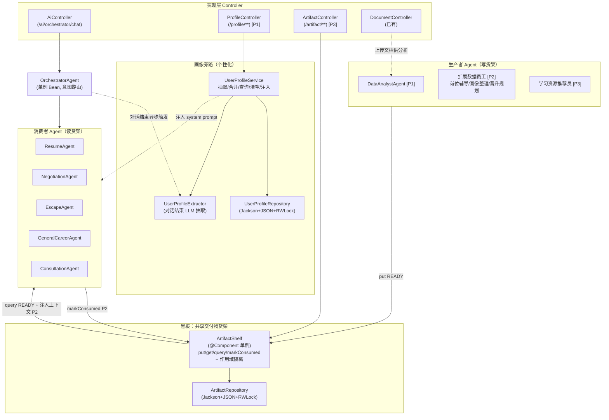
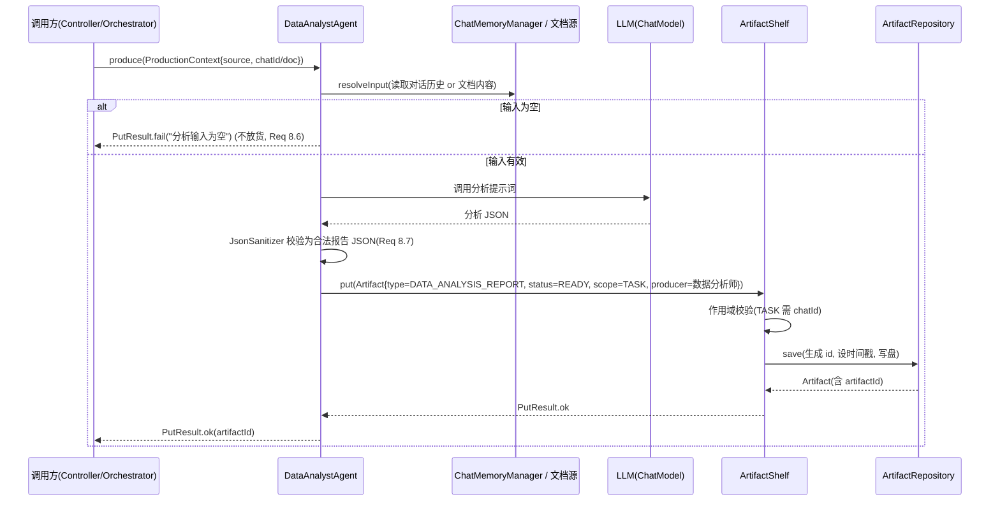
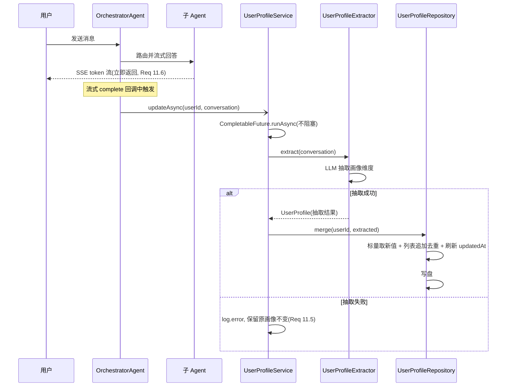
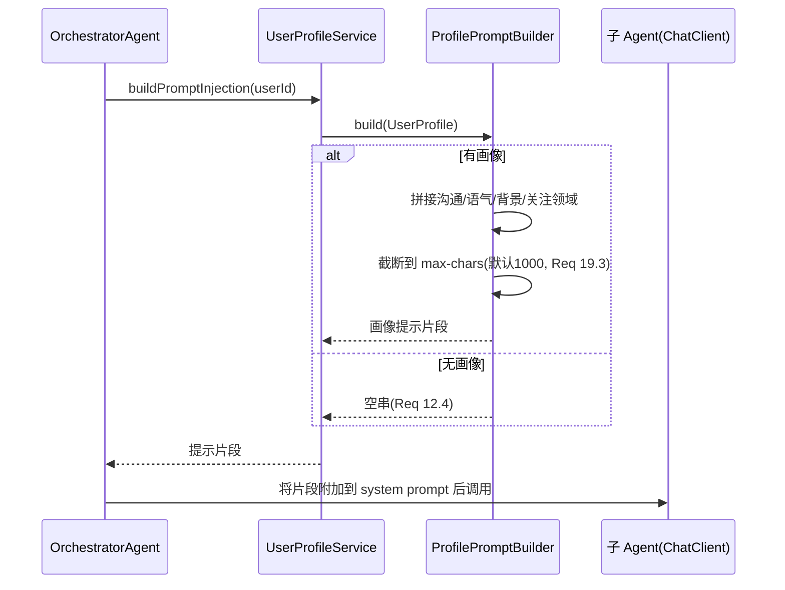
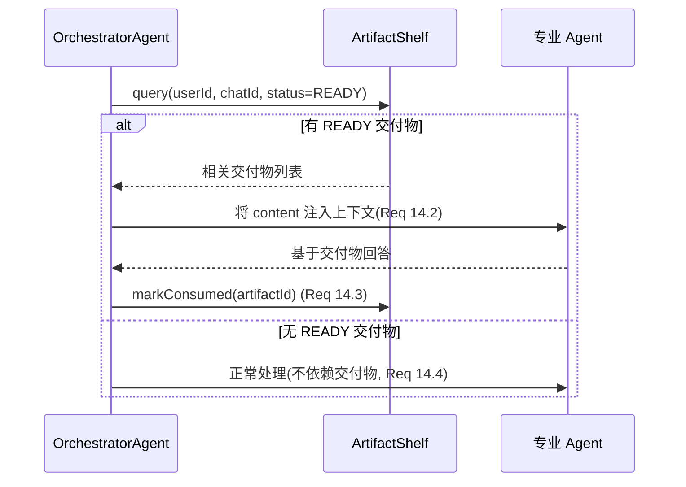

# Design Document: 数据员工 Agent、共享交付物货架与用户画像系统

## 1. Overview（概述）

本设计在现有职场 AI Agent 系统（Java 21 + Spring Boot 3.4 + Spring AI 1.0）之上，引入三套相互配合的能力，整体遵循"黑板模式（Blackboard Pattern）"：

- **共享交付物货架（Artifact Shelf）**：多 Agent 协作的"黑板"基础设施。上游 Agent 产出交付物（Artifact）放入货架，下游 Agent 按需查询、取用并标记消费。货架支持两种作用域：`USER_PROFILE`（按 userId 长期累积，跨会话）与 `TASK`（按 chatId 会话级存储）。
- **数据员工 Agent（Data Employee Agent）**：一类专注"数据加工"的 Agent 抽象。第一期落地数据分析师（DataAnalystAgent），分析用户对话历史或上传文档，产出结构化 JSON 分析报告并放入货架。
- **用户画像系统（User Profile System）**：每次对话结束后异步抽取并更新用户画像（沟通偏好、语气偏好、关注领域、已知背景、历史诉求），将画像注入各 Agent 的 system prompt 实现个性化；用户可查看与清空自己的画像。

### 1.1 设计目标与对齐原则

| 目标 | 对齐方式 |
|------|---------|
| 持久化风格一致 | `ArtifactRepository` / `UserProfileRepository` 完全复用 `AppointmentRepository` 的范式：`ObjectMapper + JavaTimeModule`、`ConcurrentHashMap` 内存索引、`ReadWriteLock`、`@PostConstruct` 加载、`@Value` 配置存储目录、`writerWithDefaultPrettyPrinter` 写盘 |
| Bean 注入风格一致 | 货架/画像组件用 `@Component`/`@Repository`/`@Service` 注册为单例；数据员工 Agent 通过 `AgentConfig` 以 `@Bean` 装配（与 `OrchestratorAgent` 一致），注入 `ChatModel`、`ArtifactShelf` 等协作者 |
| 不阻塞响应 | 画像抽取在对话结束后通过 `CompletableFuture.runAsync` 异步执行，与 `OrchestratorAgent.chatStream` 现有异步范式一致 |
| 渐进交付 | 严格按 requirements 的 P1/P2/P3 优先级落地，P1 为完整闭环，P2/P3 留出扩展点 |

### 1.2 交付优先级映射

- **P1（地基 + 最小闭环）**：货架基础设施（Req 1–6）、数据员工抽象 + 数据分析师（Req 7–8）、用户画像系统含查看/清空（Req 9–13）。本文档对 P1 做**详细设计**。
- **P2**：下游 Agent 自动取用交付物（Req 14）、扩展数据员工（Req 15）。本文档做**概要设计**。
- **P3**：学习资源推荐员（Req 16）、管理员前端交付物展示（Req 17）、画像前端入口（Req 18）、画像驱动个性化增强（Req 19）。本文档做**概要设计**。

---

## 2. Architecture（系统架构）

### 2.1 黑板模式总览



### 2.2 数据流分层

| 层 | 组件 | 职责 | 新增/修改 |
|----|------|------|----------|
| 表现层 | `ProfileController` | 用户查看/清空画像（JWT 校验） | 新增 [P1] |
| 表现层 | `ArtifactController` | 管理员查询/查看交付物 | 新增 [P3] |
| 表现层 | `AiController` | 在对话结束后触发画像更新 | 修改 [P1] |
| Agent 层 | `OrchestratorAgent` | 注入画像到子 Agent；对话结束触发抽取 | 修改 [P1] |
| Agent 层 | `DataEmployeeAgent`（抽象） | 数据员工统一执行入口 + 放货 | 新增 [P1] |
| Agent 层 | `DataAnalystAgent` | 分析对话/文档，产出报告交付物 | 新增 [P1] |
| 服务层 | `ArtifactShelf` | 黑板：放货/读取/查询/消费/作用域隔离 | 新增 [P1] |
| 服务层 | `UserProfileService` | 画像抽取编排、合并、查询、清空、注入 | 新增 [P1] |
| 服务层 | `UserProfileExtractor` | 基于对话内容 LLM 抽取画像维度 | 新增 [P1] |
| 数据层 | `ArtifactRepository` | 交付物文件持久化 | 新增 [P1] |
| 数据层 | `UserProfileRepository` | 画像文件持久化 | 新增 [P1] |

### 2.3 包结构规划

```
com.yupi.yuaiagent
├── artifact                      # 共享交付物货架 [P1]
│   ├── model
│   │   ├── Artifact.java
│   │   ├── ArtifactStatus.java   # PENDING / READY / CONSUMED
│   │   ├── ArtifactScope.java    # USER_PROFILE / TASK
│   │   └── ArtifactQuery.java    # 查询条件封装
│   ├── ArtifactRepository.java   # @Repository 文件持久化
│   └── ArtifactShelf.java        # @Component 单例黑板
├── agent
│   └── data                      # 数据员工 [P1/P2/P3]
│       ├── DataEmployeeAgent.java        # 抽象基类
│       ├── DataAnalystAgent.java         # 数据分析师 [P1]
│       ├── AnalysisSource.java           # CONVERSATION / UPLOADED_DOCUMENT
│       └── AnalysisReport.java           # 结构化报告 DTO
├── profile                       # 用户画像系统 [P1]
│   ├── model
│   │   ├── UserProfile.java
│   │   └── CommunicationPreference.java  # CONCISE / DETAILED
│   ├── UserProfileRepository.java        # @Repository 文件持久化
│   ├── UserProfileService.java           # @Service 编排
│   ├── UserProfileExtractor.java         # @Component LLM 抽取
│   └── ProfilePromptBuilder.java         # 画像 → system prompt 片段（含字符上限）
└── controller
    ├── ProfileController.java    # [P1]
    └── ArtifactController.java   # [P3]
```

---

## 3. Components and Interfaces（组件与接口设计）

### 3.1 ArtifactShelf（黑板核心，@Component 单例）[P1]

货架是放货/读取/查询/消费的唯一入口，封装作用域隔离逻辑，并委托 `ArtifactRepository` 持久化。

```java
package com.yupi.yuaiagent.artifact;

import com.yupi.yuaiagent.artifact.model.Artifact;
import com.yupi.yuaiagent.artifact.model.ArtifactQuery;
import com.yupi.yuaiagent.artifact.model.ArtifactScope;
import com.yupi.yuaiagent.artifact.model.ArtifactStatus;
import lombok.extern.slf4j.Slf4j;
import org.springframework.stereotype.Component;

import jakarta.annotation.Resource;
import java.util.List;
import java.util.Optional;

/**
 * 共享交付物货架（黑板模式核心）。
 * 线程安全由底层 ArtifactRepository 的读写锁保证；本类自身无可变状态。
 */
@Slf4j
@Component
public class ArtifactShelf {

    @Resource
    private ArtifactRepository artifactRepository;

    /**
     * 放货：保存或更新交付物。
     * - 未指定 artifactId 时生成全局唯一 id（UUID）
     * - 创建时设置 createdAt / updatedAt；再次放货同一 id 时仅刷新 updatedAt
     * - 作用域校验：scope=TASK 必须提供 chatId，否则返回参数错误
     *
     * @return 放货结果，成功时携带最终的 Artifact（含 artifactId）
     */
    public PutResult put(Artifact artifact) { /* 见 3.1.1 */ return null; }

    /** 按 artifactId 读取；不存在返回 Optional.empty()，绝不抛异常 */
    public Optional<Artifact> get(String artifactId) {
        return artifactRepository.findById(artifactId);
    }

    /**
     * 多条件查询：userId / chatId / type 任意组合（AND 语义），
     * 可选按 status 过滤；结果按 createdAt 倒序返回，无匹配返回空列表。
     */
    public List<Artifact> query(ArtifactQuery condition) { /* 见 3.1.2 */ return List.of(); }

    /**
     * 标记消费：将 status 置为 CONSUMED 并刷新 updatedAt。
     * 幂等：重复调用最终状态一致。id 不存在返回 false（不抛异常）。
     */
    public boolean markConsumed(String artifactId) { /* 见 3.1.3 */ return false; }

    /** 放货结果 DTO */
    public record PutResult(boolean success, String artifactId, String errorMessage, Artifact artifact) {
        public static PutResult ok(Artifact a) { return new PutResult(true, a.getArtifactId(), null, a); }
        public static PutResult fail(String msg) { return new PutResult(false, null, msg, null); }
    }
}
```

#### 3.1.1 put 关键逻辑（作用域隔离 + id/时间戳）

```java
public PutResult put(Artifact artifact) {
    if (artifact == null) return PutResult.fail("交付物不能为空");
    // 作用域校验（Req 6.4）
    if (artifact.getScope() == ArtifactScope.TASK
            && (artifact.getChatId() == null || artifact.getChatId().isBlank())) {
        return PutResult.fail("TASK 作用域交付物必须提供 chatId");
    }
    if (artifact.getScope() == ArtifactScope.USER_PROFILE
            && (artifact.getUserId() == null || artifact.getUserId().isBlank())) {
        return PutResult.fail("USER_PROFILE 作用域交付物必须提供 userId");
    }
    Artifact saved = artifactRepository.save(artifact); // 仓库内生成 id、设置/刷新时间戳
    return PutResult.ok(saved);
}
```

> 作用域隔离说明：货架并不为不同作用域使用不同存储桶，而是以 `scope` + 归属键（USER_PROFILE→userId，TASK→chatId）作为查询语义的约束。`USER_PROFILE` 交付物按 userId 长期累积、跨会话可查；`TASK` 交付物按 chatId 会话级归属。

#### 3.1.2 query 关键逻辑

```java
public List<Artifact> query(ArtifactQuery c) {
    return artifactRepository.findAll().stream()
            .filter(a -> c.getUserId() == null || c.getUserId().equals(a.getUserId()))
            .filter(a -> c.getChatId() == null || c.getChatId().equals(a.getChatId()))
            .filter(a -> c.getType()   == null || c.getType().equals(a.getType()))
            .filter(a -> c.getScope()  == null || c.getScope().equals(a.getScope()))
            .filter(a -> c.getStatus() == null || c.getStatus().equals(a.getStatus()))
            .sorted((x, y) -> y.getCreatedAt().compareTo(x.getCreatedAt())) // createdAt 倒序
            .toList();
}
```

#### 3.1.3 markConsumed 关键逻辑（幂等）

```java
public boolean markConsumed(String artifactId) {
    return artifactRepository.updateStatus(artifactId, ArtifactStatus.CONSUMED).isPresent();
    // 已是 CONSUMED 再次标记：仍写入 CONSUMED 并刷新 updatedAt，最终状态不变（幂等）
}
```

### 3.2 ArtifactRepository（文件持久化，@Repository）[P1]

完全对齐 `AppointmentRepository`：`ObjectMapper + JavaTimeModule`、`ConcurrentHashMap`、`ReadWriteLock`、`@PostConstruct` 加载、`@Value` 配置目录。

```java
@Slf4j
@Repository
public class ArtifactRepository {

    @Value("${artifact.storage.dir:./tmp/artifacts}")
    private String storageDir;

    private final ObjectMapper objectMapper;
    private final Map<String, Artifact> artifacts = new ConcurrentHashMap<>();
    private final ReadWriteLock lock = new ReentrantReadWriteLock();
    private File storageFile;

    public ArtifactRepository() {
        this.objectMapper = new ObjectMapper();
        this.objectMapper.registerModule(new JavaTimeModule());
    }

    @PostConstruct
    public void init() {
        try {
            File dir = new File(storageDir);
            if (!dir.exists()) dir.mkdirs();
            storageFile = new File(dir, "artifacts.json");
            loadFromFile();                       // 读取成功则加载；失败则记录日志 + 空集合
            log.info("交付物存储初始化完成，路径：{}", storageFile.getAbsolutePath());
        } catch (Exception e) {
            log.error("初始化交付物存储失败", e);  // Req 2.6：记录日志且以空集合完成初始化
        }
    }

    /** 保存或更新：生成 id、维护 createdAt/updatedAt，写盘 */
    public Artifact save(Artifact artifact) {
        lock.writeLock().lock();
        try {
            if (artifact.getArtifactId() == null || artifact.getArtifactId().isEmpty()) {
                artifact.setArtifactId(UUID.randomUUID().toString());
            }
            Artifact existing = artifacts.get(artifact.getArtifactId());
            LocalDateTime now = LocalDateTime.now();
            if (existing == null && artifact.getCreatedAt() == null) {
                artifact.setCreatedAt(now);
            } else if (existing != null) {
                artifact.setCreatedAt(existing.getCreatedAt()); // 更新保留原 createdAt
            }
            artifact.setUpdatedAt(now);
            artifacts.put(artifact.getArtifactId(), artifact);
            saveToFile();
            return artifact;
        } finally { lock.writeLock().unlock(); }
    }

    public Optional<Artifact> findById(String id) { /* 读锁 */ return Optional.ofNullable(artifacts.get(id)); }
    public List<Artifact> findAll() { /* 读锁，返回快照 */ return new ArrayList<>(artifacts.values()); }

    public Optional<Artifact> updateStatus(String id, ArtifactStatus status) {
        lock.writeLock().lock();
        try {
            Artifact a = artifacts.get(id);
            if (a == null) return Optional.empty();
            a.setStatus(status);
            a.setUpdatedAt(LocalDateTime.now());
            saveToFile();
            return Optional.of(a);
        } finally { lock.writeLock().unlock(); }
    }

    private void loadFromFile() { /* 同 AppointmentRepository：存在且非空才读，异常仅 log.error */ }
    private void saveToFile()   { /* writerWithDefaultPrettyPrinter().writeValue(storageFile, artifacts) */ }
}
```

### 3.3 DataEmployeeAgent（数据员工抽象基类）[P1]

定义数据员工"加工 → 封装 Artifact → 放货"的统一模板，子类只实现具体加工逻辑。

```java
package com.yupi.yuaiagent.agent.data;

import com.yupi.yuaiagent.artifact.ArtifactShelf;
import com.yupi.yuaiagent.artifact.model.Artifact;
import com.yupi.yuaiagent.artifact.model.ArtifactScope;
import com.yupi.yuaiagent.artifact.model.ArtifactStatus;

/**
 * 数据员工 Agent 抽象基类。
 * 统一执行入口 produce(...)，封装放货流程；producer 恒为子类标识名。
 */
public abstract class DataEmployeeAgent {

    protected final ArtifactShelf artifactShelf;

    protected DataEmployeeAgent(ArtifactShelf artifactShelf) {
        this.artifactShelf = artifactShelf;
    }

    /** 数据员工标识名称（如 "数据分析师"），写入 Artifact.producer */
    public abstract String producerName();

    /** 子类实现的数据加工逻辑，返回加工结果（内容 + 类型 + 标题），不负责放货 */
    protected abstract ProductionResult doProduce(ProductionContext context);

    /**
     * 统一执行入口：加工 → 组装 Artifact（producer/scope/status）→ 放货。
     * 默认作用域为 TASK（会话内任务交付物，Req 7.4）。
     */
    public final ArtifactShelf.PutResult produce(ProductionContext ctx) {
        ProductionResult r = doProduce(ctx);
        if (!r.success()) {
            return ArtifactShelf.PutResult.fail(r.errorMessage()); // 加工失败不放货（Req 8.6）
        }
        Artifact artifact = Artifact.builder()
                .userId(ctx.userId())
                .chatId(ctx.chatId())
                .type(r.type())
                .producer(producerName())              // Req 7.3 / 15.4
                .title(r.title())
                .content(r.content())
                .scope(r.scope() != null ? r.scope() : ArtifactScope.TASK) // Req 7.4
                .status(ArtifactStatus.READY)          // Req 8.5
                .build();
        return artifactShelf.put(artifact);
    }
}
```

`ProductionContext` / `ProductionResult` 为简单不可变记录（record），承载 userId、chatId、输入来源、加工产物等。

### 3.4 DataAnalystAgent（数据分析师）[P1]

```java
@Slf4j
public class DataAnalystAgent extends DataEmployeeAgent {

    private static final String PRODUCER = "数据分析师";
    private static final String ARTIFACT_TYPE = "DATA_ANALYSIS_REPORT";

    private static final String ANALYSIS_PROMPT = """
            你是一名严谨的数据分析师。请基于以下输入数据进行分析，并仅输出 JSON，结构如下：
            {
              "summary": "整体分析摘要",
              "keyFindings": ["关键发现1", "关键发现2"],
              "metrics": {"对话轮数": 12, "主要话题": "薪资谈判"},
              "recommendations": ["建议1", "建议2"]
            }
            输入数据：
            {input}
            """;

    private final ChatClient chatClient;
    private final ChatMemoryManager chatMemoryManager;

    public DataAnalystAgent(ChatModel chatModel, ChatMemoryManager chatMemoryManager,
                            ArtifactShelf artifactShelf) {
        super(artifactShelf);
        this.chatMemoryManager = chatMemoryManager;
        this.chatClient = ChatClient.builder(chatModel)
                .defaultAdvisors(new MyLoggerAdvisor())
                .build();
    }

    @Override
    public String producerName() { return PRODUCER; }

    @Override
    protected ProductionResult doProduce(ProductionContext ctx) {
        String input = resolveInput(ctx);          // 见下
        if (input == null || input.isBlank()) {
            return ProductionResult.fail("分析输入为空或无法获取");   // Req 8.6
        }
        String json = chatClient.prompt()
                .user(ANALYSIS_PROMPT.replace("{input}", input))
                .call().content();
        String safeJson = JsonSanitizer.ensureValidReport(json);     // 校验/兜底为合法报告 JSON（Req 8.7）
        return ProductionResult.ok(ARTIFACT_TYPE, "数据分析报告", safeJson, ArtifactScope.TASK);
    }

    /** 按来源解析分析输入：CONVERSATION 读取 chatId 对话历史；UPLOADED_DOCUMENT 读取上传文档 */
    private String resolveInput(ProductionContext ctx) {
        return switch (ctx.source()) {
            case CONVERSATION -> formatMessages(
                    chatMemoryManager.getMemory(ctx.memoryAgentType()).get(ctx.chatId()));
            case UPLOADED_DOCUMENT -> ctx.documentContent();
        };
    }
}
```

`AnalysisSource` 枚举：`CONVERSATION`、`UPLOADED_DOCUMENT`（Req 8.1）。

### 3.5 UserProfileService / UserProfileExtractor / ProfilePromptBuilder [P1]

```java
@Slf4j
@Service
public class UserProfileService {

    @Resource private UserProfileRepository repository;
    @Resource private UserProfileExtractor extractor;
    @Resource private ProfilePromptBuilder promptBuilder;

    /** 对话结束后异步触发：抽取 → 合并 → 持久化（Req 11） */
    public void updateAsync(String userId, List<Message> conversation) {
        CompletableFuture.runAsync(() -> {
            try {
                UserProfile extracted = extractor.extract(conversation);   // LLM 抽取
                repository.merge(userId, extracted);                        // 合并去重 + updatedAt
            } catch (Exception e) {
                log.error("用户 {} 画像抽取失败，保留原画像不变", userId, e); // Req 11.5
            }
        });
    }

    public Optional<UserProfile> get(String userId) { return repository.findByUserId(userId); }
    public void clear(String userId) { repository.deleteByUserId(userId); } // Req 13.3

    /** 生成注入用 system prompt 片段（含字符上限，Req 12 / 19） */
    public String buildPromptInjection(String userId) {
        return repository.findByUserId(userId)
                .map(promptBuilder::build)     // 无画像返回空串 → 默认 prompt（Req 12.4）
                .orElse("");
    }
}
```

`ProfilePromptBuilder.build(UserProfile)` 规则：

- 沟通偏好 `CONCISE` → 追加"请用简洁方式回答"；`DETAILED` → "请用详细方式回答"（Req 12.2/12.3）。
- 语气偏好、已知背景纳入提示（Req 19.1/19.2）。
- 最终片段长度受配置 `profile.injection.max-chars`（默认 1000）约束，超出则截断（Req 19.3）。

```java
@Component
public class ProfilePromptBuilder {
    @Value("${profile.injection.max-chars:1000}")
    private int maxChars;

    public String build(UserProfile p) {
        if (p == null) return "";
        StringBuilder sb = new StringBuilder("【用户画像】");
        if (p.getCommunicationPreference() == CommunicationPreference.CONCISE)
            sb.append("请用简洁方式回答。");
        else if (p.getCommunicationPreference() == CommunicationPreference.DETAILED)
            sb.append("请用详细方式回答。");
        if (p.getTonePreference() != null) sb.append("语气偏好：").append(p.getTonePreference()).append("。");
        if (p.getKnownBackground() != null) sb.append("已知背景：").append(p.getKnownBackground()).append("。");
        if (!CollectionUtils.isEmpty(p.getFocusAreas()))
            sb.append("关注领域：").append(String.join("、", p.getFocusAreas())).append("。");
        String s = sb.toString();
        return s.length() > maxChars ? s.substring(0, maxChars) : s; // Req 19.3
    }
}
```

### 3.6 UserProfileRepository（文件持久化 + 合并去重）[P1]

```java
@Slf4j
@Repository
public class UserProfileRepository {

    @Value("${user-profile.storage.dir:./tmp/user-profiles}")
    private String storageDir;

    private final ObjectMapper objectMapper;                 // + JavaTimeModule
    private final Map<String, UserProfile> profiles = new ConcurrentHashMap<>(); // userId -> profile（唯一）
    private final ReadWriteLock lock = new ReentrantReadWriteLock();
    private File storageFile;

    @PostConstruct public void init() { /* 同 AppointmentRepository 范式 */ }

    public Optional<UserProfile> findByUserId(String userId) { /* 读锁 */ return Optional.ofNullable(profiles.get(userId)); }

    /** 合并抽取结果到既有画像：标量取新值、列表追加去重、刷新 updatedAt（Req 11.2/11.3/11.4） */
    public UserProfile merge(String userId, UserProfile extracted) {
        lock.writeLock().lock();
        try {
            UserProfile base = profiles.get(userId);
            LocalDateTime now = LocalDateTime.now();
            if (base == null) {
                extracted.setUserId(userId);
                extracted.setCreatedAt(now);
                extracted.setUpdatedAt(now);
                profiles.put(userId, extracted);
                saveToFile();
                return extracted;
            }
            // 标量维度：新值非空则覆盖（较新值优先，Req 11.3）
            if (extracted.getCommunicationPreference() != null)
                base.setCommunicationPreference(extracted.getCommunicationPreference());
            if (extracted.getTonePreference() != null) base.setTonePreference(extracted.getTonePreference());
            if (extracted.getKnownBackground() != null) base.setKnownBackground(extracted.getKnownBackground());
            // 列表维度：追加去重（Req 11.4）
            base.setFocusAreas(mergeDistinct(base.getFocusAreas(), extracted.getFocusAreas()));
            base.setHistoricalDemands(mergeDistinct(base.getHistoricalDemands(), extracted.getHistoricalDemands()));
            base.setUpdatedAt(now);                          // updatedAt >= createdAt（Req 9.6）
            saveToFile();
            return base;
        } finally { lock.writeLock().unlock(); }
    }

    public void deleteByUserId(String userId) {
        lock.writeLock().lock();
        try { profiles.remove(userId); saveToFile(); }       // Req 13.3 删除并持久化
        finally { lock.writeLock().unlock(); }
    }

    private static List<String> mergeDistinct(List<String> a, List<String> b) {
        LinkedHashSet<String> set = new LinkedHashSet<>();   // 保序去重
        if (a != null) set.addAll(a);
        if (b != null) set.addAll(b);
        return new ArrayList<>(set);
    }
}
```

---

## 4. Data Models（数据模型）

### 4.1 Artifact（交付物实体）[P1]

```java
package com.yupi.yuaiagent.artifact.model;

import lombok.*;
import java.time.LocalDateTime;

@Data
@Builder
@NoArgsConstructor
@AllArgsConstructor
public class Artifact {
    /** 全局唯一 ID（未指定时由仓库生成 UUID） */
    private String artifactId;
    /** 归属用户（USER_PROFILE 作用域的归属键） */
    private String userId;
    /** 归属会话（TASK 作用域的归属键） */
    private String chatId;
    /** 交付物类型，如 DATA_ANALYSIS_REPORT */
    private String type;
    /** 生产者标识名（数据员工名称） */
    private String producer;
    /** 标题 */
    private String title;
    /** 内容：结构化 JSON 字符串或纯文本，二者皆以 String 承载（Req 1.4） */
    private String content;
    /** 状态 */
    private ArtifactStatus status;
    /** 作用域 */
    private ArtifactScope scope;
    private LocalDateTime createdAt;
    private LocalDateTime updatedAt;
}
```

> `content` 字段统一以 `String` 承载：结构化 JSON 以序列化后的 JSON 字符串存储，纯文本直接存储，从而同时支持两种内容（Req 1.4）并天然满足序列化往返一致。

```java
public enum ArtifactStatus { PENDING, READY, CONSUMED }     // Req 1.2

public enum ArtifactScope  { USER_PROFILE, TASK }           // Req 1.3
```

`ArtifactQuery`（查询条件，全部可选，null 表示不约束）：

```java
@Data @Builder
public class ArtifactQuery {
    private String userId;
    private String chatId;
    private String type;
    private ArtifactScope scope;
    private ArtifactStatus status;
}
```

### 4.2 UserProfile（用户画像实体）[P1]

```java
package com.yupi.yuaiagent.profile.model;

import lombok.*;
import java.time.LocalDateTime;
import java.util.List;

@Data
@Builder
@NoArgsConstructor
@AllArgsConstructor
public class UserProfile {
    /** 唯一标识：每个 userId 至多一份画像（Req 9.1） */
    private String userId;
    /** 沟通偏好（Req 9.3） */
    private CommunicationPreference communicationPreference;
    /** 语气偏好（如 鼓励型/直接型） */
    private String tonePreference;
    /** 关注领域（列表，去重累积，Req 9.4） */
    private List<String> focusAreas;
    /** 已知背景（如 行业、岗位、年限） */
    private String knownBackground;
    /** 历史诉求（列表，去重累积，Req 9.4） */
    private List<String> historicalDemands;
    private LocalDateTime createdAt;
    /** 始终 >= createdAt（Req 9.6） */
    private LocalDateTime updatedAt;
}
```

```java
public enum CommunicationPreference { CONCISE, DETAILED }   // Req 9.3
```

### 4.3 数据员工辅助模型 [P1]

```java
public enum AnalysisSource { CONVERSATION, UPLOADED_DOCUMENT }   // Req 8.1

/** 数据员工执行上下文 */
public record ProductionContext(
        String userId, String chatId,
        AnalysisSource source, String memoryAgentType,
        String documentContent) {}

/** 数据员工加工结果（放货前的中间产物） */
public record ProductionResult(
        boolean success, String errorMessage,
        String type, String title, String content, ArtifactScope scope) {
    public static ProductionResult ok(String type, String title, String content, ArtifactScope scope) {
        return new ProductionResult(true, null, type, title, content, scope);
    }
    public static ProductionResult fail(String msg) {
        return new ProductionResult(false, msg, null, null, null, null);
    }
}

/** 数据分析报告结构化内容（序列化为 Artifact.content） */
@Data @Builder
public class AnalysisReport {
    private String summary;                 // 分析摘要（Req 8.7）
    private List<String> keyFindings;       // 关键发现（Req 8.7）
    private Map<String, Object> metrics;
    private List<String> recommendations;
}
```

### 4.4 配置项（application.yml 新增）

```yaml
# 交付物货架存储配置
artifact:
  storage:
    dir: ${ARTIFACT_STORAGE_DIR:./tmp/artifacts}     # Req 2.8
# 用户画像存储配置
user-profile:
  storage:
    dir: ${USER_PROFILE_STORAGE_DIR:./tmp/user-profiles}   # Req 10.6
# 画像注入配置
profile:
  injection:
    max-chars: ${PROFILE_INJECTION_MAX_CHARS:1000}   # Req 19.3
```

---

## 5. 接口设计（REST API）

### 5.1 ProfileController（用户画像接口，JWT 校验）[P1]

挂载在现有 `/api` context-path 下，鉴权风格复用 `JwtUtil.validateToken`（与 `AiController` 一致：支持 `Authorization: Bearer` 头）。仅允许用户操作与其 JWT `userId` 匹配的画像。

```java
@RestController
@RequestMapping("/profile")
@Slf4j
public class ProfileController {

    @Resource private UserProfileService userProfileService;
    @Resource private JwtUtil jwtUtil;

    /** 查看当前用户画像；无画像返回空结果（Req 13.1/13.2） */
    @GetMapping("/me")
    public Result<UserProfile> getMyProfile(
            @RequestHeader(value = "Authorization", required = false) String authHeader) {
        String userId = requireUserId(authHeader);                    // 无效 JWT → 抛未授权
        if (userId == null) return Result.error(401, "未授权，请先登录"); // Req 13.5
        return Result.success(userProfileService.get(userId).orElse(null));
    }

    /** 清空当前用户画像并持久化（Req 13.3） */
    @DeleteMapping("/me")
    public Result<String> clearMyProfile(
            @RequestHeader(value = "Authorization", required = false) String authHeader) {
        String userId = requireUserId(authHeader);
        if (userId == null) return Result.error(401, "未授权，请先登录"); // Req 13.5
        userProfileService.clear(userId);
        return Result.success("画像已清空");
    }

    private String requireUserId(String authHeader) {
        if (authHeader == null || !authHeader.startsWith("Bearer ")) return null;
        return jwtUtil.validateToken(authHeader.substring(7));
    }
}
```

| 方法 | 路径 | 鉴权 | 说明 | 关联需求 |
|------|------|------|------|---------|
| GET | `/api/profile/me` | JWT | 查看本人画像，无则返回 null | 13.1, 13.2, 13.4, 13.5 |
| DELETE | `/api/profile/me` | JWT | 清空本人画像并持久化 | 13.3, 13.4, 13.5 |

> 仅暴露 `/me` 语义接口，userId 始终取自 JWT 而非请求参数，从根本上保证"只能操作自己的画像"（Req 13.4），无法越权访问他人画像。

### 5.2 ArtifactController（管理员交付物接口）[P3]

```java
@RestController
@RequestMapping("/artifact")
@Slf4j
public class ArtifactController {

    @Resource private ArtifactShelf artifactShelf;
    @Resource private JwtUtil jwtUtil;            // 管理员权限校验（基于角色，P3 细化）

    /** 管理员按 userId/chatId/type 查询交付物列表（仅返回摘要字段，Req 17.1/17.2） */
    @GetMapping("/list")
    public Result<List<ArtifactSummary>> list(
            @RequestParam(required = false) String userId,
            @RequestParam(required = false) String chatId,
            @RequestParam(required = false) String type,
            @RequestHeader(value = "Authorization", required = false) String authHeader) {
        if (!isAdmin(authHeader)) return Result.error(403, "需要管理员权限"); // Req 17.4/17.5
        List<Artifact> list = artifactShelf.query(ArtifactQuery.builder()
                .userId(userId).chatId(chatId).type(type).build());
        return Result.success(list.stream().map(ArtifactSummary::from).toList());
    }

    /** 管理员查看交付物完整内容（Req 17.3） */
    @GetMapping("/{artifactId}")
    public Result<Artifact> detail(
            @PathVariable String artifactId,
            @RequestHeader(value = "Authorization", required = false) String authHeader) {
        if (!isAdmin(authHeader)) return Result.error(403, "需要管理员权限"); // Req 17.5：不返回任何数据
        return Result.success(artifactShelf.get(artifactId).orElse(null));
    }
}
```

`ArtifactSummary`：仅含 `artifactId、type、producer、title、status、createdAt`（Req 17.2，避免列表接口泄露完整 content）。

| 方法 | 路径 | 鉴权 | 说明 | 关联需求 |
|------|------|------|------|---------|
| GET | `/api/artifact/list` | 管理员 | 按条件查询交付物摘要 | 17.1, 17.2, 17.4, 17.5 |
| GET | `/api/artifact/{artifactId}` | 管理员 | 查看交付物完整 content | 17.3, 17.4, 17.5 |

---

## 6. 关键流程设计

### 6.1 数据分析产出交付物流程 [P1]



### 6.2 对话结束画像更新流程（异步，不阻塞响应）[P1]



### 6.3 画像注入流程 [P1]



> 注入实现：子 Agent 在每次请求时通过 `ChatClient.prompt().system(baseSystem + injection)` 动态拼接，而非固定 `defaultSystem`，使画像随请求 userId 变化生效。

### 6.4 下游 Agent 自动取用交付物流程 [P2]



---

## 7. 与现有代码的集成点

### 7.1 AgentConfig 装配数据员工（@Bean，对齐现有风格）[P1]

```java
@Configuration
public class AgentConfig {
    // ... 既有 orchestratorAgent Bean 保持不变

    @Bean
    public DataAnalystAgent dataAnalystAgent(
            ChatModel dashscopeChatModel,
            ChatMemoryManager chatMemoryManager,
            ArtifactShelf artifactShelf) {
        return new DataAnalystAgent(dashscopeChatModel, chatMemoryManager, artifactShelf);
    }
}
```

`ArtifactShelf`、`ArtifactRepository`、`UserProfileService`、`UserProfileExtractor`、`UserProfileRepository`、`ProfilePromptBuilder` 均由组件扫描自动注册为单例（`@Component`/`@Repository`/`@Service`），无需在 `AgentConfig` 手动声明。

### 7.2 OrchestratorAgent 集成画像注入与对话结束触发 [P1]

`OrchestratorAgent` 当前为单例 Bean。集成方式：

1. **构造注入新依赖**：在构造函数追加 `UserProfileService userProfileService` 参数，并由 `AgentConfig.orchestratorAgent(...)` Bean 方法传入（Spring 自动解析）。
2. **画像注入**：在 `routeToAgent` 路由前调用 `userProfileService.buildPromptInjection(userId)`，将片段透传给子 Agent 的 `chatStream` 重载（子 Agent 增加可选 `profileInjection` 参数，拼到 system prompt 后）。
   - 需将 `userId` 传入 `chatStream`/`routeToAgent`（当前仅有 `chatId`）。`AiController` 已解析出 `userId`，扩展 `orchestratorAgent.chatStream(message, chatId, userId)` 签名。
3. **对话结束触发**：在 `routeToAgent` 内子 Agent 流的 `.doOnComplete(...)` 回调里，调用 `userProfileService.updateAsync(userId, memory.get(chatId))`，与现有异步回调范式一致，不阻塞 SSE 输出（Req 11.6）。

```java
// OrchestratorAgent.routeToAgent 内（示意）
tokenFlux
    .doOnNext(...)
    .doOnError(...)
    .doOnComplete(() -> {
        emitter.complete();
        // 对话结束：异步更新画像（Req 11.1）
        userProfileService.updateAsync(userId,
                chatMemoryManager.getMemory(intent.memoryType()).get(chatId));
    })
    .subscribe();
```

### 7.3 AiController 集成 [P1]

`AiController.doChatWithOrchestrator` 已完成 JWT 校验并持有 `userId`。改动：将 `userId` 透传到 `orchestratorAgent.chatStream(message, chatId, userId)`，使画像注入与对话结束触发可获取 userId。其余鉴权/会话归属逻辑保持不变。

### 7.4 DocumentController 集成（数据分析师文档来源）[P1]

`DataAnalystAgent` 的 `UPLOADED_DOCUMENT` 来源复用 `DocumentController` 上传的文档内容。第一期通过 `ProductionContext.documentContent()` 直接传入待分析文本；后续可扩展为从向量库/文档存储按 userId+chatId 检索。

### 7.5 application.yml 集成 [P1]

新增 `artifact.storage.dir`、`user-profile.storage.dir`、`profile.injection.max-chars` 三项配置（见 4.4），默认值与现有 `appointment.storage.dir` 风格一致（`./tmp/...`）。

---
