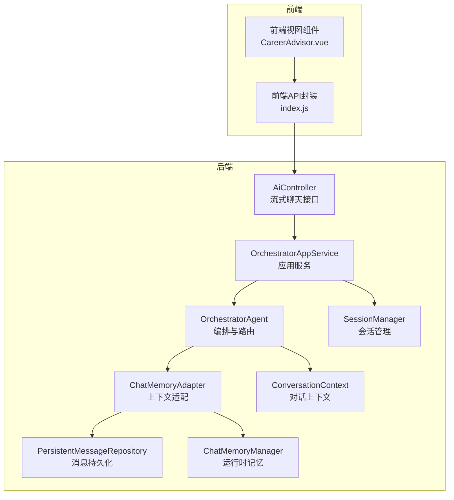
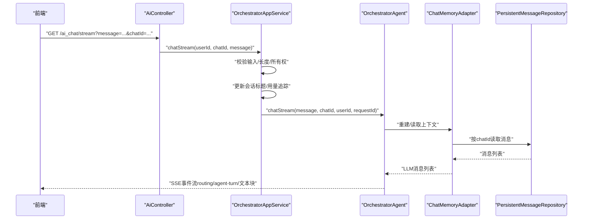
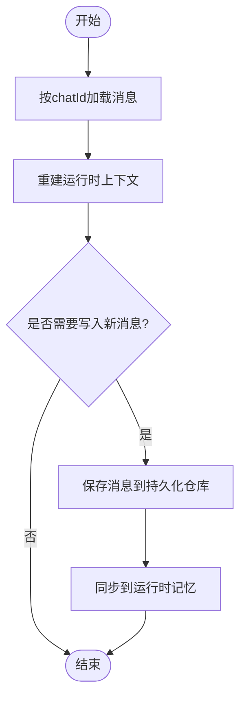
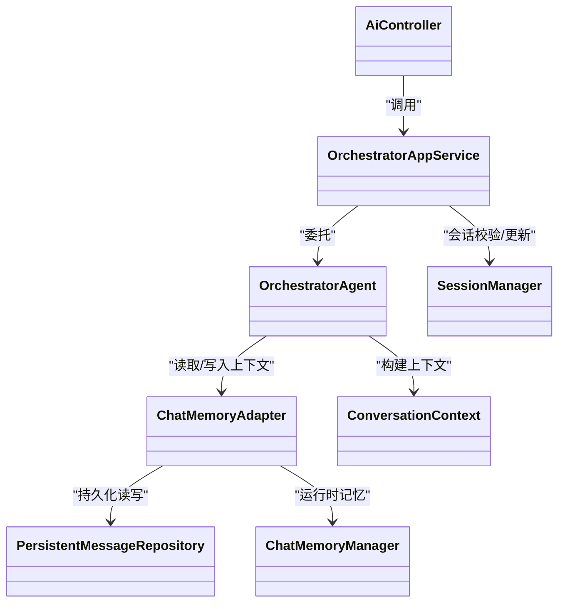

# AI聊天接口

<cite>
**本文引用的文件**
- [AiController.java](file://src/main/java/com/yupi/yuaiagent/controller/AiController.java)
- [OrchestratorAppService.java](file://src/main/java/com/yupi/yuaiagent/service/OrchestratorAppService.java)
- [SessionAppService.java](file://src/main/java/com/yupi/yuaiagent/service/SessionAppService.java)
- [PersistentChatMessage.java](file://src/main/java/com/yupi/yuaiagent/message/PersistentChatMessage.java)
- [PersistentMessageRepository.java](file://src/main/java/com/yupi/yuaiagent/message/PersistentMessageRepository.java)
- [ChatMemoryAdapter.java](file://src/main/java/com/yupi/yuaiagent/message/ChatMemoryAdapter.java)
- [ChatMemoryManager.java](file://src/main/java/com/yupi/yuaiagent/chatmemory/ChatMemoryManager.java)
- [ConversationContext.java](file://src/main/java/com/yupi/yuaiagent/context/ConversationContext.java)
- [OrchestratorAgent.java](file://src/main/java/com/yupi/yuaiagent/agent/OrchestratorAgent.java)
- [RouteHint.java](file://src/main/java/com/yupi/yuaiagent/nlu/RouteHint.java)
- [RouteTemplate.java](file://src/main/java/com/yupi/yuaiagent/nlu/RouteTemplate.java)
- [SessionManager.java](file://src/main/java/com/yupi/yuaiagent/session/SessionManager.java)
- [Response.java](file://src/main/java/com/yupi/yuaiagent/common/Response.java)
- [BusinessException.java](file://src/main/java/com/yupi/yuaiagent/exception/BusinessException.java)
- [GlobalExceptionHandler.java](file://src/main/java/com/yupi/yuaiagent/exception/GlobalExceptionHandler.java)
- [index.js](file://yu-ai-agent-frontend/src/api/index.js)
- [CareerAdvisor.vue](file://yu-ai-agent-frontend/src/views/CareerAdvisor.vue)
</cite>

## 目录
1. [简介](#简介)
2. [项目结构](#项目结构)
3. [核心组件](#核心组件)
4. [架构总览](#架构总览)
5. [详细组件分析](#详细组件分析)
6. [依赖关系分析](#依赖关系分析)
7. [性能考虑](#性能考虑)
8. [故障排查指南](#故障排查指南)
9. [结论](#结论)
10. [附录](#附录)

## 简介
本文件为AI聊天接口的详细API文档，聚焦于POST /api/ai_chat/message（或通过流式接口进行交互）的RESTful能力，涵盖以下要点：
- 聊天消息发送与流式响应
- 智能体选择与路由策略
- 上下文管理与会话状态
- 消息历史持久化与检索
- 请求格式、参数定义、响应结构与错误处理
- 对话轮数限制与内存压缩策略
- 前端集成指南与性能优化建议

注意：当前后端控制器未直接暴露“POST /api/ai_chat/message”这一路径；实际使用的是以SSE流式返回的接口。本文将围绕现有实现进行说明，并给出对接建议。

## 项目结构
后端采用分层架构，核心模块如下：
- 控制器层：AiController 提供多种聊天入口（Manus、RAG、工具调用等），并包含流式聊天接口
- 应用服务层：OrchestratorAppService 封装流式聊天业务逻辑
- 智能体与编排：OrchestratorAgent 负责意图识别、路由与多智能体协作
- 上下文与记忆：ConversationContext、ChatMemoryManager、ChatMemoryAdapter、PersistentMessageRepository
- 会话管理：SessionManager、SessionAppService
- 响应与异常：Response、BusinessException、GlobalExceptionHandler

图表来源
- [AiController.java:109-143](file://src/main/java/com/yupi/yuaiagent/controller/AiController.java#L109-L143)
- [OrchestratorAppService.java:42-68](file://src/main/java/com/yupi/yuaiagent/service/OrchestratorAppService.java#L42-L68)
- [OrchestratorAgent.java:364-378](file://src/main/java/com/yupi/yuaiagent/agent/OrchestratorAgent.java#L364-L378)
- [ChatMemoryAdapter.java:145-174](file://src/main/java/com/yupi/yuaiagent/message/ChatMemoryAdapter.java#L145-L174)
- [PersistentMessageRepository.java:46-74](file://src/main/java/com/yupi/yuaiagent/message/PersistentMessageRepository.java#L46-L74)
- [ChatMemoryManager.java](file://src/main/java/com/yupi/yuaiagent/chatmemory/ChatMemoryManager.java)
- [ConversationContext.java](file://src/main/java/com/yupi/yuaiagent/context/ConversationContext.java)
- [SessionManager.java](file://src/main/java/com/yupi/yuaiagent/session/SessionManager.java)

章节来源
- [AiController.java:109-143](file://src/main/java/com/yupi/yuaiagent/controller/AiController.java#L109-L143)
- [OrchestratorAppService.java:42-68](file://src/main/java/com/yupi/yuaiagent/service/OrchestratorAppService.java#L42-L68)
- [SessionAppService.java:38-75](file://src/main/java/com/yupi/yuaiagent/service/SessionAppService.java#L38-L75)

## 核心组件
- 控制器与流式接口
  - AiController提供SSE流式聊天接口，用于接收用户消息并返回流式响应
- 应用服务
  - OrchestratorAppService负责输入校验、会话所有权检查、标题更新、用量追踪与委托给OrchestratorAgent
- 编排与路由
  - OrchestratorAgent执行意图识别、路由决策、多智能体协作与流式输出
- 记忆与上下文
  - ChatMemoryAdapter将持久化消息重建为运行时上下文，支持从持久存储恢复
  - ChatMemoryManager管理不同智能体类型的运行时记忆
  - PersistentMessageRepository提供消息持久化与索引
- 会话管理
  - SessionManager与SessionAppService负责会话生命周期、权限校验与消息查询

章节来源
- [AiController.java:109-143](file://src/main/java/com/yupi/yuaiagent/controller/AiController.java#L109-L143)
- [OrchestratorAppService.java:42-68](file://src/main/java/com/yupi/yuaiagent/service/OrchestratorAppService.java#L42-L68)
- [ChatMemoryAdapter.java:145-174](file://src/main/java/com/yupi/yuaiagent/message/ChatMemoryAdapter.java#L145-L174)
- [PersistentMessageRepository.java:46-74](file://src/main/java/com/yupi/yuaiagent/message/PersistentMessageRepository.java#L46-L74)
- [SessionAppService.java:38-75](file://src/main/java/com/yupi/yuaiagent/service/SessionAppService.java#L38-L75)

## 架构总览
下图展示从前端发起聊天请求到后端编排与流式返回的完整流程：

图表来源
- [AiController.java:109-143](file://src/main/java/com/yupi/yuaiagent/controller/AiController.java#L109-L143)
- [OrchestratorAppService.java:42-68](file://src/main/java/com/yupi/yuaiagent/service/OrchestratorAppService.java#L42-L68)
- [OrchestratorAgent.java:364-378](file://src/main/java/com/yupi/yuaiagent/agent/OrchestratorAgent.java#L364-L378)
- [ChatMemoryAdapter.java:145-174](file://src/main/java/com/yupi/yuaiagent/message/ChatMemoryAdapter.java#L145-L174)
- [PersistentMessageRepository.java:46-74](file://src/main/java/com/yupi/yuaiagent/message/PersistentMessageRepository.java#L46-L74)

## 详细组件分析

### 接口定义与调用流程
- 接口路径
  - 当前后端提供SSE流式接口：GET /ai_chat/stream（由AiController提供）
  - 前端封装了该接口，便于统一调用
- 请求参数
  - message：用户输入消息（必填，非空，长度限制）
  - chatId：会话标识（必填，需为当前用户拥有）
  - 其他：内部生成requestId用于追踪
- 响应类型
  - text/event-stream，事件名包括：
    - routing：路由提示信息
    - agent-turn：当前说话的智能体元信息
    - 默认事件：AI回复的增量文本片段
- 错误处理
  - 输入为空或超长：400 Bad Request
  - 非会话拥有者：403 Forbidden
  - 其他业务异常：通过BusinessException抛出，由GlobalExceptionHandler统一转换为标准响应

章节来源
- [AiController.java:109-143](file://src/main/java/com/yupi/yuaiagent/controller/AiController.java#L109-L143)
- [OrchestratorAppService.java:42-68](file://src/main/java/com/yupi/yuaiagent/service/OrchestratorAppService.java#L42-L68)
- [BusinessException.java](file://src/main/java/com/yupi/yuaiagent/exception/BusinessException.java)
- [GlobalExceptionHandler.java](file://src/main/java/com/yupi/yuaiagent/exception/GlobalExceptionHandler.java)

### 智能体选择与路由策略
- 路由基础
  - RouteHint：包含意图、置信度、实体、指标、时间范围等字段，支持Phase 1到Phase 2的多阶段路由
  - RouteTemplate：根据领域、动作、指标生成点分路由模板，便于WorkflowMatcher进行前缀匹配
- 锁定路由
  - 若ConsultationAgent存在进行中的预约咨询，则锁定路由至ConsultationAgent，跳过意图检测
- 多智能体协作
  - OrchestratorAgent在编排阶段可切换不同子智能体，前端通过agent-turn事件感知当前说话智能体

章节来源
- [RouteHint.java:13-39](file://src/main/java/com/yupi/yuaiagent/nlu/RouteHint.java#L13-L39)
- [RouteTemplate.java:22-43](file://src/main/java/com/yupi/yuaiagent/nlu/RouteTemplate.java#L22-L43)
- [OrchestratorAgent.java:364-378](file://src/main/java/com/yupi/yuaiagent/agent/OrchestratorAgent.java#L364-L378)

### 上下文管理与会话状态
- 会话生命周期
  - SessionManager负责创建、归档、删除、恢复等状态管理
  - SessionAppService提供会话列表、搜索、消息查询等能力
- 运行时上下文
  - ChatMemoryManager为不同智能体类型维护独立的运行时记忆
  - ChatMemoryAdapter负责从持久化仓库重建上下文，或写回运行时记忆
- 消息持久化
  - PersistentMessageRepository提供按chatId的消息索引与文件存储，确保消息可重建
  - PersistentChatMessage包含消息ID、角色、内容、时间戳以及来源类型/标识

图表来源
- [ChatMemoryAdapter.java:145-174](file://src/main/java/com/yupi/yuaiagent/message/ChatMemoryAdapter.java#L145-L174)
- [PersistentMessageRepository.java:46-74](file://src/main/java/com/yupi/yuaiagent/message/PersistentMessageRepository.java#L46-L74)
- [PersistentChatMessage.java:18-48](file://src/main/java/com/yupi/yuaiagent/message/PersistentChatMessage.java#L18-L48)

章节来源
- [SessionManager.java](file://src/main/java/com/yupi/yuaiagent/session/SessionManager.java)
- [SessionAppService.java:38-75](file://src/main/java/com/yupi/yuaiagent/service/SessionAppService.java#L38-L75)
- [ChatMemoryManager.java](file://src/main/java/com/yupi/yuaiagent/chatmemory/ChatMemoryManager.java)
- [ChatMemoryAdapter.java:145-174](file://src/main/java/com/yupi/yuaiagent/message/ChatMemoryAdapter.java#L145-L174)
- [PersistentMessageRepository.java:46-74](file://src/main/java/com/yupi/yuaiagent/message/PersistentMessageRepository.java#L46-L74)
- [PersistentChatMessage.java:18-48](file://src/main/java/com/yupi/yuaiagent/message/PersistentChatMessage.java#L18-L48)

### 消息历史记录与检索
- 查询消息
  - SessionAppService提供按会话查询消息列表的能力，并进行所有权校验
- 搜索会话
  - 支持关键词搜索，返回相关性评分、最佳命中等信息
- 导出与导入
  - 前端提供导出ZIP与导入表单数据的API封装

章节来源
- [SessionAppService.java:50-75](file://src/main/java/com/yupi/yuaiagent/service/SessionAppService.java#L50-L75)
- [index.js:172-209](file://yu-ai-agent-frontend/src/api/index.js#L172-L209)

### 前端集成指南
- 使用封装的API函数发起聊天
  - chatWithOrchestrator(message, chatId) 返回SSE事件源
- 监听事件
  - routing：显示路由提示
  - agent-turn：解析JSON，更新当前说话智能体
  - 默认事件：拼接增量文本
- 会话管理
  - 建议在每次新请求前清理trace状态，避免旧状态污染

章节来源
- [index.js:172-209](file://yu-ai-agent-frontend/src/api/index.js#L172-L209)
- [CareerAdvisor.vue:559-590](file://yu-ai-agent-frontend/src/views/CareerAdvisor.vue#L559-L590)

## 依赖关系分析
- 组件耦合
  - AiController仅作为入口，业务逻辑集中在OrchestratorAppService
  - OrchestratorAgent依赖ChatMemoryAdapter与PersistentMessageRepository进行上下文与消息存取
  - SessionManager贯穿会话权限与状态管理
- 外部依赖
  - SSE事件流依赖Spring Web的SseEmitter
  - 异常处理统一由GlobalExceptionHandler接管

图表来源
- [AiController.java:109-143](file://src/main/java/com/yupi/yuaiagent/controller/AiController.java#L109-L143)
- [OrchestratorAppService.java:42-68](file://src/main/java/com/yupi/yuaiagent/service/OrchestratorAppService.java#L42-L68)
- [OrchestratorAgent.java:364-378](file://src/main/java/com/yupi/yuaiagent/agent/OrchestratorAgent.java#L364-L378)
- [ChatMemoryAdapter.java:145-174](file://src/main/java/com/yupi/yuaiagent/message/ChatMemoryAdapter.java#L145-L174)
- [PersistentMessageRepository.java:46-74](file://src/main/java/com/yupi/yuaiagent/message/PersistentMessageRepository.java#L46-L74)
- [ChatMemoryManager.java](file://src/main/java/com/yupi/yuaiagent/chatmemory/ChatMemoryManager.java)
- [ConversationContext.java](file://src/main/java/com/yupi/yuaiagent/context/ConversationContext.java)
- [SessionManager.java](file://src/main/java/com/yupi/yuaiagent/session/SessionManager.java)

## 性能考虑
- 流式传输
  - 使用SSE减少首字节延迟，前端逐段渲染提升交互体验
- 上下文压缩
  - 建议结合TokenCompressionStrategy/TurnCompressionStrategy对历史消息进行压缩，降低上下文长度
- 并发与缓存
  - ChatMemoryManager按智能体类型隔离缓存，避免跨会话干扰
- 输入校验
  - 在应用服务层集中进行长度与空值校验，避免无效请求进入编排层

[本节为通用指导，无需特定文件引用]

## 故障排查指南
- 常见错误
  - 400 Bad Request：消息为空或超长
  - 403 Forbidden：非会话拥有者访问
  - 404：资源不存在（如会话或消息）
- 定位方法
  - 查看BusinessException抛出位置与消息
  - 通过GlobalExceptionHandler确认最终响应格式
  - 检查SessionManager的isOwner与updateTitle逻辑
- 建议
  - 前端在发起请求前进行本地校验
  - 记录requestId并在后端日志中关联追踪

章节来源
- [BusinessException.java](file://src/main/java/com/yupi/yuaiagent/exception/BusinessException.java)
- [GlobalExceptionHandler.java](file://src/main/java/com/yupi/yuaiagent/exception/GlobalExceptionHandler.java)
- [OrchestratorAppService.java:42-68](file://src/main/java/com/yupi/yuaiagent/service/OrchestratorAppService.java#L42-L68)

## 结论
本API以SSE流式方式提供多智能体聊天能力，具备完善的会话管理、上下文重建与消息持久化机制。建议在前端统一通过封装的API函数发起请求，并监听routing与agent-turn事件以获得更丰富的交互反馈。对于大规模部署，建议结合上下文压缩与并发缓存策略进一步优化性能。

[本节为总结性内容，无需特定文件引用]

## 附录

### API规范（基于现有实现）
- 路径
  - GET /ai_chat/stream
- 请求参数
  - message：字符串，必填，非空，长度限制
  - chatId：字符串，必填，当前用户拥有
- 响应
  - Content-Type: text/event-stream
  - 事件名：
    - routing：文本提示
    - agent-turn：JSON对象，包含agentType与agentName
    - 默认事件：文本片段
- 响应包装
  - 成功：200 OK，SSE流
  - 错误：由BusinessException抛出，GlobalExceptionHandler统一转换

章节来源
- [AiController.java:109-143](file://src/main/java/com/yupi/yuaiagent/controller/AiController.java#L109-L143)
- [OrchestratorAppService.java:42-68](file://src/main/java/com/yupi/yuaiagent/service/OrchestratorAppService.java#L42-L68)
- [Response.java](file://src/main/java/com/yupi/yuaiagent/common/Response.java)

### 最佳实践
- 对话轮数限制
  - 在编排层对上下文长度进行阈值控制，必要时触发压缩策略
- 内存管理
  - 合理设置运行时记忆容量与淘汰策略，避免内存膨胀
- 错误处理
  - 前端捕获SSE错误并提示重试，后端记录requestId便于定位

[本节为通用指导，无需特定文件引用]