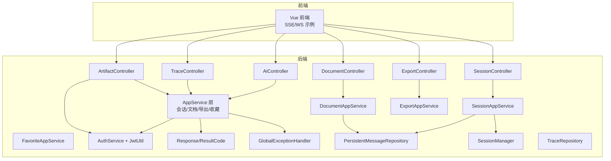
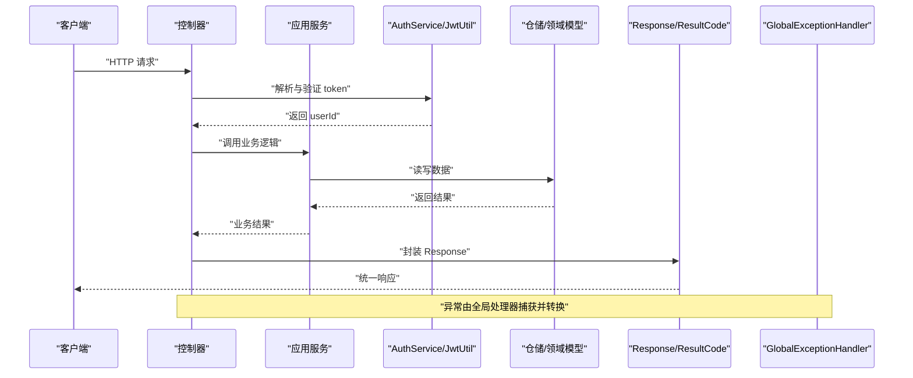
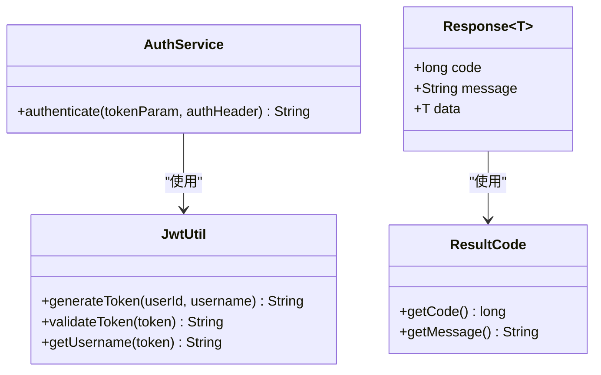

# API接口文档

<cite>
**本文引用的文件**
- [AiController.java](file://src/main/java/com/yupi/yuaiagent/controller/AiController.java)
- [SessionController.java](file://src/main/java/com/yupi/yuaiagent/controller/SessionController.java)
- [DocumentController.java](file://src/main/java/com/yupi/yuaiagent/controller/DocumentController.java)
- [TraceController.java](file://src/main/java/com/yupi/yuaiagent/controller/TraceController.java)
- [ArtifactController.java](file://src/main/java/com/yupi/yuaiagent/controller/ArtifactController.java)
- [ExportController.java](file://src/main/java/com/yupi/yuaiagent/controller/ExportController.java)
- [AuthService.java](file://src/main/java/com/yupi/yuaiagent/auth/AuthService.java)
- [JwtUtil.java](file://src/main/java/com/yupi/yuaiagent/auth/JwtUtil.java)
- [Response.java](file://src/main/java/com/yupi/yuaiagent/common/Response.java)
- [ResultCode.java](file://src/main/java/com/yupi/yuaiagent/common/ResultCode.java)
- [GlobalExceptionHandler.java](file://src/main/java/com/yupi/yuaiagent/exception/GlobalExceptionHandler.java)
- [PersistentMessageRepository.java](file://src/main/java/com/yupi/yuaiagent/message/PersistentMessageRepository.java)
- [SessionManager.java](file://src/main/java/com/yupi/yuaiagent/session/SessionManager.java)
- [TraceControllerTest.java](file://src/test/java/com/yupi/yuaiagent/trace/TraceControllerTest.java)
- [index.js](file://yu-ai-agent-frontend/src/api/index.js)
- [LoveMaster.vue](file://yu-ai-agent-frontend/src/views/LoveMaster.vue)
</cite>

## 目录
1. [简介](#简介)
2. [项目结构](#项目结构)
3. [核心组件](#核心组件)
4. [架构总览](#架构总览)
5. [详细组件分析](#详细组件分析)
6. [依赖关系分析](#依赖关系分析)
7. [性能考量](#性能考量)
8. [故障排查指南](#故障排查指南)
9. [结论](#结论)
10. [附录](#附录)

## 简介
本文件为多智能体协作平台的完整API接口文档，覆盖AI聊天、会话管理、文档管理、追踪与审计、交付物管理、导入导出等核心能力。文档明确RESTful API的HTTP方法、URL模式、请求与响应格式、认证方式，并补充WebSocket/SSE实时交互模式、版本控制策略、速率限制与安全建议、客户端实现指南与SDK使用示例。

## 项目结构
后端采用Spring Boot分层架构，控制器位于controller包，应用服务位于service包，通用响应封装在common包，认证与鉴权在auth包，消息持久化在message包，会话状态在session包，追踪在trace包，文档在document包，工具与模型在对应子包。前端位于yu-ai-agent-frontend目录，提供SSE实时流式输出示例。

图表来源
- [AiController.java](file://src/main/java/com/yupi/yuaiagent/controller/AiController.java)
- [SessionController.java](file://src/main/java/com/yupi/yuaiagent/controller/SessionController.java)
- [DocumentController.java](file://src/main/java/com/yupi/yuaiagent/controller/DocumentController.java)
- [TraceController.java](file://src/main/java/com/yupi/yuaiagent/controller/TraceController.java)
- [ArtifactController.java](file://src/main/java/com/yupi/yuaiagent/controller/ArtifactController.java)
- [ExportController.java](file://src/main/java/com/yupi/yuaiagent/controller/ExportController.java)
- [AuthService.java](file://src/main/java/com/yupi/yuaiagent/auth/AuthService.java)
- [JwtUtil.java](file://src/main/java/com/yupi/yuaiagent/auth/JwtUtil.java)
- [Response.java](file://src/main/java/com/yupi/yuaiagent/common/Response.java)
- [PersistentMessageRepository.java](file://src/main/java/com/yupi/yuaiagent/message/PersistentMessageRepository.java)
- [SessionManager.java](file://src/main/java/com/yupi/yuaiagent/session/SessionManager.java)

章节来源
- [AiController.java](file://src/main/java/com/yupi/yuaiagent/controller/AiController.java)
- [SessionController.java](file://src/main/java/com/yupi/yuaiagent/controller/SessionController.java)
- [DocumentController.java](file://src/main/java/com/yupi/yuaiagent/controller/DocumentController.java)
- [TraceController.java](file://src/main/java/com/yupi/yuaiagent/controller/TraceController.java)
- [ArtifactController.java](file://src/main/java/com/yupi/yuaiagent/controller/ArtifactController.java)
- [ExportController.java](file://src/main/java/com/yupi/yuaiagent/controller/ExportController.java)
- [AuthService.java](file://src/main/java/com/yupi/yuaiagent/auth/AuthService.java)
- [JwtUtil.java](file://src/main/java/com/yupi/yuaiagent/auth/JwtUtil.java)
- [Response.java](file://src/main/java/com/yupi/yuaiagent/common/Response.java)

## 核心组件
- 统一响应包装：所有接口返回统一的Response对象，包含code、message、data三部分，便于前端统一处理。
- 认证与鉴权：支持两种认证来源：URL参数token或Authorization头（Bearer）。AuthService负责解析与验证，JwtUtil负责签发与校验。
- 全局异常处理：通过GlobalExceptionHandler集中处理业务异常与系统异常，保证错误码与消息的一致性。
- 会话与消息：SessionManager维护会话状态，PersistentMessageRepository提供消息的增删查与压缩支持。
- 追踪与审计：TraceController提供按traceId、chatId、userId维度的追踪数据查询，具备严格的访问控制与权限隔离。

章节来源
- [Response.java](file://src/main/java/com/yupi/yuaiagent/common/Response.java)
- [AuthService.java](file://src/main/java/com/yupi/yuaiagent/auth/AuthService.java)
- [JwtUtil.java](file://src/main/java/com/yupi/yuaiagent/auth/JwtUtil.java)
- [GlobalExceptionHandler.java](file://src/main/java/com/yupi/yuaiagent/exception/GlobalExceptionHandler.java)
- [SessionManager.java](file://src/main/java/com/yupi/yuaiagent/session/SessionManager.java)
- [PersistentMessageRepository.java](file://src/main/java/com/yupi/yuaiagent/message/PersistentMessageRepository.java)

## 架构总览
下图展示API调用链路与关键组件交互，包括认证、应用服务、仓储与异常处理。

图表来源
- [AiController.java](file://src/main/java/com/yupi/yuaiagent/controller/AiController.java)
- [SessionController.java](file://src/main/java/com/yupi/yuaiagent/controller/SessionController.java)
- [AuthService.java](file://src/main/java/com/yupi/yuaiagent/auth/AuthService.java)
- [JwtUtil.java](file://src/main/java/com/yupi/yuaiagent/auth/JwtUtil.java)
- [Response.java](file://src/main/java/com/yupi/yuaiagent/common/Response.java)
- [GlobalExceptionHandler.java](file://src/main/java/com/yupi/yuaiagent/exception/GlobalExceptionHandler.java)

## 详细组件分析

### 认证与鉴权
- 支持两种认证方式：
  - URL参数：token=xxx
  - 请求头：Authorization: Bearer xxx
- AuthService负责解析与验证，失败抛出业务异常；JwtUtil负责签发与校验，含过期时间控制。
- 管理员接口（交付物）额外要求Authorization头中的username等于配置的管理员用户名。

章节来源
- [AuthService.java](file://src/main/java/com/yupi/yuaiagent/auth/AuthService.java)
- [JwtUtil.java](file://src/main/java/com/yupi/yuaiagent/auth/JwtUtil.java)
- [ArtifactController.java](file://src/main/java/com/yupi/yuaiagent/controller/ArtifactController.java)

### AI聊天接口
- 登录与会话创建
  - POST /ai/login
    - 参数：username（可选，默认“游客”）、userId（可选，复用现有用户）
    - 返回：token、userId、username
  - POST /ai/create-session
    - 参数：title（可选，默认“新对话”），配合token或Authorization头
    - 返回：会话信息（含chatId等）
  - POST /ai/orchestrator
    - 参数：chatId、prompt、attachments（可选）、stream（可选，是否SSE流式）
    - 返回：统一响应，若stream=true则以SSE推送增量内容
- SSE流式输出
  - 前端通过EventSource订阅SSE，逐条接收增量文本，遇到结束标记时关闭连接。

章节来源
- [AiController.java](file://src/main/java/com/yupi/yuaiagent/controller/AiController.java)
- [LoveMaster.vue](file://yu-ai-agent-frontend/src/views/LoveMaster.vue)

### 会话管理接口
- 会话列表与状态筛选
  - GET /session/list
  - GET /session/archived
  - GET /session/trash
- 会话操作
  - POST /session/create
  - POST /session/rename
  - POST /session/archive
  - POST /session/unarchive
  - POST /session/delete
  - POST /session/restore
- 消息历史
  - GET /session/{chatId}/messages

章节来源
- [SessionController.java](file://src/main/java/com/yupi/yuaiagent/controller/SessionController.java)
- [PersistentMessageRepository.java](file://src/main/java/com/yupi/yuaiagent/message/PersistentMessageRepository.java)
- [SessionManager.java](file://src/main/java/com/yupi/yuaiagent/session/SessionManager.java)

### 文档管理接口
- 文档上传与导入
  - POST /document/upload
  - POST /document/import
- 文档查询与元数据
  - GET /document/list
  - GET /document/{docId}
  - PUT /document/{docId}
  - DELETE /document/{docId}

章节来源
- [DocumentController.java](file://src/main/java/com/yupi/yuaiagent/controller/DocumentController.java)

### 追踪接口
- 查询维度
  - GET /trace/{traceId}
  - GET /trace/chat/{chatId}
  - GET /trace/user/{userId}
- 权限与安全
  - 所有接口均需认证；测试用例验证用户A无法访问用户B的追踪数据，应返回403。

章节来源
- [TraceController.java](file://src/main/java/com/yupi/yuaiagent/controller/TraceController.java)
- [TraceControllerTest.java](file://src/test/java/com/yupi/yuaiagent/trace/TraceControllerTest.java)

### 交付物管理接口（管理员）
- 查询与查看管理员权限校验
  - GET /artifact/list
  - GET /artifact/{id}
- 管理员校验流程：Authorization头中的JWT必须有效，且username等于配置的管理员用户名。

章节来源
- [ArtifactController.java](file://src/main/java/com/yupi/yuaiagent/controller/ArtifactController.java)

### 导入导出接口
- 数据导入
  - POST /export/import
  - 参数：file（必填）、token或Authorization头
  - 返回：导入结果
- 数据导出
  - POST /export/export
  - 参数：token或Authorization头
  - 返回：导出结果

章节来源
- [ExportController.java](file://src/main/java/com/yupi/yuaiagent/controller/ExportController.java)

### WebSocket接口（概念说明）
- 连接处理
  - 建议使用标准WS握手，携带Authorization头或token参数进行认证。
- 消息格式
  - 文本帧：JSON对象，包含chatId、message、attachments等字段。
  - 控制帧：心跳与断开通知。
- 实时交互模式
  - 客户端发送消息，服务端推送增量响应，结束时发送完成标记并关闭连接。
- 注意事项
  - 与SSE类似，需处理网络异常、重连与消息去重。

[本节为概念性说明，无需图表来源]

## 依赖关系分析
- 控制器仅负责参数绑定与调用应用服务，业务逻辑集中在AppService层，降低耦合度。
- 认证与响应封装横切于各控制器，异常处理集中化，提升一致性与可维护性。
- 仓储层提供消息与会话的读写能力，追踪与文档模块分别独立扩展。

图表来源
- [AuthService.java](file://src/main/java/com/yupi/yuaiagent/auth/AuthService.java)
- [JwtUtil.java](file://src/main/java/com/yupi/yuaiagent/auth/JwtUtil.java)
- [Response.java](file://src/main/java/com/yupi/yuaiagent/common/Response.java)
- [ResultCode.java](file://src/main/java/com/yupi/yuaiagent/common/ResultCode.java)

## 性能考量
- 流式输出
  - SSE/WS用于长连接与低延迟交互，建议开启HTTP/2与连接池复用，减少握手开销。
- 缓存与压缩
  - 对频繁读取的消息与文档启用缓存；对大文档与长消息采用压缩策略。
- 并发与锁
  - 会话与消息读写使用读写锁，避免热点冲突；批量操作建议异步化。
- 资源限制
  - 为每个用户设置并发上限与超时阈值，防止资源耗尽。

[本节提供一般性指导，无需章节来源]

## 故障排查指南
- 认证失败
  - 检查token是否过期或格式错误；确认Authorization头是否以Bearer开头。
- 权限不足
  - 管理员接口需满足用户名校验；普通接口需确保用户身份正确。
- 错误码与消息
  - 使用统一的ResultCode与Response封装，前端根据code判断错误类型并提示友好信息。
- 追踪访问被拒绝
  - 测试用例验证跨用户访问会被拒绝，确保数据隔离策略生效。

章节来源
- [GlobalExceptionHandler.java](file://src/main/java/com/yupi/yuaiagent/exception/GlobalExceptionHandler.java)
- [TraceControllerTest.java](file://src/test/java/com/yupi/yuaiagent/trace/TraceControllerTest.java)

## 结论
本API文档提供了多智能体协作平台的完整接口规范，涵盖REST与实时通信、认证与鉴权、统一响应与异常处理、以及性能与安全建议。建议在生产环境中结合速率限制、日志审计与监控告警，持续优化用户体验与系统稳定性。

[本节为总结性内容，无需章节来源]

## 附录

### API版本控制
- 建议在URL中加入版本号前缀（如/v1），或通过Accept头协商版本，以便平滑演进。
- 保持向后兼容，新增字段采用可选策略，废弃字段保留过渡期。

[本节为通用建议，无需章节来源]

### 速率限制与安全
- 速率限制
  - 建议基于IP或用户维度设置QPS/分钟级配额，超限返回429。
- 安全
  - 强制HTTPS；对敏感参数进行脱敏；对输入进行长度与字符集校验；开启CORS白名单。
- 日志与审计
  - 记录关键操作与异常事件，保留足够上下文信息以便回溯。

[本节为通用建议，无需章节来源]

### 客户端实现指南与SDK示例
- 前端示例
  - Vue中使用EventSource订阅SSE，处理错误与重连；在组件销毁时及时关闭连接。
- SDK建议
  - 封装统一的HTTP客户端，内置认证、重试、超时与日志；提供会话与消息的本地缓存策略。
- 最佳实践
  - 优先使用SSE/WS进行流式对话；对大文件上传采用分片与断点续传；对重复请求进行幂等处理。

章节来源
- [index.js](file://yu-ai-agent-frontend/src/api/index.js)
- [LoveMaster.vue](file://yu-ai-agent-frontend/src/views/LoveMaster.vue)