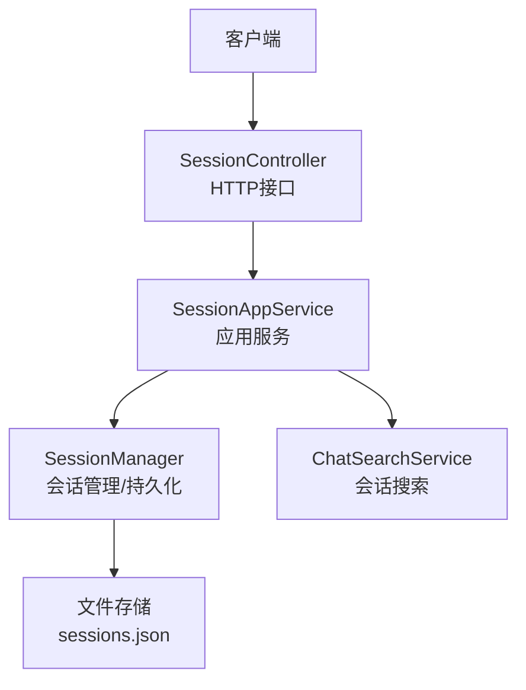
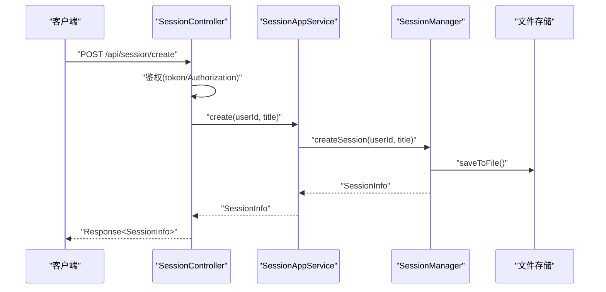
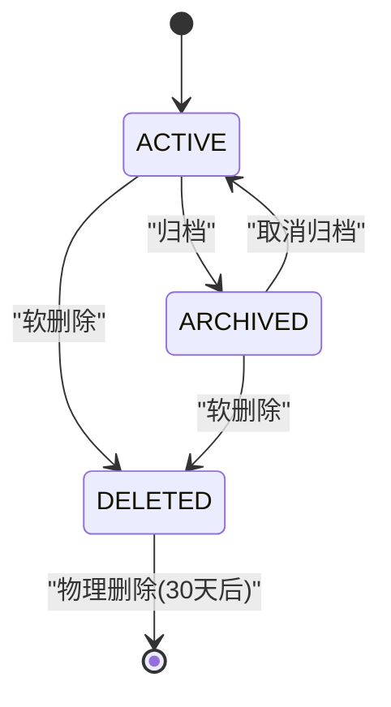
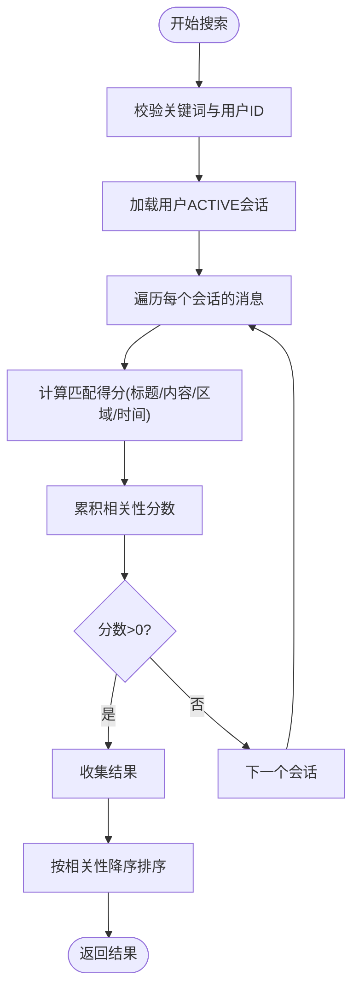
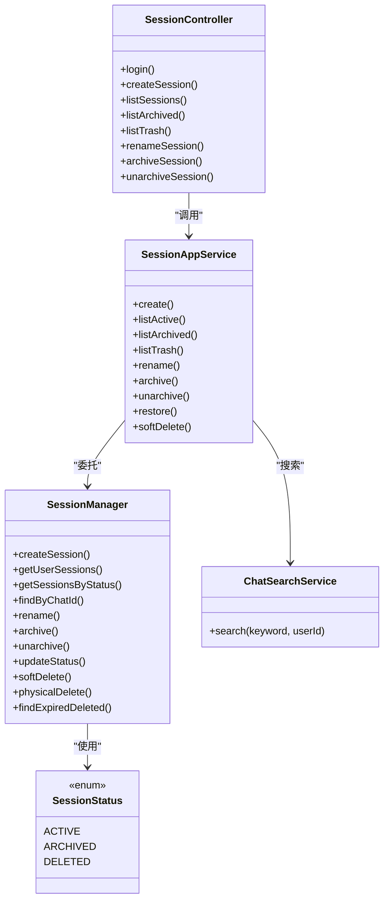

# 会话管理接口

<cite>
**本文引用的文件**
- [SessionController.java](file://src/main/java/com/yupi/yuaiagent/controller/SessionController.java)
- [SessionAppService.java](file://src/main/java/com/yupi/yuaiagent/service/SessionAppService.java)
- [SessionManager.java](file://src/main/java/com/yupi/yuaiagent/session/SessionManager.java)
- [SessionStatus.java](file://src/main/java/com/yupi/yuaiagent/session/SessionStatus.java)
- [ChatSearchService.java](file://src/main/java/com/yupi/yuaiagent/search/ChatSearchService.java)
- [SessionSearchResponse.java](file://src/main/java/com/yupi/yuaiagent/dto/SessionSearchResponse.java)
- [RenameRequest.java](file://src/main/java/com/yupi/yuaiagent/dto/RenameRequest.java)
</cite>

## 目录
1. [简介](#简介)
2. [项目结构](#项目结构)
3. [核心组件](#核心组件)
4. [架构总览](#架构总览)
5. [详细组件分析](#详细组件分析)
6. [依赖关系分析](#依赖关系分析)
7. [性能考量](#性能考量)
8. [故障排查指南](#故障排查指南)
9. [结论](#结论)
10. [附录](#附录)

## 简介
本文件为会话管理接口的完整API文档，覆盖以下内容：
- RESTful接口：会话创建、查询（含分页与筛选）、更新（重命名、归档/取消归档、软删除/恢复）与删除
- GET /api/session/list 的分页查询参数、排序与过滤说明
- POST /api/session/create 的新建请求格式与响应结构
- 会话状态管理、超时处理与并发控制机制
- 会话搜索功能的高级查询语法与性能优化建议
- 会话数据的序列化格式、缓存策略与持久化机制
- 面向集成开发者的会话生命周期管理指南

## 项目结构
会话管理相关代码采用典型的分层架构：
- 控制器层：SessionController 提供HTTP接口
- 应用服务层：SessionAppService 实现业务用例
- 领域模型与持久化：SessionManager 管理会话状态与文件存储
- 搜索模块：ChatSearchService 提供跨会话搜索能力
- DTO与状态枚举：SessionSearchResponse、RenameRequest、SessionStatus

图表来源
- [SessionController.java:39-117](file://src/main/java/com/yupi/yuaiagent/controller/SessionController.java#L39-L117)
- [SessionAppService.java:26-118](file://src/main/java/com/yupi/yuaiagent/service/SessionAppService.java#L26-L118)
- [SessionManager.java:31-249](file://src/main/java/com/yupi/yuaiagent/session/SessionManager.java#L31-L249)
- [ChatSearchService.java:40-177](file://src/main/java/com/yupi/yuaiagent/search/ChatSearchService.java#L40-L177)

章节来源
- [SessionController.java:39-117](file://src/main/java/com/yupi/yuaiagent/controller/SessionController.java#L39-L117)
- [SessionAppService.java:26-118](file://src/main/java/com/yupi/yuaiagent/service/SessionAppService.java#L26-L118)
- [SessionManager.java:31-249](file://src/main/java/com/yupi/yuaiagent/session/SessionManager.java#L31-L249)
- [ChatSearchService.java:40-177](file://src/main/java/com/yupi/yuaiagent/search/ChatSearchService.java#L40-L177)

## 核心组件
- SessionController：暴露REST接口，负责参数绑定与鉴权
- SessionAppService：封装业务用例，如创建、列表查询、重命名、归档/恢复、软删除等
- SessionManager：维护会话状态机（ACTIVE/ARCHIVED/DELETED），提供读写锁保护与文件持久化
- ChatSearchService：基于消息内容进行跨会话检索，返回带权重的相关性分数
- DTO与状态枚举：RenameRequest、SessionSearchResponse、SessionStatus

章节来源
- [SessionController.java:39-117](file://src/main/java/com/yupi/yuaiagent/controller/SessionController.java#L39-L117)
- [SessionAppService.java:26-118](file://src/main/java/com/yupi/yuaiagent/service/SessionAppService.java#L26-L118)
- [SessionManager.java:31-249](file://src/main/java/com/yupi/yuaiagent/session/SessionManager.java#L31-L249)
- [SessionStatus.java:17-37](file://src/main/java/com/yupi/yuaiagent/session/SessionStatus.java#L17-L37)
- [ChatSearchService.java:40-177](file://src/main/java/com/yupi/yuaiagent/search/ChatSearchService.java#L40-L177)
- [SessionSearchResponse.java:8-24](file://src/main/java/com/yupi/yuaiagent/dto/SessionSearchResponse.java#L8-L24)
- [RenameRequest.java](file://src/main/java/com/yupi/yuaiagent/dto/RenameRequest.java#L8)

## 架构总览
下图展示从客户端到持久化的端到端流程。

图表来源
- [SessionController.java:51-58](file://src/main/java/com/yupi/yuaiagent/controller/SessionController.java#L51-L58)
- [SessionAppService.java:36-40](file://src/main/java/com/yupi/yuaiagent/service/SessionAppService.java#L36-L40)
- [SessionManager.java:68-81](file://src/main/java/com/yupi/yuaiagent/session/SessionManager.java#L68-L81)
- [SessionManager.java:249-280](file://src/main/java/com/yupi/yuaiagent/session/SessionManager.java#L249-L280)

## 详细组件分析

### 接口清单与规范

- 创建会话
  - 方法与路径：POST /api/session/create
  - 认证方式：支持 token 参数或 Authorization 头
  - 请求参数：
    - token：可选，用于刷新或复用用户身份
    - Authorization：可选，Bearer 方式
    - title：可选，默认值“新对话”
  - 响应：Response<SessionInfo>，包含 chatId、title、状态与时间戳字段
  - 错误码：鉴权失败返回401；业务异常按统一响应包装

- 查询会话列表
  - 方法与路径：GET /api/session/list
  - 功能：返回当前用户的活跃会话（ACTIVE）
  - 认证方式：同上
  - 分页、排序与过滤：
    - 当前实现按最新创建顺序返回（前端可自行排序）
    - 无内置分页参数（如需分页，请在客户端或通过扩展接口实现）
    - 过滤仅支持按状态筛选（ACTIVE/ARCHIVED/TRASH）

- 查询归档与回收站
  - GET /api/session/archived：返回 ARCHIVED 列表
  - GET /api/session/trash：返回 DELETED 列表

- 更新会话
  - 重命名
    - 方法与路径：PUT /api/session/{chatId}/title
    - 请求体：RenameRequest{ title }
    - 权限：必须为会话所有者
  - 归档
    - PUT /api/session/{chatId}/archive
  - 取消归档
    - PUT /api/session/{chatId}/unarchive
  - 恢复（从回收站恢复为 ACTIVE）
    - 应用服务中提供 restore(userId, chatId)，内部转换为 ACTIVE 状态

- 删除会话
  - 软删除（进入回收站）
    - 应用服务中提供 softDelete(userId, chatId)，内部转换为 DELETED 状态
  - 物理删除（由定时任务清理）
    - SessionManager.findExpiredDeleted(cutoff) 返回超过保留期的 DELETED 会话
    - SessionManager.physicalDelete(chatId) 执行物理移除

章节来源
- [SessionController.java:51-58](file://src/main/java/com/yupi/yuaiagent/controller/SessionController.java#L51-L58)
- [SessionController.java:60-82](file://src/main/java/com/yupi/yuaiagent/controller/SessionController.java#L60-L82)
- [SessionController.java:86-117](file://src/main/java/com/yupi/yuaiagent/controller/SessionController.java#L86-L117)
- [SessionAppService.java:75-118](file://src/main/java/com/yupi/yuaiagent/service/SessionAppService.java#L75-L118)
- [SessionManager.java:85-107](file://src/main/java/com/yupi/yuaiagent/session/SessionManager.java#L85-L107)
- [SessionManager.java:178-202](file://src/main/java/com/yupi/yuaiagent/session/SessionManager.java#L178-L202)
- [SessionManager.java:235-247](file://src/main/java/com/yupi/yuaiagent/session/SessionManager.java#L235-L247)

### GET /api/session/list：分页、排序与过滤
- 分页：当前未提供分页参数（page/size）。若需要分页，请在客户端或通过扩展接口实现
- 排序：默认按最新创建顺序返回（前端可二次排序）
- 过滤：当前仅支持按状态筛选（ACTIVE/ARCHIVED/TRASH），可通过对应接口访问

章节来源
- [SessionController.java:60-82](file://src/main/java/com/yupi/yuaiagent/controller/SessionController.java#L60-L82)
- [SessionAppService.java:38-40](file://src/main/java/com/yupi/yuaiagent/service/SessionAppService.java#L38-L40)
- [SessionManager.java:85-107](file://src/main/java/com/yupi/yuaiagent/session/SessionManager.java#L85-L107)

### POST /api/session/create：新建会话
- 请求参数：
  - token 或 Authorization 头（二选一）
  - title：会话标题，默认“新对话”
- 响应结构：Response.success(SessionInfo)
  - 字段示例：chatId、title、status、createdAt、lastActiveAt、archivedAt、deletedAt
- 并发与一致性：创建过程使用写锁保护，确保多线程安全

章节来源
- [SessionController.java:51-58](file://src/main/java/com/yupi/yuaiagent/controller/SessionController.java#L51-L58)
- [SessionAppService.java:36-40](file://src/main/java/com/yupi/yuaiagent/service/SessionAppService.java#L36-L40)
- [SessionManager.java:68-81](file://src/main/java/com/yupi/yuaiagent/session/SessionManager.java#L68-L81)
- [SessionManager.java:289-308](file://src/main/java/com/yupi/yuaiagent/session/SessionManager.java#L289-L308)

### 会话状态管理与生命周期
- 状态枚举：ACTIVE（活跃）、ARCHIVED（已归档）、DELETED（已删除）
- 状态转换：
  - ACTIVE ↔ ARCHIVED（用户操作）
  - ACTIVE → DELETED（软删除）
  - ARCHIVED → DELETED（软删除）
  - DELETED → 物理删除（定时清理）
- 时间戳：
  - createdAt：创建时间
  - lastActiveAt：最后活跃时间（每次更新都会刷新）
  - archivedAt/ deletedAt：归档/删除时间（软删除时设置）

图表来源
- [SessionStatus.java:17-37](file://src/main/java/com/yupi/yuaiagent/session/SessionStatus.java#L17-L37)
- [SessionManager.java:178-202](file://src/main/java/com/yupi/yuaiagent/session/SessionManager.java#L178-L202)
- [SessionManager.java:235-247](file://src/main/java/com/yupi/yuaiagent/session/SessionManager.java#L235-L247)

章节来源
- [SessionStatus.java:17-37](file://src/main/java/com/yupi/yuaiagent/session/SessionStatus.java#L17-L37)
- [SessionManager.java:178-202](file://src/main/java/com/yupi/yuaiagent/session/SessionManager.java#L178-L202)

### 并发控制与超时处理
- 并发控制：
  - 读写锁：SessionManager 使用 ReentrantReadWriteLock 保护内存结构
  - 并发容器：userSessions、chatOwner 使用并发安全的数据结构
- 超时处理：
  - 当前未实现会话超时自动清理逻辑
  - 回收站保留期：DELETED 状态保留30天，到期后物理删除

章节来源
- [SessionManager.java:43-49](file://src/main/java/com/yupi/yuaiagent/session/SessionManager.java#L43-L49)
- [SessionManager.java:235-247](file://src/main/java/com/yupi/yuaiagent/session/SessionManager.java#L235-L247)

### 会话搜索功能
- 搜索范围：限定在当前用户 ACTIVE 状态的会话
- 关键词匹配：
  - 标题权重最高
  - 用户消息权重高于助手消息
  - 匹配类型：完全相等（100）、前缀匹配（70）、包含匹配（50）
- 相关性评分：综合标题匹配、消息命中数、消息区域权重与最近活跃度
- 结果结构：SessionSearchResponse
  - 字段：chatId、title、relevance、snippet、bestHit、timestamp
  - bestHit：包含 messageId、offset、length，用于前端高亮定位

图表来源
- [ChatSearchService.java:53-124](file://src/main/java/com/yupi/yuaiagent/search/ChatSearchService.java#L53-L124)
- [ChatSearchService.java:132-159](file://src/main/java/com/yupi/yuaiagent/search/ChatSearchService.java#L132-L159)
- [SessionSearchResponse.java:8-24](file://src/main/java/com/yupi/yuaiagent/dto/SessionSearchResponse.java#L8-L24)

章节来源
- [ChatSearchService.java:53-124](file://src/main/java/com/yupi/yuaiagent/search/ChatSearchService.java#L53-L124)
- [ChatSearchService.java:132-159](file://src/main/java/com/yupi/yuaiagent/search/ChatSearchService.java#L132-L159)
- [SessionSearchResponse.java:8-24](file://src/main/java/com/yupi/yuaiagent/dto/SessionSearchResponse.java#L8-L24)

### 数据序列化格式、缓存策略与持久化
- 序列化格式：
  - 使用 Jackson ObjectMapper（注册JavaTimeModule）进行JSON序列化
  - 存储文件：{storageDir}/sessions.json
  - 存储结构：SessionStore（包含 userSessions 与 chatOwner 映射）
- 缓存策略：
  - 内存缓存：userSessions、chatOwner 为内存结构，启动时从文件加载
  - 读写锁保护：读多写少场景下的并发安全
- 持久化机制：
  - 写入时机：每次创建、更新、删除均触发保存
  - 文件I/O：loadFromFile/saveToFile
  - 回收站清理：DELETED 会话保留30天后物理删除

章节来源
- [SessionManager.java:46-49](file://src/main/java/com/yupi/yuaiagent/session/SessionManager.java#L46-L49)
- [SessionManager.java:51-64](file://src/main/java/com/yupi/yuaiagent/session/SessionManager.java#L51-L64)
- [SessionManager.java:249-280](file://src/main/java/com/yupi/yuaiagent/session/SessionManager.java#L249-L280)
- [SessionManager.java:283-287](file://src/main/java/com/yupi/yuaiagent/session/SessionManager.java#L283-L287)

### 会话生命周期管理指南（集成开发者）
- 创建：调用 POST /api/session/create，传入 token 或 Authorization 头与标题
- 查询：使用 GET /api/session/list 获取 ACTIVE 会话；如需其他状态请使用对应接口
- 更新：
  - 重命名：PUT /api/session/{chatId}/title
  - 归档/取消归档：PUT /api/session/{chatId}/archive | /unarchive
  - 恢复：调用应用服务 restore(userId, chatId)
- 删除：
  - 软删除：调用应用服务 softDelete(userId, chatId)
  - 物理删除：等待定时任务清理或调用 SessionManager.physicalDelete(chatId)
- 搜索：调用 ChatSearchService.search(keyword, userId) 获取相关会话列表

章节来源
- [SessionController.java:51-58](file://src/main/java/com/yupi/yuaiagent/controller/SessionController.java#L51-L58)
- [SessionController.java:86-117](file://src/main/java/com/yupi/yuaiagent/controller/SessionController.java#L86-L117)
- [SessionAppService.java:75-118](file://src/main/java/com/yupi/yuaiagent/service/SessionAppService.java#L75-L118)
- [SessionManager.java:178-202](file://src/main/java/com/yupi/yuaiagent/session/SessionManager.java#L178-L202)
- [SessionManager.java:218-233](file://src/main/java/com/yupi/yuaiagent/session/SessionManager.java#L218-L233)

## 依赖关系分析

图表来源
- [SessionController.java:39-117](file://src/main/java/com/yupi/yuaiagent/controller/SessionController.java#L39-L117)
- [SessionAppService.java:26-118](file://src/main/java/com/yupi/yuaiagent/service/SessionAppService.java#L26-L118)
- [SessionManager.java:31-249](file://src/main/java/com/yupi/yuaiagent/session/SessionManager.java#L31-L249)
- [ChatSearchService.java:40-177](file://src/main/java/com/yupi/yuaiagent/search/ChatSearchService.java#L40-L177)
- [SessionStatus.java:17-37](file://src/main/java/com/yupi/yuaiagent/session/SessionStatus.java#L17-L37)

章节来源
- [SessionController.java:39-117](file://src/main/java/com/yupi/yuaiagent/controller/SessionController.java#L39-L117)
- [SessionAppService.java:26-118](file://src/main/java/com/yupi/yuaiagent/service/SessionAppService.java#L26-L118)
- [SessionManager.java:31-249](file://src/main/java/com/yupi/yuaiagent/session/SessionManager.java#L31-L249)
- [ChatSearchService.java:40-177](file://src/main/java/com/yupi/yuaiagent/search/ChatSearchService.java#L40-L177)
- [SessionStatus.java:17-37](file://src/main/java/com/yupi/yuaiagent/session/SessionStatus.java#L17-L37)

## 性能考量
- 搜索性能
  - 当前实现对每个会话的消息逐一扫描，复杂度与消息数量成正比
  - 建议：引入倒排索引或外部搜索引擎（如Elasticsearch）以提升大体量数据的检索效率
- 并发读写
  - 使用读写锁分离读写操作，适合读多写少场景
  - 建议：在高并发写入场景下考虑分片或批量写入策略
- 持久化
  - 每次变更均落盘，保证一致性但可能影响写入吞吐
  - 建议：引入异步刷盘或批量合并写入策略
- 分页与排序
  - 当前未提供分页参数，建议在控制器层增加 page/size 与 sort 参数，并在应用服务层实现分页查询

## 故障排查指南
- 鉴权失败
  - 现象：返回401未授权
  - 排查：确认 token 是否有效，Authorization 头格式是否正确
- 权限不足
  - 现象：更新/删除接口抛出禁止错误
  - 排查：确认请求用户是否为会话所有者
- 文件存储异常
  - 现象：初始化失败或保存失败
  - 排查：检查 storageDir 目录权限与磁盘空间
- 搜索无结果
  - 现象：关键词无法匹配任何会话
  - 排查：确认关键词大小写与内容匹配规则；检查消息内容是否为空

章节来源
- [SessionController.java:51-58](file://src/main/java/com/yupi/yuaiagent/controller/SessionController.java#L51-L58)
- [SessionAppService.java:113-117](file://src/main/java/com/yupi/yuaiagent/service/SessionAppService.java#L113-L117)
- [SessionManager.java:51-64](file://src/main/java/com/yupi/yuaiagent/session/SessionManager.java#L51-L64)
- [ChatSearchService.java:53-58](file://src/main/java/com/yupi/yuaiagent/search/ChatSearchService.java#L53-L58)

## 结论
本API提供了完整的会话生命周期管理能力，具备清晰的状态机与文件持久化策略。当前实现简洁可靠，适合中小规模使用场景。对于大规模与高并发需求，建议引入外部搜索引擎、异步写入与分页排序等优化措施。

## 附录

### API 定义速查
- 创建会话
  - 方法：POST
  - 路径：/api/session/create
  - 认证：token 或 Authorization
  - 请求参数：title（可选）
  - 响应：SessionInfo

- 查询会话
  - 方法：GET
  - 路径：/api/session/list（ACTIVE）
  - 认证：token 或 Authorization
  - 响应：SessionInfo 列表

- 查询归档/回收站
  - 路径：/api/session/archived、/api/session/trash
  - 响应：对应状态的 SessionInfo 列表

- 更新会话
  - 重命名：PUT /api/session/{chatId}/title
  - 归档：PUT /api/session/{chatId}/archive
  - 取消归档：PUT /api/session/{chatId}/unarchive
  - 恢复：应用服务 restore(userId, chatId)

- 删除会话
  - 软删除：应用服务 softDelete(userId, chatId)
  - 物理删除：SessionManager.physicalDelete(chatId)

章节来源
- [SessionController.java:51-58](file://src/main/java/com/yupi/yuaiagent/controller/SessionController.java#L51-L58)
- [SessionController.java:60-82](file://src/main/java/com/yupi/yuaiagent/controller/SessionController.java#L60-L82)
- [SessionController.java:86-117](file://src/main/java/com/yupi/yuaiagent/controller/SessionController.java#L86-L117)
- [SessionAppService.java:75-118](file://src/main/java/com/yupi/yuaiagent/service/SessionAppService.java#L75-L118)
- [SessionManager.java:178-202](file://src/main/java/com/yupi/yuaiagent/session/SessionManager.java#L178-L202)
- [SessionManager.java:218-233](file://src/main/java/com/yupi/yuaiagent/session/SessionManager.java#L218-L233)