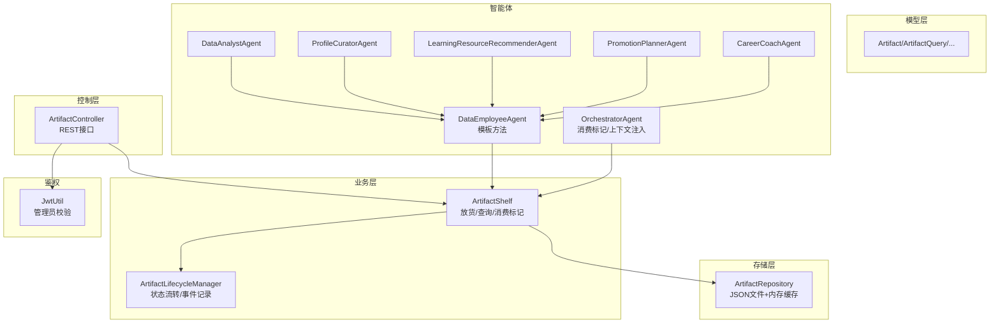
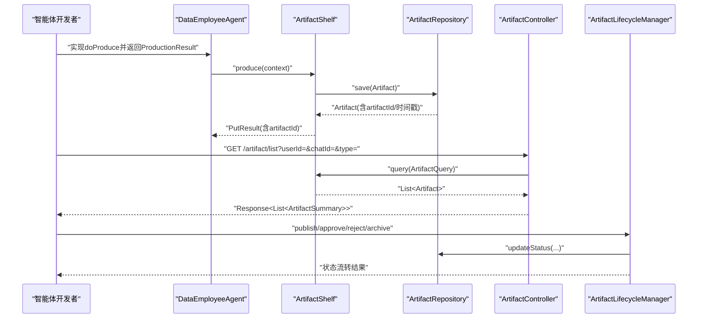
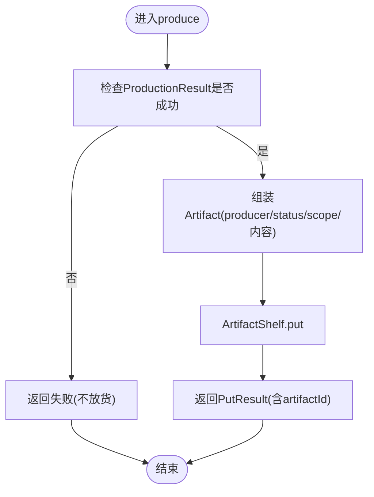
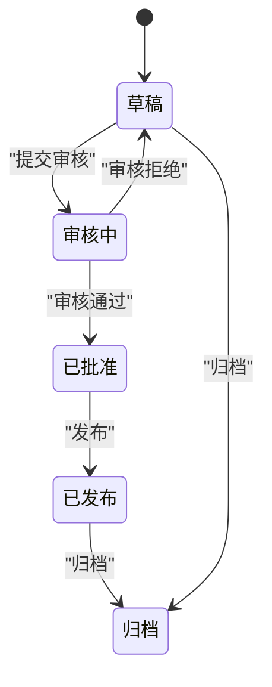
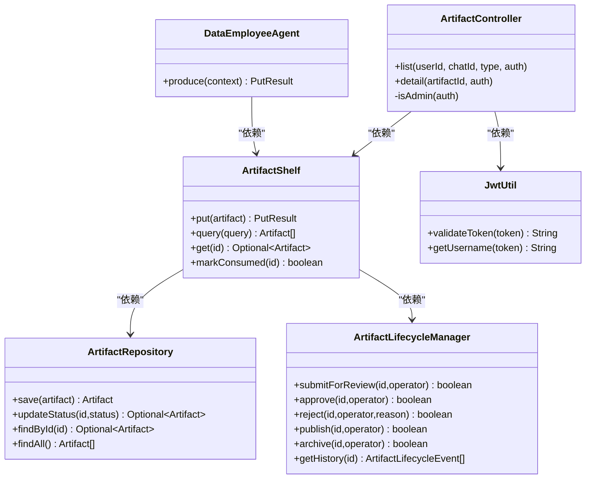

# 工件管理接口

<cite>
**本文引用的文件**
- [ArtifactController.java](file://src/main/java/com/yupi/yuaiagent/controller/ArtifactController.java)
- [ArtifactShelf.java](file://src/main/java/com/yupi/yuaiagent/artifact/ArtifactShelf.java)
- [ArtifactRepository.java](file://src/main/java/com/yupi/yuaiagent/artifact/ArtifactRepository.java)
- [ArtifactLifecycleManager.java](file://src/main/java/com/yupi/yuaiagent/artifact/ArtifactLifecycleManager.java)
- [Artifact.java](file://src/main/java/com/yupi/yuaiagent/artifact/model/Artifact.java)
- [ArtifactQuery.java](file://src/main/java/com/yupi/yuaiagent/artifact/model/ArtifactQuery.java)
- [ArtifactStatus.java](file://src/main/java/com/yupi/yuaiagent/artifact/model/ArtifactStatus.java)
- [ArtifactScope.java](file://src/main/java/com/yupi/yuaiagent/artifact/model/ArtifactScope.java)
- [ArtifactSummary.java](file://src/main/java/com/yupi/yuaiagent/artifact/model/ArtifactSummary.java)
- [JwtUtil.java](file://src/main/java/com/yupi/yuaiagent/auth/JwtUtil.java)
- [DataEmployeeAgent.java](file://src/main/java/com/yupi/yuaiagent/agent/data/DataEmployeeAgent.java)
- [DataAnalystAgent.java](file://src/main/java/com/yupi/yuaiagent/agent/data/DataAnalystAgent.java)
- [ProfileCuratorAgent.java](file://src/main/java/com/yupi/yuaiagent/agent/data/ProfileCuratorAgent.java)
- [LearningResourceRecommenderAgent.java](file://src/main/java/com/yupi/yuaiagent/agent/data/LearningResourceRecommenderAgent.java)
- [PromotionPlannerAgent.java](file://src/main/java/com/yupi/yuaiagent/agent/data/PromotionPlannerAgent.java)
- [CareerCoachAgent.java](file://src/main/java/com/yupi/yuaiagent/agent/data/CareerCoachAgent.java)
- [OrchestratorAgent.java](file://src/main/java/com/yupi/yuaiagent/agent/OrchestratorAgent.java)
</cite>

## 目录
1. [简介](#简介)
2. [项目结构](#项目结构)
3. [核心组件](#核心组件)
4. [架构总览](#架构总览)
5. [详细组件分析](#详细组件分析)
6. [依赖关系分析](#依赖关系分析)
7. [性能考虑](#性能考虑)
8. [故障排查指南](#故障排查指南)
9. [结论](#结论)
10. [附录](#附录)

## 简介
本文件为“工件管理接口”的完整API参考，面向智能体开发者，覆盖以下能力：
- 工件生成：智能体如何产出并放货（put）工件，以及生成策略与生命周期状态
- 工件查询：管理员端的列表查询、详情查看、过滤条件与分页参数
- 工件生命周期管理：状态转换、归档与事件记录
- 工件元数据与分类：作用域、类型、归属键等
- 导出与共享：当前实现未提供导出接口，共享机制依赖鉴权与作用域
- 访问控制：基于JWT的管理员权限校验

注意：当前后端未提供通用的“导出”接口，也未提供“删除”接口；“共享”能力通过作用域与鉴权控制实现。

## 项目结构
围绕工件管理的核心模块如下：
- 控制层：ArtifactController 提供REST接口（列表、详情、鉴权）
- 业务层：ArtifactShelf 负责放货、查询与消费标记
- 存储层：ArtifactRepository 负责持久化（JSON文件+内存缓存）
- 生命周期：ArtifactLifecycleManager 负责状态流转与事件记录
- 模型层：Artifact、ArtifactQuery、ArtifactStatus、ArtifactScope、ArtifactSummary
- 鉴权：JwtUtil 用于管理员权限校验
- 智能体：多个数据员工Agent负责生成不同类型的工件

图表来源
- [ArtifactController.java:29-106](file://src/main/java/com/yupi/yuaiagent/controller/ArtifactController.java#L29-L106)
- [ArtifactShelf.java:42-59](file://src/main/java/com/yupi/yuaiagent/artifact/ArtifactShelf.java#L42-L59)
- [ArtifactRepository.java:71-96](file://src/main/java/com/yupi/yuaiagent/artifact/ArtifactRepository.java#L71-L96)
- [ArtifactLifecycleManager.java:26-129](file://src/main/java/com/yupi/yuaiagent/artifact/ArtifactLifecycleManager.java#L26-L129)
- [DataEmployeeAgent.java:62-90](file://src/main/java/com/yupi/yuaiagent/agent/data/DataEmployeeAgent.java#L62-L90)
- [OrchestratorAgent.java:361-532](file://src/main/java/com/yupi/yuaiagent/agent/OrchestratorAgent.java#L361-L532)

章节来源
- [ArtifactController.java:29-106](file://src/main/java/com/yupi/yuaiagent/controller/ArtifactController.java#L29-L106)
- [ArtifactShelf.java:42-59](file://src/main/java/com/yupi/yuaiagent/artifact/ArtifactShelf.java#L42-L59)
- [ArtifactRepository.java:71-96](file://src/main/java/com/yupi/yuaiagent/artifact/ArtifactRepository.java#L71-L96)
- [ArtifactLifecycleManager.java:26-129](file://src/main/java/com/yupi/yuaiagent/artifact/ArtifactLifecycleManager.java#L26-L129)
- [DataEmployeeAgent.java:62-90](file://src/main/java/com/yupi/yuaiagent/agent/data/DataEmployeeAgent.java#L62-L90)
- [OrchestratorAgent.java:361-532](file://src/main/java/com/yupi/yuaiagent/agent/OrchestratorAgent.java#L361-L532)

## 核心组件
- ArtifactController：提供管理员端的工件列表查询与详情查看接口，内置JWT管理员权限校验
- ArtifactShelf：统一的放货入口，负责作用域校验、ID生成、时间戳维护与持久化
- ArtifactRepository：基于JSON文件的持久化存储，支持并发安全的读写
- ArtifactLifecycleManager：提供提交审核、审核通过/拒绝、发布、归档等状态流转
- 智能体Agent：通过模板方法produce生成工件，统一设置producer、status、scope等字段
- 模型：Artifact、ArtifactQuery、ArtifactStatus、ArtifactScope、ArtifactSummary

章节来源
- [ArtifactController.java:29-106](file://src/main/java/com/yupi/yuaiagent/controller/ArtifactController.java#L29-L106)
- [ArtifactShelf.java:42-59](file://src/main/java/com/yupi/yuaiagent/artifact/ArtifactShelf.java#L42-L59)
- [ArtifactRepository.java:71-96](file://src/main/java/com/yupi/yuaiagent/artifact/ArtifactRepository.java#L71-L96)
- [ArtifactLifecycleManager.java:26-129](file://src/main/java/com/yupi/yuaiagent/artifact/ArtifactLifecycleManager.java#L26-L129)
- [Artifact.java:17-77](file://src/main/java/com/yupi/yuaiagent/artifact/model/Artifact.java#L17-L77)
- [ArtifactQuery.java](file://src/main/java/com/yupi/yuaiagent/artifact/model/ArtifactQuery.java)
- [ArtifactStatus.java](file://src/main/java/com/yupi/yuaiagent/artifact/model/ArtifactStatus.java)
- [ArtifactScope.java](file://src/main/java/com/yupi/yuaiagent/artifact/model/ArtifactScope.java)
- [ArtifactSummary.java](file://src/main/java/com/yupi/yuaiagent/artifact/model/ArtifactSummary.java)

## 架构总览
工件生成与管理遵循“智能体产出 → 放货入库 → 管理员查询/生命周期管理”的主流程。鉴权通过JWT校验管理员身份，存储采用JSON文件与内存Map结合的方式。

图表来源
- [DataEmployeeAgent.java:62-90](file://src/main/java/com/yupi/yuaiagent/agent/data/DataEmployeeAgent.java#L62-L90)
- [ArtifactShelf.java:42-59](file://src/main/java/com/yupi/yuaiagent/artifact/ArtifactShelf.java#L42-L59)
- [ArtifactRepository.java:71-96](file://src/main/java/com/yupi/yuaiagent/artifact/ArtifactRepository.java#L71-L96)
- [ArtifactController.java:51-69](file://src/main/java/com/yupi/yuaiagent/controller/ArtifactController.java#L51-L69)
- [ArtifactLifecycleManager.java:38-76](file://src/main/java/com/yupi/yuaiagent/artifact/ArtifactLifecycleManager.java#L38-L76)

## 详细组件分析

### REST接口定义
- 列表查询（管理员）
  - 方法：GET
  - 路径：/artifact/list
  - 请求头：Authorization: Bearer <token>
  - 查询参数：
    - userId：可选，按用户过滤
    - chatId：可选，按会话过滤
    - type：可选，按类型过滤
  - 返回：Response<List<ArtifactSummary>>
  - 权限：需管理员JWT校验
- 详情查看（管理员）
  - 方法：GET
  - 路径：/artifact/{artifactId}
  - 请求头：Authorization: Bearer <token>
  - 返回：Response<Artifact>
  - 权限：需管理员JWT校验

章节来源
- [ArtifactController.java:51-83](file://src/main/java/com/yupi/yuaiagent/controller/ArtifactController.java#L51-L83)

### 工件生成与放货（智能体侧）
- 模板方法：DataEmployeeAgent.produce
  - 参数：ProductionContext
  - 行为：
    - 若生产失败，返回失败结果（不放货）
    - 若成功，统一设置producer、status=READY、scope默认TASK
    - 自动补齐userId、chatId（若未设置）
    - 调用ArtifactShelf.put完成放货
- 典型Agent实现：
  - DataAnalystAgent：基于输入解析与结构化解析，产出分析报告
  - ProfileCuratorAgent：基于对话历史产出用户画像摘要，scope=USER_PROFILE
  - LearningResourceRecommenderAgent：优先基于画像领域推荐，失败回退对话上下文
  - PromotionPlannerAgent：基于输入产出晋升规划
  - CareerCoachAgent：基于输入产出岗位辅导建议

图表来源
- [DataEmployeeAgent.java:62-90](file://src/main/java/com/yupi/yuaiagent/agent/data/DataEmployeeAgent.java#L62-L90)
- [DataAnalystAgent.java:108-131](file://src/main/java/com/yupi/yuaiagent/agent/data/DataAnalystAgent.java#L108-L131)
- [ProfileCuratorAgent.java:118-142](file://src/main/java/com/yupi/yuaiagent/agent/data/ProfileCuratorAgent.java#L118-L142)
- [LearningResourceRecommenderAgent.java:136-171](file://src/main/java/com/yupi/yuaiagent/agent/data/LearningResourceRecommenderAgent.java#L136-L171)
- [PromotionPlannerAgent.java:115-138](file://src/main/java/com/yupi/yuaiagent/agent/data/PromotionPlannerAgent.java#L115-L138)
- [CareerCoachAgent.java:113-136](file://src/main/java/com/yupi/yuaiagent/agent/data/CareerCoachAgent.java#L113-L136)

章节来源
- [DataEmployeeAgent.java:62-90](file://src/main/java/com/yupi/yuaiagent/agent/data/DataEmployeeAgent.java#L62-L90)
- [DataAnalystAgent.java:108-131](file://src/main/java/com/yupi/yuaiagent/agent/data/DataAnalystAgent.java#L108-L131)
- [ProfileCuratorAgent.java:118-142](file://src/main/java/com/yupi/yuaiagent/agent/data/ProfileCuratorAgent.java#L118-L142)
- [LearningResourceRecommenderAgent.java:136-171](file://src/main/java/com/yupi/yuaiagent/agent/data/LearningResourceRecommenderAgent.java#L136-L171)
- [PromotionPlannerAgent.java:115-138](file://src/main/java/com/yupi/yuaiagent/agent/data/PromotionPlannerAgent.java#L115-L138)
- [CareerCoachAgent.java:113-136](file://src/main/java/com/yupi/yuaiagent/agent/data/CareerCoachAgent.java#L113-L136)

### 工件查询与过滤
- 查询入口：ArtifactShelf.query(ArtifactQuery)
- 过滤条件：
  - userId：用户维度过滤
  - chatId：会话维度过滤
  - type：类型过滤
- 分页：当前实现未提供分页参数，返回全量列表（建议前端自行分页）
- 结果：返回完整Artifact列表，控制器将其映射为轻量摘要ArtifactSummary

章节来源
- [ArtifactController.java:51-69](file://src/main/java/com/yupi/yuaiagent/controller/ArtifactController.java#L51-L69)
- [ArtifactQuery.java](file://src/main/java/com/yupi/yuaiagent/artifact/model/ArtifactQuery.java)

### 工件生命周期管理与状态转换
- 状态枚举：ArtifactStatus（包含草稿、审核中、已批准、已发布、归档等）
- 状态转换：
  - 提交审核：DRAFT → REVIEWING
  - 审核通过：REVIEWING → APPROVED
  - 审核拒绝：REVIEWING → DRAFT（可附原因）
  - 发布：APPROVED → PUBLISHED
  - 归档：任意 → ARCHIVED（记录事件历史）
- 事件记录：每次状态变更记录事件，包含操作人、时间戳与原因

图表来源
- [ArtifactLifecycleManager.java:38-76](file://src/main/java/com/yupi/yuaiagent/artifact/ArtifactLifecycleManager.java#L38-L76)
- [ArtifactStatus.java](file://src/main/java/com/yupi/yuaiagent/artifact/model/ArtifactStatus.java)

章节来源
- [ArtifactLifecycleManager.java:26-129](file://src/main/java/com/yupi/yuaiagent/artifact/ArtifactLifecycleManager.java#L26-L129)

### 工件元数据、标签与分类
- 元数据字段（Artifact）：
  - artifactId：全局唯一ID（未指定时自动生成）
  - userId/chatId：归属键（作用域相关）
  - type：类型（如数据分析报告、画像摘要等）
  - producer：生产者标识名（数据员工名称）
  - title/content/status/scope/createdAt/updatedAt
- 作用域（ArtifactScope）：
  - TASK：会话内任务交付物（默认）
  - USER_PROFILE：用户画像类交付物
- 分类规则：
  - 不同Agent根据职责设置type与scope，例如画像整理Agent设置scope=USER_PROFILE
- 标签系统：当前未提供专门的标签字段或接口

章节来源
- [Artifact.java:17-77](file://src/main/java/com/yupi/yuaiagent/artifact/model/Artifact.java#L17-L77)
- [ArtifactScope.java](file://src/main/java/com/yupi/yuaiagent/artifact/model/ArtifactScope.java)

### 工件的消费与上下文注入（智能体侧）
- OrchestratorAgent在路由到子Agent前会：
  - 查询READY状态的工件
  - 构造工件上下文注入到子Agent
  - 标记已消费的工件为CONSUMED
- 消费标记：ArtifactShelf.markConsumed

章节来源
- [OrchestratorAgent.java:444-459](file://src/main/java/com/yupi/yuaiagent/agent/OrchestratorAgent.java#L444-L459)
- [OrchestratorAgent.java:603-623](file://src/main/java/com/yupi/yuaiagent/agent/OrchestratorAgent.java#L603-L623)

### 访问控制与鉴权
- 管理员JWT校验：
  - 请求头格式：Authorization: Bearer <token>
  - 校验步骤：校验token有效性、提取username、与配置项admin.username比较
- 非管理员访问：返回403且不返回任何数据

章节来源
- [ArtifactController.java:85-105](file://src/main/java/com/yupi/yuaiagent/controller/ArtifactController.java#L85-L105)
- [JwtUtil.java](file://src/main/java/com/yupi/yuaiagent/auth/JwtUtil.java)

## 依赖关系分析

图表来源
- [ArtifactController.java:29-106](file://src/main/java/com/yupi/yuaiagent/controller/ArtifactController.java#L29-L106)
- [ArtifactShelf.java:42-59](file://src/main/java/com/yupi/yuaiagent/artifact/ArtifactShelf.java#L42-L59)
- [ArtifactRepository.java:71-96](file://src/main/java/com/yupi/yuaiagent/artifact/ArtifactRepository.java#L71-L96)
- [ArtifactLifecycleManager.java:26-129](file://src/main/java/com/yupi/yuaiagent/artifact/ArtifactLifecycleManager.java#L26-L129)
- [DataEmployeeAgent.java:62-90](file://src/main/java/com/yupi/yuaiagent/agent/data/DataEmployeeAgent.java#L62-L90)
- [JwtUtil.java](file://src/main/java/com/yupi/yuaiagent/auth/JwtUtil.java)

章节来源
- [ArtifactController.java:29-106](file://src/main/java/com/yupi/yuaiagent/controller/ArtifactController.java#L29-L106)
- [ArtifactShelf.java:42-59](file://src/main/java/com/yupi/yuaiagent/artifact/ArtifactShelf.java#L42-L59)
- [ArtifactRepository.java:71-96](file://src/main/java/com/yupi/yuaiagent/artifact/ArtifactRepository.java#L71-L96)
- [ArtifactLifecycleManager.java:26-129](file://src/main/java/com/yupi/yuaiagent/artifact/ArtifactLifecycleManager.java#L26-L129)
- [DataEmployeeAgent.java:62-90](file://src/main/java/com/yupi/yuaiagent/agent/data/DataEmployeeAgent.java#L62-L90)
- [JwtUtil.java](file://src/main/java/com/yupi/yuaiagent/auth/JwtUtil.java)

## 性能考虑
- 存储并发：使用读写锁保护内存Map，写入时加写锁，读多写少场景性能稳定
- 文件IO：保存采用一次性序列化整个Map到JSON文件，建议在高并发写入场景下评估落盘频率
- 查询全量：列表查询返回全量列表，建议前端分页或后端增加分页参数
- 生命周期事件：事件历史为内存列表，重启后丢失，适合审计但不适合长期归档

## 故障排查指南
- 管理员权限失败（403）
  - 检查Authorization头格式与token有效性
  - 确认token中username与admin.username一致
- 放货失败
  - 检查作用域校验：TASK需提供chatId，USER_PROFILE需提供userId
  - 检查生产结果：失败时不会放货
- 状态流转失败
  - 检查当前状态与期望状态是否匹配
  - 审核拒绝可附带原因
- 工件未被消费
  - 确认OrchestratorAgent是否正确标记消费
  - 检查工件状态是否为READY

章节来源
- [ArtifactController.java:85-105](file://src/main/java/com/yupi/yuaiagent/controller/ArtifactController.java#L85-L105)
- [ArtifactShelf.java:42-59](file://src/main/java/com/yupi/yuaiagent/artifact/ArtifactShelf.java#L42-L59)
- [ArtifactLifecycleManager.java:81-105](file://src/main/java/com/yupi/yuaiagent/artifact/ArtifactLifecycleManager.java#L81-L105)
- [OrchestratorAgent.java:603-623](file://src/main/java/com/yupi/yuaiagent/agent/OrchestratorAgent.java#L603-L623)

## 结论
本API为智能体工件管理提供了清晰的生成、查询与生命周期管理路径。当前实现聚焦管理员视角的查询与状态管理，未提供通用导出与删除接口。开发者应关注：
- 在智能体中正确设置type、scope与归属键
- 使用模板方法produce统一放货
- 通过生命周期管理完善审核与发布流程
- 借助作用域与JWT实现访问控制

## 附录

### API清单与参数说明
- GET /artifact/list
  - 查询参数：userId（可选）、chatId（可选）、type（可选）
  - 返回：列表（每项为轻量摘要）
- GET /artifact/{artifactId}
  - 路径参数：artifactId
  - 返回：完整工件对象

章节来源
- [ArtifactController.java:51-83](file://src/main/java/com/yupi/yuaiagent/controller/ArtifactController.java#L51-L83)

### 工件模型字段说明
- artifactId：全局唯一ID
- userId/chatId：归属键（与作用域关联）
- type：类型（如数据分析报告、画像摘要等）
- producer：生产者标识名
- title/content：标题与内容（结构化JSON字符串或纯文本）
- status：状态（草稿、审核中、已批准、已发布、归档等）
- scope：作用域（TASK或USER_PROFILE）
- createdAt/updatedAt：创建与更新时间

章节来源
- [Artifact.java:17-77](file://src/main/java/com/yupi/yuaiagent/artifact/model/Artifact.java#L17-L77)
- [ArtifactStatus.java](file://src/main/java/com/yupi/yuaiagent/artifact/model/ArtifactStatus.java)
- [ArtifactScope.java](file://src/main/java/com/yupi/yuaiagent/artifact/model/ArtifactScope.java)