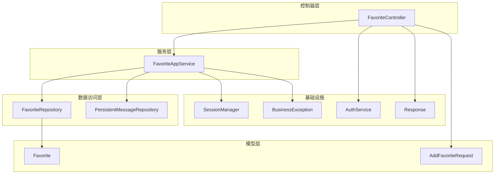
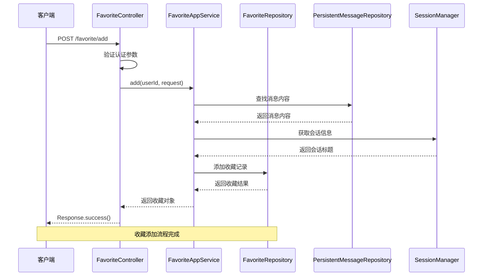
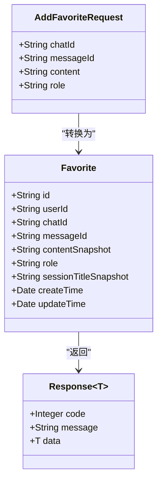
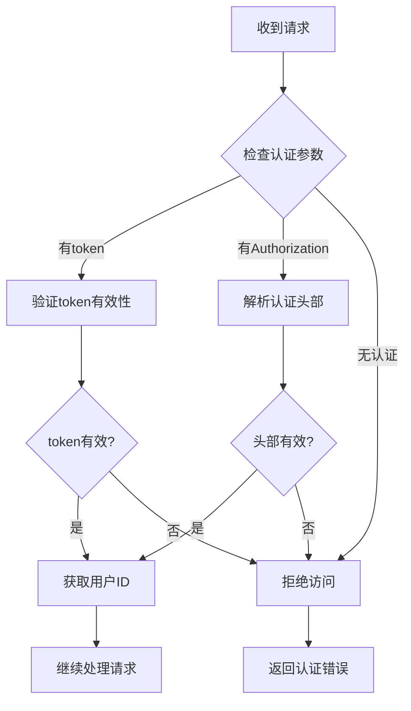
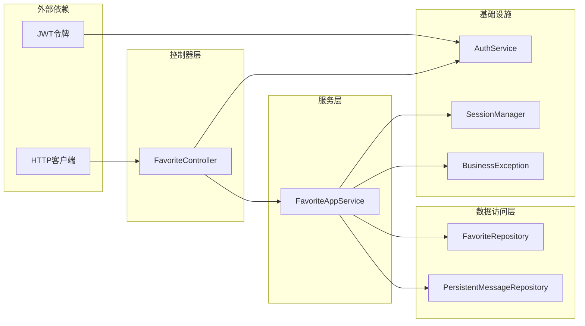

# 收藏夹接口

<cite>
**本文档引用的文件**
- [FavoriteController.java](file://src/main/java/com/yupi/yuaiagent/controller/FavoriteController.java)
- [FavoriteAppService.java](file://src/main/java/com/yupi/yuaiagent/service/FavoriteAppService.java)
- [FavoriteRepository.java](file://src/main/java/com/yupi/yuaiagent/favorite/FavoriteRepository.java)
- [Favorite.java](file://src/main/java/com/yupi/yuaiagent/favorite/Favorite.java)
- [AddFavoriteRequest.java](file://src/main/java/com/yupi/yuaiagent/dto/AddFavoriteRequest.java)
- [Response.java](file://src/main/java/com/yupi/yuaiagent/common/Response.java)
- [AuthService.java](file://src/main/java/com/yupi/yuaiagent/auth/AuthService.java)
- [SessionManager.java](file://src/main/java/com/yupi/yuaiagent/session/SessionManager.java)
- [PersistentMessageRepository.java](file://src/main/java/com/yupi/yuaiagent/message/PersistentMessageRepository.java)
- [BusinessException.java](file://src/main/java/com/yupi/yuaiagent/exception/BusinessException.java)
</cite>

## 目录
1. [简介](#简介)
2. [项目结构](#项目结构)
3. [核心组件](#核心组件)
4. [架构概览](#架构概览)
5. [详细组件分析](#详细组件分析)
6. [依赖关系分析](#依赖关系分析)
7. [性能考虑](#性能考虑)
8. [故障排除指南](#故障排除指南)
9. [结论](#结论)

## 简介

收藏夹接口是AI智能体产品中的核心个性化功能模块，为用户提供收藏和管理对话内容的能力。该接口支持收藏项的添加、删除、查询等基础操作，并通过消息持久化机制实现对对话内容的智能快照。

本接口采用RESTful设计风格，遵循统一的响应格式，集成了完善的权限认证和业务异常处理机制。系统通过消息仓库和会话管理器实现对历史对话内容的智能提取和存储，确保收藏内容的完整性和可追溯性。

## 项目结构

收藏夹功能在项目中的组织结构如下：

**图表来源**
- [FavoriteController.java:19-55](file://src/main/java/com/yupi/yuaiagent/controller/FavoriteController.java#L19-L55)
- [FavoriteAppService.java:21-61](file://src/main/java/com/yupi/yuaiagent/service/FavoriteAppService.java#L21-L61)
- [FavoriteRepository.java:28](file://src/main/java/com/yupi/yuaiagent/favorite/FavoriteRepository.java#L28)
- [Favorite.java:15](file://src/main/java/com/yupi/yuaiagent/favorite/Favorite.java#L15)

**章节来源**
- [FavoriteController.java:19-55](file://src/main/java/com/yupi/yuaiagent/controller/FavoriteController.java#L19-L55)
- [FavoriteAppService.java:21-61](file://src/main/java/com/yupi/yuaiagent/service/FavoriteAppService.java#L21-L61)

## 核心组件

### 控制器层
- **FavoriteController**: 提供RESTful API端点，处理收藏夹相关的HTTP请求
- 实现三个主要端点：POST /favorite/add、DELETE /favorite/{favoriteId}、GET /favorite/list

### 服务层
- **FavoriteAppService**: 核心业务逻辑处理，协调数据访问和业务规则
- 提供收藏添加、删除、查询等业务方法

### 数据访问层
- **FavoriteRepository**: 收藏数据的持久化访问接口
- **PersistentMessageRepository**: 对话消息的持久化存储访问

### 模型层
- **Favorite**: 收藏实体模型，包含用户ID、会话信息、内容快照等字段
- **AddFavoriteRequest**: 收藏添加请求的数据传输对象

**章节来源**
- [FavoriteController.java:19-55](file://src/main/java/com/yupi/yuaiagent/controller/FavoriteController.java#L19-L55)
- [FavoriteAppService.java:21-61](file://src/main/java/com/yupi/yuaiagent/service/FavoriteAppService.java#L21-L61)
- [FavoriteRepository.java:28](file://src/main/java/com/yupi/yuaiagent/favorite/FavoriteRepository.java#L28)
- [Favorite.java:15](file://src/main/java/com/yupi/yuaiagent/favorite/Favorite.java#L15)

## 架构概览

收藏夹接口采用经典的三层架构模式，实现了清晰的关注点分离：

**图表来源**
- [FavoriteController.java:29-36](file://src/main/java/com/yupi/yuaiagent/controller/FavoriteController.java#L29-L36)
- [FavoriteAppService.java:30-51](file://src/main/java/com/yupi/yuaiagent/service/FavoriteAppService.java#L30-L51)

**章节来源**
- [FavoriteController.java:29-36](file://src/main/java/com/yupi/yuaiagent/controller/FavoriteController.java#L29-L36)
- [FavoriteAppService.java:30-51](file://src/main/java/com/yupi/yuaiagent/service/FavoriteAppService.java#L30-L51)

## 详细组件分析

### API端点定义

#### 收藏添加 - POST /favorite/add

**请求格式**
- 方法: POST
- 路径: /favorite/add
- 认证: 支持token参数或Authorization头部
- 请求体: AddFavoriteRequest对象

**请求参数**
- token: 可选，用于身份认证的令牌
- Authorization: 可选，标准HTTP认证头部
- 请求体: 包含收藏相关信息的对象

**响应格式**
- 成功: Response<Favorite>，包含创建的收藏对象
- 失败: 统一错误响应格式

**业务逻辑**
1. 首先尝试通过messageId查找对应的消息内容
2. 如果找不到消息，则使用请求体中的content字段
3. 获取对应的会话标题信息
4. 创建Favorite实体并保存到数据库

**章节来源**
- [FavoriteController.java:29-36](file://src/main/java/com/yupi/yuaiagent/controller/FavoriteController.java#L29-L36)
- [FavoriteAppService.java:30-51](file://src/main/java/com/yupi/yuaiagent/service/FavoriteAppService.java#L30-L51)

#### 收藏删除 - DELETE /favorite/{favoriteId}

**请求格式**
- 方法: DELETE
- 路径: /favorite/{favoriteId}
- 路径参数: favoriteId（收藏项ID）
- 认证: 支持token参数或Authorization头部

**删除机制**
- 支持单个收藏项删除
- 删除失败时抛出业务异常

**章节来源**
- [FavoriteController.java:38-46](file://src/main/java/com/yupi/yuaiagent/controller/FavoriteController.java#L38-L46)
- [FavoriteAppService.java:53-56](file://src/main/java/com/yupi/yuaiagent/service/FavoriteAppService.java#L53-L56)

#### 收藏列表 - GET /favorite/list

**请求格式**
- 方法: GET
- 路径: /favorite/list
- 认证: 支持token参数或Authorization头部

**查询机制**
- 基于用户ID查询所有收藏记录
- 返回当前用户的完整收藏列表

**章节来源**
- [FavoriteController.java:48-54](file://src/main/java/com/yupi/yuaiagent/controller/FavoriteController.java#L48-L54)
- [FavoriteAppService.java:58-60](file://src/main/java/com/yupi/yuaiagent/service/FavoriteAppService.java#L58-L60)

### 数据模型分析

#### Favorite 实体模型

**图表来源**
- [Favorite.java:15](file://src/main/java/com/yupi/yuaiagent/favorite/Favorite.java#L15)
- [AddFavoriteRequest.java](file://src/main/java/com/yupi/yuaiagent/dto/AddFavoriteRequest.java)
- [Response.java](file://src/main/java/com/yupi/yuaiagent/common/Response.java)

**章节来源**
- [Favorite.java:15](file://src/main/java/com/yupi/yuaiagent/favorite/Favorite.java#L15)
- [AddFavoriteRequest.java](file://src/main/java/com/yupi/yuaiagent/dto/AddFavoriteRequest.java)

### 权限控制与认证

系统采用多层认证机制确保收藏数据的安全性：

**图表来源**
- [FavoriteController.java:30-36](file://src/main/java/com/yupi/yuaiagent/controller/FavoriteController.java#L30-L36)
- [AuthService.java](file://src/main/java/com/yupi/yuaiagent/auth/AuthService.java)

**章节来源**
- [FavoriteController.java:30-36](file://src/main/java/com/yupi/yuaiagent/controller/FavoriteController.java#L30-L36)
- [AuthService.java](file://src/main/java/com/yupi/yuaiagent/auth/AuthService.java)

## 依赖关系分析

收藏夹接口的依赖关系体现了清晰的分层架构：

**图表来源**
- [FavoriteController.java:23-27](file://src/main/java/com/yupi/yuaiagent/controller/FavoriteController.java#L23-L27)
- [FavoriteAppService.java:26-28](file://src/main/java/com/yupi/yuaiagent/service/FavoriteAppService.java#L26-L28)

**章节来源**
- [FavoriteController.java:23-27](file://src/main/java/com/yupi/yuaiagent/controller/FavoriteController.java#L23-L27)
- [FavoriteAppService.java:26-28](file://src/main/java/com/yupi/yuaiagent/service/FavoriteAppService.java#L26-L28)

## 性能考虑

### 查询优化
- 使用基于用户ID的索引查询，确保列表查询的高效性
- 收藏数量增长时建议添加适当的数据库索引

### 缓存策略
- 对热门会话的标题信息可以考虑缓存
- 频繁访问的收藏内容可实施适当的缓存机制

### 批量操作
- 当前版本支持单条记录的添加和删除
- 批量删除功能可通过循环调用单条删除实现

## 故障排除指南

### 常见问题及解决方案

**认证失败**
- 检查token参数或Authorization头部是否正确传递
- 验证JWT令牌的有效性和过期时间

**收藏不存在**
- 确认favoriteId参数的正确性
- 检查用户是否有权限访问该收藏

**消息内容缺失**
- 确保messageId指向有效的历史消息
- 检查消息是否已被清理或删除

**章节来源**
- [BusinessException.java](file://src/main/java/com/yupi/yuaiagent/exception/BusinessException.java)
- [FavoriteAppService.java:53-56](file://src/main/java/com/yupi/yuaiagent/service/FavoriteAppService.java#L53-L56)

## 结论

收藏夹接口提供了完整的个性化功能，具有以下特点：

**功能完整性**
- 支持收藏的增删查基本操作
- 集成消息内容智能快照机制
- 提供统一的响应格式和错误处理

**架构优势**
- 清晰的分层架构设计
- 完善的权限认证机制
- 可扩展的业务逻辑层

**用户体验**
- 简洁的API设计
- 一致的响应格式
- 完善的错误处理

该接口为AI智能体产品的个性化功能奠定了坚实基础，支持用户对重要对话内容进行有效管理和检索。