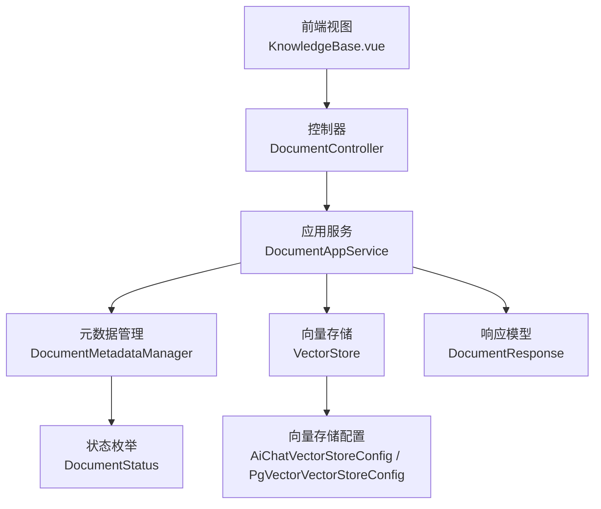
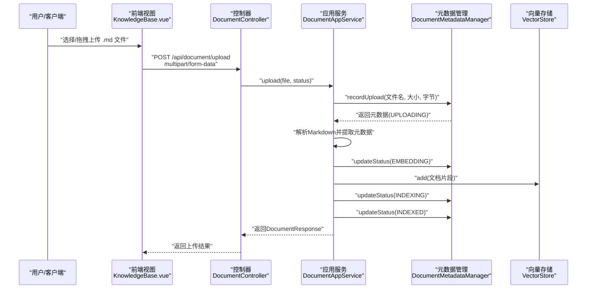
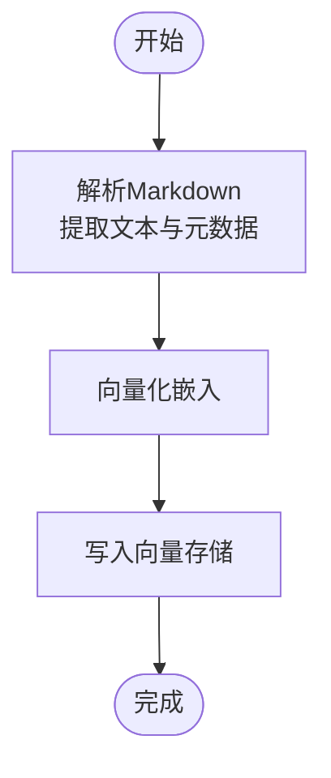
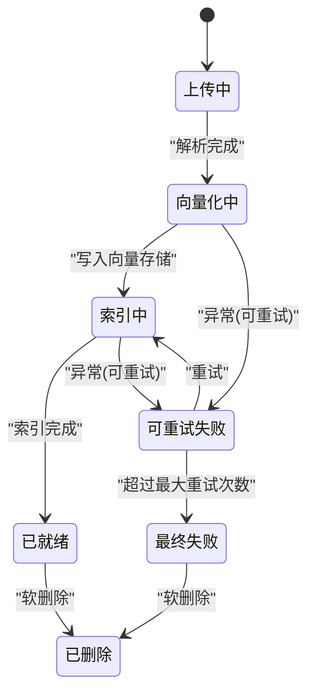
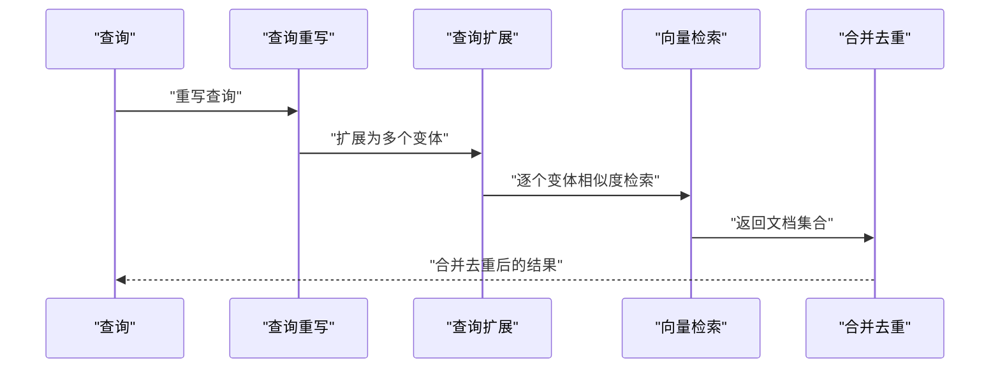
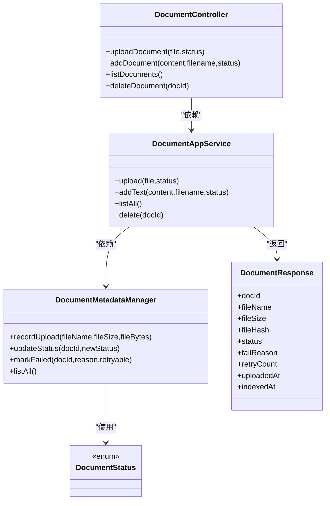

# 文档管理接口

<cite>
**本文档引用的文件**
- [DocumentController.java](file://src/main/java/com/yupi/yuaiagent/controller/DocumentController.java)
- [DocumentAppService.java](file://src/main/java/com/yupi/yuaiagent/service/DocumentAppService.java)
- [DocumentMetadataManager.java](file://src/main/java/com/yupi/yuaiagent/document/DocumentMetadataManager.java)
- [DocumentStatus.java](file://src/main/java/com/yupi/yuaiagent/document/DocumentStatus.java)
- [DocumentResponse.java](file://src/main/java/com/yupi/yuaiagent/dto/DocumentResponse.java)
- [AiChatVectorStoreConfig.java](file://src/main/java/com/yupi/yuaiagent/rag/AiChatVectorStoreConfig.java)
- [PgVectorVectorStoreConfig.java](file://src/main/java/com/yupi/yuaiagent/rag/PgVectorVectorStoreConfig.java)
- [MultiQueryRetriever.java](file://src/main/java/com/yupi/yuaiagent/rag/MultiQueryRetriever.java)
- [AiChatRagCustomAdvisorFactory.java](file://src/main/java/com/yupi/yuaiagent/rag/AiChatRagCustomAdvisorFactory.java)
- [KnowledgeBase.vue](file://yu-ai-agent-frontend/src/views/KnowledgeBase.vue)
</cite>

## 目录
1. [简介](#简介)
2. [项目结构](#项目结构)
3. [核心组件](#核心组件)
4. [架构总览](#架构总览)
5. [详细组件分析](#详细组件分析)
6. [依赖关系分析](#依赖关系分析)
7. [性能考虑](#性能考虑)
8. [故障排查指南](#故障排查指南)
9. [结论](#结论)
10. [附录](#附录)

## 简介
本文件为内容管理系统中的“文档管理接口”提供完整的RESTful API参考，覆盖文档上传、下载、删除与元数据管理，并深入解释文档索引、向量化存储与元数据提取机制，以及基于向量检索的文档搜索、相关性评分与结果排序策略。同时记录文档状态管理、版本控制与访问权限控制现状，以及批量操作、异步处理与进度跟踪能力。

## 项目结构
文档管理相关代码采用分层架构：
- 控制器层：对外暴露REST接口，负责参数接收与响应封装
- 应用服务层：编排业务流程，协调元数据管理与向量存储
- 元数据管理层：维护文档生命周期状态、重复检测与持久化
- 向量存储配置：初始化内存或PG向量存储，加载文档并执行相似度检索
- 前端视图：展示文档列表、上传与删除交互

图表来源
- [DocumentController.java:1-51](file://src/main/java/com/yupi/yuaiagent/controller/DocumentController.java#L1-L51)
- [DocumentAppService.java:1-138](file://src/main/java/com/yupi/yuaiagent/service/DocumentAppService.java#L1-L138)
- [DocumentMetadataManager.java:45-189](file://src/main/java/com/yupi/yuaiagent/document/DocumentMetadataManager.java#L45-L189)
- [AiChatVectorStoreConfig.java:1-45](file://src/main/java/com/yupi/yuaiagent/rag/AiChatVectorStoreConfig.java#L1-L45)
- [PgVectorVectorStoreConfig.java:28-39](file://src/main/java/com/yupi/yuaiagent/rag/PgVectorVectorStoreConfig.java#L28-L39)
- [DocumentResponse.java:1-22](file://src/main/java/com/yupi/yuaiagent/dto/DocumentResponse.java#L1-L22)
- [DocumentStatus.java:1-62](file://src/main/java/com/yupi/yuaiagent/document/DocumentStatus.java#L1-L62)

章节来源
- [DocumentController.java:1-51](file://src/main/java/com/yupi/yuaiagent/controller/DocumentController.java#L1-L51)
- [DocumentAppService.java:1-36](file://src/main/java/com/yupi/yuaiagent/service/DocumentAppService.java#L1-L36)

## 核心组件
- 文档控制器：提供上传、添加文本、列出与删除接口
- 文档应用服务：实现上传校验、解析、向量化与索引写入
- 文档元数据管理：记录上传、重复检测、状态更新与持久化
- 向量存储配置：初始化向量存储并加载文档
- 文档状态：统一管理文档生命周期状态
- 文档响应模型：标准化返回字段

章节来源
- [DocumentController.java:26-51](file://src/main/java/com/yupi/yuaiagent/controller/DocumentController.java#L26-L51)
- [DocumentAppService.java:38-138](file://src/main/java/com/yupi/yuaiagent/service/DocumentAppService.java#L38-L138)
- [DocumentMetadataManager.java:69-120](file://src/main/java/com/yupi/yuaiagent/document/DocumentMetadataManager.java#L69-L120)
- [DocumentStatus.java:19-62](file://src/main/java/com/yupi/yuaiagent/document/DocumentStatus.java#L19-L62)
- [DocumentResponse.java:11-22](file://src/main/java/com/yupi/yuaiagent/dto/DocumentResponse.java#L11-L22)

## 架构总览
文档管理的端到端流程如下：

图表来源
- [KnowledgeBase.vue:128-156](file://yu-ai-agent-frontend/src/views/KnowledgeBase.vue#L128-L156)
- [DocumentController.java:26-31](file://src/main/java/com/yupi/yuaiagent/controller/DocumentController.java#L26-L31)
- [DocumentAppService.java:38-80](file://src/main/java/com/yupi/yuaiagent/service/DocumentAppService.java#L38-L80)
- [DocumentMetadataManager.java:69-106](file://src/main/java/com/yupi/yuaiagent/document/DocumentMetadataManager.java#L69-L106)

## 详细组件分析

### 接口定义与请求规范
- 上传接口
  - 方法与路径：POST /api/document/upload
  - 请求头：Content-Type: multipart/form-data
  - 参数：
    - file: 必填，.md 文件
    - status: 可选，默认“通用”，用于后续检索过滤
  - 成功响应：返回文档元数据（含docId、fileName、fileSize、fileHash、status等）
  - 错误码：400（文件为空、非.md文件）、404（删除后软标记）

- 添加文本接口
  - 方法与路径：POST /api/document/add
  - 参数：
    - content: 必填，文本内容
    - filename: 必填，文件名（若不以.md结尾会自动补全）
    - status: 可选，默认“通用”
  - 成功响应：返回文档元数据

- 列表接口
  - 方法与路径：GET /api/document/list
  - 返回：所有文档元数据列表（按状态优先与上传时间排序）

- 删除接口
  - 方法与路径：DELETE /api/document/{docId}
  - 行为：软删除（更新状态为DELETED）

章节来源
- [DocumentController.java:26-51](file://src/main/java/com/yupi/yuaiagent/controller/DocumentController.java#L26-L51)
- [KnowledgeBase.vue:128-156](file://yu-ai-agent-frontend/src/views/KnowledgeBase.vue#L128-L156)

### 文件上传格式与限制
- 支持的文件类型：仅Markdown(.md)
- 文件大小限制：未在代码中显式设置上限；当前实现对空文件进行校验并拒绝
- 上传行为：
  - 记录上传并进行文件哈希去重
  - 若检测到相同哈希且状态为INDEXED，则直接返回现有元数据
  - 解析为文档片段，写入向量存储，完成后状态更新为INDEXED

章节来源
- [DocumentAppService.java:38-45](file://src/main/java/com/yupi/yuaiagent/service/DocumentAppService.java#L38-L45)
- [DocumentMetadataManager.java:69-96](file://src/main/java/com/yupi/yuaiagent/document/DocumentMetadataManager.java#L69-L96)

### 文档索引与向量化存储
- 文档解析：使用Markdown解析器读取内容，附加元数据（filename、status、docId）
- 向量化与存储：通过Spring AI的VectorStore写入向量数据库
- 初始化加载：启动时从Markdown资源加载文档并写入向量存储
- 向量存储实现：
  - 内存向量存储：SimpleVectorStore
  - PG向量存储：基于pgvector的向量表

图表来源
- [DocumentAppService.java:55-79](file://src/main/java/com/yupi/yuaiagent/service/DocumentAppService.java#L55-L79)
- [AiChatVectorStoreConfig.java:30-44](file://src/main/java/com/yupi/yuaiagent/rag/AiChatVectorStoreConfig.java#L30-L44)
- [PgVectorVectorStoreConfig.java:28-39](file://src/main/java/com/yupi/yuaiagent/rag/PgVectorVectorStoreConfig.java#L28-L39)

### 元数据提取与管理
- 元数据字段：docId、fileName、fileSize、fileHash、status、failReason、retryCount、uploadedAt、indexedAt
- 元数据持久化：以JSON文件形式保存在本地目录
- 去重机制：基于SHA-256文件哈希，相同哈希且状态为INDEXED则视为重复
- 状态机：UPLOADING → EMBEDDING → INDEXING → INDEXED；失败分为可重试与最终失败两类

图表来源
- [DocumentStatus.java:19-62](file://src/main/java/com/yupi/yuaiagent/document/DocumentStatus.java#L19-L62)
- [DocumentMetadataManager.java:98-124](file://src/main/java/com/yupi/yuaiagent/document/DocumentMetadataManager.java#L98-L124)

### 文档搜索、相关性评分与排序
- 检索增强：支持基于状态过滤(status)、相似度阈值与topK的检索增强器
- 多查询扩展：对原始查询进行重写与扩展，多路相似度检索后合并去重
- 相关性评分：向量相似度得分归一化至0-100分
- 结果排序：按相关性降序排列

图表来源
- [AiChatRagCustomAdvisorFactory.java:45-97](file://src/main/java/com/yupi/yuaiagent/rag/AiChatRagCustomAdvisorFactory.java#L45-L97)
- [MultiQueryRetriever.java:90-106](file://src/main/java/com/yupi/yuaiagent/rag/MultiQueryRetriever.java#L90-L106)

### 文档状态管理、版本控制与访问权限
- 状态管理：通过DocumentStatus统一管理生命周期状态，支持软删除
- 版本控制：当前未实现显式的版本号字段；可通过docId区分不同版本
- 访问权限：控制器层使用Authorization头进行鉴权，前端示例中携带Bearer Token

章节来源
- [DocumentStatus.java:19-62](file://src/main/java/com/yupi/yuaiagent/document/DocumentStatus.java#L19-L62)
- [DocumentController.java:26-31](file://src/main/java/com/yupi/yuaiagent/controller/DocumentController.java#L26-L31)
- [KnowledgeBase.vue:109-112](file://yu-ai-agent-frontend/src/views/KnowledgeBase.vue#L109-L112)

### 批量操作、异步处理与进度跟踪
- 批量操作：前端示例中支持多文件循环上传；后端未提供专门的批量上传接口
- 异步处理：当前实现为同步流程（上传→解析→向量化→索引），未见队列或异步任务调度
- 进度跟踪：后端未提供进度回调或轮询接口；前端通过状态字段与错误原因反馈处理结果

章节来源
- [KnowledgeBase.vue:158-167](file://yu-ai-agent-frontend/src/views/KnowledgeBase.vue#L158-L167)
- [DocumentAppService.java:38-80](file://src/main/java/com/yupi/yuaiagent/service/DocumentAppService.java#L38-L80)

## 依赖关系分析
- 控制器依赖应用服务
- 应用服务依赖元数据管理与向量存储
- 元数据管理依赖状态枚举与本地文件存储
- 向量存储配置依赖文档加载器与分词器

图表来源
- [DocumentController.java:19-51](file://src/main/java/com/yupi/yuaiagent/controller/DocumentController.java#L19-L51)
- [DocumentAppService.java:30-138](file://src/main/java/com/yupi/yuaiagent/service/DocumentAppService.java#L30-L138)
- [DocumentMetadataManager.java:45-189](file://src/main/java/com/yupi/yuaiagent/document/DocumentMetadataManager.java#L45-L189)
- [DocumentStatus.java:19-62](file://src/main/java/com/yupi/yuaiagent/document/DocumentStatus.java#L19-L62)
- [DocumentResponse.java:11-22](file://src/main/java/com/yupi/yuaiagent/dto/DocumentResponse.java#L11-L22)

## 性能考虑
- 向量存储初始化：启动时加载文档，建议在生产环境使用PG向量存储以提升稳定性与容量
- 相似度检索：通过相似度阈值与topK控制召回范围，避免过多无关文档参与生成
- 文档解析：Markdown解析器配置可控制是否包含代码块、分隔线等，减少噪声
- 去重与幂等：基于文件哈希的去重可避免重复索引，降低存储与计算开销

## 故障排查指南
- 上传失败
  - 检查文件是否为.md格式
  - 确认Authorization头有效
  - 查看后端日志中的失败原因与重试状态
- 索引失败
  - 检查向量存储连接与可用性
  - 查看相似度检索异常日志
- 状态异常
  - 可重试失败会在达到最大重试次数后转为最终失败
  - 软删除不影响向量存储内容，但会影响检索过滤

章节来源
- [DocumentAppService.java:38-45](file://src/main/java/com/yupi/yuaiagent/service/DocumentAppService.java#L38-L45)
- [DocumentMetadataManager.java:108-124](file://src/main/java/com/yupi/yuaiagent/document/DocumentMetadataManager.java#L108-L124)
- [AiChatRagCustomAdvisorFactory.java:45-97](file://src/main/java/com/yupi/yuaiagent/rag/AiChatRagCustomAdvisorFactory.java#L45-L97)

## 结论
本文档管理接口提供了完整的文档生命周期管理能力：从上传、去重、解析、向量化到索引与检索。当前实现以同步流程为主，具备基础的状态管理与软删除能力；在生产环境中建议结合PG向量存储与查询增强策略，进一步优化性能与可靠性。对于批量上传与异步进度跟踪，可在现有基础上扩展队列与回调机制。

## 附录
- 响应模型字段说明
  - docId：文档唯一标识
  - fileName：文件名
  - fileSize：字节数
  - fileHash：文件SHA-256哈希
  - status：文档状态
  - failReason：失败原因
  - retryCount：重试次数
  - uploadedAt：上传时间
  - indexedAt：索引完成时间

章节来源
- [DocumentResponse.java:11-22](file://src/main/java/com/yupi/yuaiagent/dto/DocumentResponse.java#L11-L22)