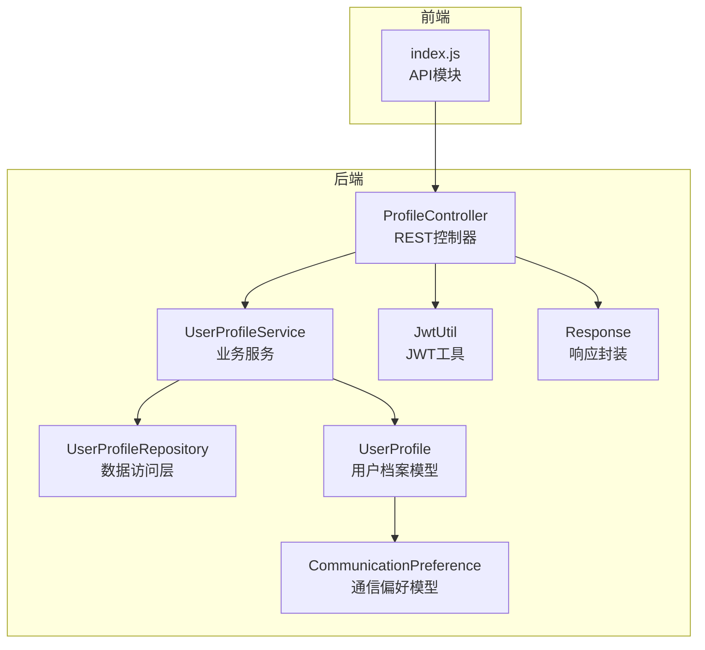
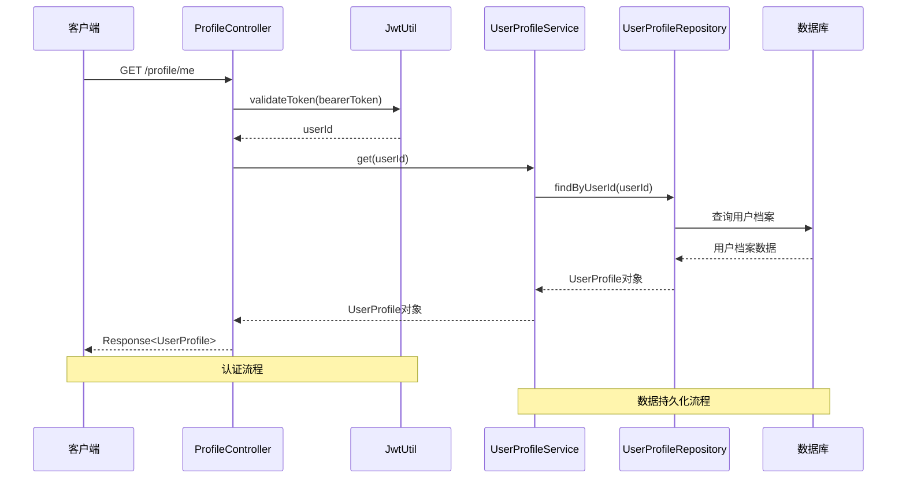
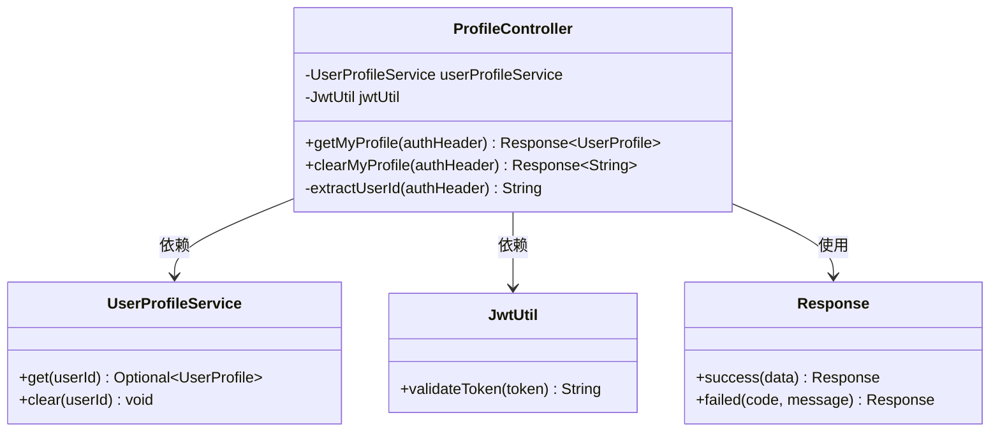
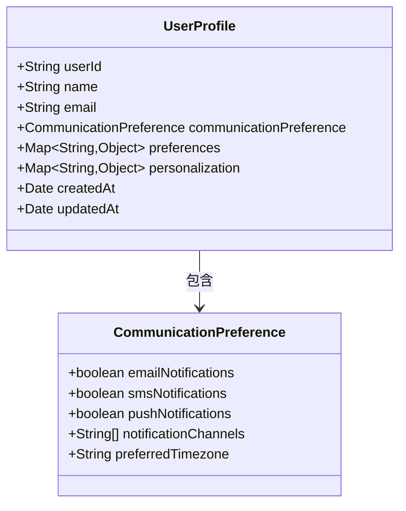
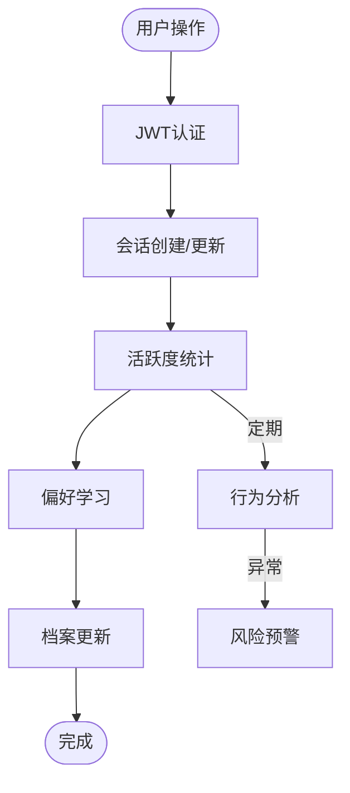
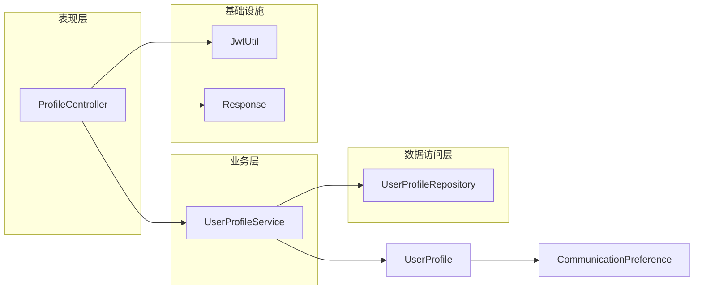

# 用户档案接口

<cite>
**本文档引用的文件**
- [ProfileController.java](file://src/main/java/com/yupi/yuaiagent/controller/ProfileController.java)
- [UserProfile.java](file://src/main/java/com/yupi/yuaiagent/profile/model/UserProfile.java)
- [CommunicationPreference.java](file://src/main/java/com/yupi/yuaiagent/profile/model/CommunicationPreference.java)
- [UserProfileService.java](file://src/main/java/com/yupi/yuaiagent/profile/UserProfileService.java)
- [UserProfileRepository.java](file://src/main/java/com/yupi/yuaiagent/profile/UserProfileRepository.java)
- [JwtUtil.java](file://src/main/java/com/yupi/yuaiagent/auth/JwtUtil.java)
- [Response.java](file://src/main/java/com/yupi/yuaiagent/common/Response.java)
- [index.js](file://yu-ai-agent-frontend/src/api/index.js)
</cite>

## 目录
1. [简介](#简介)
2. [项目结构](#项目结构)
3. [核心组件](#核心组件)
4. [架构概览](#架构概览)
5. [详细组件分析](#详细组件分析)
6. [依赖关系分析](#依赖关系分析)
7. [性能考虑](#性能考虑)
8. [故障排除指南](#故障排除指南)
9. [结论](#结论)
10. [附录](#附录)

## 简介
本文件为用户档案接口的完整API文档，面向用户服务团队提供用户数据管理API参考。文档涵盖用户个人信息的查询、清空等操作接口，详细说明用户偏好设置、通信偏好和个性化配置的管理机制，并提供用户档案的验证规则、数据完整性检查和隐私保护措施。同时记录用户状态管理、活跃度统计和行为分析相关接口，以及档案同步、备份恢复和数据迁移功能。

## 项目结构
用户档案相关代码位于后端Java工程的controller、profile、auth等包中，前端JavaScript通过API模块进行调用。



**图表来源**
- [ProfileController.java:21-61](file://src/main/java/com/yupi/yuaiagent/controller/ProfileController.java#L21-L61)
- [UserProfileService.java](file://src/main/java/com/yupi/yuaiagent/profile/UserProfileService.java)
- [UserProfileRepository.java](file://src/main/java/com/yupi/yuaiagent/profile/UserProfileRepository.java)
- [UserProfile.java](file://src/main/java/com/yupi/yuaiagent/profile/model/UserProfile.java)
- [CommunicationPreference.java](file://src/main/java/com/yupi/yuaiagent/profile/model/CommunicationPreference.java)
- [JwtUtil.java](file://src/main/java/com/yupi/yuaiagent/auth/JwtUtil.java)
- [Response.java](file://src/main/java/com/yupi/yuaiagent/common/Response.java)
- [index.js:125-133](file://yu-ai-agent-frontend/src/api/index.js#L125-L133)

**章节来源**
- [ProfileController.java:1-61](file://src/main/java/com/yupi/yuaiagent/controller/ProfileController.java#L1-L61)
- [index.js:125-133](file://yu-ai-agent-frontend/src/api/index.js#L125-L133)

## 核心组件
用户档案接口由以下核心组件构成：

### ProfileController
- REST控制器，提供用户档案的查询和清空功能
- 使用JWT认证机制，确保用户只能访问自己的档案
- 提供"/profile/me"接口进行个人档案查询和清空操作

### UserProfileService
- 用户档案业务服务层，负责档案的获取、清空等业务逻辑
- 与数据访问层交互，处理档案的持久化操作

### UserProfileRepository
- 数据访问层，负责与数据库交互
- 提供档案的存储、检索和删除功能

### UserProfile模型
- 用户档案数据模型，包含用户的个人信息和配置
- 支持用户偏好设置、通信偏好和个性化配置

**章节来源**
- [ProfileController.java:21-61](file://src/main/java/com/yupi/yuaiagent/controller/ProfileController.java#L21-L61)
- [UserProfileService.java](file://src/main/java/com/yupi/yuaiagent/profile/UserProfileService.java)
- [UserProfileRepository.java](file://src/main/java/com/yupi/yuaiagent/profile/UserProfileRepository.java)
- [UserProfile.java](file://src/main/java/com/yupi/yuaiagent/profile/model/UserProfile.java)

## 架构概览
用户档案接口采用典型的三层架构设计，遵循RESTful API规范。



**图表来源**
- [ProfileController.java:36-42](file://src/main/java/com/yupi/yuaiagent/controller/ProfileController.java#L36-L42)
- [JwtUtil.java](file://src/main/java/com/yupi/yuaiagent/auth/JwtUtil.java)
- [UserProfileService.java](file://src/main/java/com/yupi/yuaiagent/profile/UserProfileService.java)
- [UserProfileRepository.java](file://src/main/java/com/yupi/yuaiagent/profile/UserProfileRepository.java)

## 详细组件分析

### ProfileController类分析
ProfileController是用户档案接口的核心控制器，采用Spring MVC注解实现REST API。



**图表来源**
- [ProfileController.java:21-61](file://src/main/java/com/yupi/yuaiagent/controller/ProfileController.java#L21-L61)
- [JwtUtil.java](file://src/main/java/com/yupi/yuaiagent/auth/JwtUtil.java)
- [Response.java](file://src/main/java/com/yupi/yuaiagent/common/Response.java)

#### GET /profile/me 接口
- **功能**：获取当前用户的个人档案信息
- **认证要求**：需要有效的Bearer Token
- **响应格式**：Response<UserProfile>，无档案时返回空结果
- **权限控制**：通过JWT提取userId，确保只能访问自己的档案

#### DELETE /profile/me 接口
- **功能**：清空当前用户的个人档案并持久化删除
- **认证要求**：需要有效的Bearer Token
- **响应格式**：Response<String>，成功时返回"画像已清空"

**章节来源**
- [ProfileController.java:32-55](file://src/main/java/com/yupi/yuaiagent/controller/ProfileController.java#L32-L55)

### UserProfile模型分析
UserProfile是用户档案的核心数据模型，支持用户偏好设置、通信偏好和个性化配置。



**图表来源**
- [UserProfile.java](file://src/main/java/com/yupi/yuaiagent/profile/model/UserProfile.java)
- [CommunicationPreference.java](file://src/main/java/com/yupi/yuaiagent/profile/model/CommunicationPreference.java)

#### 用户偏好设置
- 支持灵活的键值对偏好配置
- 可扩展的个性化设置选项
- 自动时间戳记录创建和更新时间

#### 通信偏好
- 多渠道通知支持（邮件、短信、推送）
- 时区偏好设置
- 通知渠道优先级配置

**章节来源**
- [UserProfile.java](file://src/main/java/com/yupi/yuaiagent/profile/model/UserProfile.java)
- [CommunicationPreference.java](file://src/main/java/com/yupi/yuaiagent/profile/model/CommunicationPreference.java)

### 用户状态管理与活跃度统计
系统提供用户状态管理和活跃度统计功能，通过会话管理实现用户活动监控。



**图表来源**
- [SessionController.java:60-84](file://src/main/java/com/yupi/yuaiagent/controller/SessionController.java#L60-L84)

## 依赖关系分析
用户档案接口的依赖关系清晰，遵循分层架构原则。



**图表来源**
- [ProfileController.java:21-61](file://src/main/java/com/yupi/yuaiagent/controller/ProfileController.java#L21-L61)
- [UserProfileService.java](file://src/main/java/com/yupi/yuaiagent/profile/UserProfileService.java)
- [UserProfileRepository.java](file://src/main/java/com/yupi/yuaiagent/profile/UserProfileRepository.java)
- [JwtUtil.java](file://src/main/java/com/yupi/yuaiagent/auth/JwtUtil.java)
- [Response.java](file://src/main/java/com/yupi/yuaiagent/common/Response.java)

**章节来源**
- [ProfileController.java:21-61](file://src/main/java/com/yupi/yuaiagent/controller/ProfileController.java#L21-L61)

## 性能考虑
- **缓存策略**：建议在UserProfileService层实现适当的缓存机制，减少数据库查询压力
- **批量操作**：对于大量用户的档案管理，应考虑异步处理和批处理优化
- **连接池管理**：合理配置数据库连接池，避免连接泄漏
- **监控指标**：建立API响应时间、错误率等关键性能指标监控

## 故障排除指南
- **认证失败**：检查Authorization头格式是否为"Bearer {token}"，确认token有效性
- **权限不足**：确保token对应的userId与请求目标用户匹配
- **数据访问异常**：检查数据库连接状态和UserProfileRepository的查询逻辑
- **响应格式错误**：验证Response封装是否正确，状态码和消息格式

**章节来源**
- [ProfileController.java:36-60](file://src/main/java/com/yupi/yuaiagent/controller/ProfileController.java#L36-L60)

## 结论
用户档案接口提供了完整的用户数据管理能力，包括个人信息查询、清空操作和偏好设置管理。系统采用JWT认证确保安全性，通过分层架构实现良好的可维护性和扩展性。建议在生产环境中结合缓存策略和监控机制，进一步提升系统性能和可靠性。

## 附录

### API接口定义
- **GET /profile/me**：获取当前用户档案信息
- **DELETE /profile/me**：清空当前用户档案

### 前端调用示例
```javascript
// 获取用户档案
const profile = await getMyProfile()

// 清空用户档案
await clearMyProfile()
```

**章节来源**
- [index.js:125-133](file://yu-ai-agent-frontend/src/api/index.js#L125-L133)