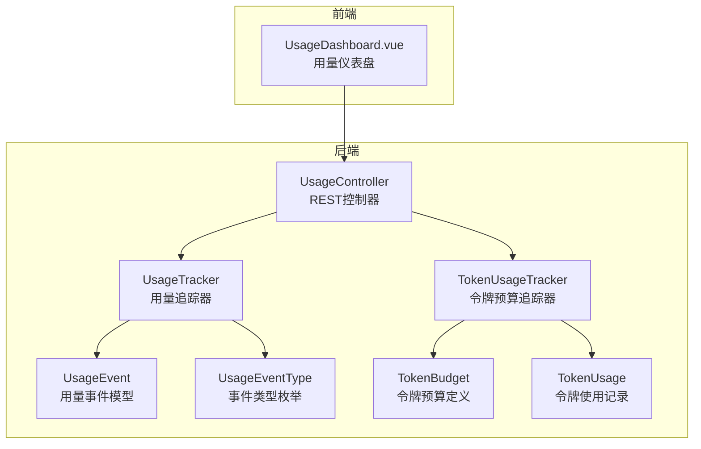
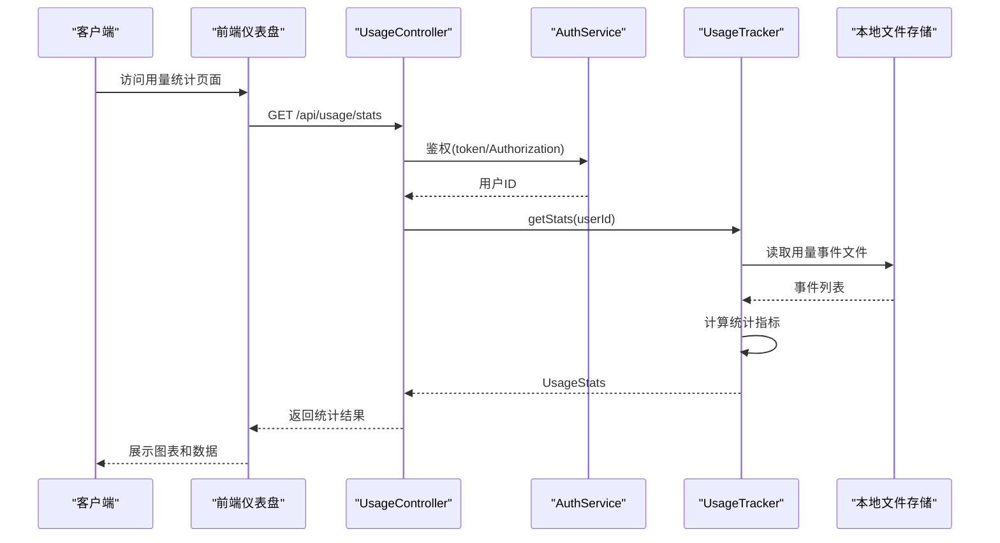
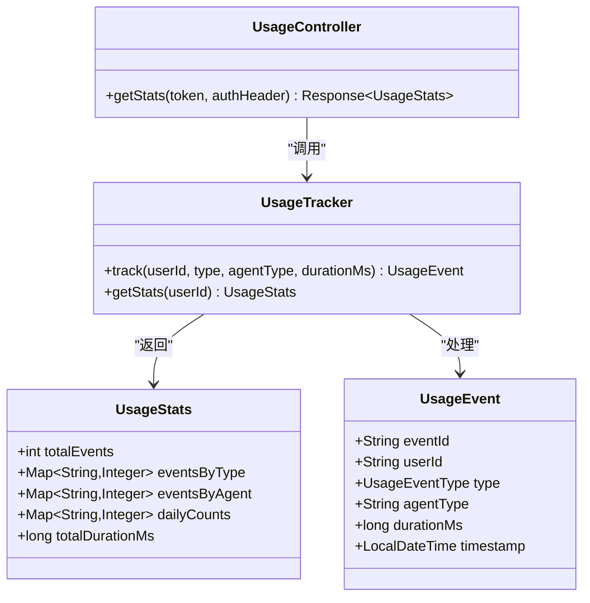
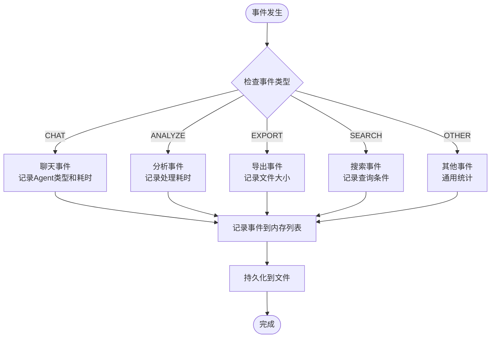
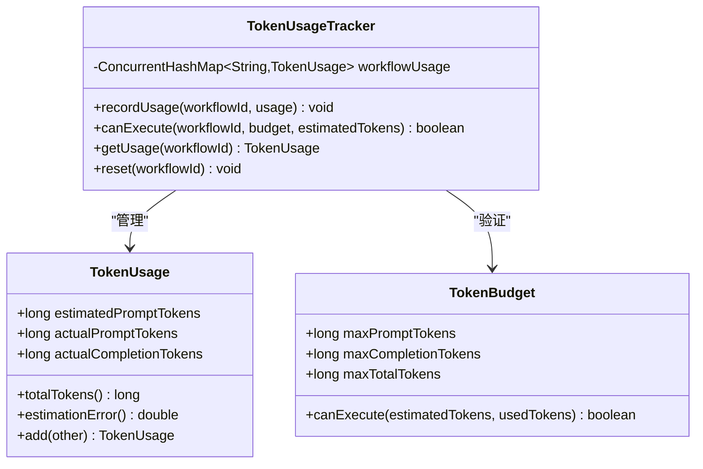
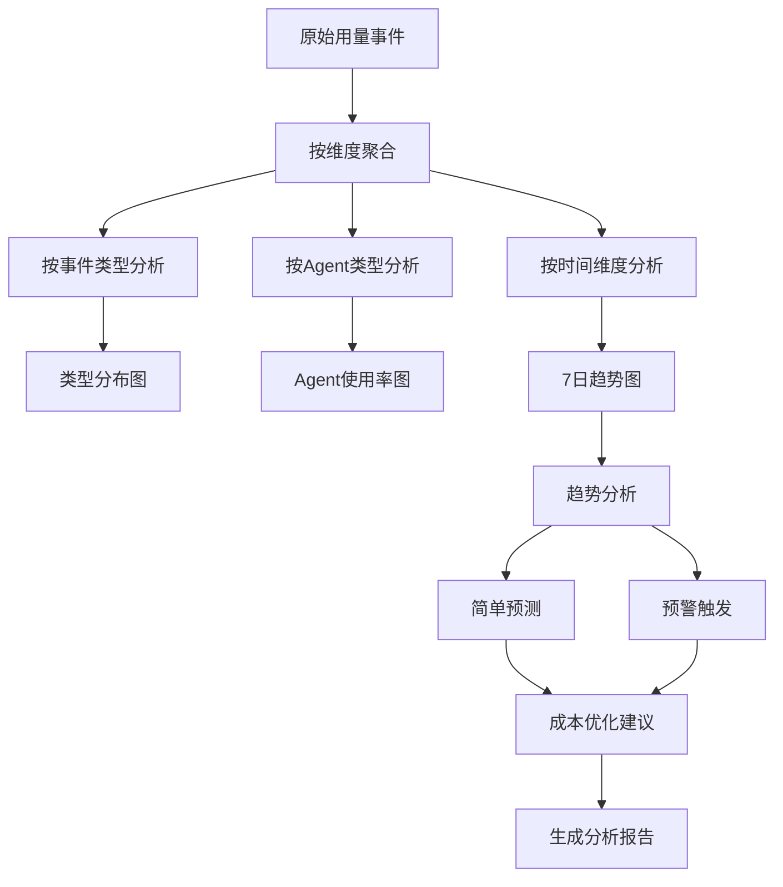
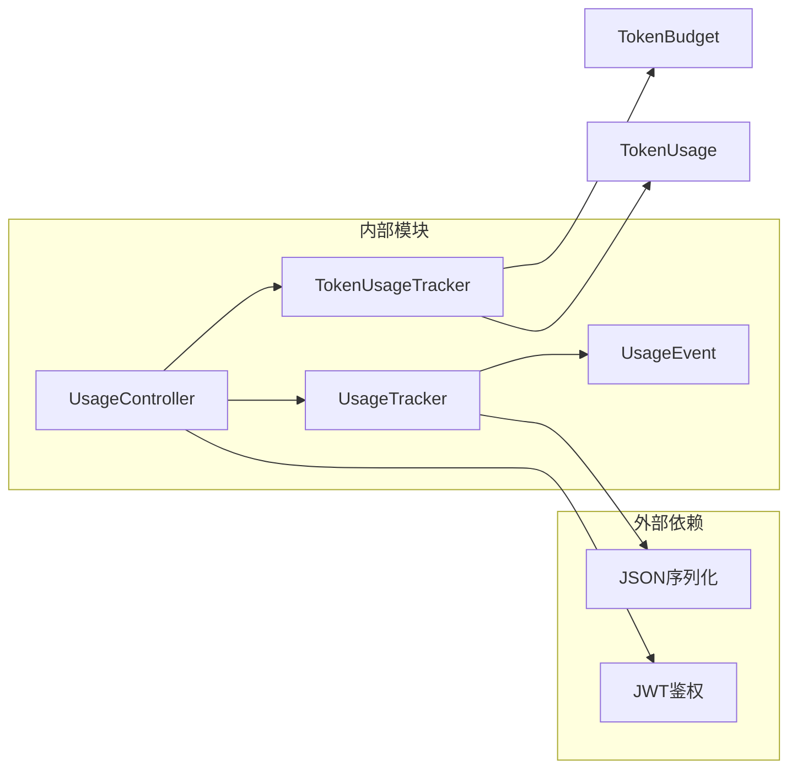

# 用量统计接口

<cite>
**本文档引用的文件**
- [UsageController.java](file://src/main/java/com/yupi/yuaiagent/controller/UsageController.java)
- [UsageTracker.java](file://src/main/java/com/yupi/yuaiagent/usage/UsageTracker.java)
- [UsageEvent.java](file://src/main/java/com/yupi/yuaiagent/usage/UsageEvent.java)
- [UsageEventType.java](file://src/main/java/com/yupi/yuaiagent/usage/UsageEventType.java)
- [TokenUsageTracker.java](file://src/main/java/com/yupi/yuaiagent/budget/TokenUsageTracker.java)
- [TokenBudget.java](file://src/main/java/com/yupi/yuaiagent/budget/TokenBudget.java)
- [TokenUsage.java](file://src/main/java/com/yupi/yuaiagent/budget/TokenUsage.java)
- [UsageDashboard.vue](file://yu-ai-agent-frontend/src/views/UsageDashboard.vue)
</cite>

## 目录
1. [简介](#简介)
2. [项目结构](#项目结构)
3. [核心组件](#核心组件)
4. [架构概览](#架构概览)
5. [详细组件分析](#详细组件分析)
6. [依赖关系分析](#依赖关系分析)
7. [性能考虑](#性能考虑)
8. [故障排除指南](#故障排除指南)
9. [结论](#结论)
10. [附录](#附录)

## 简介
本文件为用量统计接口的完整API文档，涵盖调用统计、资源使用情况和配额管理的查询接口。重点说明以下内容：
- GET /api/usage/stats 的统计报表参数、时间范围和聚合维度
- 用量事件的记录格式、分类标准和存储策略
- 配额查询和使用情况监控（基于令牌预算）
- 用量预警、阈值管理和自动告警机制
- 用量分析、趋势预测和成本优化建议
- 面向运营和财务团队的资源使用监控API指南

## 项目结构
用量统计功能主要分布在后端控制器、用量追踪器和前端仪表盘三个部分：
- 后端控制器：提供REST API接口，负责鉴权和数据返回
- 用量追踪器：负责事件记录、统计计算和本地持久化
- 前端仪表盘：展示用量统计结果，支持用户查看历史趋势

**图表来源**
- [UsageController.java:1-31](file://src/main/java/com/yupi/yuaiagent/controller/UsageController.java#L1-L31)
- [UsageTracker.java:40-143](file://src/main/java/com/yupi/yuaiagent/usage/UsageTracker.java#L40-L143)
- [UsageEvent.java:1-21](file://src/main/java/com/yupi/yuaiagent/usage/UsageEvent.java#L1-L21)
- [UsageEventType.java](file://src/main/java/com/yupi/yuaiagent/usage/UsageEventType.java)
- [TokenUsageTracker.java:1-48](file://src/main/java/com/yupi/yuaiagent/budget/TokenUsageTracker.java#L1-L48)
- [TokenBudget.java:1-14](file://src/main/java/com/yupi/yuaiagent/budget/TokenBudget.java#L1-L14)
- [TokenUsage.java:1-30](file://src/main/java/com/yupi/yuaiagent/budget/TokenUsage.java#L1-L30)

**章节来源**
- [UsageController.java:1-31](file://src/main/java/com/yupi/yuaiagent/controller/UsageController.java#L1-L31)
- [UsageTracker.java:40-143](file://src/main/java/com/yupi/yuaiagent/usage/UsageTracker.java#L40-L143)
- [UsageDashboard.vue:1-153](file://yu-ai-agent-frontend/src/views/UsageDashboard.vue#L1-L153)

## 核心组件
本节详细介绍用量统计相关的核心组件及其职责。

### 用量统计控制器
- 负责对外提供REST API接口
- 处理鉴权逻辑并返回统计结果
- 当前实现仅支持按用户维度的用量统计

### 用量追踪器
- 维护内存中的用量事件列表
- 提供统计计算方法，包括按类型、按Agent、按日期的聚合
- 支持本地文件持久化，确保重启后数据不丢失
- 默认统计最近7天的每日用量

### 用量事件模型
- 记录单次用户操作的关键信息
- 包含事件ID、用户ID、事件类型、Agent类型、耗时和时间戳
- 用于后续的统计分析和趋势预测

**章节来源**
- [UsageController.java:14-31](file://src/main/java/com/yupi/yuaiagent/controller/UsageController.java#L14-L31)
- [UsageTracker.java:40-143](file://src/main/java/com/yupi/yuaiagent/usage/UsageTracker.java#L40-L143)
- [UsageEvent.java:12-21](file://src/main/java/com/yupi/yuaiagent/usage/UsageEvent.java#L12-L21)

## 架构概览
用量统计系统的整体架构采用分层设计，从前端到后端的数据流如下：

**图表来源**
- [UsageController.java:24-30](file://src/main/java/com/yupi/yuaiagent/controller/UsageController.java#L24-L30)
- [UsageTracker.java:72-111](file://src/main/java/com/yupi/yuaiagent/usage/UsageTracker.java#L72-L111)
- [UsageDashboard.vue:86-96](file://yu-ai-agent-frontend/src/views/UsageDashboard.vue#L86-L96)

## 详细组件分析

### 用量统计API规范

#### GET /api/usage/stats 接口
- **功能**：获取当前用户的用量统计报表
- **请求方式**：GET
- **认证方式**：支持token参数或Authorization头
- **响应数据**：UsageStats对象，包含以下字段
  - totalEvents：总操作数
  - eventsByType：按事件类型分布的计数
  - eventsByAgent：按Agent类型分布的计数
  - dailyCounts：最近7天的每日计数（按日期字符串排序）
  - totalDurationMs：总耗时（毫秒）

**图表来源**
- [UsageController.java:24-30](file://src/main/java/com/yupi/yuaiagent/controller/UsageController.java#L24-L30)
- [UsageTracker.java:72-143](file://src/main/java/com/yupi/yuaiagent/usage/UsageTracker.java#L72-L143)
- [UsageEvent.java:12-21](file://src/main/java/com/yupi/yuaiagent/usage/UsageEvent.java#L12-L21)

**章节来源**
- [UsageController.java:24-30](file://src/main/java/com/yupi/yuaiagent/controller/UsageController.java#L24-L30)
- [UsageTracker.java:72-143](file://src/main/java/com/yupi/yuaiagent/usage/UsageTracker.java#L72-L143)

#### 用量事件记录格式
用量事件采用统一的数据结构，确保统计分析的一致性：

| 字段名 | 类型 | 必填 | 描述 |
|--------|------|------|------|
| eventId | String | 是 | 事件唯一标识符 |
| userId | String | 是 | 用户标识符 |
| type | UsageEventType | 是 | 事件类型枚举 |
| agentType | String | 否 | Agent类型（聊天类事件） |
| durationMs | Long | 是 | 执行耗时（毫秒） |
| timestamp | LocalDateTime | 是 | 事件发生时间 |

#### 用量事件分类标准
系统支持多种事件类型，每种类型对应不同的业务场景：

**图表来源**
- [UsageEvent.java:12-21](file://src/main/java/com/yupi/yuaiagent/usage/UsageEvent.java#L12-L21)
- [UsageEventType.java](file://src/main/java/com/yupi/yuaiagent/usage/UsageEventType.java)

**章节来源**
- [UsageEvent.java:12-21](file://src/main/java/com/yupi/yuaiagent/usage/UsageEvent.java#L12-L21)

#### 存储策略
- **内存存储**：使用CopyOnWriteArrayList保证并发安全
- **文件持久化**：启动时从JSON文件加载，每次事件更新后写入
- **存储位置**：应用工作目录下的usage-events.json文件
- **容错机制**：文件读写异常会被记录但不影响服务运行

**章节来源**
- [UsageTracker.java:40-50](file://src/main/java/com/yupi/yuaiagent/usage/UsageTracker.java#L40-L50)
- [UsageTracker.java:115-133](file://src/main/java/com/yupi/yuaiagent/usage/UsageTracker.java#L115-L133)

### 配额管理与监控

#### 令牌预算追踪器
系统提供基于令牌的配额管理能力，支持对不同工作流进行预算控制：

**图表来源**
- [TokenUsageTracker.java:14-48](file://src/main/java/com/yupi/yuaiagent/budget/TokenUsageTracker.java#L14-L48)
- [TokenBudget.java:6-14](file://src/main/java/com/yupi/yuaiagent/budget/TokenBudget.java#L6-L14)
- [TokenUsage.java:6-30](file://src/main/java/com/yupi/yuaiagent/budget/TokenUsage.java#L6-L30)

**章节来源**
- [TokenUsageTracker.java:14-48](file://src/main/java/com/yupi/yuaiagent/budget/TokenUsageTracker.java#L14-L48)
- [TokenBudget.java:6-14](file://src/main/java/com/yupi/yuaiagent/budget/TokenBudget.java#L6-L14)
- [TokenUsage.java:6-30](file://src/main/java/com/yupi/yuaiagent/budget/TokenUsage.java#L6-L30)

#### 配额查询与使用监控
- **查询接口**：通过TokenUsageTracker.getUsage(workflowId)获取指定工作流的使用情况
- **预算检查**：使用TokenUsageTracker.canExecute()在执行前检查是否有足够预算
- **实时监控**：支持对关键工作流设置阈值，当使用量接近预算时触发告警

**章节来源**
- [TokenUsageTracker.java:38-40](file://src/main/java/com/yupi/yuaiagent/budget/TokenUsageTracker.java#L38-L40)
- [TokenUsageTracker.java:30-33](file://src/main/java/com/yupi/yuaiagent/budget/TokenUsageTracker.java#L30-L33)

### 用量分析与趋势预测

#### 统计维度分析
系统提供多维度的用量分析能力：

**图表来源**
- [UsageTracker.java:72-111](file://src/main/java/com/yupi/yuaiagent/usage/UsageTracker.java#L72-L111)

#### 成本优化建议
基于用量统计结果，可提供以下优化建议：
- **时段优化**：识别低峰时段，调整资源分配
- **Agent优化**：分析各Agent使用率，优化配置
- **缓存策略**：对高频查询建立缓存机制
- **批量处理**：合并小请求，减少API调用次数

**章节来源**
- [UsageTracker.java:72-111](file://src/main/java/com/yupi/yuaiagent/usage/UsageTracker.java#L72-L111)

## 依赖关系分析

**图表来源**
- [UsageController.java:3-22](file://src/main/java/com/yupi/yuaiagent/controller/UsageController.java#L3-L22)
- [UsageTracker.java:115-133](file://src/main/java/com/yupi/yuaiagent/usage/UsageTracker.java#L115-L133)
- [TokenUsageTracker.java:14-48](file://src/main/java/com/yupi/yuaiagent/budget/TokenUsageTracker.java#L14-L48)

**章节来源**
- [UsageController.java:3-22](file://src/main/java/com/yupi/yuaiagent/controller/UsageController.java#L3-L22)
- [UsageTracker.java:115-133](file://src/main/java/com/yupi/yuaiagent/usage/UsageTracker.java#L115-L133)
- [TokenUsageTracker.java:14-48](file://src/main/java/com/yupi/yuaiagent/budget/TokenUsageTracker.java#L14-L48)

## 性能考虑
- **内存管理**：使用CopyOnWriteArrayList确保并发读取性能
- **I/O优化**：采用异步文件写入，避免阻塞主线程
- **统计计算**：使用Stream API进行高效的数据聚合
- **缓存策略**：前端对统计结果进行缓存，减少重复请求

## 故障排除指南
- **鉴权失败**：检查token参数或Authorization头是否正确传递
- **统计数据为空**：确认用户是否有相关用量事件，或检查文件存储权限
- **文件读写错误**：查看应用日志中的IO异常信息，确认存储路径可写
- **内存溢出**：监控事件列表大小，必要时清理历史数据

**章节来源**
- [UsageController.java:24-30](file://src/main/java/com/yupi/yuaiagent/controller/UsageController.java#L24-L30)
- [UsageTracker.java:115-133](file://src/main/java/com/yupi/yuaiagent/usage/UsageTracker.java#L115-L133)

## 结论
用量统计接口提供了完整的资源使用监控能力，包括：
- 实时的用户用量统计和可视化展示
- 基于令牌的配额管理和预算控制
- 多维度的分析能力和成本优化建议
- 完善的存储策略和故障恢复机制

该接口体系能够满足运营和财务团队对资源使用的全面监控需求。

## 附录

### API接口定义

#### GET /api/usage/stats
- **描述**：获取当前用户的用量统计报表
- **请求参数**：
  - token (可选)：访问令牌
  - Authorization (可选)：认证头
- **响应数据**：UsageStats对象
- **状态码**：
  - 200：成功
  - 401：未授权
  - 500：服务器错误

### 前端集成指南
- 使用Vue.js框架开发的用量仪表盘
- 支持响应式布局和交互式图表
- 提供7日趋势图、类型分布图和Agent使用率图
- 自动加载统计数据并实时更新

**章节来源**
- [UsageDashboard.vue:1-153](file://yu-ai-agent-frontend/src/views/UsageDashboard.vue#L1-L153)