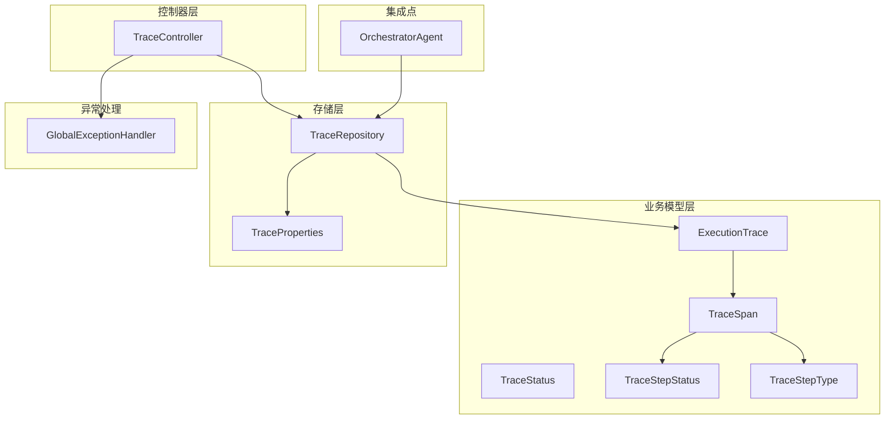
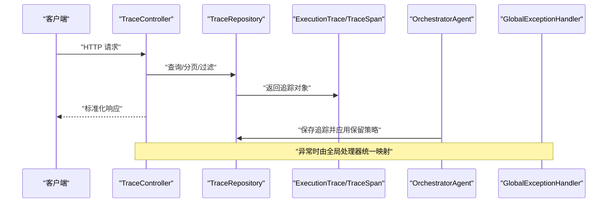
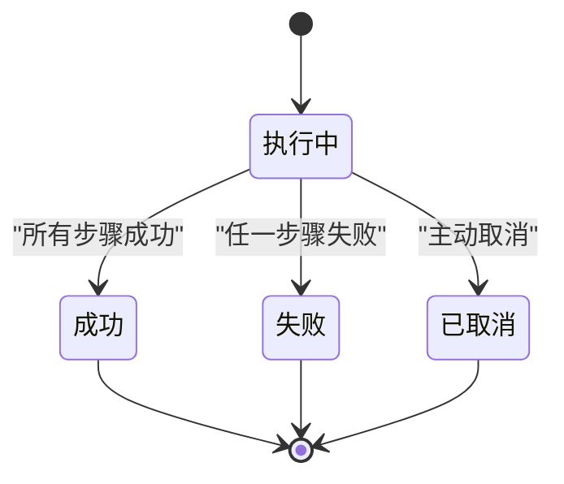
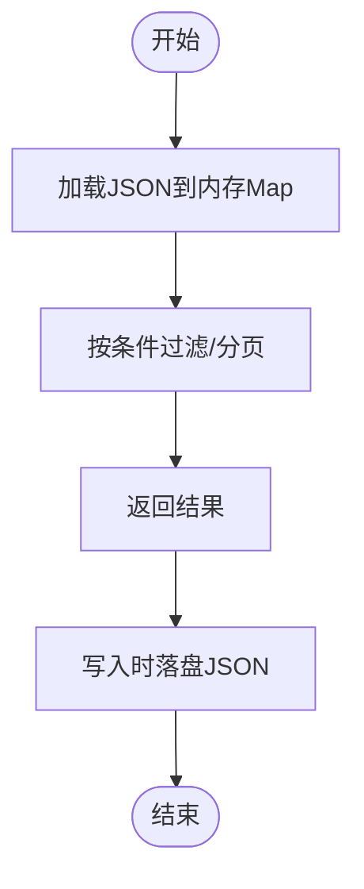
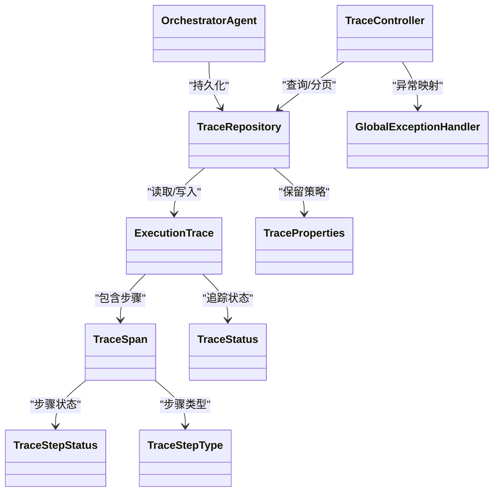

# 追踪接口

<cite>
**本文引用的文件**
- [TraceController.java](file://src/main/java/com/yupi/yuaiagent/controller/TraceController.java)
- [TraceControllerTest.java](file://src/test/java/com/yupi/yuaiagent/trace/TraceControllerTest.java)
- [TraceRepository.java](file://src/main/java/com/yupi/yuaiagent/trace/TraceRepository.java)
- [ExecutionTrace.java](file://src/main/java/com/yupi/yuaiagent/trace/model/ExecutionTrace.java)
- [TraceSpan.java](file://src/main/java/com/yupi/yuaiagent/trace/model/TraceSpan.java)
- [TraceStatus.java](file://src/main/java/com/yupi/yuaiagent/trace/model/TraceStatus.java)
- [TraceStepStatus.java](file://src/main/java/com/yupi/yuaiagent/trace/model/TraceStepStatus.java)
- [TraceStepType.java](file://src/main/java/com/yupi/yuaiagent/trace/model/TraceStepType.java)
- [TraceProperties.java](file://src/main/java/com/yupi/yuaiagent/trace/TraceProperties.java)
- [OrchestratorAgent.java](file://src/main/java/com/yupi/yuaiagent/agent/OrchestratorAgent.java)
- [GlobalExceptionHandler.java](file://src/main/java/com/yupi/yuaiagent/exception/GlobalExceptionHandler.java)
- [application.yml](file://src/main/resources/application.yml)
</cite>

## 目录
1. [简介](#简介)
2. [项目结构](#项目结构)
3. [核心组件](#核心组件)
4. [架构总览](#架构总览)
5. [详细组件分析](#详细组件分析)
6. [依赖关系分析](#依赖关系分析)
7. [性能考虑](#性能考虑)
8. [故障排查指南](#故障排查指南)
9. [结论](#结论)
10. [附录](#附录)

## 简介
本文件为追踪接口的完整API文档，覆盖以下能力：
- 查询与过滤：按用户、会话、追踪ID进行查询；支持分页与鉴权控制
- 详情查看：基于追踪ID获取完整追踪树
- 存储与索引：基于内存+文件的持久化策略与保留策略
- 类型与状态：追踪与步骤的状态机与类型定义
- 异常处理：统一异常映射与鉴权错误码
- 扩展能力：保留导出、批量查询与实时监控的扩展点

本指南面向运维与开发团队，帮助快速理解与集成系统的可观测性追踪API。

## 项目结构
追踪相关代码主要分布在以下模块：
- 控制器层：TraceController 提供HTTP接口
- 业务模型：ExecutionTrace、TraceSpan、状态与类型枚举
- 存储层：TraceRepository 基于JSON文件的持久化
- 应用配置：TraceProperties 定义保留策略等参数
- 集成点：OrchestratorAgent 在执行完成后持久化追踪

图表来源
- [TraceController.java](file://src/main/java/com/yupi/yuaiagent/controller/TraceController.java)
- [TraceRepository.java](file://src/main/java/com/yupi/yuaiagent/trace/TraceRepository.java)
- [ExecutionTrace.java](file://src/main/java/com/yupi/yuaiagent/trace/model/ExecutionTrace.java)
- [TraceSpan.java](file://src/main/java/com/yupi/yuaiagent/trace/model/TraceSpan.java)
- [TraceStatus.java](file://src/main/java/com/yupi/yuaiagent/trace/model/TraceStatus.java)
- [TraceStepStatus.java](file://src/main/java/com/yupi/yuaiagent/trace/model/TraceStepStatus.java)
- [TraceStepType.java](file://src/main/java/com/yupi/yuaiagent/trace/model/TraceStepType.java)
- [TraceProperties.java](file://src/main/java/com/yupi/yuaiagent/trace/TraceProperties.java)
- [OrchestratorAgent.java](file://src/main/java/com/yupi/yuaiagent/agent/OrchestratorAgent.java)
- [GlobalExceptionHandler.java](file://src/main/java/com/yupi/yuaiagent/exception/GlobalExceptionHandler.java)

章节来源
- [TraceController.java](file://src/main/java/com/yupi/yuaiagent/controller/TraceController.java)
- [TraceRepository.java](file://src/main/java/com/yupi/yuaiagent/trace/TraceRepository.java)
- [ExecutionTrace.java](file://src/main/java/com/yupi/yuaiagent/trace/model/ExecutionTrace.java)
- [TraceSpan.java](file://src/main/java/com/yupi/yuaiagent/trace/model/TraceSpan.java)
- [TraceStatus.java](file://src/main/java/com/yupi/yuaiagent/trace/model/TraceStatus.java)
- [TraceStepStatus.java](file://src/main/java/com/yupi/yuaiagent/trace/model/TraceStepStatus.java)
- [TraceStepType.java](file://src/main/java/com/yupi/yuaiagent/trace/model/TraceStepType.java)
- [TraceProperties.java](file://src/main/java/com/yupi/yuaiagent/trace/TraceProperties.java)
- [OrchestratorAgent.java](file://src/main/java/com/yupi/yuaiagent/agent/OrchestratorAgent.java)
- [GlobalExceptionHandler.java](file://src/main/java/com/yupi/yuaiagent/exception/GlobalExceptionHandler.java)

## 核心组件
- TraceController：对外暴露追踪查询与详情接口，负责鉴权与参数校验
- TraceRepository：追踪数据的内存缓存与文件持久化，支持分页与保留策略
- ExecutionTrace/TraceSpan：追踪与步骤的数据模型，包含状态、元数据与时间戳
- TraceStatus/TraceStepStatus/TraceStepType：状态与类型的枚举定义
- TraceProperties：追踪保留策略等配置项
- OrchestratorAgent：在执行完成后将追踪写入仓库并应用保留策略
- GlobalExceptionHandler：统一异常映射到标准响应结构

章节来源
- [TraceController.java](file://src/main/java/com/yupi/yuaiagent/controller/TraceController.java)
- [TraceRepository.java](file://src/main/java/com/yupi/yuaiagent/trace/TraceRepository.java)
- [ExecutionTrace.java](file://src/main/java/com/yupi/yuaiagent/trace/model/ExecutionTrace.java)
- [TraceSpan.java](file://src/main/java/com/yupi/yuaiagent/trace/model/TraceSpan.java)
- [TraceStatus.java](file://src/main/java/com/yupi/yuaiagent/trace/model/TraceStatus.java)
- [TraceStepStatus.java](file://src/main/java/com/yupi/yuaiagent/trace/model/TraceStepStatus.java)
- [TraceStepType.java](file://src/main/java/com/yupi/yuaiagent/trace/model/TraceStepType.java)
- [TraceProperties.java](file://src/main/java/com/yupi/yuaiagent/trace/TraceProperties.java)
- [OrchestratorAgent.java](file://src/main/java/com/yupi/yuaiagent/agent/OrchestratorAgent.java)
- [GlobalExceptionHandler.java](file://src/main/java/com/yupi/yuaiagent/exception/GlobalExceptionHandler.java)

## 架构总览
下图展示从控制器到存储与集成点的整体交互流程：

图表来源
- [TraceController.java](file://src/main/java/com/yupi/yuaiagent/controller/TraceController.java)
- [TraceRepository.java](file://src/main/java/com/yupi/yuaiagent/trace/TraceRepository.java)
- [ExecutionTrace.java](file://src/main/java/com/yupi/yuaiagent/trace/model/ExecutionTrace.java)
- [TraceSpan.java](file://src/main/java/com/yupi/yuaiagent/trace/model/TraceSpan.java)
- [OrchestratorAgent.java](file://src/main/java/com/yupi/yuaiagent/agent/OrchestratorAgent.java)
- [GlobalExceptionHandler.java](file://src/main/java/com/yupi/yuaiagent/exception/GlobalExceptionHandler.java)

## 详细组件分析

### 控制器与接口规范
- 鉴权方式
  - 支持查询参数 token 或 Authorization 头（Bearer）
  - 未提供或无效令牌返回401
  - 访问他人追踪返回403
- 接口列表
  - GET /trace/{traceId}：按追踪ID获取详情
  - GET /trace/chat/{chatId}：按会话ID分页查询
  - GET /trace/user/{userId}：按用户ID分页查询
- 参数与行为
  - 分页参数：pageNum、pageSize（最小1，最大100）
  - 时间范围与状态过滤：当前实现未提供专门的过滤参数，建议通过前端或上层服务二次过滤
  - 详情接口：返回完整追踪树（包含步骤与元数据）

章节来源
- [TraceControllerTest.java](file://src/test/java/com/yupi/yuaiagent/trace/TraceControllerTest.java)
- [TraceController.java](file://src/main/java/com/yupi/yuaiagent/controller/TraceController.java)

### 数据模型与状态机
- 追踪级别状态（TraceStatus）
  - RUNNING：执行中
  - SUCCESS：成功
  - FAILED：失败
  - CANCELLED：已取消
- 步骤级别状态（TraceStepStatus）
  - RUNNING：执行中
  - SUCCESS：成功
  - FAILED：失败
  - SKIPPED：已跳过
- 步骤类型（TraceStepType）
  - 包含工具调用、决策、等待等类型（具体枚举值见模型文件）
- 状态推导规则
  - 追踪最终状态由其步骤决定：任一失败则失败，否则成功；空追踪默认成功

图表来源
- [TraceStatus.java](file://src/main/java/com/yupi/yuaiagent/trace/model/TraceStatus.java)
- [TraceStepStatus.java](file://src/main/java/com/yupi/yuaiagent/trace/model/TraceStepStatus.java)
- [TraceSpan.java](file://src/main/java/com/yupi/yuaiagent/trace/model/TraceSpan.java)

章节来源
- [TraceStatus.java](file://src/main/java/com/yupi/yuaiagent/trace/model/TraceStatus.java)
- [TraceStepStatus.java](file://src/main/java/com/yupi/yuaiagent/trace/model/TraceStepStatus.java)
- [TraceStepType.java](file://src/main/java/com/yupi/yuaiagent/trace/model/TraceStepType.java)
- [TraceSpan.java](file://src/main/java/com/yupi/yuaiagent/trace/model/TraceSpan.java)
- [TraceModelPropertyTest.java](file://src/test/java/com/yupi/yuaiagent/trace/TraceModelPropertyTest.java)

### 存储格式、索引与查询优化
- 存储格式
  - JSON文件：键为追踪ID，值为追踪对象
  - 文件路径：由配置项指定，默认位于本地目录
- 索引策略
  - 内存Map：以追踪ID为键的并发安全缓存
  - 文件I/O：启动时加载，写入时落盘
- 查询优化
  - 分页：在内存集合上进行子列表切片
  - 锁粒度：读写分离锁，写操作加写锁，读操作加读锁
- 保留策略
  - 按用户维度强制清理历史，避免无限增长

图表来源
- [TraceRepository.java](file://src/main/java/com/yupi/yuaiagent/trace/TraceRepository.java)
- [application.yml](file://src/main/resources/application.yml)

章节来源
- [TraceRepository.java](file://src/main/java/com/yupi/yuaiagent/trace/TraceRepository.java)
- [TraceProperties.java](file://src/main/java/com/yupi/yuaiagent/trace/TraceProperties.java)
- [application.yml](file://src/main/resources/application.yml)

### 异常处理机制
- 统一异常映射：全局异常处理器将异常转换为标准响应结构
- 鉴权错误：未授权与权限不足分别映射为401与403
- 其他错误：根据异常类型映射到合适的HTTP状态码与错误码

章节来源
- [GlobalExceptionHandler.java](file://src/main/java/com/yupi/yuaiagent/exception/GlobalExceptionHandler.java)
- [TraceControllerTest.java](file://src/test/java/com/yupi/yuaiagent/trace/TraceControllerTest.java)

### 批量查询与导出（扩展能力）
- 批量查询
  - 当前控制器未提供专门的批量查询接口，可通过分页循环或上层聚合实现
- 导出功能
  - 仓库支持将内存中的追踪集合整体序列化为JSON文件，可作为导出入口
  - 建议结合分页与过滤参数，生成符合需求的导出文件

章节来源
- [TraceRepository.java](file://src/main/java/com/yupi/yuaiagent/trace/TraceRepository.java)

### 实时监控接口（扩展能力）
- SSE/长连接：当前未提供专用的实时推送接口
- 建议方案：基于现有追踪写入事件，扩展SSE或WebSocket推送通道，向订阅者推送最新追踪状态变更

章节来源
- [TraceRepository.java](file://src/main/java/com/yupi/yuaiagent/trace/TraceRepository.java)

## 依赖关系分析
- 控制器依赖存储与鉴权服务，返回标准化响应
- 存储依赖配置与模型，提供分页与保留策略
- 集成点在执行完成后写入存储并应用保留策略
- 异常处理贯穿整个调用链

图表来源
- [TraceController.java](file://src/main/java/com/yupi/yuaiagent/controller/TraceController.java)
- [TraceRepository.java](file://src/main/java/com/yupi/yuaiagent/trace/TraceRepository.java)
- [ExecutionTrace.java](file://src/main/java/com/yupi/yuaiagent/trace/model/ExecutionTrace.java)
- [TraceSpan.java](file://src/main/java/com/yupi/yuaiagent/trace/model/TraceSpan.java)
- [TraceStatus.java](file://src/main/java/com/yupi/yuaiagent/trace/model/TraceStatus.java)
- [TraceStepStatus.java](file://src/main/java/com/yupi/yuaiagent/trace/model/TraceStepStatus.java)
- [TraceStepType.java](file://src/main/java/com/yupi/yuaiagent/trace/model/TraceStepType.java)
- [TraceProperties.java](file://src/main/java/com/yupi/yuaiagent/trace/TraceProperties.java)
- [OrchestratorAgent.java](file://src/main/java/com/yupi/yuaiagent/agent/OrchestratorAgent.java)
- [GlobalExceptionHandler.java](file://src/main/java/com/yupi/yuaiagent/exception/GlobalExceptionHandler.java)

## 性能考虑
- 内存与锁
  - 使用并发安全Map与读写锁，写少读多场景下性能较优
- 分页限制
  - 默认每页20条，最大100条，避免一次性返回过多数据
- 文件I/O
  - 写入采用落盘策略，建议在高并发场景下评估磁盘IO瓶颈
- 状态推导
  - 追踪最终状态计算在内存完成，复杂度与步骤数线性相关

章节来源
- [TraceRepository.java](file://src/main/java/com/yupi/yuaiagent/trace/TraceRepository.java)

## 故障排查指南
- 401 未授权
  - 检查请求是否携带有效token或Authorization头
- 403 权限不足
  - 确认当前用户与目标追踪所属用户一致
- 404 资源不存在
  - 确认追踪ID/会话ID/用户ID正确且已存在
- 存储异常
  - 查看存储目录权限与磁盘空间；检查JSON文件完整性
- 状态不一致
  - 检查步骤终止逻辑与状态推导规则

章节来源
- [TraceControllerTest.java](file://src/test/java/com/yupi/yuaiagent/trace/TraceControllerTest.java)
- [TraceRepository.java](file://src/main/java/com/yupi/yuaiagent/trace/TraceRepository.java)

## 结论
追踪接口提供了基础的查询、分页与鉴权能力，并通过内存+文件的方式实现了轻量级持久化。建议在生产环境中结合保留策略与日志监控，逐步扩展导出、批量查询与实时推送能力，以满足更复杂的可观测性需求。

## 附录

### 接口清单与参数说明
- GET /trace/{traceId}
  - 功能：按追踪ID获取详情
  - 鉴权：支持token或Authorization头
  - 响应：追踪详情（包含步骤与元数据）
- GET /trace/chat/{chatId}
  - 功能：按会话ID分页查询
  - 参数：pageNum、pageSize（最小1，最大100）
  - 鉴权：支持token或Authorization头
- GET /trace/user/{userId}
  - 功能：按用户ID分页查询
  - 参数：pageNum、pageSize（最小1，最大100）
  - 鉴权：支持token或Authorization头

章节来源
- [TraceControllerTest.java](file://src/test/java/com/yupi/yuaiagent/trace/TraceControllerTest.java)
- [TraceController.java](file://src/main/java/com/yupi/yuaiagent/controller/TraceController.java)

### 配置项参考
- trace.storage.dir：追踪文件存储目录（默认 ./tmp/traces）
- 保留策略：按用户维度强制清理历史（具体阈值由TraceProperties控制）

章节来源
- [application.yml](file://src/main/resources/application.yml)
- [TraceProperties.java](file://src/main/java/com/yupi/yuaiagent/trace/TraceProperties.java)