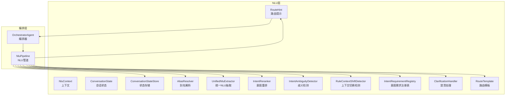
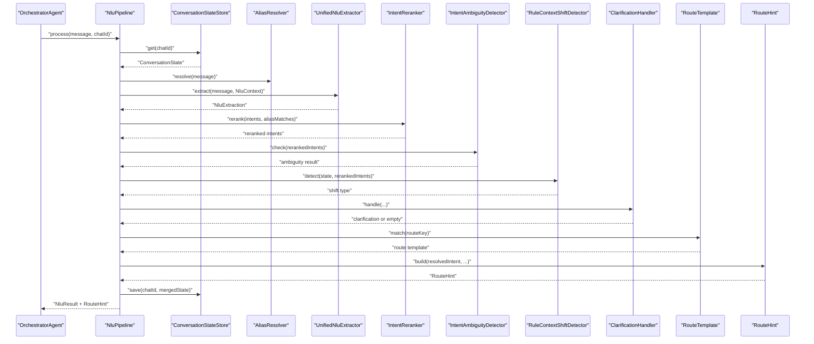
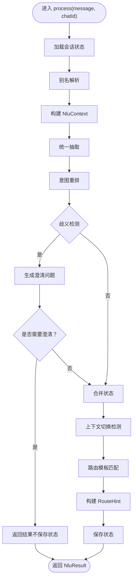
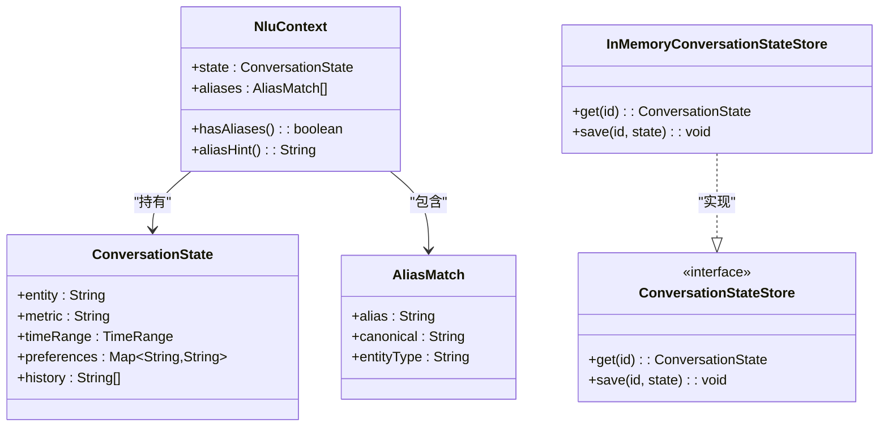
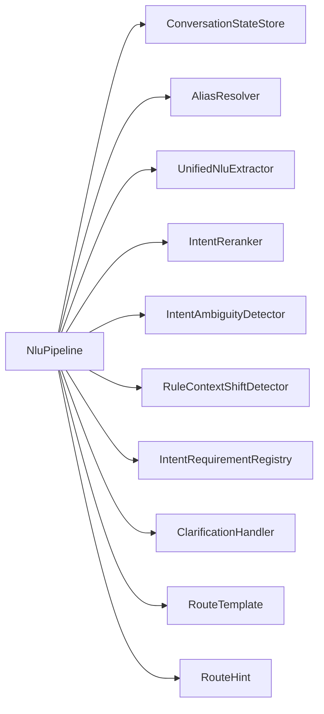

# NLU管道架构

<cite>
**本文引用的文件**
- [NluPipeline.java](file://src/main/java/com/yupi/yuaiagent/nlu/NluPipeline.java)
- [UnifiedNluExtractor.java](file://src/main/java/com/yupi/yuaiagent/nlu/UnifiedNluExtractor.java)
- [NluContext.java](file://src/main/java/com/yupi/yuaiagent/nlu/NluContext.java)
- [ConversationState.java](file://src/main/java/com/yupi/yuaiagent/nlu/ConversationState.java)
- [ConversationStateStore.java](file://src/main/java/com/yupi/yuaiagent/nlu/ConversationStateStore.java)
- [InMemoryConversationStateStore.java](file://src/main/java/com/yupi/yuaiagent/nlu/InMemoryConversationStateStore.java)
- [AliasResolver.java](file://src/main/java/com/yupi/yuaiagent/nlu/AliasResolver.java)
- [IntentReranker.java](file://src/main/java/com/yupi/yuaiagent/nlu/IntentReranker.java)
- [IntentAmbiguityDetector.java](file://src/main/java/com/yupi/yuaiagent/nlu/IntentAmbiguityDetector.java)
- [RuleContextShiftDetector.java](file://src/main/java/com/yupi/yuaiagent/nlu/RuleContextShiftDetector.java)
- [IntentRequirementRegistry.java](file://src/main/java/com/yupi/yuaiagent/nlu/IntentRequirementRegistry.java)
- [ClarificationHandler.java](file://src/main/java/com/yupi/yuaiagent/nlu/ClarificationHandler.java)
- [RouteTemplate.java](file://src/main/java/com/yupi/yuaiagent/nlu/RouteTemplate.java)
- [RouteHint.java](file://src/main/java/com/yupi/yuaiagent/nlu/RouteHint.java)
- [OrchestratorAgent.java](file://src/main/java/com/yupi/yuaiagent/agent/OrchestratorAgent.java)
- [AgentConfig.java](file://src/main/java/com/yupi/yuaiagent/config/AgentConfig.java)
</cite>

## 目录
1. [引言](#引言)
2. [项目结构](#项目结构)
3. [核心组件](#核心组件)
4. [架构总览](#架构总览)
5. [详细组件分析](#详细组件分析)
6. [依赖关系分析](#依赖关系分析)
7. [性能考虑](#性能考虑)
8. [故障排查指南](#故障排查指南)
9. [结论](#结论)
10. [附录](#附录)

## 引言
本文件系统性阐述统一NLU提取器与NLU管道的整体架构与实现机制，覆盖管道化处理流程、数据流转与状态管理；详解NLU上下文（含会话状态、历史对话与用户偏好）的组织与维护；明确各管道组件的职责、接口与交互模式；给出配置选项、性能优化策略与错误处理机制，并提供可操作的使用示例与调试方法，帮助开发者高效构建与维护NLU管道。

## 项目结构
NLU相关代码集中在后端模块的nlu包内，围绕“状态存储—别名解析—统一抽取—意图重排—歧义检测—路由模板—澄清处理”的流水线展开；OrchestratorAgent作为上层编排者，通过NluPipeline驱动NLU处理并产出路由提示（RouteHint），进而驱动后续智能体执行。

图表来源
- [NluPipeline.java:36-170](file://src/main/java/com/yupi/yuaiagent/nlu/NluPipeline.java#L36-L170)
- [UnifiedNluExtractor.java:23-120](file://src/main/java/com/yupi/yuaiagent/nlu/UnifiedNluExtractor.java#L23-L120)
- [NluContext.java:17-44](file://src/main/java/com/yupi/yuaiagent/nlu/NluContext.java#L17-L44)
- [ConversationState.java:1-200](file://src/main/java/com/yupi/yuaiagent/nlu/ConversationState.java#L1-L200)
- [ConversationStateStore.java:1-200](file://src/main/java/com/yupi/yuaiagent/nlu/ConversationStateStore.java#L1-L200)
- [AliasResolver.java:1-200](file://src/main/java/com/yupi/yuaiagent/nlu/AliasResolver.java#L1-L200)
- [IntentReranker.java:1-200](file://src/main/java/com/yupi/yuaiagent/nlu/IntentReranker.java#L1-L200)
- [IntentAmbiguityDetector.java:1-200](file://src/main/java/com/yupi/yuaiagent/nlu/IntentAmbiguityDetector.java#L1-L200)
- [RuleContextShiftDetector.java:1-200](file://src/main/java/com/yupi/yuaiagent/nlu/RuleContextShiftDetector.java#L1-L200)
- [IntentRequirementRegistry.java:1-200](file://src/main/java/com/yupi/yuaiagent/nlu/IntentRequirementRegistry.java#L1-L200)
- [ClarificationHandler.java:1-200](file://src/main/java/com/yupi/yuaiagent/nlu/ClarificationHandler.java#L1-L200)
- [RouteTemplate.java:1-200](file://src/main/java/com/yupi/yuaiagent/nlu/RouteTemplate.java#L1-L200)
- [RouteHint.java:1-200](file://src/main/java/com/yupi/yuaiagent/nlu/RouteHint.java#L1-L200)
- [OrchestratorAgent.java:1-500](file://src/main/java/com/yupi/yuaiagent/agent/OrchestratorAgent.java#L1-L500)

章节来源
- [NluPipeline.java:36-170](file://src/main/java/com/yupi/yuaiagent/nlu/NluPipeline.java#L36-L170)
- [OrchestratorAgent.java:1-500](file://src/main/java/com/yupi/yuaiagent/agent/OrchestratorAgent.java#L1-L500)

## 核心组件
- NluPipeline：NLU管道主控制器，串联状态加载、别名解析、统一抽取、意图重排、歧义检测、上下文切换检测、澄清处理与状态持久化，最终输出NluResult与RouteHint。
- UnifiedNluExtractor：统一抽取器，负责一次性完成意图、实体、指标、时间范围等多维信息抽取，并返回置信度。
- NluContext：一次消息的NLU上下文，包含当前会话状态与本次输入的别名元数据，二者分离以避免跨消息污染。
- ConversationState/ConversationStateStore：会话状态与持久化抽象，支持按会话ID读写状态。
- AliasResolver/IntentReranker/IntentAmbiguityDetector：别名解析、意图重排与歧义检测，提升意图识别鲁棒性。
- RouteTemplate/RouteHint：路由模板与路由提示，将NLU结果映射到具体执行路径。
- ClarificationHandler/RuleContextShiftDetector/IntentRequirementRegistry：澄清请求生成、上下文切换检测与意图需求校验，保障对话连贯与完备。
- OrchestratorAgent/AgentConfig：上层编排与装配入口，将NluPipeline注入到运行时。

章节来源
- [NluPipeline.java:36-170](file://src/main/java/com/yupi/yuaiagent/nlu/NluPipeline.java#L36-L170)
- [UnifiedNluExtractor.java:23-120](file://src/main/java/com/yupi/yuaiagent/nlu/UnifiedNluExtractor.java#L23-L120)
- [NluContext.java:17-44](file://src/main/java/com/yupi/yuaiagent/nlu/NluContext.java#L17-L44)
- [ConversationState.java:1-200](file://src/main/java/com/yupi/yuaiagent/nlu/ConversationState.java#L1-L200)
- [ConversationStateStore.java:1-200](file://src/main/java/com/yupi/yuaiagent/nlu/ConversationStateStore.java#L1-L200)
- [AliasResolver.java:1-200](file://src/main/java/com/yupi/yuaiagent/nlu/AliasResolver.java#L1-L200)
- [IntentReranker.java:1-200](file://src/main/java/com/yupi/yuaiagent/nlu/IntentReranker.java#L1-L200)
- [IntentAmbiguityDetector.java:1-200](file://src/main/java/com/yupi/yuaiagent/nlu/IntentAmbiguityDetector.java#L1-L200)
- [RouteTemplate.java:1-200](file://src/main/java/com/yupi/yuaiagent/nlu/RouteTemplate.java#L1-L200)
- [RouteHint.java:1-200](file://src/main/java/com/yupi/yuaiagent/nlu/RouteHint.java#L1-L200)
- [ClarificationHandler.java:1-200](file://src/main/java/com/yupi/yuaiagent/nlu/ClarificationHandler.java#L1-L200)
- [RuleContextShiftDetector.java:1-200](file://src/main/java/com/yupi/yuaiagent/nlu/RuleContextShiftDetector.java#L1-L200)
- [IntentRequirementRegistry.java:1-200](file://src/main/java/com/yupi/yuaiagent/nlu/IntentRequirementRegistry.java#L1-L200)
- [OrchestratorAgent.java:1-500](file://src/main/java/com/yupi/yuaiagent/agent/OrchestratorAgent.java#L1-L500)
- [AgentConfig.java:1-200](file://src/main/java/com/yupi/yuaiagent/config/AgentConfig.java#L1-L200)

## 架构总览
下图展示从OrchestratorAgent到NluPipeline再到各NLU组件的调用链路与数据流：

图表来源
- [NluPipeline.java:69-153](file://src/main/java/com/yupi/yuaiagent/nlu/NluPipeline.java#L69-L153)
- [UnifiedNluExtractor.java:99-120](file://src/main/java/com/yupi/yuaiagent/nlu/UnifiedNluExtractor.java#L99-L120)
- [OrchestratorAgent.java:170-185](file://src/main/java/com/yupi/yuaiagent/agent/OrchestratorAgent.java#L170-L185)

## 详细组件分析

### 统一NLU抽取器（UnifiedNluExtractor）
- 设计要点
  - 单次LLM调用完成多维抽取（意图、实体、指标、时间范围），并返回置信度。
  - 别名仅作为提示传入NluContext，不注入会话状态，避免跨消息污染。
- 关键行为
  - 接收原始消息与NluContext，基于上下文与别名提示进行抽取。
  - 输出包含意图列表、实体、指标、时间范围与置信度的结果对象。
- 复杂度与性能
  - 抽取复杂度取决于提示工程与模型能力；建议通过路由模板与别名信号降低歧义，减少重复上下文。

章节来源
- [UnifiedNluExtractor.java:23-120](file://src/main/java/com/yupi/yuaiagent/nlu/UnifiedNluExtractor.java#L23-L120)
- [NluContext.java:17-44](file://src/main/java/com/yupi/yuaiagent/nlu/NluContext.java#L17-L44)

### NLU管道（NluPipeline）
- 流程步骤
  1) 加载会话状态
  2) 别名解析（仅本次消息有效）
  3) 构建NluContext（状态+别名分离）
  4) 统一抽取（单次LLM调用）
  5) 基于别名域信号重排意图
  6) 对重排后的意图进行歧义检测
  7) 解析得到最高分意图
  8) 上下文切换检测
  9) 澄清处理（必要时生成澄清问题）
  10) 路由模板匹配
  11) 构建RouteHint
  12) 合并状态（若无需澄清）
  13) 返回NluResult与RouteHint
- 数据结构
  - NluResult封装原始消息、合并后的状态、抽取结果、别名匹配、重排意图、RouteHint、澄清信息与是否需要澄清标记。
- 错误处理
  - 当意图枚举值非法时回退为UNKNOWN。
  - 无意图时默认UNKNOWN。
  - 澄清阶段若产生澄清问题，则不保存状态，等待澄清后继续。

图表来源
- [NluPipeline.java:69-153](file://src/main/java/com/yupi/yuaiagent/nlu/NluPipeline.java#L69-L153)

章节来源
- [NluPipeline.java:36-170](file://src/main/java/com/yupi/yuaiagent/nlu/NluPipeline.java#L36-L170)

### NLU上下文与状态管理
- NluContext
  - 结构：包含ConversationState与本次消息的别名列表。
  - 别名提示：以字符串形式注入提示词，确保LLM可见但不混淆为会话状态的一部分。
- ConversationState/ConversationStateStore
  - 状态模型：承载会话级信息（如最近实体、指标、时间范围、偏好等）。
  - 存储抽象：按chatId读写状态，支持内存或持久化实现。
- InMemoryConversationStateStore
  - 默认内存实现，适合测试与演示；生产环境可替换为持久化实现。

图表来源
- [NluContext.java:17-44](file://src/main/java/com/yupi/yuaiagent/nlu/NluContext.java#L17-L44)
- [ConversationState.java:1-200](file://src/main/java/com/yupi/yuaiagent/nlu/ConversationState.java#L1-L200)
- [ConversationStateStore.java:1-200](file://src/main/java/com/yupi/yuaiagent/nlu/ConversationStateStore.java#L1-L200)
- [InMemoryConversationStateStore.java:1-200](file://src/main/java/com/yupi/yuaiagent/nlu/InMemoryConversationStateStore.java#L1-L200)

章节来源
- [NluContext.java:17-44](file://src/main/java/com/yupi/yuaiagent/nlu/NluContext.java#L17-L44)
- [ConversationState.java:1-200](file://src/main/java/com/yupi/yuaiagent/nlu/ConversationState.java#L1-L200)
- [ConversationStateStore.java:1-200](file://src/main/java/com/yupi/yuaiagent/nlu/ConversationStateStore.java#L1-L200)
- [InMemoryConversationStateStore.java:1-200](file://src/main/java/com/yupi/yuaiagent/nlu/InMemoryConversationStateStore.java#L1-L200)

### 组件职责与交互模式
- AliasResolver：从输入中识别别名并返回别名匹配列表，用于后续提示与意图重排。
- IntentReranker：利用别名域信号对抽取的意图进行重排，提升领域相关意图的优先级。
- IntentAmbiguityDetector：对重排后的意图分数进行统计/阈值判定，判断是否存在歧义。
- RuleContextShiftDetector：基于规则检测上下文切换（如领域/任务切换），辅助路由与澄清决策。
- IntentRequirementRegistry：登记不同意图所需的前置条件（如实体、指标），用于完整性校验。
- ClarificationHandler：在歧义或缺失必要条件时生成澄清问题，引导用户提供更多信息。
- RouteTemplate：根据意图与上下文匹配路由模板，决定后续执行路径。
- RouteHint：将NLU结果映射为可执行的路由提示，供上层编排器使用。

章节来源
- [AliasResolver.java:1-200](file://src/main/java/com/yupi/yuaiagent/nlu/AliasResolver.java#L1-L200)
- [IntentReranker.java:1-200](file://src/main/java/com/yupi/yuaiagent/nlu/IntentReranker.java#L1-L200)
- [IntentAmbiguityDetector.java:1-200](file://src/main/java/com/yupi/yuaiagent/nlu/IntentAmbiguityDetector.java#L1-L200)
- [RuleContextShiftDetector.java:1-200](file://src/main/java/com/yupi/yuaiagent/nlu/RuleContextShiftDetector.java#L1-L200)
- [IntentRequirementRegistry.java:1-200](file://src/main/java/com/yupi/yuaiagent/nlu/IntentRequirementRegistry.java#L1-L200)
- [ClarificationHandler.java:1-200](file://src/main/java/com/yupi/yuaiagent/nlu/ClarificationHandler.java#L1-L200)
- [RouteTemplate.java:1-200](file://src/main/java/com/yupi/yuaiagent/nlu/RouteTemplate.java#L1-L200)
- [RouteHint.java:1-200](file://src/main/java/com/yupi/yuaiagent/nlu/RouteHint.java#L1-L200)

### 编排与装配（OrchestratorAgent 与 AgentConfig）
- OrchestratorAgent通过NluPipeline驱动NLU处理，并将RouteHint转换为AgentIntent以调度后续智能体。
- AgentConfig负责装配NluPipeline及其依赖组件，确保各组件正确注入与初始化。

章节来源
- [OrchestratorAgent.java:1-500](file://src/main/java/com/yupi/yuaiagent/agent/OrchestratorAgent.java#L1-L500)
- [AgentConfig.java:1-200](file://src/main/java/com/yupi/yuaiagent/config/AgentConfig.java#L1-L200)

## 依赖关系分析
- 耦合与内聚
  - NluPipeline高内聚地编排各NLU组件，耦合点主要在接口契约（抽取、重排、歧义、澄清、路由）。
  - NluContext将“状态”与“别名元数据”解耦，避免跨消息污染，提升稳定性。
- 外部依赖
  - 统一抽取依赖LLM能力与提示工程；别名解析依赖规则/词典；歧义检测与重排依赖评分策略。
- 可能的循环依赖
  - 当前结构通过接口与单向数据流避免循环依赖；注意避免在抽取器中反向依赖编排器。

图表来源
- [NluPipeline.java:36-170](file://src/main/java/com/yupi/yuaiagent/nlu/NluPipeline.java#L36-L170)

章节来源
- [NluPipeline.java:36-170](file://src/main/java/com/yupi/yuaiagent/nlu/NluPipeline.java#L36-L170)

## 性能考虑
- 提示最小化与上下文压缩
  - 将别名提示与状态分离，避免冗余上下文；结合历史压缩策略减少token消耗。
- 单次抽取与批量处理
  - 统一抽取减少LLM调用次数；对批量消息可考虑批内去重与缓存。
- 意图重排与歧义检测前置
  - 在抽取后立即重排与检测，尽早短路低质量意图，降低后续处理成本。
- 存储与序列化
  - 状态存储采用增量合并与版本化字段，避免全量写入；内存实现适合小规模场景，生产建议持久化。
- 路由模板命中率
  - 通过规则完善与模板优化提升命中率，减少回退分支与二次抽取。

## 故障排查指南
- 常见问题定位
  - 无意图或UNKNOWN：检查抽取器输出与意图枚举映射；确认别名是否正确传递。
  - 意图歧义：查看歧义检测阈值与重排策略；评估提示中别名与上下文的清晰度。
  - 状态未更新：确认是否触发了澄清流程；澄清阶段不会保存状态。
  - 上下文漂移：检查上下文切换检测逻辑与路由模板匹配。
- 调试建议
  - 打印NluResult关键字段（意图、置信度、实体、指标、时间范围、澄清标记）。
  - 分步验证：先验证别名解析，再验证抽取，最后验证重排与歧义检测。
  - 使用内存状态存储快速复现问题，排除持久化异常。
- 日志与追踪
  - 在NluPipeline的关键节点记录日志，便于回溯处理链路与性能瓶颈。

章节来源
- [NluPipeline.java:69-153](file://src/main/java/com/yupi/yuaiagent/nlu/NluPipeline.java#L69-L153)

## 结论
该NLU管道通过“状态+别名分离”的上下文设计与“统一抽取+多维后处理”的流水线，实现了高鲁棒性的意图识别与路由决策。其模块化与接口化设计便于扩展与优化，结合合理的提示工程与路由模板，可在复杂对话场景中稳定落地。

## 附录

### 管道配置选项（示例维度）
- 别名解析
  - 规则/词典配置、别名匹配阈值、别名覆盖策略。
- 抽取器
  - 提示模板、最大输出长度、温度采样、置信度阈值。
- 意图重排
  - 领域权重、别名信号强度、重排算法参数。
- 歧义检测
  - 分数差阈值、Top-K保留、置信度下限。
- 上下文切换检测
  - 规则集、关键词集合、切换窗口大小。
- 澄清处理
  - 澄清模板、最大澄清轮次、超时策略。
- 路由模板
  - 模板匹配策略、默认路由、降级策略。
- 状态存储
  - 序列化格式、压缩策略、清理策略、持久化实现选择。

### 实际使用示例（步骤说明）
- 场景：用户输入“查TX的股价”，期望识别为“查询股价”意图并路由到对应工具。
- 步骤
  1) OrchestratorAgent接收消息与chatId，调用NluPipeline.process。
  2) NluPipeline加载当前会话状态，解析别名为“TX=腾讯”。
  3) 构建NluContext并调用UnifiedNluExtractor进行统一抽取。
  4) 基于别名对意图进行重排，检测歧义，解析最高分意图。
  5) 若需澄清则生成澄清问题，否则合并状态并构建RouteHint。
  6) 返回NluResult与RouteHint，OrchestratorAgent据此调度后续动作。

章节来源
- [OrchestratorAgent.java:170-185](file://src/main/java/com/yupi/yuaiagent/agent/OrchestratorAgent.java#L170-L185)
- [NluPipeline.java:69-153](file://src/main/java/com/yupi/yuaiagent/nlu/NluPipeline.java#L69-L153)