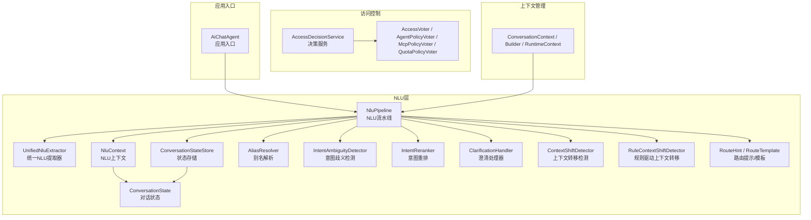
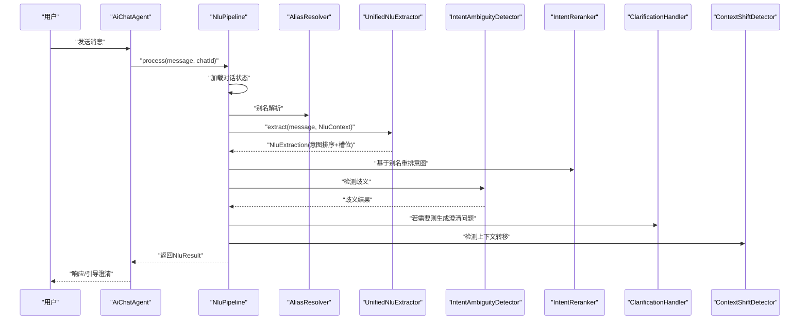
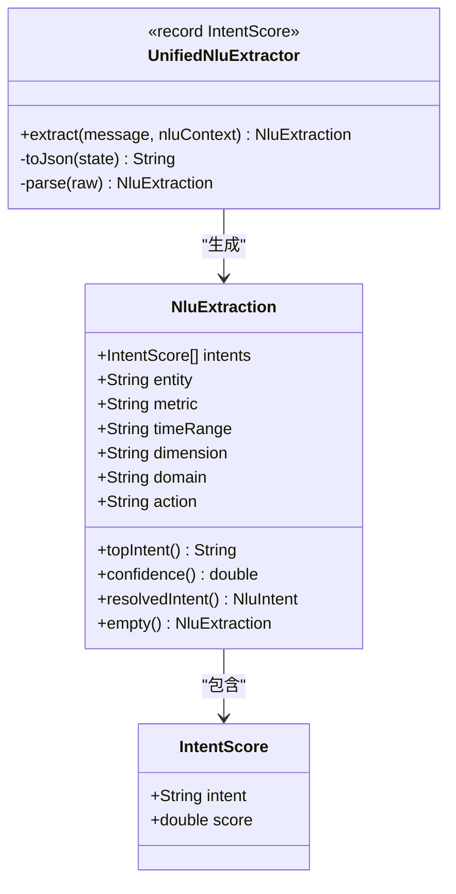
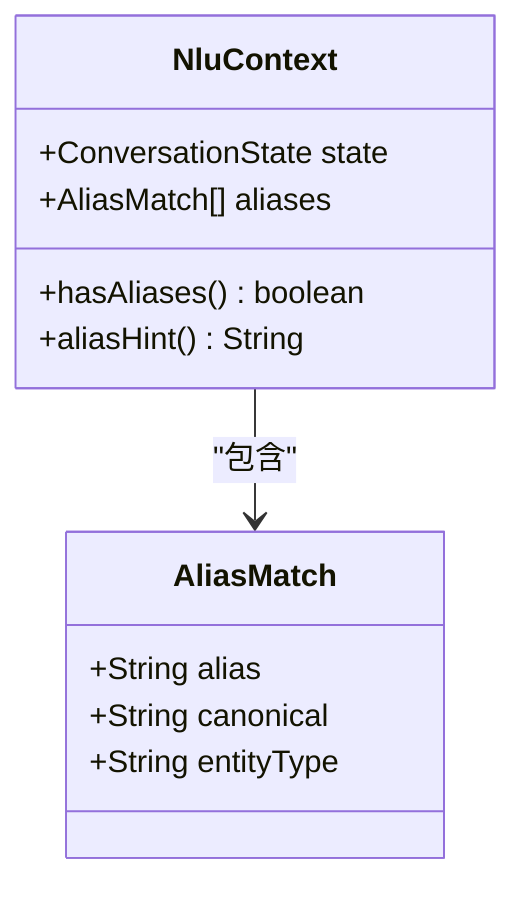
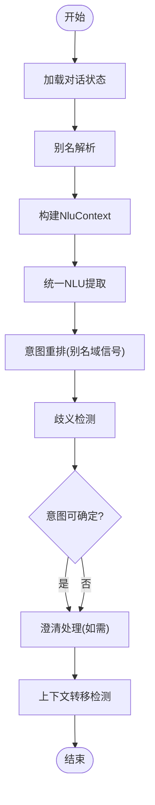
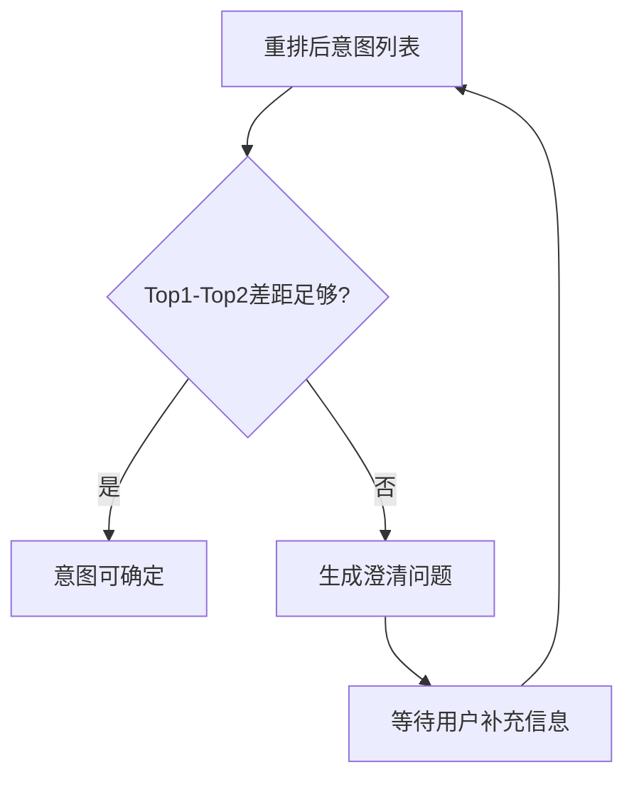
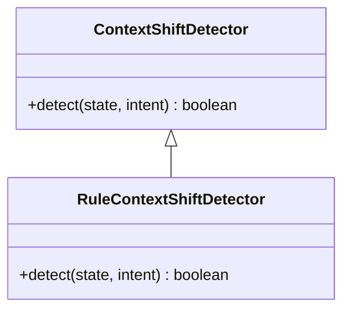
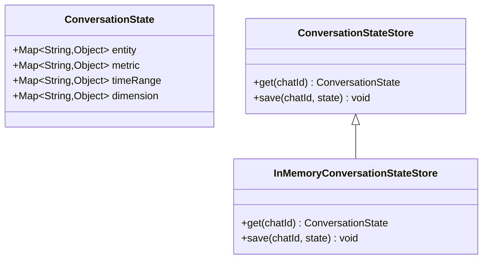
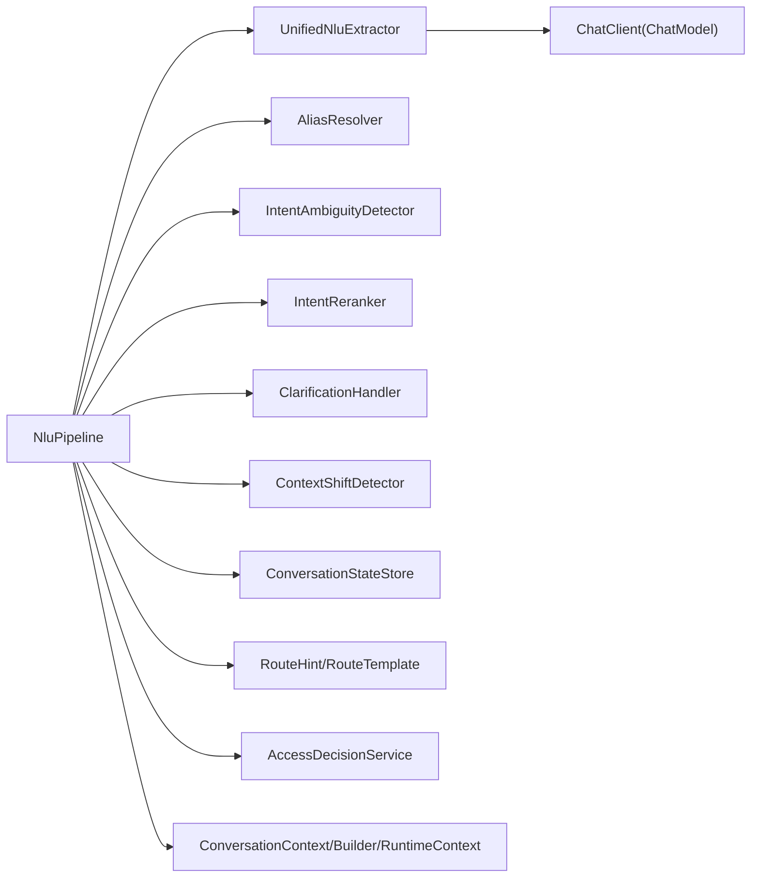

# NLU自然语言理解

<cite>
**本文引用的文件**
- [UnifiedNluExtractor.java](file://src/main/java/com/yupi/yuaiagent/nlu/UnifiedNluExtractor.java)
- [NluContext.java](file://src/main/java/com/yupi/yuaiagent/nlu/NluContext.java)
- [NluPipeline.java](file://src/main/java/com/yupi/yuaiagent/nlu/NluPipeline.java)
- [AliasResolver.java](file://src/main/java/com/yupi/yuaiagent/nlu/AliasResolver.java)
- [ClarificationHandler.java](file://src/main/java/com/yupi/yuaiagent/nlu/ClarificationHandler.java)
- [ContextShiftDetector.java](file://src/main/java/com/yupi/yuaiagent/nlu/ContextShiftDetector.java)
- [RuleContextShiftDetector.java](file://src/main/java/com/yupi/yuaiagent/nlu/RuleContextShiftDetector.java)
- [IntentAmbiguityDetector.java](file://src/main/java/com/yupi/yuaiagent/nlu/IntentAmbiguityDetector.java)
- [IntentReranker.java](file://src/main/java/com/yupi/yuaiagent/nlu/IntentReranker.java)
- [ConversationState.java](file://src/main/java/com/yupi/yuaiagent/nlu/ConversationState.java)
- [ConversationStateStore.java](file://src/main/java/com/yupi/yuaiagent/nlu/ConversationStateStore.java)
- [InMemoryConversationStateStore.java](file://src/main/java/com/yupi/yuaiagent/nlu/InMemoryConversationStateStore.java)
- [RouteHint.java](file://src/main/java/com/yupi/yuaiagent/nlu/RouteHint.java)
- [RouteTemplate.java](file://src/main/java/com/yupi/yuaiagent/nlu/RouteTemplate.java)
- [NluIntent.java](file://src/main/java/com/yupi/yuaiagent/nlu/NluIntent.java)
- [AccessDecisionContext.java](file://src/main/java/com/yupi/yuaiagent/access/AccessDecisionContext.java)
- [AccessDecisionService.java](file://src/main/java/com/yupi/yuaiagent/access/AccessDecisionService.java)
- [AccessVoter.java](file://src/main/java/com/yupi/yuaiagent/access/AccessVoter.java)
- [AgentPolicyVoter.java](file://src/main/java/com/yupi/yuaiagent/access/AgentPolicyVoter.java)
- [McpPolicyVoter.java](file://src/main/java/com/yupi/yuaiagent/access/McpPolicyVoter.java)
- [QuotaPolicyVoter.java](file://src/main/java/com/yupi/yuaiagent/access/QuotaPolicyVoter.java)
- [AiChatAgent.java](file://src/main/java/com/yupi/yuaiagent/app/AiChatAgent.java)
- [ConversationContext.java](file://src/main/java/com/yupi/yuaiagent/context/ConversationContext.java)
- [ConversationContextBuilder.java](file://src/main/java/com/yupi/yuaiagent/context/ConversationContextBuilder.java)
- [RuntimeContext.java](file://src/main/java/com/yupi/yuaiagent/context/RuntimeContext.java)
- [application.yml](file://src/main/resources/application.yml)
- [application-local.yml.example](file://src/main/resources/application-local.yml.example)
- [templates/follow-up-templates.yml](file://src/main/resources/templates/follow-up-templates.yml)
- [docs/nlu-layer-design-v4.2.md](file://docs/nlu-layer-design-v4.2.md)
- [docs/architecture.html](file://docs/architecture.html)
- [docs/WIKI.md](file://docs/WIKI.md)
</cite>

## 目录
1. [简介](#简介)
2. [项目结构](#项目结构)
3. [核心组件](#核心组件)
4. [架构总览](#架构总览)
5. [详细组件分析](#详细组件分析)
6. [依赖关系分析](#依赖关系分析)
7. [性能考量](#性能考量)
8. [故障排查指南](#故障排查指南)
9. [结论](#结论)
10. [附录](#附录)

## 简介
本技术文档围绕统一NLU提取器与NLU流水线展开，系统性阐述意图识别机制、实体抽取与语义理解的实现原理，以及上下文管理、歧义消解与澄清处理的工作流程。文档同时提供NLU配置指南、模型优化与性能调优方法，并解释规则引擎、机器学习模型与混合方法的结合使用方式，覆盖意图模板定义、别名解析与路由提示的配置实践，最后给出实际使用示例与调试技巧，帮助开发者高效完成NLU系统的开发与维护。

## 项目结构
NLU相关代码集中在后端模块的nlu包内，配合访问控制、上下文管理与应用入口协同工作。下图展示NLU层在整体系统中的位置与交互关系：

图表来源
- [NluPipeline.java:69-101](file://src/main/java/com/yupi/yuaiagent/nlu/NluPipeline.java#L69-L101)
- [UnifiedNluExtractor.java:100-114](file://src/main/java/com/yupi/yuaiagent/nlu/UnifiedNluExtractor.java#L100-L114)
- [NluContext.java:17-44](file://src/main/java/com/yupi/yuaiagent/nlu/NluContext.java#L17-L44)
- [ConversationStateStore.java](file://src/main/java/com/yupi/yuaiagent/nlu/ConversationStateStore.java)
- [AliasResolver.java](file://src/main/java/com/yupi/yuaiagent/nlu/AliasResolver.java)
- [IntentAmbiguityDetector.java](file://src/main/java/com/yupi/yuaiagent/nlu/IntentAmbiguityDetector.java)
- [IntentReranker.java](file://src/main/java/com/yupi/yuaiagent/nlu/IntentReranker.java)
- [ClarificationHandler.java](file://src/main/java/com/yupi/yuaiagent/nlu/ClarificationHandler.java)
- [ContextShiftDetector.java](file://src/main/java/com/yupi/yuaiagent/nlu/ContextShiftDetector.java)
- [RuleContextShiftDetector.java](file://src/main/java/com/yupi/yuaiagent/nlu/RuleContextShiftDetector.java)
- [RouteHint.java](file://src/main/java/com/yupi/yuaiagent/nlu/RouteHint.java)
- [RouteTemplate.java](file://src/main/java/com/yupi/yuaiagent/nlu/RouteTemplate.java)
- [AiChatAgent.java](file://src/main/java/com/yupi/yuaiagent/app/AiChatAgent.java)
- [AccessDecisionService.java](file://src/main/java/com/yupi/yuaiagent/access/AccessDecisionService.java)
- [AccessVoter.java](file://src/main/java/com/yupi/yuaiagent/access/AccessVoter.java)
- [AgentPolicyVoter.java](file://src/main/java/com/yupi/yuaiagent/access/AgentPolicyVoter.java)
- [McpPolicyVoter.java](file://src/main/java/com/yupi/yuaiagent/access/McpPolicyVoter.java)
- [QuotaPolicyVoter.java](file://src/main/java/com/yupi/yuaiagent/access/QuotaPolicyVoter.java)
- [ConversationContext.java](file://src/main/java/com/yupi/yuaiagent/context/ConversationContext.java)
- [ConversationContextBuilder.java](file://src/main/java/com/yupi/yuaiagent/context/ConversationContextBuilder.java)
- [RuntimeContext.java](file://src/main/java/com/yupi/yuaiagent/context/RuntimeContext.java)

章节来源
- [docs/architecture.html](file://docs/architecture.html)
- [docs/WIKI.md](file://docs/WIKI.md)

## 核心组件
- 统一NLU提取器（UnifiedNluExtractor）：单次大模型调用，输出意图排序、槽位（实体、指标、时间范围、维度）、领域与动作，显著降低延迟并提升一致性。
- NLU上下文（NluContext）：封装持久化对话状态与瞬时别名元数据，确保别名仅影响当前输入而不污染会话状态。
- NLU流水线（NluPipeline）：串联别名解析、统一提取、意图重排、歧义检测、澄清处理与上下文转移检测，形成闭环的意图理解流程。
- 别名解析（AliasResolver）：从用户输入中识别别名并生成规范形式，用于实体消歧与槽位增强。
- 意图歧义检测（IntentAmbiguityDetector）：基于重排后的分数差评估歧义程度，必要时触发澄清流程。
- 意图重排（IntentReranker）：利用别名域信号对意图排序进行微调，提升领域相关意图的置信度。
- 澄清处理（ClarificationHandler）：当歧义或信息不足时，生成引导式问题以获取更多信息。
- 上下文转移检测（ContextShiftDetector / RuleContextShiftDetector）：判断用户意图是否发生跨领域或跨任务的显著变化。
- 对话状态与存储（ConversationState / ConversationStateStore / InMemoryConversationStateStore）：管理实体、指标、时间范围、维度等结构化槽位，支持内存与持久化存储。
- 路由提示与模板（RouteHint / RouteTemplate）：定义意图到执行路径的映射与提示词模板，支撑多Agent路由与工具调用。
- 访问控制（AccessDecisionService 及各投票器）：在NLU之后对意图与后续操作进行权限与配额校验。
- 应用入口与上下文（AiChatAgent、ConversationContext/Builder/RuntimeContext）：承载用户消息进入NLU流水线的入口与运行时上下文构建。

章节来源
- [UnifiedNluExtractor.java:14-24](file://src/main/java/com/yupi/yuaiagent/nlu/UnifiedNluExtractor.java#L14-L24)
- [NluContext.java:5-16](file://src/main/java/com/yupi/yuaiagent/nlu/NluContext.java#L5-L16)
- [NluPipeline.java:36-101](file://src/main/java/com/yupi/yuaiagent/nlu/NluPipeline.java#L36-L101)
- [AliasResolver.java](file://src/main/java/com/yupi/yuaiagent/nlu/AliasResolver.java)
- [IntentAmbiguityDetector.java](file://src/main/java/com/yupi/yuaiagent/nlu/IntentAmbiguityDetector.java)
- [IntentReranker.java](file://src/main/java/com/yupi/yuaiagent/nlu/IntentReranker.java)
- [ClarificationHandler.java](file://src/main/java/com/yupi/yuaiagent/nlu/ClarificationHandler.java)
- [ContextShiftDetector.java](file://src/main/java/com/yupi/yuaiagent/nlu/ContextShiftDetector.java)
- [RuleContextShiftDetector.java](file://src/main/java/com/yupi/yuaiagent/nlu/RuleContextShiftDetector.java)
- [ConversationState.java](file://src/main/java/com/yupi/yuaiagent/nlu/ConversationState.java)
- [ConversationStateStore.java](file://src/main/java/com/yupi/yuaiagent/nlu/ConversationStateStore.java)
- [InMemoryConversationStateStore.java](file://src/main/java/com/yupi/yuaiagent/nlu/InMemoryConversationStateStore.java)
- [RouteHint.java](file://src/main/java/com/yupi/yuaiagent/nlu/RouteHint.java)
- [RouteTemplate.java](file://src/main/java/com/yupi/yuaiagent/nlu/RouteTemplate.java)
- [AccessDecisionService.java](file://src/main/java/com/yupi/yuaiagent/access/AccessDecisionService.java)
- [AccessVoter.java](file://src/main/java/com/yupi/yuaiagent/access/AccessVoter.java)
- [AgentPolicyVoter.java](file://src/main/java/com/yupi/yuaiagent/access/AgentPolicyVoter.java)
- [McpPolicyVoter.java](file://src/main/java/com/yupi/yuaiagent/access/McpPolicyVoter.java)
- [QuotaPolicyVoter.java](file://src/main/java/com/yupi/yuaiagent/access/QuotaPolicyVoter.java)
- [AiChatAgent.java](file://src/main/java/com/yupi/yuaiagent/app/AiChatAgent.java)
- [ConversationContext.java](file://src/main/java/com/yupi/yuaiagent/context/ConversationContext.java)
- [ConversationContextBuilder.java](file://src/main/java/com/yupi/yuaiagent/context/ConversationContextBuilder.java)
- [RuntimeContext.java](file://src/main/java/com/yupi/yuaiagent/context/RuntimeContext.java)

## 架构总览
统一NLU提取器通过一次大模型调用完成意图排序、槽位抽取与领域/动作识别，随后NLU流水线整合别名信号、歧义检测与澄清策略，最终输出可路由的意图与结构化槽位。该架构在保证低延迟的同时，增强了意图识别的鲁棒性与可解释性。

图表来源
- [NluPipeline.java:69-101](file://src/main/java/com/yupi/yuaiagent/nlu/NluPipeline.java#L69-L101)
- [UnifiedNluExtractor.java:100-114](file://src/main/java/com/yupi/yuaiagent/nlu/UnifiedNluExtractor.java#L100-L114)
- [AliasResolver.java](file://src/main/java/com/yupi/yuaiagent/nlu/AliasResolver.java)
- [IntentAmbiguityDetector.java](file://src/main/java/com/yupi/yuaiagent/nlu/IntentAmbiguityDetector.java)
- [IntentReranker.java](file://src/main/java/com/yupi/yuaiagent/nlu/IntentReranker.java)
- [ClarificationHandler.java](file://src/main/java/com/yupi/yuaiagent/nlu/ClarificationHandler.java)
- [ContextShiftDetector.java](file://src/main/java/com/yupi/yuaiagent/nlu/ContextShiftDetector.java)

## 详细组件分析

### 统一NLU提取器（UnifiedNluExtractor）
- 设计目标：以单次大模型调用替代传统“槽抽取+意图分类”两阶段，减少延迟并提升槽位与意图的一致性。
- 输入：用户消息、对话状态JSON、别名提示字符串。
- 输出：意图排序列表、实体、指标、时间范围、维度、领域、动作；并提供置信度计算与意图解析能力。
- 解析策略：自动去除代码块标记，按字段提取并容错处理异常输出。
- 关键点：别名通过提示注入而非状态注入，避免跨轮次污染。

图表来源
- [UnifiedNluExtractor.java:93-114](file://src/main/java/com/yupi/yuaiagent/nlu/UnifiedNluExtractor.java#L93-L114)
- [UnifiedNluExtractor.java:129-159](file://src/main/java/com/yupi/yuaiagent/nlu/UnifiedNluExtractor.java#L129-L159)
- [UnifiedNluExtractor.java:168-201](file://src/main/java/com/yupi/yuaiagent/nlu/UnifiedNluExtractor.java#L168-L201)

章节来源
- [UnifiedNluExtractor.java:14-24](file://src/main/java/com/yupi/yuaiagent/nlu/UnifiedNluExtractor.java#L14-L24)
- [UnifiedNluExtractor.java:93-114](file://src/main/java/com/yupi/yuaiagent/nlu/UnifiedNluExtractor.java#L93-L114)
- [UnifiedNluExtractor.java:129-159](file://src/main/java/com/yupi/yuaiagent/nlu/UnifiedNluExtractor.java#L129-L159)
- [UnifiedNluExtractor.java:168-201](file://src/main/java/com/yupi/yuaiagent/nlu/UnifiedNluExtractor.java#L168-L201)

### NLU上下文（NluContext）
- 角色：将持久化对话状态与瞬时别名元数据组合为一次性提示上下文。
- 别名提示：将别名与其规范形式以“别名=规范”的形式注入提示，帮助模型在实体消歧时正确理解。
- 设计原则：别名不写入状态，避免跨轮次污染；仅在本次推理中生效。

图表来源
- [NluContext.java:17-44](file://src/main/java/com/yupi/yuaiagent/nlu/NluContext.java#L17-L44)

章节来源
- [NluContext.java:5-16](file://src/main/java/com/yupi/yuaiagent/nlu/NluContext.java#L5-L16)
- [NluContext.java:34-43](file://src/main/java/com/yupi/yuaiagent/nlu/NluContext.java#L34-L43)

### NLU流水线（NluPipeline）
- 流程步骤：加载状态 → 别名解析 → 构建上下文 → 统一提取 → 意图重排 → 歧义检测 → 意图解析 → 澄清处理 → 上下文转移检测 → 返回结果。
- 关键收益：将原本分散的模块整合为一次LLM调用的端到端理解，简化控制流并提升稳定性。

图表来源
- [NluPipeline.java:69-101](file://src/main/java/com/yupi/yuaiagent/nlu/NluPipeline.java#L69-L101)

章节来源
- [NluPipeline.java:36-101](file://src/main/java/com/yupi/yuaiagent/nlu/NluPipeline.java#L36-L101)

### 别名解析（AliasResolver）
- 功能：从用户输入中识别别名并映射到规范实体，为后续槽位抽取与意图重排提供高质量信号。
- 与NluContext协作：仅在提示中注入别名，不写入状态，确保本轮有效、跨轮次隔离。

章节来源
- [AliasResolver.java](file://src/main/java/com/yupi/yuaiagent/nlu/AliasResolver.java)
- [NluContext.java:34-43](file://src/main/java/com/yupi/yuaiagent/nlu/NluContext.java#L34-L43)

### 意图歧义检测与澄清处理
- 意图歧义检测：基于重排后Top1与Top2分数差评估歧义程度，决定是否触发澄清。
- 澄清处理：根据当前状态与槽位缺失情况生成引导式问题，提升信息完备性后再做意图解析。

图表来源
- [IntentAmbiguityDetector.java](file://src/main/java/com/yupi/yuaiagent/nlu/IntentAmbiguityDetector.java)
- [ClarificationHandler.java](file://src/main/java/com/yupi/yuaiagent/nlu/ClarificationHandler.java)

章节来源
- [IntentAmbiguityDetector.java](file://src/main/java/com/yupi/yuaiagent/nlu/IntentAmbiguityDetector.java)
- [ClarificationHandler.java](file://src/main/java/com/yupi/yuaiagent/nlu/ClarificationHandler.java)

### 上下文转移检测
- 目标：识别用户意图是否发生跨领域或跨任务的显著变化，以便切换路由或重置状态。
- 实现：结合规则与统计方法（Rule/Statistical），在NLU之后、路由前进行判定。

图表来源
- [ContextShiftDetector.java](file://src/main/java/com/yupi/yuaiagent/nlu/ContextShiftDetector.java)
- [RuleContextShiftDetector.java](file://src/main/java/com/yupi/yuaiagent/nlu/RuleContextShiftDetector.java)

章节来源
- [ContextShiftDetector.java](file://src/main/java/com/yupi/yuaiagent/nlu/ContextShiftDetector.java)
- [RuleContextShiftDetector.java](file://src/main/java/com/yupi/yuaiagent/nlu/RuleContextShiftDetector.java)

### 对话状态与存储
- ConversationState：结构化槽位容器（实体、指标、时间范围、维度）。
- ConversationStateStore：抽象存储接口；InMemoryConversationStateStore提供内存实现。
- 设计要点：状态随会话流转，但别名仅在提示中出现，避免状态污染。

图表来源
- [ConversationState.java](file://src/main/java/com/yupi/yuaiagent/nlu/ConversationState.java)
- [ConversationStateStore.java](file://src/main/java/com/yupi/yuaiagent/nlu/ConversationStateStore.java)
- [InMemoryConversationStateStore.java](file://src/main/java/com/yupi/yuaiagent/nlu/InMemoryConversationStateStore.java)

章节来源
- [ConversationState.java](file://src/main/java/com/yupi/yuaiagent/nlu/ConversationState.java)
- [ConversationStateStore.java](file://src/main/java/com/yupi/yuaiagent/nlu/ConversationStateStore.java)
- [InMemoryConversationStateStore.java](file://src/main/java/com/yupi/yuaiagent/nlu/InMemoryConversationStateStore.java)

### 路由提示与模板（RouteHint/RouteTemplate）
- 作用：将意图映射到具体执行路径（Agent或工具），并提供提示词模板以增强执行质量。
- 配置：可通过YAML/模板文件定义路由规则与提示词，便于扩展与维护。

章节来源
- [RouteHint.java](file://src/main/java/com/yupi/yuaiagent/nlu/RouteHint.java)
- [RouteTemplate.java](file://src/main/java/com/yupi/yuaiagent/nlu/RouteTemplate.java)

### 访问控制与运行时上下文
- 访问控制：在NLU之后对意图与后续操作进行权限与配额校验，保障系统安全与资源可控。
- 运行时上下文：构建ConversationContext/Builder/RuntimeContext，承载用户身份、会话与执行环境信息。

章节来源
- [AccessDecisionService.java](file://src/main/java/com/yupi/yuaiagent/access/AccessDecisionService.java)
- [AccessVoter.java](file://src/main/java/com/yupi/yuaiagent/access/AccessVoter.java)
- [AgentPolicyVoter.java](file://src/main/java/com/yupi/yuaiagent/access/AgentPolicyVoter.java)
- [McpPolicyVoter.java](file://src/main/java/com/yupi/yuaiagent/access/McpPolicyVoter.java)
- [QuotaPolicyVoter.java](file://src/main/java/com/yupi/yuaiagent/access/QuotaPolicyVoter.java)
- [ConversationContext.java](file://src/main/java/com/yupi/yuaiagent/context/ConversationContext.java)
- [ConversationContextBuilder.java](file://src/main/java/com/yupi/yuaiagent/context/ConversationContextBuilder.java)
- [RuntimeContext.java](file://src/main/java/com/yupi/yuaiagent/context/RuntimeContext.java)

## 依赖关系分析
- 组件耦合：NluPipeline聚合多个子组件，统一调度；UnifiedNluExtractor作为核心提取器被流水线直接依赖。
- 外部依赖：Spring AI ChatClient用于大模型调用；Jackson用于JSON解析；日志框架用于可观测性。
- 权限与上下文：访问控制与运行时上下文在NLU之后参与决策，确保安全与一致性。

图表来源
- [NluPipeline.java:69-101](file://src/main/java/com/yupi/yuaiagent/nlu/NluPipeline.java#L69-L101)
- [UnifiedNluExtractor.java:93-95](file://src/main/java/com/yupi/yuaiagent/nlu/UnifiedNluExtractor.java#L93-L95)
- [AccessDecisionService.java](file://src/main/java/com/yupi/yuaiagent/access/AccessDecisionService.java)
- [ConversationContext.java](file://src/main/java/com/yupi/yuaiagent/context/ConversationContext.java)

章节来源
- [NluPipeline.java:36-101](file://src/main/java/com/yupi/yuaiagent/nlu/NluPipeline.java#L36-L101)
- [UnifiedNluExtractor.java:93-95](file://src/main/java/com/yupi/yuaiagent/nlu/UnifiedNluExtractor.java#L93-L95)

## 性能考量
- 单次LLM调用：统一NLU提取器将原本两次调用合并为一次，显著降低延迟与成本。
- 提示工程：通过“别名提示”与“历史状态”分离，提升模型理解效率与准确性。
- 缓存与状态：合理使用内存状态存储，避免频繁IO；在高并发场景建议引入分布式缓存与锁策略。
- 模型选择：根据业务复杂度与SLA选择合适的模型与参数，平衡速度与精度。
- 错误恢复：对解析失败与异常输出进行降级处理，保证系统可用性。

## 故障排查指南
- 解析失败：检查大模型输出格式是否符合预期，确认提示中别名与状态字段完整。
- 意图不准确：调整别名域信号权重或提示词，增加领域示例；必要时启用规则驱动的上下文转移。
- 澄清循环：限制澄清次数与轮次，避免无限循环；确保澄清问题与当前槽位匹配。
- 权限拦截：核对访问控制策略与配额，确保NLU结果能顺利进入后续处理。
- 日志定位：关注NLU解析警告与歧义检测日志，快速定位问题根因。

章节来源
- [UnifiedNluExtractor.java:155-158](file://src/main/java/com/yupi/yuaiagent/nlu/UnifiedNluExtractor.java#L155-L158)
- [IntentAmbiguityDetector.java](file://src/main/java/com/yupi/yuaiagent/nlu/IntentAmbiguityDetector.java)
- [AccessDecisionService.java](file://src/main/java/com/yupi/yuaiagent/access/AccessDecisionService.java)

## 结论
统一NLU提取器与NLU流水线通过一次LLM调用实现了意图排序、槽位抽取与领域/动作识别，结合别名解析、歧义检测、澄清处理与上下文转移检测，形成了低延迟、高鲁棒性的自然语言理解闭环。配合路由提示与访问控制，系统在保证安全性的同时提升了可扩展性与可维护性。建议在生产环境中持续优化提示词、完善领域示例与规则策略，并建立完善的监控与回放机制以保障服务质量。

## 附录

### NLU配置指南
- 大模型接入：在应用配置中设置ChatModel与ChatClient，确保统一NLU提取器可正常调用。
- 别名与提示：通过NluContext的别名提示功能注入别名映射，避免将别名写入状态。
- 路由模板：在模板文件中定义意图到执行路径的映射，确保NLU结果可被正确路由。
- 权限策略：在访问控制模块中配置策略与配额，确保NLU结果的安全流转。

章节来源
- [application.yml](file://src/main/resources/application.yml)
- [application-local.yml.example](file://src/main/resources/application-local.yml.example)
- [templates/follow-up-templates.yml](file://src/main/resources/templates/follow-up-templates.yml)
- [NluContext.java:34-43](file://src/main/java/com/yupi/yuaiagent/nlu/NluContext.java#L34-L43)
- [RouteTemplate.java](file://src/main/java/com/yupi/yuaiagent/nlu/RouteTemplate.java)

### 实际使用示例与调试技巧
- 示例场景：用户输入“查TX ROI”，系统先进行别名解析（TX→腾讯），再通过统一NLU提取器识别意图与槽位，最后根据路由模板执行查询。
- 调试技巧：开启NLU解析日志，观察提示构造与输出格式；在歧义检测环节增加阈值与轮次限制；在访问控制环节核对策略匹配。

章节来源
- [NluPipeline.java:69-101](file://src/main/java/com/yupi/yuaiagent/nlu/NluPipeline.java#L69-L101)
- [UnifiedNluExtractor.java:100-114](file://src/main/java/com/yupi/yuaiagent/nlu/UnifiedNluExtractor.java#L100-L114)
- [AliasResolver.java](file://src/main/java/com/yupi/yuaiagent/nlu/AliasResolver.java)
- [IntentAmbiguityDetector.java](file://src/main/java/com/yupi/yuaiagent/nlu/IntentAmbiguityDetector.java)
- [ClarificationHandler.java](file://src/main/java/com/yupi/yuaiagent/nlu/ClarificationHandler.java)
- [AccessDecisionService.java](file://src/main/java/com/yupi/yuaiagent/access/AccessDecisionService.java)