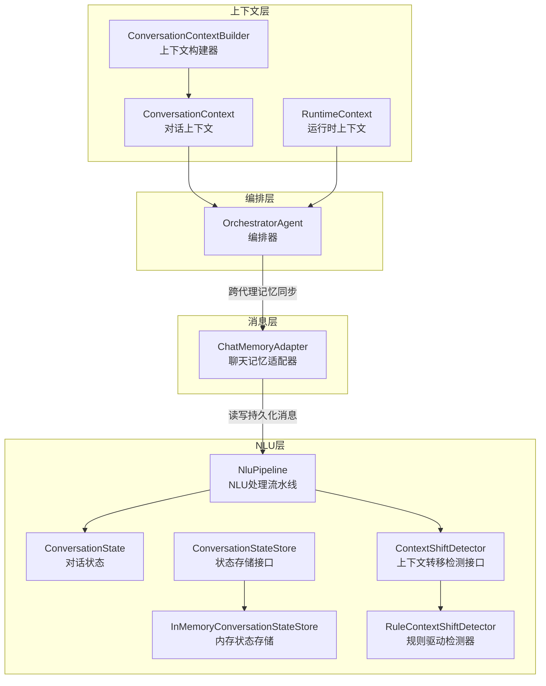
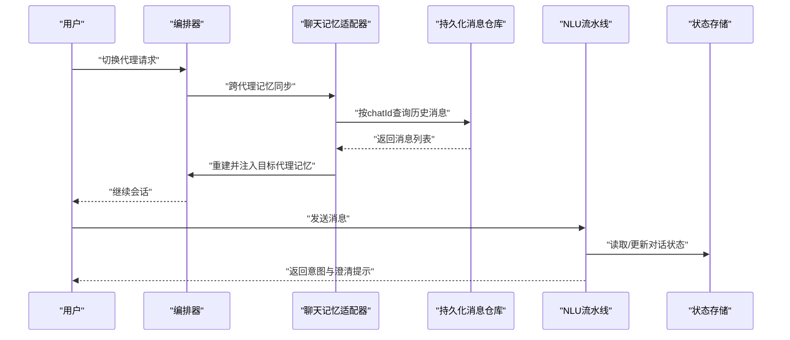
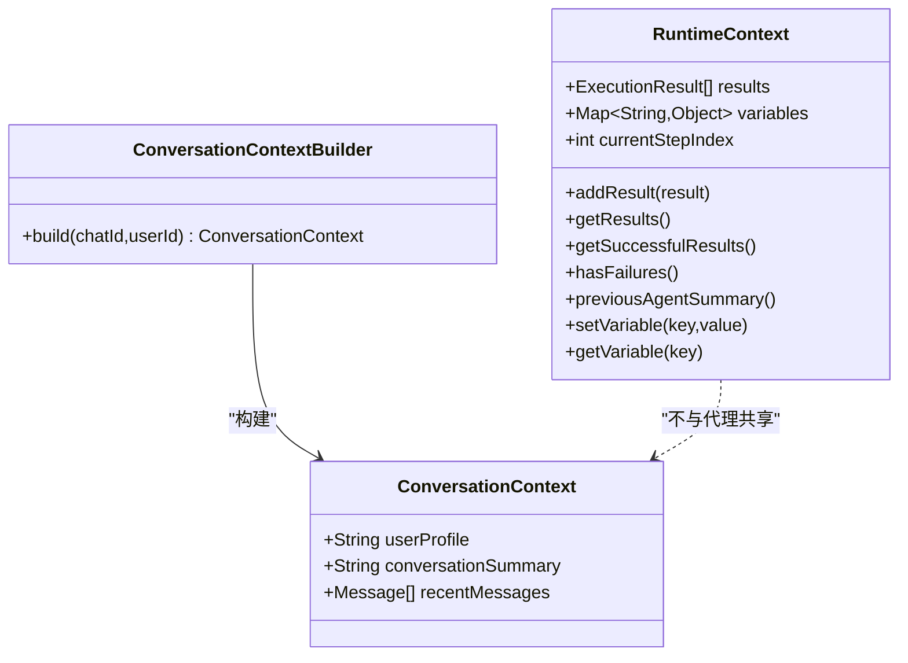
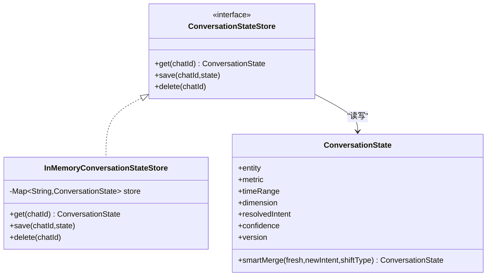
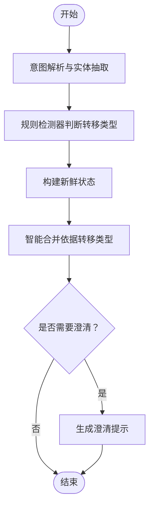
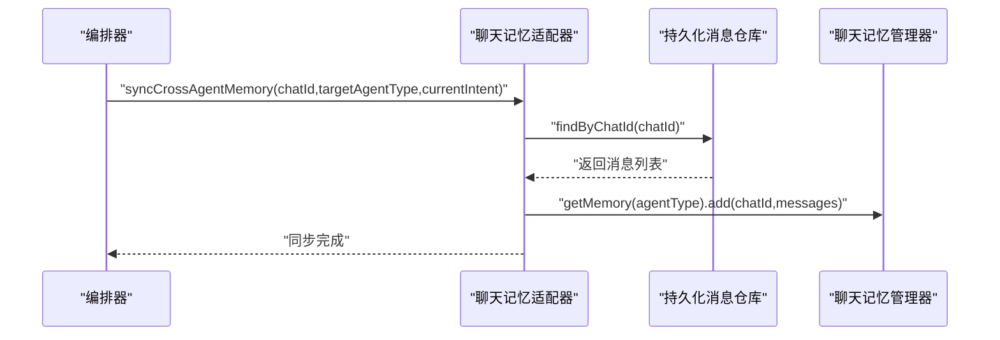
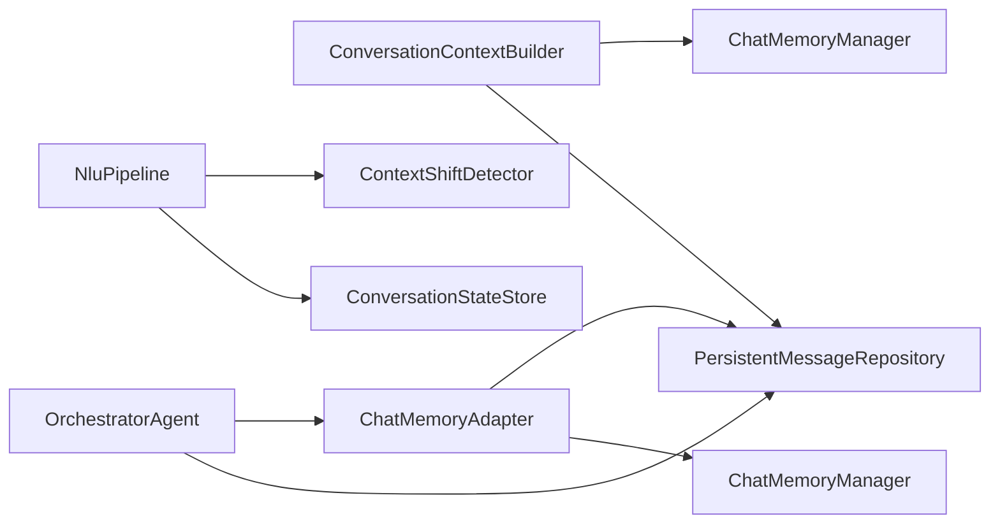

# 上下文管理系统

<cite>
**本文引用的文件**
- [ConversationContext.java](file://src/main/java/com/yupi/yuaiagent/context/ConversationContext.java)
- [ConversationContextBuilder.java](file://src/main/java/com/yupi/yuaiagent/context/ConversationContextBuilder.java)
- [RuntimeContext.java](file://src/main/java/com/yupi/yuaiagent/context/RuntimeContext.java)
- [ConversationState.java](file://src/main/java/com/yupi/yuaiagent/nlu/ConversationState.java)
- [ConversationStateStore.java](file://src/main/java/com/yupi/yuaiagent/nlu/ConversationStateStore.java)
- [InMemoryConversationStateStore.java](file://src/main/java/com/yupi/yuaiagent/nlu/InMemoryConversationStateStore.java)
- [ContextShiftDetector.java](file://src/main/java/com/yupi/yuaiagent/nlu/ContextShiftDetector.java)
- [RuleContextShiftDetector.java](file://src/main/java/com/yupi/yuaiagent/nlu/RuleContextShiftDetector.java)
- [NluPipeline.java](file://src/main/java/com/yupi/yuaiagent/nlu/NluPipeline.java)
- [ChatMemoryAdapter.java](file://src/main/java/com/yupi/yuaiagent/message/ChatMemoryAdapter.java)
- [OrchestratorAgent.java](file://src/main/java/com/yupi/yuaiagent/agent/OrchestratorAgent.java)
- [multi-agent-runtime-architecture.md](file://docs/multi-agent-runtime-architecture.md)
- [nlu-layer-design-v4.2.md](file://docs/nlu-layer-design-v4.2.md)
</cite>

## 目录
1. [简介](#简介)
2. [项目结构](#项目结构)
3. [核心组件](#核心组件)
4. [架构总览](#架构总览)
5. [详细组件分析](#详细组件分析)
6. [依赖关系分析](#依赖关系分析)
7. [性能考量](#性能考量)
8. [故障排查指南](#故障排查指南)
9. [结论](#结论)
10. [附录](#附录)

## 简介
本技术文档围绕“上下文管理系统”展开，系统性阐述对话状态的定义、生命周期与状态转换机制；详解上下文存储器的实现原理（内存与持久化策略）；深入解析上下文转移检测器的工作原理（自动检测与规则驱动的转移判断）；并提供状态存储配置、性能优化与数据一致性保障方法，以及最佳实践、常见问题与解决方案，帮助开发者完成系统的开发与维护。

## 项目结构
上下文管理相关代码主要分布在以下模块：
- context：对话上下文模型与构建器（ConversationContext、ConversationContextBuilder、RuntimeContext）
- nlu：自然语言理解层的对话状态与状态存储、上下文转移检测（ConversationState、ConversationStateStore、ContextShiftDetector、RuleContextShiftDetector、NluPipeline）
- message：聊天记忆适配器（ChatMemoryAdapter），负责与持久化消息仓库交互
- agent：编排器（OrchestratorAgent），负责跨代理的记忆同步与上下文注入

图表来源
- [ConversationContext.java:1-120](file://src/main/java/com/yupi/yuaiagent/context/ConversationContext.java#L1-L120)
- [ConversationContextBuilder.java:1-120](file://src/main/java/com/yupi/yuaiagent/context/ConversationContextBuilder.java#L1-L120)
- [RuntimeContext.java:1-56](file://src/main/java/com/yupi/yuaiagent/context/RuntimeContext.java#L1-L56)
- [ConversationState.java:1-250](file://src/main/java/com/yupi/yuaiagent/nlu/ConversationState.java#L1-L250)
- [ConversationStateStore.java:1-18](file://src/main/java/com/yupi/yuaiagent/nlu/ConversationStateStore.java#L1-L18)
- [InMemoryConversationStateStore.java:1-42](file://src/main/java/com/yupi/yuaiagent/nlu/InMemoryConversationStateStore.java#L1-L42)
- [ContextShiftDetector.java:1-30](file://src/main/java/com/yupi/yuaiagent/nlu/ContextShiftDetector.java#L1-L30)
- [RuleContextShiftDetector.java:1-39](file://src/main/java/com/yupi/yuaiagent/nlu/RuleContextShiftDetector.java#L1-L39)
- [NluPipeline.java:103-135](file://src/main/java/com/yupi/yuaiagent/nlu/NluPipeline.java#L103-L135)
- [ChatMemoryAdapter.java:145-174](file://src/main/java/com/yupi/yuaiagent/message/ChatMemoryAdapter.java#L145-L174)
- [OrchestratorAgent.java:283-306](file://src/main/java/com/yupi/yuaiagent/agent/OrchestratorAgent.java#L283-L306)

章节来源
- [ConversationContext.java:1-120](file://src/main/java/com/yupi/yuaiagent/context/ConversationContext.java#L1-L120)
- [ConversationContextBuilder.java:1-120](file://src/main/java/com/yupi/yuaiagent/context/ConversationContextBuilder.java#L1-L120)
- [RuntimeContext.java:1-56](file://src/main/java/com/yupi/yuaiagent/context/RuntimeContext.java#L1-L56)
- [NluPipeline.java:103-135](file://src/main/java/com/yupi/yuaiagent/nlu/NluPipeline.java#L103-L135)

## 核心组件
- 对话上下文（ConversationContext）：不可变的静态上下文，包含用户画像、对话摘要与最近消息，由构建器一次性生成并被所有代理共享。
- 运行时上下文（RuntimeContext）：可变的执行状态容器，用于累积各代理的执行结果、步骤间变量与当前执行步索引，不向代理暴露。
- 对话状态（ConversationState）：承载实体、指标、时间范围、维度等会话级信息，并支持基于上下文转移类型的智能合并。
- 状态存储（ConversationStateStore）：抽象的状态持久化接口，默认内存实现，生产环境建议替换为带CAS与TTL的Redis实现。
- 上下文转移检测（ContextShiftDetector）：接口定义三类转移类型（延续、实体切换、新查询），规则驱动检测器作为第一阶段，后续可扩展嵌入相似度检测。
- 聊天记忆适配器（ChatMemoryAdapter）：在内存聊天记忆与持久化消息仓库之间进行同步与重建，确保跨代理场景下的上下文一致性。
- 编排器（OrchestratorAgent）：在代理切换时从持久化仓库重建完整历史，注入目标代理的聊天记忆，保证LLM上下文连贯。

章节来源
- [ConversationContext.java:316-322](file://src/main/java/com/yupi/yuaiagent/context/ConversationContext.java#L316-L322)
- [RuntimeContext.java:16-56](file://src/main/java/com/yupi/yuaiagent/context/RuntimeContext.java#L16-L56)
- [ConversationState.java:182-229](file://src/main/java/com/yupi/yuaiagent/nlu/ConversationState.java#L182-L229)
- [ConversationStateStore.java:1-18](file://src/main/java/com/yupi/yuaiagent/nlu/ConversationStateStore.java#L1-L18)
- [InMemoryConversationStateStore.java:1-42](file://src/main/java/com/yupi/yuaiagent/nlu/InMemoryConversationStateStore.java#L1-L42)
- [ContextShiftDetector.java:1-30](file://src/main/java/com/yupi/yuaiagent/nlu/ContextShiftDetector.java#L1-L30)
- [RuleContextShiftDetector.java:1-39](file://src/main/java/com/yupi/yuaiagent/nlu/RuleContextShiftDetector.java#L1-L39)
- [ChatMemoryAdapter.java:145-174](file://src/main/java/com/yupi/yuaiagent/message/ChatMemoryAdapter.java#L145-L174)
- [OrchestratorAgent.java:283-306](file://src/main/java/com/yupi/yuaiagent/agent/OrchestratorAgent.java#L283-L306)

## 架构总览
系统采用“上下文层-编排层-消息层-NLU层”的分层设计。编排器负责在代理切换时同步记忆；NLU层负责对话状态的提取、合并与一致性维护；消息层负责与持久化仓库交互；上下文层提供不可变的对话上下文与可变的运行时上下文，二者分离避免上下文被污染。

图表来源
- [OrchestratorAgent.java:283-306](file://src/main/java/com/yupi/yuaiagent/agent/OrchestratorAgent.java#L283-L306)
- [ChatMemoryAdapter.java:145-174](file://src/main/java/com/yupi/yuaiagent/message/ChatMemoryAdapter.java#L145-L174)
- [NluPipeline.java:103-135](file://src/main/java/com/yupi/yuaiagent/nlu/NluPipeline.java#L103-L135)
- [ConversationStateStore.java:1-18](file://src/main/java/com/yupi/yuaiagent/nlu/ConversationStateStore.java#L1-L18)

## 详细组件分析

### 对话上下文与运行时上下文
- 不可变对话上下文（ConversationContext）：仅包含静态信息，避免在执行过程中被修改，确保代理看到一致的上下文视图。
- 可变运行时上下文（RuntimeContext）：累积执行结果、维护步骤间变量、记录当前执行步索引，仅用于内部跟踪，不暴露给代理。
- 上下文构建器（ConversationContextBuilder）：从用户画像服务与聊天记忆压缩器中获取信息，构建一次性使用的上下文对象。

图表来源
- [ConversationContext.java:316-322](file://src/main/java/com/yupi/yuaiagent/context/ConversationContext.java#L316-L322)
- [RuntimeContext.java:16-56](file://src/main/java/com/yupi/yuaiagent/context/RuntimeContext.java#L16-L56)
- [ConversationContextBuilder.java:400-427](file://src/main/java/com/yupi/yuaiagent/context/ConversationContextBuilder.java#L400-L427)

章节来源
- [ConversationContext.java:316-322](file://src/main/java/com/yupi/yuaiagent/context/ConversationContext.java#L316-L322)
- [RuntimeContext.java:16-56](file://src/main/java/com/yupi/yuaiagent/context/RuntimeContext.java#L16-L56)
- [ConversationContextBuilder.java:400-427](file://src/main/java/com/yupi/yuaiagent/context/ConversationContextBuilder.java#L400-L427)
- [multi-agent-runtime-architecture.md:308-397](file://docs/multi-agent-runtime-architecture.md#L308-L397)

### 对话状态与状态存储
- 对话状态（ConversationState）：包含实体、指标、时间范围、维度、解析意图、置信度与版本号等字段；提供智能合并方法，依据上下文转移类型决定继承或覆盖策略。
- 状态存储接口（ConversationStateStore）：抽象出获取、保存、删除操作；默认内存实现（ConcurrentHashMap）适合开发测试；生产环境应替换为带CAS与TTL的Redis实现以保证一致性与高可用。
- 内存状态存储（InMemoryConversationStateStore）：基于并发安全Map实现，保存时按版本号选择较新的状态，防止旧状态覆盖新状态。

图表来源
- [ConversationState.java:182-229](file://src/main/java/com/yupi/yuaiagent/nlu/ConversationState.java#L182-L229)
- [ConversationStateStore.java:1-18](file://src/main/java/com/yupi/yuaiagent/nlu/ConversationStateStore.java#L1-L18)
- [InMemoryConversationStateStore.java:1-42](file://src/main/java/com/yupi/yuaiagent/nlu/InMemoryConversationStateStore.java#L1-L42)

章节来源
- [ConversationState.java:182-229](file://src/main/java/com/yupi/yuaiagent/nlu/ConversationState.java#L182-L229)
- [ConversationStateStore.java:1-18](file://src/main/java/com/yupi/yuaiagent/nlu/ConversationStateStore.java#L1-L18)
- [InMemoryConversationStateStore.java:1-42](file://src/main/java/com/yupi/yuaiagent/nlu/InMemoryConversationStateStore.java#L1-L42)
- [nlu-layer-design-v4.2.md:182-229](file://docs/nlu-layer-design-v4.2.md#L182-L229)

### 上下文转移检测器
- 接口定义（ContextShiftDetector）：定义三类转移类型（延续、实体切换、新查询），并提供检测方法。
- 规则驱动检测器（RuleContextShiftDetector）：第一阶段基于显式动词、实体变化与短语模式判断；第二阶段可扩展嵌入相似度检测。
- NLU流水线（NluPipeline）：在消息进入时先进行意图解析与实体抽取，再调用检测器判断转移类型，随后构建“新鲜状态”，并与现有状态进行智能合并。

图表来源
- [ContextShiftDetector.java:1-30](file://src/main/java/com/yupi/yuaiagent/nlu/ContextShiftDetector.java#L1-L30)
- [RuleContextShiftDetector.java:1-39](file://src/main/java/com/yupi/yuaiagent/nlu/RuleContextShiftDetector.java#L1-L39)
- [NluPipeline.java:103-135](file://src/main/java/com/yupi/yuaiagent/nlu/NluPipeline.java#L103-L135)
- [nlu-layer-design-v4.2.md:97-178](file://docs/nlu-layer-design-v4.2.md#L97-L178)

章节来源
- [ContextShiftDetector.java:1-30](file://src/main/java/com/yupi/yuaiagent/nlu/ContextShiftDetector.java#L1-L30)
- [RuleContextShiftDetector.java:1-39](file://src/main/java/com/yupi/yuaiagent/nlu/RuleContextShiftDetector.java#L1-L39)
- [NluPipeline.java:103-135](file://src/main/java/com/yupi/yuaiagent/nlu/NluPipeline.java#L103-L135)
- [nlu-layer-design-v4.2.md:97-178](file://docs/nlu-layer-design-v4.2.md#L97-L178)

### 聊天记忆适配器与跨代理同步
- 聊天记忆适配器（ChatMemoryAdapter）：在内存聊天记忆与持久化消息仓库之间进行同步；当代理切换导致目标代理记忆为空时，从持久化仓库重建完整历史并注入目标代理的聊天记忆。
- 编排器（OrchestratorAgent）：在代理切换时触发跨代理记忆同步，确保LLM上下文连贯。

图表来源
- [OrchestratorAgent.java:283-306](file://src/main/java/com/yupi/yuaiagent/agent/OrchestratorAgent.java#L283-L306)
- [ChatMemoryAdapter.java:145-174](file://src/main/java/com/yupi/yuaiagent/message/ChatMemoryAdapter.java#L145-L174)

章节来源
- [ChatMemoryAdapter.java:145-174](file://src/main/java/com/yupi/yuaiagent/message/ChatMemoryAdapter.java#L145-L174)
- [OrchestratorAgent.java:283-306](file://src/main/java/com/yupi/yuaiagent/agent/OrchestratorAgent.java#L283-L306)

## 依赖关系分析
- ConversationContextBuilder 依赖 ChatMemoryManager 与 PersistentMessageRepository 构建上下文摘要与最近消息。
- NluPipeline 依赖 ContextShiftDetector 与 ConversationStateStore 完成状态的读取与更新。
- ChatMemoryAdapter 依赖 PersistentMessageRepository 与 ChatMemoryManager 实现内存与持久化的双向同步。
- OrchestratorAgent 在代理切换时依赖 ChatMemoryAdapter 与 PersistentMessageRepository 进行跨代理记忆同步。

图表来源
- [ConversationContextBuilder.java:400-427](file://src/main/java/com/yupi/yuaiagent/context/ConversationContextBuilder.java#L400-L427)
- [NluPipeline.java:103-135](file://src/main/java/com/yupi/yuaiagent/nlu/NluPipeline.java#L103-L135)
- [ChatMemoryAdapter.java:145-174](file://src/main/java/com/yupi/yuaiagent/message/ChatMemoryAdapter.java#L145-L174)
- [OrchestratorAgent.java:283-306](file://src/main/java/com/yupi/yuaiagent/agent/OrchestratorAgent.java#L283-L306)

章节来源
- [ConversationContextBuilder.java:400-427](file://src/main/java/com/yupi/yuaiagent/context/ConversationContextBuilder.java#L400-L427)
- [NluPipeline.java:103-135](file://src/main/java/com/yupi/yuaiagent/nlu/NluPipeline.java#L103-L135)
- [ChatMemoryAdapter.java:145-174](file://src/main/java/com/yupi/yuaiagent/message/ChatMemoryAdapter.java#L145-L174)
- [OrchestratorAgent.java:283-306](file://src/main/java/com/yupi/yuaiagent/agent/OrchestratorAgent.java#L283-L306)

## 性能考量
- 记忆压缩与摘要：通过聊天记忆压缩器生成对话摘要，减少最近消息数量，控制Token开销。
- Token预算与用量跟踪：在多代理执行流程中估算与记录Token用量，结合预算限制控制执行成本。
- 并发安全与缓存：状态存储采用并发安全结构，聊天记忆使用缓存机制，避免重复加载与计算。
- 跨代理同步的时机：仅在代理切换时进行完整历史重建，日常消息交互通过增量注入，降低I/O压力。

章节来源
- [multi-agent-runtime-architecture.md:276-306](file://docs/multi-agent-runtime-architecture.md#L276-L306)
- [ConversationContextBuilder.java:416-423](file://src/main/java/com/yupi/yuaiagent/context/ConversationContextBuilder.java#L416-L423)

## 故障排查指南
- 代理切换后上下文缺失：检查编排器是否正确触发跨代理记忆同步，确认聊天记忆适配器是否成功从持久化仓库重建消息并注入目标代理记忆。
- 状态覆盖异常：确认状态存储保存逻辑按版本号选择较新状态，避免旧状态覆盖新状态。
- 上下文转移误判：检查规则驱动检测器的短语集合与动词集合是否覆盖常见场景，必要时扩展嵌入相似度检测。
- 记忆同步失败：查看聊天记忆适配器的日志与异常处理，定位持久化仓库访问失败或内存注入失败的原因。

章节来源
- [OrchestratorAgent.java:283-306](file://src/main/java/com/yupi/yuaiagent/agent/OrchestratorAgent.java#L283-L306)
- [ChatMemoryAdapter.java:145-174](file://src/main/java/com/yupi/yuaiagent/message/ChatMemoryAdapter.java#L145-L174)
- [InMemoryConversationStateStore.java:28-36](file://src/main/java/com/yupi/yuaiagent/nlu/InMemoryConversationStateStore.java#L28-L36)
- [RuleContextShiftDetector.java:1-39](file://src/main/java/com/yupi/yuaiagent/nlu/RuleContextShiftDetector.java#L1-L39)

## 结论
本上下文管理系统通过清晰的分层设计与职责分离，实现了对话上下文的稳定提供、运行时状态的可控累积、对话状态的智能合并与一致性维护。结合规则驱动与可扩展的检测机制、内存与持久化的协同策略，系统在功能完整性与性能稳定性方面具备良好基础。生产部署建议完善状态存储的持久化与一致性保障，并持续优化上下文转移检测规则与记忆重建策略。

## 附录
- 最佳实践
  - 将不可变对话上下文与可变运行时上下文严格分离，避免上下文被污染。
  - 在代理切换时进行跨代理记忆同步，确保LLM上下文连贯。
  - 使用状态存储的版本控制与并发安全机制，防止竞态条件。
  - 控制最近消息数量与摘要长度，降低Token开销。
- 常见问题
  - 代理切换后上下文缺失：检查编排器与聊天记忆适配器的同步流程。
  - 状态覆盖异常：核对版本号比较与保存逻辑。
  - 上下文转移误判：扩充规则集或引入嵌入相似度检测。
- 数据一致性保障
  - 生产环境使用带CAS与TTL的状态存储实现。
  - 在跨代理同步前进行幂等检查，避免重复注入。
  - 对关键路径增加重试与降级策略，提升鲁棒性。