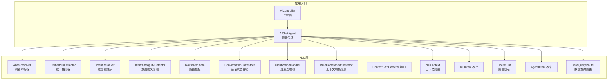
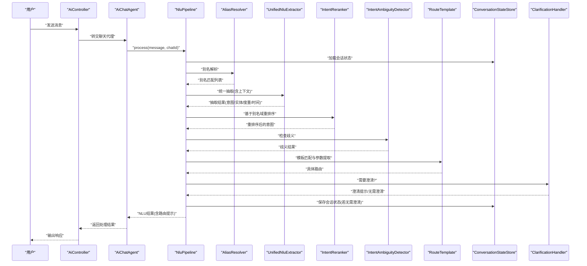
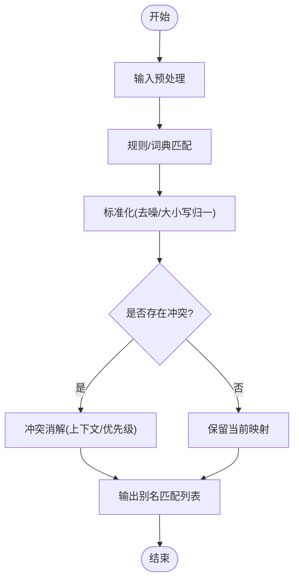
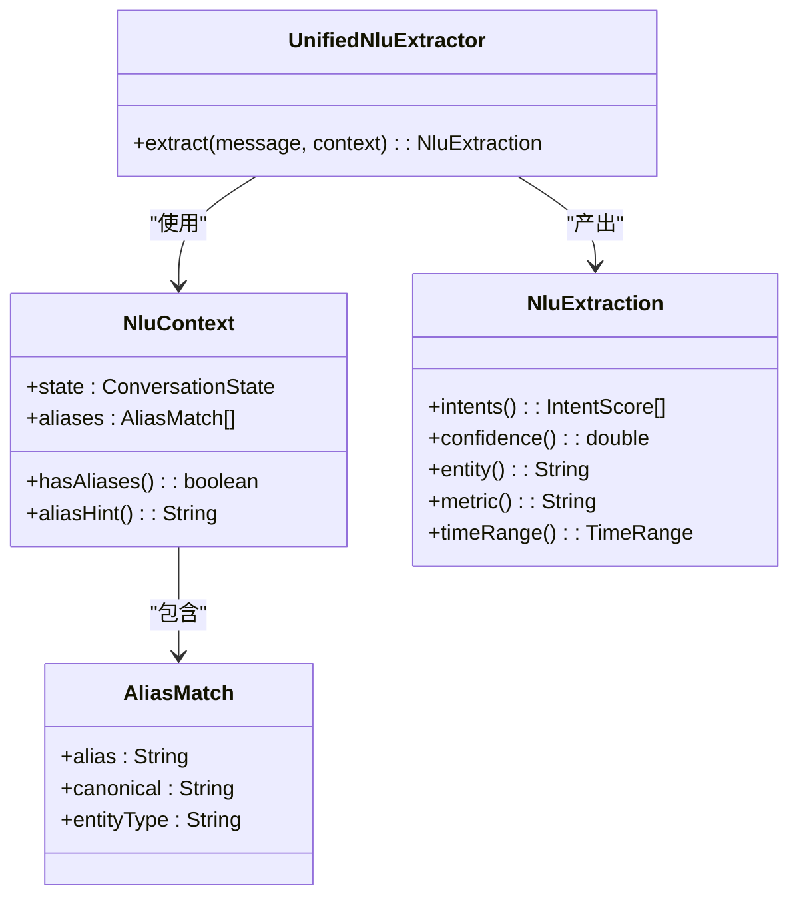
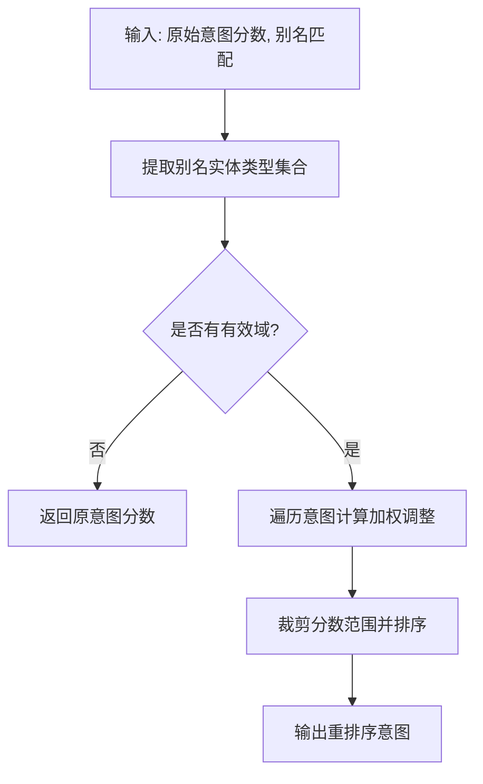
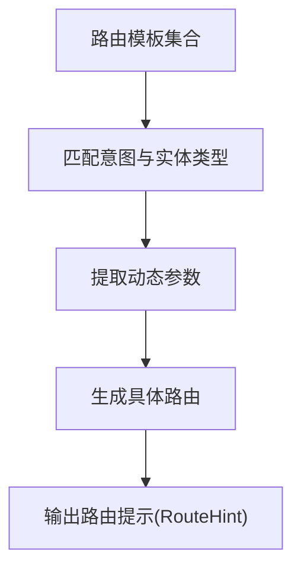
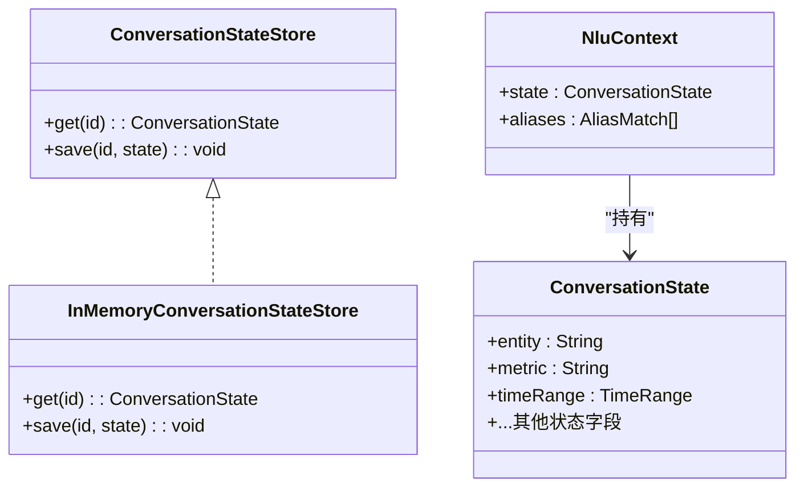
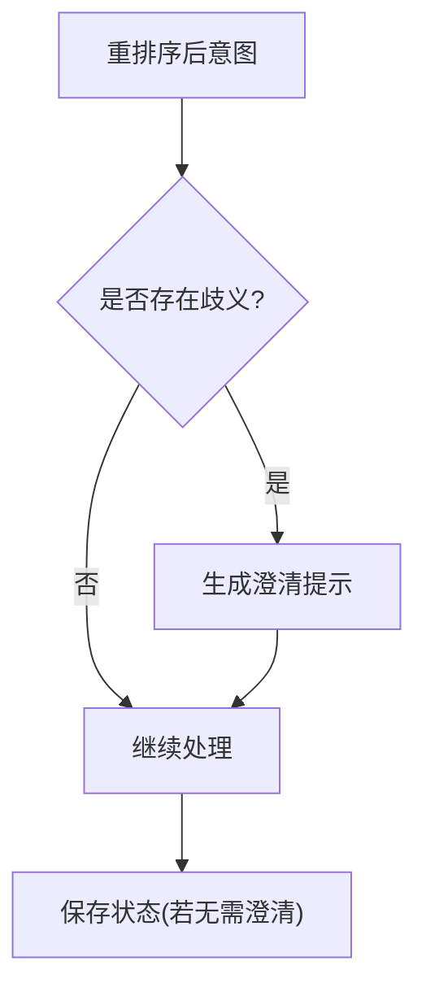
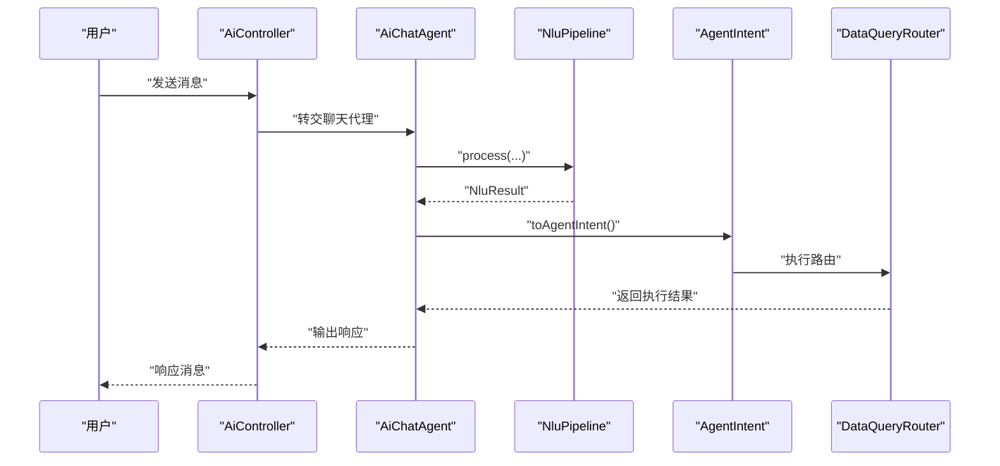
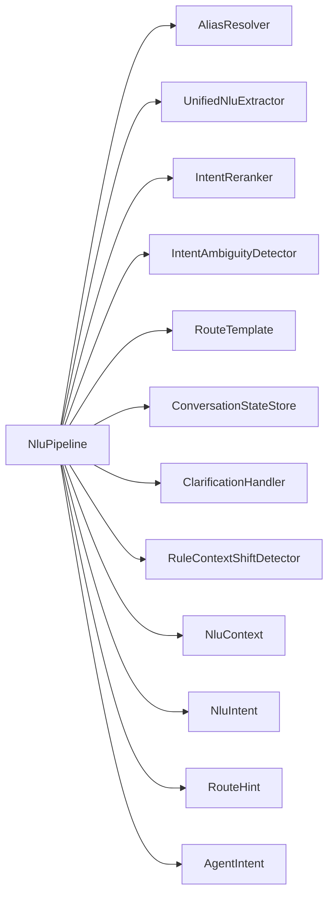

# 实体抽取系统

<cite>
**本文引用的文件**
- [AliasResolver.java](file://src/main/java/com/yupi/yuaiagent/nlu/AliasResolver.java)
- [NluPipeline.java](file://src/main/java/com/yupi/yuaiagent/nlu/NluPipeline.java)
- [NluContext.java](file://src/main/java/com/yupi/yuaiagent/nlu/NluContext.java)
- [IntentReranker.java](file://src/main/java/com/yupi/yuaiagent/nlu/IntentReranker.java)
- [RouteTemplate.java](file://src/main/java/com/yupi/yuaiagent/nlu/RouteTemplate.java)
- [UnifiedNluExtractor.java](file://src/main/java/com/yupi/yuaiagent/nlu/UnifiedNluExtractor.java)
- [NluIntent.java](file://src/main/java/com/yupi/yuaiagent/nlu/NluIntent.java)
- [ConversationState.java](file://src/main/java/com/yupi/yuaiagent/nlu/ConversationState.java)
- [ConversationStateStore.java](file://src/main/java/com/yupi/yuaiagent/nlu/ConversationStateStore.java)
- [InMemoryConversationStateStore.java](file://src/main/java/com/yupi/yuaiagent/nlu/InMemoryConversationStateStore.java)
- [IntentAmbiguityDetector.java](file://src/main/java/com/yupi/yuaiagent/nlu/IntentAmbiguityDetector.java)
- [ClarificationHandler.java](file://src/main/java/com/yupi/yuaiagent/nlu/ClarificationHandler.java)
- [IntentRequirementRegistry.java](file://src/main/java/com/yupi/yuaiagent/nlu/IntentRequirementRegistry.java)
- [RouteHint.java](file://src/main/java/com/yupi/yuaiagent/nlu/RouteHint.java)
- [RuleContextShiftDetector.java](file://src/main/java/com/yupi/yuaiagent/nlu/RuleContextShiftDetector.java)
- [ContextShiftDetector.java](file://src/main/java/com/yupi/yuaiagent/nlu/ContextShiftDetector.java)
- [AgentIntent.java](file://src/main/java/com/yupi/yuaiagent/agent/AgentIntent.java)
- [DataQueryRouter.java](file://src/main/java/com/yupi/yuaiagent/agent/DataQueryRouter.java)
- [AiChatAgent.java](file://src/main/java/com/yupi/yuaiagent/app/AiChatAgent.java)
- [AiController.java](file://src/main/java/com/yupi/yuaiagent/controller/AiController.java)
- [application.yml](file://src/main/resources/application.yml)
</cite>

## 目录
1. [简介](#简介)
2. [项目结构](#项目结构)
3. [核心组件](#核心组件)
4. [架构总览](#架构总览)
5. [详细组件分析](#详细组件分析)
6. [依赖关系分析](#依赖关系分析)
7. [性能考虑](#性能考虑)
8. [故障排查指南](#故障排查指南)
9. [结论](#结论)
10. [附录](#附录)

## 简介
本文件为“实体抽取系统”的技术文档，聚焦于自然语言理解（NLU）层中的实体抽取与意图识别流程。重点覆盖以下方面：
- 别名解析器：别名映射、标准化与冲突解决机制
- 路由提示与路由模板：模板匹配、参数提取与动态路由生成
- 实体识别算法：统一抽取、重排序与歧义检测
- 配置选项、扩展接口与自定义规则
- 实际应用场景、使用示例与调试技巧
- 面向开发者的完整开发与维护指南

## 项目结构
该系统位于后端工程的 NLU 层，围绕统一抽取、别名解析、意图重排序与路由提示等模块构建，并通过流水线串联形成完整的 NLU 处理链。

图表来源
- [NluPipeline.java:39-170](file://src/main/java/com/yupi/yuaiagent/nlu/NluPipeline.java#L39-L170)
- [AiChatAgent.java](file://src/main/java/com/yupi/yuaiagent/app/AiChatAgent.java)
- [AiController.java](file://src/main/java/com/yupi/yuaiagent/controller/AiController.java)

章节来源
- [NluPipeline.java:39-170](file://src/main/java/com/yupi/yuaiagent/nlu/NluPipeline.java#L39-L170)

## 核心组件
- 别名解析器（AliasResolver）：从用户输入中识别别名并映射到规范实体，支持实体类型标注与冲突处理
- 统一抽取器（UnifiedNluExtractor）：一次性完成意图、实体、度量、时间范围等多目标抽取
- 意图重排序（IntentReranker）：基于别名域权重对原始意图分数进行调整与重排
- 意图歧义检测（IntentAmbiguityDetector）：判断重排序后的意图是否仍存在歧义
- 路由模板（RouteTemplate）：定义路由模板与匹配逻辑，支持动态参数提取
- 会话状态（ConversationState/ConversationStateStore）：持久化对话上下文，区分别名元信息与状态
- 路由提示（RouteHint）：将抽取结果与路由模板结合，生成可执行的路由提示
- 上下文切换检测（RuleContextShiftDetector）：检测用户意图或上下文的切换信号
- 澄清处理器（ClarificationHandler）：在必要时触发澄清请求，引导用户提供更多信息
- 应用集成（AiChatAgent/AiController）：对外提供 NLU 流水线的调用入口

章节来源
- [AliasResolver.java](file://src/main/java/com/yupi/yuaiagent/nlu/AliasResolver.java)
- [UnifiedNluExtractor.java:23-200](file://src/main/java/com/yupi/yuaiagent/nlu/UnifiedNluExtractor.java#L23-L200)
- [IntentReranker.java:43-79](file://src/main/java/com/yupi/yuaiagent/nlu/IntentReranker.java#L43-L79)
- [IntentAmbiguityDetector.java](file://src/main/java/com/yupi/yuaiagent/nlu/IntentAmbiguityDetector.java)
- [RouteTemplate.java:21-200](file://src/main/java/com/yupi/yuaiagent/nlu/RouteTemplate.java#L21-L200)
- [ConversationState.java](file://src/main/java/com/yupi/yuaiagent/nlu/ConversationState.java)
- [ConversationStateStore.java](file://src/main/java/com/yupi/yuaiagent/nlu/ConversationStateStore.java)
- [InMemoryConversationStateStore.java](file://src/main/java/com/yupi/yuaiagent/nlu/InMemoryConversationStateStore.java)
- [RouteHint.java](file://src/main/java/com/yupi/yuaiagent/nlu/RouteHint.java)
- [RuleContextShiftDetector.java](file://src/main/java/com/yupi/yuaiagent/nlu/RuleContextShiftDetector.java)
- [ClarificationHandler.java](file://src/main/java/com/yupi/yuaiagent/nlu/ClarificationHandler.java)
- [AiChatAgent.java](file://src/main/java/com/yupi/yuaiagent/app/AiChatAgent.java)
- [AiController.java](file://src/main/java/com/yupi/yuaiagent/controller/AiController.java)

## 架构总览
NLU 流水线以“别名解析 → 上下文构建 → 统一抽取 → 意图重排序 → 歧义检测 → 路由提示 → 状态持久化”为主线，贯穿会话状态管理与路由决策。

图表来源
- [NluPipeline.java:69-153](file://src/main/java/com/yupi/yuaiagent/nlu/NluPipeline.java#L69-L153)
- [AiChatAgent.java](file://src/main/java/com/yupi/yuaiagent/app/AiChatAgent.java)
- [AiController.java](file://src/main/java/com/yupi/yuaiagent/controller/AiController.java)

## 详细组件分析

### 别名解析器（AliasResolver）
- 设计目标：从用户输入中识别别名，映射到规范实体标识，并标注实体类型；支持多别名共存与冲突消解
- 关键能力
  - 别名映射：将“TX”映射到“腾讯资方”，并记录实体类型
  - 标准化：统一别名大小写、去除噪声字符
  - 冲突解决：当同一别名指向多个实体时，依据上下文或优先级策略选择最优映射
- 数据结构
  - 别名匹配项：包含别名、规范名、实体类型
  - 域权重：按实体类型（如“公司”、“产品”）建立权重映射，用于后续意图重排序
- 处理流程
  - 输入预处理 → 规则匹配/词典检索 → 标准化 → 冲突消解 → 输出匹配列表

图表来源
- [AliasResolver.java](file://src/main/java/com/yupi/yuaiagent/nlu/AliasResolver.java)

章节来源
- [AliasResolver.java](file://src/main/java/com/yupi/yuaiagent/nlu/AliasResolver.java)

### 统一抽取器（UnifiedNluExtractor）
- 设计目标：通过一次大模型调用完成意图、实体、度量、时间范围等多任务抽取，降低延迟与成本
- 关键能力
  - 单次调用抽取：在提示中同时注入会话状态与别名元信息，提升抽取准确性
  - 结果封装：返回意图列表、置信度、实体、度量、时间范围等结构化信息
- 提示设计
  - 将会话状态与别名提示分别注入，避免混淆
  - 使用 NluContext 的 aliasHint 保持别名元信息独立于状态

图表来源
- [NluContext.java:17-44](file://src/main/java/com/yupi/yuaiagent/nlu/NluContext.java#L17-L44)
- [UnifiedNluExtractor.java:23-200](file://src/main/java/com/yupi/yuaiagent/nlu/UnifiedNluExtractor.java#L23-L200)

章节来源
- [NluContext.java:17-44](file://src/main/java/com/yupi/yuaiagent/nlu/NluContext.java#L17-L44)
- [UnifiedNluExtractor.java:23-200](file://src/main/java/com/yupi/yuaiagent/nlu/UnifiedNluExtractor.java#L23-L200)

### 意图重排序（IntentReranker）
- 设计目标：利用别名域信号增强意图排序，提高与当前上下文最相关的意图得分
- 工作机制
  - 收集别名中的实体类型集合
  - 为每个意图根据域权重进行加权调整
  - 重新排序并限制分数范围，确保合理性
- 性能与稳定性
  - 时间复杂度：O(N×D)，N 为意图数，D 为别名域数量
  - 边界处理：最小值与最大值裁剪，避免极端分数

图表来源
- [IntentReranker.java:43-79](file://src/main/java/com/yupi/yuaiagent/nlu/IntentReranker.java#L43-L79)

章节来源
- [IntentReranker.java:43-79](file://src/main/java/com/yupi/yuaiagent/nlu/IntentReranker.java#L43-L79)

### 路由模板（RouteTemplate）
- 设计目标：定义路由模板与匹配逻辑，支持动态参数提取，将抽取结果映射到具体执行路径
- 关键能力
  - 模板匹配：根据意图与实体类型匹配到合适的路由模板
  - 参数提取：从抽取结果中提取动态参数（如实体 ID、度量单位、时间范围）
  - 动态路由生成：组合模板与参数生成最终路由
- 与 RouteHint 的协作：将路由模板与抽取结果合并，生成可执行的路由提示

图表来源
- [RouteTemplate.java:21-200](file://src/main/java/com/yupi/yuaiagent/nlu/RouteTemplate.java#L21-L200)
- [RouteHint.java](file://src/main/java/com/yupi/yuaiagent/nlu/RouteHint.java)

章节来源
- [RouteTemplate.java:21-200](file://src/main/java/com/yupi/yuaiagent/nlu/RouteTemplate.java#L21-L200)
- [RouteHint.java](file://src/main/java/com/yupi/yuaiagent/nlu/RouteHint.java)

### 会话状态与上下文管理
- 会话状态（ConversationState）：持久化的对话上下文，包含实体、度量、时间范围等
- 别名元信息（NluContext.AliasMatch）：仅限当前消息的别名元信息，不进入持久化
- 存储策略（ConversationStateStore）：支持内存与持久化实现，保证状态一致性与可恢复性

图表来源
- [ConversationState.java](file://src/main/java/com/yupi/yuaiagent/nlu/ConversationState.java)
- [ConversationStateStore.java](file://src/main/java/com/yupi/yuaiagent/nlu/ConversationStateStore.java)
- [InMemoryConversationStateStore.java](file://src/main/java/com/yupi/yuaiagent/nlu/InMemoryConversationStateStore.java)
- [NluContext.java:17-44](file://src/main/java/com/yupi/yuaiagent/nlu/NluContext.java#L17-L44)

章节来源
- [ConversationState.java](file://src/main/java/com/yupi/yuaiagent/nlu/ConversationState.java)
- [ConversationStateStore.java](file://src/main/java/com/yupi/yuaiagent/nlu/ConversationStateStore.java)
- [InMemoryConversationStateStore.java](file://src/main/java/com/yupi/yuaiagent/nlu/InMemoryConversationStateStore.java)
- [NluContext.java:17-44](file://src/main/java/com/yupi/yuaiagent/nlu/NluContext.java#L17-L44)

### 澄清与歧义处理
- 意图歧义检测（IntentAmbiguityDetector）：对重排序后的意图进行阈值与分差判断，识别是否存在歧义
- 澄清处理器（ClarificationHandler）：在存在歧义或信息不足时，生成澄清提示，引导用户提供更明确的信息
- 上下文切换检测（RuleContextShiftDetector）：检测用户意图或话题切换，触发状态重置或提示

图表来源
- [IntentAmbiguityDetector.java](file://src/main/java/com/yupi/yuaiagent/nlu/IntentAmbiguityDetector.java)
- [ClarificationHandler.java](file://src/main/java/com/yupi/yuaiagent/nlu/ClarificationHandler.java)
- [RuleContextShiftDetector.java](file://src/main/java/com/yupi/yuaiagent/nlu/RuleContextShiftDetector.java)

章节来源
- [IntentAmbiguityDetector.java](file://src/main/java/com/yupi/yuaiagent/nlu/IntentAmbiguityDetector.java)
- [ClarificationHandler.java](file://src/main/java/com/yupi/yuaiagent/nlu/ClarificationHandler.java)
- [RuleContextShiftDetector.java](file://src/main/java/com/yupi/yuaiagent/nlu/RuleContextShiftDetector.java)

### 应用集成与路由执行
- AiChatAgent/AiController：对外提供 NLU 调用入口，接收用户消息并返回处理结果
- AgentIntent/RouteHint：将 NLU 结果转换为可执行的 AgentIntent，驱动下游工具或服务
- DataQueryRouter：根据路由提示执行具体的数据查询或业务操作

图表来源
- [AiChatAgent.java](file://src/main/java/com/yupi/yuaiagent/app/AiChatAgent.java)
- [AiController.java](file://src/main/java/com/yupi/yuaiagent/controller/AiController.java)
- [NluPipeline.java:155-169](file://src/main/java/com/yupi/yuaiagent/nlu/NluPipeline.java#L155-L169)
- [AgentIntent.java](file://src/main/java/com/yupi/yuaiagent/agent/AgentIntent.java)
- [DataQueryRouter.java](file://src/main/java/com/yupi/yuaiagent/agent/DataQueryRouter.java)

章节来源
- [AiChatAgent.java](file://src/main/java/com/yupi/yuaiagent/app/AiChatAgent.java)
- [AiController.java](file://src/main/java/com/yupi/yuaiagent/controller/AiController.java)
- [NluPipeline.java:155-169](file://src/main/java/com/yupi/yuaiagent/nlu/NluPipeline.java#L155-L169)
- [AgentIntent.java](file://src/main/java/com/yupi/yuaiagent/agent/AgentIntent.java)
- [DataQueryRouter.java](file://src/main/java/com/yupi/yuaiagent/agent/DataQueryRouter.java)

## 依赖关系分析
- 组件耦合
  - NluPipeline 作为编排者，依赖别名解析、统一抽取、意图重排序、歧义检测、路由模板、状态存储、澄清处理与上下文切换检测
  - 各子模块职责清晰，通过接口与数据结构解耦
- 外部依赖
  - 大模型推理（通过统一抽取器调用）
  - 配置中心（application.yml 中的 NLU 相关配置）

图表来源
- [NluPipeline.java:39-67](file://src/main/java/com/yupi/yuaiagent/nlu/NluPipeline.java#L39-L67)

章节来源
- [NluPipeline.java:39-67](file://src/main/java/com/yupi/yuaiagent/nlu/NluPipeline.java#L39-L67)

## 性能考虑
- 单次抽取优化：统一抽取减少大模型调用次数，显著降低延迟与成本
- 分数裁剪与重排：通过边界控制与加权调整，避免极端分数影响决策稳定性
- 缓存与状态复用：会话状态持久化与内存实现可按需选择，平衡一致性与性能
- 模板匹配效率：路由模板应尽量简洁，避免过多分支导致匹配开销增加

## 故障排查指南
- 别名未生效
  - 检查别名解析是否正确识别输入中的别名
  - 确认实体类型标注与域权重配置一致
- 抽取结果不准确
  - 查看提示中是否正确注入了会话状态与别名提示
  - 调整统一抽取器的提示模板与约束
- 意图重排序异常
  - 核对域权重表与别名实体类型映射
  - 检查分数裁剪与排序逻辑
- 路由生成失败
  - 确认路由模板与抽取结果字段匹配
  - 检查动态参数提取逻辑
- 会话状态异常
  - 核对状态存储实现与并发访问控制
  - 检查澄清触发条件与状态保存时机

章节来源
- [AliasResolver.java](file://src/main/java/com/yupi/yuaiagent/nlu/AliasResolver.java)
- [UnifiedNluExtractor.java:23-200](file://src/main/java/com/yupi/yuaiagent/nlu/UnifiedNluExtractor.java#L23-L200)
- [IntentReranker.java:43-79](file://src/main/java/com/yupi/yuaiagent/nlu/IntentReranker.java#L43-L79)
- [RouteTemplate.java:21-200](file://src/main/java/com/yupi/yuaiagent/nlu/RouteTemplate.java#L21-L200)
- [ConversationStateStore.java](file://src/main/java/com/yupi/yuaiagent/nlu/ConversationStateStore.java)
- [ClarificationHandler.java](file://src/main/java/com/yupi/yuaiagent/nlu/ClarificationHandler.java)

## 结论
本实体抽取系统通过“别名解析 + 统一抽取 + 意图重排序 + 路由模板”的流水线设计，在保证准确性的同时提升了性能与可维护性。其模块化架构便于扩展与定制，适合在多场景下快速落地与迭代。

## 附录

### 配置选项与扩展接口
- 配置文件位置：application.yml
- 可关注的 NLU 相关配置项（示例）
  - 大模型调用参数（超时、温度、最大输出长度）
  - 别名域权重表（可扩展新域）
  - 路由模板定义（新增模板与参数映射）
  - 澄清阈值与提示模板
  - 会话状态存储策略（内存/持久化）
- 扩展接口建议
  - 自定义别名解析规则（正则/词典/外部服务）
  - 自定义意图域权重（动态加载/热更新）
  - 自定义路由模板（表达式/函数式）
  - 自定义澄清策略（多轮引导/示例提示）

章节来源
- [application.yml](file://src/main/resources/application.yml)

### 实际应用场景与使用示例
- 场景示例
  - 金融客服：识别“TX”为“腾讯资方”，结合会话状态查询账户余额或交易明细
  - 产品咨询：识别“iPhone”为“产品”，提取度量与时间范围，生成购买建议
  - 会议助手：识别“下周三”为时间范围，结合实体生成日程提醒
- 使用步骤
  - 用户输入 → 控制器接收 → 聊天代理调用 NLU 流水线 → 生成路由提示 → 执行路由 → 返回结果

章节来源
- [AiController.java](file://src/main/java/com/yupi/yuaiagent/controller/AiController.java)
- [AiChatAgent.java](file://src/main/java/com/yupi/yuaiagent/app/AiChatAgent.java)
- [NluPipeline.java:69-153](file://src/main/java/com/yupi/yuaiagent/nlu/NluPipeline.java#L69-L153)

### 调试技巧
- 日志追踪：关注 NLU 流水线各阶段的日志输出，定位问题环节
- 状态快照：在关键节点打印会话状态与别名提示，验证上下文注入正确性
- 模板校验：逐条核对路由模板与抽取字段映射，确保参数提取无误
- 性能监控：统计单次抽取耗时与命中率，识别瓶颈并优化提示与模板