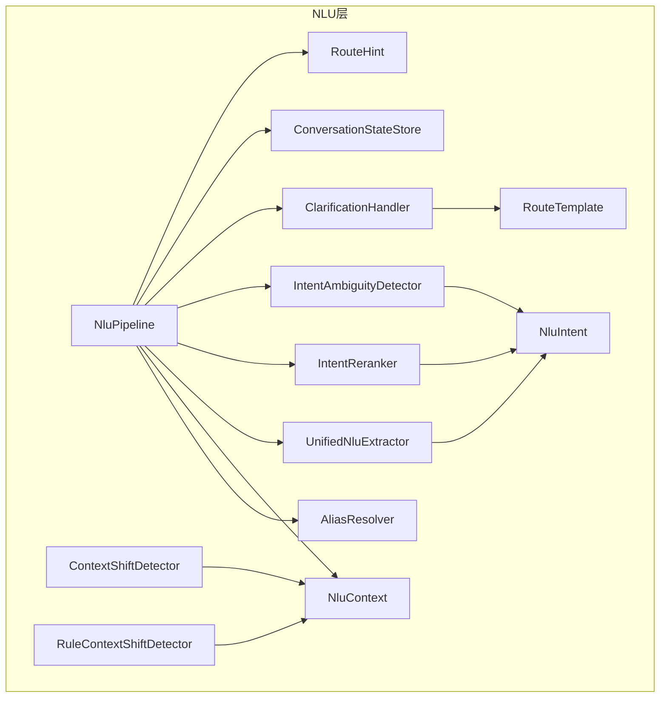
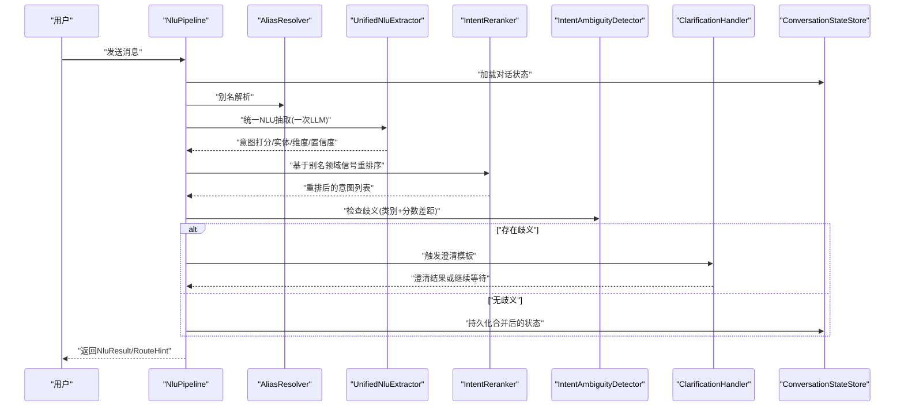
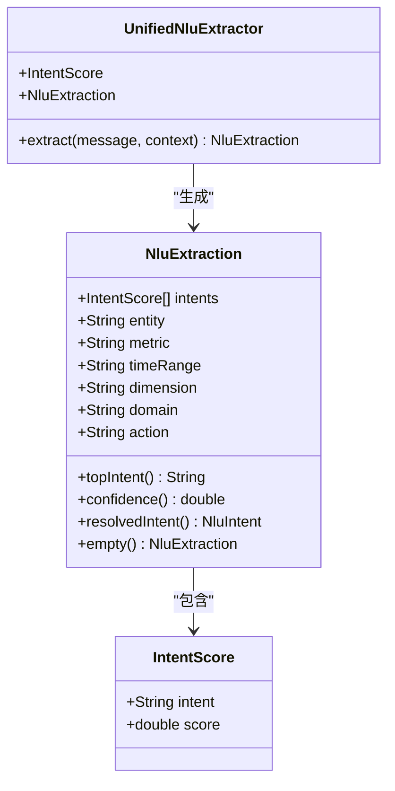
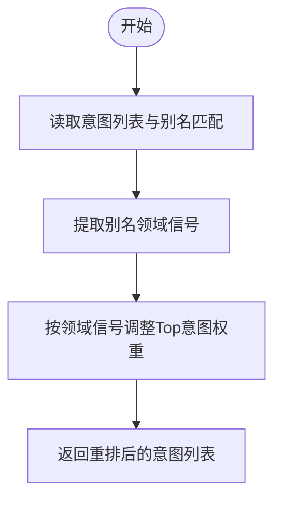
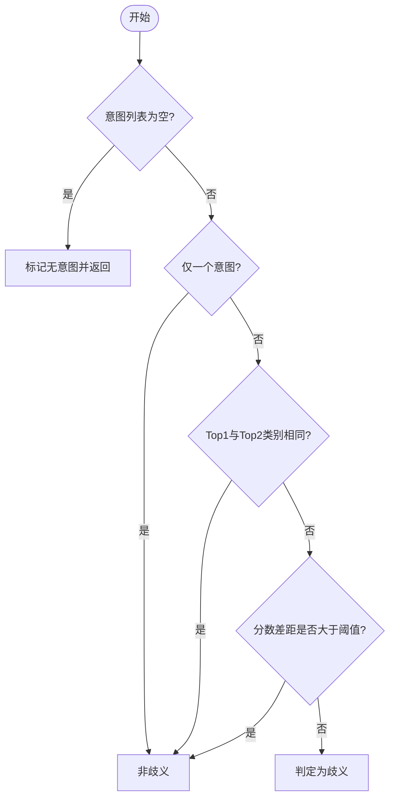
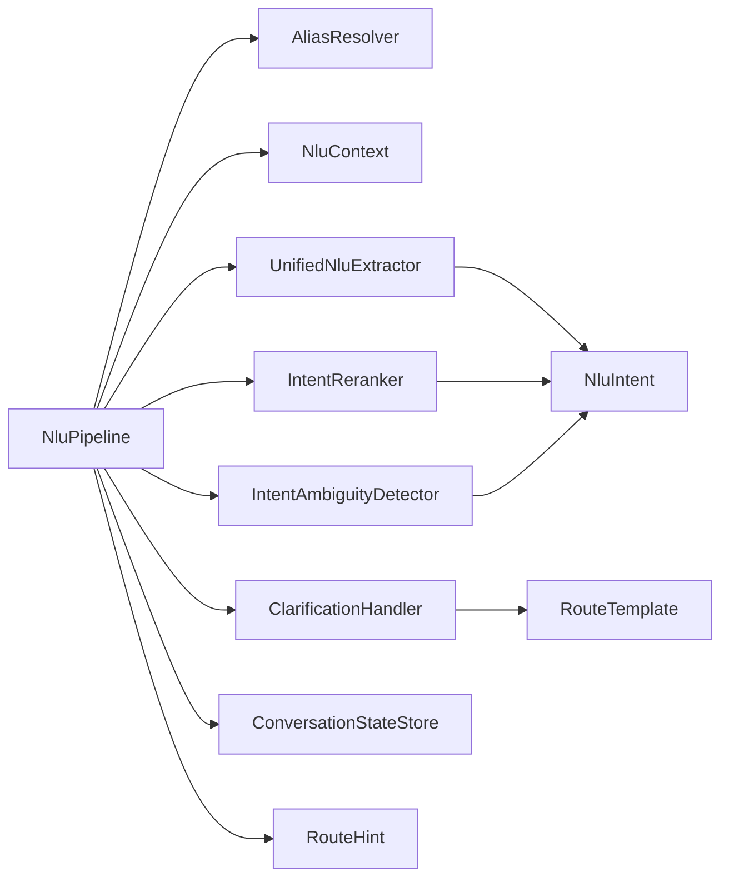

# 意图识别系统

<cite>
**本文引用的文件**
- [NluPipeline.java](file://src/main/java/com/yupi/yuaiagent/nlu/NluPipeline.java)
- [UnifiedNluExtractor.java](file://src/main/java/com/yupi/yuaiagent/nlu/UnifiedNluExtractor.java)
- [IntentAmbiguityDetector.java](file://src/main/java/com/yupi/yuaiagent/nlu/IntentAmbiguityDetector.java)
- [IntentReranker.java](file://src/main/java/com/yupi/yuaiagent/nlu/IntentReranker.java)
- [IntentRequirementRegistry.java](file://src/main/java/com/yupi/yuaiagent/nlu/IntentRequirementRegistry.java)
- [NluIntent.java](file://src/main/java/com/yupi/yuaiagent/nlu/NluIntent.java)
- [NluContext.java](file://src/main/java/com/yupi/yuaiagent/nlu/NluContext.java)
- [ConversationState.java](file://src/main/java/com/yupi/yuaiagent/nlu/ConversationState.java)
- [ConversationStateStore.java](file://src/main/java/com/yupi/yuaiagent/nlu/ConversationStateStore.java)
- [InMemoryConversationStateStore.java](file://src/main/java/com/yupi/yuaiagent/nlu/InMemoryConversationStateStore.java)
- [AliasResolver.java](file://src/main/java/com/yupi/yuaiagent/nlu/AliasResolver.java)
- [ClarificationHandler.java](file://src/main/java/com/yupi/yuaiagent/nlu/ClarificationHandler.java)
- [RouteHint.java](file://src/main/java/com/yupi/yuaiagent/nlu/RouteHint.java)
- [RouteTemplate.java](file://src/main/java/com/yupi/yuaiagent/nlu/RouteTemplate.java)
- [ContextShiftDetector.java](file://src/main/java/com/yupi/yuaiagent/nlu/ContextShiftDetector.java)
- [RuleContextShiftDetector.java](file://src/main/java/com/yupi/yuaiagent/nlu/RuleContextShiftDetector.java)
- [architecture.html](file://docs/architecture.html)
- [nlu-layer-design-v4.2.md](file://docs/nlu-layer-design-v4.2.md)
</cite>

## 目录
1. [简介](#简介)
2. [项目结构](#项目结构)
3. [核心组件](#核心组件)
4. [架构总览](#架构总览)
5. [详细组件分析](#详细组件分析)
6. [依赖关系分析](#依赖关系分析)
7. [性能考虑](#性能考虑)
8. [故障排查指南](#故障排查指南)
9. [结论](#结论)
10. [附录](#附录)

## 简介
本技术文档围绕“意图识别系统”展开，系统基于统一的NLU流水线，通过一次LLM调用完成意图打分、实体与维度提取，并结合领域别名信号进行意图重排序，随后进行歧义检测与澄清处理，最终生成路由提示并持久化对话状态。文档重点覆盖以下主题：
- NLU意图的定义、分类与优先级排序机制
- 意图重排序器的工作原理与算法实现（置信度计算与排序策略）
- 歧义检测器如何识别与处理多意图冲突
- 意图需求注册表的配置与管理
- 意图模板定义、规则配置与机器学习/大模型集成方法
- 性能优化、准确率提升与调试技巧

## 项目结构
NLU相关代码集中在后端模块的nlu包内，配合对话状态存储、别名解析、歧义检测与澄清处理等组件协同工作；前端与文档侧提供了架构视图与设计说明。

图表来源
- [NluPipeline.java:69-170](file://src/main/java/com/yupi/yuaiagent/nlu/NluPipeline.java#L69-L170)
- [UnifiedNluExtractor.java:1-202](file://src/main/java/com/yupi/yuaiagent/nlu/UnifiedNluExtractor.java#L1-L202)
- [IntentAmbiguityDetector.java:1-45](file://src/main/java/com/yupi/yuaiagent/nlu/IntentAmbiguityDetector.java#L1-L45)
- [IntentReranker.java](file://src/main/java/com/yupi/yuaiagent/nlu/IntentReranker.java)
- [IntentRequirementRegistry.java](file://src/main/java/com/yupi/yuaiagent/nlu/IntentRequirementRegistry.java)
- [NluIntent.java](file://src/main/java/com/yupi/yuaiagent/nlu/NluIntent.java)
- [NluContext.java](file://src/main/java/com/yupi/yuaiagent/nlu/NluContext.java)
- [ConversationState.java](file://src/main/java/com/yupi/yuaiagent/nlu/ConversationState.java)
- [ConversationStateStore.java](file://src/main/java/com/yupi/yuaiagent/nlu/ConversationStateStore.java)
- [InMemoryConversationStateStore.java](file://src/main/java/com/yupi/yuaiagent/nlu/InMemoryConversationStateStore.java)
- [AliasResolver.java](file://src/main/java/com/yupi/yuaiagent/nlu/AliasResolver.java)
- [ClarificationHandler.java](file://src/main/java/com/yupi/yuaiagent/nlu/ClarificationHandler.java)
- [RouteHint.java](file://src/main/java/com/yupi/yuaiagent/nlu/RouteHint.java)
- [RouteTemplate.java](file://src/main/java/com/yupi/yuaiagent/nlu/RouteTemplate.java)
- [ContextShiftDetector.java](file://src/main/java/com/yupi/yuaiagent/nlu/ContextShiftDetector.java)
- [RuleContextShiftDetector.java](file://src/main/java/com/yupi/yuaiagent/nlu/RuleContextShiftDetector.java)

章节来源
- [NluPipeline.java:69-170](file://src/main/java/com/yupi/yuaiagent/nlu/NluPipeline.java#L69-L170)
- [architecture.html:135-150](file://docs/architecture.html#L135-L150)

## 核心组件
- 统一NLU抽取器：单次LLM调用输出意图打分、实体、指标、时间范围、维度、领域与动作，同时提供置信度（Top1与Top2分数差）。
- 意图重排序器：利用别名解析提供的领域信号对意图进行重排，提高领域相关意图的优先级。
- 歧义检测器：根据意图类别与分数差距判断是否存在多意图冲突，避免错误路由。
- 澄清处理器：在需要时触发模板化的澄清流程，减少额外LLM调用。
- 对话状态与上下文：保存与恢复用户当前对话状态，支持上下文切换检测与规则驱动的上下文切换。
- 路由提示与模板：将最终意图与提取信息封装为路由提示，供后续执行器使用。

章节来源
- [UnifiedNluExtractor.java:14-22](file://src/main/java/com/yupi/yuaiagent/nlu/UnifiedNluExtractor.java#L14-L22)
- [IntentReranker.java](file://src/main/java/com/yupi/yuaiagent/nlu/IntentReranker.java)
- [IntentAmbiguityDetector.java:10-21](file://src/main/java/com/yupi/yuaiagent/nlu/IntentAmbiguityDetector.java#L10-L21)
- [ClarificationHandler.java](file://src/main/java/com/yupi/yuaiagent/nlu/ClarificationHandler.java)
- [ConversationState.java](file://src/main/java/com/yupi/yuaiagent/nlu/ConversationState.java)
- [NluContext.java](file://src/main/java/com/yupi/yuaiagent/nlu/NluContext.java)
- [RouteHint.java](file://src/main/java/com/yupi/yuaiagent/nlu/RouteHint.java)
- [RouteTemplate.java](file://src/main/java/com/yupi/yuaiagent/nlu/RouteTemplate.java)

## 架构总览
下图展示了NLU流水线的关键步骤与组件交互，体现从消息输入到路由提示输出的完整过程。

图表来源
- [NluPipeline.java:69-170](file://src/main/java/com/yupi/yuaiagent/nlu/NluPipeline.java#L69-L170)
- [UnifiedNluExtractor.java:14-22](file://src/main/java/com/yupi/yuaiagent/nlu/UnifiedNluExtractor.java#L14-L22)
- [IntentAmbiguityDetector.java:36-45](file://src/main/java/com/yupi/yuaiagent/nlu/IntentAmbiguityDetector.java#L36-L45)
- [ClarificationHandler.java](file://src/main/java/com/yupi/yuaiagent/nlu/ClarificationHandler.java)
- [ConversationStateStore.java](file://src/main/java/com/yupi/yuaiagent/nlu/ConversationStateStore.java)

## 详细组件分析

### 统一NLU抽取器（UnifiedNluExtractor）
- 单次LLM调用产出结构化JSON，包含意图打分列表、实体、指标、时间范围、维度、领域与动作。
- 置信度计算采用Top1与Top2分数差作为启发式指标，用于衡量意图区分度。
- 提供空结果构造器，便于异常或无意图场景的兜底处理。

图表来源
- [UnifiedNluExtractor.java:14-22](file://src/main/java/com/yupi/yuaiagent/nlu/UnifiedNluExtractor.java#L14-L22)
- [UnifiedNluExtractor.java:168-202](file://src/main/java/com/yupi/yuaiagent/nlu/UnifiedNluExtractor.java#L168-L202)

章节来源
- [UnifiedNluExtractor.java:14-22](file://src/main/java/com/yupi/yuaiagent/nlu/UnifiedNluExtractor.java#L14-L22)
- [UnifiedNluExtractor.java:170-202](file://src/main/java/com/yupi/yuaiagent/nlu/UnifiedNluExtractor.java#L170-L202)

### 意图重排序器（IntentReranker）
- 输入：统一抽取器输出的意图列表与别名匹配结果。
- 输出：基于别名领域信号调整后的意图优先级列表。
- 目标：提升与当前上下文领域一致的意图得分，改善跨领域对话的准确性。

图表来源
- [NluPipeline.java:85-86](file://src/main/java/com/yupi/yuaiagent/nlu/NluPipeline.java#L85-L86)
- [IntentReranker.java](file://src/main/java/com/yupi/yuaiagent/nlu/IntentReranker.java)

章节来源
- [NluPipeline.java:85-86](file://src/main/java/com/yupi/yuaiagent/nlu/NluPipeline.java#L85-L86)
- [IntentReranker.java](file://src/main/java/com/yupi/yuaiagent/nlu/IntentReranker.java)

### 歧义检测器（IntentAmbiguityDetector）
- 判定逻辑：
  - 若Top1与Top2属于同一类别，则不视为歧义；
  - 若类别不同且分数差距小于阈值，则判定为歧义；
  - 若Top1显著领先（差距超过阈值），则不视为歧义。
- 作用：防止跨类别的意图冲突导致错误路由，必要时触发澄清流程。

图表来源
- [IntentAmbiguityDetector.java:36-45](file://src/main/java/com/yupi/yuaiagent/nlu/IntentAmbiguityDetector.java#L36-L45)

章节来源
- [IntentAmbiguityDetector.java:10-21](file://src/main/java/com/yupi/yuaiagent/nlu/IntentAmbiguityDetector.java#L10-L21)
- [IntentAmbiguityDetector.java:25-32](file://src/main/java/com/yupi/yuaiagent/nlu/IntentAmbiguityDetector.java#L25-L32)
- [IntentAmbiguityDetector.java:36-45](file://src/main/java/com/yupi/yuaiagent/nlu/IntentAmbiguityDetector.java#L36-L45)

### 澄清处理器（ClarificationHandler）
- 在歧义或信息不足时，依据模板触发澄清流程，避免额外LLM调用。
- 支持模板化引导用户明确意图，提升交互效率与准确性。

章节来源
- [ClarificationHandler.java](file://src/main/java/com/yupi/yuaiagent/nlu/ClarificationHandler.java)
- [RouteTemplate.java](file://src/main/java/com/yupi/yuaiagent/nlu/RouteTemplate.java)

### 对话状态与上下文（ConversationState & NluContext）
- 对话状态存储当前轮次的实体、指标、时间范围、维度等信息，并在成功路由后持久化。
- 上下文构建将状态与别名匹配分离，确保别名仅作为领域信号参与推理，不污染长期状态。

章节来源
- [ConversationState.java](file://src/main/java/com/yupi/yuaiagent/nlu/ConversationState.java)
- [NluContext.java](file://src/main/java/com/yupi/yuaiagent/nlu/NluContext.java)
- [ConversationStateStore.java](file://src/main/java/com/yupi/yuaiagent/nlu/ConversationStateStore.java)
- [InMemoryConversationStateStore.java](file://src/main/java/com/yupi/yuaiagent/nlu/InMemoryConversationStateStore.java)

### 别名解析器（AliasResolver）
- 将用户输入中的别名映射到标准实体，作为领域信号注入重排序阶段。
- 不直接写入对话状态，避免语义漂移。

章节来源
- [AliasResolver.java](file://src/main/java/com/yupi/yuaiagent/nlu/AliasResolver.java)
- [NluPipeline.java:74-77](file://src/main/java/com/yupi/yuaiagent/nlu/NluPipeline.java#L74-L77)

### 上下文切换检测（ContextShiftDetector & RuleContextShiftDetector）
- 检测跟进问题、实体切换与全新话题等上下文变化，决定是否重置或合并状态。
- 规则驱动版本可按业务规则定制切换行为。

章节来源
- [ContextShiftDetector.java](file://src/main/java/com/yupi/yuaiagent/nlu/ContextShiftDetector.java)
- [RuleContextShiftDetector.java](file://src/main/java/com/yupi/yuaiagent/nlu/RuleContextShiftDetector.java)

### 路由提示与模板（RouteHint & RouteTemplate）
- 将最终意图与提取信息封装为路由提示，供后续执行器使用。
- 模板用于澄清与回退场景，保证一致性与可维护性。

章节来源
- [RouteHint.java](file://src/main/java/com/yupi/yuaiagent/nlu/RouteHint.java)
- [RouteTemplate.java](file://src/main/java/com/yupi/yuaiagent/nlu/RouteTemplate.java)

## 依赖关系分析
- NluPipeline是编排核心，依赖别名解析、上下文构建、统一抽取、重排序、歧义检测、澄清处理与状态存储。
- UnifiedNluExtractor与IntentReranker共同决定意图优先级与置信度。
- IntentAmbiguityDetector与ClarificationHandler形成“歧义-澄清”的闭环。
- ConversationStateStore与NluContext保障状态一致性与可追踪性。

图表来源
- [NluPipeline.java:69-170](file://src/main/java/com/yupi/yuaiagent/nlu/NluPipeline.java#L69-L170)
- [UnifiedNluExtractor.java:14-22](file://src/main/java/com/yupi/yuaiagent/nlu/UnifiedNluExtractor.java#L14-L22)
- [IntentAmbiguityDetector.java:10-21](file://src/main/java/com/yupi/yuaiagent/nlu/IntentAmbiguityDetector.java#L10-L21)
- [IntentReranker.java](file://src/main/java/com/yupi/yuaiagent/nlu/IntentReranker.java)
- [ClarificationHandler.java](file://src/main/java/com/yupi/yuaiagent/nlu/ClarificationHandler.java)
- [RouteTemplate.java](file://src/main/java/com/yupi/yuaiagent/nlu/RouteTemplate.java)
- [RouteHint.java](file://src/main/java/com/yupi/yuaiagent/nlu/RouteHint.java)

章节来源
- [NluPipeline.java:69-170](file://src/main/java/com/yupi/yuaiagent/nlu/NluPipeline.java#L69-L170)

## 性能考虑
- 单次LLM调用：统一抽取器将意图打分、槽位与领域/动作合并为一次调用，降低延迟与成本。
- 置信度启发式：以Top1与Top2分数差作为置信度，无需额外校准，快速决策。
- 别名领域信号：在重排序阶段引入领域信号，减少歧义，降低澄清频率。
- 澄清模板化：在歧义场景使用模板触发澄清，避免重复LLM调用。
- 状态持久化：仅在无需澄清时保存状态，减少不必要的IO。

章节来源
- [UnifiedNluExtractor.java:14-22](file://src/main/java/com/yupi/yuaiagent/nlu/UnifiedNluExtractor.java#L14-L22)
- [NluPipeline.java:85-86](file://src/main/java/com/yupi/yuaiagent/nlu/NluPipeline.java#L85-L86)
- [IntentAmbiguityDetector.java:34-35](file://src/main/java/com/yupi/yuaiagent/nlu/IntentAmbiguityDetector.java#L34-L35)

## 故障排查指南
- 无意图或置信度过低
  - 检查统一抽取器输出与置信度计算逻辑，确认Top1与Top2分数差是否合理。
  - 参考路径：[UnifiedNluExtractor.java:183-188](file://src/main/java/com/yupi/yuaiagent/nlu/UnifiedNluExtractor.java#L183-L188)
- 多意图冲突
  - 检查歧义检测器的类别映射与阈值设置，确认Top1与Top2类别与分数差距。
  - 参考路径：[IntentAmbiguityDetector.java:25-32](file://src/main/java/com/yupi/yuaiagent/nlu/IntentAmbiguityDetector.java#L25-L32), [IntentAmbiguityDetector.java:34-45](file://src/main/java/com/yupi/yuaiagent/nlu/IntentAmbiguityDetector.java#L34-L45)
- 状态未更新
  - 确认流水线在无需澄清时才保存状态，检查保存条件与状态合并逻辑。
  - 参考路径：[NluPipeline.java:143-145](file://src/main/java/com/yupi/yuaiagent/nlu/NluPipeline.java#L143-L145)
- 别名未生效
  - 检查别名解析与重排序阶段的信号传递，确认别名领域信号被正确使用。
  - 参考路径：[NluPipeline.java:74-77](file://src/main/java/com/yupi/yuaiagent/nlu/NluPipeline.java#L74-L77), [NluPipeline.java:85-86](file://src/main/java/com/yupi/yuaiagent/nlu/NluPipeline.java#L85-L86)

章节来源
- [UnifiedNluExtractor.java:183-188](file://src/main/java/com/yupi/yuaiagent/nlu/UnifiedNluExtractor.java#L183-L188)
- [IntentAmbiguityDetector.java:25-32](file://src/main/java/com/yupi/yuaiagent/nlu/IntentAmbiguityDetector.java#L25-L32)
- [IntentAmbiguityDetector.java:34-45](file://src/main/java/com/yupi/yuaiagent/nlu/IntentAmbiguityDetector.java#L34-L45)
- [NluPipeline.java:143-145](file://src/main/java/com/yupi/yuaiagent/nlu/NluPipeline.java#L143-L145)
- [NluPipeline.java:74-77](file://src/main/java/com/yupi/yuaiagent/nlu/NluPipeline.java#L74-L77)

## 结论
该意图识别系统通过“统一抽取 + 领域信号重排序 + 歧义检测 + 澄清模板”的流水线，实现了低延迟、高可解释性的意图理解与路由。其关键优势在于：
- 以一次LLM调用完成多任务抽取，显著降低延迟；
- 借助别名领域信号提升领域相关意图的优先级；
- 以类别与分数差距双因子判定歧义，兼顾鲁棒性与准确性；
- 使用模板化澄清减少额外推理开销；
- 完整的状态与上下文管理确保会话连贯性。

## 附录

### 意图定义、分类与优先级排序机制
- 意图枚举：系统通过NluIntent定义可用意图集合，统一抽取器与重排序器均基于该枚举进行处理。
- 分类映射：歧义检测器内置类别映射，用于判断意图是否属于同一类别。
- 排序策略：重排序器基于别名领域信号调整Top意图权重，随后由置信度启发式进一步筛选。

章节来源
- [NluIntent.java](file://src/main/java/com/yupi/yuaiagent/nlu/NluIntent.java)
- [IntentAmbiguityDetector.java:25-32](file://src/main/java/com/yupi/yuaiagent/nlu/IntentAmbiguityDetector.java#L25-L32)
- [NluPipeline.java:85-86](file://src/main/java/com/yupi/yuaiagent/nlu/NluPipeline.java#L85-L86)

### 意图需求注册表（IntentRequirementRegistry）
- 用途：集中管理各意图所需的槽位、上下文与前置条件，确保意图执行前满足必要约束。
- 配置方式：通过注册表在运行时动态查询意图需求，与统一抽取器输出的槽位进行比对与补全。

章节来源
- [IntentRequirementRegistry.java](file://src/main/java/com/yupi/yuaiagent/nlu/IntentRequirementRegistry.java)

### 意图模板定义、规则配置与模型集成
- 模板定义：通过RouteTemplate与ClarificationHandler的模板机制，定义澄清与回退流程。
- 规则配置：RuleContextShiftDetector支持按规则定制上下文切换行为，适配复杂业务场景。
- 模型集成：统一抽取器通过ChatClient与外部大模型对接，输出结构化JSON供后续处理。

章节来源
- [RouteTemplate.java](file://src/main/java/com/yupi/yuaiagent/nlu/RouteTemplate.java)
- [ClarificationHandler.java](file://src/main/java/com/yupi/yuaiagent/nlu/ClarificationHandler.java)
- [RuleContextShiftDetector.java](file://src/main/java/com/yupi/yuaiagent/nlu/RuleContextShiftDetector.java)
- [UnifiedNluExtractor.java:26-27](file://src/main/java/com/yupi/yuaiagent/nlu/UnifiedNluExtractor.java#L26-L27)

### 设计文档与架构视图
- 架构图：文档中提供了NLU流水线的架构视图，清晰展示各组件职责与交互。
- 设计说明：文档对NLU层的设计理念、目标与实现细节进行了系统阐述。

章节来源
- [architecture.html:135-150](file://docs/architecture.html#L135-L150)
- [nlu-layer-design-v4.2.md](file://docs/nlu-layer-design-v4.2.md)