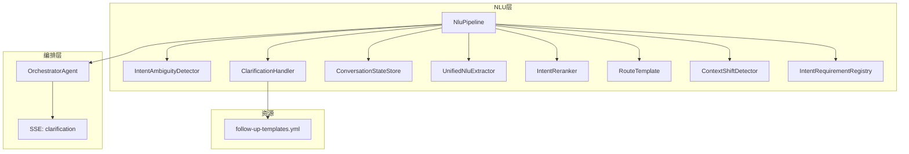
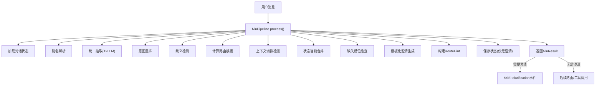
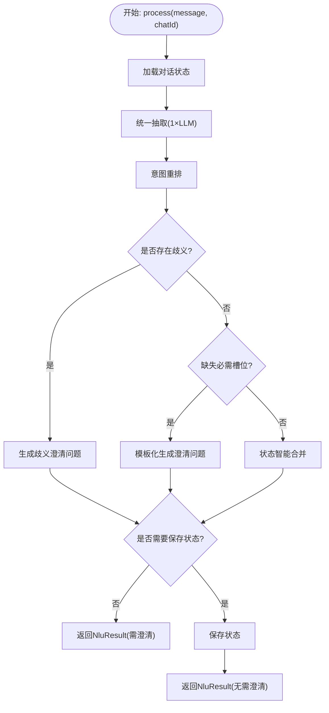
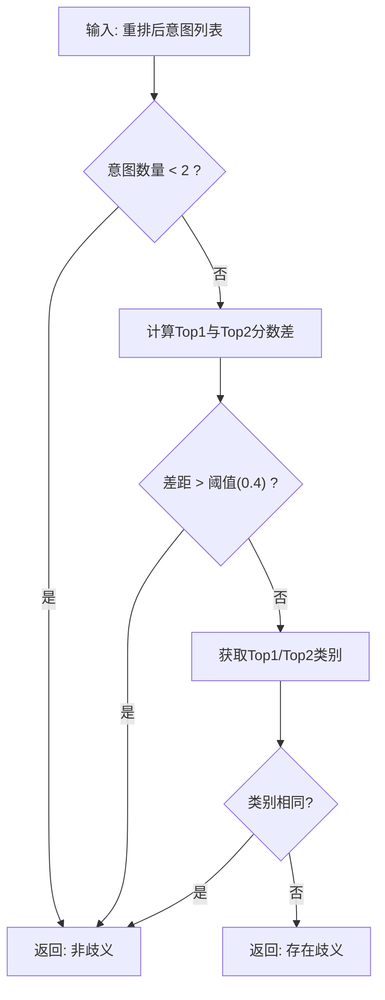
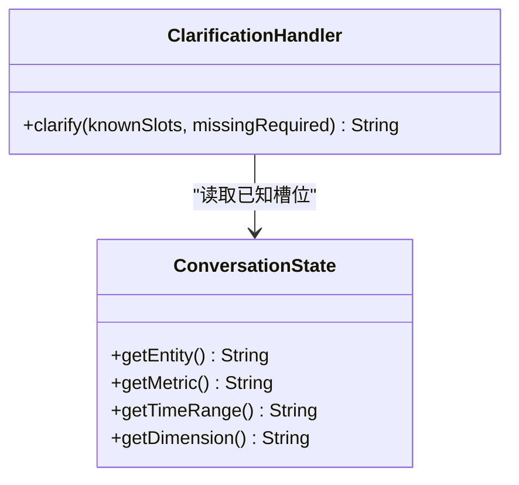
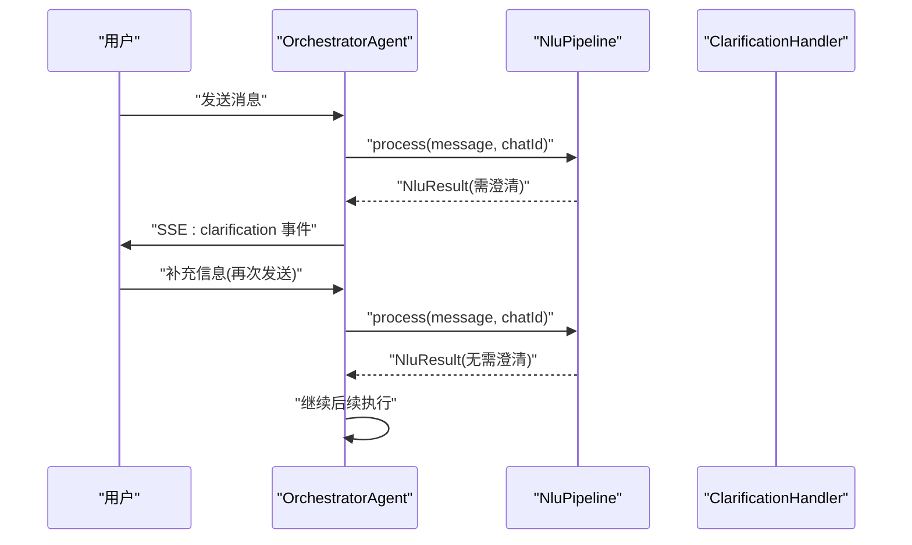
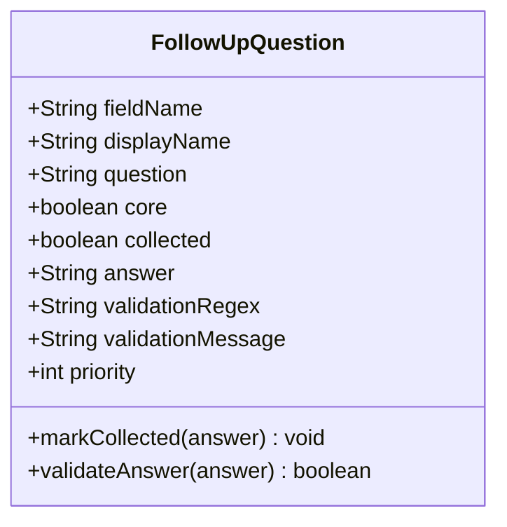
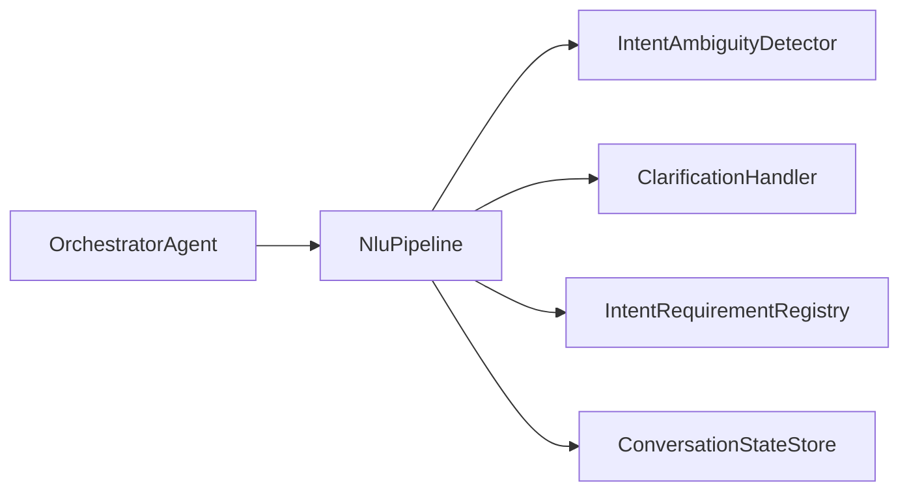

# 澄清处理机制

<cite>
**本文引用的文件**
- [ClarificationHandler.java](file://src/main/java/com/yupi/yuaiagent/nlu/ClarificationHandler.java)
- [IntentAmbiguityDetector.java](file://src/main/java/com/yupi/yuaiagent/nlu/IntentAmbiguityDetector.java)
- [NluPipeline.java](file://src/main/java/com/yupi/yuaiagent/nlu/NluPipeline.java)
- [FollowUpQuestion.java](file://src/main/java/com/yupi/yuaiagent/agent/model/FollowUpQuestion.java)
- [OrchestratorAgent.java](file://src/main/java/com/yupi/yuaiagent/agent/OrchestratorAgent.java)
- [architecture.html](file://docs/architecture.html)
- [follow-up-templates.yml](file://src/main/resources/templates/follow-up-templates.yml)
</cite>

## 目录
1. [引言](#引言)
2. [项目结构](#项目结构)
3. [核心组件](#核心组件)
4. [架构总览](#架构总览)
5. [详细组件分析](#详细组件分析)
6. [依赖分析](#依赖分析)
7. [性能考虑](#性能考虑)
8. [故障排查指南](#故障排查指南)
9. [结论](#结论)
10. [附录](#附录)

## 引言
本技术文档围绕“澄清处理机制”展开，系统性阐述澄清处理器在NLU流水线中的设计原理与运行流程，覆盖以下关键主题：
- 模糊意图识别：如何通过重排后的意图分数与类别冲突检测判定是否存在歧义。
- 用户澄清请求：基于缺失槽位与已知上下文生成模板化的澄清问题。
- 上下文更新机制：在无需澄清时进行状态合并与持久化；在需要澄清时阻断后续执行并返回澄清事件。
- 澄清策略实现：问题生成、用户反馈收集与意图修正路径。
- 触发条件与处理逻辑：何时触发澄清、如何与对话状态管理协同。
- 用户体验优化：最小化LLM调用次数、提升澄清问题的可理解性与引导效率。
- 配置与扩展：澄清模板、槽位问题映射与交互设计建议。

## 项目结构
澄清处理位于NLU子系统中，作为统一抽取、意图重排与路由模板之后的关键环节，负责在必要时向用户发起澄清请求，并在不需要澄清时推进到后续路由阶段。前端通过服务端事件接收澄清通知，随后由编排器继续处理。

图表来源
- [NluPipeline.java:39-67](file://src/main/java/com/yupi/yuaiagent/nlu/NluPipeline.java#L39-L67)
- [OrchestratorAgent.java:408-429](file://src/main/java/com/yupi/yuaiagent/agent/OrchestratorAgent.java#L408-L429)
- [follow-up-templates.yml](file://src/main/resources/templates/follow-up-templates.yml)

章节来源
- [NluPipeline.java:69-153](file://src/main/java/com/yupi/yuaiagent/nlu/NluPipeline.java#L69-L153)
- [OrchestratorAgent.java:408-429](file://src/main/java/com/yupi/yuaiagent/agent/OrchestratorAgent.java#L408-L429)

## 核心组件
- NluPipeline：NLU流水线主控制器，串联别名解析、统一抽取、意图重排、歧义检测、上下文合并、路由模板与澄清检查，最终产出澄清或路由结果。
- IntentAmbiguityDetector：基于类别冲突与分数差距判断是否存在歧义。
- ClarificationHandler：基于已知槽位与缺失槽位生成模板化澄清问题。
- OrchestratorAgent：接收澄清事件并中断当前执行，等待用户补充信息后重新进入NLU流程。
- FollowUpQuestion：用于构建结构化追问问题的数据模型（验证、优先级、核心/可选等）。
- follow-up-templates.yml：澄清模板资源文件，支持多语言与场景化定制。

章节来源
- [NluPipeline.java:14-34](file://src/main/java/com/yupi/yuaiagent/nlu/NluPipeline.java#L14-L34)
- [IntentAmbiguityDetector.java:10-21](file://src/main/java/com/yupi/yuaiagent/nlu/IntentAmbiguityDetector.java#L10-L21)
- [ClarificationHandler.java:8-13](file://src/main/java/com/yupi/yuaiagent/nlu/ClarificationHandler.java#L8-L13)
- [OrchestratorAgent.java:408-429](file://src/main/java/com/yupi/yuaiagent/agent/OrchestratorAgent.java#L408-L429)
- [FollowUpQuestion.java:8-13](file://src/main/java/com/yupi/yuaiagent/agent/model/FollowUpQuestion.java#L8-L13)
- [follow-up-templates.yml](file://src/main/resources/templates/follow-up-templates.yml)

## 架构总览
澄清处理在NLU流水线中的位置如下图所示，强调“模板化澄清（零LLM）”与“最少化LLM调用”的设计目标。

图表来源
- [NluPipeline.java:69-153](file://src/main/java/com/yupi/yuaiagent/nlu/NluPipeline.java#L69-L153)
- [architecture.html:135-150](file://docs/architecture.html#L135-L150)

## 详细组件分析

### 组件一：NluPipeline（澄清触发与状态管理）
- 设计要点
  - 单次LLM调用完成意图、领域、动作、指标与槽位抽取。
  - 基于重排后的意图分数与类别冲突进行歧义检测。
  - 若未发现歧义，则检查所需槽位是否齐全；若不齐全，使用模板生成澄清问题。
  - 在无需澄清时进行状态合并与持久化；在需要澄清时阻断后续执行，等待用户反馈。
- 关键流程
  - 加载当前对话状态，构建NLU上下文。
  - 执行统一抽取与意图重排。
  - 判定歧义：类别不同且分数差距小则视为歧义。
  - 缺失槽位判定：结合路由与当前状态，查询必需槽位。
  - 生成澄清：模板化问题字符串，最多包含两个槽位的询问。
  - 状态持久化：仅在无需澄清时保存合并后的状态。
- 性能与复杂度
  - 抽取与重排为O(n)级别，歧义检测与槽位查找为O(k)级别，整体线性可控。
  - 通过模板化澄清避免额外LLM调用，显著降低成本。

图表来源
- [NluPipeline.java:69-153](file://src/main/java/com/yupi/yuaiagent/nlu/NluPipeline.java#L69-L153)

章节来源
- [NluPipeline.java:69-153](file://src/main/java/com/yupi/yuaiagent/nlu/NluPipeline.java#L69-L153)

### 组件二：IntentAmbiguityDetector（模糊意图识别）
- 设计原理
  - 使用类别映射表将意图归类，避免跨类别歧义。
  - 以分数差距阈值（默认0.4）判断主导意图，防止轻微差距导致误判。
  - 当Top1与Top2属于不同类别且差距小于阈值时，判定为歧义。
- 复杂度
  - 时间复杂度O(1)，空间复杂度O(1)。
- 可扩展性
  - 类别映射与阈值可通过配置文件或参数化扩展。

图表来源
- [IntentAmbiguityDetector.java:36-65](file://src/main/java/com/yupi/yuaiagent/nlu/IntentAmbiguityDetector.java#L36-L65)

章节来源
- [IntentAmbiguityDetector.java:22-75](file://src/main/java/com/yupi/yuaiagent/nlu/IntentAmbiguityDetector.java#L22-L75)

### 组件三：ClarificationHandler（模板化澄清生成）
- 设计原则
  - 基于已知槽位与缺失槽位生成自然语言澄清问题。
  - 限定最多两个槽位的询问，避免信息过载。
  - 支持根据实体已知信息进行个性化引导。
- 槽位映射
  - entity、metric、timeRange、dimension分别对应主体、指标、时间范围、维度。
- 复杂度
  - 时间复杂度O(m)，其中m为缺失槽位数量（上限2），空间复杂度O(1)。

图表来源
- [ClarificationHandler.java:24-41](file://src/main/java/com/yupi/yuaiagent/nlu/ClarificationHandler.java#L24-L41)

章节来源
- [ClarificationHandler.java:14-42](file://src/main/java/com/yupi/yuaiagent/nlu/ClarificationHandler.java#L14-L42)

### 组件四：OrchestratorAgent（澄清事件处理）
- 设计要点
  - 接收NLU结果，若需澄清则通过SSE发送clarification事件并结束当前流。
  - 用户补充信息后，重新进入NLU流程，直至无需澄清。
- 用户体验
  - 通过SSE即时反馈澄清需求，减少轮询开销。
  - 保持对话上下文连续性，避免重复引导。

图表来源
- [OrchestratorAgent.java:408-429](file://src/main/java/com/yupi/yuaiagent/agent/OrchestratorAgent.java#L408-L429)
- [NluPipeline.java:121-153](file://src/main/java/com/yupi/yuaiagent/nlu/NluPipeline.java#L121-L153)

章节来源
- [OrchestratorAgent.java:408-429](file://src/main/java/com/yupi/yuaiagent/agent/OrchestratorAgent.java#L408-L429)

### 组件五：FollowUpQuestion（结构化追问模型）
- 设计用途
  - 将澄清问题结构化，便于前端渲染与后端校验。
  - 支持核心/可选问题区分、优先级排序、正则验证与收集状态标记。
- 适用场景
  - 与澄清模板配合，形成更精细的交互设计。
  - 后续可扩展为“结构化问答”而非纯文本澄清。

图表来源
- [FollowUpQuestion.java:14-115](file://src/main/java/com/yupi/yuaiagent/agent/model/FollowUpQuestion.java#L14-L115)

章节来源
- [FollowUpQuestion.java:14-115](file://src/main/java/com/yupi/yuaiagent/agent/model/FollowUpQuestion.java#L14-L115)

## 依赖分析
- 组件耦合
  - NluPipeline聚合多个子模块，承担协调职责，内聚性高但外部依赖较多。
  - ClarificationHandler与NluPipeline之间为单向依赖，低耦合、易替换。
  - OrchestratorAgent与NluPipeline通过SSE事件解耦，便于前后端分离演进。
- 关键依赖链
  - NluPipeline → IntentAmbiguityDetector → ClarificationHandler
  - NluPipeline → ConversationStateStore（状态持久化）
  - OrchestratorAgent → NluPipeline（接收结果）

图表来源
- [NluPipeline.java:39-67](file://src/main/java/com/yupi/yuaiagent/nlu/NluPipeline.java#L39-L67)
- [OrchestratorAgent.java:408-429](file://src/main/java/com/yupi/yuaiagent/agent/OrchestratorAgent.java#L408-L429)

章节来源
- [NluPipeline.java:39-67](file://src/main/java/com/yupi/yuaiagent/nlu/NluPipeline.java#L39-L67)
- [OrchestratorAgent.java:408-429](file://src/main/java/com/yupi/yuaiagent/agent/OrchestratorAgent.java#L408-L429)

## 性能考虑
- LLM调用控制
  - 统一抽取与澄清生成均为单次LLM调用，澄清阶段采用模板化零LLM策略，显著降低延迟与成本。
- 计算复杂度
  - 意图重排、歧义检测与槽位查找均为线性或常数级操作，适合高并发场景。
- 状态管理
  - 仅在无需澄清时保存状态，减少不必要的IO写入。
- 建议优化
  - 对槽位映射与类别阈值进行A/B测试，动态调整以提升准确率。
  - 前端对澄清问题进行缓存与去重，避免重复展示。

## 故障排查指南
- 症状：频繁触发澄清但用户未补充信息
  - 排查点：确认ClarificationHandler生成的问题是否清晰明确；检查缺失槽位判定逻辑是否正确。
  - 参考路径：[NluPipeline.java:121-135](file://src/main/java/com/yupi/yuaiagent/nlu/NluPipeline.java#L121-L135)
- 症状：澄清后仍无法路由
  - 排查点：确认ConversationState是否正确合并；检查RouteTemplate与IntentRequirementRegistry配置。
  - 参考路径：[NluPipeline.java:118-145](file://src/main/java/com/yupi/yuaiagent/nlu/NluPipeline.java#L118-L145)
- 症状：SSE未收到clarification事件
  - 排查点：确认OrchestratorAgent在NLU结果为“需澄清”时正确发送事件并结束当前流。
  - 参考路径：[OrchestratorAgent.java:420-425](file://src/main/java/com/yupi/yuaiagent/agent/OrchestratorAgent.java#L420-L425)
- 症状：歧义检测误判
  - 排查点：检查类别映射与分数差距阈值设置；必要时增加领域信号权重。
  - 参考路径：[IntentAmbiguityDetector.java:25-34](file://src/main/java/com/yupi/yuaiagent/nlu/IntentAmbiguityDetector.java#L25-L34)

章节来源
- [NluPipeline.java:118-153](file://src/main/java/com/yupi/yuaiagent/nlu/NluPipeline.java#L118-L153)
- [OrchestratorAgent.java:420-425](file://src/main/java/com/yupi/yuaiagent/agent/OrchestratorAgent.java#L420-L425)
- [IntentAmbiguityDetector.java:25-34](file://src/main/java/com/yupi/yuaiagent/nlu/IntentAmbiguityDetector.java#L25-L34)

## 结论
该澄清处理机制通过“模板化澄清+最少化LLM调用”的设计，在保证意图理解准确性的同时，显著提升了用户体验与系统性能。其核心优势在于：
- 明确的触发条件与清晰的处理流程；
- 低耦合的模块化设计便于扩展与维护；
- 前后端通过SSE解耦，利于迭代演进。

## 附录

### 澄清配置选项与自定义模板
- 槽位问题映射
  - entity、metric、timeRange、dimension分别对应主体、指标、时间范围、维度。
  - 可在模板文件中扩展更多槽位类型与问题语句。
  - 参考路径：[ClarificationHandler.java:17-22](file://src/main/java/com/yupi/yuaiagent/nlu/ClarificationHandler.java#L17-L22)
- 模板资源文件
  - 使用YAML资源文件集中管理澄清模板，支持多语言与场景化定制。
  - 参考路径：[follow-up-templates.yml](file://src/main/resources/templates/follow-up-templates.yml)

### 交互设计指南
- 问题生成
  - 优先询问缺失槽位，最多两个，避免信息过载。
  - 若已知实体，应在问题开头进行个性化引导。
  - 参考路径：[ClarificationHandler.java:29-41](file://src/main/java/com/yupi/yuaiagent/nlu/ClarificationHandler.java#L29-L41)
- 用户反馈收集
  - 建议在前端提供结构化表单与实时校验，提升填写效率与准确性。
  - 可结合FollowUpQuestion模型实现核心/可选问题的差异化呈现。
  - 参考路径：[FollowUpQuestion.java:68-96](file://src/main/java/com/yupi/yuaiagent/agent/model/FollowUpQuestion.java#L68-L96)
- 意图修正过程
  - 用户补充信息后，重新进入NLU流程，直至无需澄清。
  - 参考路径：[OrchestratorAgent.java:408-429](file://src/main/java/com/yupi/yuaiagent/agent/OrchestratorAgent.java#L408-L429)

### 实际应用场景与效果评估
- 场景示例
  - 数据查询：用户仅提供“我想看转化率”，系统通过澄清询问主体与时间范围，再路由到数据查询代理。
  - 简历优化：用户表达“我想优化简历”，系统通过澄清询问目标岗位与期望薪资，再路由到简历优化代理。
- 效果评估
  - 指标：澄清触发率、澄清后成功路由率、平均澄清轮次、用户满意度。
  - 方法：A/B测试对比不同槽位映射与阈值设置；前端埋点统计用户行为与停留时长。