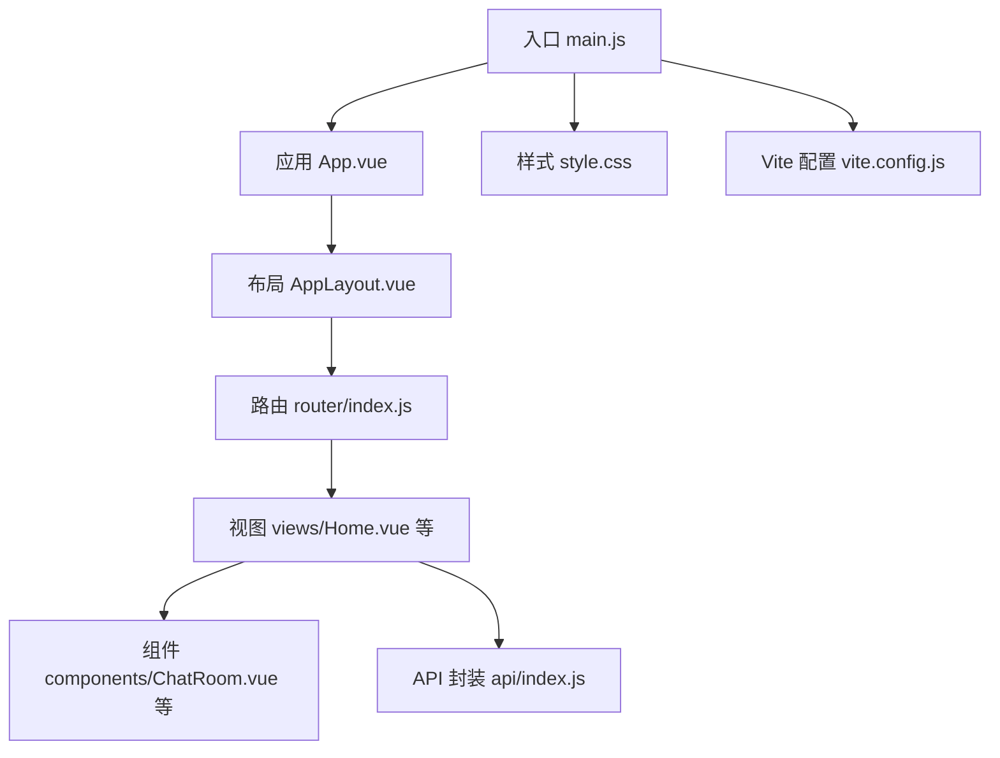
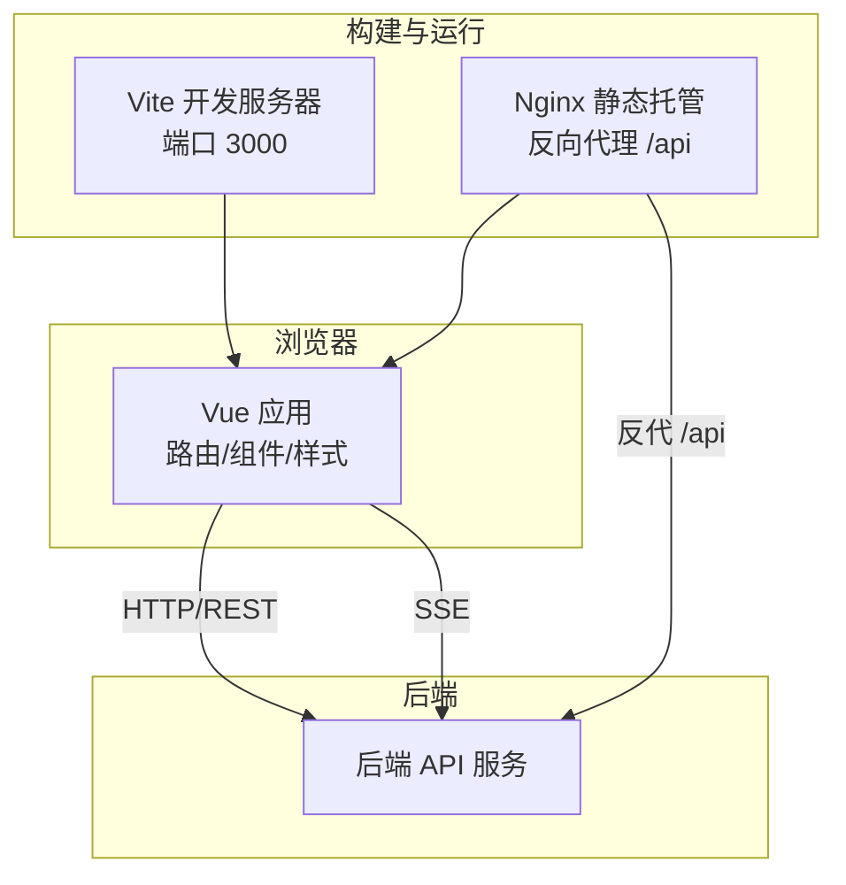
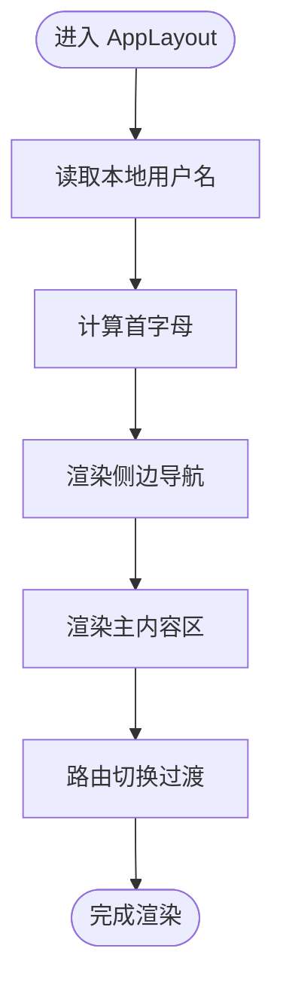
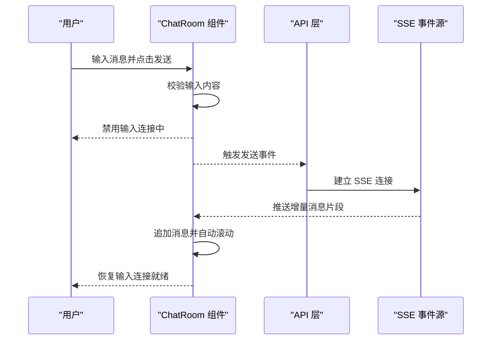
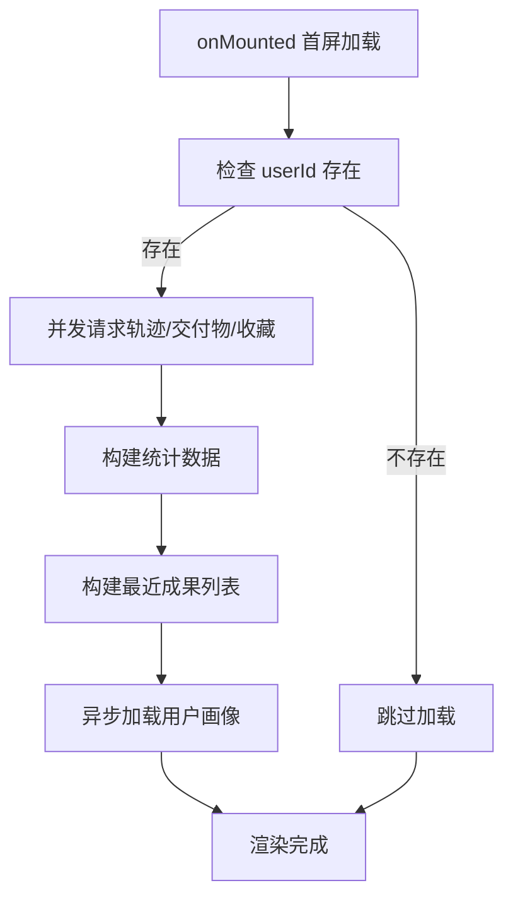
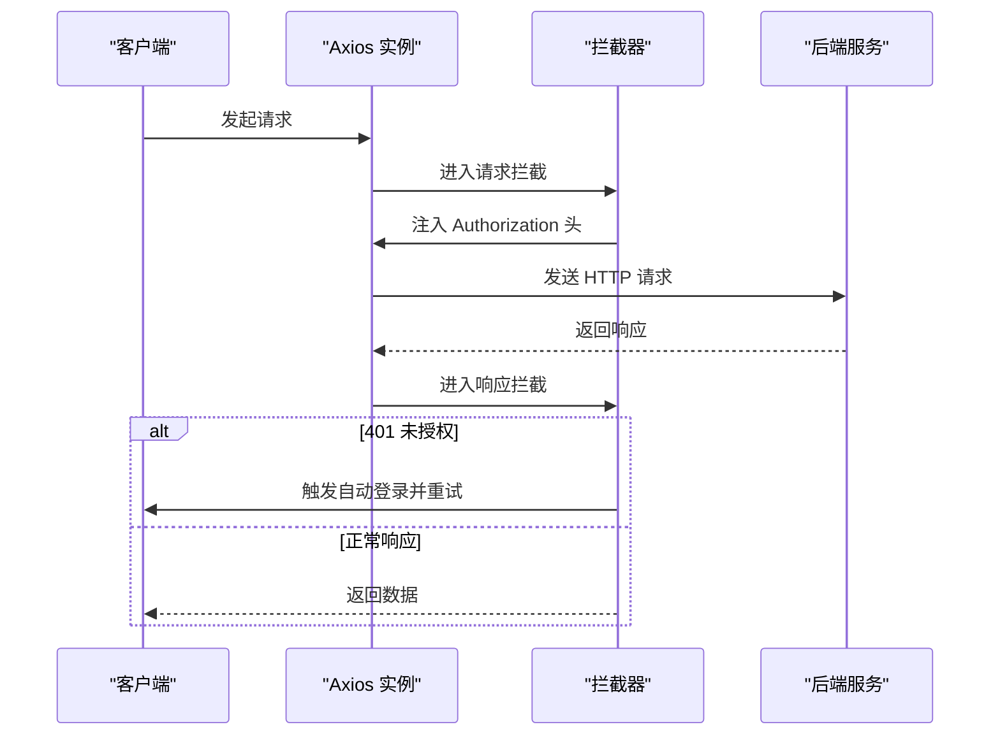
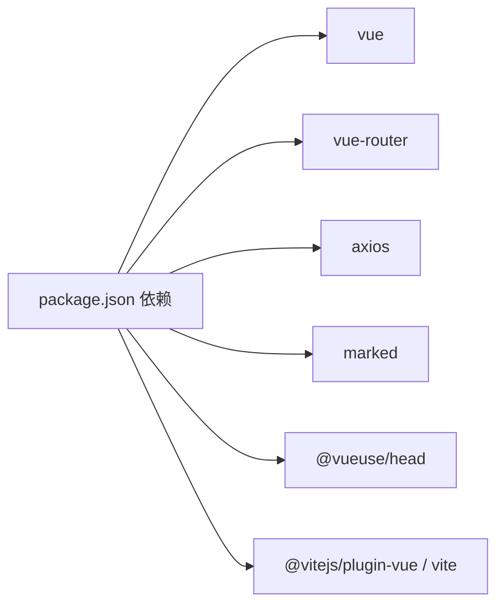

# 前端开发指南

<cite>
**本文引用的文件**
- [package.json](file://yu-ai-agent-frontend/package.json)
- [vite.config.js](file://yu-ai-agent-frontend/vite.config.js)
- [main.js](file://yu-ai-agent-frontend/src/main.js)
- [App.vue](file://yu-ai-agent-frontend/src/App.vue)
- [AppLayout.vue](file://yu-ai-agent-frontend/src/components/AppLayout.vue)
- [ChatRoom.vue](file://yu-ai-agent-frontend/src/components/ChatRoom.vue)
- [AiAvatarFallback.vue](file://yu-ai-agent-frontend/src/components/AiAvatarFallback.vue)
- [router/index.js](file://yu-ai-agent-frontend/src/router/index.js)
- [views/Home.vue](file://yu-ai-agent-frontend/src/views/Home.vue)
- [api/index.js](file://yu-ai-agent-frontend/src/api/index.js)
- [style.css](file://yu-ai-agent-frontend/src/style.css)
- [Dockerfile](file://yu-ai-agent-frontend/Dockerfile)
- [nginx.conf](file://yu-ai-agent-frontend/nginx.conf)
</cite>

## 目录
1. [引言](#引言)
2. [项目结构](#项目结构)
3. [核心组件](#核心组件)
4. [架构总览](#架构总览)
5. [详细组件分析](#详细组件分析)
6. [依赖关系分析](#依赖关系分析)
7. [性能考虑](#性能考虑)
8. [故障排查指南](#故障排查指南)
9. [结论](#结论)
10. [附录](#附录)

## 引言
本指南面向前端开发者，围绕 Vue 3 + Vite 的现代化前端架构，系统讲解项目结构、组件设计模式、状态管理策略、UI 组件库使用规范、样式定制与主题配置、路由与页面布局、用户体验设计原则、组件开发规范（Props 定义与事件处理）、前后端集成（API 与 SSE）、测试策略、构建优化与部署流程，以及性能优化与懒加载策略。目标是帮助团队建立一致的开发工作流与最佳实践。

## 项目结构
该前端工程采用“按功能域分层”的组织方式，核心目录如下：
- src/api：统一的后端 API 封装与 SSE 工具
- src/components：可复用的业务与展示组件
- src/router：路由定义与导航守卫
- src/views：页面级视图组件
- src/assets：静态资源（如图标、图片）
- src/style.css：全局设计令牌与基础样式
- public：公共资源（如 favicon、index.html）

图表来源
- [main.js:1-13](file://yu-ai-agent-frontend/src/main.js#L1-L13)
- [App.vue:1-8](file://yu-ai-agent-frontend/src/App.vue#L1-L8)
- [AppLayout.vue:1-180](file://yu-ai-agent-frontend/src/components/AppLayout.vue#L1-L180)
- [router/index.js:1-84](file://yu-ai-agent-frontend/src/router/index.js#L1-L84)
- [views/Home.vue:1-340](file://yu-ai-agent-frontend/src/views/Home.vue#L1-L340)
- [components/ChatRoom.vue:1-392](file://yu-ai-agent-frontend/src/components/ChatRoom.vue#L1-L392)
- [api/index.js:1-210](file://yu-ai-agent-frontend/src/api/index.js#L1-L210)
- [style.css:1-90](file://yu-ai-agent-frontend/src/style.css#L1-L90)
- [vite.config.js:1-18](file://yu-ai-agent-frontend/vite.config.js#L1-L18)

章节来源
- [package.json:1-23](file://yu-ai-agent-frontend/package.json#L1-L23)
- [vite.config.js:1-18](file://yu-ai-agent-frontend/vite.config.js#L1-L18)
- [main.js:1-13](file://yu-ai-agent-frontend/src/main.js#L1-L13)
- [App.vue:1-8](file://yu-ai-agent-frontend/src/App.vue#L1-L8)
- [router/index.js:1-84](file://yu-ai-agent-frontend/src/router/index.js#L1-L84)

## 核心组件
- 应用入口与插件注册：创建应用实例、挂载路由与 Head 管理，引入全局样式。
- 布局组件：侧边导航、主内容区与过渡动画，支持活动态高亮与用户信息展示。
- 视图组件：首页工作台聚合能力、统计数据与画像展示；聊天视图承载消息流与输入交互。
- API 层：统一 Axios 实例、请求/响应拦截器、SSE 连接封装、各类业务接口导出。
- 全局样式：设计令牌集中定义，支持暗色侧栏、玻璃态、点阵背景等视觉元素。

章节来源
- [main.js:1-13](file://yu-ai-agent-frontend/src/main.js#L1-L13)
- [AppLayout.vue:1-180](file://yu-ai-agent-frontend/src/components/AppLayout.vue#L1-L180)
- [views/Home.vue:1-340](file://yu-ai-agent-frontend/src/views/Home.vue#L1-L340)
- [api/index.js:1-210](file://yu-ai-agent-frontend/src/api/index.js#L1-L210)
- [style.css:1-90](file://yu-ai-agent-frontend/src/style.css#L1-L90)

## 架构总览
前端采用“单页应用 + 路由懒加载 + 组件化”的架构，结合 Axios 与 EventSource 实现与后端的 REST 与 SSE 通信。构建工具使用 Vite，生产环境通过 Nginx 提供静态托管与反向代理。

图表来源
- [vite.config.js:13-17](file://yu-ai-agent-frontend/vite.config.js#L13-L17)
- [nginx.conf:14-35](file://yu-ai-agent-frontend/nginx.conf#L14-L35)
- [api/index.js:69-76](file://yu-ai-agent-frontend/src/api/index.js#L69-L76)

## 详细组件分析

### 布局与导航（AppLayout）
- 功能要点
  - 侧边栏：主菜单与数据菜单分组，支持活动态高亮与图标样式。
  - 主区域：路由视图容器，配合淡入淡出过渡。
  - 用户信息：从本地存储读取用户名并计算首字母头像。
- 设计模式
  - 使用计算属性动态生成用户初始字符，减少重复渲染。
  - 使用路由守卫设置页面标题，提升 SEO 与可访问性。
- 样式与主题
  - 使用 CSS 变量统一主题色、圆角、阴影与玻璃态效果。
  - 侧栏采用深色主题变量，支持悬停与激活态颜色。

图表来源
- [AppLayout.vue:67-92](file://yu-ai-agent-frontend/src/components/AppLayout.vue#L67-L92)
- [router/index.js:78-81](file://yu-ai-agent-frontend/src/router/index.js#L78-L81)

章节来源
- [AppLayout.vue:1-180](file://yu-ai-agent-frontend/src/components/AppLayout.vue#L1-L180)
- [router/index.js:1-84](file://yu-ai-agent-frontend/src/router/index.js#L1-L84)

### 聊天组件（ChatRoom）
- 功能要点
  - 消息渲染：区分用户与 AI 消息，AI 气泡支持“正在输入”指示。
  - 输入交互：文本域支持多行与回车发送，禁用状态下不可提交。
  - 自动滚动：监听消息长度与内容变化，确保最新消息可见。
  - Props 与事件：接收消息数组、连接状态与 AI 类型，向上派发发送事件。
- 设计模式
  - 使用 watch 监听消息变化，结合 nextTick 精准滚动。
  - 计算属性根据 aiType 切换头像资源，便于扩展不同角色。
- 样式与主题
  - 用户消息靠右、AI 消息靠左，统一圆角气泡与时间戳样式。
  - 响应式适配移动端输入框高度与字体大小。

图表来源
- [ChatRoom.vue:55-120](file://yu-ai-agent-frontend/src/components/ChatRoom.vue#L55-L120)
- [api/index.js:69-112](file://yu-ai-agent-frontend/src/api/index.js#L69-L112)

章节来源
- [ChatRoom.vue:1-392](file://yu-ai-agent-frontend/src/components/ChatRoom.vue#L1-L392)
- [AiAvatarFallback.vue:1-35](file://yu-ai-agent-frontend/src/components/AiAvatarFallback.vue#L1-L35)

### 首页工作台（Home）
- 功能要点
  - 快速输入：回车触发跳转至职业顾问聊天页。
  - 能力卡片：网格布局展示不同能力入口，点击跳转对应聊天页。
  - 最近成果：基于轨迹数据生成成果项，显示状态与时间。
  - 统计数据：会话数、交付物数、收藏数。
  - 用户画像：从后端拉取并解析标签，展示个性化信息。
- 数据流
  - 首屏并发请求：轨迹、交付物、收藏列表，Promise.all 并行加载。
  - 时间格式化：根据相对时间规则展示“刚刚/分钟/小时前”。

图表来源
- [views/Home.vue:95-182](file://yu-ai-agent-frontend/src/views/Home.vue#L95-L182)

章节来源
- [views/Home.vue:1-340](file://yu-ai-agent-frontend/src/views/Home.vue#L1-L340)

### 路由与页面布局
- 路由策略
  - 使用 history 模式与 beforeEach 设置页面标题。
  - 页面组件采用动态导入实现懒加载，降低首屏体积。
- 页面布局
  - AppLayout 作为全局布局，内部通过 router-view + 过渡动画承载各视图。
- 导航设计
  - 主菜单与数据菜单分组，支持路径前缀匹配的活动态高亮。

章节来源
- [router/index.js:1-84](file://yu-ai-agent-frontend/src/router/index.js#L1-L84)
- [AppLayout.vue:1-180](file://yu-ai-agent-frontend/src/components/AppLayout.vue#L1-L180)

### API 与 SSE 集成
- Axios 配置
  - 基础路径根据环境切换，统一超时时间。
  - 请求拦截：自动注入 Authorization 头。
  - 响应拦截：401 自动登录并重试排队请求，避免重复刷新。
- SSE 封装
  - connectSSE：拼接查询参数并创建 EventSource。
  - 聊天接口：AI 聊天、Orchestrator 智能路由、Manus 超级智能体。
  - 会话与轨迹：创建、列表、删除、重命名、归档、恢复、搜索、分页查询。
  - 文档与画像：上传、查看与清空。
  - 导出与用量：导出数据、用量统计。
- Token 传递
  - SSE 不支持自定义头部，通过 URL 参数传递 token。

图表来源
- [api/index.js:7-67](file://yu-ai-agent-frontend/src/api/index.js#L7-L67)

章节来源
- [api/index.js:1-210](file://yu-ai-agent-frontend/src/api/index.js#L1-L210)

### 样式与主题配置
- 设计令牌
  - 使用 CSS 变量集中管理背景、表面、边框、文字、主色与辅助色、圆角、阴影、字体与玻璃态等。
- 布局与视觉
  - 侧栏深色主题变量，主内容区渐变背景与点阵网格。
  - 组件内样式使用 scoped，避免全局污染。
- 响应式
  - 在组件与工作台视图中均提供移动端断点适配。

章节来源
- [style.css:1-90](file://yu-ai-agent-frontend/src/style.css#L1-L90)
- [AppLayout.vue:94-179](file://yu-ai-agent-frontend/src/components/AppLayout.vue#L94-L179)
- [views/Home.vue:334-339](file://yu-ai-agent-frontend/src/views/Home.vue#L334-L339)

## 依赖关系分析
- 运行时依赖
  - Vue 3、Vue Router、Axios、marked、@vueuse/head。
- 开发依赖
  - @vitejs/plugin-vue、vite。
- 构建与部署
  - Vite 生产构建输出至 dist，Nginx 托管静态资源并反向代理 /api。

图表来源
- [package.json:11-21](file://yu-ai-agent-frontend/package.json#L11-L21)

章节来源
- [package.json:1-23](file://yu-ai-agent-frontend/package.json#L1-L23)
- [vite.config.js:1-18](file://yu-ai-agent-frontend/vite.config.js#L1-L18)
- [Dockerfile:1-17](file://yu-ai-agent-frontend/Dockerfile#L1-L17)
- [nginx.conf:14-35](file://yu-ai-agent-frontend/nginx.conf#L14-L35)

## 性能考虑
- 代码分割与懒加载
  - 路由组件动态导入，减少首屏 JS 体积。
  - 首页并发请求使用 Promise.all，缩短首屏等待。
- 构建优化
  - Vite 默认启用压缩与预构建依赖；生产构建自动进行资源压缩与哈希命名。
- 运行时优化
  - 组件内 watch 仅监听必要字段，避免全量重渲染。
  - 消息列表自动滚动使用 nextTick，保证 DOM 更新后再滚动。
- 缓存与静态资源
  - Nginx 对静态资源设置长缓存与缓存头，SSE 关闭代理缓冲以保证实时性。

章节来源
- [router/index.js:7-70](file://yu-ai-agent-frontend/src/router/index.js#L7-L70)
- [views/Home.vue:136-182](file://yu-ai-agent-frontend/src/views/Home.vue#L136-L182)
- [ChatRoom.vue:108-119](file://yu-ai-agent-frontend/src/components/ChatRoom.vue#L108-L119)
- [nginx.conf:37-42](file://yu-ai-agent-frontend/nginx.conf#L37-L42)

## 故障排查指南
- 401 未授权与自动重试
  - 当响应拦截器检测到 401 且非登录接口时，会自动清除无效 token 并触发登录，随后重试排队中的请求。
- SSE 连接问题
  - 确认后端 SSE 地址与查询参数正确；Nginx 已关闭缓冲与缓存，确保事件持续推送。
- 路由 404
  - Nginx 已配置 try_files $uri $uri/ /index.html，确保 SPA 路由正常工作。
- 本地开发跨域
  - Vite 服务器开启 CORS，端口 3000；生产环境通过 Nginx 反代解决跨域。

章节来源
- [api/index.js:19-67](file://yu-ai-agent-frontend/src/api/index.js#L19-L67)
- [nginx.conf:8-12](file://yu-ai-agent-frontend/nginx.conf#L8-L12)
- [vite.config.js:13-16](file://yu-ai-agent-frontend/vite.config.js#L13-L16)

## 结论
本项目以 Vue 3 + Vite 为基础，结合 Axios 与 EventSource 实现 REST 与实时通信，采用组件化与路由懒加载策略，兼顾性能与可维护性。通过统一的 API 封装、设计令牌与布局组件，形成一致的开发体验与视觉语言。建议在后续迭代中补充单元测试与 E2E 测试，完善组件文档与变更日志，持续优化首屏性能与可访问性。

## 附录

### 组件开发规范（Props 与事件）
- Props
  - 明确类型、默认值与必填性；对数组与对象使用工厂函数提供默认值。
  - 使用 computed 依据 props 派生派生状态，避免在模板中直接操作 props。
- 事件
  - 使用 defineEmits 声明事件名与参数，保持事件命名语义化。
  - 在交互层触发事件，上层组件负责状态更新与副作用。

章节来源
- [ChatRoom.vue:59-74](file://yu-ai-agent-frontend/src/components/ChatRoom.vue#L59-L74)

### 前端测试策略（建议）
- 单元测试
  - 使用 Vitest + @vue/test-utils 测试组件逻辑与行为。
- 集成测试
  - 使用 Playwright/Cypress 进行端到端测试，覆盖关键流程（登录、聊天、导出）。
- 质量门禁
  - 在 CI 中执行 lint、类型检查与测试，失败阻断合并。

### 构建与部署流程
- 本地开发
  - npm run dev 启动 Vite 开发服务器（端口 3000）。
- 本地预览
  - npm run preview 启动静态预览服务器。
- 生产构建
  - npm run build 输出至 dist。
- 容器化部署
  - 使用 Dockerfile 构建镜像，Nginx 托管 dist 并反代 /api。

章节来源
- [package.json:6-10](file://yu-ai-agent-frontend/package.json#L6-L10)
- [Dockerfile:1-17](file://yu-ai-agent-frontend/Dockerfile#L1-L17)
- [nginx.conf:14-35](file://yu-ai-agent-frontend/nginx.conf#L14-L35)