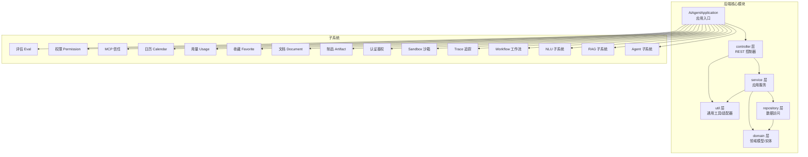
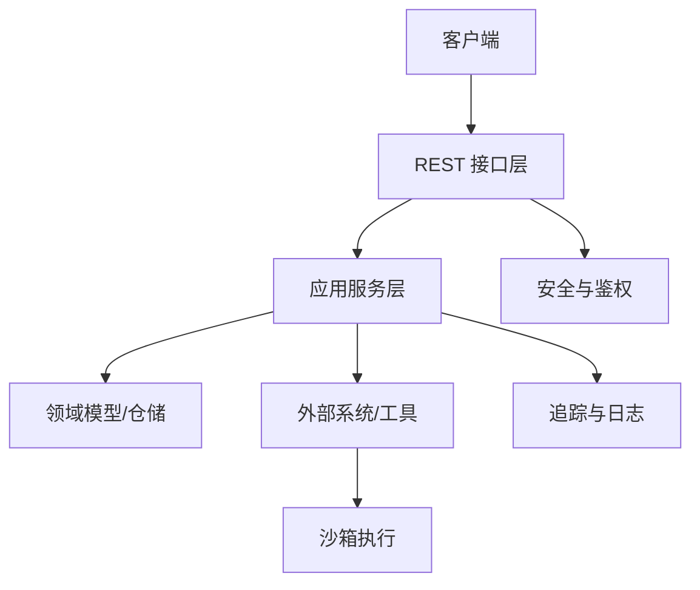
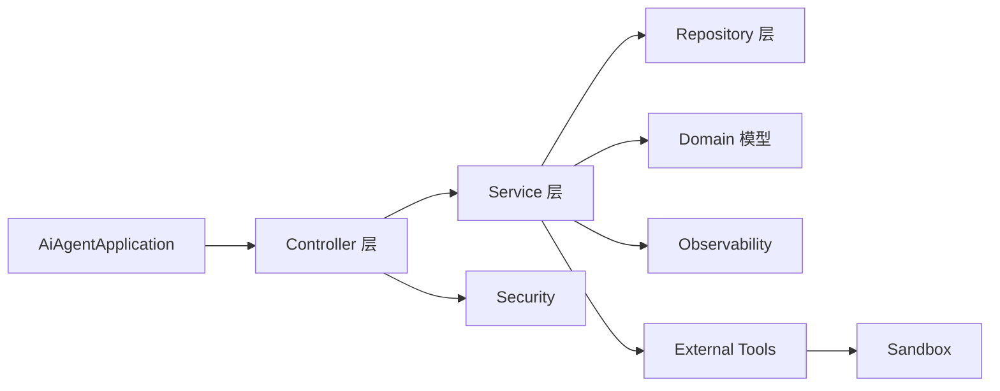

# 代码规范与最佳实践

<cite>
**本文引用的文件**
- [pom.xml](file://pom.xml)
- [AiAgentApplication.java](file://src/main/java/com/yupi/yuaiagent/AiAgentApplication.java)
- [AccessDecisionService.java](file://src/main/java/com/yupi/yuaiagent/access/AccessDecisionService.java)
- [AgentRunner.java](file://src/main/java/com/yupi/yuaiagent/agent/AgentRunner.java)
- [BaseAgent.java](file://src/main/java/com/yupi/yuaiagent/agent/BaseAgent.java)
- [ConsultationAgent.java](file://src/main/java/com/yupi/yuaiagent/agent/ConsultationAgent.java)
- [GlobalExceptionHandler.java](file://src/main/java/com/yupi/yuaiagent/exception/GlobalExceptionHandler.java)
- [BusinessException.java](file://src/main/java/com/yupi/yuaiagent/exception/BusinessException.java)
- [application.yml](file://src/main/resources/application.yml)
- [application-prod.yml](file://src/main/resources/application-prod.yml)
- [AiChatAgent.java](file://src/main/java/com/yupi/yuaiagent/app/AiChatAgent.java)
- [ArtifactController.java](file://src/main/java/com/yupi/yuaiagent/controller/ArtifactController.java)
- [HealthController.java](file://src/main/java/com/yupi/yuaiagent/controller/HealthController.java)
- [SessionController.java](file://src/main/java/com/yupi/yuaiagent/controller/SessionController.java)
- [TraceController.java](file://src/main/java/com/yupi/yuaiagent/controller/TraceController.java)
- [QualityGuardAgent.java](file://src/main/java/com/yupi/yuaiagent/quality/QualityGuardAgent.java)
- [QualityReview.java](file://src/main/java/com/yupi/yuaiagent/quality/QualityReview.java)
- [WorkflowRuntime.java](file://src/main/java/com/yupi/yuaiagent/workflow/runtime/WorkflowRuntime.java)
- [WorkflowInstance.java](file://src/main/java/com/yupi/yuaiagent/workflow/runtime/WorkflowInstance.java)
- [WorkflowTemplate.java](file://src/main/java/com/yupi/yuaiagent/workflow/WorkflowTemplate.java)
- [WorkflowRegistry.java](file://src/main/java/com/yupi/yuaiagent/workflow/WorkflowRegistry.java)
- [WorkflowMatcher.java](file://src/main/java/com/yupi/yuaiagent/workflow/WorkflowMatcher.java)
- [WorkflowNode.java](file://src/main/java/com/yupi/yuaiagent/workflow/node/WorkflowNode.java)
- [AgentNode.java](file://src/main/java/com/yupi/yuaiagent/workflow/node/AgentNode.java)
- [ApprovalNode.java](file://src/main/java/com/yupi/yuaiagent/workflow/node/ApprovalNode.java)
- [ConditionNode.java](file://src/main/java/com/yupi/yuaiagent/workflow/node/ConditionNode.java)
- [LoopNode.java](file://src/main/java/com/yupi/yuaiagent/workflow/node/LoopNode.java)
- [ParallelNode.java](file://src/main/java/com/yupi/yuaiagent/workflow/node/ParallelNode.java)
- [ToolNode.java](file://src/main/java/com/yupi/yuaiagent/workflow/node/ToolNode.java)
- [DockerSandbox.java](file://src/main/java/com/yupi/yuaiagent/sandbox/DockerSandbox.java)
- [LocalProcessSandbox.java](file://src/main/java/com/yupi/yuaiagent/sandbox/LocalProcessSandbox.java)
- [ToolSandbox.java](file://src/main/java/com/yupi/yuaiagent/sandbox/ToolSandbox.java)
- [FileOperationTool.java](file://src/main/java/com/yupi/yuaiagent/tools/FileOperationTool.java)
- [PDFGenerationTool.java](file://src/main/java/com/yupi/yuaiagent/tools/PDFGenerationTool.java)
- [WebScrapingTool.java](file://src/main/java/com/yupi/yuaiagent/tools/WebScrapingTool.java)
- [WebSearchTool.java](file://src/main/java/com/yupi/yuaiagent/tools/WebSearchTool.java)
- [TerminalOperationTool.java](file://src/main/java/com/yupi/yuaiagent/tools/TerminalOperationTool.java)
- [ResourceDownloadTool.java](file://src/main/java/com/yupi/yuaiagent/tools/ResourceDownloadTool.java)
- [TerminateTool.java](file://src/main/java/com/yupi/yuaiagent/tools/TerminateTool.java)
- [ChatSearchService.java](file://src/main/java/com/yupi/yuaiagent/search/ChatSearchService.java)
- [ChatMemoryManager.java](file://src/main/java/com/yupi/yuaiagent/chatmemory/ChatMemoryManager.java)
- [MemoryCompressor.java](file://src/main/java/com/yupi/yuaiagent/chatmemory/MemoryCompressor.java)
- [TokenCompressionStrategy.java](file://src/main/java/com/yupi/yuaiagent/chatmemory/TokenCompressionStrategy.java)
- [TurnCompressionStrategy.java](file://src/main/java/com/yupi/yuaiagent/chatmemory/TurnCompressionStrategy.java)
- [FileBasedChatMemory.java](file://src/main/java/com/yupi/yuaiagent/chatmemory/FileBasedChatMemory.java)
- [TraceRecorder.java](file://src/main/java/com/yupi/yuaiagent/trace/TraceRecorder.java)
- [TraceContext.java](file://src/main/java/com/yupi/yuaiagent/trace/TraceContext.java)
- [ExecutionTrace.java](file://src/main/java/com/yupi/yuaiagent/trace/model/ExecutionTrace.java)
- [TraceSpan.java](file://src/main/java/com/yupi/yuaiagent/trace/model/TraceSpan.java)
- [TraceRepository.java](file://src/main/java/com/yupi/yuaiagent/trace/TraceRepository.java)
- [TraceStreamPublisher.java](file://src/main/java/com/yupi/yuaiagent/trace/TraceStreamPublisher.java)
- [AiChatDocumentLoader.java](file://src/main/java/com/yupi/yuaiagent/rag/AiChatDocumentLoader.java)
- [MultiQueryRetriever.java](file://src/main/java/com/yupi/yuaiagent/rag/MultiQueryRetriever.java)
- [QueryRewriter.java](file://src/main/java/com/yupi/yuaiagent/rag/QueryRewriter.java)
- [AiChatRagCloudAdvisorConfig.java](file://src/main/java/com/yupi/yuaiagent/rag/AiChatRagCloudAdvisorConfig.java)
- [AiChatVectorStoreConfig.java](file://src/main/java/com/yupi/yuaiagent/rag/AiChatVectorStoreConfig.java)
- [PgVectorVectorStoreConfig.java](file://src/main/java/com/yupi/yuaiagent/rag/PgVectorVectorStoreConfig.java)
- [AiChatRagCustomAdvisorFactory.java](file://src/main/java/com/yupi/yuaiagent/rag/AiChatRagCustomAdvisorFactory.java)
- [AiChatContextualQueryAugmenterFactory.java](file://src/main/java/com/yupi/yuaiagent/rag/AiChatContextualQueryAugmenterFactory.java)
- [MyKeywordEnricher.java](file://src/main/java/com/yupi/yuaiagent/rag/MyKeywordEnricher.java)
- [MyTokenTextSplitter.java](file://src/main/java/com/yupi/yuaiagent/rag/MyTokenTextSplitter.java)
- [NluPipeline.java](file://src/main/java/com/yupi/yuaiagent/nlu/NluPipeline.java)
- [UnifiedNluExtractor.java](file://src/main/java/com/yupi/yuaiagent/nlu/UnifiedNluExtractor.java)
- [IntentRequirementRegistry.java](file://src/main/java/com/yupi/yuaiagent/nlu/IntentRequirementRegistry.java)
- [IntentReranker.java](file://src/main/java/com/yupi/yuaiagent/nlu/IntentReranker.java)
- [ConversationStateStore.java](file://src/main/java/com/yupi/yuaiagent/nlu/ConversationStateStore.java)
- [InMemoryConversationStateStore.java](file://src/main/java/com/yupi/yuaiagent/nlu/InMemoryConversationStateStore.java)
- [RouteTemplate.java](file://src/main/java/com/yupi/yuaiagent/nlu/RouteTemplate.java)
- [RouteHint.java](file://src/main/java/com/yupi/yuaiagent/nlu/RouteHint.java)
- [AliasResolver.java](file://src/main/java/com/yupi/yuaiagent/nlu/AliasResolver.java)
- [IntentAmbiguityDetector.java](file://src/main/java/com/yupi/yuaiagent/nlu/IntentAmbiguityDetector.java)
- [ContextShiftDetector.java](file://src/main/java/com/yupi/yuaiagent/nlu/ContextShiftDetector.java)
- [RuleContextShiftDetector.java](file://src/main/java/com/yupi/yuaiagent/nlu/RuleContextShiftDetector.java)
- [ConversationState.java](file://src/main/java/com/yupi/yuaiagent/nlu/ConversationState.java)
- [NluContext.java](file://src/main/java/com/yupi/yuaiagent/nlu/NluContext.java)
- [NluIntent.java](file://src/main/java/com/yupi/yuaiagent/nlu/NluIntent.java)
- [AgentConfig.java](file://src/main/java/com/yupi/yuaiagent/config/AgentConfig.java)
- [CompressionConfig.java](file://src/main/java/com/yupi/yuaiagent/config/CompressionConfig.java)
- [CorsConfig.java](file://src/main/java/com/yupi/yuaiagent/config/CorsConfig.java)
- [FollowUpTemplateConfig.java](file://src/main/java/com/yupi/yuaiagent/config/FollowUpTemplateConfig.java)
- [CalendarConfig.java](file://src/main/java/com/yupi/yuaiagent/config/CalendarConfig.java)
- [TokenBudget.java](file://src/main/java/com/yupi/yuaiagent/budget/TokenBudget.java)
- [TokenUsage.java](file://src/main/java/com/yupi/yuaiagent/budget/TokenUsage.java)
- [TokenUsageTracker.java](file://src/main/java/com/yupi/yuaiagent/budget/TokenUsageTracker.java)
- [ProfileController.java](file://src/main/java/com/yupi/yuaiagent/controller/ProfileController.java)
- [UserProfileService.java](file://src/main/java/com/yupi/yuaiagent/profile/UserProfileService.java)
- [UserProfileRepository.java](file://src/main/java/com/yupi/yuaiagent/profile/UserProfileRepository.java)
- [UserProfileExtractor.java](file://src/main/java/com/yupi/yuaiagent/profile/UserProfileExtractor.java)
- [ProfilePromptBuilder.java](file://src/main/java/com/yupi/yuaiagent/profile/ProfilePromptBuilder.java)
- [UserProfile.java](file://src/main/java/com/yupi/yuaiagent/profile/model/UserProfile.java)
- [CommunicationPreference.java](file://src/main/java/com/yupi/yuaiagent/profile/model/CommunicationPreference.java)
- [DocumentController.java](file://src/main/java/com/yupi/yuaiagent/controller/DocumentController.java)
- [DocumentAppService.java](file://src/main/java/com/yupi/yuaiagent/service/DocumentAppService.java)
- [DocumentMeta.java](file://src/main/java/com/yupi/yuaiagent/document/DocumentMeta.java)
- [DocumentMetadataManager.java](file://src/main/java/com/yupi/yuaiagent/document/DocumentMetadataManager.java)
- [DocumentStatus.java](file://src/main/java/com/yupi/yuaiagent/document/DocumentStatus.java)
- [ExportController.java](file://src/main/java/com/yupi/yuaiagent/controller/ExportController.java)
- [ExportAppService.java](file://src/main/java/com/yupi/yuaiagent/service/ExportAppService.java)
- [DataExportService.java](file://src/main/java/com/yupi/yuaiagent/export/DataExportService.java)
- [DataImportService.java](file://src/main/java/com/yupi/yuaiagent/export/DataImportService.java)
- [FavoriteController.java](file://src/main/java/com/yupi/yuaiagent/controller/FavoriteController.java)
- [FavoriteAppService.java](file://src/main/java/com/yupi/yuaiagent/service/FavoriteAppService.java)
- [Favorite.java](file://src/main/java/com/yupi/yuaiagent/favorite/Favorite.java)
- [FavoriteRepository.java](file://src/main/java/com/yupi/yuaiagent/favorite/FavoriteRepository.java)
- [UsageController.java](file://src/main/java/com/yupi/yuaiagent/controller/UsageController.java)
- [UsageTracker.java](file://src/main/java/com/yupi/yuaiagent/usage/UsageTracker.java)
- [UsageEvent.java](file://src/main/java/com/yupi/yuaiagent/usage/UsageEvent.java)
- [UsageEventType.java](file://src/main/java/com/yupi/yuaiagent/usage/UsageEventType.java)
- [SessionAppService.java](file://src/main/java/com/yupi/yuaiagent/service/SessionAppService.java)
- [SessionManager.java](file://src/main/java/com/yupi/yuaiagent/session/SessionManager.java)
- [SessionStatus.java](file://src/main/java/com/yupi/yuaiagent/session/SessionStatus.java)
- [OrchestratorAppService.java](file://src/main/java/com/yupi/yuaiagent/service/OrchestratorAppService.java)
- [OrchestratorAgent.java](file://src/main/java/com/yupi/yuaiagent/agent/OrchestratorAgent.java)
- [ResultAggregator.java](file://src/main/java/com/yupi/yuaiagent/agent/ResultAggregator.java)
- [TaskExecutor.java](file://src/main/java/com/yupi/yuaiagent/agent/TaskExecutor.java)
- [ExecutionResult.java](file://src/main/java/com/yupi/yuaiagent/agent/task/ExecutionResult.java)
- [FailurePolicy.java](file://src/main/java/com/yupi/yuaiagent/agent/task/FailurePolicy.java)
- [TaskStatus.java](file://src/main/java/com/yupi/yuaiagent/agent/task/TaskStatus.java)
- [AgentIntent.java](file://src/main/java/com/yupi/yuaiagent/agent/AgentIntent.java)
- [AgentState.java](file://src/main/java/com/yupi/yuaiagent/agent/model/AgentState.java)
- [ProductionContext.java](file://src/main/java/com/yupi/yuaiagent/agent/model/ProductionContext.java)
- [ProductionResult.java](file://src/main/java/com/yupi/yuaiagent/agent/model/ProductionResult.java)
- [CoreInformation.java](file://src/main/java/com/yupi/yuaiagent/agent/model/CoreInformation.java)
- [CoreInfoType.java](file://src/main/java/com/yupi/yuaiagent/agent/model/CoreInfoType.java)
- [FollowUpQuestion.java](file://src/main/java/com/yupi/yuaiagent/agent/model/FollowUpQuestion.java)
- [Appointment.java](file://src/main/java/com/yupi/yuaiagent/agent/model/Appointment.java)
- [AnalysisReport.java](file://src/main/java/com/yupi/yuaiagent/agent/data/AnalysisReport.java)
- [AnalysisSource.java](file://src/main/java/com/yupi/yuaiagent/agent/data/AnalysisSource.java)
- [DataAnalystAgent.java](file://src/main/java/com/yupi/yuaiagent/agent/data/DataAnalystAgent.java)
- [DataEmployeeAgent.java](file://src/main/java/com/yupi/yuaiagent/agent/data/DataEmployeeAgent.java)
- [LearningResourceRecommenderAgent.java](file://src/main/java/com/yupi/yuaiagent/agent/data/LearningResourceRecommenderAgent.java)
- [ProfileCuratorAgent.java](file://src/main/java/com/yupi/yuaiagent/agent/data/ProfileCuratorAgent.java)
- [PromotionPlannerAgent.java](file://src/main/java/com/yupi/yuaiagent/agent/data/PromotionPlannerAgent.java)
- [GeneralCareerAgent.java](file://src/main/java/com/yupi/yuaiagent/agent/GeneralCareerAgent.java)
- [NegotiationAgent.java](file://src/main/java/com/yupi/yuaiagent/agent/NegotiationAgent.java)
- [EscapeAgent.java](file://src/main/java/com/yupi/yuaiagent/agent/EscortAgent.java)
- [ResumeAgent.java](file://src/main/java/com/yupi/yuaiagent/agent/ResumeAgent.java)
- [YuManus.java](file://src/main/java/com/yupi/yuaiagent/agent/YuManus.java)
- [CalendarService.java](file://src/main/java/com/yupi/yuaiagent/calendar/CalendarService.java)
- [CalendarServiceFactory.java](file://src/main/java/com/yupi/yuaiagent/calendar/CalendarServiceFactory.java)
- [DingTalkCalendarService.java](file://src/main/java/com/yupi/yuaiagent/calendar/DingTalkCalendarService.java)
- [FeishuCalendarService.java](file://src/main/java/com/yupi/yuaiagent/calendar/FeishuCalendarService.java)
- [CalendarEvent.java](file://src/main/java/com/yupi/yuaiagent/calendar/CalendarEvent.java)
- [McpTrustService.java](file://src/main/java/com/yupi/yuaiagent/mcp/McpTrustService.java)
- [McpTrustLevel.java](file://src/main/java/com/yupi/yuaiagent/mcp/McpTrustLevel.java)
- [McpServerProfile.java](file://src/main/java/com/yupi/yuaiagent/mcp/McpServerProfile.java)
- [AuthService.java](file://src/main/java/com/yupi/yuaiagent/auth/AuthService.java)
- [JwtUtil.java](file://src/main/java/com/yupi/yuaiagent/auth/JwtUtil.java)
- [PersistentChatMessage.java](file://src/main/java/com/yupi/yuaiagent/message/PersistentChatMessage.java)
- [PersistentMessageRepository.java](file://src/main/java/com/yupi/yuaiagent/message/PersistentMessageRepository.java)
- [ChatMemoryAdapter.java](file://src/main/java/com/yupi/yuaiagent/message/ChatMemoryAdapter.java)
- [MessageSource.java](file://src/main/java/com/yupi/yuaiagent/message/MessageSource.java)
- [ArtifactLifecycleManager.java](file://src/main/java/com/yupi/yuaiagent/artifact/ArtifactLifecycleManager.java)
- [ArtifactRepository.java](file://src/main/java/com/yupi/yuaiagent/artifact/ArtifactRepository.java)
- [ArtifactShelf.java](file://src/main/java/com/yupi/yuaiagent/artifact/ArtifactShelf.java)
- [Artifact.java](file://src/main/java/com/yupi/yuaiagent/artifact/model/Artifact.java)
- [ArtifactLifecycleEvent.java](file://src/main/java/com/yupi/yuaiagent/artifact/model/ArtifactLifecycleEvent.java)
- [ArtifactQuery.java](file://src/main/java/com/yupi/yuaiagent/artifact/model/ArtifactQuery.java)
- [ArtifactScope.java](file://src/main/java/com/yupi/yuaiagent/artifact/model/ArtifactScope.java)
- [ArtifactStatus.java](file://src/main/java/com/yupi/yuaiagent/artifact/model/ArtifactStatus.java)
- [ArtifactSummary.java](file://src/main/java/com/yupi/yuaiagent/artifact/model/ArtifactSummary.java)
- [SkillDefinition.java](file://src/main/java/com/yupi/yuaiagent/skill/SkillDefinition.java)
- [SkillExecutor.java](file://src/main/java/com/yupi/yuaiagent/skill/SkillExecutor.java)
- [SkillRegistry.java](file://src/main/java/com/yupi/yuaiagent/skill/SkillRegistry.java)
- [AgentPermissionService.java](file://src/main/java/com/yupi/yuaiagent/permission/AgentPermissionService.java)
- [AgentPermissionDeniedException.java](file://src/main/java/com/yupi/yuaiagent/permission/AgentPermissionDeniedException.java)
- [PermissionAuditLog.java](file://src/main/java/com/yupi/yuaiagent/permission/PermissionAuditLog.java)
- [PermissionProfileRegistry.java](file://src/main/java/com/yupi/yuaiagent/permission/PermissionProfileRegistry.java)
- [PermissionProfile.java](file://src/main/java/com/yupi/yuaiagent/permission/model/PermissionProfile.java)
- [Response.java](file://src/main/java/com/yupi/yuaiagent/common/Response.java)
- [Result.java](file://src/main/java/com/yupi/yuaiagent/common/Result.java)
- [ResultCode.java](file://src/main/java/com/yupi/yuaiagent/common/ResultCode.java)
- [InfoValidator.java](file://src/main/java/com/yupi/yuaiagent/validation/InfoValidator.java)
- [EventBusAdapter.java](file://src/main/java/com/yupi/yuaiagent/event/EventBusAdapter.java)
- [GovernanceEvent.java](file://src/main/java/com/yupi/yuaiagent/event/GovernanceEvent.java)
- [GovernanceEventListener.java](file://src/main/java/com/yupi/yuaiagent/event/GovernanceEventListener.java)
- [SandboxFactory.java](file://src/main/java/com/yupi/yuaiagent/sandbox/SandboxFactory.java)
- [ResourceLimits.java](file://src/main/java/com/yupi/yuaiagent/sandbox/ResourceLimits.java)
- [SandboxRequest.java](file://src/main/java/com/yupi/yuaiagent/sandbox/SandboxRequest.java)
- [SandboxResult.java](file://src/main/java/com/yupi/yuaiagent/sandbox/SandboxResult.java)
- [SandboxPolicy.java](file://src/main/java/com/yupi/yuaiagent/sandbox/SandboxPolicy.java)
- [ToolRegistration.java](file://src/main/java/com/yupi/yuaiagent/tools/ToolRegistration.java)
- [AgentRegistry.java](file://src/main/java/com/yupi/yuaiagent/registry/AgentRegistry.java)
- [InMemoryAgentRegistry.java](file://src/main/java/com/yupi/yuaiagent/registry/InMemoryAgentRegistry.java)
- [AgentDescriptor.java](file://src/main/java/com/yupi/yuaiagent/registry/AgentDescriptor.java)
- [ConversationContext.java](file://src/main/java/com/yupi/yuaiagent/context/ConversationContext.java)
- [ConversationContextBuilder.java](file://src/main/java/com/yupi/yuaiagent/context/ConversationContextBuilder.java)
- [RuntimeContext.java](file://src/main/java/com/yupi/yuaiagent/context/RuntimeContext.java)
- [FileConstant.java](file://src/main/java/com/yupi/yuaiagent/constant/FileConstant.java)
- [PromptRegistry.java](file://src/main/java/com/yupi/yuaiagent/prompt/PromptRegistry.java)
- [PromptVersion.java](file://src/main/java/com/yupi/yuaiagent/prompt/PromptVersion.java)
- [AccessDeniedEvent.java](file://src/main/java/com/yupi/yuaiagent/event/AccessDeniedEvent.java)
- [SandboxExecEvent.java](file://src/main/java/com/yupi/yuaiagent/event/SandboxExecEvent.java)
- [EvalCenter.java](file://src/main/java/com/yupi/yuaiagent/eval/EvalCenter.java)
- [EvalCase.java](file://src/main/java/com/yupi/yuaiagent/eval/EvalCase.java)
- [EvalReport.java](file://src/main/java/com/yupi/yuaiagent/eval/EvalReport.java)
- [TraceProperties.java](file://src/main/java/com/yupi/yuaiagent/trace/TraceProperties.java)
- [TraceRepository.java](file://src/main/java/com/yupi/yuaiagent/trace/TraceRepository.java)
- [TraceStreamPublisher.java](file://src/main/java/com/yupi/yuaiagent/trace/TraceStreamPublisher.java)
- [TraceConstants.java](file://src/main/java/com/yupi/yuaiagent/trace/model/TraceConstants.java)
- [TraceStatus.java](file://src/main/java/com/yupi/yuaiagent/trace/model/TraceStatus.java)
- [TraceStepStatus.java](file://src/main/java/com/yupi/yuaiagent/trace/model/TraceStepStatus.java)
- [TraceStepType.java](file://src/main/java/com/yupi/yuaiagent/trace/model/TraceStepType.java)
- [YuImageSearchMcpServerApplication.java](file://yu-image-search-mcp-server/src/main/java/com/yupi/yuimagesearchmcpserver/YuImageSearchMcpServerApplication.java)
- [ImageSearchTool.java](file://yu-image-search-mcp-server/src/main/java/com/yupi/yuimagesearchmcpserver/tools/ImageSearchTool.java)
- [README.md](file://README.md)
</cite>

## 目录
1. 引言
2. 项目结构
3. 核心组件
4. 架构总览
5. 详细组件分析
6. 依赖关系分析
7. 性能考虑
8. 故障排查指南
9. 结论
10. 附录

## 引言
本文件旨在为该Spring Boot多模块项目建立统一的代码规范与最佳实践，覆盖Java代码风格、命名约定、注释规范、文件组织原则；明确Spring Boot特定规范（包结构、类设计、接口定义）；提供代码审查检查清单与质量评估标准；给出性能优化、内存管理与安全编码建议；并规划Git工作流与分支管理策略，帮助团队协作与持续交付。

## 项目结构
该项目采用多模块Maven结构，核心后端模块为ai-agent-frontend（实际后端服务位于src/main/java），另有独立的MCP服务器模块yu-image-search-mcp-server。整体采用分层架构：controller -> service -> repository（部分领域模型与工具类直接在controller层或应用层使用），配合丰富的领域能力（Agent、RAG、NLU、Workflow、Trace、Sandbox等）。

图表来源
- [AiAgentApplication.java](file://src/main/java/com/yupi/yuaiagent/AiAgentApplication.java)
- [application.yml](file://src/main/resources/application.yml)

章节来源
- [pom.xml](file://pom.xml)
- [AiAgentApplication.java](file://src/main/java/com/yupi/yuaiagent/AiAgentApplication.java)
- [application.yml](file://src/main/resources/application.yml)

## 核心组件
- 应用入口与配置：应用入口类负责启动Spring Boot应用；application.yml提供全局配置示例，生产环境配置分离。
- 控制器层：提供REST接口，如健康检查、会话、追踪、制品、文档、导出、收藏、用量等。
- 服务层：封装业务逻辑，如会话管理、编排器应用服务、文档应用服务、导出应用服务等。
- 领域模型与仓库：如用户档案、收藏夹、用量事件、会话状态、工作流模板与实例等。
- 工具与适配器：消息持久化、聊天记忆压缩、查询增强与向量检索、日历服务抽象与实现等。
- 安全与鉴权：JWT工具、认证服务、全局异常处理、访问控制与投票机制。
- 可观测性与追踪：分布式追踪上下文、记录器、存储与流式发布。
- 沙箱与工具：容器沙箱、本地进程沙箱、工具注册与执行。
- 多模态与MCP：图像搜索MCP工具与服务端。

章节来源
- [AiAgentApplication.java](file://src/main/java/com/yupi/yuaiagent/AiAgentApplication.java)
- [application.yml](file://src/main/resources/application.yml)
- [application-prod.yml](file://src/main/resources/application-prod.yml)
- [HealthController.java](file://src/main/java/com/yupi/yuaiagent/controller/HealthController.java)
- [SessionController.java](file://src/main/java/com/yupi/yuaiagent/controller/SessionController.java)
- [TraceController.java](file://src/main/java/com/yupi/yuaiagent/controller/TraceController.java)
- [ArtifactController.java](file://src/main/java/com/yupi/yuaiagent/controller/ArtifactController.java)
- [DocumentController.java](file://src/main/java/com/yupi/yuaiagent/controller/DocumentController.java)
- [ExportController.java](file://src/main/java/com/yupi/yuaiagent/controller/ExportController.java)
- [FavoriteController.java](file://src/main/java/com/yupi/yuaiagent/controller/FavoriteController.java)
- [UsageController.java](file://src/main/java/com/yupi/yuaiagent/controller/UsageController.java)
- [ProfileController.java](file://src/main/java/com/yupi/yuaiagent/controller/ProfileController.java)
- [SessionAppService.java](file://src/main/java/com/yupi/yuaiagent/service/SessionAppService.java)
- [OrchestratorAppService.java](file://src/main/java/com/yupi/yuaiagent/service/OrchestratorAppService.java)
- [DocumentAppService.java](file://src/main/java/com/yupi/yuaiagent/service/DocumentAppService.java)
- [ExportAppService.java](file://src/main/java/com/yupi/yuaiagent/service/ExportAppService.java)
- [FavoriteAppService.java](file://src/main/java/com/yupi/yuaiagent/service/FavoriteAppService.java)
- [UserProfileService.java](file://src/main/java/com/yupi/yuaiagent/profile/UserProfileService.java)
- [UserProfileRepository.java](file://src/main/java/com/yupi/yuaiagent/profile/UserProfileRepository.java)
- [UsageTracker.java](file://src/main/java/com/yupi/yuaiagent/usage/UsageTracker.java)
- [SessionManager.java](file://src/main/java/com/yupi/yuaiagent/session/SessionManager.java)
- [SessionStatus.java](file://src/main/java/com/yupi/yuaiagent/session/SessionStatus.java)
- [ChatMemoryManager.java](file://src/main/java/com/yupi/yuaiagent/chatmemory/ChatMemoryManager.java)
- [MemoryCompressor.java](file://src/main/java/com/yupi/yuaiagent/chatmemory/MemoryCompressor.java)
- [TokenCompressionStrategy.java](file://src/main/java/com/yupi/yuaiagent/chatmemory/TokenCompressionStrategy.java)
- [TurnCompressionStrategy.java](file://src/main/java/com/yupi/yuaiagent/chatmemory/TurnCompressionStrategy.java)
- [FileBasedChatMemory.java](file://src/main/java/com/yupi/yuaiagent/chatmemory/FileBasedChatMemory.java)
- [TraceRecorder.java](file://src/main/java/com/yupi/yuaiagent/trace/TraceRecorder.java)
- [TraceContext.java](file://src/main/java/com/yupi/yuaiagent/trace/TraceContext.java)
- [TraceRepository.java](file://src/main/java/com/yupi/yuaiagent/trace/TraceRepository.java)
- [TraceStreamPublisher.java](file://src/main/java/com/yupi/yuaiagent/trace/TraceStreamPublisher.java)
- [DockerSandbox.java](file://src/main/java/com/yupi/yuaiagent/sandbox/DockerSandbox.java)
- [LocalProcessSandbox.java](file://src/main/java/com/yupi/yuaiagent/sandbox/LocalProcessSandbox.java)
- [ToolSandbox.java](file://src/main/java/com/yupi/yuaiagent/sandbox/ToolSandbox.java)
- [FileOperationTool.java](file://src/main/java/com/yupi/yuaiagent/tools/FileOperationTool.java)
- [PDFGenerationTool.java](file://src/main/java/com/yupi/yuaiagent/tools/PDFGenerationTool.java)
- [WebScrapingTool.java](file://src/main/java/com/yupi/yuaiagent/tools/WebScrapingTool.java)
- [WebSearchTool.java](file://src/main/java/com/yupi/yuaiagent/tools/WebSearchTool.java)
- [TerminalOperationTool.java](file://src/main/java/com/yupi/yuaiagent/tools/TerminalOperationTool.java)
- [ResourceDownloadTool.java](file://src/main/java/com/yupi/yuaiagent/tools/ResourceDownloadTool.java)
- [TerminateTool.java](file://src/main/java/com/yupi/yuaiagent/tools/TerminateTool.java)
- [ChatSearchService.java](file://src/main/java/com/yupi/yuaiagent/search/ChatSearchService.java)
- [AuthService.java](file://src/main/java/com/yupi/yuaiagent/auth/AuthService.java)
- [JwtUtil.java](file://src/main/java/com/yupi/yuaiagent/auth/JwtUtil.java)
- [GlobalExceptionHandler.java](file://src/main/java/com/yupi/yuaiagent/exception/GlobalExceptionHandler.java)
- [BusinessException.java](file://src/main/java/com/yupi/yuaiagent/exception/BusinessException.java)

## 架构总览
系统采用分层+领域驱动设计，控制器负责请求接入与响应封装，服务层承载业务编排与规则，仓库层对接数据源，领域模型表达业务概念。可观测性贯穿各子系统，安全通过鉴权与访问控制保障，工具与沙箱隔离外部资源执行风险。

图表来源
- [AiAgentApplication.java](file://src/main/java/com/yupi/yuaiagent/AiAgentApplication.java)
- [GlobalExceptionHandler.java](file://src/main/java/com/yupi/yuaiagent/exception/GlobalExceptionHandler.java)
- [TraceRecorder.java](file://src/main/java/com/yupi/yuaiagent/trace/TraceRecorder.java)

## 详细组件分析

### 包结构与命名规范
- 包层次：按功能域划分，如access、advisor、agent、app、artifact、auth、budget、calendar、chatmemory、common、config、constant、context、controller、demo、document、dto、eval、event、exception、export、favorite、mcp、message、nlu、permission、policy、profile、prompt、quality、rag、registry、repository、sandbox、search、service、session、skill、tools、trace、usage、validation、workflow等。
- 类命名：采用语义化驼峰命名，如AgentRunner、BaseAgent、ExecutionTrace、TraceRecorder、WorkflowRuntime、TokenUsageTracker、UserProfileService等。
- 接口与抽象：以Interface或抽象类形式提供扩展点，如AgentRunner、ToolSandbox、ConversationStateStore等。
- 命名约定要点：
  - 类名使用名词或复合名词短语，首字母大写。
  - 方法名使用动词短语，清晰表达意图。
  - 常量使用全大写+下划线分隔。
  - 包名全部小写，避免缩写。

章节来源
- [AccessDecisionService.java](file://src/main/java/com/yupi/yuaiagent/access/AccessDecisionService.java)
- [AgentRunner.java](file://src/main/java/com/yupi/yuaiagent/agent/AgentRunner.java)
- [BaseAgent.java](file://src/main/java/com/yupi/yuaiagent/agent/BaseAgent.java)
- [ExecutionTrace.java](file://src/main/java/com/yupi/yuaiagent/trace/model/ExecutionTrace.java)
- [TraceRecorder.java](file://src/main/java/com/yupi/yuaiagent/trace/TraceRecorder.java)
- [WorkflowRuntime.java](file://src/main/java/com/yupi/yuaiagent/workflow/runtime/WorkflowRuntime.java)
- [TokenUsageTracker.java](file://src/main/java/com/yupi/yuaiagent/budget/TokenUsageTracker.java)
- [UserProfileService.java](file://src/main/java/com/yupi/yuaiagent/profile/UserProfileService.java)

### 控制器层设计
- 职责：接收HTTP请求，参数校验，调用应用服务，封装统一响应。
- 统一响应：Response<Result>模式，结合ResultCode进行错误码标准化。
- 典型控制器：HealthController、SessionController、TraceController、ArtifactController、DocumentController、ExportController、FavoriteController、UsageController、ProfileController等。
- 设计要点：
  - 使用@RestController或@Controller + @ResponseBody组合。
  - 参数校验优先于业务逻辑，必要时引入@Valid与分组校验。
  - 错误处理集中在全局异常处理器，控制器保持薄层。

章节来源
- [HealthController.java](file://src/main/java/com/yupi/yuaiagent/controller/HealthController.java)
- [SessionController.java](file://src/main/java/com/yupi/yuaiagent/controller/SessionController.java)
- [TraceController.java](file://src/main/java/com/yupi/yuaiagent/controller/TraceController.java)
- [ArtifactController.java](file://src/main/java/com/yupi/yuaiagent/controller/ArtifactController.java)
- [DocumentController.java](file://src/main/java/com/yupi/yuaiagent/controller/DocumentController.java)
- [ExportController.java](file://src/main/java/com/yupi/yuaiagent/controller/ExportController.java)
- [FavoriteController.java](file://src/main/java/com/yupi/yuaiagent/controller/FavoriteController.java)
- [UsageController.java](file://src/main/java/com/yupi/yuaiagent/controller/UsageController.java)
- [ProfileController.java](file://src/main/java/com/yupi/yuaiagent/controller/ProfileController.java)
- [Response.java](file://src/main/java/com/yupi/yuaiagent/common/Response.java)
- [Result.java](file://src/main/java/com/yupi/yuaiagent/common/Result.java)
- [ResultCode.java](file://src/main/java/com/yupi/yuaiagent/common/ResultCode.java)

### 服务层与应用服务
- 职责：编排业务流程，协调多个仓库或工具，保证事务一致性与幂等性。
- 典型服务：SessionAppService、OrchestratorAppService、DocumentAppService、ExportAppService、FavoriteAppService等。
- 设计要点：
  - 无状态或尽量无状态，避免在服务内维护会话状态。
  - 对外暴露稳定接口，内部可拆分子步骤。
  - 异常向上抛出或转换为业务异常，避免吞异常。

章节来源
- [SessionAppService.java](file://src/main/java/com/yupi/yuaiagent/service/SessionAppService.java)
- [OrchestratorAppService.java](file://src/main/java/com/yupi/yuaiagent/service/OrchestratorAppService.java)
- [DocumentAppService.java](file://src/main/java/com/yupi/yuaiagent/service/DocumentAppService.java)
- [ExportAppService.java](file://src/main/java/com/yupi/yuaiagent/service/ExportAppService.java)
- [FavoriteAppService.java](file://src/main/java/com/yupi/yuaiagent/service/FavoriteAppService.java)

### 领域模型与仓库
- 领域模型：UserProfile、CommunicationPreference、Artifact、ArtifactLifecycleEvent、ArtifactQuery、ArtifactScope、ArtifactStatus、ArtifactSummary、ExecutionTrace、TraceSpan、WorkflowTemplate、WorkflowInstance、SessionStatus、UsageEvent、UsageEventType、CalendarEvent、CoreInformation、ProductionContext、ProductionResult、FollowUpQuestion、Appointment、AgentState、TokenUsage、TokenBudget等。
- 仓库：UserProfileRepository、FavoriteRepository、TraceRepository、AppointmentRepository等。
- 设计要点：
  - 领域模型表达业务不变量，避免贫血模型。
  - 仓库只做数据存取，不包含业务逻辑。
  - 使用值对象与枚举提升类型安全。

章节来源
- [UserProfile.java](file://src/main/java/com/yupi/yuaiagent/profile/model/UserProfile.java)
- [CommunicationPreference.java](file://src/main/java/com/yupi/yuaiagent/profile/model/CommunicationPreference.java)
- [Artifact.java](file://src/main/java/com/yupi/yuaiagent/artifact/model/Artifact.java)
- [ArtifactLifecycleEvent.java](file://src/main/java/com/yupi/yuaiagent/artifact/model/ArtifactLifecycleEvent.java)
- [ArtifactQuery.java](file://src/main/java/com/yupi/yuaiagent/artifact/model/ArtifactQuery.java)
- [ArtifactScope.java](file://src/main/java/com/yupi/yuaiagent/artifact/model/ArtifactScope.java)
- [ArtifactStatus.java](file://src/main/java/com/yupi/yuaiagent/artifact/model/ArtifactStatus.java)
- [ArtifactSummary.java](file://src/main/java/com/yupi/yuaiagent/artifact/model/ArtifactSummary.java)
- [ExecutionTrace.java](file://src/main/java/com/yupi/yuaiagent/trace/model/ExecutionTrace.java)
- [TraceSpan.java](file://src/main/java/com/yupi/yuaiagent/trace/model/TraceSpan.java)
- [WorkflowTemplate.java](file://src/main/java/com/yupi/yuaiagent/workflow/WorkflowTemplate.java)
- [WorkflowInstance.java](file://src/main/java/com/yupi/yuaiagent/workflow/runtime/WorkflowInstance.java)
- [SessionStatus.java](file://src/main/java/com/yupi/yuaiagent/session/SessionStatus.java)
- [UsageEvent.java](file://src/main/java/com/yupi/yuaiagent/usage/UsageEvent.java)
- [UsageEventType.java](file://src/main/java/com/yupi/yuaiagent/usage/UsageEventType.java)
- [CalendarEvent.java](file://src/main/java/com/yupi/yuaiagent/calendar/CalendarEvent.java)
- [CoreInformation.java](file://src/main/java/com/yupi/yuaiagent/agent/model/CoreInformation.java)
- [ProductionContext.java](file://src/main/java/com/yupi/yuaiagent/agent/model/ProductionContext.java)
- [ProductionResult.java](file://src/main/java/com/yupi/yuaiagent/agent/model/ProductionResult.java)
- [FollowUpQuestion.java](file://src/main/java/com/yupi/yuaiagent/agent/model/FollowUpQuestion.java)
- [Appointment.java](file://src/main/java/com/yupi/yuaiagent/agent/model/Appointment.java)
- [AgentState.java](file://src/main/java/com/yupi/yuaiagent/agent/model/AgentState.java)
- [TokenUsage.java](file://src/main/java/com/yupi/yuaiagent/budget/TokenUsage.java)
- [TokenBudget.java](file://src/main/java/com/yupi/yuaiagent/budget/TokenBudget.java)
- [UserProfileRepository.java](file://src/main/java/com/yupi/yuaiagent/profile/UserProfileRepository.java)
- [FavoriteRepository.java](file://src/main/java/com/yupi/yuaiagent/favorite/FavoriteRepository.java)
- [TraceRepository.java](file://src/main/java/com/yupi/yuaiagent/trace/TraceRepository.java)

### 安全与鉴权
- 认证：JwtUtil提供JWT生成与解析；AuthService提供登录与令牌签发。
- 授权：AccessDecisionService与AccessVoter族（AgentPolicyVoter、McpPolicyVoter、QuotaPolicyVoter）实现策略式投票授权。
- 全局异常：GlobalExceptionHandler统一捕获异常，BusinessException用于业务异常标识。
- 设计要点：
  - JWT仅传递必要声明，避免泄露敏感信息。
  - 策略投票器可插拔，便于扩展不同授权维度。
  - 异常分类明确，便于前端展示与日志审计。

章节来源
- [JwtUtil.java](file://src/main/java/com/yupi/yuaiagent/auth/JwtUtil.java)
- [AuthService.java](file://src/main/java/com/yupi/yuaiagent/auth/AuthService.java)
- [AccessDecisionService.java](file://src/main/java/com/yupi/yuaiagent/access/AccessDecisionService.java)
- [AgentPolicyVoter.java](file://src/main/java/com/yupi/yuaiagent/access/AgentPolicyVoter.java)
- [McpPolicyVoter.java](file://src/main/java/com/yupi/yuaiagent/access/McpPolicyVoter.java)
- [QuotaPolicyVoter.java](file://src/main/java/com/yupi/yuaiagent/access/QuotaPolicyVoter.java)
- [BusinessException.java](file://src/main/java/com/yupi/yuaiagent/exception/BusinessException.java)
- [GlobalExceptionHandler.java](file://src/main/java/com/yupi/yuaiagent/exception/GlobalExceptionHandler.java)

### 可观测性与追踪
- TraceContext与TraceRecorder构建分布式追踪上下文与记录器。
- ExecutionTrace与TraceSpan描述执行轨迹与跨度。
- TraceRepository与TraceStreamPublisher支撑存储与流式发布。
- TraceProperties提供追踪属性配置。
- 设计要点：
  - 追踪上下文随请求传播，确保跨服务链路可见。
  - Span粒度合理，避免过度细分导致开销增大。
  - 流式发布支持实时监控与告警。

章节来源
- [TraceContext.java](file://src/main/java/com/yupi/yuaiagent/trace/TraceContext.java)
- [TraceRecorder.java](file://src/main/java/com/yupi/yuaiagent/trace/TraceRecorder.java)
- [ExecutionTrace.java](file://src/main/java/com/yupi/yuaiagent/trace/model/ExecutionTrace.java)
- [TraceSpan.java](file://src/main/java/com/yupi/yuaiagent/trace/model/TraceSpan.java)
- [TraceRepository.java](file://src/main/java/com/yupi/yuaiagent/trace/TraceRepository.java)
- [TraceStreamPublisher.java](file://src/main/java/com/yupi/yuaiagent/trace/TraceStreamPublisher.java)
- [TraceProperties.java](file://src/main/java/com/yupi/yuaiagent/trace/TraceProperties.java)

### 工作流与编排
- WorkflowTemplate与WorkflowInstance定义模板与实例。
- WorkflowRegistry注册可用工作流，WorkflowMatcher匹配路由。
- WorkflowNode及其子类（AgentNode、ApprovalNode、ConditionNode、LoopNode、ParallelNode、ToolNode）构成节点图。
- WorkflowRuntime负责运行时调度与状态推进。
- 设计要点：
  - 节点职责单一，可组合复用。
  - 运行时状态机清晰，便于调试与回放。
  - 并行与条件节点需注意并发与一致性。

章节来源
- [WorkflowTemplate.java](file://src/main/java/com/yupi/yuaiagent/workflow/WorkflowTemplate.java)
- [WorkflowInstance.java](file://src/main/java/com/yupi/yuaiagent/workflow/runtime/WorkflowInstance.java)
- [WorkflowRegistry.java](file://src/main/java/com/yupi/yuaiagent/workflow/WorkflowRegistry.java)
- [WorkflowMatcher.java](file://src/main/java/com/yupi/yuaiagent/workflow/WorkflowMatcher.java)
- [WorkflowNode.java](file://src/main/java/com/yupi/yuaiagent/workflow/node/WorkflowNode.java)
- [AgentNode.java](file://src/main/java/com/yupi/yuaiagent/workflow/node/AgentNode.java)
- [ApprovalNode.java](file://src/main/java/com/yupi/yuaiagent/workflow/node/ApprovalNode.java)
- [ConditionNode.java](file://src/main/java/com/yupi/yuaiagent/workflow/node/ConditionNode.java)
- [LoopNode.java](file://src/main/java/com/yupi/yuaiagent/workflow/node/LoopNode.java)
- [ParallelNode.java](file://src/main/java/com/yupi/yuaiagent/workflow/node/ParallelNode.java)
- [ToolNode.java](file://src/main/java/com/yupi/yuaiagent/workflow/node/ToolNode.java)
- [WorkflowRuntime.java](file://src/main/java/com/yupi/yuaiagent/workflow/runtime/WorkflowRuntime.java)

### RAG 与检索增强
- AiChatDocumentLoader加载文档，MultiQueryRetriever与QueryRewriter增强查询。
- 向量存储配置：AiChatRagCloudAdvisorConfig、AiChatVectorStoreConfig、PgVectorVectorStoreConfig。
- 自定义工厂与上下文增强：AiChatRagCustomAdvisorFactory、AiChatContextualQueryAugmenterFactory。
- 关键组件：MyKeywordEnricher、MyTokenTextSplitter。
- 设计要点：
  - 查询重写与多查询扩展提升召回。
  - 文档分片与关键词增强平衡精度与性能。
  - 向量配置可插拔，便于切换后端。

章节来源
- [AiChatDocumentLoader.java](file://src/main/java/com/yupi/yuaiagent/rag/AiChatDocumentLoader.java)
- [MultiQueryRetriever.java](file://src/main/java/com/yupi/yuaiagent/rag/MultiQueryRetriever.java)
- [QueryRewriter.java](file://src/main/java/com/yupi/yuaiagent/rag/QueryRewriter.java)
- [AiChatRagCloudAdvisorConfig.java](file://src/main/java/com/yupi/yuaiagent/rag/AiChatRagCloudAdvisorConfig.java)
- [AiChatVectorStoreConfig.java](file://src/main/java/com/yupi/yuaiagent/rag/AiChatVectorStoreConfig.java)
- [PgVectorVectorStoreConfig.java](file://src/main/java/com/yupi/yuaiagent/rag/PgVectorVectorStoreConfig.java)
- [AiChatRagCustomAdvisorFactory.java](file://src/main/java/com/yupi/yuaiagent/rag/AiChatRagCustomAdvisorFactory.java)
- [AiChatContextualQueryAugmenterFactory.java](file://src/main/java/com/yupi/yuaiagent/rag/AiChatContextualQueryAugmenterFactory.java)
- [MyKeywordEnricher.java](file://src/main/java/com/yupi/yuaiagent/rag/MyKeywordEnricher.java)
- [MyTokenTextSplitter.java](file://src/main/java/com/yupi/yuaiagent/rag/MyTokenTextSplitter.java)

### NLU 与意图识别
- NluPipeline作为管道入口，UnifiedNluExtractor抽取统一特征。
- IntentRequirementRegistry与IntentReranker管理意图需求与重排。
- ConversationStateStore与InMemoryConversationStateStore管理对话状态。
- RouteTemplate与RouteHint辅助路由提示。
- AliasResolver、IntentAmbiguityDetector、ContextShiftDetector、RuleContextShiftDetector检测别名、歧义与上下文切换。
- 设计要点：
  - 统一抽取器屏蔽底层差异，便于扩展。
  - 状态存储可替换，支持分布式部署。
  - 上下文检测与路由提示提升交互自然度。

章节来源
- [NluPipeline.java](file://src/main/java/com/yupi/yuaiagent/nlu/NluPipeline.java)
- [UnifiedNluExtractor.java](file://src/main/java/com/yupi/yuaiagent/nlu/UnifiedNluExtractor.java)
- [IntentRequirementRegistry.java](file://src/main/java/com/yupi/yuaiagent/nlu/IntentRequirementRegistry.java)
- [IntentReranker.java](file://src/main/java/com/yupi/yuaiagent/nlu/IntentReranker.java)
- [ConversationStateStore.java](file://src/main/java/com/yupi/yuaiagent/nlu/ConversationStateStore.java)
- [InMemoryConversationStateStore.java](file://src/main/java/com/yupi/yuaiagent/nlu/InMemoryConversationStateStore.java)
- [RouteTemplate.java](file://src/main/java/com/yupi/yuaiagent/nlu/RouteTemplate.java)
- [RouteHint.java](file://src/main/java/com/yupi/yuaiagent/nlu/RouteHint.java)
- [AliasResolver.java](file://src/main/java/com/yupi/yuaiagent/nlu/AliasResolver.java)
- [IntentAmbiguityDetector.java](file://src/main/java/com/yupi/yuaiagent/nlu/IntentAmbiguityDetector.java)
- [ContextShiftDetector.java](file://src/main/java/com/yupi/yuaiagent/nlu/ContextShiftDetector.java)
- [RuleContextShiftDetector.java](file://src/main/java/com/yupi/yuaiagent/nlu/RuleContextShiftDetector.java)

### 聊天记忆与压缩
- ChatMemoryManager统一管理聊天记忆。
- MemoryCompressor与TokenCompressionStrategy、TurnCompressionStrategy提供多种压缩策略。
- FileBasedChatMemory持久化到文件。
- 设计要点：
  - 压缩策略可配置，兼顾成本与效果。
  - 文件持久化适合离线分析与回放。

章节来源
- [ChatMemoryManager.java](file://src/main/java/com/yupi/yuaiagent/chatmemory/ChatMemoryManager.java)
- [MemoryCompressor.java](file://src/main/java/com/yupi/yuaiagent/chatmemory/MemoryCompressor.java)
- [TokenCompressionStrategy.java](file://src/main/java/com/yupi/yuaiagent/chatmemory/TokenCompressionStrategy.java)
- [TurnCompressionStrategy.java](file://src/main/java/com/yupi/yuaiagent/chatmemory/TurnCompressionStrategy.java)
- [FileBasedChatMemory.java](file://src/main/java/com/yupi/yuaiagent/chatmemory/FileBasedChatMemory.java)

### 工具与沙箱
- ToolSandbox抽象工具执行边界，DockerSandbox与LocalProcessSandbox分别基于容器与本地进程。
- ToolRegistration集中注册工具，ToolSandbox统一调度。
- 典型工具：FileOperationTool、PDFGenerationTool、WebScrapingTool、WebSearchTool、TerminalOperationTool、ResourceDownloadTool、TerminateTool。
- 设计要点：
  - 沙箱隔离执行环境，限制资源与权限。
  - 工具注册表便于动态发现与扩展。

章节来源
- [ToolSandbox.java](file://src/main/java/com/yupi/yuaiagent/sandbox/ToolSandbox.java)
- [DockerSandbox.java](file://src/main/java/com/yupi/yuaiagent/sandbox/DockerSandbox.java)
- [LocalProcessSandbox.java](file://src/main/java/com/yupi/yuaiagent/sandbox/LocalProcessSandbox.java)
- [ToolRegistration.java](file://src/main/java/com/yupi/yuaiagent/tools/ToolRegistration.java)
- [FileOperationTool.java](file://src/main/java/com/yupi/yuaiagent/tools/FileOperationTool.java)
- [PDFGenerationTool.java](file://src/main/java/com/yupi/yuaiagent/tools/PDFGenerationTool.java)
- [WebScrapingTool.java](file://src/main/java/com/yupi/yuaiagent/tools/WebScrapingTool.java)
- [WebSearchTool.java](file://src/main/java/com/yupi/yuaiagent/tools/WebSearchTool.java)
- [TerminalOperationTool.java](file://src/main/java/com/yupi/yuaiagent/tools/TerminalOperationTool.java)
- [ResourceDownloadTool.java](file://src/main/java/com/yupi/yuaiagent/tools/ResourceDownloadTool.java)
- [TerminateTool.java](file://src/main/java/com/yupi/yuaiagent/tools/TerminateTool.java)

### 日历与MCP
- CalendarService抽象日历服务，CalendarServiceFactory根据配置选择实现（DingTalk、Feishu）。
- McpTrustService与McpTrustLevel管理MCP服务器信任等级与策略。
- McpServerProfile描述MCP服务器配置。
- 设计要点：
  - 服务工厂模式解耦第三方实现。
  - MCP信任策略可配置，保障接入安全。

章节来源
- [CalendarService.java](file://src/main/java/com/yupi/yuaiagent/calendar/CalendarService.java)
- [CalendarServiceFactory.java](file://src/main/java/com/yupi/yuaiagent/calendar/CalendarServiceFactory.java)
- [DingTalkCalendarService.java](file://src/main/java/com/yupi/yuaiagent/calendar/DingTalkCalendarService.java)
- [FeishuCalendarService.java](file://src/main/java/com/yupi/yuaiagent/calendar/FeishuCalendarService.java)
- [McpTrustService.java](file://src/main/java/com/yupi/yuaiagent/mcp/McpTrustService.java)
- [McpTrustLevel.java](file://src/main/java/com/yupi/yuaiagent/mcp/McpTrustLevel.java)
- [McpServerProfile.java](file://src/main/java/com/yupi/yuaiagent/mcp/McpServerProfile.java)

### 权限与治理
- AgentPermissionService与AgentPermissionDeniedException管理代理权限与拒绝异常。
- PermissionAuditLog记录审计日志，PermissionProfileRegistry注册权限配置。
- PermissionProfile定义权限画像。
- 设计要点：
  - 权限与策略解耦，便于扩展。
  - 审计日志完整可追溯。

章节来源
- [AgentPermissionService.java](file://src/main/java/com/yupi/yuaiagent/permission/AgentPermissionService.java)
- [AgentPermissionDeniedException.java](file://src/main/java/com/yupi/yuaiagent/permission/AgentPermissionDeniedException.java)
- [PermissionAuditLog.java](file://src/main/java/com/yupi/yuaiagent/permission/PermissionAuditLog.java)
- [PermissionProfileRegistry.java](file://src/main/java/com/yupi/yuaiagent/permission/PermissionProfileRegistry.java)
- [PermissionProfile.java](file://src/main/java/com/yupi/yuaiagent/permission/model/PermissionProfile.java)

### 评估与质量
- EvalCenter、EvalCase、EvalReport支撑评估体系。
- QualityGuardAgent、QualityReview、RiskLevel、QualityMode、QualityModeResolver保障质量门禁。
- 设计要点：
  - 评估闭环：用例、中心、报告三者协同。
  - 质量模式可配置，适应不同阶段。

章节来源
- [EvalCenter.java](file://src/main/java/com/yupi/yuaiagent/eval/EvalCenter.java)
- [EvalCase.java](file://src/main/java/com/yupi/yuaiagent/eval/EvalCase.java)
- [EvalReport.java](file://src/main/java/com/yupi/yuaiagent/eval/EvalReport.java)
- [QualityGuardAgent.java](file://src/main/java/com/yupi/yuaiagent/quality/QualityGuardAgent.java)
- [QualityReview.java](file://src/main/java/com/yupi/yuaiagent/quality/QualityReview.java)

### 配置与常量
- AgentConfig、CompressionConfig、CorsConfig、FollowUpTemplateConfig、CalendarConfig提供配置项。
- FileConstant定义文件相关常量。
- 设计要点：
  - 配置集中化，支持多环境差异化。
  - 常量集中管理，避免魔法数。

章节来源
- [AgentConfig.java](file://src/main/java/com/yupi/yuaiagent/config/AgentConfig.java)
- [CompressionConfig.java](file://src/main/java/com/yupi/yuaiagent/config/CompressionConfig.java)
- [CorsConfig.java](file://src/main/java/com/yupi/yuaiagent/config/CorsConfig.java)
- [FollowUpTemplateConfig.java](file://src/main/java/com/yupi/yuaiagent/config/FollowUpTemplateConfig.java)
- [CalendarConfig.java](file://src/main/java/com/yupi/yuaiagent/config/CalendarConfig.java)
- [FileConstant.java](file://src/main/java/com/yupi/yuaiagent/constant/FileConstant.java)

### 事件与通知
- EventBusAdapter适配事件总线，GovernanceEvent与GovernanceEventListener处理治理事件。
- SandboxExecEvent记录沙箱执行事件。
- 设计要点：
  - 事件驱动解耦模块间通信。
  - 治理事件可审计可监控。

章节来源
- [EventBusAdapter.java](file://src/main/java/com/yupi/yuaiagent/event/EventBusAdapter.java)
- [GovernanceEvent.java](file://src/main/java/com/yupi/yuaiagent/event/GovernanceEvent.java)
- [GovernanceEventListener.java](file://src/main/java/com/yupi/yuaiagent/event/GovernanceEventListener.java)
- [SandboxExecEvent.java](file://src/main/java/com/yupi/yuaiagent/event/SandboxExecEvent.java)

### 应用入口与启动
- AiAgentApplication作为Spring Boot入口，加载配置与初始化Bean。
- 生产环境配置与示例配置分离，便于部署与运维。

章节来源
- [AiAgentApplication.java](file://src/main/java/com/yupi/yuaiagent/AiAgentApplication.java)
- [application.yml](file://src/main/resources/application.yml)
- [application-prod.yml](file://src/main/resources/application-prod.yml)

## 依赖关系分析

图表来源
- [AiAgentApplication.java](file://src/main/java/com/yupi/yuaiagent/AiAgentApplication.java)
- [GlobalExceptionHandler.java](file://src/main/java/com/yupi/yuaiagent/exception/GlobalExceptionHandler.java)
- [TraceRecorder.java](file://src/main/java/com/yupi/yuaiagent/trace/TraceRecorder.java)

章节来源
- [AiAgentApplication.java](file://src/main/java/com/yupi/yuaiagent/AiAgentApplication.java)
- [GlobalExceptionHandler.java](file://src/main/java/com/yupi/yuaiagent/exception/GlobalExceptionHandler.java)
- [TraceRecorder.java](file://src/main/java/com/yupi/yuaiagent/trace/TraceRecorder.java)

## 性能考虑
- 缓存与压缩：聊天记忆压缩策略降低存储与传输成本；向量检索前的查询重写与多查询扩展提升命中率。
- 并发与异步：工作流并行节点与异步任务减少等待时间；流式追踪发布支持实时观测。
- 资源限制：沙箱资源限制防止资源滥用；令牌预算与使用跟踪控制大模型调用成本。
- I/O优化：文件持久化聊天记忆与文档加载，避免频繁网络I/O。
- 配置优化：生产环境配置分离，按需启用追踪与审计，避免不必要的开销。

## 故障排查指南
- 统一异常处理：通过GlobalExceptionHandler集中处理异常，返回标准化错误码与消息。
- 业务异常：使用BusinessException标识业务错误，便于前端与日志区分。
- 追踪定位：利用TraceContext与TraceRecorder快速定位问题链路。
- 权限与配额：检查AccessDecisionService与QuotaPolicyVoter，确认策略是否正确生效。
- 工具与沙箱：核对ToolRegistration与SandboxFactory配置，确保工具可用且资源充足。
- 日志与审计：关注GovernanceEvent与PermissionAuditLog，定位治理与权限问题。

章节来源
- [GlobalExceptionHandler.java](file://src/main/java/com/yupi/yuaiagent/exception/GlobalExceptionHandler.java)
- [BusinessException.java](file://src/main/java/com/yupi/yuaiagent/exception/BusinessException.java)
- [TraceContext.java](file://src/main/java/com/yupi/yuaiagent/trace/TraceContext.java)
- [TraceRecorder.java](file://src/main/java/com/yupi/yuaiagent/trace/TraceRecorder.java)
- [AccessDecisionService.java](file://src/main/java/com/yupi/yuaiagent/access/AccessDecisionService.java)
- [QuotaPolicyVoter.java](file://src/main/java/com/yupi/yuaiagent/access/QuotaPolicyVoter.java)
- [ToolRegistration.java](file://src/main/java/com/yupi/yuaiagent/tools/ToolRegistration.java)
- [SandboxFactory.java](file://src/main/java/com/yupi/yuaiagent/sandbox/SandboxFactory.java)

## 结论
本规范文档从包结构、类设计、接口定义、统一响应、异常处理、可观测性、工作流编排、RAG检索、NLU意图识别、工具与沙箱、权限治理、配置与常量、事件与通知等方面总结了该Spring Boot项目的最佳实践，并提供了性能优化、故障排查与质量评估建议。建议团队在日常开发中严格遵循，持续改进，确保系统稳定性、可维护性与可扩展性。

## 附录

### 代码审查检查清单
- 命名与结构：类/方法/变量命名是否清晰、包结构是否合理、职责是否单一。
- 异常处理：是否使用BusinessException与统一异常处理；错误码是否标准化。
- 安全：是否使用JWT鉴权；权限策略是否完善；输入参数是否校验。
- 可观测性：是否添加追踪上下文；是否记录关键事件；日志是否充分。
- 性能：是否避免N+1查询；是否使用缓存与压缩；是否合理使用并行。
- 配置：是否分离生产与开发配置；是否使用配置类管理参数。
- 测试：是否覆盖关键路径与边界条件；是否包含集成测试。

### 质量评估标准
- 可读性：命名清晰、注释充分、结构合理。
- 可靠性：异常处理完备、边界条件覆盖、日志审计齐全。
- 可维护性：低耦合高内聚、配置集中化、可插拔扩展点。
- 可扩展性：接口抽象良好、策略可替换、工作流可编排。
- 安全性：鉴权与授权完善、输入校验严格、资源限制有效。

### Git 工作流与分支管理策略
- 分支策略：主分支保护，特性分支从主分支切出，合并前要求代码审查与测试通过。
- 提交规范：提交信息清晰描述变更目的与影响范围，引用相关Issue。
- 版本管理：语义化版本号，重要变更在变更日志中记录。
- 发布流程：预发布版本先在测试环境验证，再发布到生产环境。