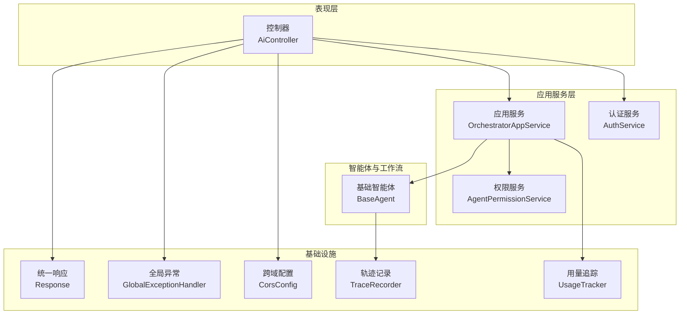
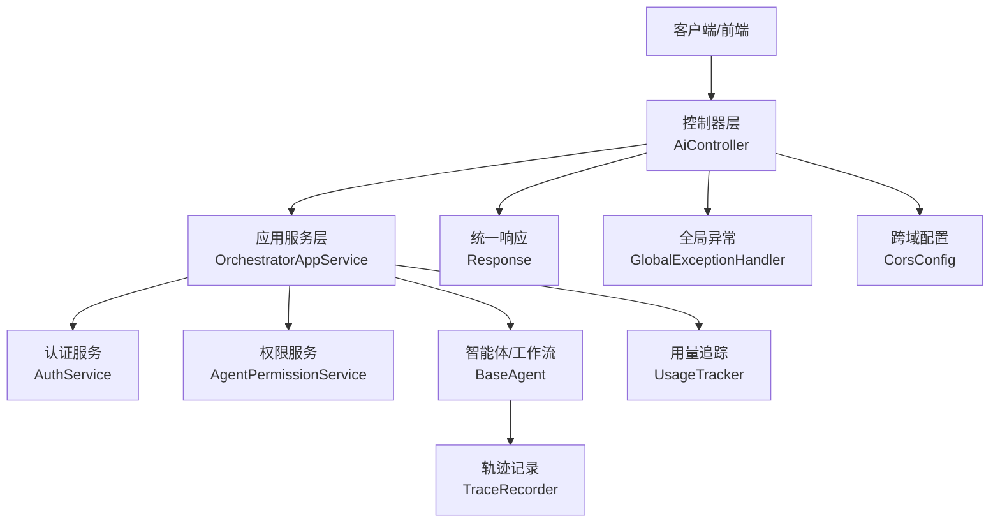
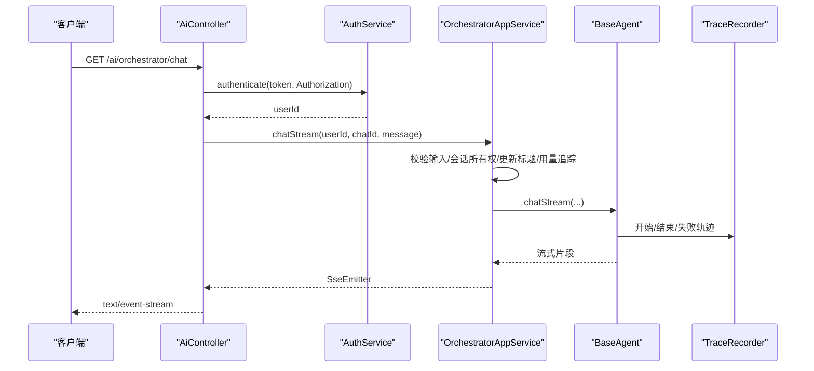
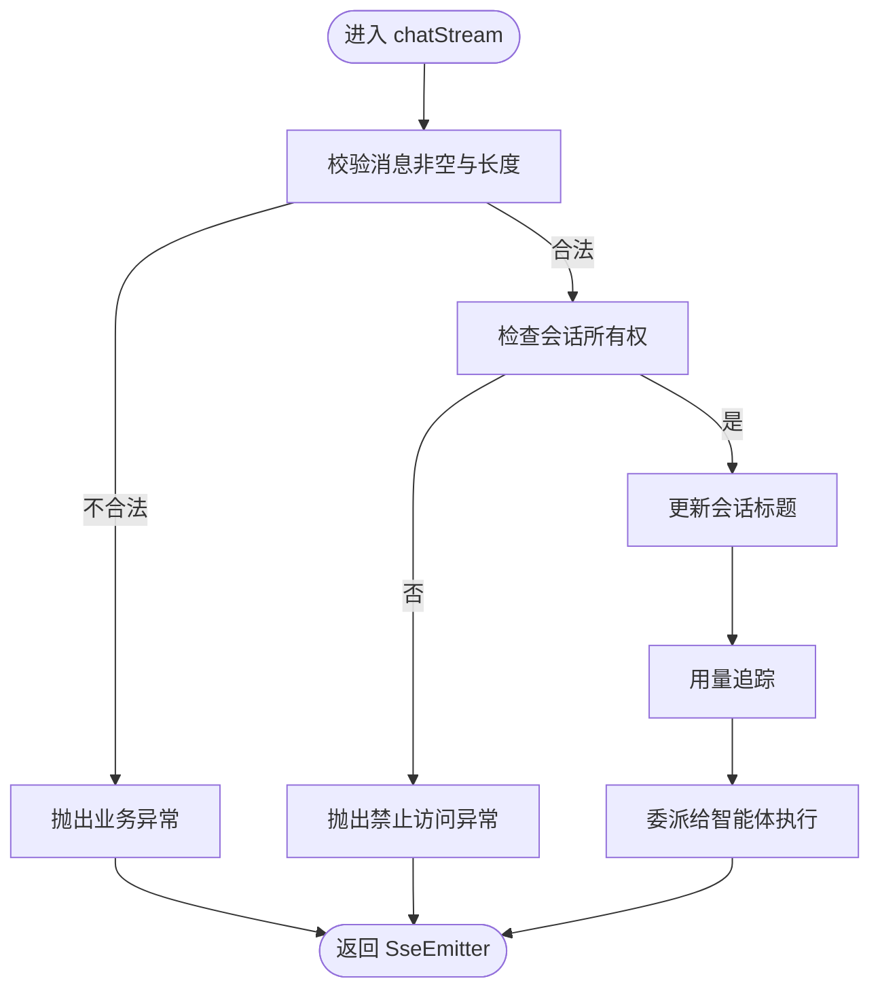
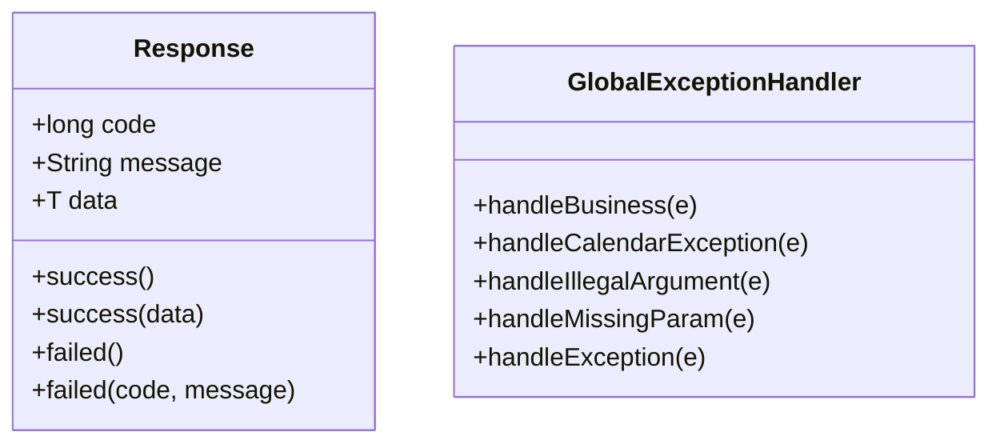
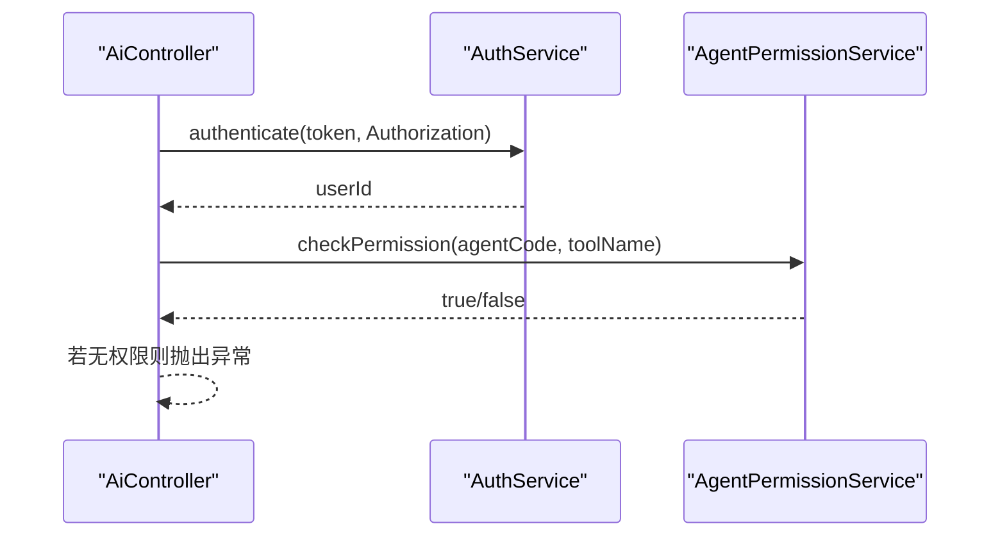
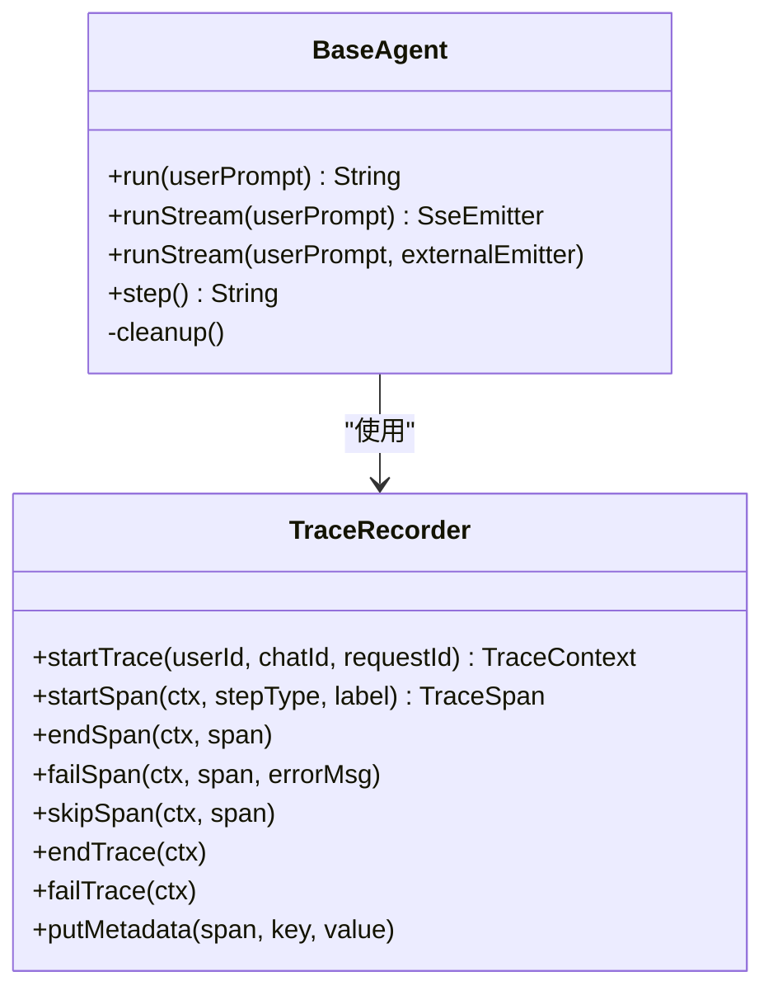
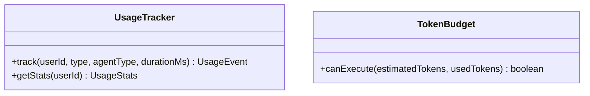
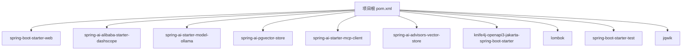

# 后端开发指南

<cite>
**本文引用的文件**
- [AiAgentApplication.java](file://src/main/java/com/yupi/yuaiagent/AiAgentApplication.java)
- [pom.xml](file://pom.xml)
- [application.yml](file://src/main/resources/application.yml)
- [AiController.java](file://src/main/java/com/yupi/yuaiagent/controller/AiController.java)
- [OrchestratorAppService.java](file://src/main/java/com/yupi/yuaiagent/service/OrchestratorAppService.java)
- [Response.java](file://src/main/java/com/yupi/yuaiagent/common/Response.java)
- [GlobalExceptionHandler.java](file://src/main/java/com/yupi/yuaiagent/exception/GlobalExceptionHandler.java)
- [CorsConfig.java](file://src/main/java/com/yupi/yuaiagent/config/CorsConfig.java)
- [AuthService.java](file://src/main/java/com/yupi/yuaiagent/auth/AuthService.java)
- [AgentPermissionService.java](file://src/main/java/com/yupi/yuaiagent/permission/AgentPermissionService.java)
- [BaseAgent.java](file://src/main/java/com/yupi/yuaiagent/agent/BaseAgent.java)
- [TraceRecorder.java](file://src/main/java/com/yupi/yuaiagent/trace/TraceRecorder.java)
- [TokenBudget.java](file://src/main/java/com/yupi/yuaiagent/budget/TokenBudget.java)
- [UsageTracker.java](file://src/main/java/com/yupi/yuaiagent/usage/UsageTracker.java)
- [AiAgentApplicationTests.java](file://src/test/java/com/yupi/yuaiagent/AiAgentApplicationTests.java)
</cite>

## 目录
1. [引言](#引言)
2. [项目结构](#项目结构)
3. [核心组件](#核心组件)
4. [架构总览](#架构总览)
5. [详细组件分析](#详细组件分析)
6. [依赖分析](#依赖分析)
7. [性能考虑](#性能考虑)
8. [故障排查指南](#故障排查指南)
9. [结论](#结论)
10. [附录](#附录)

## 引言
本指南面向不同经验水平的开发者，系统梳理基于 Spring Boot 3 的后端开发规范与最佳实践。内容涵盖项目结构、核心模块设计、开发环境配置、控制器/服务层/仓储层职责分离、API 接口规范、错误处理与异常管理、单元与集成测试、安全与权限控制、性能优化与资源限制、代码与注释规范，以及学习路径建议。

## 项目结构
项目采用分层清晰的模块化组织方式，主要包包括：
- controller：对外暴露 REST API，统一返回包装与异常处理
- service：应用服务层，编排业务流程、参数校验、权限与用量统计
- agent：智能体与工作流执行层，抽象基类与具体 Agent 实现
- trace：执行轨迹与可观测性
- permission/access：权限与访问决策
- auth：认证与令牌解析
- common/exception/config：通用响应封装、全局异常处理、跨域配置
- usage/budget：用量追踪与预算控制
- repository：数据访问（示例：AppointmentRepository）
- config：应用配置（示例：AgentConfig、CompressionConfig 等）
- constant、context、dto、eval、event、export、favorite、mcp、message、nlu、policy、profile、prompt、quality、rag、registry、sandbox、search、skill、tools、workflow 等：按领域划分的功能模块

图表来源
- [AiController.java:22-165](file://src/main/java/com/yupi/yuaiagent/controller/AiController.java#L22-L165)
- [OrchestratorAppService.java:23-70](file://src/main/java/com/yupi/yuaiagent/service/OrchestratorAppService.java#L23-L70)
- [AuthService.java:17-54](file://src/main/java/com/yupi/yuaiagent/auth/AuthService.java#L17-L54)
- [AgentPermissionService.java:11-120](file://src/main/java/com/yupi/yuaiagent/permission/AgentPermissionService.java#L11-L120)
- [BaseAgent.java:20-257](file://src/main/java/com/yupi/yuaiagent/agent/BaseAgent.java#L20-L257)
- [Response.java:5-56](file://src/main/java/com/yupi/yuaiagent/common/Response.java#L5-L56)
- [GlobalExceptionHandler.java:13-55](file://src/main/java/com/yupi/yuaiagent/exception/GlobalExceptionHandler.java#L13-L55)
- [CorsConfig.java:7-26](file://src/main/java/com/yupi/yuaiagent/config/CorsConfig.java#L7-L26)
- [TraceRecorder.java:10-263](file://src/main/java/com/yupi/yuaiagent/trace/TraceRecorder.java#L10-L263)
- [UsageTracker.java:23-144](file://src/main/java/com/yupi/yuaiagent/usage/UsageTracker.java#L23-L144)

章节来源
- [AiAgentApplication.java:1-24](file://src/main/java/com/yupi/yuaiagent/AiAgentApplication.java#L1-L24)
- [pom.xml:1-233](file://pom.xml#L1-L233)
- [application.yml:1-154](file://src/main/resources/application.yml#L1-L154)

## 核心组件
- 应用入口与自动配置排除：应用入口排除数据源与特定 AI 自动配置，便于本地开发与多模型适配。
- 统一响应包装：所有控制器返回统一 Response 结构，便于前端消费与一致性处理。
- 全局异常处理：集中捕获业务异常、参数缺失、非法参数等，映射为标准响应。
- 跨域配置：全局放行，支持凭据与通配模式。
- 认证服务：优先从 URL 参数解析 JWT，其次从 Authorization 头解析，失败抛出业务异常。
- 权限服务：基于配置的权限画像进行工具调用、文件系统与网络访问的权限校验，支持通配符匹配与调用次数限制。
- 智能体基类：提供状态机、消息上下文、步骤循环、流式输出与清理机制。
- 轨迹记录：围绕 TraceContext/TraceSpan 提供开始/结束/失败/跳过等生命周期管理与元数据截断。
- 用量追踪：基于文件的追加式存储，提供统计查询能力。
- 配置中心：通过 application.yml 管理模型、日历、JWT、沙箱、MCP、轨迹、聊天记忆压缩等参数。

章节来源
- [AiAgentApplication.java:11-16](file://src/main/java/com/yupi/yuaiagent/AiAgentApplication.java#L11-L16)
- [Response.java:12-56](file://src/main/java/com/yupi/yuaiagent/common/Response.java#L12-L56)
- [GlobalExceptionHandler.java:18-55](file://src/main/java/com/yupi/yuaiagent/exception/GlobalExceptionHandler.java#L18-L55)
- [CorsConfig.java:11-25](file://src/main/java/com/yupi/yuaiagent/config/CorsConfig.java#L11-L25)
- [AuthService.java:17-54](file://src/main/java/com/yupi/yuaiagent/auth/AuthService.java#L17-L54)
- [AgentPermissionService.java:11-120](file://src/main/java/com/yupi/yuaiagent/permission/AgentPermissionService.java#L11-L120)
- [BaseAgent.java:20-257](file://src/main/java/com/yupi/yuaiagent/agent/BaseAgent.java#L20-L257)
- [TraceRecorder.java:10-263](file://src/main/java/com/yupi/yuaiagent/trace/TraceRecorder.java#L10-L263)
- [UsageTracker.java:23-144](file://src/main/java/com/yupi/yuaiagent/usage/UsageTracker.java#L23-L144)
- [application.yml:1-154](file://src/main/resources/application.yml#L1-L154)

## 架构总览
系统采用“控制器-应用服务-智能体/工作流”的分层架构，配合统一响应与异常处理，保证接口一致性和稳定性；通过权限与认证服务实现访问控制；通过轨迹记录与用量追踪增强可观测性与治理能力。

图表来源
- [AiController.java:22-165](file://src/main/java/com/yupi/yuaiagent/controller/AiController.java#L22-L165)
- [OrchestratorAppService.java:23-70](file://src/main/java/com/yupi/yuaiagent/service/OrchestratorAppService.java#L23-L70)
- [AuthService.java:17-54](file://src/main/java/com/yupi/yuaiagent/auth/AuthService.java#L17-L54)
- [AgentPermissionService.java:11-120](file://src/main/java/com/yupi/yuaiagent/permission/AgentPermissionService.java#L11-L120)
- [BaseAgent.java:20-257](file://src/main/java/com/yupi/yuaiagent/agent/BaseAgent.java#L20-L257)
- [TraceRecorder.java:10-263](file://src/main/java/com/yupi/yuaiagent/trace/TraceRecorder.java#L10-L263)
- [UsageTracker.java:23-144](file://src/main/java/com/yupi/yuaiagent/usage/UsageTracker.java#L23-L144)
- [Response.java:12-56](file://src/main/java/com/yupi/yuaiagent/common/Response.java#L12-L56)
- [GlobalExceptionHandler.java:18-55](file://src/main/java/com/yupi/yuaiagent/exception/GlobalExceptionHandler.java#L18-L55)
- [CorsConfig.java:11-25](file://src/main/java/com/yupi/yuaiagent/config/CorsConfig.java#L11-L25)

## 详细组件分析

### 控制器层（AiController）
- 职责：对外提供 AI 对话、流式输出、工具调用、MCP 对话、RAG 对话、报告生成等接口；负责参数接收、鉴权、流式响应与统一返回。
- 设计要点：
  - 统一返回 Response<T>，便于前端处理成功/失败与数据结构。
  - SSE 流式输出支持多种格式（Flux、ServerSentEvent、SseEmitter），满足不同客户端需求。
  - 智能路由接口对 EventSource 场景兼容 Authorization 头与 URL 参数 token。
- 关键流程：鉴权 → 参数校验 → 业务编排 → 流式输出。

图表来源
- [AiController.java:99-107](file://src/main/java/com/yupi/yuaiagent/controller/AiController.java#L99-L107)
- [AuthService.java:32-42](file://src/main/java/com/yupi/yuaiagent/auth/AuthService.java#L32-L42)
- [OrchestratorAppService.java:42-68](file://src/main/java/com/yupi/yuaiagent/service/OrchestratorAppService.java#L42-L68)
- [BaseAgent.java:109-153](file://src/main/java/com/yupi/yuaiagent/agent/BaseAgent.java#L109-L153)
- [TraceRecorder.java:38-131](file://src/main/java/com/yupi/yuaiagent/trace/TraceRecorder.java#L38-L131)

章节来源
- [AiController.java:22-165](file://src/main/java/com/yupi/yuaiagent/controller/AiController.java#L22-L165)

### 应用服务层（OrchestratorAppService）
- 职责：承载聊天用例，负责输入校验、会话所有权检查、标题更新、用量追踪与委派给智能体执行。
- 设计要点：
  - 明确边界：非业务逻辑（鉴权、会话管理、用量）由服务层处理，业务执行委派给智能体。
  - 输入约束：消息长度限制，防止滥用与资源耗尽。
  - 用量追踪：每次聊天触发用量事件，便于后续统计与治理。

图表来源
- [OrchestratorAppService.java:42-68](file://src/main/java/com/yupi/yuaiagent/service/OrchestratorAppService.java#L42-L68)

章节来源
- [OrchestratorAppService.java:17-70](file://src/main/java/com/yupi/yuaiagent/service/OrchestratorAppService.java#L17-L70)

### 统一响应与异常处理
- 统一响应：Response<T> 提供 success/failed 多种静态构造方法，保证前后端契约一致。
- 全局异常：针对业务异常、参数缺失、非法参数与通用异常进行分类处理，返回标准化错误码与消息。

图表来源
- [Response.java:12-56](file://src/main/java/com/yupi/yuaiagent/common/Response.java#L12-L56)
- [GlobalExceptionHandler.java:18-55](file://src/main/java/com/yupi/yuaiagent/exception/GlobalExceptionHandler.java#L18-L55)

章节来源
- [Response.java:5-56](file://src/main/java/com/yupi/yuaiagent/common/Response.java#L5-L56)
- [GlobalExceptionHandler.java:13-55](file://src/main/java/com/yupi/yuaiagent/exception/GlobalExceptionHandler.java#L13-L55)

### 认证与权限
- 认证：AuthService 从 URL 参数或 Authorization 头解析 JWT，校验失败统一抛出业务异常。
- 权限：AgentPermissionService 基于 PermissionProfile 进行工具调用、文件系统/网络访问与调用次数限制的校验，支持通配符匹配与管理员豁免。

图表来源
- [AuthService.java:32-42](file://src/main/java/com/yupi/yuaiagent/auth/AuthService.java#L32-L42)
- [AgentPermissionService.java:33-65](file://src/main/java/com/yupi/yuaiagent/permission/AgentPermissionService.java#L33-L65)

章节来源
- [AuthService.java:17-54](file://src/main/java/com/yupi/yuaiagent/auth/AuthService.java#L17-L54)
- [AgentPermissionService.java:11-120](file://src/main/java/com/yupi/yuaiagent/permission/AgentPermissionService.java#L11-L120)

### 智能体与轨迹
- 基础智能体：BaseAgent 提供 run/runStream、状态机、消息上下文、步骤循环与清理机制；支持外部 SseEmitter 合流。
- 轨迹记录：TraceRecorder 提供 TraceContext/TraceSpan 生命周期管理、元数据截断与 SSE 发布，保障追踪不影响主流程。

图表来源
- [BaseAgent.java:20-257](file://src/main/java/com/yupi/yuaiagent/agent/BaseAgent.java#L20-L257)
- [TraceRecorder.java:10-263](file://src/main/java/com/yupi/yuaiagent/trace/TraceRecorder.java#L10-L263)

章节来源
- [BaseAgent.java:20-257](file://src/main/java/com/yupi/yuaiagent/agent/BaseAgent.java#L20-L257)
- [TraceRecorder.java:10-263](file://src/main/java/com/yupi/yuaiagent/trace/TraceRecorder.java#L10-L263)

### 用量追踪与预算
- 用量追踪：UsageTracker 基于文件的追加式存储，提供事件记录与统计查询。
- 预算控制：TokenBudget 提供按工作流的 Token 预算判断能力。

图表来源
- [UsageTracker.java:23-144](file://src/main/java/com/yupi/yuaiagent/usage/UsageTracker.java#L23-L144)
- [TokenBudget.java:1-15](file://src/main/java/com/yupi/yuaiagent/budget/TokenBudget.java#L1-L15)

章节来源
- [UsageTracker.java:23-144](file://src/main/java/com/yupi/yuaiagent/usage/UsageTracker.java#L23-L144)
- [TokenBudget.java:1-15](file://src/main/java/com/yupi/yuaiagent/budget/TokenBudget.java#L1-L15)

## 依赖分析
- 核心依赖：Spring Boot Starter Web、Spring AI Alibaba DashScope、Ollama、PGVector、MCP 客户端、Knife4j OpenAPI、Lombok、测试框架等。
- 版本与构建：Java 21、Spring Boot 3.4.4、BOM 管理依赖版本；Maven 插件配置注解处理器与打包排除 Lombok。

图表来源
- [pom.xml:50-170](file://pom.xml#L50-L170)

章节来源
- [pom.xml:1-233](file://pom.xml#L1-L233)

## 性能考虑
- 流式输出：优先使用 SSE，降低延迟与内存占用；合理设置超时与连接生命周期。
- 会话与记忆：聊天记忆压缩阈值与轮数阈值配置，避免上下文膨胀导致性能下降。
- 模型与向量：按需启用 DashScope/Ollama，避免重复初始化 ChatModel；向量存储批量写入与索引参数调优。
- 资源限制：沙箱默认超时与输出大小限制，生产环境建议启用 Docker 并收紧限制。
- 观测性：开启 DEBUG 日志级别以便排查 Spring AI 调用细节，同时注意生产环境的日志成本。

章节来源
- [application.yml:121-154](file://src/main/resources/application.yml#L121-L154)
- [TraceRecorder.java:238-261](file://src/main/java/com/yupi/yuaiagent/trace/TraceRecorder.java#L238-L261)

## 故障排查指南
- 参数缺失：全局异常将捕获缺失参数并返回明确提示。
- 非法参数：参数校验失败返回 400 与具体错误信息。
- 业务异常：统一返回业务错误码与消息，便于前端提示与定位。
- 预约服务异常：日历服务异常统一转为 503 与友好提示。
- 认证失败：未登录或无效 Token 统一抛出业务异常，控制器层直接返回标准响应。

章节来源
- [GlobalExceptionHandler.java:22-53](file://src/main/java/com/yupi/yuaiagent/exception/GlobalExceptionHandler.java#L22-L53)
- [AuthService.java:32-42](file://src/main/java/com/yupi/yuaiagent/auth/AuthService.java#L32-L42)

## 结论
本项目遵循分层架构与统一契约，结合认证、权限、轨迹与用量追踪，形成可扩展、可观测、可治理的后端体系。建议在开发中严格遵守接口规范、异常处理与测试策略，持续优化性能与资源使用，确保系统稳定与可维护性。

## 附录

### API 接口开发规范
- 统一返回：所有接口返回 Response<T>，成功/失败与数据结构一致。
- 路径与方法：RESTful 命名与语义化路径，GET/POST/PUT/DELETE 明确用途。
- 流式输出：SSE 优先，支持多种格式；设置合理超时与错误回调。
- 鉴权：URL 参数 token 与 Authorization 头双通道；未携带或无效统一 401。

章节来源
- [AiController.java:22-165](file://src/main/java/com/yupi/yuaiagent/controller/AiController.java#L22-L165)
- [Response.java:12-56](file://src/main/java/com/yupi/yuaiagent/common/Response.java#L12-L56)

### 错误处理策略与异常管理
- 业务异常： BusinessException 封装错误码与消息，控制器层无需重复判空。
- 参数异常：缺失参数与非法参数分别处理，返回明确提示。
- 通用异常：兜底返回 500 与通用错误消息，记录堆栈日志。

章节来源
- [GlobalExceptionHandler.java:18-55](file://src/main/java/com/yupi/yuaiagent/exception/GlobalExceptionHandler.java#L18-L55)

### 单元测试与集成测试
- 单元测试：针对服务与工具类进行行为验证，使用注解驱动与模拟依赖。
- 集成测试：覆盖控制器端到端流程，包含鉴权、权限、流式输出与异常分支。
- 测试覆盖率：建议关键路径与异常分支达到较高覆盖率，结合属性测试提升鲁棒性。

章节来源
- [AiAgentApplicationTests.java:1-14](file://src/test/java/com/yupi/yuaiagent/AiAgentApplicationTests.java#L1-L14)

### 安全配置、权限控制与访问策略
- 跨域：全局放行，支持凭据与通配模式，生产环境建议收窄来源。
- 认证：JWT 优先从 URL 参数解析，其次 Authorization 头，失败抛业务异常。
- 权限：基于 PermissionProfile 的工具调用、文件系统/网络访问与调用次数限制，支持通配符与管理员豁免。

章节来源
- [CorsConfig.java:11-25](file://src/main/java/com/yupi/yuaiagent/config/CorsConfig.java#L11-L25)
- [AuthService.java:17-54](file://src/main/java/com/yupi/yuaiagent/auth/AuthService.java#L17-L54)
- [AgentPermissionService.java:11-120](file://src/main/java/com/yupi/yuaiagent/permission/AgentPermissionService.java#L11-L120)

### 性能优化技巧、内存管理与资源限制
- 流式输出与超时：合理设置 SSE 超时与完成回调，避免长时间占用连接。
- 记忆压缩：根据 Token 与轮数阈值进行压缩，减少上下文开销。
- 沙箱限制：默认超时与输出大小限制，生产环境启用 Docker 并收紧策略。
- 日志级别：开发阶段 DEBUG，生产阶段适度降级，平衡可观测性与性能。

章节来源
- [application.yml:121-154](file://src/main/resources/application.yml#L121-L154)
- [BaseAgent.java:161-239](file://src/main/java/com/yupi/yuaiagent/agent/BaseAgent.java#L161-L239)

### 代码规范、命名约定与注释标准
- 包与类：按领域划分包，类名语义化，职责单一。
- 方法：短小精悍，命名清晰，必要注释说明复杂逻辑与边界条件。
- 异常：区分业务异常与系统异常，异常消息可读且不含敏感信息。
- 配置：参数通过 application.yml 管理，敏感信息通过环境变量注入。

章节来源
- [application.yml:1-154](file://src/main/resources/application.yml#L1-L154)

### 学习路径建议
- 初学者：从控制器与统一响应入手，理解接口规范与异常处理；逐步熟悉服务层编排与智能体基类。
- 进阶者：深入权限与认证机制，掌握轨迹记录与用量追踪；学习沙箱与 MCP 集成。
- 高级者：关注性能优化、资源限制与可观测性，完善测试策略与治理规范。