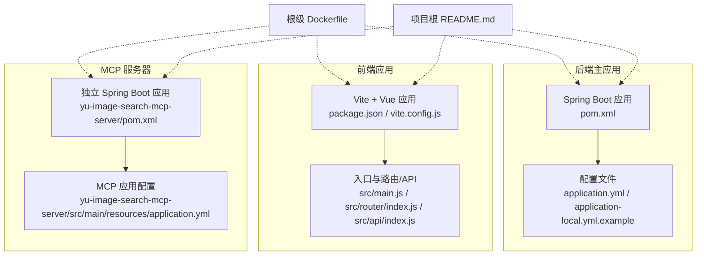
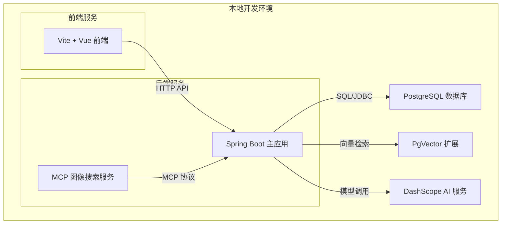
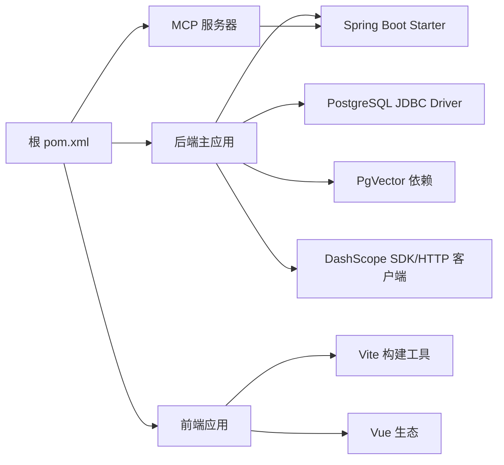

# 开发环境搭建

<cite>
**本文引用的文件**
- [pom.xml](file://pom.xml)
- [application.yml](file://src/main/resources/application.yml)
- [application-local.yml.example](file://src/main/resources/application-local.yml.example)
- [Dockerfile](file://Dockerfile)
- [README.md](file://README.md)
- [yu-ai-agent-frontend/Dockerfile](file://yu-ai-agent-frontend/Dockerfile)
- [yu-ai-agent-frontend/package.json](file://yu-ai-agent-frontend/package.json)
- [yu-ai-agent-frontend/vite.config.js](file://yu-ai-agent-frontend/vite.config.js)
- [yu-ai-agent-frontend/src/main.js](file://yu-ai-agent-frontend/src/main.js)
- [yu-ai-agent-frontend/src/router/index.js](file://yu-ai-agent-frontend/src/router/index.js)
- [yu-ai-agent-frontend/src/api/index.js](file://yu-ai-agent-frontend/src/api/index.js)
- [yu-image-search-mcp-server/pom.xml](file://yu-image-search-mcp-server/pom.xml)
- [yu-image-search-mcp-server/src/main/resources/application.yml](file://yu-image-search-mcp-server/src/main/resources/application.yml)
</cite>

## 目录
1. [简介](#简介)
2. [项目结构](#项目结构)
3. [核心组件](#核心组件)
4. [架构总览](#架构总览)
5. [详细组件分析](#详细组件分析)
6. [依赖分析](#依赖分析)
7. [性能考虑](#性能考虑)
8. [故障排除指南](#故障排除指南)
9. [结论](#结论)
10. [附录](#附录)

## 简介
本指南面向首次参与本项目的开发者，提供从零开始的本地开发环境搭建步骤。内容覆盖以下方面：
- JDK 17+ 安装与验证
- Maven 环境配置与构建
- IDE（IntelliJ IDEA）设置要点
- 数据库 PostgreSQL 及向量扩展 PgVector 的安装与初始化
- AI 服务 DashScope 的接入与配置
- Docker 环境配置与容器化部署准备
- 环境变量与配置文件复制
- 初始数据导入流程
- 不同操作系统的具体安装命令
- 常见环境配置问题与排错方法

## 项目结构
该项目采用多模块 Maven 结构，包含后端主应用、前端应用以及独立的 MCP 服务器模块。后端主应用使用 Spring Boot，前端基于 Vite/Vue，MCP 服务器为独立的 Spring Boot 应用。

图表来源
- [pom.xml](file://pom.xml)
- [application.yml](file://src/main/resources/application.yml)
- [application-local.yml.example](file://src/main/resources/application-local.yml.example)
- [yu-ai-agent-frontend/package.json](file://yu-ai-agent-frontend/package.json)
- [yu-ai-agent-frontend/vite.config.js](file://yu-ai-agent-frontend/vite.config.js)
- [yu-ai-agent-frontend/src/main.js](file://yu-ai-agent-frontend/src/main.js)
- [yu-ai-agent-frontend/src/router/index.js](file://yu-ai-agent-frontend/src/router/index.js)
- [yu-ai-agent-frontend/src/api/index.js](file://yu-ai-agent-frontend/src/api/index.js)
- [yu-image-search-mcp-server/pom.xml](file://yu-image-search-mcp-server/pom.xml)
- [yu-image-search-mcp-server/src/main/resources/application.yml](file://yu-image-search-mcp-server/src/main/resources/application.yml)
- [Dockerfile](file://Dockerfile)
- [README.md](file://README.md)

章节来源
- [pom.xml](file://pom.xml)
- [README.md](file://README.md)

## 核心组件
- 后端主应用：Spring Boot 应用，负责多智能体编排、RAG、向量检索、会话管理、权限控制等。
- 前端应用：Vue + Vite 构建的单页应用，提供聊天界面、知识库、工件管理、追踪可视化等功能。
- MCP 服务器：独立的图像搜索工具服务，通过 MCP 协议对外提供能力。
- 配置系统：基于 Spring Boot 的 application.yml 与本地示例 application-local.yml.example，支持 profile 切换与环境变量覆盖。

章节来源
- [application.yml](file://src/main/resources/application.yml)
- [application-local.yml.example](file://src/main/resources/application-local.yml.example)
- [yu-image-search-mcp-server/src/main/resources/application.yml](file://yu-image-search-mcp-server/src/main/resources/application.yml)

## 架构总览
下图展示了开发环境中的主要组件关系与交互路径，包括数据库、向量存储、AI 服务以及前后端应用之间的连接。

图表来源
- [application.yml](file://src/main/resources/application.yml)
- [yu-image-search-mcp-server/src/main/resources/application.yml](file://yu-image-search-mcp-server/src/main/resources/application.yml)

## 详细组件分析

### JDK 17+ 安装与验证
- Windows
  - 下载并安装 OpenJDK 17 或更高版本（推荐 Adoptium/OpenJDK）
  - 设置 JAVA_HOME 环境变量指向 JDK 安装目录
  - 将 %JAVA_HOME%\bin 添加到 PATH
  - 验证：在终端执行 java -version 与 javac -version
- macOS
  - 使用 Homebrew 安装：brew install openjdk@17
  - 设置 JAVA_HOME 并将 $JAVA_HOME/bin 加入 PATH
  - 验证：java -version
- Linux (Debian/Ubuntu)
  - sudo apt update && sudo apt install openjdk-17-jdk
  - 配置 JAVA_HOME 与 PATH
  - 验证：java -version

章节来源
- [pom.xml](file://pom.xml)

### Maven 环境配置与构建
- 安装 Maven（建议使用 3.6+）
- 配置本地仓库与镜像源（可选）
- 在项目根目录执行构建：
  - Windows: mvnw.cmd clean install
  - macOS/Linux: ./mvnw clean install
- 若需跳过测试：./mvnw clean install -DskipTests
- 多模块构建：根目录同时构建所有子模块

章节来源
- [pom.xml](file://pom.xml)
- [yu-image-search-mcp-server/pom.xml](file://yu-image-search-mcp-server/pom.xml)

### IDE 设置（IntelliJ IDEA）
- 导入项目为 Maven 工程
- 设置 Project SDK 为 JDK 17+
- Maven Settings：
  - Use plugin registry
  - Import Maven projects automatically
  - Use auto-import
- 运行配置：
  - 新建 Application，Main class 指向后端主应用启动类
  - VM Options：根据需要添加 JVM 参数（如内存、日志级别）
  - Environment Variables：用于切换 Spring Profile 与注入敏感配置
- 前端运行：
  - 在 yu-ai-agent-frontend 目录执行 npm install
  - 使用 npm run dev 启动 Vite 开发服务器

章节来源
- [pom.xml](file://pom.xml)
- [yu-ai-agent-frontend/package.json](file://yu-ai-agent-frontend/package.json)

### 数据库与向量存储配置（PostgreSQL + PgVector）
- 安装 PostgreSQL（建议 14+）
- 创建数据库与用户（按实际需求命名）
- 在目标数据库中启用扩展：CREATE EXTENSION IF NOT EXISTS vector;
- 初始化表结构与索引（由应用启动时 Flyway/Liquibase 或手动 SQL 完成）
- 配置连接参数于 application.yml 中的数据库相关属性

章节来源
- [application.yml](file://src/main/resources/application.yml)

### AI 服务接入（DashScope）
- 注册 DashScope 账号并获取 API Key
- 在 application-local.yml.example 中配置 DashScope 相关参数（如 endpoint、secret 等）
- 将示例文件重命名为 application-local.yml 并填入真实密钥
- 如需在 CI/CD 中使用，可通过环境变量注入

章节来源
- [application-local.yml.example](file://src/main/resources/application-local.yml.example)
- [application.yml](file://src/main/resources/application.yml)

### Docker 环境配置与容器化部署准备
- 根级 Dockerfile 提供后端与前端打包与运行的基础模板
- 前端独立 Dockerfile 位于 yu-ai-agent-frontend/
- 构建镜像：
  - 后端：docker build -t agent-backend .
  - 前端：docker build -t agent-frontend -f yu-ai-agent-frontend/Dockerfile .
- 运行容器：
  - 后端：docker run -d -p 8080:8080 --name backend agent-backend
  - 前端：docker run -d -p 3000:3000 --name frontend agent-frontend
- 注意：容器内需确保数据库可达或使用 docker-compose 编排

章节来源
- [Dockerfile](file://Dockerfile)
- [yu-ai-agent-frontend/Dockerfile](file://yu-ai-agent-frontend/Dockerfile)

### 环境变量与配置文件复制
- 复制示例配置：将 application-local.yml.example 复制为 application-local.yml
- 在 application-local.yml 中填写数据库连接、DashScope Key、AI 模型参数等
- 通过 Spring Profile 切换（如 local/prod），并在 IDE 或启动脚本中设置 spring.profiles.active
- 环境变量优先级高于 application.yml，可用于 CI/CD 注入敏感信息

章节来源
- [application-local.yml.example](file://src/main/resources/application-local.yml.example)
- [application.yml](file://src/main/resources/application.yml)

### 初始数据导入
- 数据库初始化通常由应用启动时的迁移脚本完成（Flyway/Liquibase）
- 若需手动导入，请参考项目文档或迁移脚本中的 SQL 文件
- 向量数据可在应用启动后通过 RAG 流程写入 PgVector 表

章节来源
- [application.yml](file://src/main/resources/application.yml)

### 前端开发环境设置
- 安装 Node.js（建议 LTS 版本）
- 在 yu-ai-agent-frontend 目录执行 npm install
- 启动开发服务器：npm run dev
- 访问 http://localhost:3000 查看页面
- API 请求默认指向后端服务地址（可在前端配置中调整）

章节来源
- [yu-ai-agent-frontend/package.json](file://yu-ai-agent-frontend/package.json)
- [yu-ai-agent-frontend/vite.config.js](file://yu-ai-agent-frontend/vite.config.js)
- [yu-ai-agent-frontend/src/main.js](file://yu-ai-agent-frontend/src/main.js)
- [yu-ai-agent-frontend/src/router/index.js](file://yu-ai-agent-frontend/src/router/index.js)
- [yu-ai-agent-frontend/src/api/index.js](file://yu-ai-agent-frontend/src/api/index.js)

### MCP 服务器模块（独立运行）
- 该模块为独立的 Spring Boot 应用，提供图像搜索工具能力
- 可单独构建与运行，便于前端或后端集成测试
- 配置文件位于其 resources 目录，包含 SSE/STDIO 等不同运行模式

章节来源
- [yu-image-search-mcp-server/pom.xml](file://yu-image-search-mcp-server/pom.xml)
- [yu-image-search-mcp-server/src/main/resources/application.yml](file://yu-image-search-mcp-server/src/main/resources/application.yml)

## 依赖分析
后端主应用与前端应用均通过 Maven 管理依赖；MCP 服务器为独立模块。整体依赖关系如下：

图表来源
- [pom.xml](file://pom.xml)
- [yu-image-search-mcp-server/pom.xml](file://yu-image-search-mcp-server/pom.xml)

章节来源
- [pom.xml](file://pom.xml)
- [yu-image-search-mcp-server/pom.xml](file://yu-image-search-mcp-server/pom.xml)

## 性能考虑
- JVM 参数建议：合理设置堆大小与 GC 策略，结合实际负载压测调整
- 数据库连接池：使用 HikariCP 并配置最大连接数与超时时间
- 向量检索：为向量字段建立 GIN/HNSW 索引，优化查询性能
- 前端资源：生产构建开启压缩与分包策略，减少首屏加载时间

## 故障排除指南
- 端口冲突
  - 症状：启动失败或端口被占用
  - 处理：修改 application.yml 中 server.port 或释放占用端口
- 数据库连接失败
  - 症状：应用启动时报连接异常
  - 处理：检查数据库地址、端口、用户名、密码与网络连通性
- PgVector 扩展缺失
  - 症状：向量查询报错或无法创建向量列
  - 处理：在目标数据库中执行 CREATE EXTENSION IF NOT EXISTS vector;
- DashScope Key 无效
  - 症状：AI 推理接口返回鉴权错误
  - 处理：确认 API Key 正确，检查网络与代理设置
- 前端无法访问后端 API
  - 症状：跨域错误或 404
  - 处理：检查 CORS 配置与后端服务是否正常运行
- Docker 构建失败
  - 症状：镜像构建阶段报错
  - 处理：检查 Dockerfile 与依赖下载网络，必要时更换镜像源

章节来源
- [application.yml](file://src/main/resources/application.yml)
- [application-local.yml.example](file://src/main/resources/application-local.yml.example)

## 结论
按照本指南完成 JDK、Maven、数据库、向量存储与 AI 服务的配置后，即可顺利启动后端主应用与前端应用。建议先以本地 profile 启动，再逐步引入 Docker 编排与 CI/CD 管道。遇到问题时，优先检查配置文件与网络连通性，并参考故障排除部分进行定位。

## 附录

### 快速启动流程（后端 + 前端）
- 后端
  - 复制并编辑 application-local.yml
  - 启动数据库与 PgVector
  - 执行 Maven 构建并运行 Spring Boot 应用
- 前端
  - 在 yu-ai-agent-frontend 目录执行 npm install
  - 启动开发服务器并访问 http://localhost:3000

章节来源
- [application-local.yml.example](file://src/main/resources/application-local.yml.example)
- [yu-ai-agent-frontend/package.json](file://yu-ai-agent-frontend/package.json)