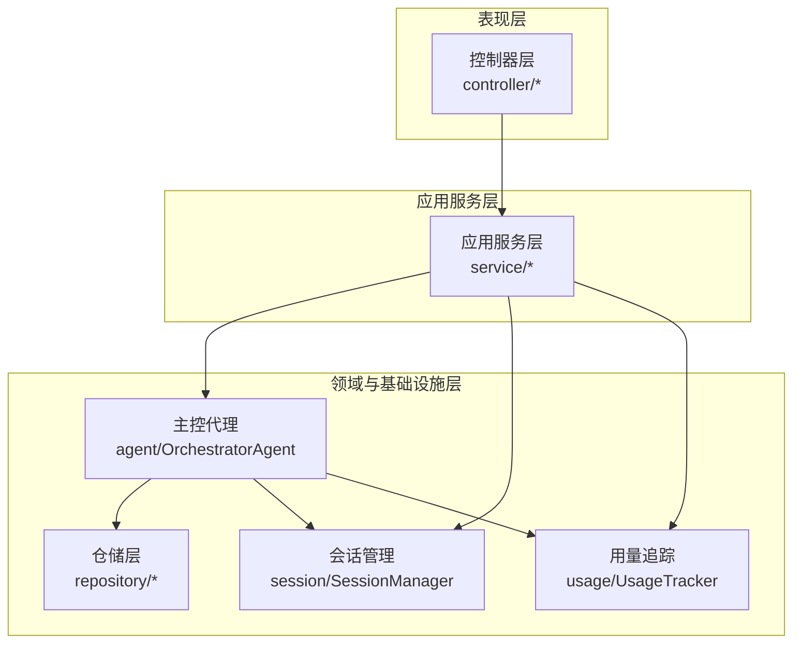
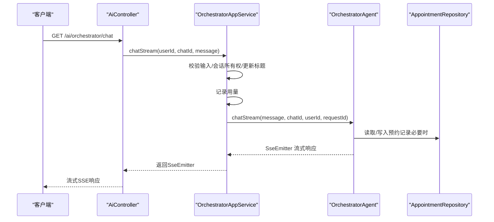
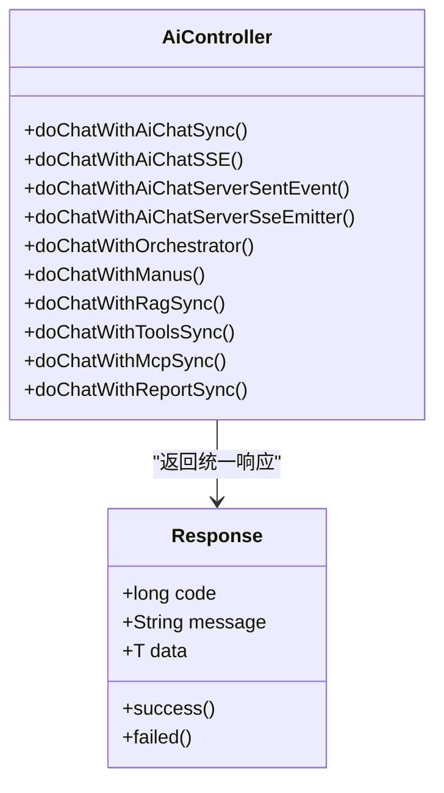
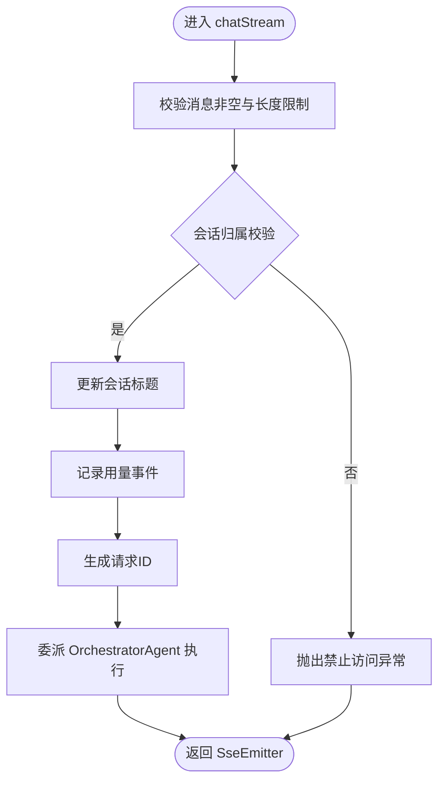
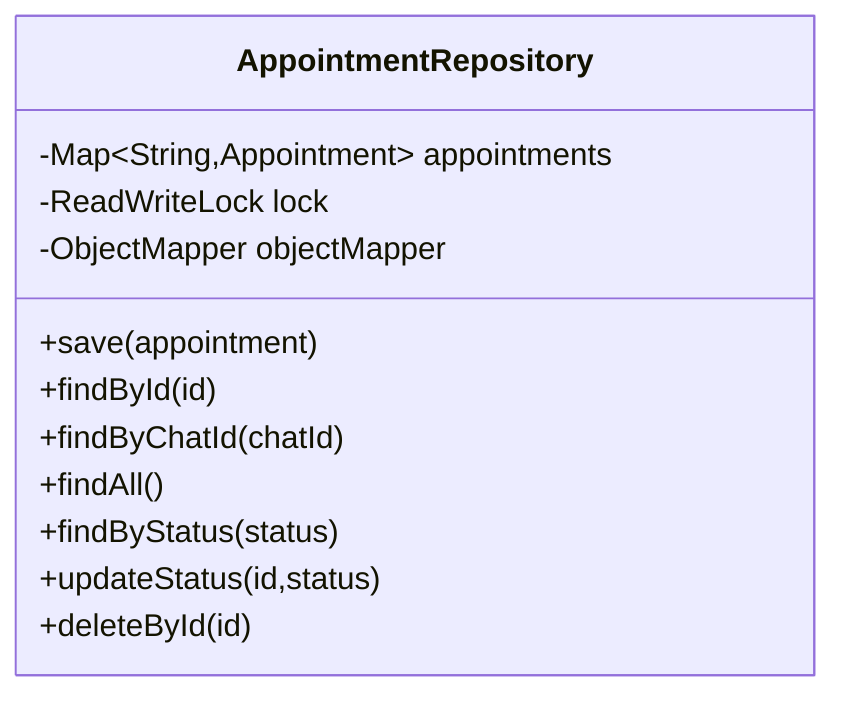
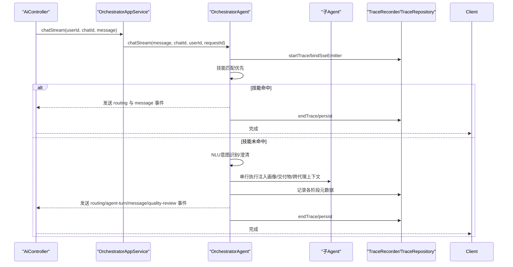
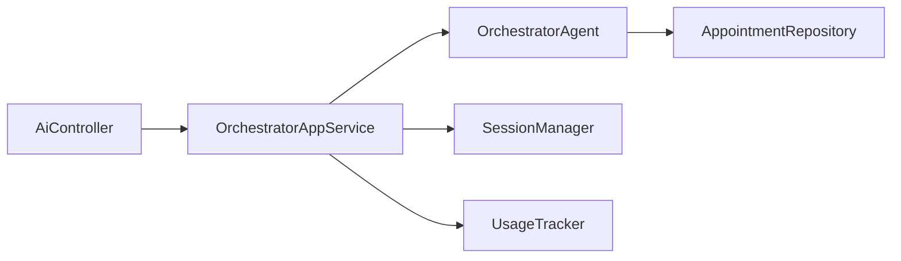

# 核心模块架构

<cite>
**本文引用的文件**
- [AiAgentApplication.java](file://src/main/java/com/yupi/yuaiagent/AiAgentApplication.java)
- [application.yml](file://src/main/resources/application.yml)
- [AiController.java](file://src/main/java/com/yupi/yuaiagent/controller/AiController.java)
- [OrchestratorAppService.java](file://src/main/java/com/yupi/yuaiagent/service/OrchestratorAppService.java)
- [OrchestratorAgent.java](file://src/main/java/com/yupi/yuaiagent/agent/OrchestratorAgent.java)
- [SessionManager.java](file://src/main/java/com/yupi/yuaiagent/session/SessionManager.java)
- [UsageTracker.java](file://src/main/java/com/yupi/yuaiagent/usage/UsageTracker.java)
- [Response.java](file://src/main/java/com/yupi/yuaiagent/common/Response.java)
- [AppointmentRepository.java](file://src/main/java/com/yupi/yuaiagent/repository/AppointmentRepository.java)
</cite>

## 目录
1. [引言](#引言)
2. [项目结构](#项目结构)
3. [核心组件](#核心组件)
4. [架构总览](#架构总览)
5. [详细组件分析](#详细组件分析)
6. [依赖分析](#依赖分析)
7. [性能考虑](#性能考虑)
8. [故障排查指南](#故障排查指南)
9. [结论](#结论)
10. [附录](#附录)

## 引言
本文件面向开发者与架构师，系统性阐述该Spring Boot应用的分层架构设计与MVC模式实践。重点说明控制器层(Controller)、服务层(Service)、仓储层(Repository)的职责分离与交互关系；解析AiAgentApplication主启动类的配置与作用；梳理各层之间的依赖与数据流向；总结MVC最佳实践与设计原则；并给出模块间调用规范与接口设计指南。

## 项目结构
该项目采用标准的Spring Boot多模块分层组织方式：
- 控制器层：位于controller包，负责HTTP请求接入与响应封装
- 应用服务层：位于service包，负责业务用例编排与横切关注点处理
- 领域与基础设施层：位于agent、repository、session、usage等包，承载核心业务能力与数据持久化
- 配置与资源：application.yml集中管理外部化配置
- 统一响应包装：common包提供统一响应体封装

图表来源
- [AiController.java:22-165](file://src/main/java/com/yupi/yuaiagent/controller/AiController.java#L22-L165)
- [OrchestratorAppService.java:23-70](file://src/main/java/com/yupi/yuaiagent/service/OrchestratorAppService.java#L23-L70)
- [OrchestratorAgent.java:68-163](file://src/main/java/com/yupi/yuaiagent/agent/OrchestratorAgent.java#L68-L163)
- [SessionManager.java:29-310](file://src/main/java/com/yupi/yuaiagent/session/SessionManager.java#L29-L310)
- [UsageTracker.java:29-144](file://src/main/java/com/yupi/yuaiagent/usage/UsageTracker.java#L29-L144)
- [AppointmentRepository.java:27-201](file://src/main/java/com/yupi/yuaiagent/repository/AppointmentRepository.java#L27-L201)

章节来源
- [application.yml:1-154](file://src/main/resources/application.yml#L1-L154)

## 核心组件
- 主启动类AiAgentApplication：声明Spring Boot应用并按需排除自动配置，确保运行时仅加载所需组件，避免冲突
- 控制器AiController：暴露REST接口，统一响应包装，协调认证、流式输出与代理调用
- 应用服务OrchestratorAppService：输入校验、权限校验、会话管理、用量统计与主控代理编排
- 主控代理OrchestratorAgent：意图识别、路由决策、跨代理记忆同步、质量审查与轨迹记录
- 会话管理SessionManager：基于文件的会话生命周期管理与所有权校验
- 用量追踪UsageTracker：基于文件的用量事件记录与统计
- 统一响应Response：标准化API返回格式
- 仓储AppointmentRepository：基于文件的预约记录持久化

章节来源
- [AiAgentApplication.java:11-21](file://src/main/java/com/yupi/yuaiagent/AiAgentApplication.java#L11-L21)
- [AiController.java:22-165](file://src/main/java/com/yupi/yuaiagent/controller/AiController.java#L22-L165)
- [OrchestratorAppService.java:23-70](file://src/main/java/com/yupi/yuaiagent/service/OrchestratorAppService.java#L23-L70)
- [OrchestratorAgent.java:68-163](file://src/main/java/com/yupi/yuaiagent/agent/OrchestratorAgent.java#L68-L163)
- [SessionManager.java:29-310](file://src/main/java/com/yupi/yuaiagent/session/SessionManager.java#L29-L310)
- [UsageTracker.java:29-144](file://src/main/java/com/yupi/yuaiagent/usage/UsageTracker.java#L29-L144)
- [Response.java:12-56](file://src/main/java/com/yupi/yuaiagent/common/Response.java#L12-L56)
- [AppointmentRepository.java:27-201](file://src/main/java/com/yupi/yuaiagent/repository/AppointmentRepository.java#L27-L201)

## 架构总览
该系统遵循经典的MVC分层与Clean Architecture思想：
- 表现层：控制器接收请求，进行参数校验与鉴权，调用应用服务
- 应用层：应用服务负责业务用例编排、安全与横切关注点（如用量统计、会话管理）
- 领域层：主控代理承担核心业务逻辑，包括意图识别、路由、质量审查与轨迹
- 基础设施层：仓储与文件系统负责数据持久化与外部集成

图表来源
- [AiController.java:99-107](file://src/main/java/com/yupi/yuaiagent/controller/AiController.java#L99-L107)
- [OrchestratorAppService.java:42-68](file://src/main/java/com/yupi/yuaiagent/service/OrchestratorAppService.java#L42-L68)
- [OrchestratorAgent.java:195-284](file://src/main/java/com/yupi/yuaiagent/agent/OrchestratorAgent.java#L195-L284)
- [AppointmentRepository.java:85-107](file://src/main/java/com/yupi/yuaiagent/repository/AppointmentRepository.java#L85-L107)

## 详细组件分析

### 控制器层(Controller)
- 职责
  - 接收HTTP请求，进行参数与鉴权处理
  - 统一响应包装，支持同步与SSE流式输出
  - 协调认证服务、应用服务与代理执行
- 关键接口
  - /ai/orchestrator/chat：智能路由对话（SSE流式）
  - /ai/manus/chat：Manus超级智能体流式对话
  - /ai/ai_chat/*：基础对话、RAG、工具调用、MCP、报告生成等
- 设计要点
  - 使用SseEmitter与Reactor Flux实现真正流式输出
  - 对URL参数与Authorization头同时支持鉴权
  - 统一返回Response<T>，便于前端处理

图表来源
- [AiController.java:22-165](file://src/main/java/com/yupi/yuaiagent/controller/AiController.java#L22-L165)
- [Response.java:12-56](file://src/main/java/com/yupi/yuaiagent/common/Response.java#L12-L56)

章节来源
- [AiController.java:22-165](file://src/main/java/com/yupi/yuaiagent/controller/AiController.java#L22-L165)
- [Response.java:12-56](file://src/main/java/com/yupi/yuaiagent/common/Response.java#L12-L56)

### 服务层(Service)
- 职责
  - 输入校验与边界保护
  - 会话所有权校验与标题更新
  - 用量统计与事件记录
  - 委派给主控代理执行流式对话
- 关键流程
  - chatStream：校验消息长度、检查会话归属、更新会话标题、记录用量、生成请求ID并委派执行

图表来源
- [OrchestratorAppService.java:42-68](file://src/main/java/com/yupi/yuaiagent/service/OrchestratorAppService.java#L42-L68)

章节来源
- [OrchestratorAppService.java:23-70](file://src/main/java/com/yupi/yuaiagent/service/OrchestratorAppService.java#L23-L70)
- [SessionManager.java:124-147](file://src/main/java/com/yupi/yuaiagent/session/SessionManager.java#L124-L147)
- [UsageTracker.java:55-67](file://src/main/java/com/yupi/yuaiagent/usage/UsageTracker.java#L55-L67)

### 仓储层(Repository)
- 职责
  - 提供领域实体的持久化能力
  - 当前实现为基于文件的并发安全存储
- 关键实体
  - AppointmentRepository：预约记录的增删改查与状态变更
- 设计要点
  - 使用读写锁保证并发安全
  - JSON序列化/反序列化，支持时间模块注册
  - 支持按ID、会话ID、状态等条件查询

图表来源
- [AppointmentRepository.java:27-201](file://src/main/java/com/yupi/yuaiagent/repository/AppointmentRepository.java#L27-L201)

章节来源
- [AppointmentRepository.java:27-201](file://src/main/java/com/yupi/yuaiagent/repository/AppointmentRepository.java#L27-L201)

### 主启动类与配置
- 主启动类AiAgentApplication
  - 使用@SpringBootApplication(exclude=...)排除DataSource与Ollama自动配置，避免与DashScope冲突并简化本地开发
  - 作为Spring Boot应用入口，负责组件扫描与启动
- 配置文件application.yml
  - 外部化配置：AI模型、JWT密钥、日历服务、存储目录、追踪参数、日志级别等
  - 通过环境变量注入敏感信息，避免硬编码
  - 支持多环境与多配置源

章节来源
- [AiAgentApplication.java:11-21](file://src/main/java/com/yupi/yuaiagent/AiAgentApplication.java#L11-L21)
- [application.yml:1-154](file://src/main/resources/application.yml#L1-L154)

### 主控代理与路由
- 职责
  - 技能优先匹配与降级路由
  - NLU意图识别与澄清处理
  - 跨代理记忆同步与上下文注入
  - 质量审查与轨迹记录
- 关键流程
  - chatStream：创建Trace上下文，绑定SSE，异步执行；先尝试技能，失败或未命中则走NLU路由；对每个目标Agent串行执行并聚合答案；最后进行质量审查与画像更新触发

图表来源
- [AiController.java:99-107](file://src/main/java/com/yupi/yuaiagent/controller/AiController.java#L99-L107)
- [OrchestratorAppService.java:42-68](file://src/main/java/com/yupi/yuaiagent/service/OrchestratorAppService.java#L42-L68)
- [OrchestratorAgent.java:214-532](file://src/main/java/com/yupi/yuaiagent/agent/OrchestratorAgent.java#L214-L532)

章节来源
- [OrchestratorAgent.java:68-163](file://src/main/java/com/yupi/yuaiagent/agent/OrchestratorAgent.java#L68-L163)
- [OrchestratorAgent.java:195-284](file://src/main/java/com/yupi/yuaiagent/agent/OrchestratorAgent.java#L195-L284)
- [OrchestratorAgent.java:361-532](file://src/main/java/com/yupi/yuaiagent/agent/OrchestratorAgent.java#L361-L532)

## 依赖分析
- 控制器层依赖应用服务层，应用服务层依赖领域代理与基础设施组件
- 领域代理内部组合多个子系统（记忆、技能、工作流、质量、追踪等），形成高内聚低耦合
- 仓储层与会话、用量等基础设施解耦，通过接口抽象隔离实现细节

图表来源
- [AiController.java:22-165](file://src/main/java/com/yupi/yuaiagent/controller/AiController.java#L22-L165)
- [OrchestratorAppService.java:23-70](file://src/main/java/com/yupi/yuaiagent/service/OrchestratorAppService.java#L23-L70)
- [OrchestratorAgent.java:68-163](file://src/main/java/com/yupi/yuaiagent/agent/OrchestratorAgent.java#L68-L163)
- [SessionManager.java:29-310](file://src/main/java/com/yupi/yuaiagent/session/SessionManager.java#L29-L310)
- [UsageTracker.java:29-144](file://src/main/java/com/yupi/yuaiagent/usage/UsageTracker.java#L29-L144)
- [AppointmentRepository.java:27-201](file://src/main/java/com/yupi/yuaiagent/repository/AppointmentRepository.java#L27-L201)

章节来源
- [AiController.java:22-165](file://src/main/java/com/yupi/yuaiagent/controller/AiController.java#L22-L165)
- [OrchestratorAppService.java:23-70](file://src/main/java/com/yupi/yuaiagent/service/OrchestratorAppService.java#L23-L70)
- [OrchestratorAgent.java:68-163](file://src/main/java/com/yupi/yuaiagent/agent/OrchestratorAgent.java#L68-L163)

## 性能考虑
- 流式输出：使用SseEmitter与Reactor Flux实现端到端流式，降低首字节延迟
- 并发安全：仓储层采用读写锁，文件I/O加锁，避免竞态
- 记忆与上下文：跨代理记忆同步与上下文合并需注意消息数量与长度，避免超载
- 质量审查：质量审查为后处理步骤，建议在主线程外异步执行，减少对主链路影响
- 配置优化：通过application.yml调整阈值与缓存参数，结合日志级别定位瓶颈

## 故障排查指南
- 统一异常处理：全局异常处理器可捕获业务异常并返回标准化错误响应
- 追踪与审计：TraceRecorder与TraceRepository记录关键步骤与元数据，便于回溯
- 用量统计：UsageTracker记录事件与耗时，辅助性能分析
- 会话与权限：SessionManager提供会话生命周期管理与归属校验，配合应用服务的权限校验定位问题

章节来源
- [UsageTracker.java:55-67](file://src/main/java/com/yupi/yuaiagent/usage/UsageTracker.java#L55-L67)
- [SessionManager.java:124-147](file://src/main/java/com/yupi/yuaiagent/session/SessionManager.java#L124-L147)

## 结论
该系统通过清晰的分层与职责分离，实现了MVC模式下的高内聚低耦合架构。控制器层专注接入与响应，应用服务层编排业务与横切关注点，领域代理承载核心算法与路由逻辑，仓储与基础设施提供稳定的数据与能力支撑。配合统一响应、流式输出与追踪体系，满足了多Agent协作与高质量用户体验的需求。

## 附录
- MVC最佳实践与设计原则
  - 单一职责：每层只做一层的事情，控制器不直接参与业务逻辑
  - 开闭原则：通过接口抽象仓储与服务，便于替换实现
  - 依赖倒置：上层依赖抽象，下层实现具体细节
  - 统一响应：前后端一致的响应契约，简化前端处理
  - 流式输出：优先采用SSE/Flux，提升交互体验
- 模块间调用规范与接口设计指南
  - 控制器只接受DTO，返回Response<T>，不做复杂业务判断
  - 应用服务负责输入校验、鉴权与会话管理，再委派领域代理
  - 领域代理内部组合多个子系统，保持方法粒度适中，避免“上帝对象”
  - 仓储接口最小可用，避免过度封装导致复杂度上升
  - 配置集中化，敏感信息通过环境变量注入，避免硬编码