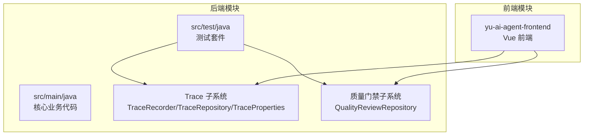
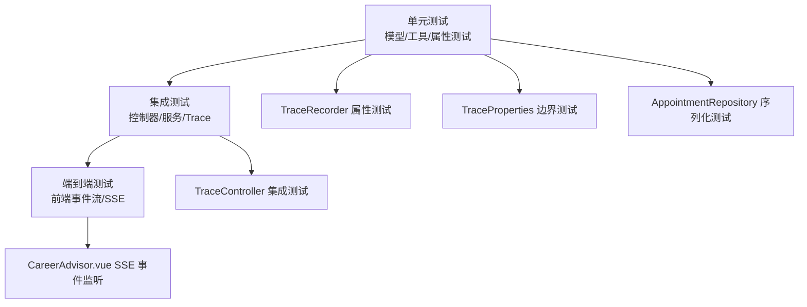
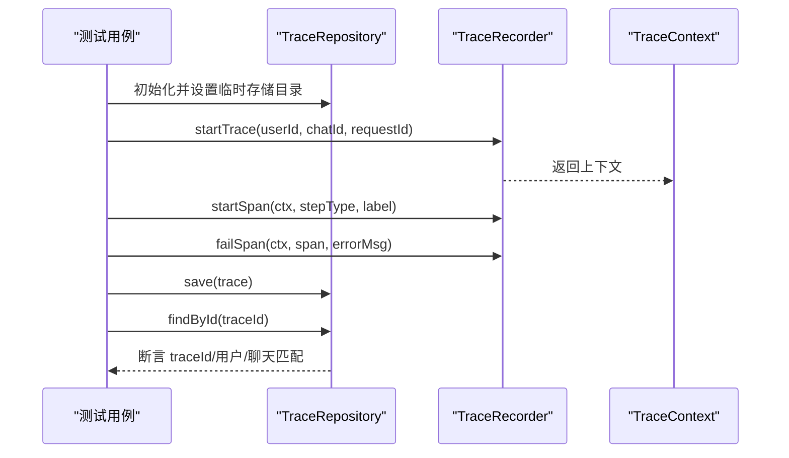
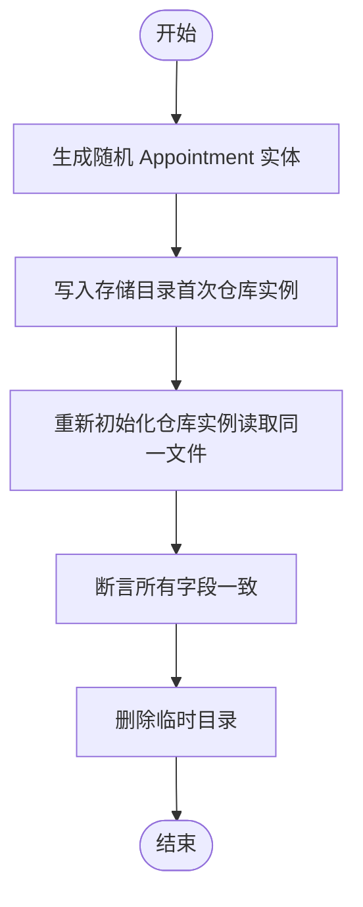
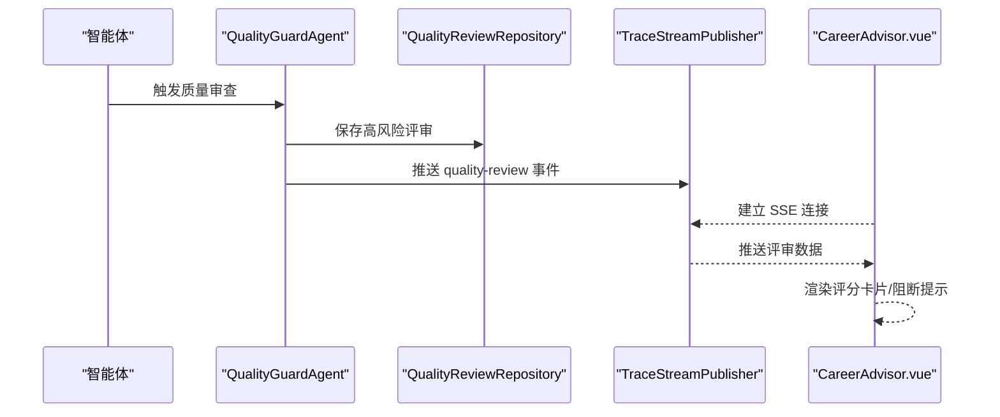
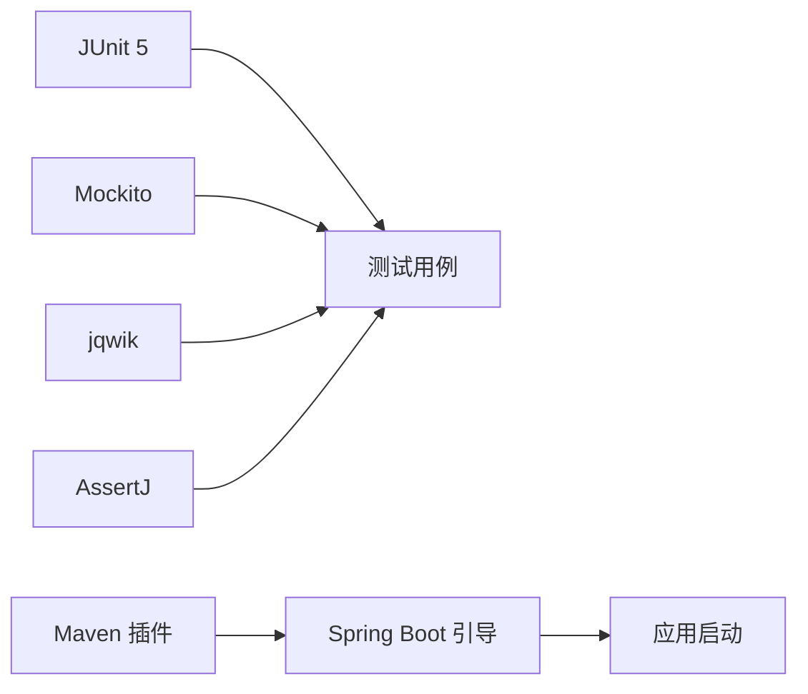

# 测试开发指南

<cite>
**本文引用的文件**
- [pom.xml](file://pom.xml)
- [yu-image-search-mcp-server/pom.xml](file://yu-image-search-mcp-server/pom.xml)
- [src/test/java/com/yupi/yuaiagent/trace/TraceControllerTest.java](file://src/test/java/com/yupi/yuaiagent/trace/TraceControllerTest.java)
- [src/test/java/com/yupi/yuaiagent/trace/TraceRecorderPropertyTest.java](file://src/test/java/com/yupi/yuaiagent/trace/TraceRecorderPropertyTest.java)
- [src/test/java/com/yupi/yuaiagent/trace/TraceRepositoryPropertyTest.java](file://src/test/java/com/yupi/yuaiagent/trace/TraceRepositoryPropertyTest.java)
- [src/test/java/com/yupi/yuaiagent/trace/TracePropertiesClampPropertyTest.java](file://src/test/java/com/yupi/yuaiagent/trace/TracePropertiesClampPropertyTest.java)
- [src/test/java/com/yupi/yuaiagent/repository/AppointmentRepositoryPropertyTest.java](file://src/test/java/com/yupi/yuaiagent/repository/AppointmentRepositoryPropertyTest.java)
- [src/main/java/com/yupi/yuaiagent/trace/TraceRecorder.java](file://src/main/java/com/yupi/yuaiagent/trace/TraceRecorder.java)
- [src/main/java/com/yupi/yuaiagent/trace/TraceRepository.java](file://src/main/java/com/yupi/yuaiagent/trace/TraceRepository.java)
- [src/main/java/com/yupi/yuaiagent/trace/TraceProperties.java](file://src/main/java/com/yupi/yuaiagent/trace/TraceProperties.java)
- [src/main/java/com/yupi/yuaiagent/trace/model/ExecutionTrace.java](file://src/main/java/com/yupi/yuaiagent/trace/model/ExecutionTrace.java)
- [src/main/java/com/yupi/yuaiagent/trace/model/TraceSpan.java](file://src/main/java/com/yupi/yuaiagent/trace/model/TraceSpan.java)
- [src/main/java/com/yupi/yuaiagent/trace/TraceContext.java](file://src/main/java/com/yupi/yuaiagent/trace/TraceContext.java)
- [src/main/java/com/yupi/yuaiagent/trace/TraceConstants.java](file://src/main/java/com/yupi/yuaiagent/trace/TraceConstants.java)
- [src/main/java/com/yupi/yuaiagent/trace/TraceStreamPublisher.java](file://src/main/java/com/yupi/yuaiagent/trace/TraceStreamPublisher.java)
- [src/main/java/com/yupi/yuaiagent/quality/QualityReviewRepository.java](file://src/main/java/com/yupi/yuaiagent/quality/QualityReviewRepository.java)
- [yu-ai-agent-frontend/src/views/CareerAdvisor.vue](file://yu-ai-agent-frontend/src/views/CareerAdvisor.vue)
- [docs/plan-quality-guard.md](file://docs/plan-quality-guard.md)
</cite>

## 目录
1. [引言](#引言)
2. [项目结构](#项目结构)
3. [核心组件](#核心组件)
4. [架构总览](#架构总览)
5. [详细组件分析](#详细组件分析)
6. [依赖分析](#依赖分析)
7. [性能考量](#性能考量)
8. [故障排查指南](#故障排查指南)
9. [结论](#结论)
10. [附录](#附录)

## 引言
本指南面向开发者与测试工程师，系统阐述本项目的测试体系与最佳实践，覆盖单元测试、属性测试（基于 jqwik）、集成测试与端到端测试的编写方法。重点包括：
- JUnit 5 与 Mockito 的使用范式
- 测试数据准备与隔离策略
- 测试金字塔在本项目中的落地：单元层（模型与工具）、集成层（控制器与服务）、E2E 层（前端与后端事件流）
- 覆盖率与质量门禁建议
- 智能体测试、工作流测试、NLU 测试的方法论
- TDD 实践路径与推荐节奏

## 项目结构
项目采用多模块 Maven 结构，核心后端位于 src/main 与 src/test 下，前端位于 yu-ai-agent-frontend。测试覆盖了 trace（执行轨迹）、repository（持久化）、tools（工具集）、agent（智能体）等多个领域。

图表来源
- [pom.xml](file://pom.xml)
- [yu-image-search-mcp-server/pom.xml](file://yu-image-search-mcp-server/pom.xml)

章节来源
- [pom.xml](file://pom.xml)
- [yu-image-search-mcp-server/pom.xml](file://yu-image-search-mcp-server/pom.xml)

## 核心组件
- Trace 执行轨迹：负责记录智能体运行过程中的步骤、状态与元数据，支持属性测试与集成测试。
- Repository 持久化：面向 JSON 文件的简单存储，用于验证序列化/反序列化与边界条件。
- 工具集测试：覆盖文件操作、PDF 生成、终端命令、网页抓取与搜索等外部交互。
- 质量门禁：在执行轨迹基础上，记录高风险评审，支持前端实时展示。

章节来源
- [src/main/java/com/yupi/yuaiagent/trace/TraceRecorder.java](file://src/main/java/com/yupi/yuaiagent/trace/TraceRecorder.java)
- [src/main/java/com/yupi/yuaiagent/trace/TraceRepository.java](file://src/main/java/com/yupi/yuaiagent/trace/TraceRepository.java)
- [src/main/java/com/yupi/yuaiagent/trace/TraceProperties.java](file://src/main/java/com/yupi/yuaiagent/trace/TraceProperties.java)
- [src/main/java/com/yupi/yuaiagent/quality/QualityReviewRepository.java](file://src/main/java/com/yupi/yuaiagent/quality/QualityReviewRepository.java)

## 架构总览
下图展示了测试金字塔在本项目中的映射关系：单元层（模型与工具）、集成层（控制器与服务）、E2E 层（前端与后端事件流）。

图表来源
- [src/test/java/com/yupi/yuaiagent/trace/TraceRecorderPropertyTest.java](file://src/test/java/com/yupi/yuaiagent/trace/TraceRecorderPropertyTest.java)
- [src/test/java/com/yupi/yuaiagent/trace/TracePropertiesClampPropertyTest.java](file://src/test/java/com/yupi/yuaiagent/trace/TracePropertiesClampPropertyTest.java)
- [src/test/java/com/yupi/yuaiagent/repository/AppointmentRepositoryPropertyTest.java](file://src/test/java/com/yupi/yuaiagent/repository/AppointmentRepositoryPropertyTest.java)
- [src/test/java/com/yupi/yuaiagent/trace/TraceControllerTest.java](file://src/test/java/com/yupi/yuaiagent/trace/TraceControllerTest.java)
- [yu-ai-agent-frontend/src/views/CareerAdvisor.vue](file://yu-ai-agent-frontend/src/views/CareerAdvisor.vue)

## 详细组件分析

### Trace 执行轨迹测试
- 属性测试（jqwik）：覆盖 traceId 唯一性、错误信息长度限制、metadata 键长度限制等。
- 集成测试（MockMvc）：验证控制器在真实 TraceRepository 上的行为，结合临时目录隔离文件存储。
- 持久化测试：保存与查询往返一致性校验，确保 JSON 序列化/反序列化正确。

图表来源
- [src/test/java/com/yupi/yuaiagent/trace/TraceControllerTest.java](file://src/test/java/com/yupi/yuaiagent/trace/TraceControllerTest.java)
- [src/test/java/com/yupi/yuaiagent/trace/TraceRepositoryPropertyTest.java](file://src/test/java/com/yupi/yuaiagent/trace/TraceRepositoryPropertyTest.java)
- [src/main/java/com/yupi/yuaiagent/trace/TraceRepository.java](file://src/main/java/com/yupi/yuaiagent/trace/TraceRepository.java)
- [src/main/java/com/yupi/yuaiagent/trace/TraceRecorder.java](file://src/main/java/com/yupi/yuaiagent/trace/TraceRecorder.java)

章节来源
- [src/test/java/com/yupi/yuaiagent/trace/TraceRecorderPropertyTest.java](file://src/test/java/com/yupi/yuaiagent/trace/TraceRecorderPropertyTest.java)
- [src/test/java/com/yupi/yuaiagent/trace/TracePropertiesClampPropertyTest.java](file://src/test/java/com/yupi/yuaiagent/trace/TracePropertiesClampPropertyTest.java)
- [src/test/java/com/yupi/yuaiagent/trace/TraceRepositoryPropertyTest.java](file://src/test/java/com/yupi/yuaiagent/trace/TraceRepositoryPropertyTest.java)
- [src/test/java/com/yupi/yuaiagent/trace/TraceControllerTest.java](file://src/test/java/com/yupi/yuaiagent/trace/TraceControllerTest.java)

### Repository 持久化测试（Appointment）
- 使用反射注入临时存储目录，绕过 Spring 注入，确保每次测试使用独立文件系统。
- 生成器生成随机 Appointment 实体，覆盖字段齐全与空值场景，验证往返一致性与清理逻辑。

图表来源
- [src/test/java/com/yupi/yuaiagent/repository/AppointmentRepositoryPropertyTest.java](file://src/test/java/com/yupi/yuaiagent/repository/AppointmentRepositoryPropertyTest.java)
- [src/main/java/com/yupi/yuaiagent/repository/AppointmentRepository.java](file://src/main/java/com/yupi/yuaiagent/repository/AppointmentRepository.java)

章节来源
- [src/test/java/com/yupi/yuaiagent/repository/AppointmentRepositoryPropertyTest.java](file://src/test/java/com/yupi/yuaiagent/repository/AppointmentRepositoryPropertyTest.java)

### 工具集测试（文件、PDF、终端、抓取、搜索）
- 使用 Mockito 模拟外部依赖，隔离文件系统与网络请求。
- 验证异常处理、权限控制与返回值格式。
- 建议为每个工具编写独立单元测试，并在需要时进行集成测试。

章节来源
- [src/test/java/com/yupi/yuaiagent/tools/FileOperationToolTest.java](file://src/test/java/com/yupi/yuaiagent/tools/FileOperationToolTest.java)
- [src/test/java/com/yupi/yuaiagent/tools/PDFGenerationToolTest.java](file://src/test/java/com/yupi/yuaiagent/tools/PDFGenerationToolTest.java)
- [src/test/java/com/yupi/yuaiagent/tools/TerminalOperationToolTest.java](file://src/test/java/com/yupi/yuaiagent/tools/TerminalOperationToolTest.java)
- [src/test/java/com/yupi/yuaiagent/tools/WebScrapingToolTest.java](file://src/test/java/com/yupi/yuaiagent/tools/WebScrapingToolTest.java)
- [src/test/java/com/yupi/yuaiagent/tools/WebSearchToolTest.java](file://src/test/java/com/yupi/yuaiagent/tools/WebSearchToolTest.java)

### 质量门禁与前端事件流
- 后端通过 QualityReviewRepository 仅持久化高风险评审，其余记录于执行轨迹。
- TraceStreamPublisher 推送 SSE 事件，前端 CareerAdvisor.vue 监听 quality-review 事件并渲染评分卡片。
- 文档中明确了质量门禁的阶段划分与与执行轨迹的集成方式。

图表来源
- [src/main/java/com/yupi/yuaiagent/quality/QualityReviewRepository.java](file://src/main/java/com/yupi/yuaiagent/quality/QualityReviewRepository.java)
- [src/main/java/com/yupi/yuaiagent/trace/TraceStreamPublisher.java](file://src/main/java/com/yupi/yuaiagent/trace/TraceStreamPublisher.java)
- [yu-ai-agent-frontend/src/views/CareerAdvisor.vue](file://yu-ai-agent-frontend/src/views/CareerAdvisor.vue)
- [docs/plan-quality-guard.md](file://docs/plan-quality-guard.md)

章节来源
- [src/main/java/com/yupi/yuaiagent/quality/QualityReviewRepository.java](file://src/main/java/com/yupi/yuaiagent/quality/QualityReviewRepository.java)
- [yu-ai-agent-frontend/src/views/CareerAdvisor.vue](file://yu-ai-agent-frontend/src/views/CareerAdvisor.vue)
- [docs/plan-quality-guard.md](file://docs/plan-quality-guard.md)

## 依赖分析
- 测试框架与工具链
  - JUnit 5：用于单元测试与集成测试
  - Mockito：用于模拟外部依赖与内部服务
  - jqwik：用于属性测试（快速生成边界与随机输入）
  - AssertJ：用于流畅断言
- Maven 插件
  - spring-boot-maven-plugin：打包与引导
  - maven-compiler-plugin：注解处理器（如 Lombok）

图表来源
- [pom.xml](file://pom.xml)

章节来源
- [pom.xml](file://pom.xml)

## 性能考量
- 单元测试应保持无外部依赖，优先使用内存或本地临时目录，避免磁盘与网络 IO。
- 属性测试（jqwik）通过大量随机输入快速发现边界问题，建议在 CI 中分批运行，避免单次耗时过长。
- 集成测试尽量使用最小化依赖（如 MockMvc），必要时使用临时目录隔离文件 IO。
- 前端 E2E 测试建议聚焦关键事件流（SSE 事件、质量评分卡片渲染），减少端到端复杂度。

## 故障排查指南
- Trace 控制器测试失败
  - 检查临时目录是否正确注入与清理
  - 确认 TraceRepository 初始化与存储路径
- 属性测试不稳定
  - 检查生成器是否覆盖边界（空字符串、超长字符串、负数）
  - 确保断言包含原始输入值以便定位问题
- 前端无法接收 SSE 事件
  - 检查后端事件推送是否启用
  - 确认前端 EventSource 连接与事件类型匹配

章节来源
- [src/test/java/com/yupi/yuaiagent/trace/TraceControllerTest.java](file://src/test/java/com/yupi/yuaiagent/trace/TraceControllerTest.java)
- [src/test/java/com/yupi/yuaiagent/trace/TraceRecorderPropertyTest.java](file://src/test/java/com/yupi/yuaiagent/trace/TraceRecorderPropertyTest.java)
- [yu-ai-agent-frontend/src/views/CareerAdvisor.vue](file://yu-ai-agent-frontend/src/views/CareerAdvisor.vue)

## 结论
本项目的测试体系以“单元+属性+集成+E2E”四层金字塔为核心，结合 jqwik 的属性测试与 Mockito 的模拟能力，实现了对关键路径（执行轨迹、持久化、工具集、质量门禁）的全面覆盖。建议在持续集成中引入覆盖率统计与质量门禁，确保新增功能与修复均满足既定标准。

## 附录

### 测试金字塔与编写策略
- 单元测试（模型/工具/属性测试）
  - 目标：快速反馈、高可维护性
  - 方法：使用 jqwik 生成边界输入；使用 AssertJ 流畅断言；使用 Mockito 模拟外部依赖
- 集成测试（控制器/服务/Trace）
  - 目标：验证组件协作与配置
  - 方法：使用 MockMvc；注入真实但隔离的存储（临时目录）
- 端到端测试（前端事件流/SSE）
  - 目标：验证用户可见行为
  - 方法：监听 SSE 事件，断言 UI 更新与交互

### 覆盖率与质量门禁建议
- 覆盖率目标（建议）
  - 行为覆盖率：≥80%
  - 分支覆盖率：≥70%
  - 特别关注：执行轨迹、质量门禁、工具集、持久化模块
- 质量门禁
  - 在 CI 中执行测试套件，失败即阻断
  - 对高风险评审（HIGH/CRITICAL）触发告警与阻断流程

### 智能体测试、工作流测试、NLU 测试方法
- 智能体测试
  - 使用 Mockito 模拟外部工具与 LLM 调用
  - 通过 TraceRecorder 记录执行步骤，便于回溯与断言
- 工作流测试
  - 使用 TraceContext/TraceSpan 组装工作流节点，断言状态流转
- NLU 测试
  - 使用属性测试覆盖意图识别、歧义检测、上下文切换等边界

### TDD 实践指导
- 红-绿-重构三步法
  - 先编写失败的测试（红）
  - 编写最小实现使其通过（绿）
  - 重构代码与测试，保持简洁与可读
- 建议节奏
  - 每日站会同步测试进度
  - 每个功能模块先写单元/属性测试，再写集成测试，最后写 E2E