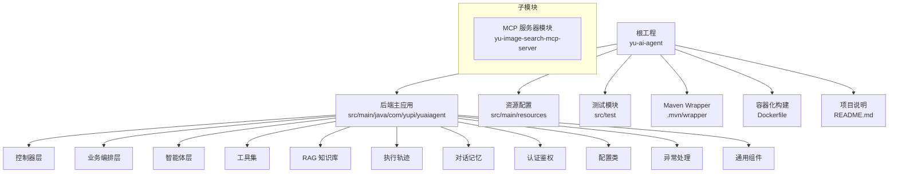
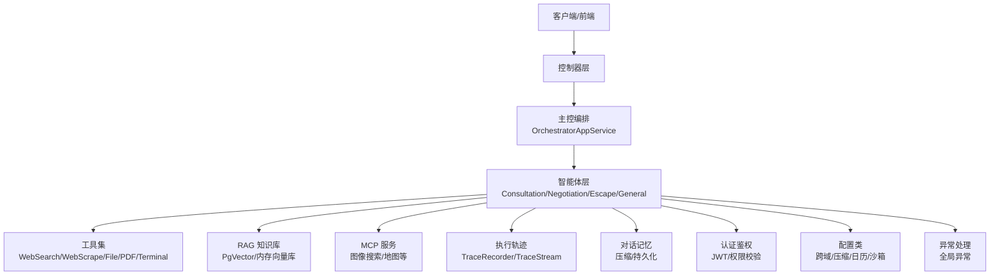

# 项目结构与配置

<cite>
**本文引用的文件**
- [pom.xml](file://pom.xml)
- [AiAgentApplication.java](file://src/main/java/com/yupi/yuaiagent/AiAgentApplication.java)
- [application.yml](file://src/main/resources/application.yml)
- [application-local.yml.example](file://src/main/resources/application-local.yml.example)
- [application-prod.yml](file://src/main/resources/application-prod.yml)
- [mcp-servers.json](file://src/main/resources/mcp-servers.json)
- [Dockerfile](file://Dockerfile)
- [.mvn\wrapper\maven-wrapper.properties](file://.mvn/wrapper/maven-wrapper.properties)
- [yu-image-search-mcp-server\pom.xml](file://yu-image-search-mcp-server/pom.xml)
- [yu-image-search-mcp-server\src\main\resources\application.yml](file://yu-image-search-mcp-server/src/main/resources/application.yml)
- [yu-image-search-mcp-server\src\main\resources\application-stdio.yml](file://yu-image-search-mcp-server/src/main/resources/application-stdio.yml)
- [yu-image-search-mcp-server\src\main\resources\application-sse.yml](file://yu-image-search-mcp-server/src/main/resources/application-sse.yml)
- [README.md](file://README.md)
</cite>

## 目录
1. [简介](#简介)
2. [项目结构](#项目结构)
3. [核心组件](#核心组件)
4. [架构总览](#架构总览)
5. [详细组件分析](#详细组件分析)
6. [依赖分析](#依赖分析)
7. [性能考虑](#性能考虑)
8. [故障排查指南](#故障排查指南)
9. [结论](#结论)
10. [附录](#附录)

## 简介
本项目是一个融合长链推理与多智能体协作的AI应用，围绕“职场生存智囊”主题，提供多轮对话、RAG知识库、工具调用、MCP服务集成、预约咨询、对话记忆压缩、执行轨迹追踪等能力。后端采用Spring Boot 3 + Java 21，AI框架以Spring AI为主，支持阿里百炼（DashScope）与Ollama两种大模型接入；向量存储采用PgVector；前端为Vue生态。项目同时提供本地开发与生产环境的配置差异说明，并给出Maven Wrapper与构建流程。

## 项目结构
项目采用标准的Spring Boot多模块布局，根工程负责后端主应用与通用配置，另有独立的MCP服务器模块用于扩展工具能力。前端位于独立目录，便于前后端分离开发与部署。

图表来源
- [README.md:145-376](file://README.md#L145-L376)
- [AiAgentApplication.java:11-16](file://src/main/java/com/yupi/yuaiagent/AiAgentApplication.java#L11-L16)

章节来源
- [README.md:145-376](file://README.md#L145-L376)

## 核心组件
- 启动类与自动配置排除
  - 启动类显式排除了数据源自动配置与Ollama自动配置，以避免在仅使用DashScope时产生Bean冲突，并便于本地无数据库开发。
- 配置文件层次
  - application.yml为默认配置，application-local.yml.example为本地开发样例，application-prod.yml为生产覆盖样例。
- Maven Wrapper
  - 使用Maven Wrapper确保团队成员使用一致的Maven版本，简化环境搭建。
- Dockerfile
  - 基于Maven官方镜像构建，打包后以prod配置启动，暴露应用端口。

章节来源
- [AiAgentApplication.java:11-16](file://src/main/java/com/yupi/yuaiagent/AiAgentApplication.java#L11-L16)
- [application.yml:4-5](file://src/main/resources/application.yml#L4-L5)
- [application-local.yml.example:1-31](file://src/main/resources/application-local.yml.example#L1-L31)
- [application-prod.yml:1-2](file://src/main/resources/application-prod.yml#L1-L2)
- [.mvn\wrapper\maven-wrapper.properties:17-19](file://.mvn/wrapper/maven-wrapper.properties#L17-L19)
- [Dockerfile:1-16](file://Dockerfile#L1-L16)

## 架构总览
后端整体采用分层架构：控制器层接收HTTP请求，业务编排层进行路由与编排，智能体层负责意图识别与任务执行，工具层提供外部能力调用，RAG层提供知识检索，执行轨迹与对话记忆保障可观测性与性能优化。

图表来源
- [README.md:197-375](file://README.md#L197-L375)

## 详细组件分析

### 依赖与版本管理（pom.xml）
- 父POM与Java版本
  - 父POM继承spring-boot-starter-parent，Java版本固定为21。
- 依赖管理（BOM）
  - 通过dependencyManagement引入spring-ai-alibaba-bom与spring-ai-bom，统一管理Spring AI相关依赖版本。
- 核心依赖
  - Web起步依赖、DashScope SDK与Spring AI Alibaba起步依赖、Ollama起步依赖、Markdown文档读取、JDBC与PgVector存储、Spring AI MCP客户端与Advisor、LangChain4j DashScope集成、结构化输出Schema生成、Kryo序列化、Jsoup、iText PDF、Hutool、Knife4j OpenAPI、Lombok、测试与jqwik。
- 仓库配置
  - 配置Spring里程碑与快照仓库，以及Central Portal快照仓库，确保能拉取到最新Spring AI相关依赖。
- 插件
  - maven-compiler-plugin配置Lombok注解处理器；spring-boot-maven-plugin排除Lombok，避免打包进依赖。

章节来源
- [pom.xml:5-49](file://pom.xml#L5-L49)
- [pom.xml:50-170](file://pom.xml#L50-L170)
- [pom.xml:172-200](file://pom.xml#L172-L200)
- [pom.xml:202-231](file://pom.xml#L202-L231)

### 配置文件详解（application.yml）
- 基础配置
  - 应用名称、激活profiles（默认local）、服务端口与上下文路径。
- AI服务配置
  - DashScope：通过环境变量注入API Key，指定多模态模型与启用多模态模式。
  - Ollama：本地推理服务基础地址与模型。
  - MCP客户端：注释掉的示例展示了SSE与stdio两种连接方式的配置要点。
  - 向量存储：注释掉的示例展示了PgVector索引类型、维度、距离类型与批量大小等参数。
- OpenAPI文档
  - springdoc与knife4j配置，扫描控制器包，暴露Swagger UI与OpenAPI文档路径。
- 外部服务与安全
  - SearchAPI：通过环境变量注入API Key。
  - JWT：通过环境变量注入密钥，开发默认值便于本地调试。
- 日历服务
  - provider默认飞书，可切换钉钉；分别配置应用凭证与基础URL。
- 存储与缓存
  - 预约记录、会话、交付物、用户画像、执行轨迹等存储目录均支持环境变量覆盖。
- 记忆压缩
  - Token阈值、对话轮数阈值、保留最近N轮等参数可配置。
- 治理与沙箱
  - 沙箱基础目录、超时、输出大小限制、是否强制Docker、默认镜像与超时；MCP信任等级与开关。
- 日志
  - 调整Spring AI与权限/访问/沙箱/MCP相关日志级别，便于调试。

章节来源
- [application.yml:1-154](file://src/main/resources/application.yml#L1-L154)

### 本地开发与生产配置差异
- 本地开发（application-local.yml.example）
  - DashScope与SearchAPI Key示例；JWT密钥本地示例；日历服务provider可选填。
  - 本地运行时复制为application-local.yml，避免提交至仓库。
- 生产环境（application-prod.yml）
  - 用于覆盖application.yml中的敏感或差异化配置，注意不要提交真实密钥。
- 环境变量优先级
  - application.yml中大量配置项通过${VAR:默认值}形式从环境变量注入，生产环境建议通过环境变量注入密钥与敏感参数，避免硬编码。

章节来源
- [application-local.yml.example:1-31](file://src/main/resources/application-local.yml.example#L1-L31)
- [application-prod.yml:1-2](file://src/main/resources/application-prod.yml#L1-L2)
- [application.yml:13-68](file://src/main/resources/application.yml#L13-L68)

### Maven Wrapper与构建流程
- Maven Wrapper
  - .mvn/wrapper/maven-wrapper.properties指定了wrapper版本与Maven分发包URL，确保团队成员使用一致的Maven版本。
- 构建流程（根工程）
  - 使用Maven插件进行编译与打包；spring-boot-maven-plugin负责生成可执行Jar。
- Docker构建
  - Dockerfile基于maven:3.9-amazoncorretto-21镜像，复制pom与源码，执行clean package（跳过测试），暴露端口并以--spring.profiles.active=prod启动。

章节来源
- [.mvn\wrapper\maven-wrapper.properties:17-19](file://.mvn/wrapper/maven-wrapper.properties#L17-L19)
- [pom.xml:172-200](file://pom.xml#L172-L200)
- [Dockerfile:1-16](file://Dockerfile#L1-L16)

### MCP 服务器模块（yu-image-search-mcp-server）
- 模块职责
  - 提供图像搜索MCP服务，作为外部工具被主应用调用。
- 配置
  - application.yml：激活profiles（sse/stdio），设置端口。
  - application-stdio.yml：声明MCP服务类型为SYNC，禁用Web应用类型，关闭Banner。
  - application-sse.yml：声明MCP服务类型为SYNC，启用SSE。
- 与主应用的集成
  - mcp-servers.json中定义了各MCP服务的命令、参数与环境变量，主应用可通过Spring AI MCP客户端连接。

章节来源
- [yu-image-search-mcp-server\pom.xml:1-121](file://yu-image-search-mcp-server/pom.xml#L1-L121)
- [yu-image-search-mcp-server\src\main\resources\application.yml:1-7](file://yu-image-search-mcp-server/src/main/resources/application.yml#L1-L7)
- [yu-image-search-mcp-server\src\main\resources\application-stdio.yml:1-13](file://yu-image-search-mcp-server/src/main/resources/application-stdio.yml#L1-L13)
- [yu-image-search-mcp-server\src\main\resources\application-sse.yml:1-10](file://yu-image-search-mcp-server/src/main/resources/application-sse.yml#L1-L10)
- [mcp-servers.json:1-25](file://src/main/resources/mcp-servers.json#L1-L25)

### 启动类与自动配置排除
- 排除DataSourceAutoConfiguration：便于本地无数据库开发与部署。
- 排除OllamaChatAutoConfiguration：避免与DashScope ChatModel Bean冲突。
- main方法直接启动SpringApplication。

章节来源
- [AiAgentApplication.java:11-16](file://src/main/java/com/yupi/yuaiagent/AiAgentApplication.java#L11-L16)

## 依赖分析
- 组件耦合与内聚
  - 控制器层与业务编排层低耦合，通过服务接口交互；智能体层通过工具与RAG模块解耦外部能力。
- 外部依赖
  - DashScope与Ollama提供多模型接入；PgVector提供向量检索；MCP协议扩展工具能力；Knife4j提供接口文档；Kryo用于高性能序列化；Jsoup与iText用于网页抓取与PDF生成。
- 循环依赖
  - 通过分层与接口隔离，避免循环依赖；工具与MCP服务通过客户端抽象解耦。

```mermaid
graph TB
app["AiAgentApplication"] --> web["spring-boot-starter-web"]
app --> dashscope["dashscope-sdk-java"]
app --> ai_alibaba["spring-ai-alibaba-starter-dashscope"]
app --> ai_ollama["spring-ai-starter-model-ollama"]
app --> jdbc["spring-boot-starter-jdbc"]
app --> pg["postgresql"]
app --> pgvector["spring-ai-pgvector-store"]
app --> mcp_client["spring-ai-starter-mcp-client"]
app --> advisors["spring-ai-advisors-vector-store"]
app --> langchain4j["langchain4j-community-dashscope"]
app --> jsonschema["jsonschema-generator"]
app --> kryo["kryo"]
app --> jsoup["jsoup"]
app --> itext["itext-core/font-asian"]
app --> hutool["hutool-all"]
app --> knife4j["knife4j-openapi3-jakarta-spring-boot-starter"]
app --> lombok["lombok"]
app --> test["spring-boot-starter-test"]
app --> jqwik["jqwik"]
```

图表来源
- [pom.xml:50-170](file://pom.xml#L50-L170)

章节来源
- [pom.xml:50-170](file://pom.xml#L50-L170)

## 性能考虑
- 对话记忆压缩
  - 通过Token阈值、轮数阈值与最近N轮保留策略，在长对话场景降低上下文开销。
- 向量检索
  - PgVector索引类型、维度与距离类型可按数据规模与精度要求调整；批量大小影响入库吞吐。
- 沙箱与资源限制
  - 设置超时与输出大小限制，防止工具执行导致资源耗尽；生产环境建议启用Docker沙箱。
- 日志级别
  - 适度降低Spring AI日志级别，减少IO开销；在调试阶段提升级别以定位问题。

章节来源
- [application.yml:121-139](file://src/main/resources/application.yml#L121-L139)
- [application.yml:35-40](file://src/main/resources/application.yml#L35-L40)

## 故障排查指南
- 启动类排除配置
  - 若出现数据源或ChatModel Bean冲突，确认是否正确排除了DataSourceAutoConfiguration与OllamaChatAutoConfiguration。
- AI服务Key与模型
  - 检查DashScope API Key与Ollama基础URL是否正确；多模态模型需启用相应选项。
- MCP连接
  - 确认MCP服务端口与连接方式（SSE/stdio）与mcp-servers.json一致；stdio模式需禁用Web应用类型。
- 存储目录
  - 确认各存储目录（预约/会话/交付物/画像/轨迹）存在且具备读写权限。
- 环境变量
  - 生产环境务必通过环境变量注入密钥与敏感参数，避免硬编码。

章节来源
- [AiAgentApplication.java:11-16](file://src/main/java/com/yupi/yuaiagent/AiAgentApplication.java#L11-L16)
- [application.yml:13-68](file://src/main/resources/application.yml#L13-L68)
- [mcp-servers.json:1-25](file://src/main/resources/mcp-servers.json#L1-L25)

## 结论
本项目以Spring Boot与Spring AI为核心，结合DashScope与Ollama实现多模型接入，通过PgVector与RAG构建知识检索能力，借助MCP协议扩展外部工具，配合智能体编排与执行轨迹追踪，形成完整的AI应用解决方案。通过环境变量注入与多配置文件层次，兼顾本地开发与生产部署的安全与灵活性。建议在生产环境中启用Docker沙箱、严格管理密钥与敏感参数，并根据业务规模调优向量检索与记忆压缩策略。

## 附录

### 本地开发快速理解指南
- 目录与职责
  - src/main/java/com/yupi/yuaiagent：后端代码主体，按层划分（controller/service/agent/tools/rag/trace等）。
  - src/main/resources：配置文件与静态资源，包含application.yml、本地样例与MCP服务器配置。
  - yu-image-search-mcp-server：独立MCP服务模块，提供图像搜索能力。
  - ai-agent-frontend：前端工程，与后端通过/api路径交互。
- 快速启动步骤
  - 准备DashScope与SearchAPI Key，复制application-local.yml.example为application-local.yml并填入密钥。
  - 如需本地Ollama，确保本地服务可用并在application.yml中配置基础URL与模型。
  - 运行Maven命令打包并启动（或使用Maven Wrapper）。
  - 访问Swagger UI查看接口文档。

章节来源
- [README.md:145-376](file://README.md#L145-L376)
- [application-local.yml.example:1-31](file://src/main/resources/application-local.yml.example#L1-L31)