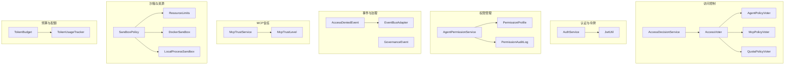
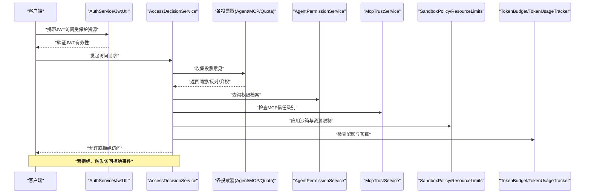
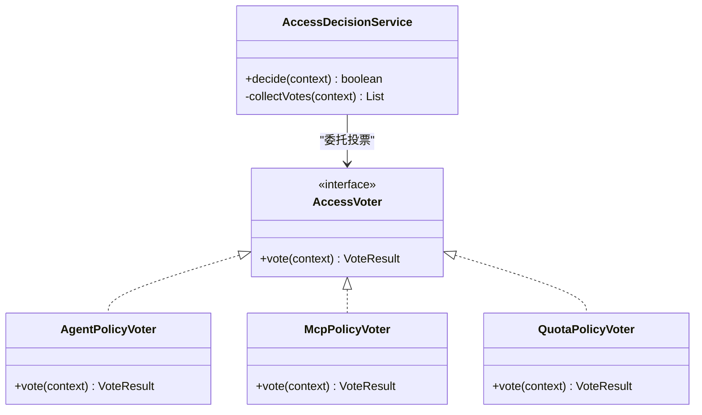
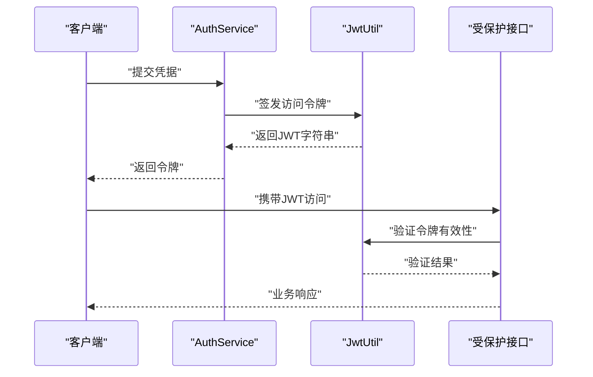
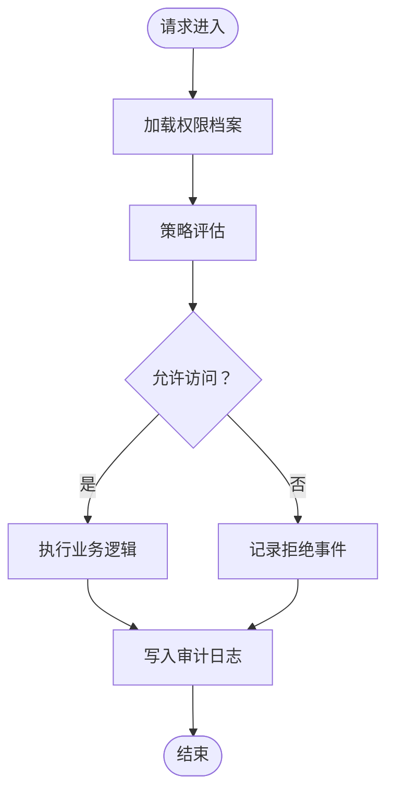
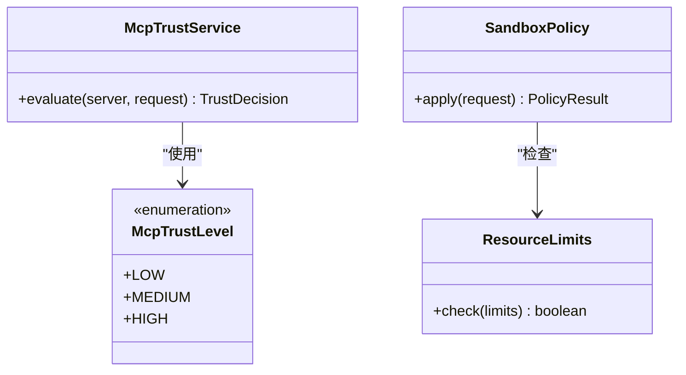
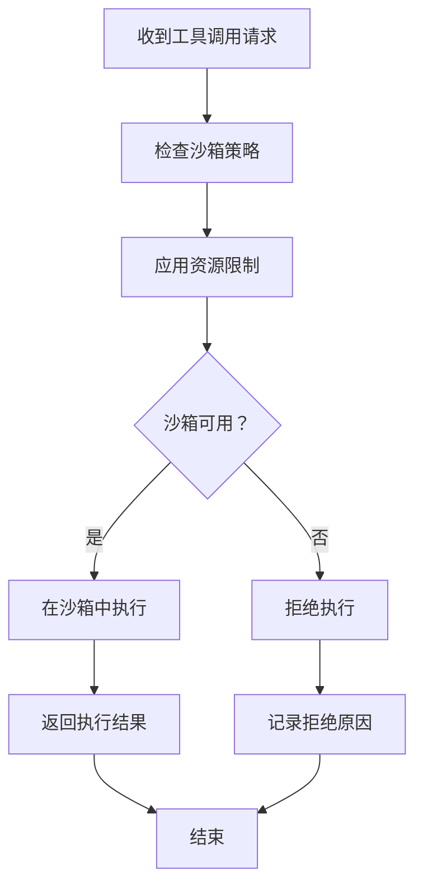
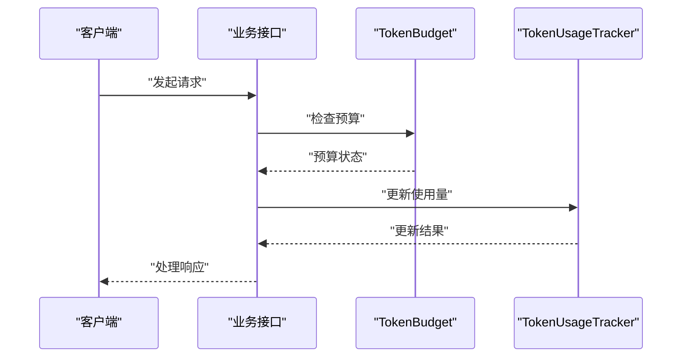
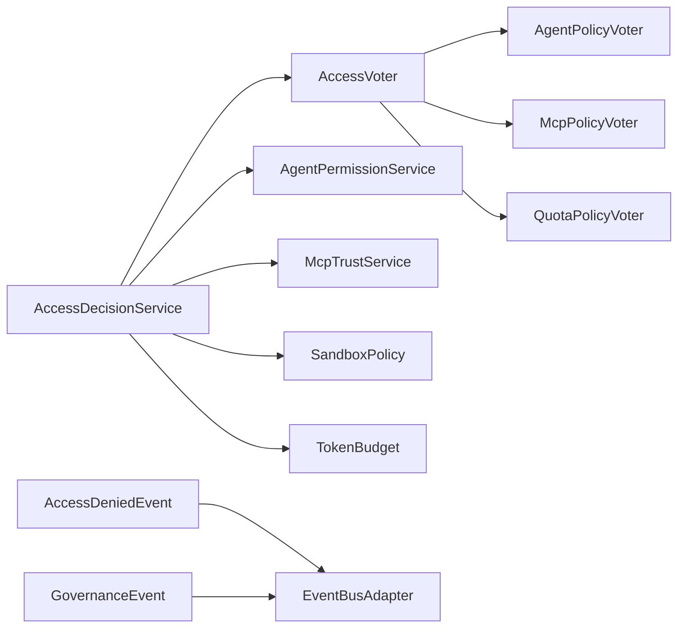

# 安全和权限

<cite>
**本文引用的文件**
- [AccessDecisionService.java](file://src/main/java/com/yupi/yuaiagent/access/AccessDecisionService.java)
- [AccessVoter.java](file://src/main/java/com/yupi/yuaiagent/access/AccessVoter.java)
- [AgentPolicyVoter.java](file://src/main/java/com/yupi/yuaiagent/access/AgentPolicyVoter.java)
- [McpPolicyVoter.java](file://src/main/java/com/yupi/yuaiagent/access/McpPolicyVoter.java)
- [QuotaPolicyVoter.java](file://src/main/java/com/yupi/yuaiagent/access/QuotaPolicyVoter.java)
- [AuthService.java](file://src/main/java/com/yupi/yuaiagent/auth/AuthService.java)
- [JwtUtil.java](file://src/main/java/com/yupi/yuaiagent/auth/JwtUtil.java)
- [AgentPermissionService.java](file://src/main/java/com/yupi/yuaiagent/permission/AgentPermissionService.java)
- [PermissionAuditLog.java](file://src/main/java/com/yupi/yuaiagent/permission/PermissionAuditLog.java)
- [PermissionProfile.java](file://src/main/java/com/yupi/yuaiagent/permission/model/PermissionProfile.java)
- [AccessDeniedEvent.java](file://src/main/java/com/yupi/yuaiagent/event/AccessDeniedEvent.java)
- [EventBusAdapter.java](file://src/main/java/com/yupi/yuaiagent/event/EventBusAdapter.java)
- [GovernanceEvent.java](file://src/main/java/com/yupi/yuaiagent/event/GovernanceEvent.java)
- [McpTrustLevel.java](file://src/main/java/com/yupi/yuaiagent/mcp/McpTrustLevel.java)
- [McpTrustService.java](file://src/main/java/com/yupi/yuaiagent/mcp/McpTrustService.java)
- [SandboxPolicy.java](file://src/main/java/com/yupi/yuaiagent/sandbox/SandboxPolicy.java)
- [ResourceLimits.java](file://src/main/java/com/yupi/yuaiagent/sandbox/ResourceLimits.java)
- [DockerSandbox.java](file://src/main/java/com/yupi/yuaiagent/sandbox/DockerSandbox.java)
- [LocalProcessSandbox.java](file://src/main/java/com/yupi/yuaiagent/sandbox/LocalProcessSandbox.java)
- [TokenBudget.java](file://src/main/java/com/yupi/yuaiagent/budget/TokenBudget.java)
- [TokenUsageTracker.java](file://src/main/java/com/yupi/yuaiagent/budget/TokenUsageTracker.java)
- [application.yml](file://src/main/resources/application.yml)
- [permissions/admin-agent.yaml](file://src/main/resources/permissions/admin-agent.yaml)
- [permissions/general-agent.yaml](file://src/main/resources/permissions/general-agent.yaml)
- [permissions/data-agent.yaml](file://src/main/resources/permissions/data-agent.yaml)
</cite>

## 目录
1. [引言](#引言)
2. [项目结构](#项目结构)
3. [核心组件](#核心组件)
4. [架构总览](#架构总览)
5. [详细组件分析](#详细组件分析)
6. [依赖关系分析](#依赖关系分析)
7. [性能考虑](#性能考虑)
8. [故障排除指南](#故障排除指南)
9. [结论](#结论)
10. [附录](#附录)

## 引言
本文件为该AI代理系统的安全与权限管理提供完整技术文档，覆盖访问决策服务、权限投票机制、策略执行系统、JWT认证、访问令牌管理、会话安全策略、智能体权限控制、MCP信任级别与资源访问限制、权限配置与角色管理、访问审计、安全事件处理与威胁检测、数据加密与隐私保护、合规实现、安全最佳实践与应急响应等。文档旨在帮助安全工程师与开发者建立统一的安全管理体系。

## 项目结构
安全与权限相关模块主要分布在以下包与资源中：
- 访问控制与决策：access 包（AccessDecisionService、AccessVoter 及其具体投票器）
- 认证与令牌：auth 包（AuthService、JwtUtil）
- 权限管理：permission 包（AgentPermissionService、PermissionProfile、PermissionAuditLog）
- 事件与治理：event 包（AccessDeniedEvent、EventBusAdapter、GovernanceEvent）
- MCP信任与策略：mcp 包（McpTrustLevel、McpTrustService）
- 沙箱与资源限制：sandbox 包（SandboxPolicy、ResourceLimits、DockerSandbox、LocalProcessSandbox）
- 预算与配额：budget 包（TokenBudget、TokenUsageTracker）
- 权限配置：resources/permissions 下的 YAML 文件
- 全局配置：application.yml

**图表来源**
- [AccessDecisionService.java:1-200](file://src/main/java/com/yupi/yuaiagent/access/AccessDecisionService.java#L1-L200)
- [AccessVoter.java:1-150](file://src/main/java/com/yupi/yuaiagent/access/AccessVoter.java#L1-L150)
- [AgentPolicyVoter.java:1-120](file://src/main/java/com/yupi/yuaiagent/access/AgentPolicyVoter.java#L1-L120)
- [McpPolicyVoter.java:1-120](file://src/main/java/com/yupi/yuaiagent/access/McpPolicyVoter.java#L1-L120)
- [QuotaPolicyVoter.java:1-120](file://src/main/java/com/yupi/yuaiagent/access/QuotaPolicyVoter.java#L1-L120)
- [AuthService.java:1-200](file://src/main/java/com/yupi/yuaiagent/auth/AuthService.java#L1-L200)
- [JwtUtil.java:1-200](file://src/main/java/com/yupi/yuaiagent/auth/JwtUtil.java#L1-L200)
- [AgentPermissionService.java:1-200](file://src/main/java/com/yupi/yuaiagent/permission/AgentPermissionService.java#L1-L200)
- [PermissionProfile.java:1-150](file://src/main/java/com/yupi/yuaiagent/permission/model/PermissionProfile.java#L1-L150)
- [PermissionAuditLog.java:1-150](file://src/main/java/com/yupi/yuaiagent/permission/PermissionAuditLog.java#L1-L150)
- [AccessDeniedEvent.java:1-120](file://src/main/java/com/yupi/yuaiagent/event/AccessDeniedEvent.java#L1-L120)
- [EventBusAdapter.java:1-150](file://src/main/java/com/yupi/yuaiagent/event/EventBusAdapter.java#L1-L150)
- [GovernanceEvent.java:1-120](file://src/main/java/com/yupi/yuaiagent/event/GovernanceEvent.java#L1-L120)
- [McpTrustLevel.java:1-120](file://src/main/java/com/yupi/yuaiagent/mcp/McpTrustLevel.java#L1-L120)
- [McpTrustService.java:1-150](file://src/main/java/com/yupi/yuaiagent/mcp/McpTrustService.java#L1-L150)
- [SandboxPolicy.java:1-200](file://src/main/java/com/yupi/yuaiagent/sandbox/SandboxPolicy.java#L1-L200)
- [ResourceLimits.java:1-150](file://src/main/java/com/yupi/yuaiagent/sandbox/ResourceLimits.java#L1-L150)
- [DockerSandbox.java:1-200](file://src/main/java/com/yupi/yuaiagent/sandbox/DockerSandbox.java#L1-L200)
- [LocalProcessSandbox.java:1-200](file://src/main/java/com/yupi/yuaiagent/sandbox/LocalProcessSandbox.java#L1-L200)
- [TokenBudget.java:1-150](file://src/main/java/com/yupi/yuaiagent/budget/TokenBudget.java#L1-L150)
- [TokenUsageTracker.java:1-150](file://src/main/java/com/yupi/yuaiagent/budget/TokenUsageTracker.java#L1-L150)

**章节来源**
- [AccessDecisionService.java:1-200](file://src/main/java/com/yupi/yuaiagent/access/AccessDecisionService.java#L1-L200)
- [AuthService.java:1-200](file://src/main/java/com/yupi/yuaiagent/auth/AuthService.java#L1-L200)
- [AgentPermissionService.java:1-200](file://src/main/java/com/yupi/yuaiagent/permission/AgentPermissionService.java#L1-L200)
- [McpTrustService.java:1-150](file://src/main/java/com/yupi/yuaiagent/mcp/McpTrustService.java#L1-L150)
- [SandboxPolicy.java:1-200](file://src/main/java/com/yupi/yuaiagent/sandbox/SandboxPolicy.java#L1-L200)
- [TokenBudget.java:1-150](file://src/main/java/com/yupi/yuaiagent/budget/TokenBudget.java#L1-L150)

## 核心组件
- 访问决策服务：负责聚合多个投票器的决策，形成最终的访问授权结果。
- 权限投票器体系：包括智能体策略投票器、MCP策略投票器、配额策略投票器，分别从不同维度评估访问请求。
- 认证与令牌：提供JWT生成、解析与校验能力，支撑会话与访问令牌管理。
- 权限管理：维护权限档案与审计日志，支持权限变更与合规追踪。
- 事件与治理：记录访问拒绝与治理事件，便于审计与告警。
- MCP信任：定义信任级别与信任服务，控制外部MCP服务器的访问范围。
- 沙箱与资源限制：通过策略与资源限制，隔离与约束工具执行环境。
- 预算与配额：跟踪令牌使用，防止资源滥用。

**章节来源**
- [AccessDecisionService.java:1-200](file://src/main/java/com/yupi/yuaiagent/access/AccessDecisionService.java#L1-L200)
- [AccessVoter.java:1-150](file://src/main/java/com/yupi/yuaiagent/access/AccessVoter.java#L1-L150)
- [AgentPolicyVoter.java:1-120](file://src/main/java/com/yupi/yuaiagent/access/AgentPolicyVoter.java#L1-L120)
- [McpPolicyVoter.java:1-120](file://src/main/java/com/yupi/yuaiagent/access/McpPolicyVoter.java#L1-L120)
- [QuotaPolicyVoter.java:1-120](file://src/main/java/com/yupi/yuaiagent/access/QuotaPolicyVoter.java#L1-L120)
- [AuthService.java:1-200](file://src/main/java/com/yupi/yuaiagent/auth/AuthService.java#L1-L200)
- [JwtUtil.java:1-200](file://src/main/java/com/yupi/yuaiagent/auth/JwtUtil.java#L1-L200)
- [AgentPermissionService.java:1-200](file://src/main/java/com/yupi/yuaiagent/permission/AgentPermissionService.java#L1-L200)
- [PermissionAuditLog.java:1-150](file://src/main/java/com/yupi/yuaiagent/permission/PermissionAuditLog.java#L1-L150)
- [McpTrustService.java:1-150](file://src/main/java/com/yupi/yuaiagent/mcp/McpTrustService.java#L1-L150)
- [SandboxPolicy.java:1-200](file://src/main/java/com/yupi/yuaiagent/sandbox/SandboxPolicy.java#L1-L200)
- [TokenBudget.java:1-150](file://src/main/java/com/yupi/yuaiagent/budget/TokenBudget.java#L1-L150)

## 架构总览
下图展示了从请求进入系统到完成访问决策与执行的总体流程，涵盖认证、权限评估、MCP信任检查、沙箱隔离与配额控制等环节。

**图表来源**
- [AccessDecisionService.java:1-200](file://src/main/java/com/yupi/yuaiagent/access/AccessDecisionService.java#L1-L200)
- [AgentPolicyVoter.java:1-120](file://src/main/java/com/yupi/yuaiagent/access/AgentPolicyVoter.java#L1-L120)
- [McpPolicyVoter.java:1-120](file://src/main/java/com/yupi/yuaiagent/access/McpPolicyVoter.java#L1-L120)
- [QuotaPolicyVoter.java:1-120](file://src/main/java/com/yupi/yuaiagent/access/QuotaPolicyVoter.java#L1-L120)
- [AgentPermissionService.java:1-200](file://src/main/java/com/yupi/yuaiagent/permission/AgentPermissionService.java#L1-L200)
- [McpTrustService.java:1-150](file://src/main/java/com/yupi/yuaiagent/mcp/McpTrustService.java#L1-L150)
- [SandboxPolicy.java:1-200](file://src/main/java/com/yupi/yuaiagent/sandbox/SandboxPolicy.java#L1-L200)
- [TokenBudget.java:1-150](file://src/main/java/com/yupi/yuaiagent/budget/TokenBudget.java#L1-L150)

## 详细组件分析

### 访问决策服务与权限投票机制
- 访问决策服务聚合多个投票器的决策，采用多数规则或特定策略形成最终授权结果。
- 投票器职责分离：
  - 智能体策略投票器：基于智能体类型、任务域与权限档案进行投票。
  - MCP策略投票器：基于MCP服务器的信任级别与访问范围进行投票。
  - 配额策略投票器：基于令牌预算与使用量进行投票。
- 投票器接口抽象，便于扩展新的策略维度。

**图表来源**
- [AccessDecisionService.java:1-200](file://src/main/java/com/yupi/yuaiagent/access/AccessDecisionService.java#L1-L200)
- [AccessVoter.java:1-150](file://src/main/java/com/yupi/yuaiagent/access/AccessVoter.java#L1-L150)
- [AgentPolicyVoter.java:1-120](file://src/main/java/com/yupi/yuaiagent/access/AgentPolicyVoter.java#L1-L120)
- [McpPolicyVoter.java:1-120](file://src/main/java/com/yupi/yuaiagent/access/McpPolicyVoter.java#L1-L120)
- [QuotaPolicyVoter.java:1-120](file://src/main/java/com/yupi/yuaiagent/access/QuotaPolicyVoter.java#L1-L120)

**章节来源**
- [AccessDecisionService.java:1-200](file://src/main/java/com/yupi/yuaiagent/access/AccessDecisionService.java#L1-L200)
- [AccessVoter.java:1-150](file://src/main/java/com/yupi/yuaiagent/access/AccessVoter.java#L1-L150)
- [AgentPolicyVoter.java:1-120](file://src/main/java/com/yupi/yuaiagent/access/AgentPolicyVoter.java#L1-L120)
- [McpPolicyVoter.java:1-120](file://src/main/java/com/yupi/yuaiagent/access/McpPolicyVoter.java#L1-L120)
- [QuotaPolicyVoter.java:1-120](file://src/main/java/com/yupi/yuaiagent/access/QuotaPolicyVoter.java#L1-L120)

### JWT认证与访问令牌管理
- 认证服务负责用户身份验证，并通过JWT工具生成与验证访问令牌。
- 令牌内容包含必要的声明信息，用于后续授权与审计。
- 建议在配置中启用HTTPS、设置合理的过期时间与刷新策略，并对敏感端点实施严格校验。

**图表来源**
- [AuthService.java:1-200](file://src/main/java/com/yupi/yuaiagent/auth/AuthService.java#L1-L200)
- [JwtUtil.java:1-200](file://src/main/java/com/yupi/yuaiagent/auth/JwtUtil.java#L1-L200)

**章节来源**
- [AuthService.java:1-200](file://src/main/java/com/yupi/yuaiagent/auth/AuthService.java#L1-L200)
- [JwtUtil.java:1-200](file://src/main/java/com/yupi/yuaiagent/auth/JwtUtil.java#L1-L200)

### 会话安全策略
- 会话生命周期应结合令牌过期、滑动过期与强制刷新策略。
- 对高风险操作建议二次确认与额外的身份验证。
- 在全局配置中统一管理会话超时、跨域与安全头策略。

**章节来源**
- [application.yml:1-200](file://src/main/resources/application.yml#L1-L200)

### 智能体权限控制与策略执行
- 权限档案定义了智能体可执行的操作边界，权限服务根据档案与当前上下文决定是否放行。
- 策略执行贯穿于访问决策流程，确保权限与业务策略一致。
- 审计日志记录每次权限变更与访问事件，支持合规追溯。

**图表来源**
- [AgentPermissionService.java:1-200](file://src/main/java/com/yupi/yuaiagent/permission/AgentPermissionService.java#L1-L200)
- [PermissionProfile.java:1-150](file://src/main/java/com/yupi/yuaiagent/permission/model/PermissionProfile.java#L1-L150)
- [PermissionAuditLog.java:1-150](file://src/main/java/com/yupi/yuaiagent/permission/PermissionAuditLog.java#L1-L150)
- [AccessDeniedEvent.java:1-120](file://src/main/java/com/yupi/yuaiagent/event/AccessDeniedEvent.java#L1-L120)

**章节来源**
- [AgentPermissionService.java:1-200](file://src/main/java/com/yupi/yuaiagent/permission/AgentPermissionService.java#L1-L200)
- [PermissionProfile.java:1-150](file://src/main/java/com/yupi/yuaiagent/permission/model/PermissionProfile.java#L1-L150)
- [PermissionAuditLog.java:1-150](file://src/main/java/com/yupi/yuaiagent/permission/PermissionAuditLog.java#L1-L150)
- [AccessDeniedEvent.java:1-120](file://src/main/java/com/yupi/yuaiagent/event/AccessDeniedEvent.java#L1-L120)

### MCP信任级别与资源访问限制
- MCP信任级别定义了外部服务器的可信度等级，信任级别越高，可执行的操作越广。
- 信任服务根据MCP服务器的配置与当前请求动态评估访问范围。
- 资源访问限制通过沙箱策略与资源上限，确保工具调用不会越界。

**图表来源**
- [McpTrustLevel.java:1-120](file://src/main/java/com/yupi/yuaiagent/mcp/McpTrustLevel.java#L1-L120)
- [McpTrustService.java:1-150](file://src/main/java/com/yupi/yuaiagent/mcp/McpTrustService.java#L1-L150)
- [SandboxPolicy.java:1-200](file://src/main/java/com/yupi/yuaiagent/sandbox/SandboxPolicy.java#L1-L200)
- [ResourceLimits.java:1-150](file://src/main/java/com/yupi/yuaiagent/sandbox/ResourceLimits.java#L1-L150)

**章节来源**
- [McpTrustLevel.java:1-120](file://src/main/java/com/yupi/yuaiagent/mcp/McpTrustLevel.java#L1-L120)
- [McpTrustService.java:1-150](file://src/main/java/com/yupi/yuaiagent/mcp/McpTrustService.java#L1-L150)
- [SandboxPolicy.java:1-200](file://src/main/java/com/yupi/yuaiagent/sandbox/SandboxPolicy.java#L1-L200)
- [ResourceLimits.java:1-150](file://src/main/java/com/yupi/yuaiagent/sandbox/ResourceLimits.java#L1-L150)

### 沙箱与工具执行隔离
- 沙箱策略定义了工具执行的隔离边界，包括进程沙箱与容器沙箱两种实现。
- 资源限制确保CPU、内存、文件系统等资源不被滥用。
- 执行前进行策略评估与资源检查，失败则拒绝执行。

**图表来源**
- [SandboxPolicy.java:1-200](file://src/main/java/com/yupi/yuaiagent/sandbox/SandboxPolicy.java#L1-L200)
- [ResourceLimits.java:1-150](file://src/main/java/com/yupi/yuaiagent/sandbox/ResourceLimits.java#L1-L150)
- [DockerSandbox.java:1-200](file://src/main/java/com/yupi/yuaiagent/sandbox/DockerSandbox.java#L1-L200)
- [LocalProcessSandbox.java:1-200](file://src/main/java/com/yupi/yuaiagent/sandbox/LocalProcessSandbox.java#L1-L200)

**章节来源**
- [SandboxPolicy.java:1-200](file://src/main/java/com/yupi/yuaiagent/sandbox/SandboxPolicy.java#L1-L200)
- [ResourceLimits.java:1-150](file://src/main/java/com/yupi/yuaiagent/sandbox/ResourceLimits.java#L1-L150)
- [DockerSandbox.java:1-200](file://src/main/java/com/yupi/yuaiagent/sandbox/DockerSandbox.java#L1-L200)
- [LocalProcessSandbox.java:1-200](file://src/main/java/com/yupi/yuaiagent/sandbox/LocalProcessSandbox.java#L1-L200)

### 预算与配额管理
- 令牌预算与使用追踪用于防止大模型调用导致的成本与资源异常增长。
- 预算不足时拒绝请求，同时记录审计事件以便后续分析。

**图表来源**
- [TokenBudget.java:1-150](file://src/main/java/com/yupi/yuaiagent/budget/TokenBudget.java#L1-L150)
- [TokenUsageTracker.java:1-150](file://src/main/java/com/yupi/yuaiagent/budget/TokenUsageTracker.java#L1-L150)

**章节来源**
- [TokenBudget.java:1-150](file://src/main/java/com/yupi/yuaiagent/budget/TokenBudget.java#L1-L150)
- [TokenUsageTracker.java:1-150](file://src/main/java/com/yupi/yuaiagent/budget/TokenUsageTracker.java#L1-L150)

### 权限配置指南与角色管理
- 权限配置通过YAML文件定义，涵盖管理员、通用智能体、数据智能体等角色的权限集合。
- 建议遵循最小权限原则，定期审查与审计权限配置，确保与业务需求匹配。

**章节来源**
- [permissions/admin-agent.yaml:1-200](file://src/main/resources/permissions/admin-agent.yaml#L1-L200)
- [permissions/general-agent.yaml:1-200](file://src/main/resources/permissions/general-agent.yaml#L1-L200)
- [permissions/data-agent.yaml:1-200](file://src/main/resources/permissions/data-agent.yaml#L1-L200)

### 访问审计方法
- 记录访问拒绝事件与治理事件，确保所有权限相关行为可追溯。
- 审计日志应包含时间戳、主体、客体、动作、结果与上下文信息。

**章节来源**
- [AccessDeniedEvent.java:1-120](file://src/main/java/com/yupi/yuaiagent/event/AccessDeniedEvent.java#L1-L120)
- [EventBusAdapter.java:1-150](file://src/main/java/com/yupi/yuaiagent/event/EventBusAdapter.java#L1-L150)
- [GovernanceEvent.java:1-120](file://src/main/java/com/yupi/yuaiagent/event/GovernanceEvent.java#L1-L120)
- [PermissionAuditLog.java:1-150](file://src/main/java/com/yupi/yuaiagent/permission/PermissionAuditLog.java#L1-L150)

### 安全事件处理、威胁检测与防护机制
- 事件总线适配器负责接收与转发安全相关事件，便于集中告警与联动处置。
- 威胁检测可通过异常行为模式识别（如频繁拒绝、异常配额消耗）触发告警。
- 防护机制包括但不限于：速率限制、IP白名单、MFA增强、日志脱敏与保留策略。

**章节来源**
- [EventBusAdapter.java:1-150](file://src/main/java/com/yupi/yuaiagent/event/EventBusAdapter.java#L1-L150)
- [AccessDeniedEvent.java:1-120](file://src/main/java/com/yupi/yuaiagent/event/AccessDeniedEvent.java#L1-L120)
- [GovernanceEvent.java:1-120](file://src/main/java/com/yupi/yuaiagent/event/GovernanceEvent.java#L1-L120)

### 数据加密、隐私保护与合规
- 传输层加密：启用HTTPS，强制安全连接。
- 存储加密：对敏感字段进行加密存储，密钥轮换与安全管理。
- 隐私保护：最小化数据采集，提供数据删除与导出功能，支持用户权利请求。
- 合规要求：遵循GDPR、网络安全法等法规，建立数据处理登记与影响评估机制。

[本节为通用指导，无需特定文件引用]

### 安全最佳实践与应急响应
- 最佳实践：定期渗透测试、代码审计、依赖漏洞扫描；实施零信任网络；多因子认证；最小权限与职责分离。
- 应急响应：建立事件分级与处置流程，快速定位与阻断攻击面，恢复与回滚策略，事后复盘与改进。

[本节为通用指导，无需特定文件引用]

## 依赖关系分析
- 访问决策服务依赖于多个投票器，形成松耦合的策略评估链。
- 权限服务与MCP信任服务相互独立但共同参与决策。
- 沙箱与预算模块作为横切关注点，在决策后执行，确保执行阶段的安全性。
- 事件模块提供统一的审计与告警入口。

**图表来源**
- [AccessDecisionService.java:1-200](file://src/main/java/com/yupi/yuaiagent/access/AccessDecisionService.java#L1-L200)
- [AgentPolicyVoter.java:1-120](file://src/main/java/com/yupi/yuaiagent/access/AgentPolicyVoter.java#L1-L120)
- [McpPolicyVoter.java:1-120](file://src/main/java/com/yupi/yuaiagent/access/McpPolicyVoter.java#L1-L120)
- [QuotaPolicyVoter.java:1-120](file://src/main/java/com/yupi/yuaiagent/access/QuotaPolicyVoter.java#L1-L120)
- [AgentPermissionService.java:1-200](file://src/main/java/com/yupi/yuaiagent/permission/AgentPermissionService.java#L1-L200)
- [McpTrustService.java:1-150](file://src/main/java/com/yupi/yuaiagent/mcp/McpTrustService.java#L1-L150)
- [SandboxPolicy.java:1-200](file://src/main/java/com/yupi/yuaiagent/sandbox/SandboxPolicy.java#L1-L200)
- [TokenBudget.java:1-150](file://src/main/java/com/yupi/yuaiagent/budget/TokenBudget.java#L1-L150)
- [AccessDeniedEvent.java:1-120](file://src/main/java/com/yupi/yuaiagent/event/AccessDeniedEvent.java#L1-L120)
- [EventBusAdapter.java:1-150](file://src/main/java/com/yupi/yuaiagent/event/EventBusAdapter.java#L1-L150)
- [GovernanceEvent.java:1-120](file://src/main/java/com/yupi/yuaiagent/event/GovernanceEvent.java#L1-L120)

**章节来源**
- [AccessDecisionService.java:1-200](file://src/main/java/com/yupi/yuaiagent/access/AccessDecisionService.java#L1-L200)
- [AgentPermissionService.java:1-200](file://src/main/java/com/yupi/yuaiagent/permission/AgentPermissionService.java#L1-L200)
- [McpTrustService.java:1-150](file://src/main/java/com/yupi/yuaiagent/mcp/McpTrustService.java#L1-L150)
- [SandboxPolicy.java:1-200](file://src/main/java/com/yupi/yuaiagent/sandbox/SandboxPolicy.java#L1-L200)
- [TokenBudget.java:1-150](file://src/main/java/com/yupi/yuaiagent/budget/TokenBudget.java#L1-L150)
- [AccessDeniedEvent.java:1-120](file://src/main/java/com/yupi/yuaiagent/event/AccessDeniedEvent.java#L1-L120)
- [EventBusAdapter.java:1-150](file://src/main/java/com/yupi/yuaiagent/event/EventBusAdapter.java#L1-L150)
- [GovernanceEvent.java:1-120](file://src/main/java/com/yupi/yuaiagent/event/GovernanceEvent.java#L1-L120)

## 性能考虑
- 投票器评估应尽量轻量化，避免复杂IO；必要时引入缓存与异步评估。
- 令牌预算与使用追踪应采用高效的数据结构与批量更新策略。
- 沙箱启动与资源检查应尽量减少延迟，对热点路径进行预热。
- 事件上报建议异步化，避免阻塞主业务流程。

[本节为通用指导，无需特定文件引用]

## 故障排除指南
- 访问被拒绝：检查权限档案、MCP信任级别与配额状态；查看访问拒绝事件与审计日志。
- 令牌无效：确认JWT签名、有效期与颁发者；核对服务端配置与客户端传递方式。
- 沙箱执行失败：检查资源限制与策略配置，确认沙箱可用性与权限。
- 预算耗尽：调整预算阈值或优化调用策略，监控使用趋势。

**章节来源**
- [AccessDeniedEvent.java:1-120](file://src/main/java/com/yupi/yuaiagent/event/AccessDeniedEvent.java#L1-L120)
- [PermissionAuditLog.java:1-150](file://src/main/java/com/yupi/yuaiagent/permission/PermissionAuditLog.java#L1-L150)
- [TokenBudget.java:1-150](file://src/main/java/com/yupi/yuaiagent/budget/TokenBudget.java#L1-L150)

## 结论
本安全与权限体系通过“访问决策服务+多维投票器+权限档案+MCP信任+沙箱与预算”的组合，实现了从策略到执行的全链路安全控制。配合完善的事件与审计机制，能够满足企业级的合规与风控要求。建议持续完善威胁检测与应急响应流程，保持安全体系的动态演进。

## 附录
- 权限配置示例文件位置：resources/permissions/*.yaml
- 全局安全配置：application.yml
- 关键类与接口参考路径见“章节来源”标注