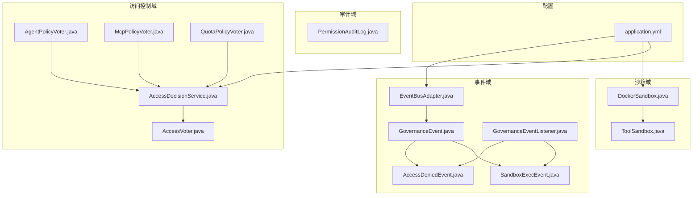
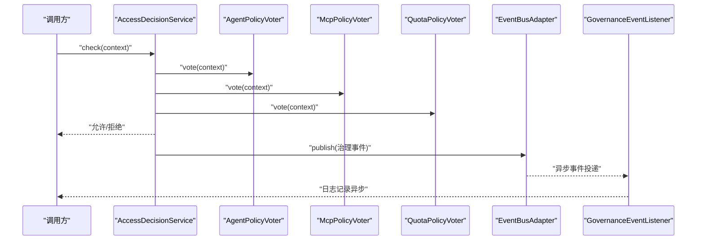
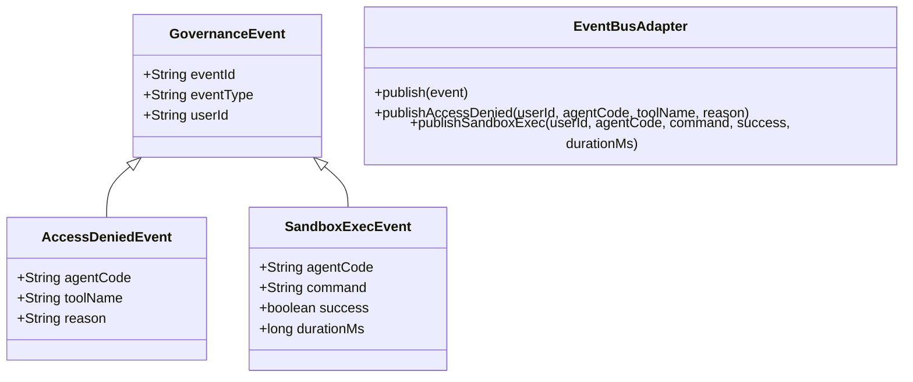
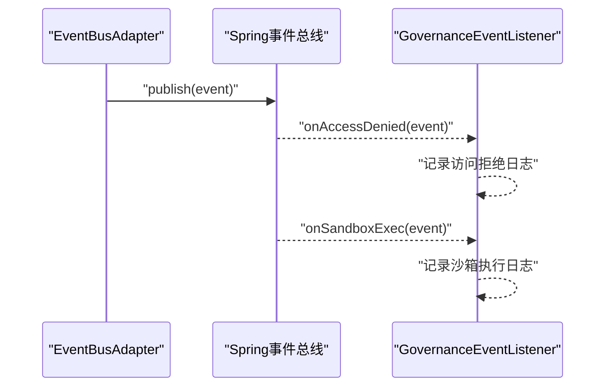
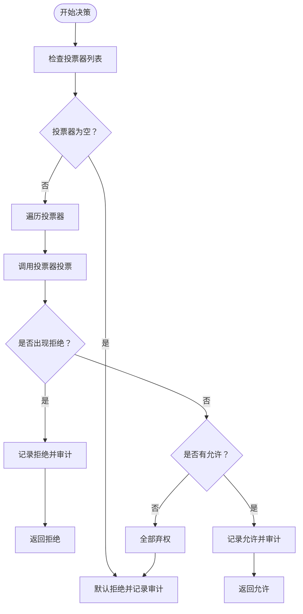
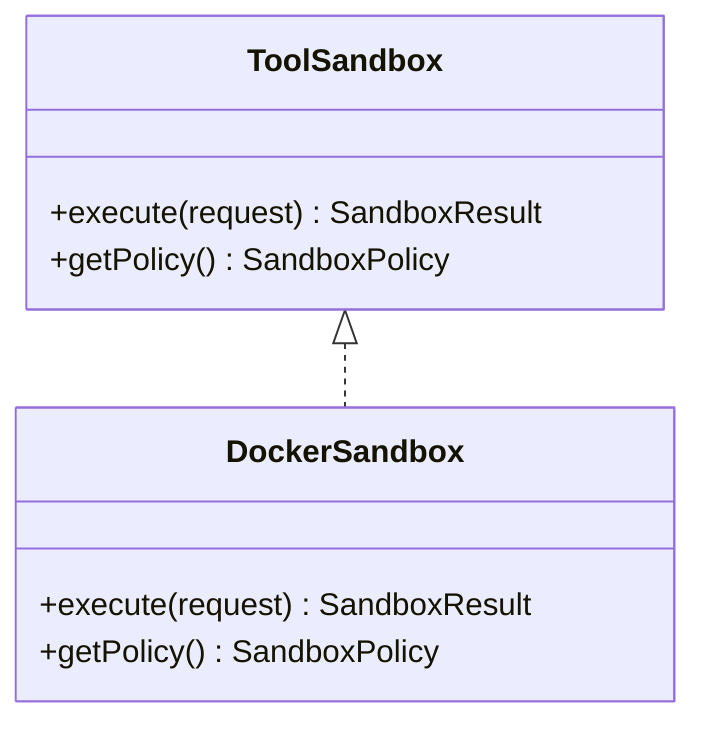
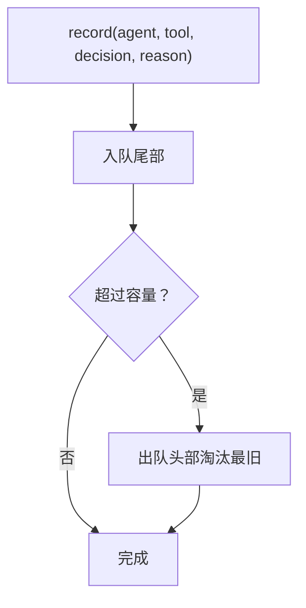
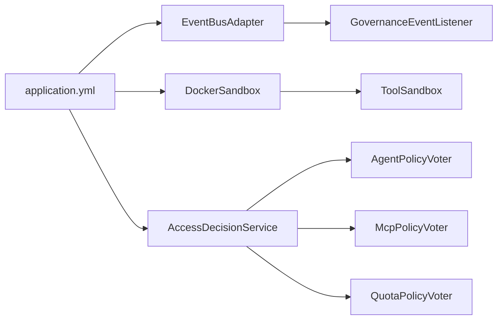

# 安全审计

<cite>
**本文引用的文件**
- [EventBusAdapter.java](file://src/main/java/com/yupi/yuaiagent/event/EventBusAdapter.java)
- [GovernanceEvent.java](file://src/main/java/com/yupi/yuaiagent/event/GovernanceEvent.java)
- [AccessDeniedEvent.java](file://src/main/java/com/yupi/yuaiagent/event/AccessDeniedEvent.java)
- [SandboxExecEvent.java](file://src/main/java/com/yupi/yuaiagent/event/SandboxExecEvent.java)
- [GovernanceEventListener.java](file://src/main/java/com/yupi/yuaiagent/event/GovernanceEventListener.java)
- [AccessDecisionService.java](file://src/main/java/com/yupi/yuaiagent/access/AccessDecisionService.java)
- [AccessVoter.java](file://src/main/java/com/yupi/yuaiagent/access/AccessVoter.java)
- [AgentPolicyVoter.java](file://src/main/java/com/yupi/yuaiagent/access/AgentPolicyVoter.java)
- [McpPolicyVoter.java](file://src/main/java/com/yupi/yuaiagent/access/McpPolicyVoter.java)
- [QuotaPolicyVoter.java](file://src/main/java/com/yupi/yuaiagent/access/QuotaPolicyVoter.java)
- [PermissionAuditLog.java](file://src/main/java/com/yupi/yuaiagent/permission/PermissionAuditLog.java)
- [ToolSandbox.java](file://src/main/java/com/yupi/yuaiagent/sandbox/ToolSandbox.java)
- [DockerSandbox.java](file://src/main/java/com/yupi/yuaiagent/sandbox/DockerSandbox.java)
- [application.yml](file://src/main/resources/application.yml)
</cite>

## 目录
1. [简介](#简介)
2. [项目结构](#项目结构)
3. [核心组件](#核心组件)
4. [架构总览](#架构总览)
5. [详细组件分析](#详细组件分析)
6. [依赖分析](#依赖分析)
7. [性能考虑](#性能考虑)
8. [故障排查指南](#故障排查指南)
9. [结论](#结论)
10. [附录](#附录)

## 简介
本文件面向安全审计与合规运营团队，系统性阐述本项目的“事件总线适配器”“治理事件模型”“访问决策与投票器”“沙箱执行与审计”“权限审计日志”“配置与扩展点”等模块的设计与实现要点，并给出异步事件处理、错误恢复、告警与应急响应、性能优化与扩展策略，帮助开发者构建高效、可观测、可扩展的安全监控体系。

## 项目结构
围绕安全审计的关键代码主要分布在以下包与文件：
- 事件域：事件总线适配器、治理事件基类与具体事件、事件监听器
- 访问控制域：统一访问决策服务、投票器接口与多种投票器实现
- 沙箱域：工具沙箱接口与Docker沙箱实现
- 审计域：权限审计日志组件
- 配置：Spring Boot 应用配置文件

图表来源
- [EventBusAdapter.java:1-46](file://src/main/java/com/yupi/yuaiagent/event/EventBusAdapter.java#L1-L46)
- [GovernanceEvent.java:1-25](file://src/main/java/com/yupi/yuaiagent/event/GovernanceEvent.java#L1-L25)
- [AccessDeniedEvent.java:1-25](file://src/main/java/com/yupi/yuaiagent/event/AccessDeniedEvent.java#L1-L25)
- [SandboxExecEvent.java:1-29](file://src/main/java/com/yupi/yuaiagent/event/SandboxExecEvent.java#L1-L29)
- [GovernanceEventListener.java:1-32](file://src/main/java/com/yupi/yuaiagent/event/GovernanceEventListener.java#L1-L32)
- [AccessDecisionService.java:1-119](file://src/main/java/com/yupi/yuaiagent/access/AccessDecisionService.java#L1-L119)
- [AccessVoter.java:1-38](file://src/main/java/com/yupi/yuaiagent/access/AccessVoter.java#L1-L38)
- [AgentPolicyVoter.java:1-45](file://src/main/java/com/yupi/yuaiagent/access/AgentPolicyVoter.java#L1-L45)
- [McpPolicyVoter.java:1-60](file://src/main/java/com/yupi/yuaiagent/access/McpPolicyVoter.java#L1-L60)
- [QuotaPolicyVoter.java:1-43](file://src/main/java/com/yupi/yuaiagent/access/QuotaPolicyVoter.java#L1-L43)
- [ToolSandbox.java:1-25](file://src/main/java/com/yupi/yuaiagent/sandbox/ToolSandbox.java#L1-L25)
- [DockerSandbox.java:1-256](file://src/main/java/com/yupi/yuaiagent/sandbox/DockerSandbox.java#L1-L256)
- [PermissionAuditLog.java:1-139](file://src/main/java/com/yupi/yuaiagent/permission/PermissionAuditLog.java#L1-L139)
- [application.yml:130-154](file://src/main/resources/application.yml#L130-L154)

章节来源
- [application.yml:130-154](file://src/main/resources/application.yml#L130-L154)

## 核心组件
- 事件总线适配器：封装Spring事件发布，提供统一治理事件发布接口，支持未来替换为消息中间件（如RocketMQ/Kafka）而不影响业务。
- 治理事件模型：抽象事件基类统一字段，派生出访问拒绝事件与沙箱执行事件，确保事件标准化与可扩展。
- 事件监听器：基于Spring事件监听机制，统一记录治理事件日志，为后续接入告警、审计数据库、消息队列预留扩展点。
- 访问决策服务与投票器：统一聚合多个维度的投票（Agent权限、MCP信任、配额），采用“一票否决+默认拒绝”的安全策略。
- 沙箱执行与审计：提供工具沙箱统一接口与Docker沙箱实现，记录执行结果与耗时，便于审计与合规。
- 权限审计日志：内存环形缓冲记录权限决策（通过/拒绝），支持按Agent、最近记录、拒绝记录检索，为安全运营提供基础数据。

章节来源
- [EventBusAdapter.java:18-45](file://src/main/java/com/yupi/yuaiagent/event/EventBusAdapter.java#L18-L45)
- [GovernanceEvent.java:11-24](file://src/main/java/com/yupi/yuaiagent/event/GovernanceEvent.java#L11-L24)
- [AccessDeniedEvent.java:8-24](file://src/main/java/com/yupi/yuaiagent/event/AccessDeniedEvent.java#L8-L24)
- [SandboxExecEvent.java:8-28](file://src/main/java/com/yupi/yuaiagent/event/SandboxExecEvent.java#L8-L28)
- [GovernanceEventListener.java:14-31](file://src/main/java/com/yupi/yuaiagent/event/GovernanceEventListener.java#L14-L31)
- [AccessDecisionService.java:21-118](file://src/main/java/com/yupi/yuaiagent/access/AccessDecisionService.java#L21-L118)
- [AccessVoter.java:11-37](file://src/main/java/com/yupi/yuaiagent/access/AccessVoter.java#L11-L37)
- [AgentPolicyVoter.java:14-44](file://src/main/java/com/yupi/yuaiagent/access/AgentPolicyVoter.java#L14-L44)
- [McpPolicyVoter.java:16-59](file://src/main/java/com/yupi/yuaiagent/access/McpPolicyVoter.java#L16-L59)
- [QuotaPolicyVoter.java:13-42](file://src/main/java/com/yupi/yuaiagent/access/QuotaPolicyVoter.java#L13-L42)
- [ToolSandbox.java:10-24](file://src/main/java/com/yupi/yuaiagent/sandbox/ToolSandbox.java#L10-L24)
- [DockerSandbox.java:28-137](file://src/main/java/com/yupi/yuaiagent/sandbox/DockerSandbox.java#L28-L137)
- [PermissionAuditLog.java:23-138](file://src/main/java/com/yupi/yuaiagent/permission/PermissionAuditLog.java#L23-L138)

## 架构总览
下图展示从访问决策到事件发布、再到事件监听与审计日志的整体链路，体现异步事件处理与错误恢复策略的落地方式。

图表来源
- [AccessDecisionService.java:37-87](file://src/main/java/com/yupi/yuaiagent/access/AccessDecisionService.java#L37-L87)
- [AgentPolicyVoter.java:20-38](file://src/main/java/com/yupi/yuaiagent/access/AgentPolicyVoter.java#L20-L38)
- [McpPolicyVoter.java:24-53](file://src/main/java/com/yupi/yuaiagent/access/McpPolicyVoter.java#L24-L53)
- [QuotaPolicyVoter.java:20-36](file://src/main/java/com/yupi/yuaiagent/access/QuotaPolicyVoter.java#L20-L36)
- [EventBusAdapter.java:26-44](file://src/main/java/com/yupi/yuaiagent/event/EventBusAdapter.java#L26-L44)
- [GovernanceEventListener.java:18-30](file://src/main/java/com/yupi/yuaiagent/event/GovernanceEventListener.java#L18-L30)

## 详细组件分析

### 事件总线适配器与治理事件模型
- 设计要点
  - 通过适配器封装Spring事件发布，隐藏底层实现细节，便于未来替换为消息中间件。
  - 治理事件基类统一事件ID、事件类型、用户ID等字段，派生事件承载具体业务语义。
  - 提供便捷的事件发布方法，如访问拒绝事件与沙箱执行事件。
- 异步与错误恢复
  - Spring事件默认同步传播；若需异步，可在监听器上标注异步注解或引入消息中间件后端。
  - 适配器对异常进行捕获与日志记录，保证事件发布路径的健壮性。
- 扩展点
  - 未来可将事件序列化为消息，发布到Kafka/RocketMQ，实现跨进程、跨实例的事件分发。

图表来源
- [GovernanceEvent.java:11-24](file://src/main/java/com/yupi/yuaiagent/event/GovernanceEvent.java#L11-L24)
- [AccessDeniedEvent.java:8-24](file://src/main/java/com/yupi/yuaiagent/event/AccessDeniedEvent.java#L8-L24)
- [SandboxExecEvent.java:8-28](file://src/main/java/com/yupi/yuaiagent/event/SandboxExecEvent.java#L8-L28)
- [EventBusAdapter.java:18-45](file://src/main/java/com/yupi/yuaiagent/event/EventBusAdapter.java#L18-L45)

章节来源
- [EventBusAdapter.java:18-45](file://src/main/java/com/yupi/yuaiagent/event/EventBusAdapter.java#L18-L45)
- [GovernanceEvent.java:11-24](file://src/main/java/com/yupi/yuaiagent/event/GovernanceEvent.java#L11-L24)
- [AccessDeniedEvent.java:8-24](file://src/main/java/com/yupi/yuaiagent/event/AccessDeniedEvent.java#L8-L24)
- [SandboxExecEvent.java:8-28](file://src/main/java/com/yupi/yuaiagent/event/SandboxExecEvent.java#L8-L28)

### 治理事件监听器与事件处理逻辑
- 实现模式
  - 基于Spring事件监听注解，分别监听访问拒绝事件与沙箱执行事件，统一记录日志。
  - 事件处理逻辑简单明确：根据事件内容打印结构化日志，便于后续接入告警与审计数据库。
- 事件过滤与批量处理
  - 当前实现为单事件单处理；如需批量处理，可在监听器内部维护缓冲队列或引入消息中间件后端进行批处理。
- 错误恢复
  - 监听器内部异常被捕获并记录，不影响其他事件的处理。

图表来源
- [EventBusAdapter.java:26-44](file://src/main/java/com/yupi/yuaiagent/event/EventBusAdapter.java#L26-L44)
- [GovernanceEventListener.java:18-30](file://src/main/java/com/yupi/yuaiagent/event/GovernanceEventListener.java#L18-L30)

章节来源
- [GovernanceEventListener.java:14-31](file://src/main/java/com/yupi/yuaiagent/event/GovernanceEventListener.java#L14-L31)

### 访问决策与投票器
- 决策策略
  - 一票否决：任一投票器拒绝即拒绝。
  - 全部弃权则拒绝：默认安全策略。
- 投票器维度
  - Agent策略投票器：基于Agent权限档案判断。
  - MCP策略投票器：结合MCP信任与Agent最低信任分。
  - 配额策略投票器：检查单次请求工具调用次数是否超限。
- 错误恢复
  - 未注册投票器时默认拒绝并记录警告日志。
- 审计集成
  - 访问决策服务在允许/拒绝时调用权限审计日志组件记录。

图表来源
- [AccessDecisionService.java:37-87](file://src/main/java/com/yupi/yuaiagent/access/AccessDecisionService.java#L37-L87)
- [AgentPolicyVoter.java:20-38](file://src/main/java/com/yupi/yuaiagent/access/AgentPolicyVoter.java#L20-L38)
- [McpPolicyVoter.java:24-53](file://src/main/java/com/yupi/yuaiagent/access/McpPolicyVoter.java#L24-L53)
- [QuotaPolicyVoter.java:20-36](file://src/main/java/com/yupi/yuaiagent/access/QuotaPolicyVoter.java#L20-L36)

章节来源
- [AccessDecisionService.java:21-118](file://src/main/java/com/yupi/yuaiagent/access/AccessDecisionService.java#L21-L118)
- [AccessVoter.java:11-37](file://src/main/java/com/yupi/yuaiagent/access/AccessVoter.java#L11-L37)
- [AgentPolicyVoter.java:14-44](file://src/main/java/com/yupi/yuaiagent/access/AgentPolicyVoter.java#L14-L44)
- [McpPolicyVoter.java:16-59](file://src/main/java/com/yupi/yuaiagent/access/McpPolicyVoter.java#L16-L59)
- [QuotaPolicyVoter.java:13-42](file://src/main/java/com/yupi/yuaiagent/access/QuotaPolicyVoter.java#L13-L42)

### 沙箱执行与审计
- 接口设计
  - 工具沙箱接口统一执行入口与策略标识，便于在不同运行环境下切换实现。
- Docker沙箱实现
  - 通过容器参数实现CPU、内存、网络、文件系统等多维隔离。
  - 支持超时控制、输出截断、异常捕获与清理。
- 审计字段
  - 记录命令、成功标志、耗时、沙箱类型等，便于审计与合规回溯。

图表来源
- [ToolSandbox.java:10-24](file://src/main/java/com/yupi/yuaiagent/sandbox/ToolSandbox.java#L10-L24)
- [DockerSandbox.java:28-137](file://src/main/java/com/yupi/yuaiagent/sandbox/DockerSandbox.java#L28-L137)

章节来源
- [ToolSandbox.java:10-24](file://src/main/java/com/yupi/yuaiagent/sandbox/ToolSandbox.java#L10-L24)
- [DockerSandbox.java:28-137](file://src/main/java/com/yupi/yuaiagent/sandbox/DockerSandbox.java#L28-L137)

### 权限审计日志
- 存储结构
  - 内存环形缓冲，最大容量固定，超出时淘汰最旧记录。
  - 条目包含时间戳、Agent编码、工具名、决策结果、原因等。
- 查询能力
  - 支持最近记录、按Agent筛选、按拒绝筛选、总数统计。
- 性能与扩展
  - 当前为内存实现，适合短期审计与调试；生产建议替换为持久化存储（数据库/对象存储）。

图表来源
- [PermissionAuditLog.java:38-59](file://src/main/java/com/yupi/yuaiagent/permission/PermissionAuditLog.java#L38-L59)
- [PermissionAuditLog.java:80-114](file://src/main/java/com/yupi/yuaiagent/permission/PermissionAuditLog.java#L80-L114)

章节来源
- [PermissionAuditLog.java:23-138](file://src/main/java/com/yupi/yuaiagent/permission/PermissionAuditLog.java#L23-L138)

## 依赖分析
- 组件耦合
  - 访问决策服务聚合多个投票器，投票器之间低耦合、可插拔。
  - 事件总线适配器与事件监听器通过Spring事件解耦，便于横向扩展。
  - 沙箱实现与接口解耦，可通过工厂或配置切换实现。
- 外部依赖
  - Docker命令行用于容器生命周期管理；配置项控制镜像、超时、输出大小等。
  - Spring Boot配置文件集中管理治理与沙箱相关参数。

图表来源
- [AccessDecisionService.java:25-29](file://src/main/java/com/yupi/yuaiagent/access/AccessDecisionService.java#L25-L29)
- [EventBusAdapter.java:20-21](file://src/main/java/com/yupi/yuaiagent/event/EventBusAdapter.java#L20-L21)
- [DockerSandbox.java:32-42](file://src/main/java/com/yupi/yuaiagent/sandbox/DockerSandbox.java#L32-L42)
- [application.yml:130-154](file://src/main/resources/application.yml#L130-L154)

章节来源
- [AccessDecisionService.java:21-118](file://src/main/java/com/yupi/yuaiagent/access/AccessDecisionService.java#L21-L118)
- [EventBusAdapter.java:18-45](file://src/main/java/com/yupi/yuaiagent/event/EventBusAdapter.java#L18-L45)
- [DockerSandbox.java:28-137](file://src/main/java/com/yupi/yuaiagent/sandbox/DockerSandbox.java#L28-L137)
- [application.yml:130-154](file://src/main/resources/application.yml#L130-L154)

## 性能考虑
- 事件处理
  - 当前事件监听为同步日志记录；建议在高并发场景下引入异步监听或消息中间件，降低事件处理对业务线程的影响。
- 访问决策
  - 投票器数量增加会线性增加决策耗时；建议合并相似策略、缓存常用决策结果、拆分批量请求。
- 沙箱执行
  - Docker容器启动与清理存在开销；建议复用容器、合理设置超时与输出大小限制、在本地沙箱与Docker间按需切换。
- 审计日志
  - 内存环形缓冲适合短期观测；生产建议持久化存储并建立索引，支持高效查询与归档。

## 故障排查指南
- 事件未被监听
  - 检查监听器是否被Spring扫描、事件类型是否匹配、监听方法签名是否正确。
- 访问决策异常
  - 若投票器未注册，系统默认拒绝；检查投票器装配与命名。
  - 若频繁拒绝，检查Agent权限档案、MCP信任等级与最低信任分、配额限制。
- 沙箱执行失败
  - 查看容器日志与超时信息；确认Docker镜像可用、资源限制合理、输出大小未被截断。
- 审计日志缺失
  - 确认审计记录方法被调用；检查容量上限导致的淘汰；必要时开启更详细的日志级别。

章节来源
- [AccessDecisionService.java:37-87](file://src/main/java/com/yupi/yuaiagent/access/AccessDecisionService.java#L37-L87)
- [DockerSandbox.java:119-131](file://src/main/java/com/yupi/yuaiagent/sandbox/DockerSandbox.java#L119-L131)
- [PermissionAuditLog.java:38-59](file://src/main/java/com/yupi/yuaiagent/permission/PermissionAuditLog.java#L38-L59)

## 结论
本安全审计体系以“事件驱动+多维访问控制+沙箱隔离+审计日志”为核心，既满足当前开发与调试需求，又为异步化、持久化、告警与扩展提供了清晰的实现路径。建议在生产环境中优先完成以下落地：
- 将事件监听异步化或接入消息中间件；
- 将权限审计日志持久化至数据库；
- 增加安全告警通道与应急响应流程；
- 持续优化投票器与沙箱策略，提升整体性能与稳定性。

## 附录

### 治理事件类型与处理流程
- 访问拒绝事件
  - 触发时机：任一投票器拒绝或默认拒绝。
  - 处理动作：记录访问拒绝日志，触发审计记录。
- 沙箱执行事件
  - 触发时机：工具执行完成后（无论成功与否）。
  - 处理动作：记录执行结果、耗时、沙箱类型等，便于审计与合规。

章节来源
- [AccessDeniedEvent.java:8-24](file://src/main/java/com/yupi/yuaiagent/event/AccessDeniedEvent.java#L8-L24)
- [SandboxExecEvent.java:8-28](file://src/main/java/com/yupi/yuaiagent/event/SandboxExecEvent.java#L8-L28)
- [GovernanceEventListener.java:18-30](file://src/main/java/com/yupi/yuaiagent/event/GovernanceEventListener.java#L18-L30)

### 安全事件监听器实现模式
- 模式说明
  - 基于Spring事件监听注解，分别处理不同事件类型。
  - 当前实现为单事件单处理；可扩展为批量缓冲与异步处理。
- 事件过滤
  - 可在监听方法中增加条件过滤，仅处理特定用户、Agent或工具类型的事件。
- 批量处理
  - 建议引入消息中间件后端，将事件聚合成批次写入审计数据库或告警系统。

章节来源
- [GovernanceEventListener.java:14-31](file://src/main/java/com/yupi/yuaiagent/event/GovernanceEventListener.java#L14-L31)

### 安全审计配置指南
- 事件类型定义
  - 通过治理事件基类扩展新的事件类型，统一事件ID与字段。
- 监听器注册
  - 通过Spring组件扫描自动注册监听器；可按需启用异步监听。
- 处理策略设置
  - 通过配置文件调整沙箱参数（镜像、超时、输出大小）、治理参数（信任等级、是否启用信任校验）。
- 审计存储
  - 当前为内存实现；生产建议替换为数据库持久化并建立查询接口。

章节来源
- [application.yml:130-154](file://src/main/resources/application.yml#L130-L154)
- [EventBusAdapter.java:18-45](file://src/main/java/com/yupi/yuaiagent/event/EventBusAdapter.java#L18-L45)
- [PermissionAuditLog.java:23-138](file://src/main/java/com/yupi/yuaiagent/permission/PermissionAuditLog.java#L23-L138)

### 审计数据存储与查询接口
- 存储
  - 权限审计日志当前为内存环形缓冲；建议替换为数据库持久化。
- 查询
  - 支持最近记录、按Agent筛选、按拒绝筛选、总数统计；建议在数据库层建立索引以提升查询效率。

章节来源
- [PermissionAuditLog.java:80-114](file://src/main/java/com/yupi/yuaiagent/permission/PermissionAuditLog.java#L80-L114)

### 告警机制与应急响应流程
- 告警机制
  - 建议在事件监听器中增加告警通道（邮件/IM/短信），对高频拒绝、异常沙箱执行等事件触发告警。
- 应急响应
  - 建立事件分级与处置流程，包括快速定位、隔离风险Agent、回滚策略与复盘机制。

（本节为概念性指导，不直接分析具体文件）

### 性能优化与扩展策略
- 事件总线
  - 引入消息中间件实现异步与削峰填谷。
- 访问控制
  - 合并策略、缓存决策、拆分批量请求。
- 沙箱
  - 复用容器、合理设置资源限制、按需切换本地/容器沙箱。
- 审计
  - 持久化存储、索引优化、分片与归档策略。

（本节为通用指导，不直接分析具体文件）