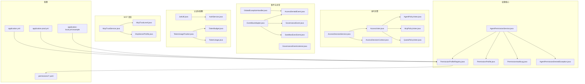
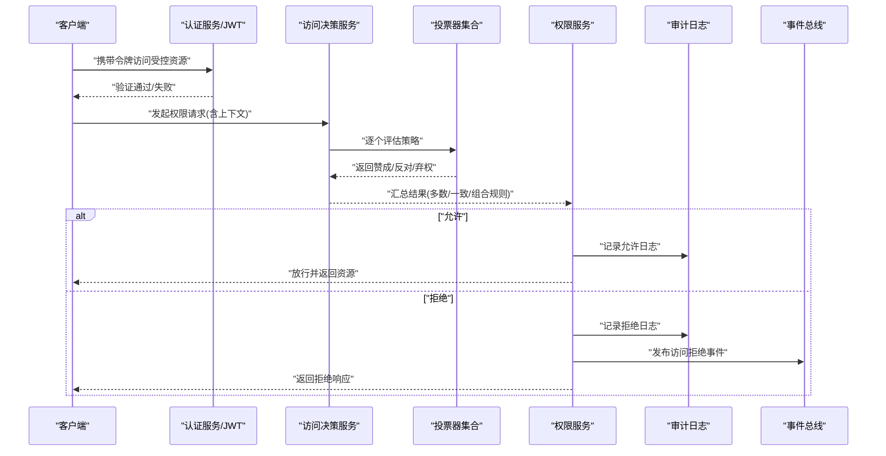
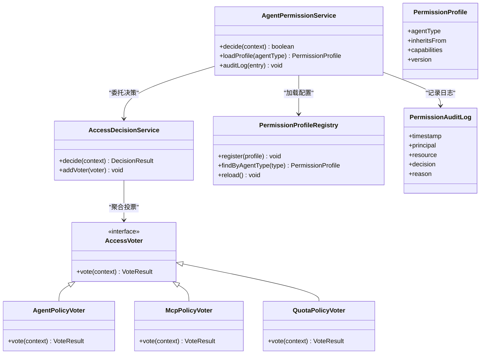
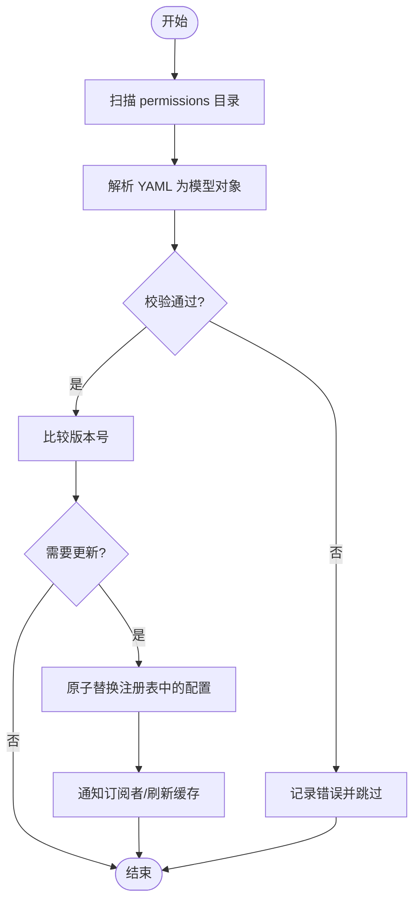
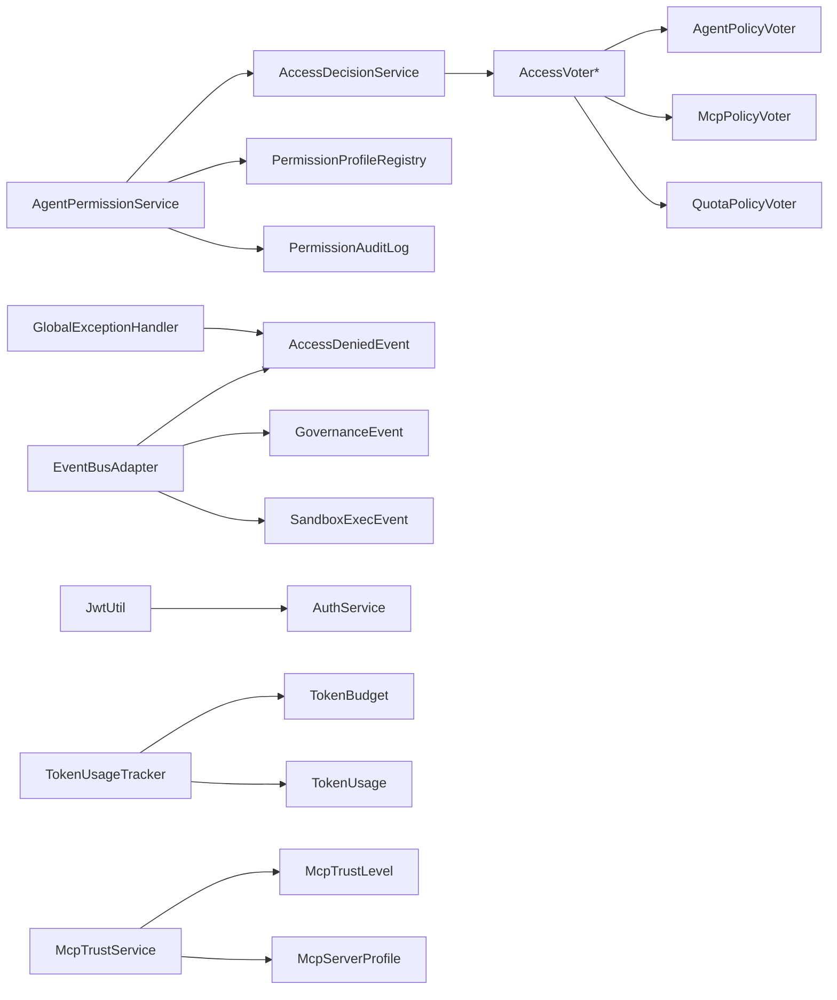

# 权限管理

<cite>
**本文引用的文件**
- [AgentPermissionService.java](file://src/main/java/com/yupi/yuaiagent/permission/AgentPermissionService.java)
- [PermissionProfileRegistry.java](file://src/main/java/com/yupi/yuaiagent/permission/PermissionProfileRegistry.java)
- [PermissionProfile.java](file://src/main/java/com/yupi/yuaiagent/permission/model/PermissionProfile.java)
- [PermissionAuditLog.java](file://src/main/java/com/yupi/yuaiagent/permission/PermissionAuditLog.java)
- [AgentPermissionDeniedException.java](file://src/main/java/com/yupi/yuaiagent/permission/AgentPermissionDeniedException.java)
- [AccessDecisionService.java](file://src/main/java/com/yupi/yuaiagent/access/AccessDecisionService.java)
- [AccessDecisionContext.java](file://src/main/java/com/yupi/yuaiagent/access/AccessDecisionContext.java)
- [AccessVoter.java](file://src/main/java/com/yupi/yuaiagent/access/AccessVoter.java)
- [AgentPolicyVoter.java](file://src/main/java/com/yupi/yuaiagent/access/AgentPolicyVoter.java)
- [McpPolicyVoter.java](file://src/main/java/com/yupi/yuaiagent/access/McpPolicyVoter.java)
- [QuotaPolicyVoter.java](file://src/main/java/com/yupi/yuaiagent/access/QuotaPolicyVoter.java)
- [admin-agent.yaml](file://src/main/resources/permissions/admin-agent.yaml)
- [general-agent.yaml](file://src/main/resources/permissions/general-agent.yaml)
- [negotiation-agent.yaml](file://src/main/resources/permissions/negotiation-agent.yaml)
- [escape-agent.yaml](file://src/main/resources/permissions/escape-agent.yaml)
- [data-agent.yaml](file://src/main/resources/permissions/data-agent.yaml)
- [consultation-agent.yaml](file://src/main/resources/permissions/consultation-agent.yaml)
- [resume-agent.yaml](file://src/main/resources/permissions/resume-agent.yaml)
- [AccessDeniedEvent.java](file://src/main/java/com/yupi/yuaiagent/event/AccessDeniedEvent.java)
- [EventBusAdapter.java](file://src/main/java/com/yupi/yuaiagent/event/EventBusAdapter.java)
- [GovernanceEvent.java](file://src/main/java/com/yupi/yuaiagent/event/GovernanceEvent.java)
- [GovernanceEventListener.java](file://src/main/java/com/yupi/yuaiagent/event/GovernanceEventListener.java)
- [SandboxExecEvent.java](file://src/main/java/com/yupi/yuaiagent/event/SandboxExecEvent.java)
- [GlobalExceptionHandler.java](file://src/main/java/com/yupi/yuaiagent/exception/GlobalExceptionHandler.java)
- [JwtUtil.java](file://src/main/java/com/yupi/yuaiagent/auth/JwtUtil.java)
- [AuthService.java](file://src/main/java/com/yupi/yuaiagent/auth/AuthService.java)
- [TokenUsageTracker.java](file://src/main/java/com/yupi/yuaiagent/budget/TokenUsageTracker.java)
- [TokenBudget.java](file://src/main/java/com/yupi/yuaiagent/budget/TokenBudget.java)
- [TokenUsage.java](file://src/main/java/com/yupi/yuaiagent/budget/TokenUsage.java)
- [McpTrustService.java](file://src/main/java/com/yupi/yuaiagent/mcp/McpTrustService.java)
- [McpTrustLevel.java](file://src/main/java/com/yupi/yuaiagent/mcp/McpTrustLevel.java)
- [McpServerProfile.java](file://src/main/java/com/yupi/yuaiagent/mcp/McpServerProfile.java)
- [application.yml](file://src/main/resources/application.yml)
- [application-prod.yml](file://src/main/resources/application-prod.yml)
- [application-local.yml.example](file://src/main/resources/application-local.yml.example)
</cite>

## 目录
1. [引言](#引言)
2. [项目结构](#项目结构)
3. [核心组件](#核心组件)
4. [架构总览](#架构总览)
5. [详细组件分析](#详细组件分析)
6. [依赖关系分析](#依赖关系分析)
7. [性能考虑](#性能考虑)
8. [故障排查指南](#故障排查指南)
9. [结论](#结论)
10. [附录](#附录)

## 引言
本文件面向开发者与运维人员，系统性梳理权限管理子系统的整体设计与实现细节，覆盖权限决策、权限配置、审计日志、事件驱动与异常处理等模块。重点解释权限继承与组合规则、配置文件结构与版本管理、动态更新策略、审计与查询接口、缓存与一致性保障、扩展接口与自定义处理器开发方法，并提供测试与安全评估建议。

## 项目结构
权限管理相关代码主要分布在以下包与资源路径：
- 权限核心：permission 及其 model 子包
- 访问决策：access 包（投票器与决策服务）
- 事件与异常：event、exception 包
- 认证与配额：auth、budget 包
- MCP 信任与代理：mcp 包
- 权限配置：resources/permissions 下的 YAML 文件
- 应用配置：resources/application*.yml

图表来源
- [AgentPermissionService.java](file://src/main/java/com/yupi/yuaiagent/permission/AgentPermissionService.java)
- [PermissionProfileRegistry.java](file://src/main/java/com/yupi/yuaiagent/permission/PermissionProfileRegistry.java)
- [AccessDecisionService.java](file://src/main/java/com/yupi/yuaiagent/access/AccessDecisionService.java)
- [AccessVoter.java](file://src/main/java/com/yupi/yuaiagent/access/AccessVoter.java)
- [AgentPolicyVoter.java](file://src/main/java/com/yupi/yuaiagent/access/AgentPolicyVoter.java)
- [McpPolicyVoter.java](file://src/main/java/com/yupi/yuaiagent/access/McpPolicyVoter.java)
- [QuotaPolicyVoter.java](file://src/main/java/com/yupi/yuaiagent/access/QuotaPolicyVoter.java)
- [EventBusAdapter.java](file://src/main/java/com/yupi/yuaiagent/event/EventBusAdapter.java)
- [AccessDeniedEvent.java](file://src/main/java/com/yupi/yuaiagent/event/AccessDeniedEvent.java)
- [GlobalExceptionHandler.java](file://src/main/java/com/yupi/yuaiagent/exception/GlobalExceptionHandler.java)
- [JwtUtil.java](file://src/main/java/com/yupi/yuaiagent/auth/JwtUtil.java)
- [AuthService.java](file://src/main/java/com/yupi/yuaiagent/auth/AuthService.java)
- [TokenUsageTracker.java](file://src/main/java/com/yupi/yuaiagent/budget/TokenUsageTracker.java)
- [TokenBudget.java](file://src/main/java/com/yupi/yuaiagent/budget/TokenBudget.java)
- [TokenUsage.java](file://src/main/java/com/yupi/yuaiagent/budget/TokenUsage.java)
- [McpTrustService.java](file://src/main/java/com/yupi/yuaiagent/mcp/McpTrustService.java)
- [McpTrustLevel.java](file://src/main/java/com/yupi/yuaiagent/mcp/McpTrustLevel.java)
- [McpServerProfile.java](file://src/main/java/com/yupi/yuaiagent/mcp/McpServerProfile.java)
- [application.yml](file://src/main/resources/application.yml)
- [application-prod.yml](file://src/main/resources/application-prod.yml)
- [application-local.yml.example](file://src/main/resources/application-local.yml.example)
- [admin-agent.yaml](file://src/main/resources/permissions/admin-agent.yaml)

章节来源
- [AgentPermissionService.java](file://src/main/java/com/yupi/yuaiagent/permission/AgentPermissionService.java)
- [AccessDecisionService.java](file://src/main/java/com/yupi/yuaiagent/access/AccessDecisionService.java)
- [EventBusAdapter.java](file://src/main/java/com/yupi/yuaiagent/event/EventBusAdapter.java)
- [application.yml](file://src/main/resources/application.yml)

## 核心组件
- 权限服务与决策
  - 权限服务：负责加载权限配置、执行权限决策、生成审计日志、抛出拒绝异常。
  - 访问决策服务：聚合多个投票器进行综合决策，支持上下文传递与策略组合。
  - 投票器：按策略类型分别评估（如代理策略、MCP 策略、配额策略）。
- 权限配置与注册
  - 权限配置文件：YAML 结构，描述角色、能力、继承链与组合规则。
  - 注册中心：负责解析、校验与注册权限配置，支持版本管理与动态更新。
- 审计与事件
  - 审计日志：记录权限请求、主体、目标、结果与时间戳。
  - 事件总线：统一发布访问拒绝、治理事件与沙箱执行事件，便于监控与告警。
- 认证与配额
  - JWT 工具与认证服务：提供身份令牌签发与校验。
  - 令牌预算与用量追踪：限制与统计代理调用成本，作为配额策略输入。
- MCP 信任
  - MCP 服务器信任等级与配置：决定外部工具调用的信任级别与策略约束。

章节来源
- [AgentPermissionService.java](file://src/main/java/com/yupi/yuaiagent/permission/AgentPermissionService.java)
- [AccessDecisionService.java](file://src/main/java/com/yupi/yuaiagent/access/AccessDecisionService.java)
- [AccessVoter.java](file://src/main/java/com/yupi/yuaiagent/access/AccessVoter.java)
- [PermissionProfileRegistry.java](file://src/main/java/com/yupi/yuaiagent/permission/PermissionProfileRegistry.java)
- [PermissionAuditLog.java](file://src/main/java/com/yupi/yuaiagent/permission/PermissionAuditLog.java)
- [EventBusAdapter.java](file://src/main/java/com/yupi/yuaiagent/event/EventBusAdapter.java)
- [JwtUtil.java](file://src/main/java/com/yupi/yuaiagent/auth/JwtUtil.java)
- [TokenUsageTracker.java](file://src/main/java/com/yupi/yuaiagent/budget/TokenUsageTracker.java)
- [McpTrustService.java](file://src/main/java/com/yupi/yuaiagent/mcp/McpTrustService.java)

## 架构总览
权限系统采用“配置驱动 + 投票器聚合 + 事件驱动”的分层架构：
- 配置层：YAML 权限文件定义角色与能力，注册中心解析并维护版本。
- 决策层：访问决策服务聚合多策略投票器，形成最终访问结果。
- 执行层：权限服务根据决策结果放行或拒绝，并记录审计日志。
- 观察层：事件总线统一上报拒绝与治理事件；异常处理器统一兜底。

图表来源
- [AccessDecisionService.java](file://src/main/java/com/yupi/yuaiagent/access/AccessDecisionService.java)
- [AccessVoter.java](file://src/main/java/com/yupi/yuaiagent/access/AccessVoter.java)
- [AgentPermissionService.java](file://src/main/java/com/yupi/yuaiagent/permission/AgentPermissionService.java)
- [PermissionAuditLog.java](file://src/main/java/com/yupi/yuaiagent/permission/PermissionAuditLog.java)
- [EventBusAdapter.java](file://src/main/java/com/yupi/yuaiagent/event/EventBusAdapter.java)

## 详细组件分析

### 权限服务与决策流程
- 权限服务职责
  - 加载并校验权限配置文件
  - 组合访问决策上下文
  - 基于投票器结果做出最终决策
  - 记录审计日志并触发事件
  - 对拒绝场景抛出专用异常
- 访问决策服务
  - 聚合多个投票器，支持多数通过、一致同意、或自定义组合规则
  - 上下文传递：将主体、目标、环境变量注入到各投票器
- 投票器类型
  - 代理策略投票器：基于代理角色与能力矩阵评估
  - MCP 策略投票器：结合 MCP 服务器信任等级与工具调用范围
  - 配额策略投票器：基于令牌预算与用量阈值评估

图表来源
- [AgentPermissionService.java](file://src/main/java/com/yupi/yuaiagent/permission/AgentPermissionService.java)
- [AccessDecisionService.java](file://src/main/java/com/yupi/yuaiagent/access/AccessDecisionService.java)
- [AccessVoter.java](file://src/main/java/com/yupi/yuaiagent/access/AccessVoter.java)
- [AgentPolicyVoter.java](file://src/main/java/com/yupi/yuaiagent/access/AgentPolicyVoter.java)
- [McpPolicyVoter.java](file://src/main/java/com/yupi/yuaiagent/access/McpPolicyVoter.java)
- [QuotaPolicyVoter.java](file://src/main/java/com/yupi/yuaiagent/access/QuotaPolicyVoter.java)
- [PermissionProfileRegistry.java](file://src/main/java/com/yupi/yuaiagent/permission/PermissionProfileRegistry.java)
- [PermissionProfile.java](file://src/main/java/com/yupi/yuaiagent/permission/model/PermissionProfile.java)
- [PermissionAuditLog.java](file://src/main/java/com/yupi/yuaiagent/permission/PermissionAuditLog.java)

章节来源
- [AgentPermissionService.java](file://src/main/java/com/yupi/yuaiagent/permission/AgentPermissionService.java)
- [AccessDecisionService.java](file://src/main/java/com/yupi/yuaiagent/access/AccessDecisionService.java)
- [AccessVoter.java](file://src/main/java/com/yupi/yuaiagent/access/AccessVoter.java)
- [AgentPolicyVoter.java](file://src/main/java/com/yupi/yuaiagent/access/AgentPolicyVoter.java)
- [McpPolicyVoter.java](file://src/main/java/com/yupi/yuaiagent/access/McpPolicyVoter.java)
- [QuotaPolicyVoter.java](file://src/main/java/com/yupi/yuaiagent/access/QuotaPolicyVoter.java)

### 权限配置文件结构与解析
- 文件位置与命名
  - resources/permissions 下的 YAML 文件，按代理类型命名，如 admin-agent.yaml、general-agent.yaml 等
- 结构要点
  - 代理类型标识：用于匹配具体代理实例
  - 继承关系：声明父级角色，实现权限继承
  - 能力集合：列出允许的操作/资源集合
  - 版本字段：用于版本管理与动态更新识别
- 解析与注册
  - 注册中心负责读取、反序列化、校验与注册
  - 支持热重载：在运行时重新扫描并替换旧配置
- 动态更新策略
  - 基于版本号判断是否需要更新
  - 并发安全：更新期间保持旧配置可用，切换时原子替换
  - 回滚机制：保留上一版本快照以便回退

图表来源
- [PermissionProfileRegistry.java](file://src/main/java/com/yupi/yuaiagent/permission/PermissionProfileRegistry.java)
- [admin-agent.yaml](file://src/main/resources/permissions/admin-agent.yaml)
- [general-agent.yaml](file://src/main/resources/permissions/general-agent.yaml)
- [negotiation-agent.yaml](file://src/main/resources/permissions/negotiation-agent.yaml)
- [escape-agent.yaml](file://src/main/resources/permissions/escape-agent.yaml)
- [data-agent.yaml](file://src/main/resources/permissions/data-agent.yaml)
- [consultation-agent.yaml](file://src/main/resources/permissions/consultation-agent.yaml)
- [resume-agent.yaml](file://src/main/resources/permissions/resume-agent.yaml)

章节来源
- [PermissionProfileRegistry.java](file://src/main/java/com/yupi/yuaiagent/permission/PermissionProfileRegistry.java)
- [PermissionProfile.java](file://src/main/java/com/yupi/yuaiagent/permission/model/PermissionProfile.java)
- [admin-agent.yaml](file://src/main/resources/permissions/admin-agent.yaml)
- [general-agent.yaml](file://src/main/resources/permissions/general-agent.yaml)

### 权限审计日志与查询接口
- 审计日志字段
  - 时间戳、主体标识、目标资源、决策结果、拒绝原因、策略详情
- 记录机制
  - 在权限服务中统一记录，确保所有决策均有据可查
- 查询接口
  - 建议提供基于时间范围、主体、资源、决策状态的过滤查询端点
  - 支持分页与排序，便于运营与合规审计

章节来源
- [PermissionAuditLog.java](file://src/main/java/com/yupi/yuaiagent/permission/PermissionAuditLog.java)
- [AgentPermissionService.java](file://src/main/java/com/yupi/yuaiagent/permission/AgentPermissionService.java)

### 事件驱动与异常处理
- 访问拒绝事件
  - 统一发布访问拒绝事件，便于监控与告警
- 治理事件与沙箱执行事件
  - 用于记录治理动作与沙箱执行轨迹
- 全局异常处理
  - 将权限拒绝异常转换为标准响应格式

章节来源
- [EventBusAdapter.java](file://src/main/java/com/yupi/yuaiagent/event/EventBusAdapter.java)
- [AccessDeniedEvent.java](file://src/main/java/com/yupi/yuaiagent/event/AccessDeniedEvent.java)
- [GovernanceEvent.java](file://src/main/java/com/yupi/yuaiagent/event/GovernanceEvent.java)
- [SandboxExecEvent.java](file://src/main/java/com/yupi/yuaiagent/event/SandboxExecEvent.java)
- [GlobalExceptionHandler.java](file://src/main/java/com/yupi/yuaiagent/exception/GlobalExceptionHandler.java)

### 认证、配额与 MCP 信任
- 认证与授权
  - 使用 JWT 工具与认证服务进行身份验证
- 令牌预算与用量
  - 通过令牌预算与用量追踪限制代理调用成本
- MCP 信任
  - 基于 MCP 服务器信任等级与配置，控制外部工具调用范围

章节来源
- [JwtUtil.java](file://src/main/java/com/yupi/yuaiagent/auth/JwtUtil.java)
- [AuthService.java](file://src/main/java/com/yupi/yuaiagent/auth/AuthService.java)
- [TokenUsageTracker.java](file://src/main/java/com/yupi/yuaiagent/budget/TokenUsageTracker.java)
- [TokenBudget.java](file://src/main/java/com/yupi/yuaiagent/budget/TokenBudget.java)
- [TokenUsage.java](file://src/main/java/com/yupi/yuaiagent/budget/TokenUsage.java)
- [McpTrustService.java](file://src/main/java/com/yupi/yuaiagent/mcp/McpTrustService.java)
- [McpTrustLevel.java](file://src/main/java/com/yupi/yuaiagent/mcp/McpTrustLevel.java)
- [McpServerProfile.java](file://src/main/java/com/yupi/yuaiagent/mcp/McpServerProfile.java)

## 依赖关系分析
- 组件耦合
  - 权限服务依赖访问决策服务与注册中心
  - 访问决策服务依赖多个投票器实现
  - 事件总线与异常处理器提供横切关注点
- 外部依赖
  - 配置文件系统（YAML）、应用配置（application.yml）
  - 认证与配额、MCP 信任等周边模块

图表来源
- [AgentPermissionService.java](file://src/main/java/com/yupi/yuaiagent/permission/AgentPermissionService.java)
- [AccessDecisionService.java](file://src/main/java/com/yupi/yuaiagent/access/AccessDecisionService.java)
- [AccessVoter.java](file://src/main/java/com/yupi/yuaiagent/access/AccessVoter.java)
- [AgentPolicyVoter.java](file://src/main/java/com/yupi/yuaiagent/access/AgentPolicyVoter.java)
- [McpPolicyVoter.java](file://src/main/java/com/yupi/yuaiagent/access/McpPolicyVoter.java)
- [QuotaPolicyVoter.java](file://src/main/java/com/yupi/yuaiagent/access/QuotaPolicyVoter.java)
- [EventBusAdapter.java](file://src/main/java/com/yupi/yuaiagent/event/EventBusAdapter.java)
- [GlobalExceptionHandler.java](file://src/main/java/com/yupi/yuaiagent/exception/GlobalExceptionHandler.java)
- [JwtUtil.java](file://src/main/java/com/yupi/yuaiagent/auth/JwtUtil.java)
- [AuthService.java](file://src/main/java/com/yupi/yuaiagent/auth/AuthService.java)
- [TokenUsageTracker.java](file://src/main/java/com/yupi/yuaiagent/budget/TokenUsageTracker.java)
- [TokenBudget.java](file://src/main/java/com/yupi/yuaiagent/budget/TokenBudget.java)
- [TokenUsage.java](file://src/main/java/com/yupi/yuaiagent/budget/TokenUsage.java)
- [McpTrustService.java](file://src/main/java/com/yupi/yuaiagent/mcp/McpTrustService.java)
- [McpTrustLevel.java](file://src/main/java/com/yupi/yuaiagent/mcp/McpTrustLevel.java)
- [McpServerProfile.java](file://src/main/java/com/yupi/yuaiagent/mcp/McpServerProfile.java)

章节来源
- [AgentPermissionService.java](file://src/main/java/com/yupi/yuaiagent/permission/AgentPermissionService.java)
- [AccessDecisionService.java](file://src/main/java/com/yupi/yuaiagent/access/AccessDecisionService.java)
- [EventBusAdapter.java](file://src/main/java/com/yupi/yuaiagent/event/EventBusAdapter.java)

## 性能考虑
- 缓存策略
  - 权限配置缓存：以版本号为键，避免重复解析
  - 决策结果缓存：对相同上下文的决策结果进行短期缓存
- 失效与一致性
  - 版本变更触发缓存失效
  - 原子替换注册表，保证读写一致性
- 并发与锁
  - 更新时使用读写锁或无锁数据结构
- 评估与优化
  - 监控投票器耗时与决策延迟
  - 对热点代理类型建立预热缓存

## 故障排查指南
- 常见问题
  - 权限拒绝：检查审计日志与访问拒绝事件
  - 配置未生效：确认版本号更新与注册中心热重载
  - 投票器异常：定位具体投票器实现与上下文参数
- 排查步骤
  - 启用详细日志，复现问题场景
  - 核对配置文件语法与字段
  - 检查事件总线与异常处理器是否正常工作

章节来源
- [PermissionAuditLog.java](file://src/main/java/com/yupi/yuaiagent/permission/PermissionAuditLog.java)
- [AccessDeniedEvent.java](file://src/main/java/com/yupi/yuaiagent/event/AccessDeniedEvent.java)
- [GlobalExceptionHandler.java](file://src/main/java/com/yupi/yuaiagent/exception/GlobalExceptionHandler.java)

## 结论
该权限管理系统通过“配置驱动 + 投票器聚合 + 事件驱动”的架构实现了灵活、可观测且可扩展的访问控制。权限继承与组合规则由配置文件与投票器共同实现，版本管理与动态更新保障了运行时的可控演进。审计日志与事件总线提供了完善的合规与监控能力。建议在生产环境中配合严格的测试与安全评估，持续优化缓存与决策性能。

## 附录

### 权限配置指南
- 角色定义
  - 在 YAML 中定义代理类型与继承关系
  - 明确能力集合，避免过度授权
- 权限分配
  - 通过继承链实现最小权限原则
  - 使用组合规则表达复杂访问条件
- 访问控制列表管理
  - 建议将敏感操作纳入 ACL 管控
  - 定期审查与清理无效权限

章节来源
- [PermissionProfileRegistry.java](file://src/main/java/com/yupi/yuaiagent/permission/PermissionProfileRegistry.java)
- [PermissionProfile.java](file://src/main/java/com/yupi/yuaiagent/permission/model/PermissionProfile.java)

### 扩展接口与自定义处理器
- 自定义投票器
  - 实现 AccessVoter 接口，按需评估特定策略
  - 在访问决策服务中注册并参与组合规则
- 自定义权限处理器
  - 可在权限服务中扩展新的决策分支
  - 注意与现有审计与事件机制保持一致

章节来源
- [AccessVoter.java](file://src/main/java/com/yupi/yuaiagent/access/AccessVoter.java)
- [AccessDecisionService.java](file://src/main/java/com/yupi/yuaiagent/access/AccessDecisionService.java)

### 测试策略与安全评估
- 单元测试
  - 针对投票器与权限服务的关键路径编写用例
- 集成测试
  - 模拟不同配置版本与上下文组合
- 安全评估
  - 渗透测试与权限边界验证
  - 审计日志完整性与不可抵赖性检查

章节来源
- [AgentPermissionService.java](file://src/main/java/com/yupi/yuaiagent/permission/AgentPermissionService.java)
- [AccessDecisionService.java](file://src/main/java/com/yupi/yuaiagent/access/AccessDecisionService.java)