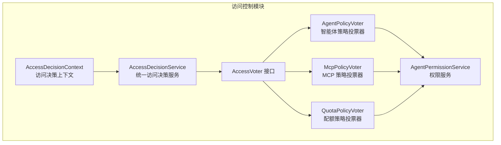
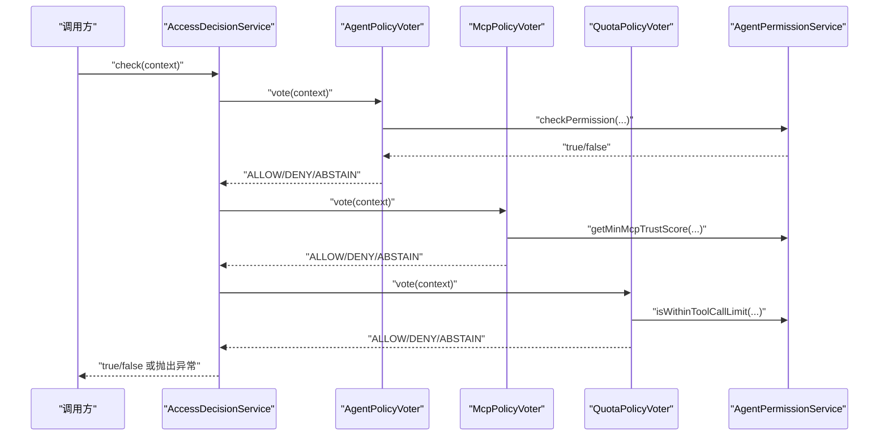
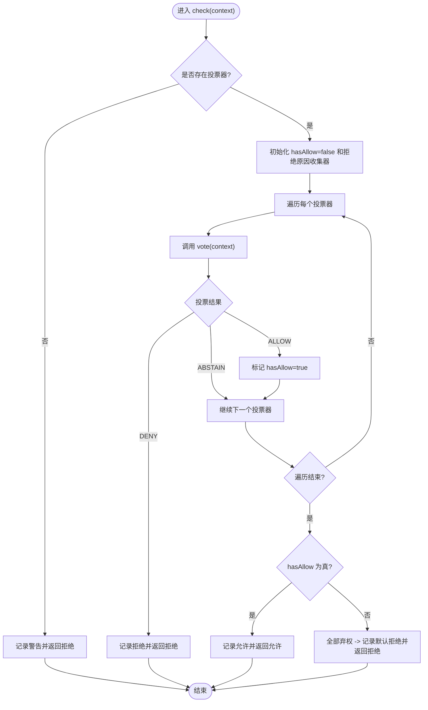
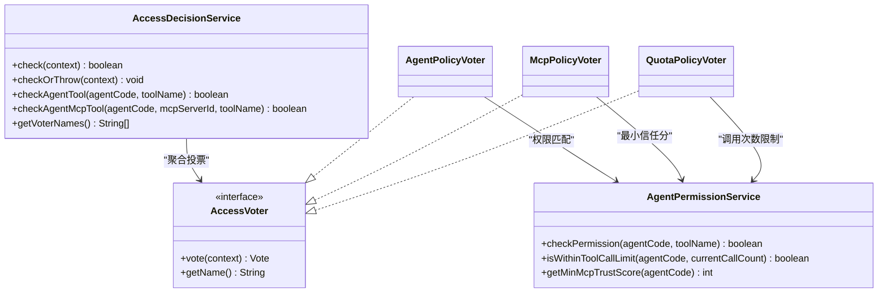

# 访问控制

<cite>
**本文引用的文件**
- [AccessDecisionContext.java](file://src/main/java/com/yupi/yuaiagent/access/AccessDecisionContext.java)
- [AccessDecisionService.java](file://src/main/java/com/yupi/yuaiagent/access/AccessDecisionService.java)
- [AccessVoter.java](file://src/main/java/com/yupi/yuaiagent/access/AccessVoter.java)
- [AgentPolicyVoter.java](file://src/main/java/com/yupi/yuaiagent/access/AgentPolicyVoter.java)
- [McpPolicyVoter.java](file://src/main/java/com/yupi/yuaiagent/access/McpPolicyVoter.java)
- [QuotaPolicyVoter.java](file://src/main/java/com/yupi/yuaiagent/access/QuotaPolicyVoter.java)
- [AgentPermissionService.java](file://src/main/java/com/yupi/yuaiagent/permission/AgentPermissionService.java)
</cite>

## 目录
1. [引言](#引言)
2. [项目结构](#项目结构)
3. [核心组件](#核心组件)
4. [架构总览](#架构总览)
5. [详细组件分析](#详细组件分析)
6. [依赖关系分析](#依赖关系分析)
7. [性能考虑](#性能考虑)
8. [故障排除指南](#故障排除指南)
9. [结论](#结论)
10. [附录](#附录)

## 引言
本文件面向开发者与运维人员，系统性阐述访问控制子系统的架构设计与实现细节，重点覆盖统一访问决策服务的决策流程、投票机制、三类策略投票器（智能体策略、MCP 策略、配额策略）的工作原理、访问决策上下文的数据结构与传递方式、策略配置与优先级、多策略合并与冲突处理、性能优化与监控指标，以及实际配置示例与故障排除方法。

## 项目结构
访问控制相关代码位于访问域包内，围绕“投票器接口 + 决策服务 + 上下文对象”的分层组织，职责清晰、扩展性强。核心文件如下：
- 访问决策上下文：封装一次 Tool 调用涉及的所有安全维度
- 投票器接口：统一的投票抽象，定义 ALLOW/DENY/ABSTAIN 三种结果
- 三类投票器：分别负责智能体权限、MCP 信任、单次请求配额
- 决策服务：聚合投票结果，执行“一票否决 + 全部弃权默认拒绝”的决策策略
- 权限服务：基于配置文件的权限模型与工具模式匹配逻辑

图表来源
- [AccessDecisionContext.java:1-48](file://src/main/java/com/yupi/yuaiagent/access/AccessDecisionContext.java#L1-L48)
- [AccessDecisionService.java:1-119](file://src/main/java/com/yupi/yuaiagent/access/AccessDecisionService.java#L1-L119)
- [AccessVoter.java:1-38](file://src/main/java/com/yupi/yuaiagent/access/AccessVoter.java#L1-L38)
- [AgentPolicyVoter.java:1-45](file://src/main/java/com/yupi/yuaiagent/access/AgentPolicyVoter.java#L1-L45)
- [McpPolicyVoter.java:1-60](file://src/main/java/com/yupi/yuaiagent/access/McpPolicyVoter.java#L1-L60)
- [QuotaPolicyVoter.java:1-43](file://src/main/java/com/yupi/yuaiagent/access/QuotaPolicyVoter.java#L1-L43)
- [AgentPermissionService.java:1-120](file://src/main/java/com/yupi/yuaiagent/permission/AgentPermissionService.java#L1-L120)

章节来源
- [AccessDecisionContext.java:1-48](file://src/main/java/com/yupi/yuaiagent/access/AccessDecisionContext.java#L1-L48)
- [AccessDecisionService.java:1-119](file://src/main/java/com/yupi/yuaiagent/access/AccessDecisionService.java#L1-L119)
- [AccessVoter.java:1-38](file://src/main/java/com/yupi/yuaiagent/access/AccessVoter.java#L1-L38)
- [AgentPolicyVoter.java:1-45](file://src/main/java/com/yupi/yuaiagent/access/AgentPolicyVoter.java#L1-L45)
- [McpPolicyVoter.java:1-60](file://src/main/java/com/yupi/yuaiagent/access/McpPolicyVoter.java#L1-L60)
- [QuotaPolicyVoter.java:1-43](file://src/main/java/com/yupi/yuaiagent/access/QuotaPolicyVoter.java#L1-L43)
- [AgentPermissionService.java:1-120](file://src/main/java/com/yupi/yuaiagent/permission/AgentPermissionService.java#L1-L120)

## 核心组件
- 访问决策上下文：承载用户标识、Agent 编码、Tool 名称、MCP Server ID、当前请求已调用 Tool 次数、请求 ID 等关键字段，作为投票器输入
- 投票器接口：定义 vote(context) 与 getName()，统一抽象不同安全维度的判断逻辑
- 统一访问决策服务：遍历已注册投票器，按“一票否决 + 全部弃权默认拒绝”策略生成最终结果，并记录审计日志
- 三类策略投票器：
  - 智能体策略投票器：基于权限配置文件中的允许模式（支持通配符）判断是否允许
  - MCP 策略投票器：先检查 MCP Server 是否允许提供该 Tool，再检查该 Server 的信任分是否满足 Agent 最低要求
  - 配额策略投票器：检查单次请求中 Tool 调用次数是否超过配置上限
- 权限服务：提供权限匹配、文件系统/网络访问能力、MCP 最低信任分、单次请求最大调用次数等查询能力

章节来源
- [AccessDecisionContext.java:13-47](file://src/main/java/com/yupi/yuaiagent/access/AccessDecisionContext.java#L13-L47)
- [AccessVoter.java:11-37](file://src/main/java/com/yupi/yuaiagent/access/AccessVoter.java#L11-L37)
- [AccessDecisionService.java:23-87](file://src/main/java/com/yupi/yuaiagent/access/AccessDecisionService.java#L23-L87)
- [AgentPolicyVoter.java:16-43](file://src/main/java/com/yupi/yuaiagent/access/AgentPolicyVoter.java#L16-L43)
- [McpPolicyVoter.java:19-58](file://src/main/java/com/yupi/yuaiagent/access/McpPolicyVoter.java#L19-L58)
- [QuotaPolicyVoter.java:16-41](file://src/main/java/com/yupi/yuaiagent/access/QuotaPolicyVoter.java#L16-L41)
- [AgentPermissionService.java:21-99](file://src/main/java/com/yupi/yuaiagent/permission/AgentPermissionService.java#L21-L99)

## 架构总览
访问控制采用“策略投票 + 统一决策”的架构。每个安全维度由独立的投票器负责，决策服务负责收集并汇总投票结果，形成最终的访问许可决定。

图表来源
- [AccessDecisionService.java:37-74](file://src/main/java/com/yupi/yuaiagent/access/AccessDecisionService.java#L37-L74)
- [AgentPolicyVoter.java:20-38](file://src/main/java/com/yupi/yuaiagent/access/AgentPolicyVoter.java#L20-L38)
- [McpPolicyVoter.java:24-53](file://src/main/java/com/yupi/yuaiagent/access/McpPolicyVoter.java#L24-L53)
- [QuotaPolicyVoter.java:20-36](file://src/main/java/com/yupi/yuaiagent/access/QuotaPolicyVoter.java#L20-L36)
- [AgentPermissionService.java:33-92](file://src/main/java/com/yupi/yuaiagent/permission/AgentPermissionService.java#L33-L92)

## 详细组件分析

### 访问决策上下文（AccessDecisionContext）
- 字段说明
  - 用户 ID：支持匿名场景
  - Agent 编码：如 resume-agent
  - Tool 名称：如 resume.optimize
  - MCP Server ID：非 MCP Tool 时为 null
  - 当前请求已调用 Tool 次数：用于配额检查
  - 请求 ID：用于审计关联
- 设计要点
  - Builder 模式便于在便捷方法中构造上下文
  - 字段覆盖多安全维度，确保投票器可按需使用

章节来源
- [AccessDecisionContext.java:15-47](file://src/main/java/com/yupi/yuaiagent/access/AccessDecisionContext.java#L15-L47)

### 投票器接口（AccessVoter）
- 投票结果枚举：ALLOW、DENY、ABSTAIN
- 核心方法：vote(context) 返回投票结果；getName() 返回投票器名称（用于日志与审计）
- 设计原则
  - 每个投票器专注单一安全维度
  - 通过 ABSTAIN 表达“不参与决策”，避免强制影响结果

章节来源
- [AccessVoter.java:11-37](file://src/main/java/com/yupi/yuaiagent/access/AccessVoter.java#L11-L37)

### 统一访问决策服务（AccessDecisionService）
- 决策策略
  - 一票否决：任一投票器投 DENY 即拒绝
  - 全部弃权默认拒绝：无 ALLOW 且全部 ABSTAIN 时拒绝
- 关键行为
  - 日志记录每轮投票结果
  - 审计记录允许/拒绝事件
  - 提供布尔与抛异常两种检查方式
  - 提供便捷方法快速检查 Agent-Tool 或 Agent-MCP-Tool 的权限
  - 暴露已注册投票器名称列表，便于管理与调试

图表来源
- [AccessDecisionService.java:37-74](file://src/main/java/com/yupi/yuaiagent/access/AccessDecisionService.java#L37-L74)

章节来源
- [AccessDecisionService.java:23-117](file://src/main/java/com/yupi/yuaiagent/access/AccessDecisionService.java#L23-L117)

### 智能体策略投票器（AgentPolicyVoter）
- 输入：Agent 编码与 Tool 名称
- 规则
  - 若缺少必要字段，直接弃权
  - 否则委托权限服务进行权限匹配（支持通配符）
  - 允许或拒绝并记录日志
- 复杂度
  - 权限匹配为线性扫描允许模式集合，时间复杂度 O(P)，P 为该 Agent 的允许模式数量

章节来源
- [AgentPolicyVoter.java:16-43](file://src/main/java/com/yupi/yuaiagent/access/AgentPolicyVoter.java#L16-L43)
- [AgentPermissionService.java:33-53](file://src/main/java/com/yupi/yuaiagent/permission/AgentPermissionService.java#L33-L53)

### MCP 策略投票器（McpPolicyVoter）
- 输入：MCP Server ID、Tool 名称、Agent 编码
- 规则
  - 无 MCP Server ID 时弃权
  - 先检查 MCP Server 是否允许提供该 Tool
  - 再检查该 Server 的信任分是否满足 Agent 的最低要求
  - 允许或拒绝并记录日志
- 复杂度
  - 两次外部服务检查，取决于具体实现；整体近似 O(1)

章节来源
- [McpPolicyVoter.java:19-58](file://src/main/java/com/yupi/yuaiagent/access/McpPolicyVoter.java#L19-L58)
- [AgentPermissionService.java:97-98](file://src/main/java/com/yupi/yuaiagent/permission/AgentPermissionService.java#L97-L98)

### 配额策略投票器（QuotaPolicyVoter）
- 输入：Agent 编码、当前请求已调用 Tool 次数
- 规则
  - 无 Agent 编码时弃权
  - 否则比较当前调用次数与配置上限
  - 允许或拒绝并记录日志
- 复杂度
  - O(1)

章节来源
- [QuotaPolicyVoter.java:16-41](file://src/main/java/com/yupi/yuaiagent/access/QuotaPolicyVoter.java#L16-L41)
- [AgentPermissionService.java:86-92](file://src/main/java/com/yupi/yuaiagent/permission/AgentPermissionService.java#L86-L92)

### 权限服务（AgentPermissionService）
- 工具模式匹配
  - 支持通配符：*、命名空间.*、精确匹配
  - 匹配逻辑以“优先级 + 线性扫描”实现
- 特殊策略
  - Admin 画像跳过所有权限检查
- 查询能力
  - 文件系统访问、网络访问能力
  - 单次请求最大 Tool 调用次数
  - 最低 MCP 信任分

章节来源
- [AgentPermissionService.java:21-118](file://src/main/java/com/yupi/yuaiagent/permission/AgentPermissionService.java#L21-L118)

## 依赖关系分析
- 决策服务依赖注入一组 AccessVoter 实现，体现“策略可插拔”
- 三类投票器均依赖权限服务完成具体策略判断
- 决策服务与审计日志组件协作，保证可追溯性

图表来源
- [AccessDecisionService.java:23-117](file://src/main/java/com/yupi/yuaiagent/access/AccessDecisionService.java#L23-L117)
- [AccessVoter.java:11-37](file://src/main/java/com/yupi/yuaiagent/access/AccessVoter.java#L11-L37)
- [AgentPolicyVoter.java:16-43](file://src/main/java/com/yupi/yuaiagent/access/AgentPolicyVoter.java#L16-L43)
- [McpPolicyVoter.java:19-58](file://src/main/java/com/yupi/yuaiagent/access/McpPolicyVoter.java#L19-L58)
- [QuotaPolicyVoter.java:16-41](file://src/main/java/com/yupi/yuaiagent/access/QuotaPolicyVoter.java#L16-L41)
- [AgentPermissionService.java:21-99](file://src/main/java/com/yupi/yuaiagent/permission/AgentPermissionService.java#L21-L99)

## 性能考虑
- 投票器数量与顺序
  - 投票器越多，决策耗时越长；建议按“快速失败 + 成功率高者优先”的原则调整顺序
- 权限匹配复杂度
  - 工具模式匹配为线性扫描，建议控制每个 Agent 的允许模式数量，避免过多通配符导致匹配开销上升
- 外部依赖
  - MCP 信任检查与最小信任分查询属于外部依赖，应关注其延迟与可用性；可在投票器内部增加短路条件减少不必要的调用
- 日志与审计
  - 审计与日志会带来额外开销，建议在生产环境按需降级日志级别，保留关键路径的审计记录
- 并发与缓存
  - 可对权限配置与 MCP 信任信息进行本地缓存，降低重复查询成本（需结合配置变更通知）

## 故障排除指南
- 现象：所有投票器都返回 ABSTAIN，最终被拒绝
  - 可能原因：上下文字段缺失（如 Agent 编码、Tool 名称），导致投票器无法参与判断
  - 处理建议：检查调用侧是否正确填充 AccessDecisionContext；确认便捷方法参数是否完整
- 现象：某投票器 DENY 导致拒绝
  - 可能原因：权限配置未包含该 Tool 模式；MCP Server 不允许提供该 Tool；MCP 信任分不足；单次调用次数超限
  - 处理建议：查看对应投票器的日志与审计记录，核对配置文件与 MCP 信任等级；必要时临时放宽策略定位问题
- 现象：无投票器注册
  - 可能原因：Spring 容器未发现 AccessVoter 实现
  - 处理建议：确认@Component 注解与包扫描范围；使用 getVoterNames() 接口验证已注册投票器列表
- 现象：决策结果与预期不符
  - 可能原因：策略优先级与组合规则理解偏差；通配符匹配规则未生效
  - 处理建议：核对权限配置文件中的允许模式；确认通配符使用是否符合预期；必要时启用更详细的日志级别

章节来源
- [AccessDecisionService.java:37-74](file://src/main/java/com/yupi/yuaiagent/access/AccessDecisionService.java#L37-L74)
- [AgentPolicyVoter.java:20-38](file://src/main/java/com/yupi/yuaiagent/access/AgentPolicyVoter.java#L20-L38)
- [McpPolicyVoter.java:24-53](file://src/main/java/com/yupi/yuaiagent/access/McpPolicyVoter.java#L24-L53)
- [QuotaPolicyVoter.java:20-36](file://src/main/java/com/yupi/yuaiagent/access/QuotaPolicyVoter.java#L20-L36)
- [AgentPermissionService.java:109-118](file://src/main/java/com/yupi/yuaiagent/permission/AgentPermissionService.java#L109-L118)

## 结论
本访问控制系统通过“策略投票 + 统一决策”的架构实现了灵活、可扩展的安全控制。三类投票器分别覆盖智能体权限、MCP 信任与配额限制，配合严格的“一票否决 + 全部弃权默认拒绝”策略，确保系统在默认安全的前提下具备良好的可维护性与可观测性。建议在生产环境中结合性能优化与监控指标持续迭代策略配置与实现细节。

## 附录

### 访问控制策略配置指南
- 策略优先级与决策规则
  - 投票器顺序：建议将“快速失败”与“成功率高”的投票器置于前列，减少后续调用成本
  - 决策规则：遵循“一票否决 + 全部弃权默认拒绝”，确保安全性
- 工具模式匹配
  - 支持：*（全部）、命名空间.*（命名空间下全部）、精确匹配
  - 建议：尽量使用精确匹配与命名空间限定，减少通配符带来的匹配开销
- MCP 信任与配额
  - MCP 信任分：通过 Agent 的最低信任分要求与 MCP Server 的信任分检查共同决定
  - 配额：按单次请求统计 Tool 调用次数，超过上限即拒绝

章节来源
- [AgentPermissionService.java:109-118](file://src/main/java/com/yupi/yuaiagent/permission/AgentPermissionService.java#L109-L118)
- [McpPolicyVoter.java:42-49](file://src/main/java/com/yupi/yuaiagent/access/McpPolicyVoter.java#L42-L49)
- [QuotaPolicyVoter.java:26-35](file://src/main/java/com/yupi/yuaiagent/access/QuotaPolicyVoter.java#L26-L35)

### 多策略投票的合并算法与冲突解决
- 合并算法
  - 遍历所有投票器，收集结果
  - 若出现 DENY，立即终止并拒绝
  - 若出现 ALLOW，继续遍历
  - 遍历结束后若存在 ALLOW，则允许；否则拒绝
- 冲突解决
  - 通过“一票否决”机制解决冲突，确保安全边界
  - 若所有投票器均 ABSTAIN，视为默认拒绝，避免误放行

章节来源
- [AccessDecisionService.java:46-74](file://src/main/java/com/yupi/yuaiagent/access/AccessDecisionService.java#L46-L74)

### 监控指标建议
- 投票器命中率：统计每个投票器的 ALLOW/DENY/ABSTAIN 比例
- 决策耗时：记录 check(context) 的耗时分布
- 审计事件：允许/拒绝事件总量与失败原因分布
- 外部依赖延迟：MCP 信任检查与权限服务查询的 P95/P99 延迟

### 实际配置示例（步骤说明）
- 步骤 1：在权限配置中为 Agent 定义允许的工具模式（支持通配符）
- 步骤 2：为需要 MCP 的场景配置 MCP Server 的信任分与允许提供的工具清单
- 步骤 3：为 Agent 设置单次请求的最大 Tool 调用次数
- 步骤 4：在调用侧构建 AccessDecisionContext，填充 Agent 编码、Tool 名称、MCP Server ID（如有）、当前调用次数与请求 ID
- 步骤 5：调用 AccessDecisionService.check(context) 或 checkOrThrow(context) 进行权限校验

章节来源
- [AccessDecisionContext.java:15-47](file://src/main/java/com/yupi/yuaiagent/access/AccessDecisionContext.java#L15-L47)
- [AccessDecisionService.java:92-108](file://src/main/java/com/yupi/yuaiagent/access/AccessDecisionService.java#L92-L108)
- [AgentPermissionService.java:33-92](file://src/main/java/com/yupi/yuaiagent/permission/AgentPermissionService.java#L33-L92)