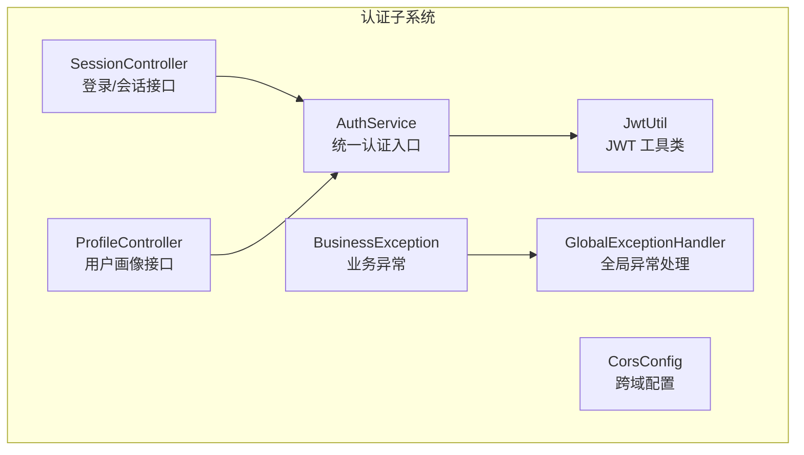
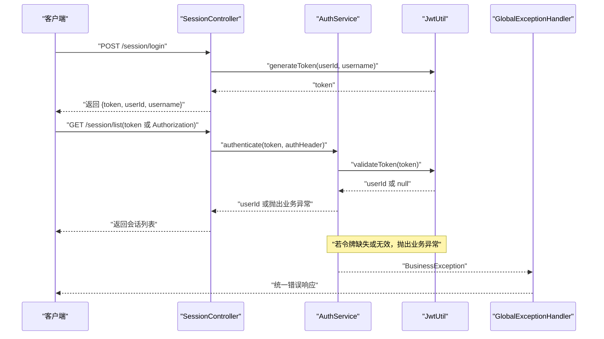
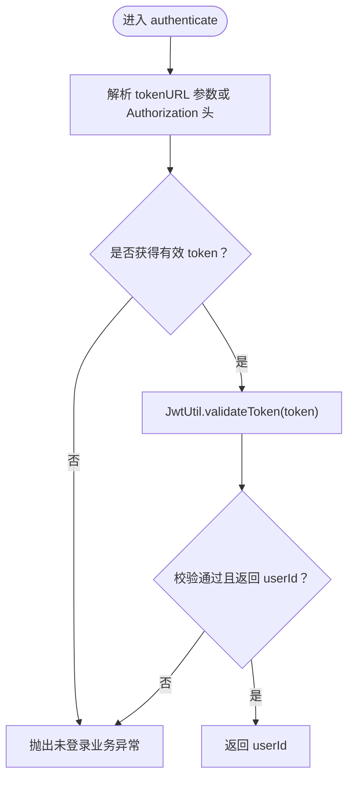
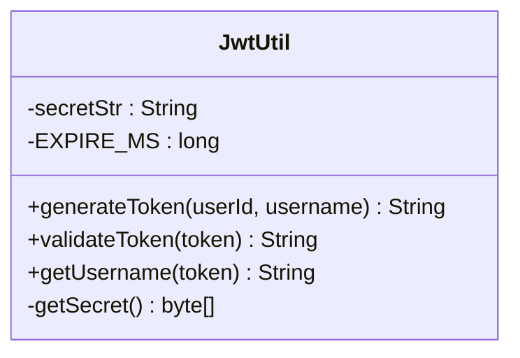
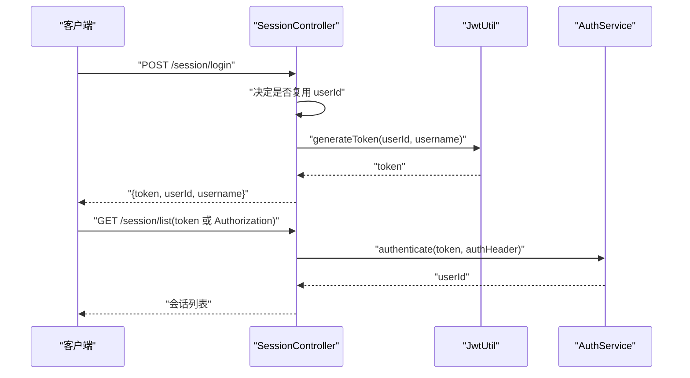
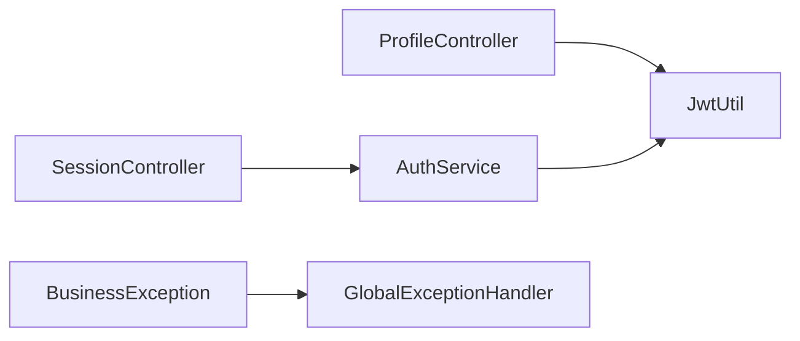

# 身份认证

<cite>
**本文引用的文件**
- [AuthService.java](file://src/main/java/com/yupi/yuaiagent/auth/AuthService.java)
- [JwtUtil.java](file://src/main/java/com/yupi/yuaiagent/auth/JwtUtil.java)
- [SessionController.java](file://src/main/java/com/yupi/yuaiagent/controller/SessionController.java)
- [ProfileController.java](file://src/main/java/com/yupi/yuaiagent/controller/ProfileController.java)
- [BusinessException.java](file://src/main/java/com/yupi/yuaiagent/exception/BusinessException.java)
- [GlobalExceptionHandler.java](file://src/main/java/com/yupi/yuaiagent/exception/GlobalExceptionHandler.java)
- [CorsConfig.java](file://src/main/java/com/yupi/yuaiagent/config/CorsConfig.java)
- [application.yml](file://src/main/resources/application.yml)
- [application-prod.yml](file://src/main/resources/application-prod.yml)
- [TraceControllerTest.java](file://src/test/java/com/yupi/yuaiagent/trace/TraceControllerTest.java)
</cite>

## 目录
1. [引言](#引言)
2. [项目结构](#项目结构)
3. [核心组件](#核心组件)
4. [架构总览](#架构总览)
5. [详细组件分析](#详细组件分析)
6. [依赖分析](#依赖分析)
7. [性能考虑](#性能考虑)
8. [故障排查指南](#故障排查指南)
9. [结论](#结论)
10. [附录](#附录)

## 引言
本文件系统性梳理并解释本项目的身份认证体系，重点覆盖以下方面：
- JWT 令牌的生成、验证与过期管理
- 认证服务的实现原理（凭据来源、令牌发放、会话管理）
- JWT 工具类的功能边界（解析、声明提取、权限校验思路）
- 完整认证流程实现指南（登录、令牌续期、注销）
- 认证中间件与安全配置（拦截器/过滤器、CORS、异常处理）
- 密码加密、令牌存储与传输安全最佳实践
- 测试方法与调试技巧

## 项目结构
认证相关代码主要分布在以下模块：
- auth 包：集中式认证服务与 JWT 工具类
- controller 包：登录与受保护资源访问入口
- exception 包：业务异常与全局异常处理
- config 包：跨域等基础安全配置
- resources：应用配置文件（含生产配置占位）

图表来源
- [AuthService.java:1-54](file://src/main/java/com/yupi/yuaiagent/auth/AuthService.java#L1-L54)
- [JwtUtil.java:1-79](file://src/main/java/com/yupi/yuaiagent/auth/JwtUtil.java#L1-L79)
- [SessionController.java:34-84](file://src/main/java/com/yupi/yuaiagent/controller/SessionController.java#L34-L84)
- [ProfileController.java:38-61](file://src/main/java/com/yupi/yuaiagent/controller/ProfileController.java#L38-L61)
- [BusinessException.java:1-51](file://src/main/java/com/yupi/yuaiagent/exception/BusinessException.java#L1-L51)
- [GlobalExceptionHandler.java:1-54](file://src/main/java/com/yupi/yuaiagent/exception/GlobalExceptionHandler.java#L1-L54)
- [CorsConfig.java:1-25](file://src/main/java/com/yupi/yuaiagent/config/CorsConfig.java#L1-L25)

章节来源
- [AuthService.java:1-54](file://src/main/java/com/yupi/yuaiagent/auth/AuthService.java#L1-L54)
- [JwtUtil.java:1-79](file://src/main/java/com/yupi/yuaiagent/auth/JwtUtil.java#L1-L79)
- [SessionController.java:34-84](file://src/main/java/com/yupi/yuaiagent/controller/SessionController.java#L34-L84)
- [ProfileController.java:38-61](file://src/main/java/com/yupi/yuaiagent/controller/ProfileController.java#L38-L61)
- [BusinessException.java:1-51](file://src/main/java/com/yupi/yuaiagent/exception/BusinessException.java#L1-L51)
- [GlobalExceptionHandler.java:1-54](file://src/main/java/com/yupi/yuaiagent/exception/GlobalExceptionHandler.java#L1-L54)
- [CorsConfig.java:1-25](file://src/main/java/com/yupi/yuaiagent/config/CorsConfig.java#L1-L25)

## 核心组件
- AuthService：统一认证入口，负责从 URL 查询参数或 Authorization 头解析 JWT，并调用 JwtUtil 进行校验，失败抛出业务异常
- JwtUtil：JWT 工具类，负责密钥加载、令牌生成、验证与声明提取
- SessionController：提供登录接口；其他受保护接口在入口处调用 AuthService 获取 userId
- ProfileController：部分接口直接从 Authorization 头解析并校验令牌
- BusinessException/GlobalExceptionHandler：统一业务异常与错误响应格式
- CorsConfig：全局跨域配置，支持携带 Cookie

章节来源
- [AuthService.java:20-53](file://src/main/java/com/yupi/yuaiagent/auth/AuthService.java#L20-L53)
- [JwtUtil.java:19-78](file://src/main/java/com/yupi/yuaiagent/auth/JwtUtil.java#L19-L78)
- [SessionController.java:39-47](file://src/main/java/com/yupi/yuaiagent/controller/SessionController.java#L39-L47)
- [ProfileController.java:57-60](file://src/main/java/com/yupi/yuaiagent/controller/ProfileController.java#L57-L60)
- [BusinessException.java:34-50](file://src/main/java/com/yupi/yuaiagent/exception/BusinessException.java#L34-L50)
- [GlobalExceptionHandler.java:22-26](file://src/main/java/com/yupi/yuaiagent/exception/GlobalExceptionHandler.java#L22-L26)
- [CorsConfig.java:11-24](file://src/main/java/com/yupi/yuaiagent/config/CorsConfig.java#L11-L24)

## 架构总览
下图展示认证流程在系统中的交互关系与数据流。

图表来源
- [SessionController.java:39-47](file://src/main/java/com/yupi/yuaiagent/controller/SessionController.java#L39-L47)
- [AuthService.java:32-42](file://src/main/java/com/yupi/yuaiagent/auth/AuthService.java#L32-L42)
- [JwtUtil.java:35-41](file://src/main/java/com/yupi/yuaiagent/auth/JwtUtil.java#L35-L41)
- [BusinessException.java:36-38](file://src/main/java/com/yupi/yuaiagent/exception/BusinessException.java#L36-L38)
- [GlobalExceptionHandler.java:22-26](file://src/main/java/com/yupi/yuaiagent/exception/GlobalExceptionHandler.java#L22-L26)

## 详细组件分析

### 组件一：AuthService（统一认证入口）
- 功能要点
  - 从 URL 查询参数或 Authorization 头解析 JWT
  - 若两者均为空，抛出“未登录”业务异常
  - 调用 JwtUtil.validateToken 校验令牌有效性
  - 校验失败同样抛出“未登录”业务异常
- 错误处理
  - 使用 BusinessException.notLoggedIn() 统一表示未登录/无效令牌
  - 由 GlobalExceptionHandler 将异常转换为标准响应

图表来源
- [AuthService.java:32-42](file://src/main/java/com/yupi/yuaiagent/auth/AuthService.java#L32-L42)
- [JwtUtil.java:46-65](file://src/main/java/com/yupi/yuaiagent/auth/JwtUtil.java#L46-L65)
- [BusinessException.java:36-38](file://src/main/java/com/yupi/yuaiagent/exception/BusinessException.java#L36-L38)

章节来源
- [AuthService.java:24-52](file://src/main/java/com/yupi/yuaiagent/auth/AuthService.java#L24-L52)
- [BusinessException.java:36-38](file://src/main/java/com/yupi/yuaiagent/exception/BusinessException.java#L36-L38)

### 组件二：JwtUtil（JWT 工具类）
- 令牌生成
  - 载荷包含：userId、username、exp（当前时间偏移 7 天）
  - 使用配置的密钥进行签名
- 令牌验证
  - 验证签名与过期时间
  - 过期或签名不通过返回 null
- 声明提取
  - 提供 getUsername(token) 用于从令牌提取用户名
- 密钥管理
  - 从配置注入密钥（开发默认值，生产通过环境变量覆盖）

图表来源
- [JwtUtil.java:19-78](file://src/main/java/com/yupi/yuaiagent/auth/JwtUtil.java#L19-L78)

章节来源
- [JwtUtil.java:21-77](file://src/main/java/com/yupi/yuaiagent/auth/JwtUtil.java#L21-L77)

### 组件三：SessionController（登录与会话接口）
- 登录接口
  - 支持复用现有 userId（用于“令牌续期”场景），否则生成新 userId
  - 调用 JwtUtil 生成 token 并返回
- 会话相关接口
  - 在每个需要认证的接口入口调用 AuthService.authenticate 获取 userId
  - 未提供有效令牌时返回 401

图表来源
- [SessionController.java:39-47](file://src/main/java/com/yupi/yuaiagent/controller/SessionController.java#L39-L47)
- [SessionController.java:61-66](file://src/main/java/com/yupi/yuaiagent/controller/SessionController.java#L61-L66)
- [AuthService.java:32-42](file://src/main/java/com/yupi/yuaiagent/auth/AuthService.java#L32-L42)
- [JwtUtil.java:35-41](file://src/main/java/com/yupi/yuaiagent/auth/JwtUtil.java#L35-L41)

章节来源
- [SessionController.java:39-82](file://src/main/java/com/yupi/yuaiagent/controller/SessionController.java#L39-L82)

### 组件四：ProfileController（用户画像接口）
- 部分接口直接从 Authorization 头解析并校验令牌
- 未提供有效令牌时返回 401

章节来源
- [ProfileController.java:57-60](file://src/main/java/com/yupi/yuaiagent/controller/ProfileController.java#L57-L60)

### 组件五：异常处理（BusinessException 与 GlobalExceptionHandler）
- BusinessException：封装业务错误码与消息，提供 notLoggedIn、forbidden 等工厂方法
- GlobalExceptionHandler：捕获 BusinessException 并统一返回标准响应；其他异常按默认策略处理

章节来源
- [BusinessException.java:11-50](file://src/main/java/com/yupi/yuaiagent/exception/BusinessException.java#L11-L50)
- [GlobalExceptionHandler.java:22-26](file://src/main/java/com/yupi/yuaiagent/exception/GlobalExceptionHandler.java#L22-L26)

## 依赖分析
- 组件耦合
  - SessionController 与 ProfileController 依赖 AuthService
  - AuthService 依赖 JwtUtil
  - 异常处理由 GlobalExceptionHandler 统一承接
- 外部依赖
  - JWT 解析与签发使用第三方库（通过 JwtUtil 封装）
- 配置依赖
  - JWT 密钥通过配置注入
  - CORS 全局放行策略

图表来源
- [SessionController.java:39-47](file://src/main/java/com/yupi/yuaiagent/controller/SessionController.java#L39-L47)
- [ProfileController.java:57-60](file://src/main/java/com/yupi/yuaiagent/controller/ProfileController.java#L57-L60)
- [AuthService.java:22-22](file://src/main/java/com/yupi/yuaiagent/auth/AuthService.java#L22-L22)
- [JwtUtil.java:22-23](file://src/main/java/com/yupi/yuaiagent/auth/JwtUtil.java#L22-L23)
- [BusinessException.java:36-38](file://src/main/java/com/yupi/yuaiagent/exception/BusinessException.java#L36-L38)
- [GlobalExceptionHandler.java:22-26](file://src/main/java/com/yupi/yuaiagent/exception/GlobalExceptionHandler.java#L22-L26)

章节来源
- [SessionController.java:39-82](file://src/main/java/com/yupi/yuaiagent/controller/SessionController.java#L39-L82)
- [ProfileController.java:57-60](file://src/main/java/com/yupi/yuaiagent/controller/ProfileController.java#L57-L60)
- [AuthService.java:22-22](file://src/main/java/com/yupi/yuaiagent/auth/AuthService.java#L22-L22)
- [JwtUtil.java:22-23](file://src/main/java/com/yupi/yuaiagent/auth/JwtUtil.java#L22-L23)
- [BusinessException.java:36-38](file://src/main/java/com/yupi/yuaiagent/exception/BusinessException.java#L36-L38)
- [GlobalExceptionHandler.java:22-26](file://src/main/java/com/yupi/yuaiagent/exception/GlobalExceptionHandler.java#L22-L26)

## 性能考虑
- 令牌生成与验证均为内存计算，开销极低
- 建议在高并发场景下：
  - 控制令牌有效期，避免频繁签发
  - 对频繁访问的接口采用缓存策略（如基于 userId 的轻量缓存）
  - 合理设置密钥与过期时间，减少不必要的重新签发

## 故障排查指南
- 常见问题与定位
  - 401 未登录：检查 Authorization 头是否以 Bearer 开头，或 URL 是否携带 token 参数
  - 令牌过期：确认系统时间与令牌 exp 是否一致
  - 密钥不匹配：核对配置文件中的密钥是否与签发端一致
- 单元测试与集成测试
  - 使用测试用例验证未登录与无效令牌场景的响应码
  - 参考测试用例断言 401 场景与业务异常统一处理

章节来源
- [TraceControllerTest.java:126-152](file://src/test/java/com/yupi/yuaiagent/trace/TraceControllerTest.java#L126-L152)
- [TraceControllerTest.java:273-292](file://src/test/java/com/yupi/yuaiagent/trace/TraceControllerTest.java#L273-L292)
- [BusinessException.java:36-38](file://src/main/java/com/yupi/yuaiagent/exception/BusinessException.java#L36-L38)
- [GlobalExceptionHandler.java:22-26](file://src/main/java/com/yupi/yuaiagent/exception/GlobalExceptionHandler.java#L22-L26)

## 结论
本项目采用集中式认证服务与 JWT 工具类的组合，实现了从令牌签发、验证到异常统一处理的闭环。通过在控制器入口统一调用 AuthService，既保证了安全性，也提升了可维护性。建议在生产环境中强化密钥管理与传输安全，并结合前端与网关层完善令牌续期与注销机制。

## 附录

### 认证流程实现指南
- 登录接口
  - 请求路径：POST /session/login
  - 参数：username、userId（可选，用于复用）
  - 行为：根据是否提供 userId 决定复用或新建；调用 JwtUtil 生成 token 并返回
- 令牌续期
  - 建议在前端保存 userId，调用登录接口并传入 existingUserId 实现“续期”
- 注销机制
  - 当前控制器未提供显式注销接口；可在前端清除本地 token，在后续请求中自动失效

章节来源
- [SessionController.java:39-47](file://src/main/java/com/yupi/yuaiagent/controller/SessionController.java#L39-L47)

### 认证中间件与安全配置
- 中间件集成
  - 当前项目未引入 Filter/Interceptor 基础设施，采用在控制器入口调用 AuthService 的短期方案
  - 长期建议引入统一 Filter/Interceptor，从 Authorization 头或 token 参数解析 userId，Controller 仅消费 userId
- CORS 配置
  - 允许携带 Cookie，放行所有源与方法，便于前端跨域访问

章节来源
- [CorsConfig.java:11-24](file://src/main/java/com/yupi/yuaiagent/config/CorsConfig.java#L11-L24)

### 密码加密、令牌存储与传输安全最佳实践
- 密码加密
  - 用户凭据验证逻辑不在已分析文件中体现；建议采用强哈希算法（如 bcrypt）存储密码
- 令牌存储
  - 建议前端使用 HttpOnly Cookie 存储 token，避免 XSS 泄露
- 传输安全
  - 生产环境必须启用 HTTPS，防止中间人攻击
  - 密钥通过环境变量注入，避免硬编码

章节来源
- [application.yml](file://src/main/resources/application.yml)
- [application-prod.yml:1-2](file://src/main/resources/application-prod.yml#L1-L2)
- [JwtUtil.java:22-23](file://src/main/java/com/yupi/yuaiagent/auth/JwtUtil.java#L22-L23)