# 任务执行与调度

<cite>
**本文引用的文件**
- [TaskExecutor.java](file://src/main/java/com/yupi/yuaiagent/agent/TaskExecutor.java)
- [ExecutionResult.java](file://src/main/java/com/yupi/yuaiagent/agent/task/ExecutionResult.java)
- [TaskStatus.java](file://src/main/java/com/yupi/yuaiagent/agent/task/TaskStatus.java)
- [FailurePolicy.java](file://src/main/java/com/yupi/yuaiagent/agent/task/FailurePolicy.java)
- [WorkflowRuntime.java](file://src/main/java/com/yupi/yuaiagent/workflow/runtime/WorkflowRuntime.java)
- [WorkflowInstance.java](file://src/main/java/com/yupi/yuaiagent/workflow/runtime/WorkflowInstance.java)
- [WorkflowStatus.java](file://src/main/java/com/yupi/yuaiagent/workflow/runtime/WorkflowStatus.java)
- [WorkflowRepository.java](file://src/main/java/com/yupi/yuaiagent/workflow/runtime/WorkflowRepository.java)
- [TokenUsageTracker.java](file://src/main/java/com/yupi/yuaiagent/budget/TokenUsageTracker.java)
- [RuntimeContext.java](file://src/main/java/com/yupi/yuaiagent/context/RuntimeContext.java)
- [AgentRunner.java](file://src/main/java/com/yupi/yuaiagent/agent/AgentRunner.java)
- [WorkflowNode.java](file://src/main/java/com/yupi/yuaiagent/workflow/node/WorkflowNode.java)
- [PlanStep.java](file://src/main/java/com/yupi/yuaiagent/workflow/PlanStep.java)
- [WorkflowTemplate.java](file://src/main/java/com/yupi/yuaiagent/workflow/WorkflowTemplate.java)
- [TokenBudget.java](file://src/main/java/com/yupi/yuaiagent/budget/TokenBudget.java)
- [TokenUsage.java](file://src/main/java/com/yupi/yuaiagent/budget/TokenUsage.java)
</cite>

## 目录
1. [简介](#简介)
2. [项目结构](#项目结构)
3. [核心组件](#核心组件)
4. [架构总览](#架构总览)
5. [详细组件分析](#详细组件分析)
6. [依赖分析](#依赖分析)
7. [性能考虑](#性能考虑)
8. [故障排查指南](#故障排查指南)
9. [结论](#结论)
10. [附录](#附录)

## 简介
本文件围绕任务执行与调度系统，系统性梳理 TaskExecutor 的核心职责与执行流程；阐述 WorkflowRuntime 的实例管理与状态跟踪机制；解析 WorkflowInstance 的生命周期、状态转换与持久化策略；说明 ExecutionResult 的结构设计与结果处理方式；解释 TaskStatus 的状态枚举与状态机转换；给出任务调度的并发控制、资源限制与优先级管理建议；并提供监控指标、性能统计与异常处理实践，以及完整的任务执行示例与调试技巧。

## 项目结构
该系统采用分层与功能域结合的组织方式：
- 任务执行层：TaskExecutor、AgentRunner、ExecutionResult、TaskStatus、FailurePolicy
- 工作流运行时层：WorkflowRuntime、WorkflowInstance、WorkflowStatus、WorkflowRepository、WorkflowNode
- 预算与上下文：TokenUsageTracker、TokenBudget、TokenUsage、RuntimeContext
- 工作流编排：WorkflowTemplate、PlanStep

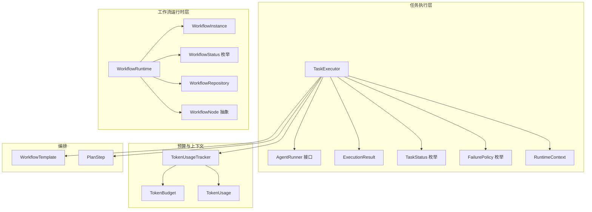

图表来源
- [TaskExecutor.java:30-145](file://src/main/java/com/yupi/yuaiagent/agent/TaskExecutor.java#L30-L145)
- [WorkflowRuntime.java:20-229](file://src/main/java/com/yupi/yuaiagent/workflow/runtime/WorkflowRuntime.java#L20-L229)
- [WorkflowInstance.java:18-75](file://src/main/java/com/yupi/yuaiagent/workflow/runtime/WorkflowInstance.java#L18-L75)
- [WorkflowRepository.java:23-114](file://src/main/java/com/yupi/yuaiagent/workflow/runtime/WorkflowRepository.java#L23-L114)
- [TokenUsageTracker.java:14-49](file://src/main/java/com/yupi/yuaiagent/budget/TokenUsageTracker.java#L14-L49)
- [RuntimeContext.java:16-57](file://src/main/java/com/yupi/yuaiagent/context/RuntimeContext.java#L16-L57)
- [AgentRunner.java:12-24](file://src/main/java/com/yupi/yuaiagent/agent/AgentRunner.java#L12-L24)
- [WorkflowNode.java:21-62](file://src/main/java/com/yupi/yuaiagent/workflow/node/WorkflowNode.java#L21-L62)
- [WorkflowTemplate.java:12-25](file://src/main/java/com/yupi/yuaiagent/workflow/WorkflowTemplate.java#L12-L25)
- [PlanStep.java:6-18](file://src/main/java/com/yupi/yuaiagent/workflow/PlanStep.java#L6-L18)
- [TokenBudget.java:6-15](file://src/main/java/com/yupi/yuaiagent/budget/TokenBudget.java#L6-L15)
- [TokenUsage.java:6-31](file://src/main/java/com/yupi/yuaiagent/budget/TokenUsage.java#L6-L31)

章节来源
- [TaskExecutor.java:30-145](file://src/main/java/com/yupi/yuaiagent/agent/TaskExecutor.java#L30-L145)
- [WorkflowRuntime.java:20-229](file://src/main/java/com/yupi/yuaiagent/workflow/runtime/WorkflowRuntime.java#L20-L229)

## 核心组件
- TaskExecutor：工作流步骤执行引擎，负责令牌预算检查、失败策略处理、结果收集与异常恢复。
- ExecutionResult：单步执行结果的统一载体，包含状态、输出、令牌用量、耗时与重试次数等。
- TaskStatus：任务状态枚举，覆盖待定、运行、成功、失败、重试中、跳过及其预算/策略原因。
- FailurePolicy：工作流失败处理策略，支持快速失败、重试后跳过、重试后失败、直接跳过。
- WorkflowRuntime：工作流运行时引擎，负责实例创建、节点执行、状态推进与暂停恢复。
- WorkflowInstance：工作流实例运行时状态，包含节点列表、上下文、历史记录与当前节点索引。
- WorkflowRepository：工作流实例持久化仓库，基于文件的并发安全存储。
- TokenUsageTracker：按工作流维度跟踪令牌使用并进行预算校验。
- RuntimeContext：可变运行时上下文，用于收集执行结果与跨步骤共享信息。
- AgentRunner：Agent 执行接口，屏蔽 RuntimeContext 细节，仅暴露 ConversationContext。
- WorkflowTemplate/PlanStep：工作流模板与步骤编排，定义 Agent 调度序列与预算策略。

章节来源
- [TaskExecutor.java:30-145](file://src/main/java/com/yupi/yuaiagent/agent/TaskExecutor.java#L30-L145)
- [ExecutionResult.java:9-44](file://src/main/java/com/yupi/yuaiagent/agent/task/ExecutionResult.java#L9-L44)
- [TaskStatus.java:6-16](file://src/main/java/com/yupi/yuaiagent/agent/task/TaskStatus.java#L6-L16)
- [FailurePolicy.java:6-19](file://src/main/java/com/yupi/yuaiagent/agent/task/FailurePolicy.java#L6-L19)
- [WorkflowRuntime.java:20-229](file://src/main/java/com/yupi/yuaiagent/workflow/runtime/WorkflowRuntime.java#L20-L229)
- [WorkflowInstance.java:18-75](file://src/main/java/com/yupi/yuaiagent/workflow/runtime/WorkflowInstance.java#L18-L75)
- [WorkflowRepository.java:23-114](file://src/main/java/com/yupi/yuaiagent/workflow/runtime/WorkflowRepository.java#L23-L114)
- [TokenUsageTracker.java:14-49](file://src/main/java/com/yupi/yuaiagent/budget/TokenUsageTracker.java#L14-L49)
- [RuntimeContext.java:16-57](file://src/main/java/com/yupi/yuaiagent/context/RuntimeContext.java#L16-L57)
- [AgentRunner.java:12-24](file://src/main/java/com/yupi/yuaiagent/agent/AgentRunner.java#L12-L24)
- [WorkflowTemplate.java:12-25](file://src/main/java/com/yupi/yuaiagent/workflow/WorkflowTemplate.java#L12-L25)
- [PlanStep.java:6-18](file://src/main/java/com/yupi/yuaiagent/workflow/PlanStep.java#L6-L18)

## 架构总览
系统以“决策（Agent）—执行（Workflow）”分离为原则：
- 决策侧：Agent 负责意图识别与计划生成，生成 PlanStep 序列。
- 执行侧：TaskExecutor 按步骤执行，结合预算与失败策略，收集 ExecutionResult。
- 运行时侧：WorkflowRuntime 驱动节点执行，维护 WorkflowInstance 生命周期与状态流转，并持久化到 WorkflowRepository。

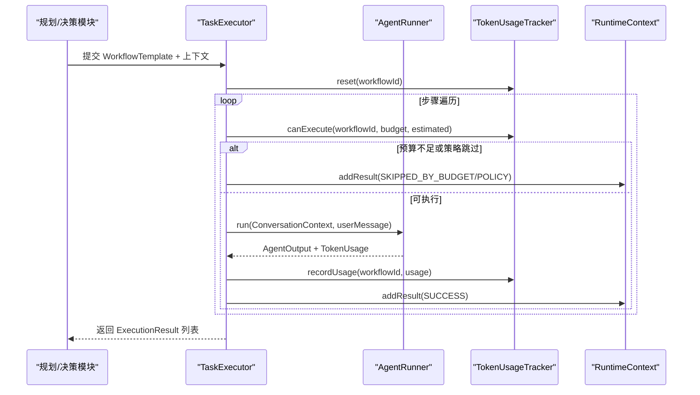

图表来源
- [TaskExecutor.java:51-110](file://src/main/java/com/yupi/yuaiagent/agent/TaskExecutor.java#L51-L110)
- [TokenUsageTracker.java:23-47](file://src/main/java/com/yupi/yuaiagent/budget/TokenUsageTracker.java#L23-L47)
- [RuntimeContext.java:22-28](file://src/main/java/com/yupi/yuaiagent/context/RuntimeContext.java#L22-L28)

## 详细组件分析

### TaskExecutor：任务执行引擎
职责与流程
- 初始化与注入：接收 TokenUsageTracker 与 AgentRunner 映射，按需注入。
- 执行主流程：
  - 重置工作流令牌用量
  - 遍历 WorkflowTemplate.steps，为每一步生成 taskId
  - 令牌预算估算与检查
  - 失败策略检查（FAIL_FAST）
  - 调用 AgentRunner 执行，记录耗时与令牌用量，产出 ExecutionResult
  - 异常处理：根据 FailurePolicy 决定重试、跳过或失败，并决定是否中断
- 结果汇总：返回 RuntimeContext 中收集的 ExecutionResult 列表

关键特性
- 预算驱动：通过 TokenUsageTracker 与 TokenBudget 控制执行节奏
- 策略驱动：FailurePolicy 决定容错与继续策略
- 结果聚合：统一的 ExecutionResult 结构便于上层消费

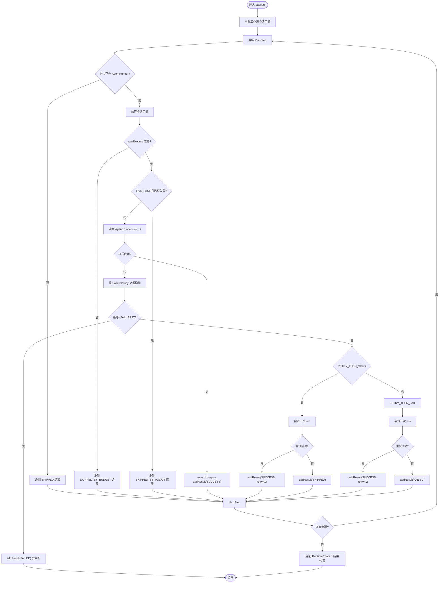

图表来源
- [TaskExecutor.java:51-145](file://src/main/java/com/yupi/yuaiagent/agent/TaskExecutor.java#L51-L145)
- [TokenUsageTracker.java:30-47](file://src/main/java/com/yupi/yuaiagent/budget/TokenUsageTracker.java#L30-L47)
- [RuntimeContext.java:22-28](file://src/main/java/com/yupi/yuaiagent/context/RuntimeContext.java#L22-L28)

章节来源
- [TaskExecutor.java:30-145](file://src/main/java/com/yupi/yuaiagent/agent/TaskExecutor.java#L30-L145)
- [RuntimeContext.java:16-57](file://src/main/java/com/yupi/yuaiagent/context/RuntimeContext.java#L16-L57)

### ExecutionResult：执行结果模型
结构与语义
- 字段：taskId、agentId、status、output、tokenUsage、durationMs、retryCount、error
- 辅助方法：isSuccess/isFailed/isSkipped 快速判断
- 工厂方法：success/failed/skipped 三态构造，保证不可变性与一致性

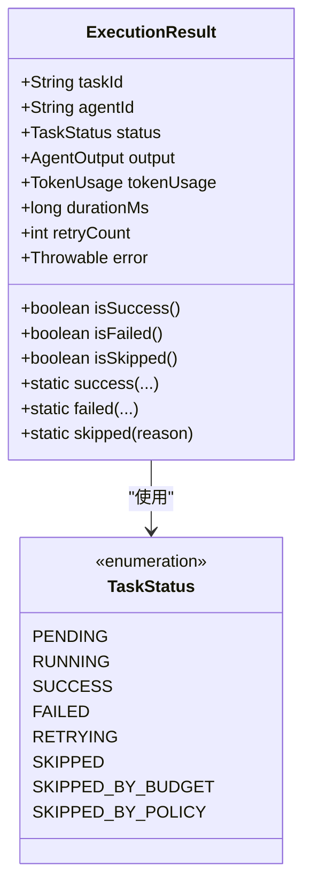

图表来源
- [ExecutionResult.java:9-44](file://src/main/java/com/yupi/yuaiagent/agent/task/ExecutionResult.java#L9-L44)
- [TaskStatus.java:6-16](file://src/main/java/com/yupi/yuaiagent/agent/task/TaskStatus.java#L6-L16)

章节来源
- [ExecutionResult.java:9-44](file://src/main/java/com/yupi/yuaiagent/agent/task/ExecutionResult.java#L9-L44)
- [TaskStatus.java:6-16](file://src/main/java/com/yupi/yuaiagent/agent/task/TaskStatus.java#L6-L16)

### TaskStatus 与状态机
状态枚举
- PENDING/RUNNING：任务准备与执行中
- SUCCESS/FAILED：最终成功或失败
- RETRYING：重试中（在当前实现中未显式设置，但可作为扩展）
- SKIPPED、SKIPPED_BY_BUDGET、SKIPPED_BY_POLICY：因策略或预算导致的跳过

状态机转换（简化）
- 任意状态 → RUNNING（执行阶段）
- RUNNING → SUCCESS/FAILED（正常完成）
- RUNNING → RETRYING → SUCCESS（重试成功）
- PENDING → SKIPPED（策略/预算原因）

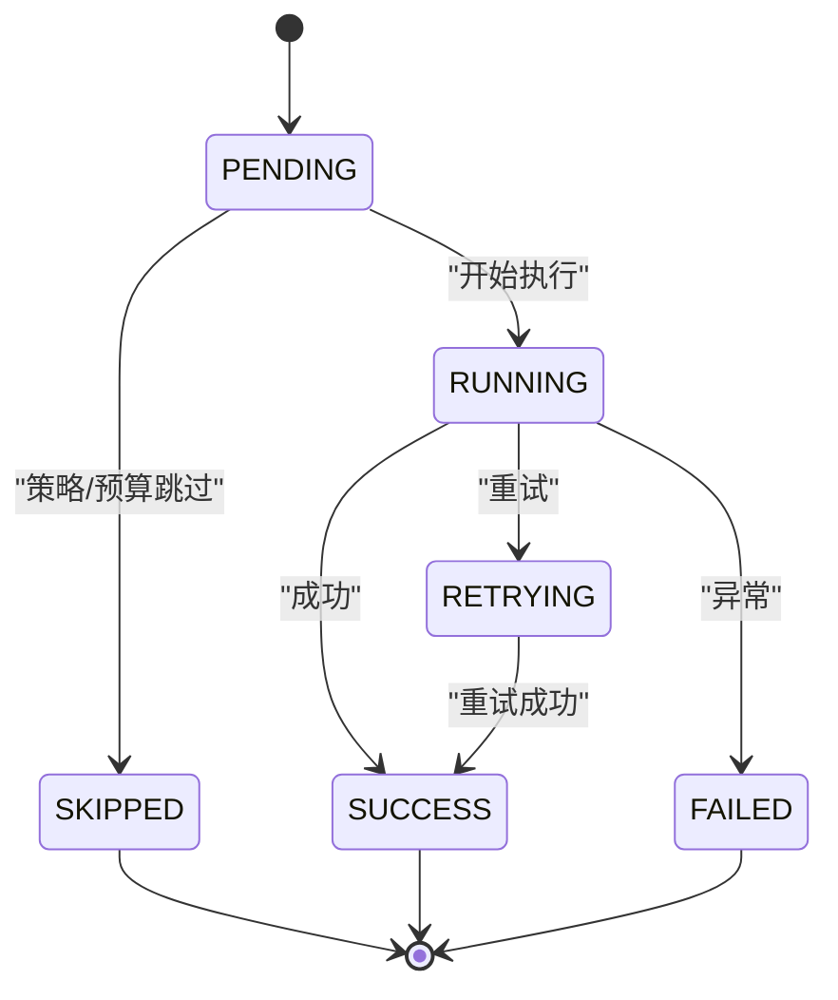

图表来源
- [TaskStatus.java:6-16](file://src/main/java/com/yupi/yuaiagent/agent/task/TaskStatus.java#L6-L16)

章节来源
- [TaskStatus.java:6-16](file://src/main/java/com/yupi/yuaiagent/agent/task/TaskStatus.java#L6-L16)

### FailurePolicy：失败策略
策略语义
- FAIL_FAST：出现异常即失败并中断后续步骤
- RETRY_THEN_SKIP：重试一次，成功则继续，失败则跳过
- RETRY_THEN_FAIL：重试一次，成功则继续，失败则整流程失败
- SKIP：直接跳过（如 Agent 未启用）

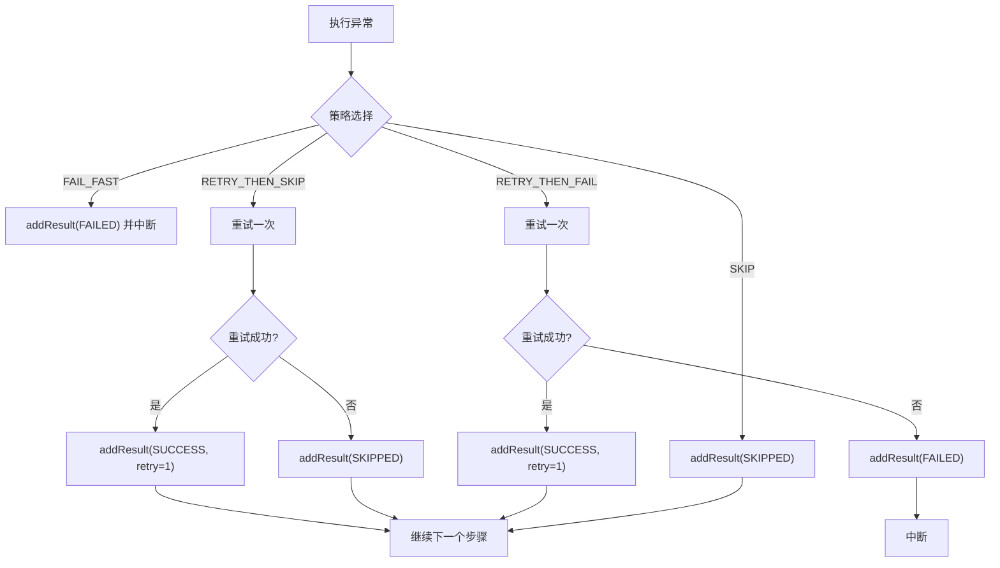

图表来源
- [TaskExecutor.java:112-138](file://src/main/java/com/yupi/yuaiagent/agent/TaskExecutor.java#L112-L138)
- [FailurePolicy.java:6-19](file://src/main/java/com/yupi/yuaiagent/agent/task/FailurePolicy.java#L6-L19)

章节来源
- [FailurePolicy.java:6-19](file://src/main/java/com/yupi/yuaiagent/agent/task/FailurePolicy.java#L6-L19)
- [TaskExecutor.java:112-138](file://src/main/java/com/yupi/yuaiagent/agent/TaskExecutor.java#L112-L138)

### WorkflowRuntime：实例管理与状态跟踪
职责
- 启动实例：生成实例 ID、初始上下文、状态设为 RUNNING，异步执行
- 恢复实例：从 PAUSED 恢复，可合并审批数据，继续执行
- 取消实例：将状态置为 CANCELLED
- 状态查询：按实例 ID 获取状态
- 节点执行：从当前节点开始顺序执行，记录 StepRecord，遇到审批节点暂停
- 失败处理：节点异常时记录 FAILED 状态并终止

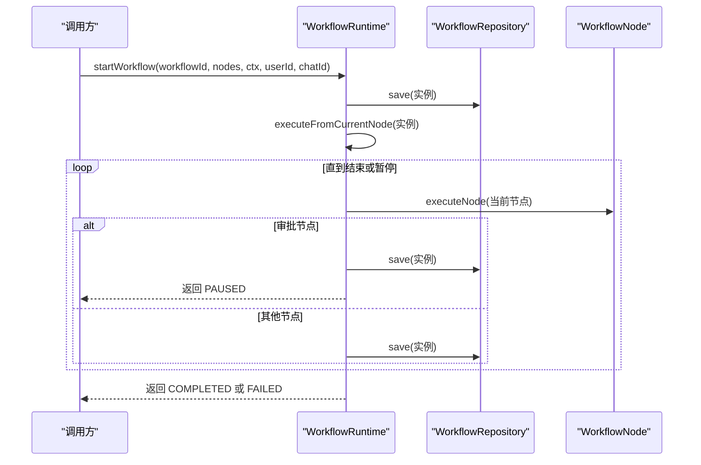

图表来源
- [WorkflowRuntime.java:31-156](file://src/main/java/com/yupi/yuaiagent/workflow/runtime/WorkflowRuntime.java#L31-L156)
- [WorkflowRepository.java:53-63](file://src/main/java/com/yupi/yuaiagent/workflow/runtime/WorkflowRepository.java#L53-L63)

章节来源
- [WorkflowRuntime.java:20-229](file://src/main/java/com/yupi/yuaiagent/workflow/runtime/WorkflowRuntime.java#L20-L229)
- [WorkflowRepository.java:23-114](file://src/main/java/com/yupi/yuaiagent/workflow/runtime/WorkflowRepository.java#L23-L114)

### WorkflowInstance：生命周期与状态转换
字段与含义
- instanceId、workflowId：实例与模板标识
- currentNodeIndex：当前执行节点索引
- status：实例状态（PENDING/RUNNING/PAUSED/COMPLETED/FAILED/CANCELLED）
- nodes/context/history：节点序列、上下文与执行历史
- createdAt/updatedAt：时间戳
- userId/chatId：触发者与会话

状态转换
- 启动：PENDING → RUNNING
- 执行中：RUNNING → RUNNING（逐步推进）
- 暂停：RUNNING → PAUSED（遇到审批节点）
- 完成：RUNNING → COMPLETED（全部节点完成）
- 失败：RUNNING → FAILED（节点异常）
- 取消：RUNNING → CANCELLED（主动取消）

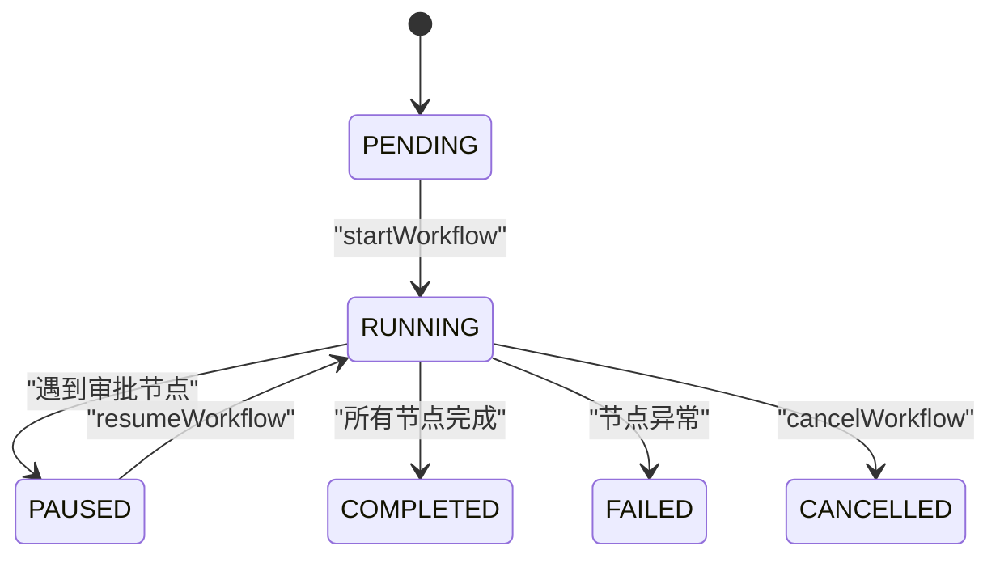

图表来源
- [WorkflowInstance.java:20-75](file://src/main/java/com/yupi/yuaiagent/workflow/runtime/WorkflowInstance.java#L20-L75)
- [WorkflowStatus.java:8-24](file://src/main/java/com/yupi/yuaiagent/workflow/runtime/WorkflowStatus.java#L8-L24)

章节来源
- [WorkflowInstance.java:18-75](file://src/main/java/com/yupi/yuaiagent/workflow/runtime/WorkflowInstance.java#L18-L75)
- [WorkflowStatus.java:8-24](file://src/main/java/com/yupi/yuaiagent/workflow/runtime/WorkflowStatus.java#L8-L24)

### WorkflowRepository：持久化策略
- 存储介质：JSON 文件（默认 ./tmp/workflows/workflow-instances.json）
- 并发控制：读写锁保护内存映射 Map，保证线程安全
- 关键操作：init（加载）、save（写入）、findById/findAll/findByStatus（查询）
- 版本演进：V1 文件存储，未来可替换为数据库

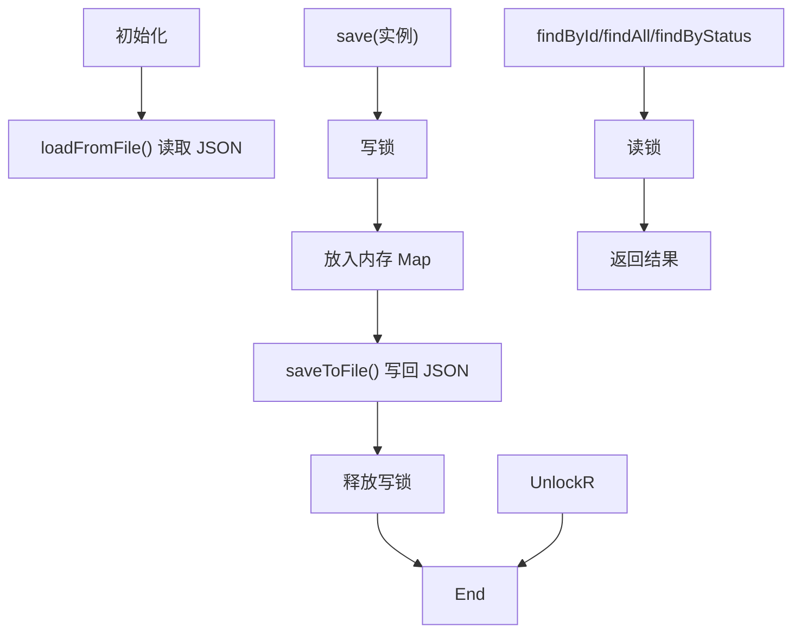

图表来源
- [WorkflowRepository.java:40-112](file://src/main/java/com/yupi/yuaiagent/workflow/runtime/WorkflowRepository.java#L40-L112)

章节来源
- [WorkflowRepository.java:23-114](file://src/main/java/com/yupi/yuaiagent/workflow/runtime/WorkflowRepository.java#L23-L114)

### 预算与令牌追踪：TokenUsageTracker、TokenBudget、TokenUsage
- TokenUsageTracker：按 workflowId 聚合 TokenUsage，提供 canExecute、recordUsage、reset
- TokenBudget：定义最大提示/补全/总计令牌上限，提供 canExecute 判断
- TokenUsage：记录估算与实际令牌用量，提供 totalTokens、estimationError、加法运算

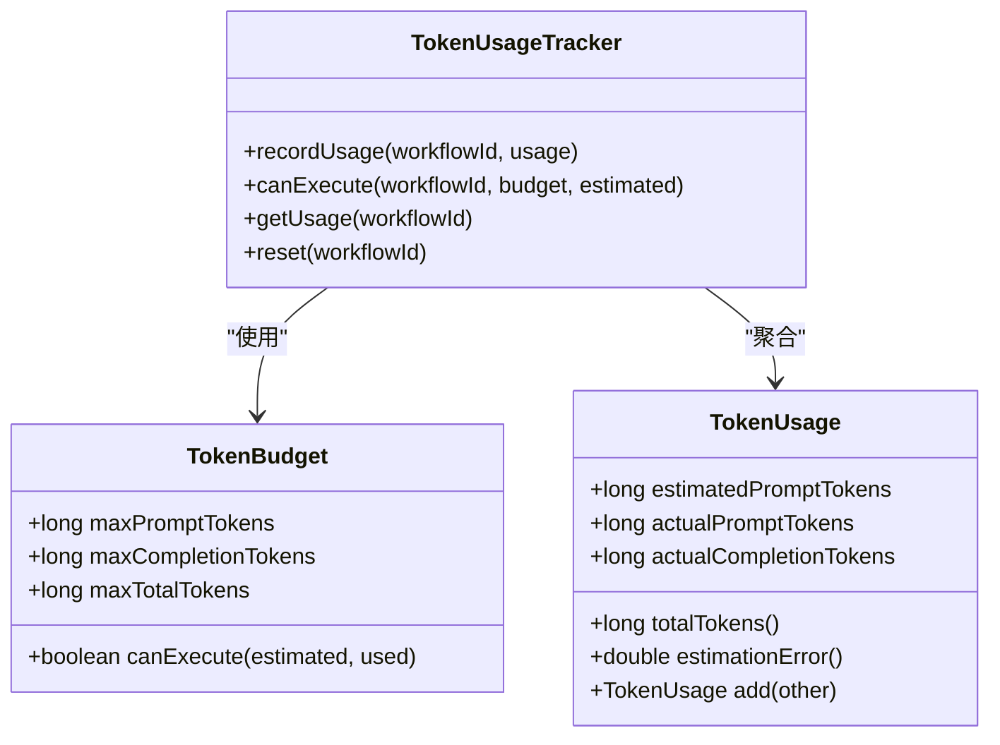

图表来源
- [TokenUsageTracker.java:14-49](file://src/main/java/com/yupi/yuaiagent/budget/TokenUsageTracker.java#L14-L49)
- [TokenBudget.java:6-15](file://src/main/java/com/yupi/yuaiagent/budget/TokenBudget.java#L6-L15)
- [TokenUsage.java:6-31](file://src/main/java/com/yupi/yuaiagent/budget/TokenUsage.java#L6-L31)

章节来源
- [TokenUsageTracker.java:14-49](file://src/main/java/com/yupi/yuaiagent/budget/TokenUsageTracker.java#L14-L49)
- [TokenBudget.java:6-15](file://src/main/java/com/yupi/yuaiagent/budget/TokenBudget.java#L6-L15)
- [TokenUsage.java:6-31](file://src/main/java/com/yupi/yuaiagent/budget/TokenUsage.java#L6-L31)

### RuntimeContext：执行上下文与结果聚合
- 结果聚合：addResult/getResults/getSuccessfulResults/hasFailures/previousAgentSummary
- 变量存储：setVariable/getVariable（为 DAG V3 扩展预留）
- 作用域：仅内部使用，不透传给 Agent（Agent 仅见 ConversationContext）

章节来源
- [RuntimeContext.java:16-57](file://src/main/java/com/yupi/yuaiagent/context/RuntimeContext.java#L16-L57)

### AgentRunner：执行接口与令牌用量
- run：执行 Agent，返回 AgentOutput
- getLastTokenUsage：返回上次调用的 TokenUsage

章节来源
- [AgentRunner.java:12-24](file://src/main/java/com/yupi/yuaiagent/agent/AgentRunner.java#L12-L24)

### 工作流节点与编排：WorkflowNode、PlanStep、WorkflowTemplate
- WorkflowNode：抽象节点基类，支持多态节点类型（Agent/Tool/Condition/Parallel/Loop/Approval）
- PlanStep：单步计划，指定 agentId 与 taskDescription
- WorkflowTemplate：工作流模板，包含 steps、failurePolicy、tokenBudget、requiresPlanner 等

章节来源
- [WorkflowNode.java:21-62](file://src/main/java/com/yupi/yuaiagent/workflow/node/WorkflowNode.java#L21-L62)
- [PlanStep.java:6-18](file://src/main/java/com/yupi/yuaiagent/workflow/PlanStep.java#L6-L18)
- [WorkflowTemplate.java:12-25](file://src/main/java/com/yupi/yuaiagent/workflow/WorkflowTemplate.java#L12-L25)

## 依赖分析
组件耦合与协作
- TaskExecutor 依赖 TokenUsageTracker、FailurePolicy、RuntimeContext、AgentRunner、WorkflowTemplate/PlanStep
- WorkflowRuntime 依赖 WorkflowRepository、WorkflowInstance、WorkflowNode、WorkflowStatus
- TokenUsageTracker 依赖 TokenBudget、TokenUsage
- RuntimeContext 依赖 ExecutionResult

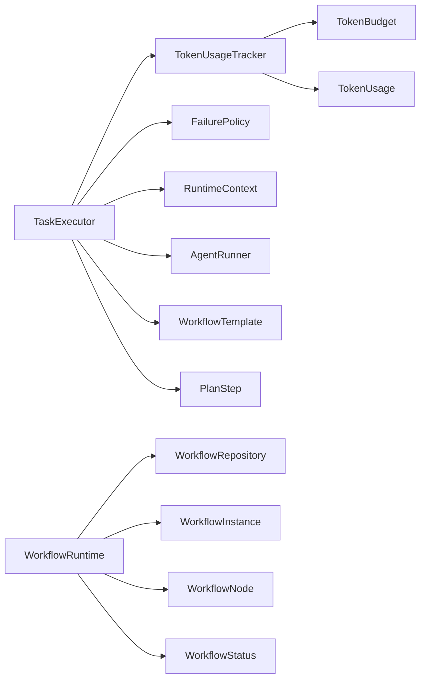

图表来源
- [TaskExecutor.java:34-39](file://src/main/java/com/yupi/yuaiagent/agent/TaskExecutor.java#L34-L39)
- [WorkflowRuntime.java:25-26](file://src/main/java/com/yupi/yuaiagent/workflow/runtime/WorkflowRuntime.java#L25-L26)
- [TokenUsageTracker.java:18-25](file://src/main/java/com/yupi/yuaiagent/budget/TokenUsageTracker.java#L18-L25)

章节来源
- [TaskExecutor.java:34-39](file://src/main/java/com/yupi/yuaiagent/agent/TaskExecutor.java#L34-L39)
- [WorkflowRuntime.java:25-26](file://src/main/java/com/yupi/yuaiagent/workflow/runtime/WorkflowRuntime.java#L25-L26)
- [TokenUsageTracker.java:18-25](file://src/main/java/com/yupi/yuaiagent/budget/TokenUsageTracker.java#L18-L25)

## 性能考虑
- 并发控制
  - WorkflowRepository 使用读写锁保护 Map，避免并发写入冲突
  - TokenUsageTracker 使用并发 Map 聚合，减少锁粒度
- 资源限制
  - 通过 TokenBudget 与 TokenUsageTracker 在执行前进行预算校验，避免超支
  - 估算函数可进一步引入更精确的字符/词元映射以降低估计误差
- 优先级管理
  - 当前未实现显式优先级队列；可在 TaskExecutor 前置阶段引入优先级排序或队列
- 统计与监控
  - ExecutionResult.durationMs 可用于统计各步骤耗时分布
  - TokenUsage.estimationError 可用于评估估算模型质量
  - WorkflowInstance.history 记录节点耗时与结果，便于审计与回放

[本节为通用指导，无需具体文件引用]

## 故障排查指南
- 预算相关
  - 现象：大量步骤被标记为 SKIPPED_BY_BUDGET
  - 排查：检查 TokenBudget 配置与 TokenUsageTracker.reset/canExecute 流程
- 策略相关
  - 现象：FAIL_FAST 下后续步骤全部跳过
  - 排查：确认 FailurePolicy 设置与异常传播路径
- 运行时状态
  - 现象：实例卡在 PAUSED
  - 排查：确认审批节点逻辑与 resumeWorkflow 调用
- 持久化问题
  - 现象：实例丢失或加载失败
  - 排查：检查存储目录权限、JSON 文件格式与 WorkflowRepository.init/loadFromFile/saveToFile

章节来源
- [TokenUsageTracker.java:30-47](file://src/main/java/com/yupi/yuaiagent/budget/TokenUsageTracker.java#L30-L47)
- [WorkflowRuntime.java:57-77](file://src/main/java/com/yupi/yuaiagent/workflow/runtime/WorkflowRuntime.java#L57-L77)
- [WorkflowRepository.java:94-112](file://src/main/java/com/yupi/yuaiagent/workflow/runtime/WorkflowRepository.java#L94-L112)

## 结论
该系统通过 TaskExecutor 将“决策（Agent）—执行（Workflow）”清晰分离，借助 ExecutionResult 统一结果表达，利用 TokenUsageTracker 与 TokenBudget 实现预算驱动的资源控制，配合 FailurePolicy 提供多样化的容错策略。WorkflowRuntime 与 WorkflowInstance 提供了完整的工作流生命周期管理与持久化能力。整体架构具备良好的扩展性，可进一步引入优先级队列、更精细的令牌估算与监控体系。

[本节为总结性内容，无需具体文件引用]

## 附录

### 任务执行示例（步骤化）
- 准备阶段
  - 构造 WorkflowTemplate（含 steps、failurePolicy、tokenBudget）
  - 构造 RuntimeContext 与 ConversationContext
  - 注入 AgentRunner 映射至 TaskExecutor
- 执行阶段
  - 调用 TaskExecutor.execute(template, conversationCtx, runtimeCtx, userMessage)
  - 查看返回的 ExecutionResult 列表，按状态进行后续处理
- 恢复与取消
  - 对于审批节点触发的 PAUSED 实例，调用 resumeWorkflow 并传入审批数据
  - 对于需要中止的实例，调用 cancelWorkflow

章节来源
- [TaskExecutor.java:51-110](file://src/main/java/com/yupi/yuaiagent/agent/TaskExecutor.java#L51-L110)
- [WorkflowRuntime.java:31-77](file://src/main/java/com/yupi/yuaiagent/workflow/runtime/WorkflowRuntime.java#L31-L77)

### 调试技巧
- 日志定位：TaskExecutor 与 WorkflowRuntime 均输出关键事件日志，优先查看执行开始/结束与异常堆栈
- 结果核对：通过 ExecutionResult.isSkipped/isFailed/isSuccess 快速过滤异常与跳过步骤
- 预算核对：对比 TokenUsageTracker.getUsage 与 TokenBudget 配额，评估估算误差
- 持久化验证：检查 WorkflowRepository 存储文件完整性，必要时手动备份与恢复

章节来源
- [TaskExecutor.java:87-106](file://src/main/java/com/yupi/yuaiagent/agent/TaskExecutor.java#L87-L106)
- [WorkflowRuntime.java:115-128](file://src/main/java/com/yupi/yuaiagent/workflow/runtime/WorkflowRuntime.java#L115-L128)
- [WorkflowRepository.java:106-112](file://src/main/java/com/yupi/yuaiagent/workflow/runtime/WorkflowRepository.java#L106-L112)