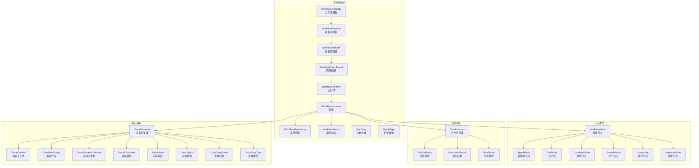
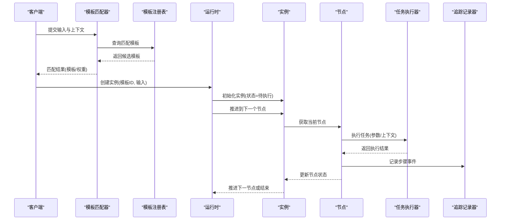
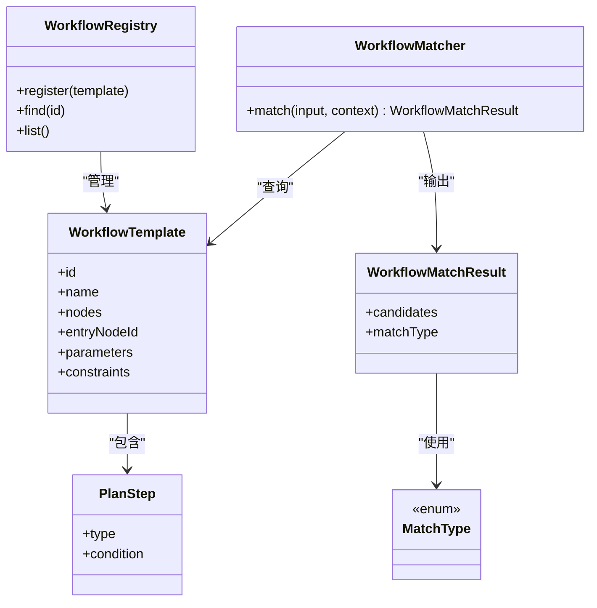
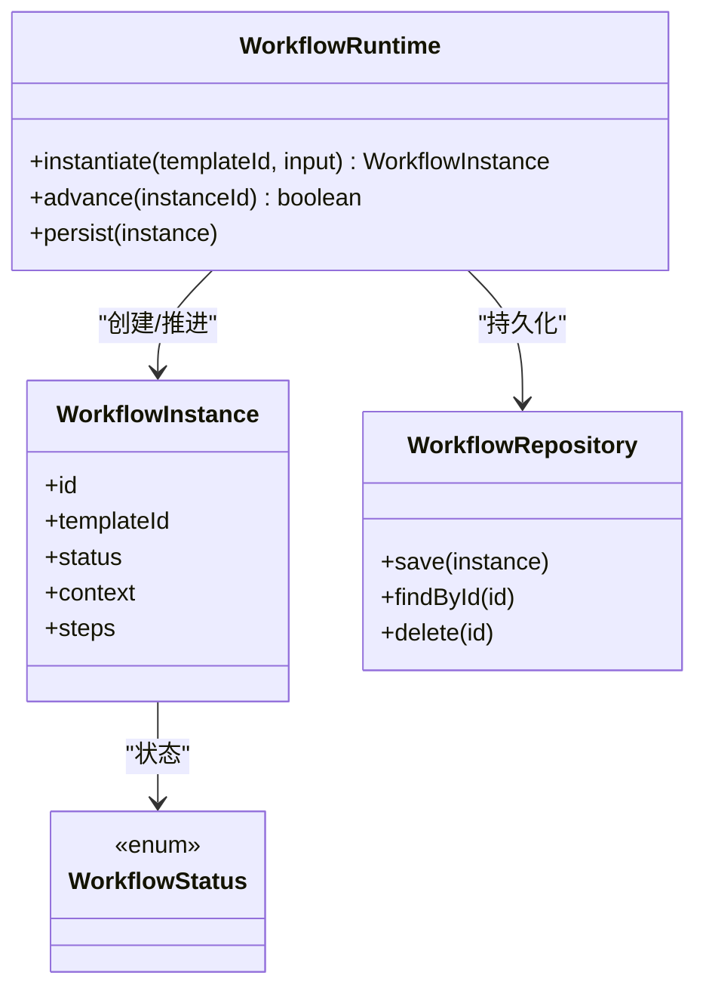
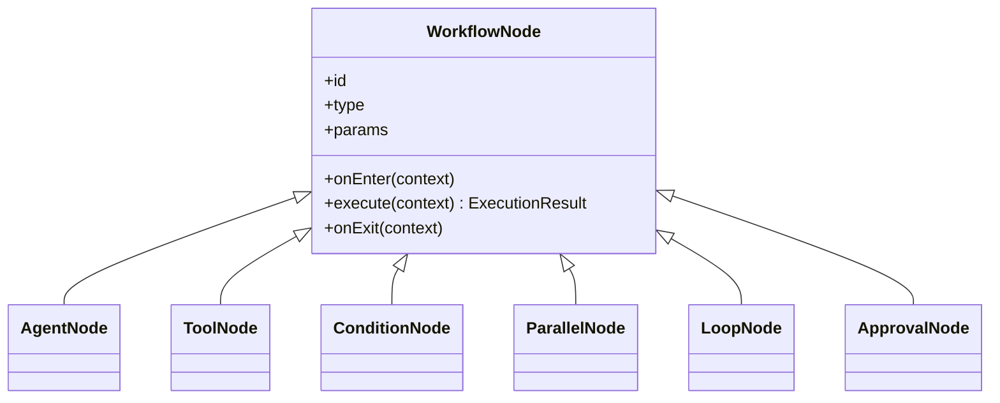
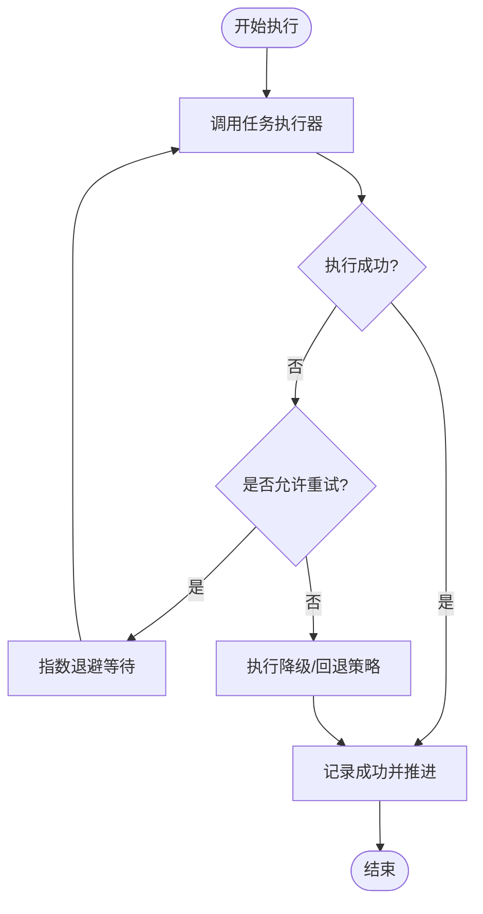
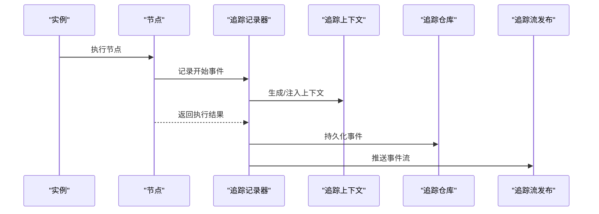
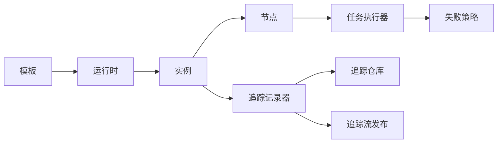

# 工作流引擎

<cite>
**本文引用的文件**
- [WorkflowTemplate.java](file://src/main/java/com/yupi/yuaiagent/workflow/WorkflowTemplate.java)
- [WorkflowRegistry.java](file://src/main/java/com/yupi/yuaiagent/workflow/WorkflowRegistry.java)
- [WorkflowMatcher.java](file://src/main/java/com/yupi/yuaiagent/workflow/WorkflowMatcher.java)
- [WorkflowMatchResult.java](file://src/main/java/com/yupi/yuaiagent/workflow/WorkflowMatchResult.java)
- [WorkflowNode.java](file://src/main/java/com/yupi/yuaiagent/workflow/node/WorkflowNode.java)
- [AgentNode.java](file://src/main/java/com/yupi/yuaiagent/workflow/node/AgentNode.java)
- [ToolNode.java](file://src/main/java/com/yupi/yuaiagent/workflow/node/ToolNode.java)
- [ConditionNode.java](file://src/main/java/com/yupi/yuaiagent/workflow/node/ConditionNode.java)
- [ParallelNode.java](file://src/main/java/com/yupi/yuaiagent/workflow/node/ParallelNode.java)
- [LoopNode.java](file://src/main/java/com/yupi/yuaiagent/workflow/node/LoopNode.java)
- [ApprovalNode.java](file://src/main/java/com/yupi/yuaiagent/workflow/node/ApprovalNode.java)
- [WorkflowRuntime.java](file://src/main/java/com/yupi/yuaiagent/workflow/runtime/WorkflowRuntime.java)
- [WorkflowInstance.java](file://src/main/java/com/yupi/yuaiagent/workflow/runtime/WorkflowInstance.java)
- [WorkflowRepository.java](file://src/main/java/com/yupi/yuaiagent/workflow/runtime/WorkflowRepository.java)
- [WorkflowStatus.java](file://src/main/java/com/yupi/yuaiagent/workflow/runtime/WorkflowStatus.java)
- [PlanStep.java](file://src/main/java/com/yupi/yuaiagent/workflow/PlanStep.java)
- [MatchType.java](file://src/main/java/com/yupi/yuaiagent/workflow/MatchType.java)
- [TaskExecutor.java](file://src/main/java/com/yupi/yuaiagent/agent/task/TaskExecutor.java)
- [FailurePolicy.java](file://src/main/java/com/yupi/yuaiagent/agent/task/FailurePolicy.java)
- [ExecutionResult.java](file://src/main/java/com/yupi/yuaiagent/agent/task/ExecutionResult.java)
- [TaskStatus.java](file://src/main/java/com/yupi/yuaiagent/agent/task/TaskStatus.java)
- [OrchestratorAgent.java](file://src/main/java/com/yupi/yuaiagent/agent/OrchestratorAgent.java)
- [TraceRecorder.java](file://src/main/java/com/yupi/yuaiagent/trace/TraceRecorder.java)
- [TraceContext.java](file://src/main/java/com/yupi/yuaiagent/trace/TraceContext.java)
- [TraceRepository.java](file://src/main/java/com/yupi/yuaiagent/trace/TraceRepository.java)
- [TraceStreamPublisher.java](file://src/main/java/com/yupi/yuaiagent/trace/TraceStreamPublisher.java)
- [TraceConstants.java](file://src/main/java/com/yupi/yuaiagent/trace/TraceConstants.java)
- [TraceSpan.java](file://src/main/java/com/yupi/yuaiagent/trace/model/TraceSpan.java)
- [TraceStatus.java](file://src/main/java/com/yupi/yuaiagent/trace/model/TraceStatus.java)
- [TraceStepStatus.java](file://src/main/java/com/yupi/yuaiagent/trace/model/TraceStepStatus.java)
- [TraceStepType.java](file://src/main/java/com/yupi/yuaiagent/trace/model/TraceStepType.java)
</cite>

## 目录
1. [简介](#简介)
2. [项目结构](#项目结构)
3. [核心组件](#核心组件)
4. [架构总览](#架构总览)
5. [详细组件分析](#详细组件分析)
6. [依赖关系分析](#依赖关系分析)
7. [性能考虑](#性能考虑)
8. [故障排查指南](#故障排查指南)
9. [结论](#结论)
10. [附录：开发与调试指南](#附录开发与调试指南)

## 简介
本工作流引擎为多智能体系统提供可编排、可观测、可扩展的任务执行框架。其核心目标是：
- 定义工作流模板与节点类型，支持条件分支、并行执行、循环与审批等控制流
- 提供运行时实例管理、状态持久化与执行追踪
- 将任务执行器与失败策略集成到节点执行链路中
- 通过匹配器与注册表实现模板发现与实例化
- 以可观测性贯穿从模板到实例的全生命周期

## 项目结构
工作流相关代码集中在 workflow 及其子包下，配合 agent.task（任务执行）、trace（执行追踪）模块协同工作。

**图表来源**
- [WorkflowTemplate.java:1-200](file://src/main/java/com/yupi/yuaiagent/workflow/WorkflowTemplate.java#L1-L200)
- [WorkflowRegistry.java:1-200](file://src/main/java/com/yupi/yuaiagent/workflow/WorkflowRegistry.java#L1-L200)
- [WorkflowMatcher.java:1-200](file://src/main/java/com/yupi/yuaiagent/workflow/WorkflowMatcher.java#L1-L200)
- [WorkflowMatchResult.java:1-200](file://src/main/java/com/yupi/yuaiagent/workflow/WorkflowMatchResult.java#L1-L200)
- [WorkflowRuntime.java:1-200](file://src/main/java/com/yupi/yuaiagent/workflow/runtime/WorkflowRuntime.java#L1-L200)
- [WorkflowInstance.java:1-200](file://src/main/java/com/yupi/yuaiagent/workflow/runtime/WorkflowInstance.java#L1-L200)
- [WorkflowRepository.java:1-200](file://src/main/java/com/yupi/yuaiagent/workflow/runtime/WorkflowRepository.java#L1-L200)
- [WorkflowStatus.java:1-200](file://src/main/java/com/yupi/yuaiagent/workflow/runtime/WorkflowStatus.java#L1-L200)
- [PlanStep.java:1-200](file://src/main/java/com/yupi/yuaiagent/workflow/PlanStep.java#L1-L200)
- [MatchType.java:1-200](file://src/main/java/com/yupi/yuaiagent/workflow/MatchType.java#L1-L200)
- [WorkflowNode.java:1-200](file://src/main/java/com/yupi/yuaiagent/workflow/node/WorkflowNode.java#L1-L200)
- [AgentNode.java:1-200](file://src/main/java/com/yupi/yuaiagent/workflow/node/AgentNode.java#L1-L200)
- [ToolNode.java:1-200](file://src/main/java/com/yupi/yuaiagent/workflow/node/ToolNode.java#L1-L200)
- [ConditionNode.java:1-200](file://src/main/java/com/yupi/yuaiagent/workflow/node/ConditionNode.java#L1-L200)
- [ParallelNode.java:1-200](file://src/main/java/com/yupi/yuaiagent/workflow/node/ParallelNode.java#L1-L200)
- [LoopNode.java:1-200](file://src/main/java/com/yupi/yuaiagent/workflow/node/LoopNode.java#L1-L200)
- [ApprovalNode.java:1-200](file://src/main/java/com/yupi/yuaiagent/workflow/node/ApprovalNode.java#L1-L200)
- [TaskExecutor.java:1-200](file://src/main/java/com/yupi/yuaiagent/agent/task/TaskExecutor.java#L1-L200)
- [FailurePolicy.java:1-200](file://src/main/java/com/yupi/yuaiagent/agent/task/FailurePolicy.java#L1-L200)
- [ExecutionResult.java:1-200](file://src/main/java/com/yupi/yuaiagent/agent/task/ExecutionResult.java#L1-L200)
- [TaskStatus.java:1-200](file://src/main/java/com/yupi/yuaiagent/agent/task/TaskStatus.java#L1-L200)
- [TraceRecorder.java:1-200](file://src/main/java/com/yupi/yuaiagent/trace/TraceRecorder.java#L1-L200)
- [TraceContext.java:1-200](file://src/main/java/com/yupi/yuaiagent/trace/TraceContext.java#L1-L200)
- [TraceRepository.java:1-200](file://src/main/java/com/yupi/yuaiagent/trace/TraceRepository.java#L1-L200)
- [TraceStreamPublisher.java:1-200](file://src/main/java/com/yupi/yuaiagent/trace/TraceStreamPublisher.java#L1-L200)
- [TraceConstants.java:1-200](file://src/main/java/com/yupi/yuaiagent/trace/TraceConstants.java#L1-L200)
- [TraceSpan.java:1-200](file://src/main/java/com/yupi/yuaiagent/trace/model/TraceSpan.java#L1-L200)
- [TraceStatus.java:1-200](file://src/main/java/com/yupi/yuaiagent/trace/model/TraceStatus.java#L1-L200)
- [TraceStepStatus.java:1-200](file://src/main/java/com/yupi/yuaiagent/trace/model/TraceStepStatus.java#L1-L200)
- [TraceStepType.java:1-200](file://src/main/java/com/yupi/yuaiagent/trace/model/TraceStepType.java#L1-L200)
</cite>

**章节来源**
- [WorkflowTemplate.java:1-200](file://src/main/java/com/yupi/yuaiagent/workflow/WorkflowTemplate.java#L1-L200)
- [WorkflowRegistry.java:1-200](file://src/main/java/com/yupi/yuaiagent/workflow/WorkflowRegistry.java#L1-L200)
- [WorkflowMatcher.java:1-200](file://src/main/java/com/yupi/yuaiagent/workflow/WorkflowMatcher.java#L1-L200)
- [WorkflowMatchResult.java:1-200](file://src/main/java/com/yupi/yuaiagent/workflow/WorkflowMatchResult.java#L1-L200)
- [WorkflowRuntime.java:1-200](file://src/main/java/com/yupi/yuaiagent/workflow/runtime/WorkflowRuntime.java#L1-L200)
- [WorkflowInstance.java:1-200](file://src/main/java/com/yupi/yuaiagent/workflow/runtime/WorkflowInstance.java#L1-L200)
- [WorkflowRepository.java:1-200](file://src/main/java/com/yupi/yuaiagent/workflow/runtime/WorkflowRepository.java#L1-L200)
- [WorkflowStatus.java:1-200](file://src/main/java/com/yupi/yuaiagent/workflow/runtime/WorkflowStatus.java#L1-L200)
- [PlanStep.java:1-200](file://src/main/java/com/yupi/yuaiagent/workflow/PlanStep.java#L1-L200)
- [MatchType.java:1-200](file://src/main/java/com/yupi/yuaiagent/workflow/MatchType.java#L1-L200)
- [WorkflowNode.java:1-200](file://src/main/java/com/yupi/yuaiagent/workflow/node/WorkflowNode.java#L1-L200)
- [AgentNode.java:1-200](file://src/main/java/com/yupi/yuaiagent/workflow/node/AgentNode.java#L1-L200)
- [ToolNode.java:1-200](file://src/main/java/com/yupi/yuaiagent/workflow/node/ToolNode.java#L1-L200)
- [ConditionNode.java:1-200](file://src/main/java/com/yupi/yuaiagent/workflow/node/ConditionNode.java#L1-L200)
- [ParallelNode.java:1-200](file://src/main/java/com/yupi/yuaiagent/workflow/node/ParallelNode.java#L1-L200)
- [LoopNode.java:1-200](file://src/main/java/com/yupi/yuaiagent/workflow/node/LoopNode.java#L1-L200)
- [ApprovalNode.java:1-200](file://src/main/java/com/yupi/yuaiagent/workflow/node/ApprovalNode.java#L1-L200)
- [TaskExecutor.java:1-200](file://src/main/java/com/yupi/yuaiagent/agent/task/TaskExecutor.java#L1-L200)
- [FailurePolicy.java:1-200](file://src/main/java/com/yupi/yuaiagent/agent/task/FailurePolicy.java#L1-L200)
- [ExecutionResult.java:1-200](file://src/main/java/com/yupi/yuaiagent/agent/task/ExecutionResult.java#L1-L200)
- [TaskStatus.java:1-200](file://src/main/java/com/yupi/yuaiagent/agent/task/TaskStatus.java#L1-L200)
- [TraceRecorder.java:1-200](file://src/main/java/com/yupi/yuaiagent/trace/TraceRecorder.java#L1-L200)
- [TraceContext.java:1-200](file://src/main/java/com/yupi/yuaiagent/trace/TraceContext.java#L1-L200)
- [TraceRepository.java:1-200](file://src/main/java/com/yupi/yuaiagent/trace/TraceRepository.java#L1-L200)
- [TraceStreamPublisher.java:1-200](file://src/main/java/com/yupi/yuaiagent/trace/TraceStreamPublisher.java#L1-L200)
- [TraceConstants.java:1-200](file://src/main/java/com/yupi/yuaiagent/trace/TraceConstants.java#L1-L200)
- [TraceSpan.java:1-200](file://src/main/java/com/yupi/yuaiagent/trace/model/TraceSpan.java#L1-L200)
- [TraceStatus.java:1-200](file://src/main/java/com/yupi/yuaiagent/trace/model/TraceStatus.java#L1-L200)
- [TraceStepStatus.java:1-200](file://src/main/java/com/yupi/yuaiagent/trace/model/TraceStepStatus.java#L1-L200)
- [TraceStepType.java:1-200](file://src/main/java/com/yupi/yuaiagent/trace/model/TraceStepType.java#L1-L200)

## 核心组件
- 工作流模板与匹配
  - 模板定义：描述节点拓扑、入口节点、参数与约束
  - 注册表：集中管理模板，提供查询与版本化能力
  - 匹配器：基于输入与匹配规则选择最合适的模板
  - 匹配结果：封装匹配度、候选模板列表与匹配类型
- 运行时与实例
  - 运行时：负责实例化、调度、状态推进与持久化
  - 实例：承载一次具体执行的状态、上下文与进度
  - 实例仓库：提供实例的增删改查与批量操作
  - 实例状态：枚举化表示实例生命周期中的阶段
- 节点体系
  - 抽象节点：统一节点接口，定义执行契约
  - 智能体节点：委派给智能体执行
  - 工具节点：调用外部工具或服务
  - 条件节点：根据表达式或规则分流
  - 并行节点：并发执行多个子节点
  - 循环节点：重复执行直到满足终止条件
  - 审批节点：等待人工或自动化审批
- 任务执行与失败策略
  - 任务执行器：封装单步任务的执行逻辑
  - 失败策略：定义失败后的重试、降级与回退策略
  - 执行结果与任务状态：标准化返回与状态机
- 执行追踪
  - 追踪记录器：在关键节点写入追踪事件
  - 追踪上下文：携带 traceId、spanId 等上下文信息
  - 追踪仓库与流发布：持久化与实时推送
  - 追踪模型：跨度、状态、步骤状态与步骤类型

**章节来源**
- [WorkflowTemplate.java:1-200](file://src/main/java/com/yupi/yuaiagent/workflow/WorkflowTemplate.java#L1-L200)
- [WorkflowRegistry.java:1-200](file://src/main/java/com/yupi/yuaiagent/workflow/WorkflowRegistry.java#L1-L200)
- [WorkflowMatcher.java:1-200](file://src/main/java/com/yupi/yuaiagent/workflow/WorkflowMatcher.java#L1-L200)
- [WorkflowMatchResult.java:1-200](file://src/main/java/com/yupi/yuaiagent/workflow/WorkflowMatchResult.java#L1-L200)
- [WorkflowRuntime.java:1-200](file://src/main/java/com/yupi/yuaiagent/workflow/runtime/WorkflowRuntime.java#L1-L200)
- [WorkflowInstance.java:1-200](file://src/main/java/com/yupi/yuaiagent/workflow/runtime/WorkflowInstance.java#L1-L200)
- [WorkflowRepository.java:1-200](file://src/main/java/com/yupi/yuaiagent/workflow/runtime/WorkflowRepository.java#L1-L200)
- [WorkflowStatus.java:1-200](file://src/main/java/com/yupi/yuaiagent/workflow/runtime/WorkflowStatus.java#L1-L200)
- [WorkflowNode.java:1-200](file://src/main/java/com/yupi/yuaiagent/workflow/node/WorkflowNode.java#L1-L200)
- [AgentNode.java:1-200](file://src/main/java/com/yupi/yuaiagent/workflow/node/AgentNode.java#L1-L200)
- [ToolNode.java:1-200](file://src/main/java/com/yupi/yuaiagent/workflow/node/ToolNode.java#L1-L200)
- [ConditionNode.java:1-200](file://src/main/java/com/yupi/yuaiagent/workflow/node/ConditionNode.java#L1-L200)
- [ParallelNode.java:1-200](file://src/main/java/com/yupi/yuaiagent/workflow/node/ParallelNode.java#L1-L200)
- [LoopNode.java:1-200](file://src/main/java/com/yupi/yuaiagent/workflow/node/LoopNode.java#L1-L200)
- [ApprovalNode.java:1-200](file://src/main/java/com/yupi/yuaiagent/workflow/node/ApprovalNode.java#L1-L200)
- [TaskExecutor.java:1-200](file://src/main/java/com/yupi/yuaiagent/agent/task/TaskExecutor.java#L1-L200)
- [FailurePolicy.java:1-200](file://src/main/java/com/yupi/yuaiagent/agent/task/FailurePolicy.java#L1-L200)
- [ExecutionResult.java:1-200](file://src/main/java/com/yupi/yuaiagent/agent/task/ExecutionResult.java#L1-L200)
- [TaskStatus.java:1-200](file://src/main/java/com/yupi/yuaiagent/agent/task/TaskStatus.java#L1-L200)
- [TraceRecorder.java:1-200](file://src/main/java/com/yupi/yuaiagent/trace/TraceRecorder.java#L1-L200)
- [TraceContext.java:1-200](file://src/main/java/com/yupi/yuaiagent/trace/TraceContext.java#L1-L200)
- [TraceRepository.java:1-200](file://src/main/java/com/yupi/yuaiagent/trace/TraceRepository.java#L1-L200)
- [TraceStreamPublisher.java:1-200](file://src/main/java/com/yupi/yuaiagent/trace/TraceStreamPublisher.java#L1-L200)
- [TraceConstants.java:1-200](file://src/main/java/com/yupi/yuaiagent/trace/TraceConstants.java#L1-L200)
- [TraceSpan.java:1-200](file://src/main/java/com/yupi/yuaiagent/trace/model/TraceSpan.java#L1-L200)
- [TraceStatus.java:1-200](file://src/main/java/com/yupi/yuaiagent/trace/model/TraceStatus.java#L1-L200)
- [TraceStepStatus.java:1-200](file://src/main/java/com/yupi/yuaiagent/trace/model/TraceStepStatus.java#L1-L200)
- [TraceStepType.java:1-200](file://src/main/java/com/yupi/yuaiagent/trace/model/TraceStepType.java#L1-L200)

## 架构总览
工作流引擎采用“模板驱动 + 运行时编排”的架构。模板定义控制流，匹配器选择模板，运行时创建实例并驱动节点执行；每个节点通过任务执行器完成具体动作，并由追踪模块记录执行轨迹。

**图表来源**
- [WorkflowMatcher.java:1-200](file://src/main/java/com/yupi/yuaiagent/workflow/WorkflowMatcher.java#L1-L200)
- [WorkflowRegistry.java:1-200](file://src/main/java/com/yupi/yuaiagent/workflow/WorkflowRegistry.java#L1-L200)
- [WorkflowRuntime.java:1-200](file://src/main/java/com/yupi/yuaiagent/workflow/runtime/WorkflowRuntime.java#L1-L200)
- [WorkflowInstance.java:1-200](file://src/main/java/com/yupi/yuaiagent/workflow/runtime/WorkflowInstance.java#L1-L200)
- [WorkflowNode.java:1-200](file://src/main/java/com/yupi/yuaiagent/workflow/node/WorkflowNode.java#L1-L200)
- [TaskExecutor.java:1-200](file://src/main/java/com/yupi/yuaiagent/agent/task/TaskExecutor.java#L1-L200)
- [TraceRecorder.java:1-200](file://src/main/java/com/yupi/yuaiagent/trace/TraceRecorder.java#L1-L200)

## 详细组件分析

### 工作流模板与匹配
- 模板定义：包含节点拓扑、入口节点、参数校验、匹配规则与执行约束
- 匹配器：基于 MatchType 与 PlanStep 的规则进行候选筛选与排序
- 匹配结果：封装匹配度、模板列表与匹配类型，便于后续实例化

**图表来源**
- [WorkflowTemplate.java:1-200](file://src/main/java/com/yupi/yuaiagent/workflow/WorkflowTemplate.java#L1-L200)
- [WorkflowRegistry.java:1-200](file://src/main/java/com/yupi/yuaiagent/workflow/WorkflowRegistry.java#L1-L200)
- [WorkflowMatcher.java:1-200](file://src/main/java/com/yupi/yuaiagent/workflow/WorkflowMatcher.java#L1-L200)
- [WorkflowMatchResult.java:1-200](file://src/main/java/com/yupi/yuaiagent/workflow/WorkflowMatchResult.java#L1-L200)
- [PlanStep.java:1-200](file://src/main/java/com/yupi/yuaiagent/workflow/PlanStep.java#L1-L200)
- [MatchType.java:1-200](file://src/main/java/com/yupi/yuaiagent/workflow/MatchType.java#L1-L200)

**章节来源**
- [WorkflowTemplate.java:1-200](file://src/main/java/com/yupi/yuaiagent/workflow/WorkflowTemplate.java#L1-L200)
- [WorkflowRegistry.java:1-200](file://src/main/java/com/yupi/yuaiagent/workflow/WorkflowRegistry.java#L1-L200)
- [WorkflowMatcher.java:1-200](file://src/main/java/com/yupi/yuaiagent/workflow/WorkflowMatcher.java#L1-L200)
- [WorkflowMatchResult.java:1-200](file://src/main/java/com/yupi/yuaiagent/workflow/WorkflowMatchResult.java#L1-L200)
- [PlanStep.java:1-200](file://src/main/java/com/yupi/yuaiagent/workflow/PlanStep.java#L1-L200)
- [MatchType.java:1-200](file://src/main/java/com/yupi/yuaiagent/workflow/MatchType.java#L1-L200)

### 运行时与实例
- 运行时：负责实例化、推进状态、持久化与异常恢复
- 实例：保存当前节点、上下文、参数与历史步骤
- 实例仓库：提供 CRUD 与批量查询能力
- 实例状态：枚举化管理生命周期阶段

**图表来源**
- [WorkflowRuntime.java:1-200](file://src/main/java/com/yupi/yuaiagent/workflow/runtime/WorkflowRuntime.java#L1-L200)
- [WorkflowInstance.java:1-200](file://src/main/java/com/yupi/yuaiagent/workflow/runtime/WorkflowInstance.java#L1-L200)
- [WorkflowRepository.java:1-200](file://src/main/java/com/yupi/yuaiagent/workflow/runtime/WorkflowRepository.java#L1-L200)
- [WorkflowStatus.java:1-200](file://src/main/java/com/yupi/yuaiagent/workflow/runtime/WorkflowStatus.java#L1-L200)

**章节来源**
- [WorkflowRuntime.java:1-200](file://src/main/java/com/yupi/yuaiagent/workflow/runtime/WorkflowRuntime.java#L1-L200)
- [WorkflowInstance.java:1-200](file://src/main/java/com/yupi/yuaiagent/workflow/runtime/WorkflowInstance.java#L1-L200)
- [WorkflowRepository.java:1-200](file://src/main/java/com/yupi/yuaiagent/workflow/runtime/WorkflowRepository.java#L1-L200)
- [WorkflowStatus.java:1-200](file://src/main/java/com/yupi/yuaiagent/workflow/runtime/WorkflowStatus.java#L1-L200)

### 节点类型与执行流程
- 抽象节点：定义统一的执行接口与生命周期钩子
- 智能体节点：委派给智能体执行，适合复杂推理与对话
- 工具节点：调用外部工具或服务，适合数据检索与外部系统交互
- 条件节点：根据表达式或规则分流到不同子节点
- 并行节点：并发执行多个子节点，合并结果后继续
- 循环节点：重复执行直到满足终止条件
- 审批节点：等待人工或自动化审批

**图表来源**
- [WorkflowNode.java:1-200](file://src/main/java/com/yupi/yuaiagent/workflow/node/WorkflowNode.java#L1-L200)
- [AgentNode.java:1-200](file://src/main/java/com/yupi/yuaiagent/workflow/node/AgentNode.java#L1-L200)
- [ToolNode.java:1-200](file://src/main/java/com/yupi/yuaiagent/workflow/node/ToolNode.java#L1-L200)
- [ConditionNode.java:1-200](file://src/main/java/com/yupi/yuaiagent/workflow/node/ConditionNode.java#L1-L200)
- [ParallelNode.java:1-200](file://src/main/java/com/yupi/yuaiagent/workflow/node/ParallelNode.java#L1-L200)
- [LoopNode.java:1-200](file://src/main/java/com/yupi/yuaiagent/workflow/node/LoopNode.java#L1-L200)
- [ApprovalNode.java:1-200](file://src/main/java/com/yupi/yuaiagent/workflow/node/ApprovalNode.java#L1-L200)

**章节来源**
- [WorkflowNode.java:1-200](file://src/main/java/com/yupi/yuaiagent/workflow/node/WorkflowNode.java#L1-L200)
- [AgentNode.java:1-200](file://src/main/java/com/yupi/yuaiagent/workflow/node/AgentNode.java#L1-L200)
- [ToolNode.java:1-200](file://src/main/java/com/yupi/yuaiagent/workflow/node/ToolNode.java#L1-L200)
- [ConditionNode.java:1-200](file://src/main/java/com/yupi/yuaiagent/workflow/node/ConditionNode.java#L1-L200)
- [ParallelNode.java:1-200](file://src/main/java/com/yupi/yuaiagent/workflow/node/ParallelNode.java#L1-L200)
- [LoopNode.java:1-200](file://src/main/java/com/yupi/yuaiagent/workflow/node/LoopNode.java#L1-L200)
- [ApprovalNode.java:1-200](file://src/main/java/com/yupi/yuaiagent/workflow/node/ApprovalNode.java#L1-L200)

### 任务执行器与失败处理
- 任务执行器：封装单步任务的执行逻辑，统一返回格式与状态
- 失败策略：定义失败后的重试次数、退避策略、降级与回退
- 执行结果与任务状态：标准化返回值与状态机，便于追踪与恢复

**图表来源**
- [TaskExecutor.java:1-200](file://src/main/java/com/yupi/yuaiagent/agent/task/TaskExecutor.java#L1-L200)
- [FailurePolicy.java:1-200](file://src/main/java/com/yupi/yuaiagent/agent/task/FailurePolicy.java#L1-L200)
- [ExecutionResult.java:1-200](file://src/main/java/com/yupi/yuaiagent/agent/task/ExecutionResult.java#L1-L200)
- [TaskStatus.java:1-200](file://src/main/java/com/yupi/yuaiagent/agent/task/TaskStatus.java#L1-L200)

**章节来源**
- [TaskExecutor.java:1-200](file://src/main/java/com/yupi/yuaiagent/agent/task/TaskExecutor.java#L1-L200)
- [FailurePolicy.java:1-200](file://src/main/java/com/yupi/yuaiagent/agent/task/FailurePolicy.java#L1-L200)
- [ExecutionResult.java:1-200](file://src/main/java/com/yupi/yuaiagent/agent/task/ExecutionResult.java#L1-L200)
- [TaskStatus.java:1-200](file://src/main/java/com/yupi/yuaiagent/agent/task/TaskStatus.java#L1-L200)

### 执行追踪与可观测性
- 追踪记录器：在关键节点写入追踪事件，包含时间戳、节点类型、状态与耗时
- 追踪上下文：携带 traceId、spanId 等上下文信息，贯穿请求链路
- 追踪仓库与流发布：持久化与实时推送，支持查询与订阅
- 追踪模型：跨度、状态、步骤状态与步骤类型，形成完整的执行画像

**图表来源**
- [TraceRecorder.java:1-200](file://src/main/java/com/yupi/yuaiagent/trace/TraceRecorder.java#L1-L200)
- [TraceContext.java:1-200](file://src/main/java/com/yupi/yuaiagent/trace/TraceContext.java#L1-L200)
- [TraceRepository.java:1-200](file://src/main/java/com/yupi/yuaiagent/trace/TraceRepository.java#L1-L200)
- [TraceStreamPublisher.java:1-200](file://src/main/java/com/yupi/yuaiagent/trace/TraceStreamPublisher.java#L1-L200)
- [TraceConstants.java:1-200](file://src/main/java/com/yupi/yuaiagent/trace/TraceConstants.java#L1-L200)
- [TraceSpan.java:1-200](file://src/main/java/com/yupi/yuaiagent/trace/model/TraceSpan.java#L1-L200)
- [TraceStatus.java:1-200](file://src/main/java/com/yupi/yuaiagent/trace/model/TraceStatus.java#L1-L200)
- [TraceStepStatus.java:1-200](file://src/main/java/com/yupi/yuaiagent/trace/model/TraceStepStatus.java#L1-L200)
- [TraceStepType.java:1-200](file://src/main/java/com/yupi/yuaiagent/trace/model/TraceStepType.java#L1-L200)

**章节来源**
- [TraceRecorder.java:1-200](file://src/main/java/com/yupi/yuaiagent/trace/TraceRecorder.java#L1-L200)
- [TraceContext.java:1-200](file://src/main/java/com/yupi/yuaiagent/trace/TraceContext.java#L1-L200)
- [TraceRepository.java:1-200](file://src/main/java/com/yupi/yuaiagent/trace/TraceRepository.java#L1-L200)
- [TraceStreamPublisher.java:1-200](file://src/main/java/com/yupi/yuaiagent/trace/TraceStreamPublisher.java#L1-L200)
- [TraceConstants.java:1-200](file://src/main/java/com/yupi/yuaiagent/trace/TraceConstants.java#L1-L200)
- [TraceSpan.java:1-200](file://src/main/java/com/yupi/yuaiagent/trace/model/TraceSpan.java#L1-L200)
- [TraceStatus.java:1-200](file://src/main/java/com/yupi/yuaiagent/trace/model/TraceStatus.java#L1-L200)
- [TraceStepStatus.java:1-200](file://src/main/java/com/yupi/yuaiagent/trace/model/TraceStepStatus.java#L1-L200)
- [TraceStepType.java:1-200](file://src/main/java/com/yupi/yuaiagent/trace/model/TraceStepType.java#L1-L200)

## 依赖关系分析
- 模块内聚：工作流核心围绕模板、节点与运行时形成高内聚
- 模块耦合：运行时依赖节点接口与任务执行器；追踪模块与运行时松耦合
- 外部依赖：任务执行器依赖智能体与工具；追踪模块依赖存储与消息通道

**图表来源**
- [WorkflowTemplate.java:1-200](file://src/main/java/com/yupi/yuaiagent/workflow/WorkflowTemplate.java#L1-L200)
- [WorkflowRuntime.java:1-200](file://src/main/java/com/yupi/yuaiagent/workflow/runtime/WorkflowRuntime.java#L1-L200)
- [WorkflowInstance.java:1-200](file://src/main/java/com/yupi/yuaiagent/workflow/runtime/WorkflowInstance.java#L1-L200)
- [WorkflowNode.java:1-200](file://src/main/java/com/yupi/yuaiagent/workflow/node/WorkflowNode.java#L1-L200)
- [TaskExecutor.java:1-200](file://src/main/java/com/yupi/yuaiagent/agent/task/TaskExecutor.java#L1-L200)
- [FailurePolicy.java:1-200](file://src/main/java/com/yupi/yuaiagent/agent/task/FailurePolicy.java#L1-L200)
- [TraceRecorder.java:1-200](file://src/main/java/com/yupi/yuaiagent/trace/TraceRecorder.java#L1-L200)
- [TraceRepository.java:1-200](file://src/main/java/com/yupi/yuaiagent/trace/TraceRepository.java#L1-L200)
- [TraceStreamPublisher.java:1-200](file://src/main/java/com/yupi/yuaiagent/trace/TraceStreamPublisher.java#L1-L200)

**章节来源**
- [WorkflowTemplate.java:1-200](file://src/main/java/com/yupi/yuaiagent/workflow/WorkflowTemplate.java#L1-L200)
- [WorkflowRuntime.java:1-200](file://src/main/java/com/yupi/yuaiagent/workflow/runtime/WorkflowRuntime.java#L1-L200)
- [WorkflowInstance.java:1-200](file://src/main/java/com/yupi/yuaiagent/workflow/runtime/WorkflowInstance.java#L1-L200)
- [WorkflowNode.java:1-200](file://src/main/java/com/yupi/yuaiagent/workflow/node/WorkflowNode.java#L1-L200)
- [TaskExecutor.java:1-200](file://src/main/java/com/yupi/yuaiagent/agent/task/TaskExecutor.java#L1-L200)
- [FailurePolicy.java:1-200](file://src/main/java/com/yupi/yuaiagent/agent/task/FailurePolicy.java#L1-L200)
- [TraceRecorder.java:1-200](file://src/main/java/com/yupi/yuaiagent/trace/TraceRecorder.java#L1-L200)
- [TraceRepository.java:1-200](file://src/main/java/com/yupi/yuaiagent/trace/TraceRepository.java#L1-L200)
- [TraceStreamPublisher.java:1-200](file://src/main/java/com/yupi/yuaiagent/trace/TraceStreamPublisher.java#L1-L200)

## 性能考虑
- 并发执行：并行节点应限制并发度，避免资源争用与超卖
- 缓存与去重：对重复输入与中间结果进行缓存，减少重复计算
- 异步与流式：追踪与持久化采用异步与流式写入，降低阻塞
- 资源配额：结合预算与配额策略，控制 token 与执行时长
- 监控指标：采集吞吐、延迟、重试率与错误分布，持续优化

[本节为通用指导，无需列出章节来源]

## 故障排查指南
- 常见问题
  - 模板未匹配：检查匹配规则与输入字段，确认模板注册与版本
  - 节点执行失败：查看任务执行器返回与失败策略，定位具体节点
  - 实例卡死：检查实例状态推进逻辑与持久化是否成功
  - 追踪缺失：确认追踪记录器是否启用、上下文是否正确注入
- 排查步骤
  - 从匹配器日志入手，核对候选模板与权重
  - 在节点执行前后打印上下文与参数，定位异常输入
  - 查看实例仓库中的历史步骤与最终状态
  - 使用追踪仓库查询 traceId 对应的完整链路

**章节来源**
- [WorkflowMatcher.java:1-200](file://src/main/java/com/yupi/yuaiagent/workflow/WorkflowMatcher.java#L1-L200)
- [TaskExecutor.java:1-200](file://src/main/java/com/yupi/yuaiagent/agent/task/TaskExecutor.java#L1-L200)
- [WorkflowRepository.java:1-200](file://src/main/java/com/yupi/yuaiagent/workflow/runtime/WorkflowRepository.java#L1-L200)
- [TraceRepository.java:1-200](file://src/main/java/com/yupi/yuaiagent/trace/TraceRepository.java#L1-L200)

## 结论
该工作流引擎以模板为中心，结合运行时编排与可观测性，实现了从设计到执行的全栈能力。通过节点抽象与任务执行器解耦，系统具备良好的扩展性与稳定性；通过追踪模块，能够快速定位问题并持续优化性能。

[本节为总结性内容，无需列出章节来源]

## 附录：开发与调试指南

### 模板编写与节点配置
- 模板结构要点
  - 定义入口节点与节点拓扑，确保无环且可达
  - 参数校验与约束明确，避免运行时歧义
  - 匹配规则清晰，优先级合理
- 节点配置建议
  - 智能体节点：设置推理参数与工具调用范围
  - 工具节点：明确输入输出与错误码映射
  - 条件节点：表达式简洁可读，分支覆盖完备
  - 并行节点：限制并发度，关注聚合策略
  - 循环节点：设定明确的终止条件与最大迭代次数
  - 审批节点：区分自动与人工审批，设置超时与回退

**章节来源**
- [WorkflowTemplate.java:1-200](file://src/main/java/com/yupi/yuaiagent/workflow/WorkflowTemplate.java#L1-L200)
- [WorkflowNode.java:1-200](file://src/main/java/com/yupi/yuaiagent/workflow/node/WorkflowNode.java#L1-L200)
- [AgentNode.java:1-200](file://src/main/java/com/yupi/yuaiagent/workflow/node/AgentNode.java#L1-L200)
- [ToolNode.java:1-200](file://src/main/java/com/yupi/yuaiagent/workflow/node/ToolNode.java#L1-L200)
- [ConditionNode.java:1-200](file://src/main/java/com/yupi/yuaiagent/workflow/node/ConditionNode.java#L1-L200)
- [ParallelNode.java:1-200](file://src/main/java/com/yupi/yuaiagent/workflow/node/ParallelNode.java#L1-L200)
- [LoopNode.java:1-200](file://src/main/java/com/yupi/yuaiagent/workflow/node/LoopNode.java#L1-L200)
- [ApprovalNode.java:1-200](file://src/main/java/com/yupi/yuaiagent/workflow/node/ApprovalNode.java#L1-L200)

### 参数传递与上下文管理
- 入口参数：在模板中声明必填与可选参数
- 上下文传播：实例上下文随节点传递，注意敏感信息脱敏
- 动态参数：支持表达式与函数式参数，提升灵活性

**章节来源**
- [WorkflowTemplate.java:1-200](file://src/main/java/com/yupi/yuaiagent/workflow/WorkflowTemplate.java#L1-L200)
- [WorkflowInstance.java:1-200](file://src/main/java/com/yupi/yuaiagent/workflow/runtime/WorkflowInstance.java#L1-L200)

### 并行执行、条件分支与循环处理
- 并行执行：使用并行节点组织子任务，统一汇聚策略
- 条件分支：使用条件节点根据规则分流，确保覆盖所有分支
- 循环处理：使用循环节点控制重复执行，设置终止条件与安全边界

**章节来源**
- [ParallelNode.java:1-200](file://src/main/java/com/yupi/yuaiagent/workflow/node/ParallelNode.java#L1-L200)
- [ConditionNode.java:1-200](file://src/main/java/com/yupi/yuaiagent/workflow/node/ConditionNode.java#L1-L200)
- [LoopNode.java:1-200](file://src/main/java/com/yupi/yuaiagent/workflow/node/LoopNode.java#L1-L200)

### 失败处理与重试策略
- 失败策略：定义重试次数、退避算法与降级方案
- 重试触发：区分瞬时错误与永久错误，避免无效重试
- 回退路径：在关键节点设置回退动作，保障系统可用性

**章节来源**
- [FailurePolicy.java:1-200](file://src/main/java/com/yupi/yuaiagent/agent/task/FailurePolicy.java#L1-L200)
- [TaskExecutor.java:1-200](file://src/main/java/com/yupi/yuaiagent/agent/task/TaskExecutor.java#L1-L200)

### 执行监控与调试
- 追踪启用：确保追踪记录器在关键节点生效
- 日志与指标：采集关键指标，建立告警阈值
- 调试技巧：使用 traceId 快速定位链路，结合实例状态回溯

**章节来源**
- [TraceRecorder.java:1-200](file://src/main/java/com/yupi/yuaiagent/trace/TraceRecorder.java#L1-L200)
- [TraceRepository.java:1-200](file://src/main/java/com/yupi/yuaiagent/trace/TraceRepository.java#L1-L200)
- [TraceContext.java:1-200](file://src/main/java/com/yupi/yuaiagent/trace/TraceContext.java#L1-L200)

### 实际工作流示例与最佳实践
- 示例场景
  - 多轮对话与工具调用：使用智能体节点与工具节点组合，实现复杂对话与数据检索
  - 条件审批流程：使用条件节点与审批节点，实现分级审批与自动放行
  - 批量数据处理：使用并行节点与循环节点，实现高吞吐的数据处理流水线
- 最佳实践
  - 模板版本化与灰度发布
  - 明确失败策略与回退路径
  - 启用追踪与监控，持续优化性能与稳定性

[本节为概念性内容，无需列出章节来源]