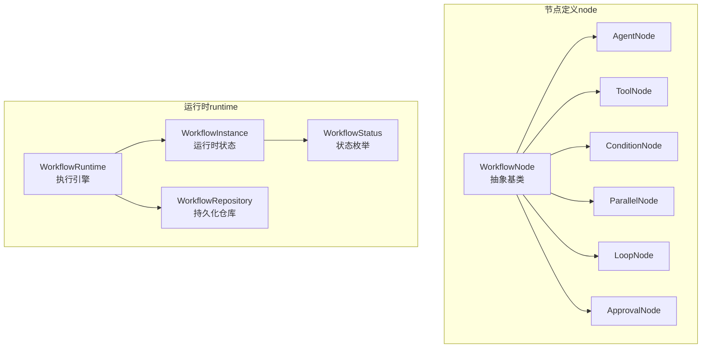
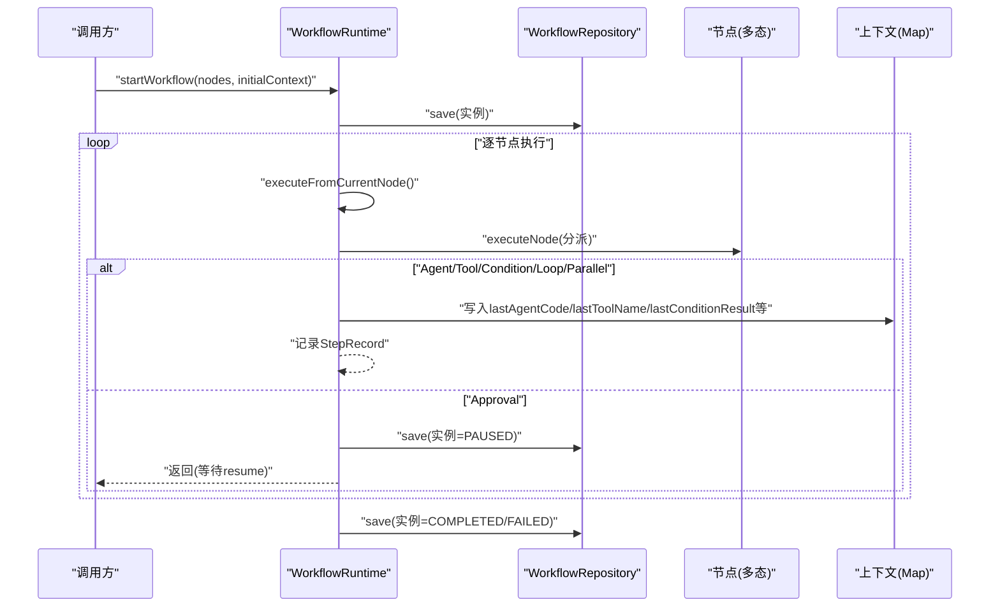
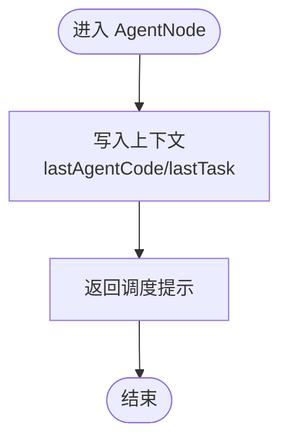
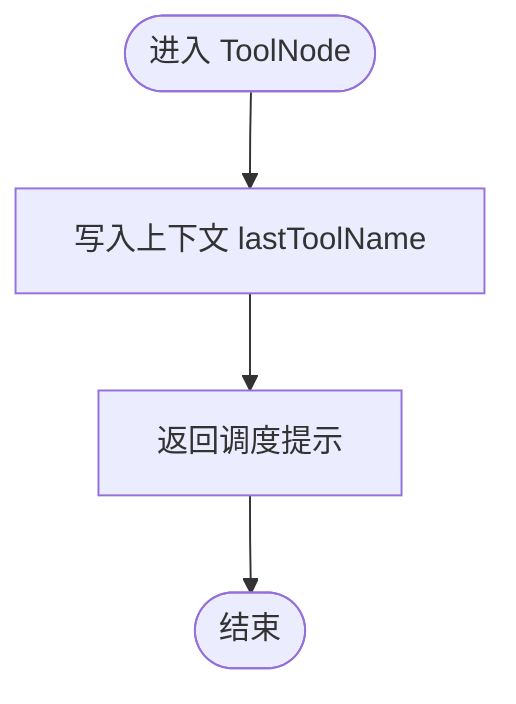
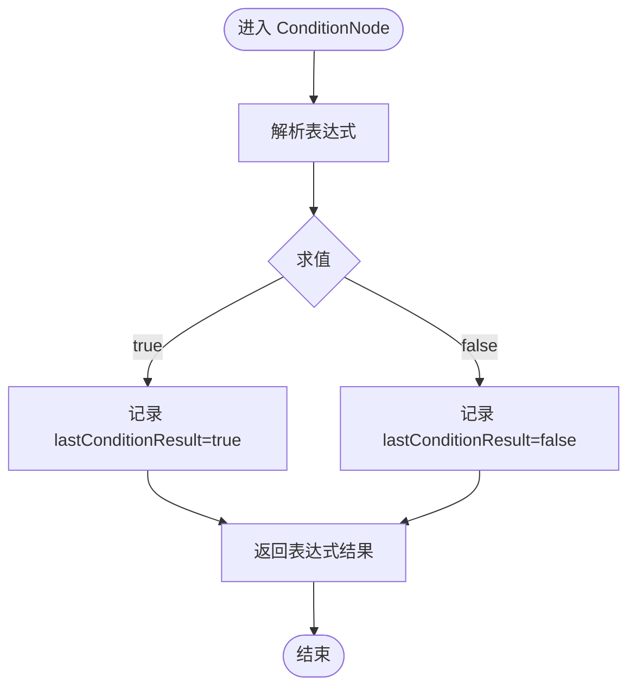
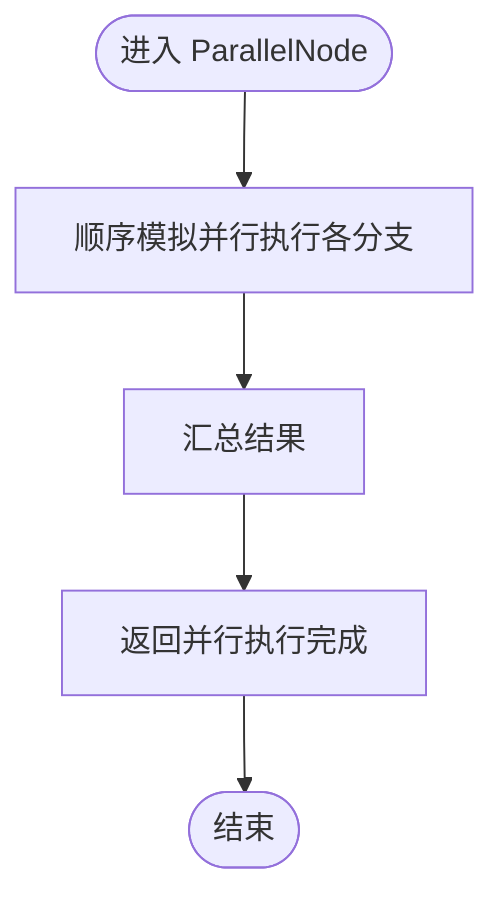
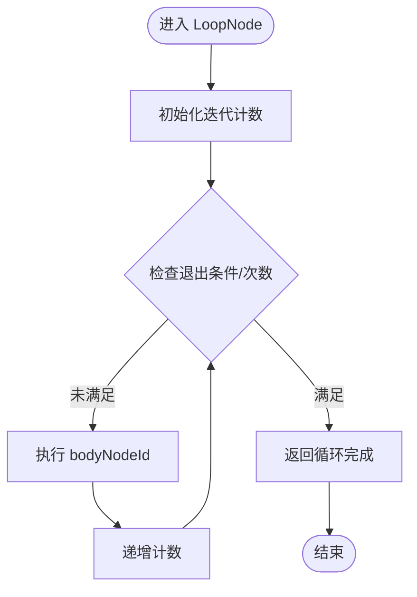
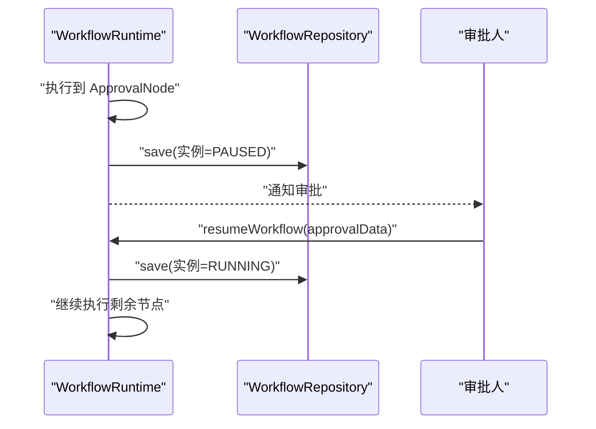
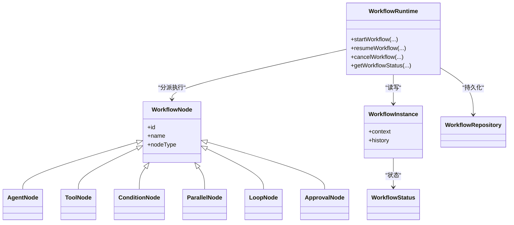

# 工作流节点类型

<cite>
**本文引用的文件**
- [WorkflowNode.java](file://src/main/java/com/yupi/yuaiagent/workflow/node/WorkflowNode.java)
- [AgentNode.java](file://src/main/java/com/yupi/yuaiagent/workflow/node/AgentNode.java)
- [ToolNode.java](file://src/main/java/com/yupi/yuaiagent/workflow/node/ToolNode.java)
- [ConditionNode.java](file://src/main/java/com/yupi/yuaiagent/workflow/node/ConditionNode.java)
- [ParallelNode.java](file://src/main/java/com/yupi/yuaiagent/workflow/node/ParallelNode.java)
- [LoopNode.java](file://src/main/java/com/yupi/yuaiagent/workflow/node/LoopNode.java)
- [ApprovalNode.java](file://src/main/java/com/yupi/yuaiagent/workflow/node/ApprovalNode.java)
- [WorkflowRuntime.java](file://src/main/java/com/yupi/yuaiagent/workflow/runtime/WorkflowRuntime.java)
- [WorkflowInstance.java](file://src/main/java/com/yupi/yuaiagent/workflow/runtime/WorkflowInstance.java)
- [WorkflowRepository.java](file://src/main/java/com/yupi/yuaiagent/workflow/runtime/WorkflowRepository.java)
- [WorkflowStatus.java](file://src/main/java/com/yupi/yuaiagent/workflow/runtime/WorkflowStatus.java)
</cite>

## 目录
1. [简介](#简介)
2. [项目结构](#项目结构)
3. [核心组件](#核心组件)
4. [架构总览](#架构总览)
5. [详细组件分析](#详细组件分析)
6. [依赖关系分析](#依赖关系分析)
7. [性能考量](#性能考量)
8. [故障排查指南](#故障排查指南)
9. [结论](#结论)
10. [附录](#附录)

## 简介
本文件系统性梳理工作流节点类型的技术设计与实现要点，覆盖六种节点类型：AgentNode、ToolNode、ConditionNode、ParallelNode、LoopNode、ApprovalNode。文档围绕以下目标展开：
- 设计原理与适用场景
- 执行机制、参数传递与结果处理
- 错误处理与超时控制
- 分支选择与表达式解析
- 并行执行策略与同步机制
- 循环控制、迭代变量与终止条件
- 审批流程、权限验证与状态管理
- 配置示例与最佳实践
- 开发与扩展指南

## 项目结构
工作流相关代码位于后端模块的 workflow 包内，分为“节点定义”和“运行时执行”两部分：
- 节点定义：位于 node 包，定义六种节点类型的结构与属性
- 运行时：位于 runtime 包，负责工作流实例生命周期、节点调度与状态管理

图示来源
- [WorkflowNode.java:1-62](file://src/main/java/com/yupi/yuaiagent/workflow/node/WorkflowNode.java#L1-L62)
- [AgentNode.java:1-32](file://src/main/java/com/yupi/yuaiagent/workflow/node/AgentNode.java#L1-L32)
- [ToolNode.java:1-27](file://src/main/java/com/yupi/yuaiagent/workflow/node/ToolNode.java#L1-L27)
- [ConditionNode.java:1-35](file://src/main/java/com/yupi/yuaiagent/workflow/node/ConditionNode.java#L1-L35)
- [ParallelNode.java:1-29](file://src/main/java/com/yupi/yuaiagent/workflow/node/ParallelNode.java#L1-L29)
- [LoopNode.java:1-32](file://src/main/java/com/yupi/yuaiagent/workflow/node/LoopNode.java#L1-L32)
- [ApprovalNode.java:1-27](file://src/main/java/com/yupi/yuaiagent/workflow/node/ApprovalNode.java#L1-L27)
- [WorkflowRuntime.java:1-229](file://src/main/java/com/yupi/yuaiagent/workflow/runtime/WorkflowRuntime.java#L1-L229)
- [WorkflowInstance.java:1-75](file://src/main/java/com/yupi/yuaiagent/workflow/runtime/WorkflowInstance.java#L1-L75)
- [WorkflowRepository.java:1-114](file://src/main/java/com/yupi/yuaiagent/workflow/runtime/WorkflowRepository.java#L1-L114)
- [WorkflowStatus.java](file://src/main/java/com/yupi/yuaiagent/workflow/runtime/WorkflowStatus.java)

章节来源
- [WorkflowNode.java:1-62](file://src/main/java/com/yupi/yuaiagent/workflow/node/WorkflowNode.java#L1-L62)
- [WorkflowRuntime.java:1-229](file://src/main/java/com/yupi/yuaiagent/workflow/runtime/WorkflowRuntime.java#L1-L229)

## 核心组件
- 抽象基类：统一节点标识、序列化与多态分发
- 六种节点类型：分别承担“委派执行、直接调用、条件分支、并行聚合、循环迭代、人工审批”的职责
- 运行时引擎：负责实例启动、节点调度、状态推进、异常处理与持久化
- 实例与上下文：承载节点执行历史、运行时上下文与状态
- 仓库：基于文件的轻量级持久化，支持并发安全

章节来源
- [WorkflowNode.java:21-29](file://src/main/java/com/yupi/yuaiagent/workflow/node/WorkflowNode.java#L21-L29)
- [WorkflowRuntime.java:23-52](file://src/main/java/com/yupi/yuaiagent/workflow/runtime/WorkflowRuntime.java#L23-L52)
- [WorkflowInstance.java:18-75](file://src/main/java/com/yupi/yuaiagent/workflow/runtime/WorkflowInstance.java#L18-L75)
- [WorkflowRepository.java:25-114](file://src/main/java/com/yupi/yuaiagent/workflow/runtime/WorkflowRepository.java#L25-L114)

## 架构总览
工作流执行采用“运行时引擎 + 节点类型 + 实例上下文”的分层设计。引擎按序遍历节点，根据节点类型分派到具体执行器；在关键节点（如审批）暂停并持久化，待恢复后继续。

图示来源
- [WorkflowRuntime.java:31-156](file://src/main/java/com/yupi/yuaiagent/workflow/runtime/WorkflowRuntime.java#L31-L156)
- [WorkflowRepository.java:53-63](file://src/main/java/com/yupi/yuaiagent/workflow/runtime/WorkflowRepository.java#L53-L63)
- [WorkflowInstance.java:65-73](file://src/main/java/com/yupi/yuaiagent/workflow/runtime/WorkflowInstance.java#L65-L73)

## 详细组件分析

### AgentNode（智能体节点）
- 设计原理
  - 将任务委托给指定 Agent 执行，自身不承担计算，仅记录意图并透传上下文
- 关键属性
  - agentCode：目标智能体编码
  - taskDescription：任务描述
  - inputRef：输入变量引用（用于从上下文取值）
- 执行机制
  - 运行时将 agentCode 与 taskDescription 写入上下文，便于后续由外部 AgentRuntime 接手执行
- 参数传递
  - inputRef 作为变量名引用，建议在上下文中预置对应值
- 结果处理
  - 返回调度提示信息，供上层记录与追踪
- 使用场景
  - 需要由专用智能体承接复杂推理或对话的任务编排

图示来源
- [AgentNode.java:10-15](file://src/main/java/com/yupi/yuaiagent/workflow/node/AgentNode.java#L10-L15)
- [WorkflowRuntime.java:173-180](file://src/main/java/com/yupi/yuaiagent/workflow/runtime/WorkflowRuntime.java#L173-L180)

章节来源
- [AgentNode.java:1-32](file://src/main/java/com/yupi/yuaiagent/workflow/node/AgentNode.java#L1-L32)
- [WorkflowRuntime.java:173-180](file://src/main/java/com/yupi/yuaiagent/workflow/runtime/WorkflowRuntime.java#L173-L180)

### ToolNode（工具节点）
- 设计原理
  - 直接调用指定工具，适合执行检索、下载、终端操作等原子能力
- 关键属性
  - toolName：工具名称（如 web.search）
  - toolArgs：工具参数（可为 JSON 字符串或变量引用）
- 执行机制
  - 运行时将 toolName 写入上下文，便于后续由外部工具执行器使用
- 参数传递
  - 建议通过 inputRef 将上游输出注入 toolArgs
- 结果处理
  - 返回调度提示信息，便于记录与追踪
- 使用场景
  - 需要稳定、可重复的工具调用，且无需复杂决策

图示来源
- [ToolNode.java:10-13](file://src/main/java/com/yupi/yuaiagent/workflow/node/ToolNode.java#L10-L13)
- [WorkflowRuntime.java:182-186](file://src/main/java/com/yupi/yuaiagent/workflow/runtime/WorkflowRuntime.java#L182-L186)

章节来源
- [ToolNode.java:1-27](file://src/main/java/com/yupi/yuaiagent/workflow/node/ToolNode.java#L1-L27)
- [WorkflowRuntime.java:182-186](file://src/main/java/com/yupi/yuaiagent/workflow/runtime/WorkflowRuntime.java#L182-L186)

### ConditionNode（条件节点）
- 设计原理
  - 基于表达式判断选择分支，支持简单比较（==、!=）
- 关键属性
  - expression：表达式（如 "key==value" 或 "key!=value"）
  - trueBranch/falseBranch：分支节点 ID
- 执行机制
  - 运行时对表达式进行求值，将布尔结果写入上下文
- 表达式解析
  - V1 实现：按键值是否存在与相等性判断
- 结果处理
  - 返回表达式求值结果，便于审计与调试
- 使用场景
  - 多路分支决策、条件路由与动态路径选择

图示来源
- [ConditionNode.java:12-17](file://src/main/java/com/yupi/yuaiagent/workflow/node/ConditionNode.java#L12-L17)
- [WorkflowRuntime.java:188-195](file://src/main/java/com/yupi/yuaiagent/workflow/runtime/WorkflowRuntime.java#L188-L195)
- [WorkflowRuntime.java:213-227](file://src/main/java/com/yupi/yuaiagent/workflow/runtime/WorkflowRuntime.java#L213-L227)

章节来源
- [ConditionNode.java:1-35](file://src/main/java/com/yupi/yuaiagent/workflow/node/ConditionNode.java#L1-L35)
- [WorkflowRuntime.java:188-195](file://src/main/java/com/yupi/yuaiagent/workflow/runtime/WorkflowRuntime.java#L188-L195)
- [WorkflowRuntime.java:213-227](file://src/main/java/com/yupi/yuaiagent/workflow/runtime/WorkflowRuntime.java#L213-L227)

### ParallelNode（并行节点）
- 设计原理
  - 并发执行多个子节点，等待全部完成（V1 顺序模拟，V2 可改为真正并行）
- 关键属性
  - branches：子节点 ID 列表
  - requireAll：是否要求全部分支成功
- 执行机制
  - V1：顺序模拟并行，记录完成状态
  - V2：建议使用异步并发框架实现真正并行与超时控制
- 结果处理
  - 返回并行执行概要信息
- 使用场景
  - 多源数据采集、并行计算与资源竞争场景

图示来源
- [ParallelNode.java:12-15](file://src/main/java/com/yupi/yuaiagent/workflow/node/ParallelNode.java#L12-L15)
- [WorkflowRuntime.java:197-201](file://src/main/java/com/yupi/yuaiagent/workflow/runtime/WorkflowRuntime.java#L197-L201)

章节来源
- [ParallelNode.java:1-29](file://src/main/java/com/yupi/yuaiagent/workflow/node/ParallelNode.java#L1-L29)
- [WorkflowRuntime.java:197-201](file://src/main/java/com/yupi/yuaiagent/workflow/runtime/WorkflowRuntime.java#L197-L201)

### LoopNode（循环节点）
- 设计原理
  - 重复执行子节点，直至满足退出条件或达到最大迭代次数
- 关键属性
  - bodyNodeId：循环体节点 ID
  - exitCondition：退出条件表达式
  - maxIterations：最大迭代次数
- 执行机制
  - V1：记录最大迭代次数并返回完成提示
  - V2：建议实现真实循环、上下文变量更新与超时控制
- 结果处理
  - 返回循环执行完成信息
- 使用场景
  - 数据重试、增量拉取、收敛迭代与批量处理

图示来源
- [LoopNode.java:10-15](file://src/main/java/com/yupi/yuaiagent/workflow/node/LoopNode.java#L10-L15)
- [WorkflowRuntime.java:203-206](file://src/main/java/com/yupi/yuaiagent/workflow/runtime/WorkflowRuntime.java#L203-L206)

章节来源
- [LoopNode.java:1-32](file://src/main/java/com/yupi/yuaiagent/workflow/node/LoopNode.java#L1-L32)
- [WorkflowRuntime.java:203-206](file://src/main/java/com/yupi/yuaiagent/workflow/runtime/WorkflowRuntime.java#L203-L206)

### ApprovalNode（审批节点）
- 设计原理
  - 暂停工作流等待人工审批，支持超时自动拒绝
- 关键属性
  - approvalMessage：审批说明
  - timeoutSeconds：超时时间（秒，默认 24 小时）
- 执行机制
  - 遇到审批节点时，引擎将实例置为 PAUSED 并持久化，等待 resumeWorkflow 恢复
- 权限验证与状态管理
  - 运行时提供 resumeWorkflow/cancelWorkflow 接口，配合外部权限系统使用
- 结果处理
  - 审批通过后可将审批数据合并入上下文并继续执行
- 使用场景
  - 风控、合规、预算与重要变更的强制审批

图示来源
- [ApprovalNode.java:10-13](file://src/main/java/com/yupi/yuaiagent/workflow/node/ApprovalNode.java#L10-L13)
- [WorkflowRuntime.java:57-77](file://src/main/java/com/yupi/yuaiagent/workflow/runtime/WorkflowRuntime.java#L57-L77)
- [WorkflowRuntime.java:138-146](file://src/main/java/com/yupi/yuaiagent/workflow/runtime/WorkflowRuntime.java#L138-L146)

章节来源
- [ApprovalNode.java:1-27](file://src/main/java/com/yupi/yuaiagent/workflow/node/ApprovalNode.java#L1-L27)
- [WorkflowRuntime.java:57-77](file://src/main/java/com/yupi/yuaiagent/workflow/runtime/WorkflowRuntime.java#L57-L77)
- [WorkflowRuntime.java:138-146](file://src/main/java/com/yupi/yuaiagent/workflow/runtime/WorkflowRuntime.java#L138-L146)

## 依赖关系分析
- 节点类型与运行时的耦合
  - 运行时通过节点类型字符串分派到具体执行器，保持良好内聚与低耦合
- 实例与上下文
  - 上下文贯穿全链路，是节点间通信的桥梁
- 持久化
  - 仓库负责实例状态的落盘与并发安全访问

图示来源
- [WorkflowNode.java:30-61](file://src/main/java/com/yupi/yuaiagent/workflow/node/WorkflowNode.java#L30-L61)
- [WorkflowRuntime.java:161-171](file://src/main/java/com/yupi/yuaiagent/workflow/runtime/WorkflowRuntime.java#L161-L171)
- [WorkflowInstance.java:18-75](file://src/main/java/com/yupi/yuaiagent/workflow/runtime/WorkflowInstance.java#L18-L75)
- [WorkflowRepository.java:25-114](file://src/main/java/com/yupi/yuaiagent/workflow/runtime/WorkflowRepository.java#L25-L114)
- [WorkflowStatus.java](file://src/main/java/com/yupi/yuaiagent/workflow/runtime/WorkflowStatus.java)

章节来源
- [WorkflowRuntime.java:161-171](file://src/main/java/com/yupi/yuaiagent/workflow/runtime/WorkflowRuntime.java#L161-L171)
- [WorkflowInstance.java:18-75](file://src/main/java/com/yupi/yuaiagent/workflow/runtime/WorkflowInstance.java#L18-L75)
- [WorkflowRepository.java:25-114](file://src/main/java/com/yupi/yuaiagent/workflow/runtime/WorkflowRepository.java#L25-L114)

## 性能考量
- 并行执行
  - V1 顺序模拟并行，建议在 V2 中引入异步并发框架，减少总执行时间
- 超时控制
  - 审批节点具备超时秒数配置，建议在工具调用与循环节点中增加超时与重试策略
- 上下文大小
  - 避免在上下文中存放过大对象，必要时使用引用或外部存储
- 持久化开销
  - 仓库采用文件存储，建议在高并发场景引入数据库与缓存优化

## 故障排查指南
- 常见问题
  - 未知节点类型：检查 nodeType 配置是否正确
  - 审批未恢复：确认实例状态为 PAUSED，且调用了 resumeWorkflow
  - 条件表达式无效：确保表达式格式为 "key==value" 或 "key!=value"
  - 上下文缺失：核对 inputRef 对应的键是否存在
- 日志定位
  - 运行时在节点执行失败时记录错误日志，并将实例置为 FAILED
- 恢复与取消
  - 使用 cancelWorkflow 取消实例；使用 resumeWorkflow 传入审批数据后恢复

章节来源
- [WorkflowRuntime.java:119-128](file://src/main/java/com/yupi/yuaiagent/workflow/runtime/WorkflowRuntime.java#L119-L128)
- [WorkflowRuntime.java:57-77](file://src/main/java/com/yupi/yuaiagent/workflow/runtime/WorkflowRuntime.java#L57-L77)
- [WorkflowRuntime.java:82-88](file://src/main/java/com/yupi/yuaiagent/workflow/runtime/WorkflowRuntime.java#L82-L88)

## 结论
该工作流节点体系以“轻量、可扩展、可观测”为目标，通过抽象基类与运行时分派实现清晰的职责划分。六种节点覆盖了典型编排需求，配合上下文与历史记录形成完整的执行轨迹。建议在后续版本中完善并行、超时与循环的实现细节，并加强权限与审计能力。

## 附录

### 配置示例与最佳实践
- AgentNode
  - 建议设置 agentCode 与 taskDescription，并通过 inputRef 引用上游输出
- ToolNode
  - toolArgs 使用 JSON 字符串或变量引用，避免硬编码
- ConditionNode
  - 表达式采用 "key==value" 形式，确保上下文键存在
- ParallelNode
  - branches 控制并行度，合理设置 requireAll
- LoopNode
  - 明确 exitCondition 与 maxIterations，防止无限循环
- ApprovalNode
  - 设置合理的 timeoutSeconds，并在审批通过后合并审批数据

### 开发与扩展指南
- 新增节点类型
  - 继承 WorkflowNode，定义属性与构造函数
  - 在运行时的 executeNode 分派中添加新类型分支
  - 如需持久化，确保节点属性可序列化
- 并行与超时
  - 建议引入异步并发框架，实现真正的并行执行与超时控制
- 审批与权限
  - 与外部权限系统集成，校验审批人角色与审批范围
- 可观测性
  - 为每个节点补充详细的日志与指标上报，便于问题定位与性能分析