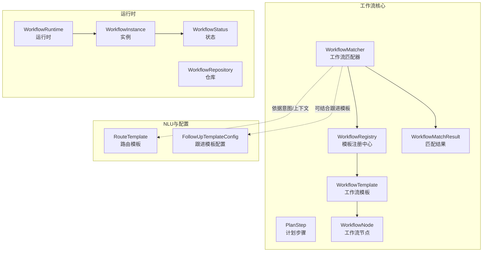
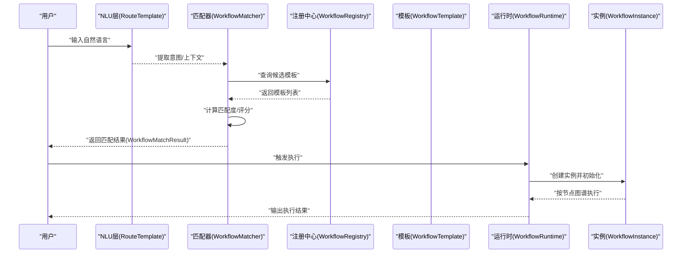
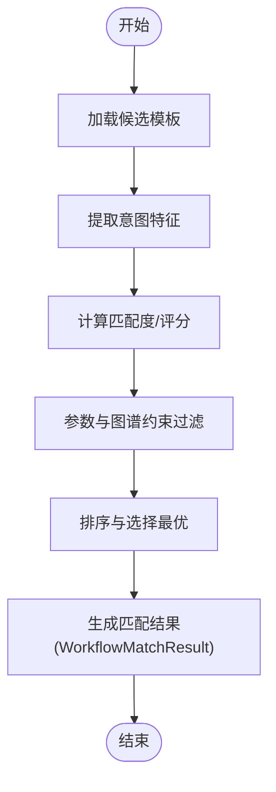
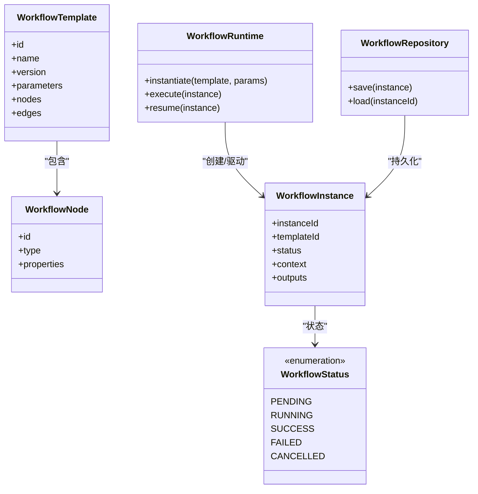
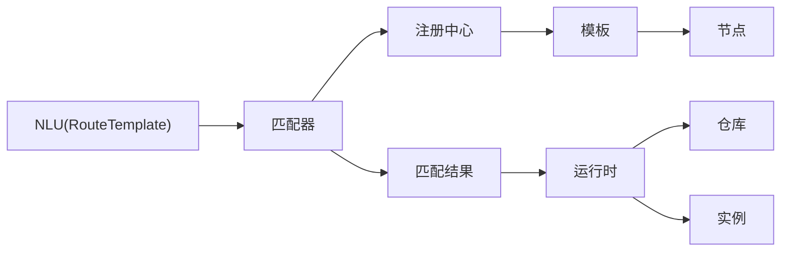

# 工作流设计与模板

<cite>
**本文引用的文件**
- [PlanStep.java](file://src/main/java/com/yupi/yuaiagent/workflow/PlanStep.java)
- [WorkflowTemplate.java](file://src/main/java/com/yupi/yuaiagent/workflow/WorkflowTemplate.java)
- [WorkflowMatcher.java](file://src/main/java/com/yupi/yuaiagent/workflow/WorkflowMatcher.java)
- [WorkflowRegistry.java](file://src/main/java/com/yupi/yuaiagent/workflow/WorkflowRegistry.java)
- [WorkflowMatchResult.java](file://src/main/java/com/yupi/yuaiagent/workflow/WorkflowMatchResult.java)
- [WorkflowNode.java](file://src/main/java/com/yupi/yuaiagent/workflow/node/WorkflowNode.java)
- [WorkflowInstance.java](file://src/main/java/com/yupi/yuaiagent/workflow/runtime/WorkflowInstance.java)
- [WorkflowRuntime.java](file://src/main/java/com/yupi/yuaiagent/workflow/runtime/WorkflowRuntime.java)
- [WorkflowRepository.java](file://src/main/java/com/yupi/yuaiagent/workflow/runtime/WorkflowRepository.java)
- [WorkflowStatus.java](file://src/main/java/com/yupi/yuaiagent/workflow/runtime/WorkflowStatus.java)
- [RouteTemplate.java](file://src/main/java/com/yupi/yuaiagent/nlu/RouteTemplate.java)
- [FollowUpTemplateConfig.java](file://src/main/java/com/yupi/yuaiagent/config/FollowUpTemplateConfig.java)
</cite>

## 目录
1. [引言](#引言)
2. [项目结构](#项目结构)
3. [核心组件](#核心组件)
4. [架构总览](#架构总览)
5. [详细组件分析](#详细组件分析)
6. [依赖关系分析](#依赖关系分析)
7. [性能考虑](#性能考虑)
8. [故障排查指南](#故障排查指南)
9. [结论](#结论)
10. [附录](#附录)

## 引言
本文件面向开发者，系统性地阐述该AI代理系统中的“工作流设计与模板”能力：工作流模板的定义方式、注册机制与匹配算法；PlanStep的设计理念与执行步骤描述；WorkflowTemplate的结构组成、参数配置与验证规则；以及工作流匹配器如何依据用户意图与上下文选择合适模板的原理。文档同时提供最佳实践、完整模板示例与调试方法，帮助团队高效构建可维护、可扩展的工作流模板体系。

## 项目结构
工作流相关代码主要位于后端模块的 workflow 包及其子包中，包含模板定义、节点类型、运行时实例与仓库管理等模块化组件。此外，NLU层的路由模板与跟进模板配置也与工作流意图识别和后续流程衔接紧密。

图表来源
- [WorkflowTemplate.java](file://src/main/java/com/yupi/yuaiagent/workflow/WorkflowTemplate.java)
- [WorkflowRegistry.java](file://src/main/java/com/yupi/yuaiagent/workflow/WorkflowRegistry.java)
- [WorkflowMatcher.java](file://src/main/java/com/yupi/yuaiagent/workflow/WorkflowMatcher.java)
- [WorkflowMatchResult.java](file://src/main/java/com/yupi/yuaiagent/workflow/WorkflowMatchResult.java)
- [PlanStep.java](file://src/main/java/com/yupi/yuaiagent/workflow/PlanStep.java)
- [WorkflowNode.java](file://src/main/java/com/yupi/yuaiagent/workflow/node/WorkflowNode.java)
- [WorkflowInstance.java](file://src/main/java/com/yupi/yuaiagent/workflow/runtime/WorkflowInstance.java)
- [WorkflowRuntime.java](file://src/main/java/com/yupi/yuaiagent/workflow/runtime/WorkflowRuntime.java)
- [WorkflowRepository.java](file://src/main/java/com/yupi/yuaiagent/workflow/runtime/WorkflowRepository.java)
- [WorkflowStatus.java](file://src/main/java/com/yupi/yuaiagent/workflow/runtime/WorkflowStatus.java)
- [RouteTemplate.java](file://src/main/java/com/yupi/yuaiagent/nlu/RouteTemplate.java)
- [FollowUpTemplateConfig.java](file://src/main/java/com/yupi/yuaiagent/config/FollowUpTemplateConfig.java)

章节来源
- [WorkflowTemplate.java](file://src/main/java/com/yupi/yuaiagent/workflow/WorkflowTemplate.java)
- [WorkflowRegistry.java](file://src/main/java/com/yupi/yuaiagent/workflow/WorkflowRegistry.java)
- [WorkflowMatcher.java](file://src/main/java/com/yupi/yuaiagent/workflow/WorkflowMatcher.java)
- [WorkflowMatchResult.java](file://src/main/java/com/yupi/yuaiagent/workflow/WorkflowMatchResult.java)
- [PlanStep.java](file://src/main/java/com/yupi/yuaiagent/workflow/PlanStep.java)
- [WorkflowNode.java](file://src/main/java/com/yupi/yuaiagent/workflow/node/WorkflowNode.java)
- [WorkflowInstance.java](file://src/main/java/com/yupi/yuaiagent/workflow/runtime/WorkflowInstance.java)
- [WorkflowRuntime.java](file://src/main/java/com/yupi/yuaiagent/workflow/runtime/WorkflowRuntime.java)
- [WorkflowRepository.java](file://src/main/java/com/yupi/yuaiagent/workflow/runtime/WorkflowRepository.java)
- [WorkflowStatus.java](file://src/main/java/com/yupi/yuaiagent/workflow/runtime/WorkflowStatus.java)
- [RouteTemplate.java](file://src/main/java/com/yupi/yuaiagent/nlu/RouteTemplate.java)
- [FollowUpTemplateConfig.java](file://src/main/java/com/yupi/yuaiagent/config/FollowUpTemplateConfig.java)

## 核心组件
- 工作流模板（WorkflowTemplate）：定义模板元数据、输入参数、节点图谱与执行约束，是工作流的蓝图。
- 计划步骤（PlanStep）：描述单个步骤的执行目标、工具调用、条件分支与回退策略，体现“如何做”的细节。
- 工作流节点（WorkflowNode）：模板图谱中的节点抽象，支持代理节点、工具节点、条件节点、并行节点、循环节点等。
- 匹配器（WorkflowMatcher）：根据用户意图与上下文，从已注册模板中选择最合适的模板。
- 注册中心（WorkflowRegistry）：集中管理模板注册、查询与版本化。
- 运行时（WorkflowRuntime/WorkflowInstance/WorkflowRepository）：负责实例化、调度、持久化与状态流转。
- 匹配结果（WorkflowMatchResult）：封装匹配评分、候选模板与上下文信息。
- NLU路由模板（RouteTemplate）与跟进模板配置（FollowUpTemplateConfig）：为匹配器提供意图与后续流程的参考。

章节来源
- [WorkflowTemplate.java](file://src/main/java/com/yupi/yuaiagent/workflow/WorkflowTemplate.java)
- [PlanStep.java](file://src/main/java/com/yupi/yuaiagent/workflow/PlanStep.java)
- [WorkflowNode.java](file://src/main/java/com/yupi/yuaiagent/workflow/node/WorkflowNode.java)
- [WorkflowMatcher.java](file://src/main/java/com/yupi/yuaiagent/workflow/WorkflowMatcher.java)
- [WorkflowRegistry.java](file://src/main/java/com/yupi/yuaiagent/workflow/WorkflowRegistry.java)
- [WorkflowMatchResult.java](file://src/main/java/com/yupi/yuaiagent/workflow/WorkflowMatchResult.java)
- [WorkflowInstance.java](file://src/main/java/com/yupi/yuaiagent/workflow/runtime/WorkflowInstance.java)
- [WorkflowRuntime.java](file://src/main/java/com/yupi/yuaiagent/workflow/runtime/WorkflowRuntime.java)
- [WorkflowRepository.java](file://src/main/java/com/yupi/yuaiagent/workflow/runtime/WorkflowRepository.java)
- [WorkflowStatus.java](file://src/main/java/com/yupi/yuaiagent/workflow/runtime/WorkflowStatus.java)
- [RouteTemplate.java](file://src/main/java/com/yupi/yuaiagent/nlu/RouteTemplate.java)
- [FollowUpTemplateConfig.java](file://src/main/java/com/yupi/yuaiagent/config/FollowUpTemplateConfig.java)

## 架构总览
工作流模板系统采用“模板定义—注册—匹配—实例化—执行—追踪”的闭环架构。NLU层提供意图与上下文，匹配器据此在注册中心检索模板，生成匹配结果并驱动运行时实例化与执行。

图表来源
- [WorkflowMatcher.java](file://src/main/java/com/yupi/yuaiagent/workflow/WorkflowMatcher.java)
- [WorkflowRegistry.java](file://src/main/java/com/yupi/yuaiagent/workflow/WorkflowRegistry.java)
- [WorkflowTemplate.java](file://src/main/java/com/yupi/yuaiagent/workflow/WorkflowTemplate.java)
- [WorkflowRuntime.java](file://src/main/java/com/yupi/yuaiagent/workflow/runtime/WorkflowRuntime.java)
- [WorkflowInstance.java](file://src/main/java/com/yupi/yuaiagent/workflow/runtime/WorkflowInstance.java)
- [RouteTemplate.java](file://src/main/java/com/yupi/yuaiagent/nlu/RouteTemplate.java)

## 详细组件分析

### PlanStep 设计理念与执行步骤描述
- 设计理念
  - 将复杂任务拆解为一系列“可执行、可验证、可回退”的步骤，每个步骤聚焦单一动作或判断。
  - 支持条件分支与重试策略，提升鲁棒性与可调试性。
- 执行步骤描述
  - 输入：步骤目标、前置条件、工具/代理调用、失败策略。
  - 处理：按顺序执行，遇到条件节点进行判定，必要时进入回退路径。
  - 输出：步骤状态、中间产物、下一步建议或终止信号。
- 与模板的关系
  - PlanStep通常由模板中的节点映射而来，模板定义高层流程，PlanStep细化到具体执行单元。

章节来源
- [PlanStep.java](file://src/main/java/com/yupi/yuaiagent/workflow/PlanStep.java)

### WorkflowTemplate 结构组成、参数配置与验证规则
- 结构组成
  - 元数据：模板标识、名称、版本、描述、可见性。
  - 参数定义：输入参数列表（名称、类型、是否必填、默认值、校验规则）。
  - 节点图谱：以节点集合与边集合表示的有向无环图（DAG），支持并行、条件、循环等控制结构。
  - 约束与策略：超时、重试、并发度、失败策略等。
- 参数配置
  - 使用参数定义表单化声明，便于运行时注入与校验。
  - 支持环境变量占位符与默认值，增强灵活性。
- 验证规则
  - 必填参数校验、类型一致性校验、范围/枚举校验、依赖参数联动校验。
  - 图谱连通性与环路检测，确保可执行性。
- 与节点的关系
  - 节点类型覆盖代理节点、工具节点、条件节点、并行节点、循环节点等，满足多样化业务场景。

章节来源
- [WorkflowTemplate.java](file://src/main/java/com/yupi/yuaiagent/workflow/WorkflowTemplate.java)
- [WorkflowNode.java](file://src/main/java/com/yupi/yuaiagent/workflow/node/WorkflowNode.java)

### 工作流匹配器（WorkflowMatcher）工作原理
- 输入
  - 用户意图（来自NLU层的RouteTemplate）、上下文信息（历史会话、用户档案、外部状态）。
- 处理流程
  - 从注册中心加载候选模板。
  - 基于意图关键词、实体、上下文特征计算相似度/匹配度。
  - 应用模板参数与图谱约束进行过滤与排序。
  - 生成匹配结果对象，包含模板、得分、命中字段与建议。
- 输出
  - 最优模板与匹配度，供运行时实例化执行。

图表来源
- [WorkflowMatcher.java](file://src/main/java/com/yupi/yuaiagent/workflow/WorkflowMatcher.java)
- [WorkflowRegistry.java](file://src/main/java/com/yupi/yuaiagent/workflow/WorkflowRegistry.java)
- [WorkflowMatchResult.java](file://src/main/java/com/yupi/yuaiagent/workflow/WorkflowMatchResult.java)
- [RouteTemplate.java](file://src/main/java/com/yupi/yuaiagent/nlu/RouteTemplate.java)

章节来源
- [WorkflowMatcher.java](file://src/main/java/com/yupi/yuaiagent/workflow/WorkflowMatcher.java)
- [WorkflowRegistry.java](file://src/main/java/com/yupi/yuaiagent/workflow/WorkflowRegistry.java)
- [WorkflowMatchResult.java](file://src/main/java/com/yupi/yuaiagent/workflow/WorkflowMatchResult.java)
- [RouteTemplate.java](file://src/main/java/com/yupi/yuaiagent/nlu/RouteTemplate.java)

### 运行时与实例（WorkflowRuntime/WorkflowInstance/WorkflowRepository）
- 实例化
  - 运行时接收匹配结果，解析模板参数，创建实例并初始化状态。
- 调度与执行
  - 按节点图谱推进，处理条件分支、并行聚合与循环控制。
  - 记录每步执行轨迹，支持回溯与重放。
- 持久化与状态
  - 通过仓库持久化实例状态与中间结果，支持重启恢复与审计。
- 状态管理
  - 定义实例生命周期状态（如待启动、执行中、成功、失败、取消等），并提供转换规则。

图表来源
- [WorkflowTemplate.java](file://src/main/java/com/yupi/yuaiagent/workflow/WorkflowTemplate.java)
- [WorkflowNode.java](file://src/main/java/com/yupi/yuaiagent/workflow/node/WorkflowNode.java)
- [WorkflowInstance.java](file://src/main/java/com/yupi/yuaiagent/workflow/runtime/WorkflowInstance.java)
- [WorkflowRuntime.java](file://src/main/java/com/yupi/yuaiagent/workflow/runtime/WorkflowRuntime.java)
- [WorkflowRepository.java](file://src/main/java/com/yupi/yuaiagent/workflow/runtime/WorkflowRepository.java)
- [WorkflowStatus.java](file://src/main/java/com/yupi/yuaiagent/workflow/runtime/WorkflowStatus.java)

章节来源
- [WorkflowInstance.java](file://src/main/java/com/yupi/yuaiagent/workflow/runtime/WorkflowInstance.java)
- [WorkflowRuntime.java](file://src/main/java/com/yupi/yuaiagent/workflow/runtime/WorkflowRuntime.java)
- [WorkflowRepository.java](file://src/main/java/com/yupi/yuaiagent/workflow/runtime/WorkflowRepository.java)
- [WorkflowStatus.java](file://src/main/java/com/yupi/yuaiagent/workflow/runtime/WorkflowStatus.java)

### 注册中心（WorkflowRegistry）
- 职责
  - 维护模板清单、版本与可见性。
  - 提供查询接口（按名称、标签、版本、可用性筛选）。
  - 支持模板发布/下线与灰度策略。
- 与匹配器协作
  - 匹配器在决策前先从注册中心获取候选集，减少重复扫描与计算。

章节来源
- [WorkflowRegistry.java](file://src/main/java/com/yupi/yuaiagent/workflow/WorkflowRegistry.java)

### 匹配结果（WorkflowMatchResult）
- 字段
  - 候选模板列表、匹配度分数、命中字段与建议。
- 用途
  - 作为运行时实例化的输入，指导参数注入与节点选择。

章节来源
- [WorkflowMatchResult.java](file://src/main/java/com/yupi/yuaiagent/workflow/WorkflowMatchResult.java)

### NLU路由模板与跟进模板配置
- 路由模板（RouteTemplate）
  - 描述意图分类、关键词与实体抽取规则，为匹配器提供结构化意图。
- 跟进模板配置（FollowUpTemplateConfig）
  - 定义后续流程模板与触发条件，辅助匹配器在多轮对话中选择合适模板。

章节来源
- [RouteTemplate.java](file://src/main/java/com/yupi/yuaiagent/nlu/RouteTemplate.java)
- [FollowUpTemplateConfig.java](file://src/main/java/com/yupi/yuaiagent/config/FollowUpTemplateConfig.java)

## 依赖关系分析
- 模块内聚与耦合
  - 模板与节点强内聚，通过注册中心与匹配器解耦。
  - 运行时与仓库弱耦合，便于替换存储实现。
- 关键依赖链
  - NLU → 匹配器 → 注册中心 → 模板 → 节点 → 运行时 → 仓库。
- 循环依赖风险
  - 模板图谱应避免环路；运行时对实例状态的读写需加锁或幂等。

图表来源
- [WorkflowMatcher.java](file://src/main/java/com/yupi/yuaiagent/workflow/WorkflowMatcher.java)
- [WorkflowRegistry.java](file://src/main/java/com/yupi/yuaiagent/workflow/WorkflowRegistry.java)
- [WorkflowTemplate.java](file://src/main/java/com/yupi/yuaiagent/workflow/WorkflowTemplate.java)
- [WorkflowNode.java](file://src/main/java/com/yupi/yuaiagent/workflow/node/WorkflowNode.java)
- [WorkflowMatchResult.java](file://src/main/java/com/yupi/yuaiagent/workflow/WorkflowMatchResult.java)
- [WorkflowRuntime.java](file://src/main/java/com/yupi/yuaiagent/workflow/runtime/WorkflowRuntime.java)
- [WorkflowRepository.java](file://src/main/java/com/yupi/yuaiagent/workflow/runtime/WorkflowRepository.java)
- [WorkflowInstance.java](file://src/main/java/com/yupi/yuaiagent/workflow/runtime/WorkflowInstance.java)
- [RouteTemplate.java](file://src/main/java/com/yupi/yuaiagent/nlu/RouteTemplate.java)

章节来源
- [WorkflowMatcher.java](file://src/main/java/com/yupi/yuaiagent/workflow/WorkflowMatcher.java)
- [WorkflowRegistry.java](file://src/main/java/com/yupi/yuaiagent/workflow/WorkflowRegistry.java)
- [WorkflowTemplate.java](file://src/main/java/com/yupi/yuaiagent/workflow/WorkflowTemplate.java)
- [WorkflowNode.java](file://src/main/java/com/yupi/yuaiagent/workflow/node/WorkflowNode.java)
- [WorkflowMatchResult.java](file://src/main/java/com/yupi/yuaiagent/workflow/WorkflowMatchResult.java)
- [WorkflowRuntime.java](file://src/main/java/com/yupi/yuaiagent/workflow/runtime/WorkflowRuntime.java)
- [WorkflowRepository.java](file://src/main/java/com/yupi/yuaiagent/workflow/runtime/WorkflowRepository.java)
- [WorkflowInstance.java](file://src/main/java/com/yupi/yuaiagent/workflow/runtime/WorkflowInstance.java)
- [RouteTemplate.java](file://src/main/java/com/yupi/yuaiagent/nlu/RouteTemplate.java)

## 性能考虑
- 匹配器优化
  - 对候选模板进行分桶与索引，基于意图关键词快速筛选。
  - 缓存常用模板与匹配度计算结果，降低重复开销。
- 运行时优化
  - 并行节点合理设置并发度上限，避免资源争用。
  - 条件节点与循环节点引入短路与超时保护。
- 存储优化
  - 实例状态分页持久化，增量更新关键字段。
  - 异步写入与批量提交，减少阻塞。

## 故障排查指南
- 模板无法匹配
  - 检查NLU提取的意图是否与模板关键词一致；核对注册中心可见性与版本。
- 参数校验失败
  - 对照模板参数定义，确认必填项、类型与范围；查看运行时日志中的校验异常。
- 执行中断
  - 查看实例状态与最近步骤轨迹；定位失败节点与失败策略。
- 回滚与重放
  - 利用仓库保存的实例快照与轨迹，进行重放与修复。

章节来源
- [WorkflowRuntime.java](file://src/main/java/com/yupi/yuaiagent/workflow/runtime/WorkflowRuntime.java)
- [WorkflowRepository.java](file://src/main/java/com/yupi/yuaiagent/workflow/runtime/WorkflowRepository.java)
- [WorkflowInstance.java](file://src/main/java/com/yupi/yuaiagent/workflow/runtime/WorkflowInstance.java)

## 结论
该工作流模板系统通过清晰的模板定义、严格的参数与图谱验证、灵活的匹配与运行时执行，形成了从意图识别到流程落地的完整闭环。遵循本文的最佳实践与调试方法，可显著提升模板质量与系统稳定性。

## 附录

### 模板开发最佳实践
- 命名规范
  - 模板名称采用“领域_动作_场景”的层级命名，便于检索与版本管理。
- 参数传递
  - 明确参数边界，优先使用结构化参数；对外部依赖（如外部服务）使用环境变量注入。
- 错误处理
  - 在模板中定义失败策略（重试、降级、告警）；在运行时记录详细轨迹以便回溯。
- 版本与灰度
  - 通过注册中心进行版本化管理与灰度发布，逐步扩大流量。

### 模板示例与调试方法
- 示例模板
  - 参考模板定义文件（如agents目录下的YAML模板）与WorkflowTemplate的参数与节点定义，构建最小可执行模板。
- 调试方法
  - 使用匹配器的日志输出与匹配度评分，定位意图不匹配或参数缺失问题。
  - 在运行时开启详细轨迹记录，逐节点检查执行状态与输出。

章节来源
- [WorkflowTemplate.java](file://src/main/java/com/yupi/yuaiagent/workflow/WorkflowTemplate.java)
- [WorkflowMatcher.java](file://src/main/java/com/yupi/yuaiagent/workflow/WorkflowMatcher.java)
- [WorkflowRuntime.java](file://src/main/java/com/yupi/yuaiagent/workflow/runtime/WorkflowRuntime.java)
- [WorkflowRepository.java](file://src/main/java/com/yupi/yuaiagent/workflow/runtime/WorkflowRepository.java)