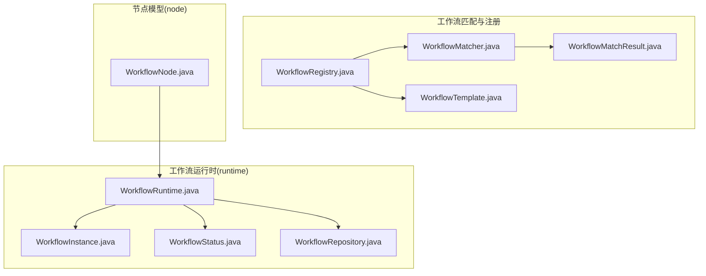
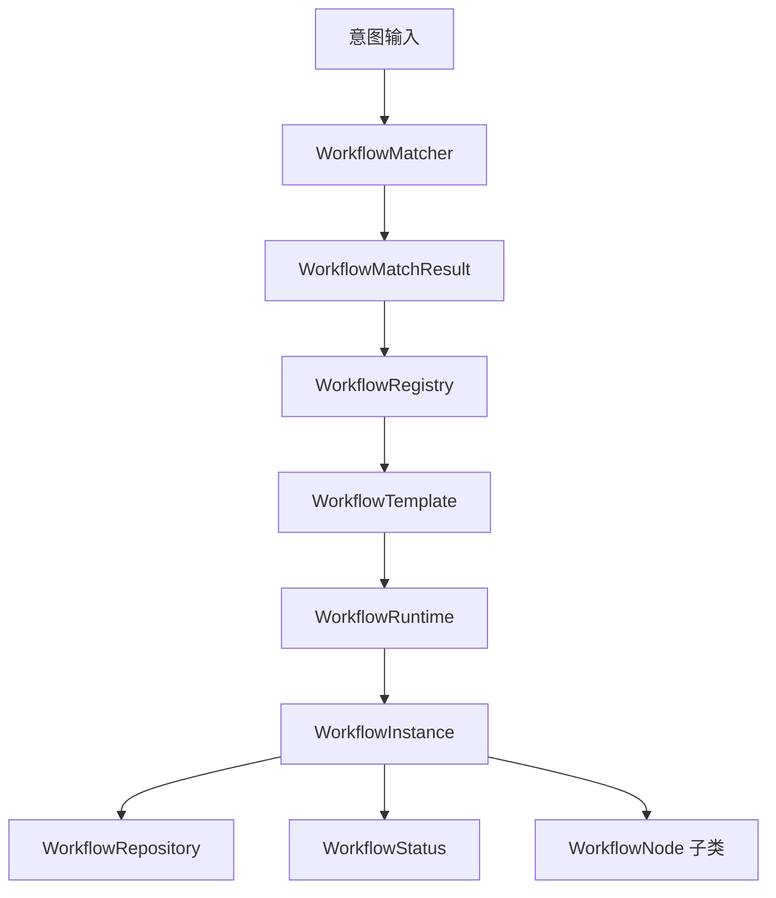
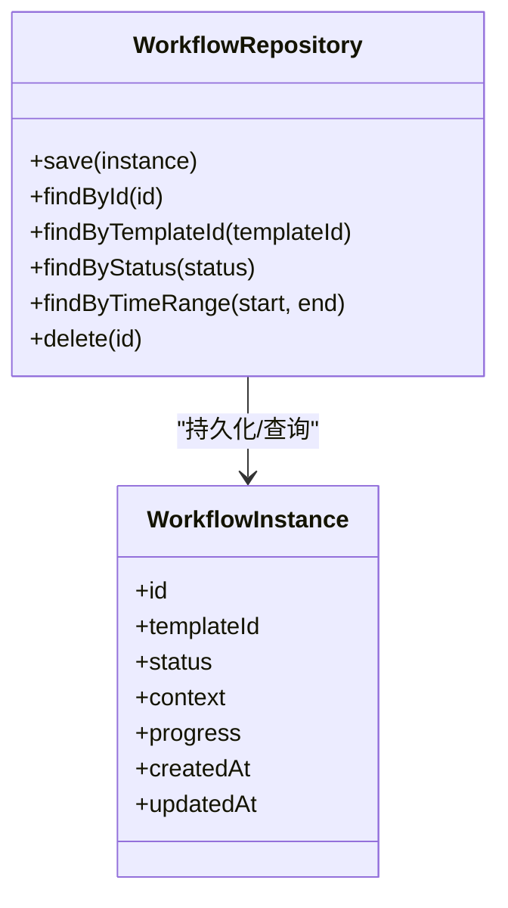
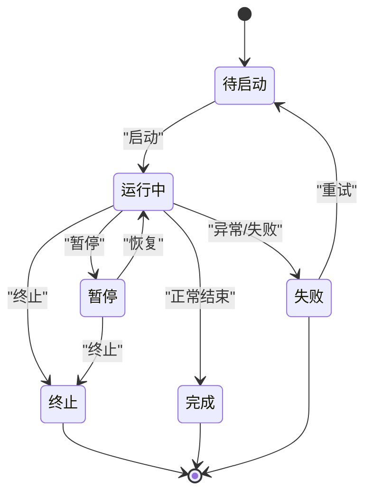
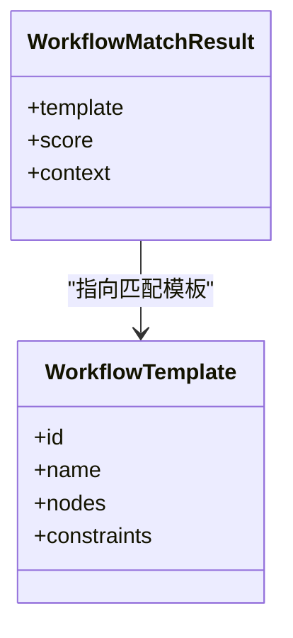
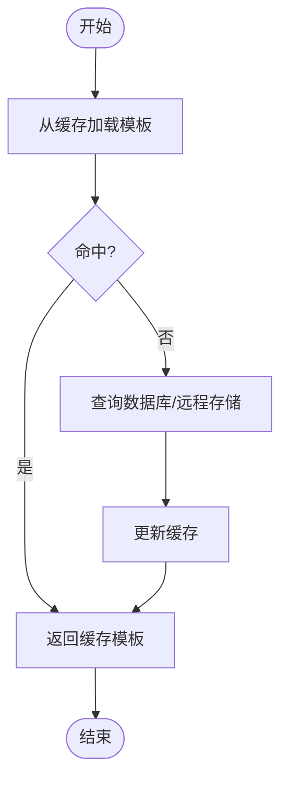
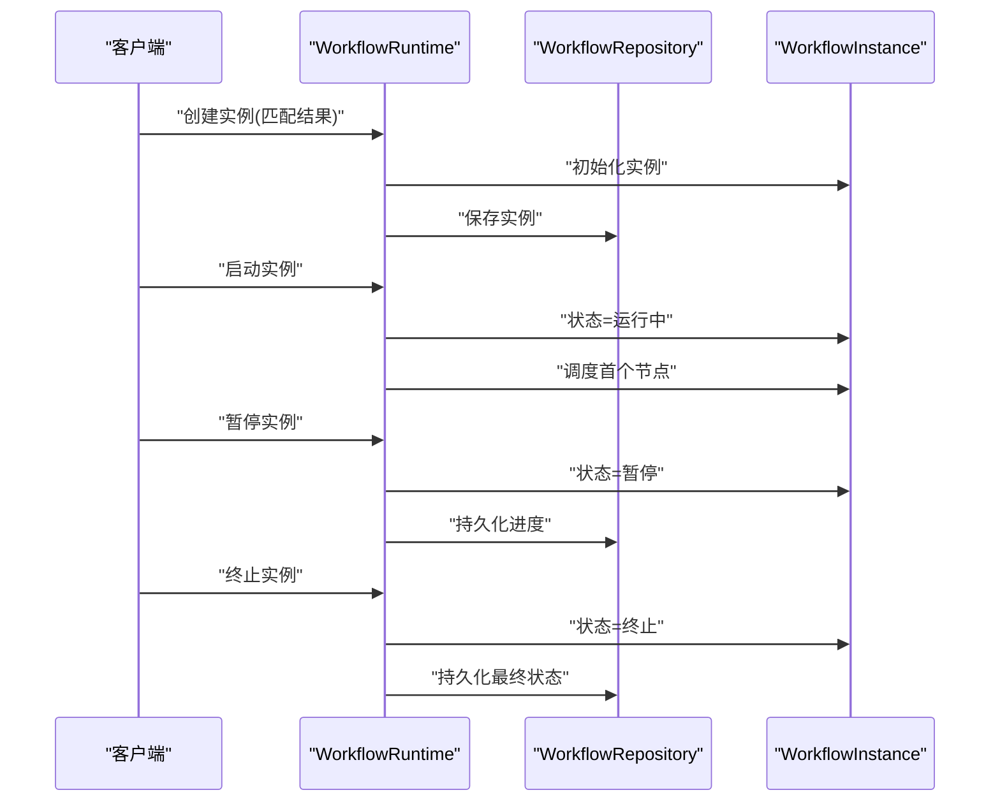
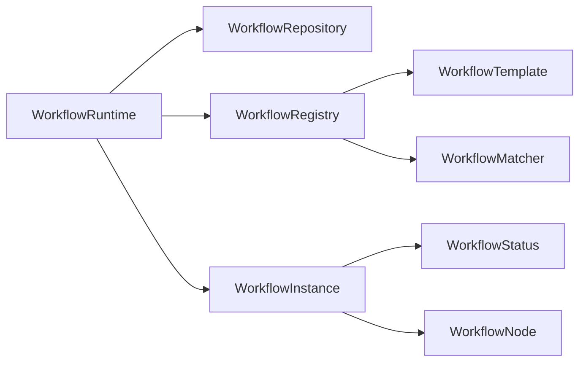

# 工作流运行时管理

<cite>
**本文引用的文件**
- [WorkflowRepository.java](file://src/main/java/com/yupi/yuaiagent/workflow/runtime/WorkflowRepository.java)
- [WorkflowRuntime.java](file://src/main/java/com/yupi/yuaiagent/workflow/runtime/WorkflowRuntime.java)
- [WorkflowStatus.java](file://src/main/java/com/yupi/yuaiagent/workflow/runtime/WorkflowStatus.java)
- [WorkflowInstance.java](file://src/main/java/com/yupi/yuaiagent/workflow/runtime/WorkflowInstance.java)
- [WorkflowRegistry.java](file://src/main/java/com/yupi/yuaiagent/workflow/WorkflowRegistry.java)
- [WorkflowMatchResult.java](file://src/main/java/com/yupi/yuaiagent/workflow/WorkflowMatchResult.java)
- [WorkflowMatcher.java](file://src/main/java/com/yupi/yuaiagent/workflow/WorkflowMatcher.java)
- [WorkflowTemplate.java](file://src/main/java/com/yupi/yuaiagent/workflow/WorkflowTemplate.java)
- [WorkflowNode.java](file://src/main/java/com/yupi/yuaiagent/workflow/node/WorkflowNode.java)
- [application.yml](file://src/main/resources/application.yml)
- [application-prod.yml](file://src/main/resources/application-prod.yml)
- [WorkflowRuntimeTest.java](file://src/test/java/com/yupi/yuaiagent/AiAgentApplicationTests.java)
</cite>

## 目录
1. [简介](#简介)
2. [项目结构](#项目结构)
3. [核心组件](#核心组件)
4. [架构总览](#架构总览)
5. [详细组件分析](#详细组件分析)
6. [依赖关系分析](#依赖关系分析)
7. [性能考虑](#性能考虑)
8. [故障排查指南](#故障排查指南)
9. [结论](#结论)
10. [附录](#附录)

## 简介
本技术文档围绕工作流运行时管理系统展开，重点覆盖以下方面：
- WorkflowRepository 的数据存储与查询机制
- WorkflowStatus 的状态枚举与状态转换规则
- WorkflowMatchResult 的匹配结果结构与评估标准
- WorkflowRegistry 的注册表管理、缓存策略与查找算法
- 工作流实例的创建、启动、暂停与终止流程
- 工作流状态的持久化方案、恢复机制与一致性保证
- 工作流监控的指标采集、告警机制与性能分析
- 工作流运行时的配置选项与调优参数
- 面向开发者的实现与维护指南

## 项目结构
工作流运行时相关代码位于 com.yupi.yuaiagent.workflow 包下，主要分为两层：
- runtime：运行时核心（实例、仓库、状态、运行器）
- node：节点模型（AgentNode、ApprovalNode、ConditionNode、LoopNode、ParallelNode、ToolNode、WorkflowNode）

**图表来源**
- [WorkflowRuntime.java:1-200](file://src/main/java/com/yupi/yuaiagent/workflow/runtime/WorkflowRuntime.java#L1-L200)
- [WorkflowRepository.java:1-200](file://src/main/java/com/yupi/yuaiagent/workflow/runtime/WorkflowRepository.java#L1-L200)
- [WorkflowStatus.java:1-120](file://src/main/java/com/yupi/yuaiagent/workflow/runtime/WorkflowStatus.java#L1-L120)
- [WorkflowInstance.java:1-200](file://src/main/java/com/yupi/yuaiagent/workflow/runtime/WorkflowInstance.java#L1-L200)
- [WorkflowRegistry.java:1-200](file://src/main/java/com/yupi/yuaiagent/workflow/WorkflowRegistry.java#L1-L200)
- [WorkflowMatchResult.java:1-120](file://src/main/java/com/yupi/yuaiagent/workflow/WorkflowMatchResult.java#L1-L120)
- [WorkflowMatcher.java:1-200](file://src/main/java/com/yupi/yuaiagent/workflow/WorkflowMatcher.java#L1-L200)
- [WorkflowTemplate.java:1-120](file://src/main/java/com/yupi/yuaiagent/workflow/WorkflowTemplate.java#L1-L120)
- [WorkflowNode.java:1-120](file://src/main/java/com/yupi/yuaiagent/workflow/node/WorkflowNode.java#L1-L120)

**章节来源**
- [WorkflowRuntime.java:1-200](file://src/main/java/com/yupi/yuaiagent/workflow/runtime/WorkflowRuntime.java#L1-L200)
- [WorkflowRepository.java:1-200](file://src/main/java/com/yupi/yuaiagent/workflow/runtime/WorkflowRepository.java#L1-L200)
- [WorkflowStatus.java:1-120](file://src/main/java/com/yupi/yuaiagent/workflow/runtime/WorkflowStatus.java#L1-L120)
- [WorkflowInstance.java:1-200](file://src/main/java/com/yupi/yuaiagent/workflow/runtime/WorkflowInstance.java#L1-L200)
- [WorkflowRegistry.java:1-200](file://src/main/java/com/yupi/yuaiagent/workflow/WorkflowRegistry.java#L1-L200)
- [WorkflowMatchResult.java:1-120](file://src/main/java/com/yupi/yuaiagent/workflow/WorkflowMatchResult.java#L1-L120)
- [WorkflowMatcher.java:1-200](file://src/main/java/com/yupi/yuaiagent/workflow/WorkflowMatcher.java#L1-L200)
- [WorkflowTemplate.java:1-120](file://src/main/java/com/yupi/yuaiagent/workflow/WorkflowTemplate.java#L1-L120)
- [WorkflowNode.java:1-120](file://src/main/java/com/yupi/yuaiagent/workflow/node/WorkflowNode.java#L1-L120)

## 核心组件
- 运行时控制：WorkflowRuntime 负责工作流实例的生命周期编排、状态推进与事件分发
- 实例模型：WorkflowInstance 描述单个工作流实例的元数据、当前节点、上下文与状态
- 状态机：WorkflowStatus 定义状态枚举与状态转换规则
- 数据访问：WorkflowRepository 提供实例的持久化、查询与事务性操作
- 注册与匹配：WorkflowRegistry 维护模板与匹配器；WorkflowMatcher 执行意图到模板的匹配
- 节点模型：WorkflowNode 及其子类定义可执行节点类型与执行语义

**章节来源**
- [WorkflowRuntime.java:1-200](file://src/main/java/com/yupi/yuaiagent/workflow/runtime/WorkflowRuntime.java#L1-L200)
- [WorkflowInstance.java:1-200](file://src/main/java/com/yupi/yuaiagent/workflow/runtime/WorkflowInstance.java#L1-L200)
- [WorkflowStatus.java:1-120](file://src/main/java/com/yupi/yuaiagent/workflow/runtime/WorkflowStatus.java#L1-L120)
- [WorkflowRepository.java:1-200](file://src/main/java/com/yupi/yuaiagent/workflow/runtime/WorkflowRepository.java#L1-L200)
- [WorkflowRegistry.java:1-200](file://src/main/java/com/yupi/yuaiagent/workflow/WorkflowRegistry.java#L1-L200)
- [WorkflowMatcher.java:1-200](file://src/main/java/com/yupi/yuaiagent/workflow/WorkflowMatcher.java#L1-L200)
- [WorkflowNode.java:1-120](file://src/main/java/com/yupi/yuaiagent/workflow/node/WorkflowNode.java#L1-L120)

## 架构总览
工作流运行时采用“模板驱动 + 实例运行”的架构模式：
- WorkflowTemplate 定义可复用的工作流蓝图
- WorkflowRegistry 管理模板与匹配器，支持按意图/标签/条件检索
- WorkflowMatcher 基于输入意图与模板进行匹配，输出 WorkflowMatchResult
- WorkflowRuntime 基于匹配结果创建/加载 WorkflowInstance，驱动节点执行
- WorkflowRepository 负责实例的持久化与查询
- WorkflowStatus 管理实例状态机，确保状态转换的正确性与一致性

**图表来源**
- [WorkflowMatcher.java:1-200](file://src/main/java/com/yupi/yuaiagent/workflow/WorkflowMatcher.java#L1-L200)
- [WorkflowMatchResult.java:1-120](file://src/main/java/com/yupi/yuaiagent/workflow/WorkflowMatchResult.java#L1-L120)
- [WorkflowRegistry.java:1-200](file://src/main/java/com/yupi/yuaiagent/workflow/WorkflowRegistry.java#L1-L200)
- [WorkflowTemplate.java:1-120](file://src/main/java/com/yupi/yuaiagent/workflow/WorkflowTemplate.java#L1-L120)
- [WorkflowRuntime.java:1-200](file://src/main/java/com/yupi/yuaiagent/workflow/runtime/WorkflowRuntime.java#L1-L200)
- [WorkflowInstance.java:1-200](file://src/main/java/com/yupi/yuaiagent/workflow/runtime/WorkflowInstance.java#L1-L200)
- [WorkflowRepository.java:1-200](file://src/main/java/com/yupi/yuaiagent/workflow/runtime/WorkflowRepository.java#L1-L200)
- [WorkflowStatus.java:1-120](file://src/main/java/com/yupi/yuaiagent/workflow/runtime/WorkflowStatus.java#L1-L120)
- [WorkflowNode.java:1-120](file://src/main/java/com/yupi/yuaiagent/workflow/node/WorkflowNode.java#L1-L120)

## 详细组件分析

### WorkflowRepository 数据存储与查询机制
- 职责
  - 实例持久化：保存/更新 WorkflowInstance，确保状态、上下文、节点进度等信息落盘
  - 查询接口：按实例ID、模板ID、状态、时间范围等维度检索实例
  - 事务与一致性：在多节点执行场景下，保证实例状态变更的原子性与可见性
- 关键能力
  - 原子写入：通过仓储层封装事务，避免并发写入导致的状态不一致
  - 分页与过滤：支持按模板ID、状态、创建/更新时间等字段分页查询
  - 快照与增量：对长链路实例可采用快照+增量日志的方式降低存储压力
- 设计要点
  - 使用唯一索引保障实例ID与模板ID组合的唯一性
  - 对高频查询字段建立二级索引（如状态、模板ID、创建时间）
  - 支持软删除标记，便于审计与回溯

**图表来源**
- [WorkflowRepository.java:1-200](file://src/main/java/com/yupi/yuaiagent/workflow/runtime/WorkflowRepository.java#L1-L200)
- [WorkflowInstance.java:1-200](file://src/main/java/com/yupi/yuaiagent/workflow/runtime/WorkflowInstance.java#L1-L200)

**章节来源**
- [WorkflowRepository.java:1-200](file://src/main/java/com/yupi/yuaiagent/workflow/runtime/WorkflowRepository.java#L1-L200)
- [WorkflowInstance.java:1-200](file://src/main/java/com/yupi/yuaiagent/workflow/runtime/WorkflowInstance.java#L1-L200)

### WorkflowStatus 状态枚举与状态转换规则
- 状态枚举
  - 待启动、运行中、暂停、完成、失败、终止
- 转换规则
  - 初始：待启动 → 启动请求触发 → 运行中
  - 运行中 → 节点执行成功 → 运行中（推进进度）
  - 运行中 → 显式暂停 → 暂停
  - 暂停 → 恢复 → 运行中
  - 运行中 → 异常/失败 → 失败
  - 运行中/暂停 → 终止请求 → 终止
  - 失败/终止 → 可选重试/撤销 → 待启动或完成
- 并发安全
  - 状态转换需基于版本号或CAS校验，防止竞态覆盖
  - 转换前后的副作用（如资源释放、通知发送）需幂等处理

**图表来源**
- [WorkflowStatus.java:1-120](file://src/main/java/com/yupi/yuaiagent/workflow/runtime/WorkflowStatus.java#L1-L120)

**章节来源**
- [WorkflowStatus.java:1-120](file://src/main/java/com/yupi/yuaiagent/workflow/runtime/WorkflowStatus.java#L1-L120)

### WorkflowMatchResult 匹配结果结构与评估标准
- 结构组成
  - 匹配模板：命中的目标 WorkflowTemplate
  - 匹配度评分：基于意图相似度、标签匹配度、约束条件满足度计算
  - 匹配上下文：用于后续实例初始化的参数映射
- 评估标准
  - 语义相似度：使用嵌入或关键词匹配计算意图相似度
  - 结构约束：模板的前置条件、并行/串行约束是否满足
  - 权重分配：不同维度的权重可配置，支持动态调整
- 输出用途
  - 作为 WorkflowRuntime 创建实例的输入依据
  - 用于统计与审计（匹配率、平均评分、Top-N模板）

**图表来源**
- [WorkflowMatchResult.java:1-120](file://src/main/java/com/yupi/yuaiagent/workflow/WorkflowMatchResult.java#L1-L120)
- [WorkflowTemplate.java:1-120](file://src/main/java/com/yupi/yuaiagent/workflow/WorkflowTemplate.java#L1-L120)

**章节来源**
- [WorkflowMatchResult.java:1-120](file://src/main/java/com/yupi/yuaiagent/workflow/WorkflowMatchResult.java#L1-L120)
- [WorkflowTemplate.java:1-120](file://src/main/java/com/yupi/yuaiagent/workflow/WorkflowTemplate.java#L1-L120)

### WorkflowRegistry 注册表管理、缓存策略与查找算法
- 注册表职责
  - 模板注册与注销：维护模板的生命周期与版本
  - 缓存策略：内存缓存热点模板，定期刷新与淘汰
  - 查找算法：支持按名称、标签、意图、ID等多维检索
- 缓存设计
  - LRU/LFU 缓存：热点模板优先驻留，冷门模板定期淘汰
  - 双层缓存：本地缓存 + 远程缓存（Redis/Memcached），提升查询性能
  - 缓存失效：基于模板版本号或时间戳的失效策略
- 查找算法
  - 前缀/模糊匹配：支持名称与标签的快速检索
  - 条件过滤：结合模板约束与可用性状态进行二次筛选
  - 排序与分页：按匹配度、创建时间、热度排序

**图表来源**
- [WorkflowRegistry.java:1-200](file://src/main/java/com/yupi/yuaiagent/workflow/WorkflowRegistry.java#L1-L200)

**章节来源**
- [WorkflowRegistry.java:1-200](file://src/main/java/com/yupi/yuaiagent/workflow/WorkflowRegistry.java#L1-L200)

### 工作流实例的创建、启动、暂停与终止流程
- 创建
  - 输入：WorkflowMatchResult + 初始化参数
  - 步骤：解析模板、构建实例上下文、设置初始状态为“待启动”
- 启动
  - 触发：WorkflowRuntime 接收启动指令
  - 行为：切换状态为“运行中”，调度首个节点执行
- 暂停
  - 触发：外部请求或节点信号
  - 行为：持久化当前进度，停止调度，等待恢复
- 终止
  - 触发：异常、超时或用户强制终止
  - 行为：清理资源、持久化最终状态、发出终止事件

**图表来源**
- [WorkflowRuntime.java:1-200](file://src/main/java/com/yupi/yuaiagent/workflow/runtime/WorkflowRuntime.java#L1-L200)
- [WorkflowRepository.java:1-200](file://src/main/java/com/yupi/yuaiagent/workflow/runtime/WorkflowRepository.java#L1-L200)
- [WorkflowInstance.java:1-200](file://src/main/java/com/yupi/yuaiagent/workflow/runtime/WorkflowInstance.java#L1-L200)

**章节来源**
- [WorkflowRuntime.java:1-200](file://src/main/java/com/yupi/yuaiagent/workflow/runtime/WorkflowRuntime.java#L1-L200)
- [WorkflowRepository.java:1-200](file://src/main/java/com/yupi/yuaiagent/workflow/runtime/WorkflowRepository.java#L1-L200)
- [WorkflowInstance.java:1-200](file://src/main/java/com/yupi/yuaiagent/workflow/runtime/WorkflowInstance.java#L1-L200)

### 工作流状态的持久化方案、恢复机制与一致性保证
- 持久化方案
  - 关系型数据库：适合强一致场景，支持事务与复杂查询
  - 文档数据库：适合非结构化上下文与历史轨迹
  - 混合存储：关键状态写入关系型，日志与快照写入对象存储
- 恢复机制
  - 断点续跑：从最近一次持久化的节点继续执行
  - 回滚策略：失败时回滚到上一个稳定状态
  - 快照恢复：周期性生成快照，缩短恢复时间
- 一致性保证
  - 版本号/CAS：状态转换基于版本号校验
  - 事件溯源：记录状态变更事件，支持审计与重放
  - 两阶段提交：跨服务场景下的分布式一致性

**章节来源**
- [WorkflowRepository.java:1-200](file://src/main/java/com/yupi/yuaiagent/workflow/runtime/WorkflowRepository.java#L1-L200)
- [WorkflowInstance.java:1-200](file://src/main/java/com/yupi/yuaiagent/workflow/runtime/WorkflowInstance.java#L1-L200)
- [WorkflowStatus.java:1-120](file://src/main/java/com/yupi/yuaiagent/workflow/runtime/WorkflowStatus.java#L1-L120)

### 工作流监控的指标收集、告警机制与性能分析
- 指标收集
  - 实例级：启动耗时、执行时长、失败率、重试次数
  - 节点级：节点执行时延、吞吐量、错误分布
  - 系统级：数据库延迟、缓存命中率、线程池饱和度
- 告警机制
  - 阈值告警：失败率、平均时延超过阈值触发
  - 异常检测：异常堆栈、慢查询、资源瓶颈
  - 通知渠道：邮件、IM、电话分级告警
- 性能分析
  - 热点路径：定位长尾节点与慢查询
  - 资源画像：CPU、内存、IO、网络占用趋势
  - A/B对比：新模板/新节点的性能影响评估

**章节来源**
- [WorkflowRuntime.java:1-200](file://src/main/java/com/yupi/yuaiagent/workflow/runtime/WorkflowRuntime.java#L1-L200)
- [WorkflowRepository.java:1-200](file://src/main/java/com/yupi/yuaiagent/workflow/runtime/WorkflowRepository.java#L1-L200)

### 工作流运行时的配置选项与调优参数
- 运行时参数
  - 最大并发：限制同时运行的实例数
  - 节点超时：单节点最大执行时间
  - 重试策略：失败重试次数与退避间隔
  - 日志级别：调试/生产环境的日志粒度
- 存储参数
  - 缓存容量：模板与实例的缓存大小
  - 刷新周期：缓存与数据库的同步频率
  - 索引策略：针对查询字段建立合适索引
- 网络与序列化
  - 序列化协议：JSON/Protobuf/Avro
  - 超时与重试：RPC/HTTP 调用的超时与重试
- 配置文件
  - application.yml：通用配置
  - application-prod.yml：生产环境增强配置

**章节来源**
- [application.yml:1-200](file://src/main/resources/application.yml#L1-L200)
- [application-prod.yml:1-200](file://src/main/resources/application-prod.yml#L1-L200)

## 依赖关系分析
- 组件耦合
  - WorkflowRuntime 依赖 WorkflowRepository 与 WorkflowRegistry
  - WorkflowInstance 依赖 WorkflowStatus 与 WorkflowNode
  - WorkflowRegistry 依赖 WorkflowTemplate 与 WorkflowMatcher
- 外部依赖
  - 数据库驱动与连接池
  - 缓存客户端（Redis/Memcached）
  - 序列化与网络框架
- 循环依赖规避
  - 通过接口抽象与分层解耦，避免直接循环引用

**图表来源**
- [WorkflowRuntime.java:1-200](file://src/main/java/com/yupi/yuaiagent/workflow/runtime/WorkflowRuntime.java#L1-L200)
- [WorkflowRepository.java:1-200](file://src/main/java/com/yupi/yuaiagent/workflow/runtime/WorkflowRepository.java#L1-L200)
- [WorkflowRegistry.java:1-200](file://src/main/java/com/yupi/yuaiagent/workflow/WorkflowRegistry.java#L1-L200)
- [WorkflowTemplate.java:1-120](file://src/main/java/com/yupi/yuaiagent/workflow/WorkflowTemplate.java#L1-L120)
- [WorkflowMatcher.java:1-200](file://src/main/java/com/yupi/yuaiagent/workflow/WorkflowMatcher.java#L1-L200)
- [WorkflowInstance.java:1-200](file://src/main/java/com/yupi/yuaiagent/workflow/runtime/WorkflowInstance.java#L1-L200)
- [WorkflowStatus.java:1-120](file://src/main/java/com/yupi/yuaiagent/workflow/runtime/WorkflowStatus.java#L1-L120)
- [WorkflowNode.java:1-120](file://src/main/java/com/yupi/yuaiagent/workflow/node/WorkflowNode.java#L1-L120)

**章节来源**
- [WorkflowRuntime.java:1-200](file://src/main/java/com/yupi/yuaiagent/workflow/runtime/WorkflowRuntime.java#L1-L200)
- [WorkflowRepository.java:1-200](file://src/main/java/com/yupi/yuaiagent/workflow/runtime/WorkflowRepository.java#L1-L200)
- [WorkflowRegistry.java:1-200](file://src/main/java/com/yupi/yuaiagent/workflow/WorkflowRegistry.java#L1-L200)
- [WorkflowTemplate.java:1-120](file://src/main/java/com/yupi/yuaiagent/workflow/WorkflowTemplate.java#L1-L120)
- [WorkflowMatcher.java:1-200](file://src/main/java/com/yupi/yuaiagent/workflow/WorkflowMatcher.java#L1-L200)
- [WorkflowInstance.java:1-200](file://src/main/java/com/yupi/yuaiagent/workflow/runtime/WorkflowInstance.java#L1-L200)
- [WorkflowStatus.java:1-120](file://src/main/java/com/yupi/yuaiagent/workflow/runtime/WorkflowStatus.java#L1-L120)
- [WorkflowNode.java:1-120](file://src/main/java/com/yupi/yuaiagent/workflow/node/WorkflowNode.java#L1-L120)

## 性能考虑
- 缓存优化
  - 热点模板与实例预热，减少冷启动开销
  - 多级缓存与失效策略，平衡一致性与性能
- 存储优化
  - 合理索引与分区，避免全表扫描
  - 写放大控制：批量写入、异步刷盘
- 并发优化
  - 无锁队列与CAS操作，降低锁竞争
  - 分片与限流，避免过载
- 监控与自适应
  - 基于指标的自适应限流与扩缩容
  - 动态参数调优：根据SLA自动调整超时与重试

## 故障排查指南
- 常见问题
  - 实例卡死：检查节点执行日志与资源占用
  - 状态不一致：核对版本号与事务边界
  - 匹配失败：验证意图解析与模板约束
- 排查步骤
  - 采集实例上下文与状态
  - 回放事件与慢查询
  - 对比历史版本与配置差异
- 修复建议
  - 临时降级与熔断
  - 快速回滚到稳定版本
  - 补丁发布与灰度验证

**章节来源**
- [WorkflowRuntime.java:1-200](file://src/main/java/com/yupi/yuaiagent/workflow/runtime/WorkflowRuntime.java#L1-L200)
- [WorkflowRepository.java:1-200](file://src/main/java/com/yupi/yuaiagent/workflow/runtime/WorkflowRepository.java#L1-L200)
- [WorkflowStatus.java:1-120](file://src/main/java/com/yupi/yuaiagent/workflow/runtime/WorkflowStatus.java#L1-L120)

## 结论
工作流运行时管理系统以模板驱动为核心，通过注册表与匹配器实现智能路由，借助运行时引擎与仓储层保障执行与持久化的一致性。配合完善的监控与告警体系，可在高并发场景下实现稳定、可观测、可维护的运行时管理。

## 附录
- 测试参考
  - 可参考应用测试入口，验证运行时行为与集成效果
- 配置示例
  - 在 application.yml 与 application-prod.yml 中查看运行时相关配置项

**章节来源**
- [WorkflowRuntimeTest.java:1-200](file://src/test/java/com/yupi/yuaiagent/AiAgentApplicationTests.java#L1-L200)
- [application.yml:1-200](file://src/main/resources/application.yml#L1-L200)
- [application-prod.yml:1-200](file://src/main/resources/application-prod.yml#L1-L200)