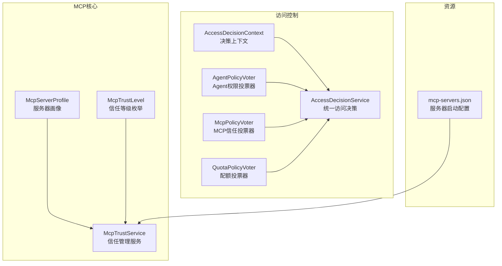
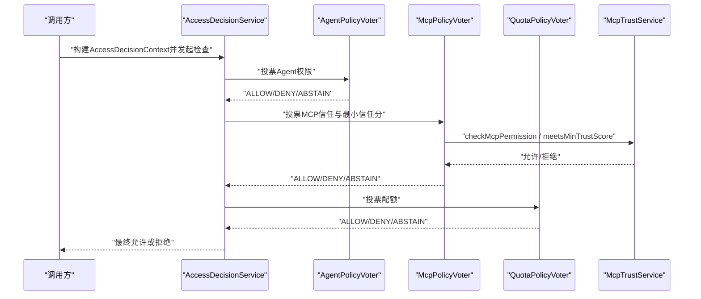
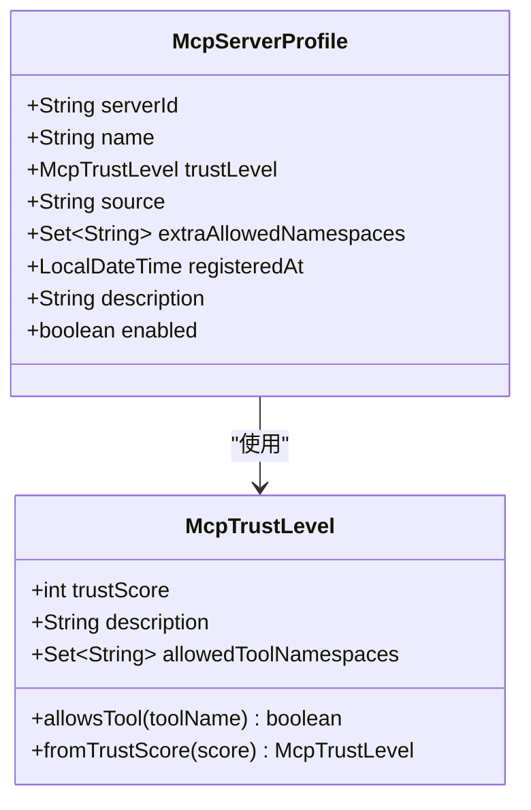
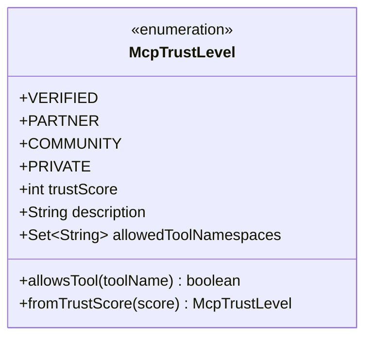
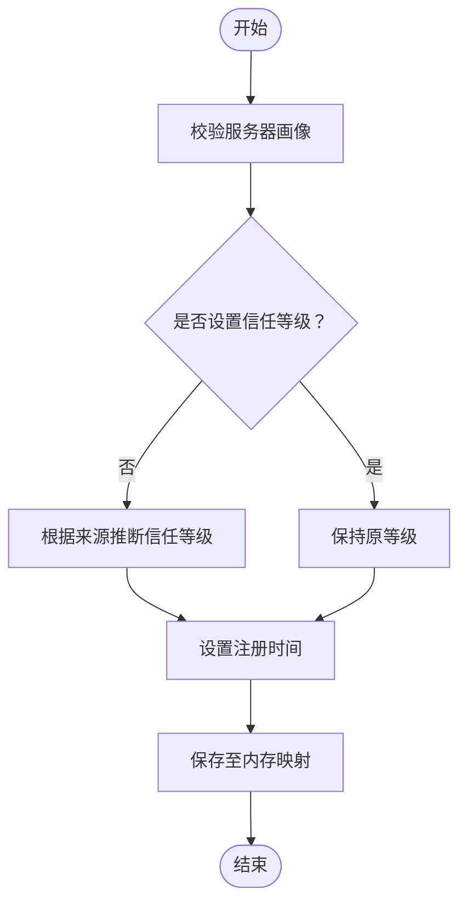
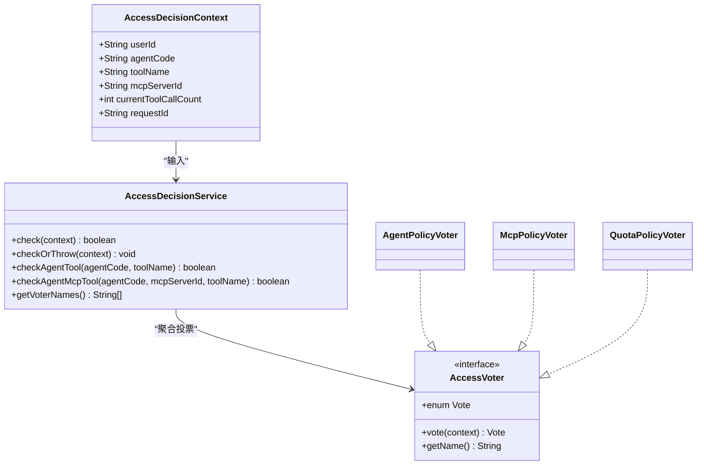
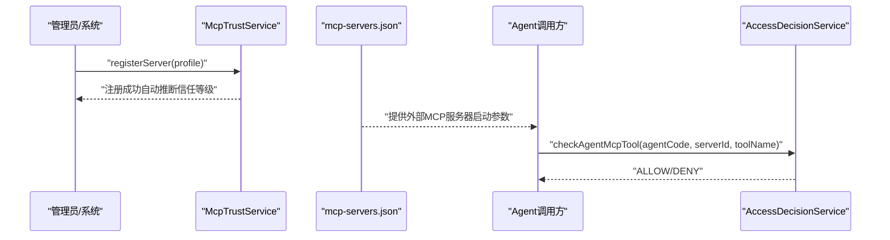
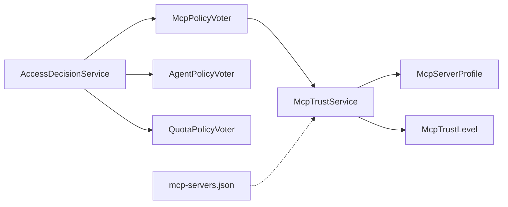

# MCP协议支持

<cite>
**本文引用的文件**
- [McpServerProfile.java](file://src/main/java/com/yupi/yuaiagent/mcp/McpServerProfile.java)
- [McpTrustLevel.java](file://src/main/java/com/yupi/yuaiagent/mcp/McpTrustLevel.java)
- [McpTrustService.java](file://src/main/java/com/yupi/yuaiagent/mcp/McpTrustService.java)
- [mcp-servers.json](file://src/main/resources/mcp-servers.json)
- [AccessDecisionService.java](file://src/main/java/com/yupi/yuaiagent/access/AccessDecisionService.java)
- [AccessDecisionContext.java](file://src/main/java/com/yupi/yuaiagent/access/AccessDecisionContext.java)
- [AccessVoter.java](file://src/main/java/com/yupi/yuaiagent/access/AccessVoter.java)
- [AgentPolicyVoter.java](file://src/main/java/com/yupi/yuaiagent/access/AgentPolicyVoter.java)
- [McpPolicyVoter.java](file://src/main/java/com/yupi/yuaiagent/access/McpPolicyVoter.java)
- [QuotaPolicyVoter.java](file://src/main/java/com/yupi/yuaiagent/access/QuotaPolicyVoter.java)
</cite>

## 目录
1. [简介](#简介)
2. [项目结构](#项目结构)
3. [核心组件](#核心组件)
4. [架构总览](#架构总览)
5. [详细组件分析](#详细组件分析)
6. [依赖关系分析](#依赖关系分析)
7. [性能考虑](#性能考虑)
8. [故障排除指南](#故障排除指南)
9. [结论](#结论)
10. [附录](#附录)

## 简介
本文件系统性阐述MCP（Model Context Protocol）协议在本项目中的实现与应用，重点围绕以下方面展开：
- MCP协议工作原理与通信机制概述
- 服务器配置管理：McpServerProfile
- 信任级别体系：McpTrustLevel
- 信任评估机制：McpTrustService
- MCP服务器注册、连接建立、消息传递与断开处理流程
- 信任级别分类标准、安全验证流程与访问控制策略
- MCP服务器部署配置、客户端集成与调试方法
- 实际使用示例与故障排除指南
- 面向开发者的完整实现与扩展开发指南

## 项目结构
MCP能力主要位于后端模块的mcp与access包中，并通过统一的访问决策服务进行整合。资源层提供mcp-servers.json用于描述外部MCP服务器的启动参数。

**图表来源**
- [McpServerProfile.java:1-65](file://src/main/java/com/yupi/yuaiagent/mcp/McpServerProfile.java#L1-L65)
- [McpTrustLevel.java:1-89](file://src/main/java/com/yupi/yuaiagent/mcp/McpTrustLevel.java#L1-L89)
- [McpTrustService.java:1-173](file://src/main/java/com/yupi/yuaiagent/mcp/McpTrustService.java#L1-L173)
- [AccessDecisionContext.java:1-48](file://src/main/java/com/yupi/yuaiagent/access/AccessDecisionContext.java#L1-L48)
- [AccessDecisionService.java:1-119](file://src/main/java/com/yupi/yuaiagent/access/AccessDecisionService.java#L1-L119)
- [AgentPolicyVoter.java:1-45](file://src/main/java/com/yupi/yuaiagent/access/AgentPolicyVoter.java#L1-L45)
- [McpPolicyVoter.java:1-59](file://src/main/java/com/yupi/yuaiagent/access/McpPolicyVoter.java#L1-L59)
- [QuotaPolicyVoter.java:1-43](file://src/main/java/com/yupi/yuaiagent/access/QuotaPolicyVoter.java#L1-L43)
- [mcp-servers.json:1-25](file://src/main/resources/mcp-servers.json#L1-L25)

**章节来源**
- [McpServerProfile.java:1-65](file://src/main/java/com/yupi/yuaiagent/mcp/McpServerProfile.java#L1-L65)
- [McpTrustLevel.java:1-89](file://src/main/java/com/yupi/yuaiagent/mcp/McpTrustLevel.java#L1-L89)
- [McpTrustService.java:1-173](file://src/main/java/com/yupi/yuaiagent/mcp/McpTrustService.java#L1-L173)
- [AccessDecisionService.java:1-119](file://src/main/java/com/yupi/yuaiagent/access/AccessDecisionService.java#L1-L119)
- [AccessDecisionContext.java:1-48](file://src/main/java/com/yupi/yuaiagent/access/AccessDecisionContext.java#L1-L48)
- [AccessVoter.java:1-37](file://src/main/java/com/yupi/yuaiagent/access/AccessVoter.java#L1-L37)
- [AgentPolicyVoter.java:1-45](file://src/main/java/com/yupi/yuaiagent/access/AgentPolicyVoter.java#L1-L45)
- [McpPolicyVoter.java:1-59](file://src/main/java/com/yupi/yuaiagent/access/McpPolicyVoter.java#L1-L59)
- [QuotaPolicyVoter.java:1-43](file://src/main/java/com/yupi/yuaiagent/access/QuotaPolicyVoter.java#L1-L43)
- [mcp-servers.json:1-25](file://src/main/resources/mcp-servers.json#L1-L25)

## 核心组件
- McpServerProfile：封装MCP服务器的身份信息、来源、信任等级、权限边界、启用状态与注册时间等元数据。
- McpTrustLevel：定义信任等级枚举及其允许的工具命名空间集合，提供基于信任分的等级映射与工具访问判断。
- McpTrustService：负责MCP服务器注册、来源推断、权限校验、信任分校验、动态调整与查询统计。

上述组件共同构成MCP信任与访问控制的基础数据模型与服务实现。

**章节来源**
- [McpServerProfile.java:11-64](file://src/main/java/com/yupi/yuaiagent/mcp/McpServerProfile.java#L11-L64)
- [McpTrustLevel.java:14-88](file://src/main/java/com/yupi/yuaiagent/mcp/McpTrustLevel.java#L14-L88)
- [McpTrustService.java:12-172](file://src/main/java/com/yupi/yuaiagent/mcp/McpTrustService.java#L12-L172)

## 架构总览
MCP访问控制采用“多维投票 + 统一决策”的模式：
- AccessDecisionContext承载一次工具调用的安全上下文
- AccessDecisionService聚合多个AccessVoter的投票结果，采用“一票否决”与“默认拒绝”
- AgentPolicyVoter：基于Agent权限配置判断
- McpPolicyVoter：基于MCP服务器画像与信任等级判断
- QuotaPolicyVoter：基于单次请求的调用次数限制判断

**图表来源**
- [AccessDecisionService.java:37-74](file://src/main/java/com/yupi/yuaiagent/access/AccessDecisionService.java#L37-L74)
- [AgentPolicyVoter.java:20-38](file://src/main/java/com/yupi/yuaiagent/access/AgentPolicyVoter.java#L20-L38)
- [McpPolicyVoter.java:24-53](file://src/main/java/com/yupi/yuaiagent/access/McpPolicyVoter.java#L24-L53)
- [QuotaPolicyVoter.java:20-36](file://src/main/java/com/yupi/yuaiagent/access/QuotaPolicyVoter.java#L20-L36)
- [McpTrustService.java:80-123](file://src/main/java/com/yupi/yuaiagent/mcp/McpTrustService.java#L80-L123)

## 详细组件分析

### McpServerProfile：服务器配置管理
- 关键字段
  - serverId：服务器唯一标识
  - name：服务器名称
  - trustLevel：信任等级（默认PRIVATE）
  - source：来源（OFFICIAL/THIRD_PARTY/USER_UPLOADED，默认USER_UPLOADED）
  - extraAllowedNamespaces：额外允许的工具命名空间（覆盖信任等级默认值）
  - registeredAt：注册时间
  - description：描述
  - enabled：是否启用（默认true）
- 设计要点
  - 使用建造者模式便于灵活装配
  - 默认值确保新注册服务器具备明确的初始状态
  - 支持额外命名空间覆盖，增强灵活性

**图表来源**
- [McpServerProfile.java:20-64](file://src/main/java/com/yupi/yuaiagent/mcp/McpServerProfile.java#L20-L64)
- [McpTrustLevel.java:14-56](file://src/main/java/com/yupi/yuaiagent/mcp/McpTrustLevel.java#L14-L56)

**章节来源**
- [McpServerProfile.java:11-64](file://src/main/java/com/yupi/yuaiagent/mcp/McpServerProfile.java#L11-L64)

### McpTrustLevel：信任级别体系
- 等级定义
  - VERIFIED（trustScore=100）：官方认证，允许全部工具
  - PARTNER（trustScore=70）：合作伙伴，允许data.*、web.*、rag.*
  - COMMUNITY（trustScore=30）：社区上传，仅允许public.*
  - PRIVATE（trustScore=0）：私有/未审核，禁止访问敏感工具
- 核心方法
  - allowsTool：判断工具命名空间是否被允许
  - fromTrustScore：按信任分向下取整映射到等级
- 设计要点
  - 通过通配符与前缀匹配实现灵活的命名空间授权
  - 与Agent权限独立，二者联合决策

**图表来源**
- [McpTrustLevel.java:14-88](file://src/main/java/com/yupi/yuaiagent/mcp/McpTrustLevel.java#L14-L88)

**章节来源**
- [McpTrustLevel.java:6-88](file://src/main/java/com/yupi/yuaiagent/mcp/McpTrustLevel.java#L6-L88)

### McpTrustService：信任评估机制
- 初始化与内置服务器
  - 启动时注册内置MCP服务器（如图片搜索、高德地图），赋予相应信任等级
- 注册流程
  - 校验serverId非空
  - 若未设置信任等级，则根据source推断（OFFICIAL→VERIFIED；THIRD_PARTY→PARTNER；COMMUNITY→COMMUNITY；其他→PRIVATE）
  - 设置注册时间并存入内存映射
- 权限校验
  - checkMcpPermission：先检查服务器是否存在且启用，再依据信任等级与额外命名空间判定
- 最小信任分校验
  - meetsMinTrustScore：结合Agent权限服务的最低信任分要求
- 动态调整与查询
  - updateTrustLevel：运行时调整信任等级
  - getServersByTrustLevel / getAllServers / getServer：查询统计能力

**图表来源**
- [McpTrustService.java:57-71](file://src/main/java/com/yupi/yuaiagent/mcp/McpTrustService.java#L57-L71)
- [McpTrustService.java:163-171](file://src/main/java/com/yupi/yuaiagent/mcp/McpTrustService.java#L163-L171)

**章节来源**
- [McpTrustService.java:30-52](file://src/main/java/com/yupi/yuaiagent/mcp/McpTrustService.java#L30-L52)
- [McpTrustService.java:57-71](file://src/main/java/com/yupi/yuaiagent/mcp/McpTrustService.java#L57-L71)
- [McpTrustService.java:80-123](file://src/main/java/com/yupi/yuaiagent/mcp/McpTrustService.java#L80-L123)
- [McpTrustService.java:128-135](file://src/main/java/com/yupi/yuaiagent/mcp/McpTrustService.java#L128-L135)
- [McpTrustService.java:140-158](file://src/main/java/com/yupi/yuaiagent/mcp/McpTrustService.java#L140-L158)
- [McpTrustService.java:163-171](file://src/main/java/com/yupi/yuaiagent/mcp/McpTrustService.java#L163-L171)

### 访问决策与投票器
- AccessDecisionContext：封装userId、agentCode、toolName、mcpServerId、当前调用次数、requestId等
- AccessDecisionService：统一决策，策略为“一票否决”，全部弃权则拒绝
- AccessVoter接口：定义投票结果（ALLOW/DENY/ABSTAIN）与投票方法
- 投票器实现
  - AgentPolicyVoter：基于Agent权限配置判断
  - McpPolicyVoter：基于McpTrustService的工具权限与最小信任分判断
  - QuotaPolicyVoter：基于单次请求调用次数限制判断

**图表来源**
- [AccessDecisionContext.java:13-47](file://src/main/java/com/yupi/yuaiagent/access/AccessDecisionContext.java#L13-L47)
- [AccessDecisionService.java:23-74](file://src/main/java/com/yupi/yuaiagent/access/AccessDecisionService.java#L23-L74)
- [AccessVoter.java:11-37](file://src/main/java/com/yupi/yuaiagent/access/AccessVoter.java#L11-L37)
- [AgentPolicyVoter.java:13-44](file://src/main/java/com/yupi/yuaiagent/access/AgentPolicyVoter.java#L13-L44)
- [McpPolicyVoter.java:16-59](file://src/main/java/com/yupi/yuaiagent/access/McpPolicyVoter.java#L16-L59)
- [QuotaPolicyVoter.java:13-42](file://src/main/java/com/yupi/yuaiagent/access/QuotaPolicyVoter.java#L13-L42)

**章节来源**
- [AccessDecisionContext.java:6-47](file://src/main/java/com/yupi/yuaiagent/access/AccessDecisionContext.java#L6-L47)
- [AccessDecisionService.java:12-74](file://src/main/java/com/yupi/yuaiagent/access/AccessDecisionService.java#L12-L74)
- [AccessVoter.java:3-37](file://src/main/java/com/yupi/yuaiagent/access/AccessVoter.java#L3-L37)
- [AgentPolicyVoter.java:8-44](file://src/main/java/com/yupi/yuaiagent/access/AgentPolicyVoter.java#L8-L44)
- [McpPolicyVoter.java:9-59](file://src/main/java/com/yupi/yuaiagent/access/McpPolicyVoter.java#L9-L59)
- [QuotaPolicyVoter.java:8-42](file://src/main/java/com/yupi/yuaiagent/access/QuotaPolicyVoter.java#L8-L42)

### MCP服务器注册、连接与消息传递
- 注册与来源推断
  - 通过McpTrustService.registerServer完成注册，若未显式设置trustLevel，则根据source自动推断
- 运行时配置
  - mcp-servers.json提供外部MCP服务器的启动命令、参数与环境变量
- 连接建立与消息传递
  - 本项目通过McpTrustService与AccessDecisionService实现“先信任校验，再访问决策”的安全前置
  - 工具调用前由McpPolicyVoter与AgentPolicyVoter共同决定是否允许
- 断开处理
  - 未在代码中直接体现断开逻辑，通常由上层工具调用框架负责生命周期管理；本项目侧通过信任与权限控制保障调用阶段安全

**图表来源**
- [McpTrustService.java:57-71](file://src/main/java/com/yupi/yuaiagent/mcp/McpTrustService.java#L57-L71)
- [McpTrustService.java:163-171](file://src/main/java/com/yupi/yuaiagent/mcp/McpTrustService.java#L163-L171)
- [mcp-servers.json:1-25](file://src/main/resources/mcp-servers.json#L1-L25)
- [AccessDecisionService.java:102-108](file://src/main/java/com/yupi/yuaiagent/access/AccessDecisionService.java#L102-L108)

**章节来源**
- [McpTrustService.java:57-71](file://src/main/java/com/yupi/yuaiagent/mcp/McpTrustService.java#L57-L71)
- [McpTrustService.java:163-171](file://src/main/java/com/yupi/yuaiagent/mcp/McpTrustService.java#L163-L171)
- [mcp-servers.json:1-25](file://src/main/resources/mcp-servers.json#L1-L25)
- [AccessDecisionService.java:99-108](file://src/main/java/com/yupi/yuaiagent/access/AccessDecisionService.java#L99-L108)

## 依赖关系分析
- 组件耦合
  - McpTrustService依赖McpServerProfile与McpTrustLevel
  - McpPolicyVoter依赖McpTrustService与AgentPermissionService
  - AccessDecisionService聚合多个AccessVoter
- 外部依赖
  - mcp-servers.json作为资源配置，驱动外部MCP服务器进程启动
- 循环依赖
  - 未发现循环依赖，模块职责清晰

**图表来源**
- [McpTrustService.java:28-52](file://src/main/java/com/yupi/yuaiagent/mcp/McpTrustService.java#L28-L52)
- [McpServerProfile.java:20-64](file://src/main/java/com/yupi/yuaiagent/mcp/McpServerProfile.java#L20-L64)
- [McpTrustLevel.java:14-56](file://src/main/java/com/yupi/yuaiagent/mcp/McpTrustLevel.java#L14-L56)
- [McpPolicyVoter.java:21-22](file://src/main/java/com/yupi/yuaiagent/access/McpPolicyVoter.java#L21-L22)
- [AccessDecisionService.java:25-29](file://src/main/java/com/yupi/yuaiagent/access/AccessDecisionService.java#L25-L29)
- [mcp-servers.json:1-25](file://src/main/resources/mcp-servers.json#L1-L25)

**章节来源**
- [McpTrustService.java:28-52](file://src/main/java/com/yupi/yuaiagent/mcp/McpTrustService.java#L28-L52)
- [McpPolicyVoter.java:21-22](file://src/main/java/com/yupi/yuaiagent/access/McpPolicyVoter.java#L21-L22)
- [AccessDecisionService.java:25-29](file://src/main/java/com/yupi/yuaiagent/access/AccessDecisionService.java#L25-L29)
- [mcp-servers.json:1-25](file://src/main/resources/mcp-servers.json#L1-L25)

## 性能考虑
- 内存存储：McpTrustService使用并发Map存储服务器画像，适合中低规模服务器数量
- 查询路径：checkMcpPermission与meetsMinTrustScore均为O(1)查找，额外命名空间匹配为线性遍历
- 日志开销：建议在生产环境适当降低日志级别，避免频繁的允许/拒绝日志输出影响性能
- 扩展建议：若服务器规模扩大，可引入缓存与持久化存储，配合定期同步策略

## 故障排除指南
- 现象：工具调用被拒绝
  - 排查步骤
    - 检查McpServerProfile是否已注册且enabled为true
    - 核对工具命名空间是否在信任等级允许范围内，或是否在extraAllowedNamespaces中
    - 确认Agent的最低信任分要求是否满足
  - 相关日志位置
    - McpTrustService.checkMcpPermission与McpPolicyVoter的警告日志
- 现象：未知服务器ID
  - 排查步骤
    - 确认serverId拼写正确，已在McpTrustService中注册
- 现象：来源推断不符合预期
  - 排查步骤
    - 检查McpServerProfile.source字段是否为OFFICIAL/THIRD_PARTY/COMMUNITY之一
- 现象：mcp-servers.json配置无效
  - 排查步骤
    - 确认命令、参数与环境变量正确，外部MCP服务器进程可正常启动

**章节来源**
- [McpTrustService.java:80-112](file://src/main/java/com/yupi/yuaiagent/mcp/McpTrustService.java#L80-L112)
- [McpPolicyVoter.java:34-49](file://src/main/java/com/yupi/yuaiagent/access/McpPolicyVoter.java#L34-L49)
- [mcp-servers.json:1-25](file://src/main/resources/mcp-servers.json#L1-L25)

## 结论
本项目以McpServerProfile、McpTrustLevel与McpTrustService为核心，结合AccessDecisionService与多维投票器，构建了完整的MCP信任与访问控制体系。通过“来源推断+信任等级+额外命名空间+最小信任分”的组合策略，既保证了安全性，又提供了灵活的扩展能力。配合mcp-servers.json的外部服务器配置，可实现MCP服务器的注册、连接与安全调用闭环。

## 附录

### MCP服务器部署配置
- 内置服务器
  - 图片搜索MCP：OFFICIAL来源，VERIFIED信任等级
  - 高德地图MCP：THIRD_PARTY来源，PARTNER信任等级
- 外部服务器
  - 在mcp-servers.json中配置命令、参数与环境变量，驱动外部MCP服务器进程启动

**章节来源**
- [McpTrustService.java:30-52](file://src/main/java/com/yupi/yuaiagent/mcp/McpTrustService.java#L30-L52)
- [mcp-servers.json:1-25](file://src/main/resources/mcp-servers.json#L1-L25)

### 客户端集成与调试
- 集成步骤
  - 通过AccessDecisionService.checkAgentMcpTool进行权限校验
  - 若需要抛异常形式的拒绝，使用checkOrThrow
- 调试建议
  - 查看AccessDecisionService与各投票器的日志输出
  - 使用getVoterNames获取已注册投票器列表核对配置

**章节来源**
- [AccessDecisionService.java:79-118](file://src/main/java/com/yupi/yuaiagent/access/AccessDecisionService.java#L79-L118)

### 实际使用示例（步骤说明）
- 示例A：Agent调用MCP工具
  - 步骤
    - 构造AccessDecisionContext（包含agentCode、mcpServerId、toolName）
    - 调用AccessDecisionService.checkAgentMcpTool
    - 若返回true，继续执行工具调用；否则记录拒绝原因
- 示例B：动态调整服务器信任等级
  - 步骤
    - 调用McpTrustService.updateTrustLevel(serverId, newLevel)
    - 观察日志确认变更生效

**章节来源**
- [AccessDecisionService.java:99-108](file://src/main/java/com/yupi/yuaiagent/access/AccessDecisionService.java#L99-L108)
- [McpTrustService.java:128-135](file://src/main/java/com/yupi/yuaiagent/mcp/McpTrustService.java#L128-L135)