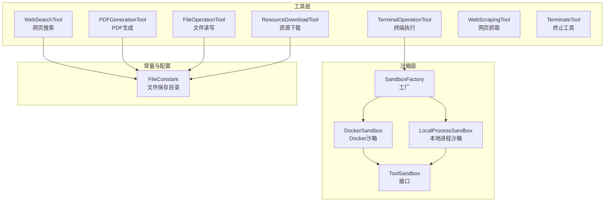
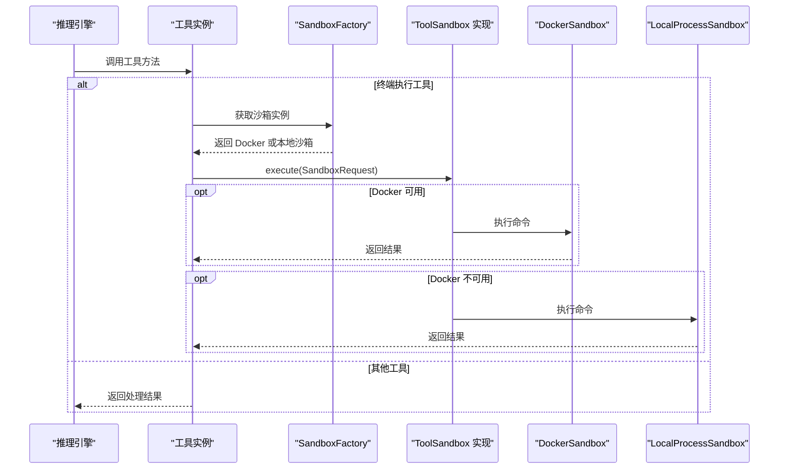
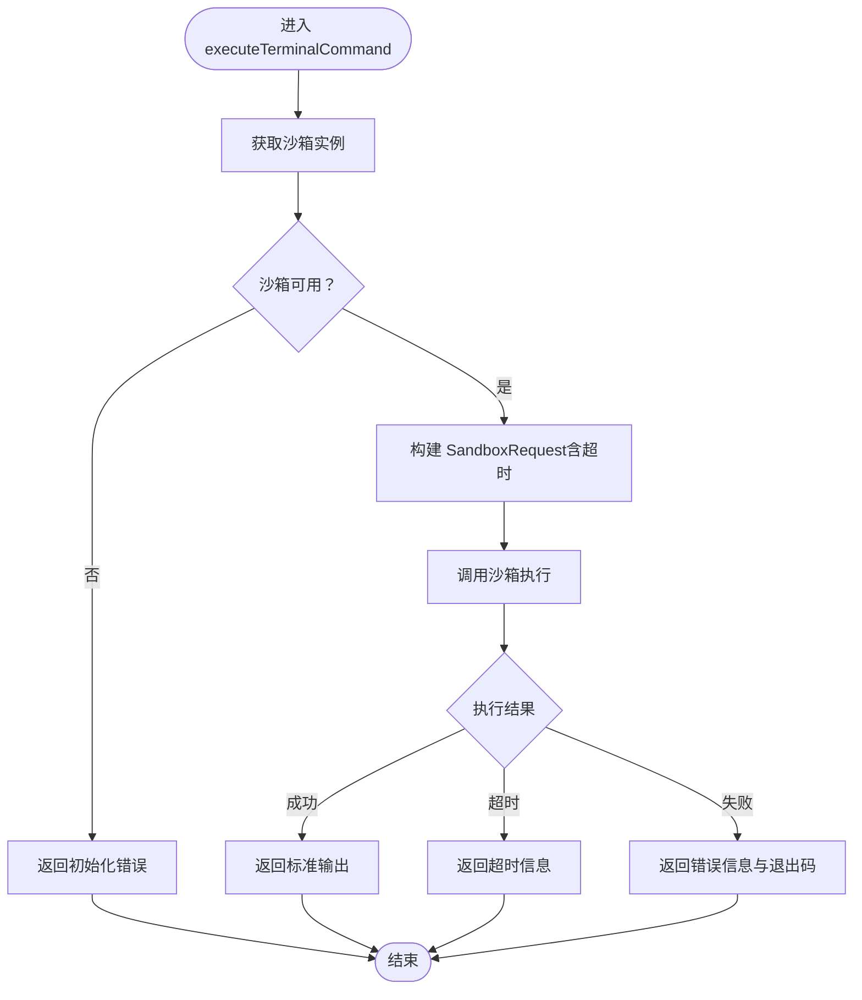
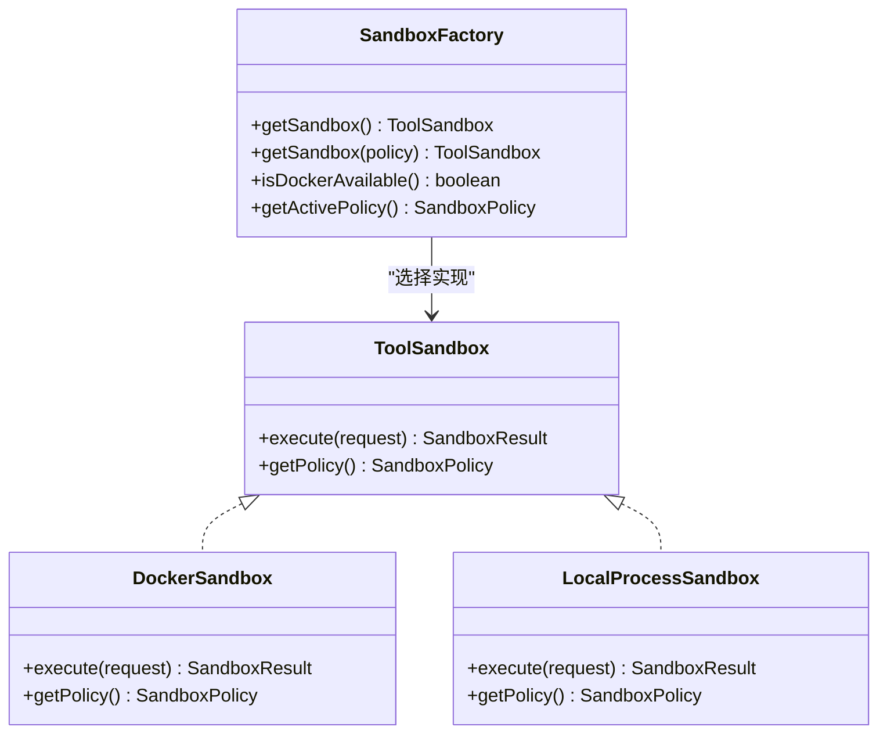

# 内置工具实现

<cite>
**本文引用的文件**
- [WebSearchTool.java](file://src/main/java/com/yupi/yuaiagent/tools/WebSearchTool.java)
- [PDFGenerationTool.java](file://src/main/java/com/yupi/yuaiagent/tools/PDFGenerationTool.java)
- [TerminalOperationTool.java](file://src/main/java/com/yupi/yuaiagent/tools/TerminalOperationTool.java)
- [FileOperationTool.java](file://src/main/java/com/yupi/yuaiagent/tools/FileOperationTool.java)
- [ResourceDownloadTool.java](file://src/main/java/com/yupi/yuaiagent/tools/ResourceDownloadTool.java)
- [WebScrapingTool.java](file://src/main/java/com/yupi/yuaiagent/tools/WebScrapingTool.java)
- [TerminateTool.java](file://src/main/java/com/yupi/yuaiagent/tools/TerminateTool.java)
- [FileConstant.java](file://src/main/java/com/yupi/yuaiagent/constant/FileConstant.java)
- [SandboxFactory.java](file://src/main/java/com/yupi/yuaiagent/sandbox/SandboxFactory.java)
- [ToolSandbox.java](file://src/main/java/com/yupi/yuaiagent/sandbox/ToolSandbox.java)
- [DockerSandbox.java](file://src/main/java/com/yupi/yuaiagent/sandbox/DockerSandbox.java)
- [LocalProcessSandbox.java](file://src/main/java/com/yupi/yuaiagent/sandbox/LocalProcessSandbox.java)
- [WebSearchToolTest.java](file://src/test/java/com/yupi/yuaiagent/tools/WebSearchToolTest.java)
- [PDFGenerationToolTest.java](file://src/test/java/com/yupi/yuaiagent/tools/PDFGenerationToolTest.java)
- [TerminalOperationToolTest.java](file://src/test/java/com/yupi/yuaiagent/tools/TerminalOperationToolTest.java)
- [FileOperationToolTest.java](file://src/test/java/com/yupi/yuaiagent/tools/FileOperationToolTest.java)
- [ResourceDownloadToolTest.java](file://src/test/java/com/yupi/yuaiagent/tools/ResourceDownloadToolTest.java)
- [WebScrapingToolTest.java](file://src/test/java/com/yupi/yuaiagent/tools/WebScrapingToolTest.java)
</cite>

## 目录
1. [简介](#简介)
2. [项目结构](#项目结构)
3. [核心组件](#核心组件)
4. [架构总览](#架构总览)
5. [详细组件分析](#详细组件分析)
6. [依赖分析](#依赖分析)
7. [性能考虑](#性能考虑)
8. [故障排查指南](#故障排查指南)
9. [结论](#结论)
10. [附录](#附录)

## 简介
本文件面向开发者与高级用户，系统性解析内置工具的实现原理与使用方法，覆盖以下工具：
- WebSearchTool：基于第三方搜索服务的网页检索
- PDFGenerationTool：将类 Markdown 内容渲染为 PDF
- TerminalOperationTool：通过沙箱执行终端命令（安全隔离）
- FileOperationTool：受控的文件读写（路径穿越防护）
- ResourceDownloadTool：受控的资源下载（路径穿越防护）
- WebScrapingTool：网页正文文本抓取
- TerminateTool：用于终止对话流程的工具

文档将从架构设计、数据流、处理逻辑、异常处理、性能与安全限制等方面进行深入剖析，并提供参数说明、调用方式、返回值格式、最佳实践与扩展建议。

## 项目结构
内置工具集中位于 tools 包，配套的沙箱体系位于 sandbox 包，文件存储常量位于 constant 包。测试用例位于 test/java 对应包下。

图表来源
- [TerminalOperationTool.java:24-60](file://src/main/java/com/yupi/yuaiagent/tools/TerminalOperationTool.java#L24-L60)
- [SandboxFactory.java:22-115](file://src/main/java/com/yupi/yuaiagent/sandbox/SandboxFactory.java#L22-L115)
- [ToolSandbox.java:10-24](file://src/main/java/com/yupi/yuaiagent/sandbox/ToolSandbox.java#L10-L24)
- [DockerSandbox.java:28-255](file://src/main/java/com/yupi/yuaiagent/sandbox/DockerSandbox.java#L28-L255)
- [LocalProcessSandbox.java:32-320](file://src/main/java/com/yupi/yuaiagent/sandbox/LocalProcessSandbox.java#L32-L320)
- [FileConstant.java:6-12](file://src/main/java/com/yupi/yuaiagent/constant/FileConstant.java#L6-L12)

章节来源
- [WebSearchTool.java:15-54](file://src/main/java/com/yupi/yuaiagent/tools/WebSearchTool.java#L15-L54)
- [PDFGenerationTool.java:21-114](file://src/main/java/com/yupi/yuaiagent/tools/PDFGenerationTool.java#L21-L114)
- [TerminalOperationTool.java:13-60](file://src/main/java/com/yupi/yuaiagent/tools/TerminalOperationTool.java#L13-L60)
- [FileOperationTool.java:11-59](file://src/main/java/com/yupi/yuaiagent/tools/FileOperationTool.java#L11-L59)
- [ResourceDownloadTool.java:13-37](file://src/main/java/com/yupi/yuaiagent/tools/ResourceDownloadTool.java#L13-L37)
- [WebScrapingTool.java:8-26](file://src/main/java/com/yupi/yuaiagent/tools/WebScrapingTool.java#L8-L26)
- [TerminateTool.java:5-17](file://src/main/java/com/yupi/yuaiagent/tools/TerminateTool.java#L5-L17)
- [FileConstant.java:6-12](file://src/main/java/com/yupi/yuaiagent/constant/FileConstant.java#L6-L12)
- [SandboxFactory.java:10-115](file://src/main/java/com/yupi/yuaiagent/sandbox/SandboxFactory.java#L10-L115)
- [ToolSandbox.java:3-24](file://src/main/java/com/yupi/yuaiagent/sandbox/ToolSandbox.java#L3-L24)
- [DockerSandbox.java:15-255](file://src/main/java/com/yupi/yuaiagent/sandbox/DockerSandbox.java#L15-L255)
- [LocalProcessSandbox.java:16-320](file://src/main/java/com/yupi/yuaiagent/sandbox/LocalProcessSandbox.java#L16-L320)

## 核心组件
- WebSearchTool：封装第三方搜索 API，返回结构化的搜索结果摘要
- PDFGenerationTool：解析类 Markdown 文本并渲染为 PDF，支持标题、列表、分隔线与简单加粗
- TerminalOperationTool：通过沙箱执行命令，统一返回标准输出、错误信息与退出码
- FileOperationTool：提供受控的文件读写，严格校验路径穿越
- ResourceDownloadTool：下载资源到受控目录，严格校验文件名路径穿越
- WebScrapingTool：抓取网页正文文本，去除 HTML 标签与脚本噪声
- TerminateTool：返回固定提示语，用于流程终止

章节来源
- [WebSearchTool.java:15-54](file://src/main/java/com/yupi/yuaiagent/tools/WebSearchTool.java#L15-L54)
- [PDFGenerationTool.java:21-114](file://src/main/java/com/yupi/yuaiagent/tools/PDFGenerationTool.java#L21-L114)
- [TerminalOperationTool.java:13-60](file://src/main/java/com/yupi/yuaiagent/tools/TerminalOperationTool.java#L13-L60)
- [FileOperationTool.java:11-59](file://src/main/java/com/yupi/yuaiagent/tools/FileOperationTool.java#L11-L59)
- [ResourceDownloadTool.java:13-37](file://src/main/java/com/yupi/yuaiagent/tools/ResourceDownloadTool.java#L13-L37)
- [WebScrapingTool.java:8-26](file://src/main/java/com/yupi/yuaiagent/tools/WebScrapingTool.java#L8-L26)
- [TerminateTool.java:5-17](file://src/main/java/com/yupi/yuaiagent/tools/TerminateTool.java#L5-L17)

## 架构总览
内置工具通过注解暴露给 AI 推理引擎，终端执行工具通过沙箱工厂按环境自动选择 Docker 或本地进程沙箱，确保命令执行的安全与可控。

图表来源
- [TerminalOperationTool.java:33-59](file://src/main/java/com/yupi/yuaiagent/tools/TerminalOperationTool.java#L33-L59)
- [SandboxFactory.java:42-78](file://src/main/java/com/yupi/yuaiagent/sandbox/SandboxFactory.java#L42-L78)
- [DockerSandbox.java:49-132](file://src/main/java/com/yupi/yuaiagent/sandbox/DockerSandbox.java#L49-L132)
- [LocalProcessSandbox.java:77-155](file://src/main/java/com/yupi/yuaiagent/sandbox/LocalProcessSandbox.java#L77-L155)

## 详细组件分析

### WebSearchTool（网页搜索）
- 功能特性
  - 调用第三方搜索 API，返回前若干条搜索结果
  - 仅提取标题、摘要与链接，减少 token 噪音
- 参数与返回
  - 参数：查询关键词
  - 返回：格式化的文本结果
- 异常处理
  - 网络或解析异常时返回错误信息
- 性能与安全
  - 设置连接超时；限制返回条数
  - 依赖外部服务，需关注网络延迟与配额
- 最佳实践
  - 合理设置查询关键词，避免过于宽泛
  - 结合后续工具进行内容筛选与深度处理

章节来源
- [WebSearchTool.java:29-53](file://src/main/java/com/yupi/yuaiagent/tools/WebSearchTool.java#L29-L53)
- [WebSearchToolTest.java:16-22](file://src/test/java/com/yupi/yuaiagent/tools/WebSearchToolTest.java#L16-L22)

### PDFGenerationTool（PDF 生成）
- 功能特性
  - 将类 Markdown 内容渲染为 PDF，支持标题层级、无序/有序列表、分隔线与简单加粗
  - 输出文件保存在受控目录
- 参数与返回
  - 参数：文件名（不含扩展名）、Markdown 内容
  - 返回：文件生成状态与路径
- 异常处理
  - IO 异常时返回失败信息
- 性能与安全
  - 文本解析为线性扫描，复杂度 O(n)
  - 仅在本地生成 PDF，无外部依赖
- 最佳实践
  - 使用清晰的标题层级与列表结构
  - 控制内容长度以避免内存压力

章节来源
- [PDFGenerationTool.java:26-113](file://src/main/java/com/yupi/yuaiagent/tools/PDFGenerationTool.java#L26-L113)
- [PDFGenerationToolTest.java:9-16](file://src/test/java/com/yupi/yuaiagent/tools/PDFGenerationToolTest.java#L9-L16)
- [FileConstant.java](file://src/main/java/com/yupi/yuaiagent/constant/FileConstant.java#L11)

### TerminalOperationTool（终端执行）
- 功能特性
  - 通过沙箱执行任意命令，统一返回标准输出、错误信息与退出码
  - 支持超时控制与强制终止
- 参数与返回
  - 参数：待执行命令
  - 返回：根据执行结果返回不同信息
- 异常处理
  - 沙箱未初始化、超时、执行失败等场景均有明确分支
- 安全与隔离
  - 优先使用 Docker 沙箱；不可用时采用本地进程沙箱（仅限开发）
  - 本地沙箱实施命令白名单、工作目录隔离、输出截断与环境变量隔离
- 性能与资源
  - Docker 沙箱具备 CPU/内存/网络隔离与临时文件系统限制
  - 本地沙箱提供多层防护但隔离强度较低
- 最佳实践
  - 优先保证 Docker 可用，生产环境务必启用 Docker
  - 合理设置超时时间，避免长时间阻塞
  - 仅执行必要命令，避免高风险操作

图表来源
- [TerminalOperationTool.java:33-59](file://src/main/java/com/yupi/yuaiagent/tools/TerminalOperationTool.java#L33-L59)
- [SandboxFactory.java:42-78](file://src/main/java/com/yupi/yuaiagent/sandbox/SandboxFactory.java#L42-L78)
- [DockerSandbox.java:49-132](file://src/main/java/com/yupi/yuaiagent/sandbox/DockerSandbox.java#L49-L132)
- [LocalProcessSandbox.java:77-155](file://src/main/java/com/yupi/yuaiagent/sandbox/LocalProcessSandbox.java#L77-L155)

章节来源
- [TerminalOperationTool.java:13-60](file://src/main/java/com/yupi/yuaiagent/tools/TerminalOperationTool.java#L13-L60)
- [TerminalOperationToolTest.java:10-16](file://src/test/java/com/yupi/yuaiagent/tools/TerminalOperationToolTest.java#L10-L16)
- [SandboxFactory.java:10-115](file://src/main/java/com/yupi/yuaiagent/sandbox/SandboxFactory.java#L10-L115)
- [DockerSandbox.java:15-255](file://src/main/java/com/yupi/yuaiagent/sandbox/DockerSandbox.java#L15-L255)
- [LocalProcessSandbox.java:16-320](file://src/main/java/com/yupi/yuaiagent/sandbox/LocalProcessSandbox.java#L16-L320)

### FileOperationTool（文件读写）
- 功能特性
  - 读取/写入文件，严格校验文件名防止路径穿越
- 参数与返回
  - 读取：文件名
  - 写入：文件名、内容
  - 返回：操作结果或错误信息
- 安全限制
  - 规范化路径并校验是否位于受控目录之下
- 最佳实践
  - 仅使用受控目录内的文件名
  - 写入前确保目录存在

章节来源
- [FileOperationTool.java:19-58](file://src/main/java/com/yupi/yuaiagent/tools/FileOperationTool.java#L19-L58)
- [FileOperationToolTest.java:10-25](file://src/test/java/com/yupi/yuaiagent/tools/FileOperationToolTest.java#L10-L25)
- [FileConstant.java](file://src/main/java/com/yupi/yuaiagent/constant/FileConstant.java#L11)

### ResourceDownloadTool（资源下载）
- 功能特性
  - 从 URL 下载资源到受控目录，严格校验文件名
- 参数与返回
  - 参数：URL、文件名
  - 返回：下载结果或错误信息
- 安全限制
  - 通过路径规范化与前缀校验防止路径穿越
- 最佳实践
  - 使用可信来源的 URL
  - 控制文件名，避免特殊字符

章节来源
- [ResourceDownloadTool.java:18-36](file://src/main/java/com/yupi/yuaiagent/tools/ResourceDownloadTool.java#L18-L36)
- [ResourceDownloadToolTest.java:10-17](file://src/test/java/com/yupi/yuaiagent/tools/ResourceDownloadToolTest.java#L10-L17)
- [FileConstant.java](file://src/main/java/com/yupi/yuaiagent/constant/FileConstant.java#L11)

### WebScrapingTool（网页抓取）
- 功能特性
  - 抓取网页正文文本，去除标签与脚本噪声
- 参数与返回
  - 参数：URL
  - 返回：正文文本
- 异常处理
  - 连接或解析异常时返回错误信息
- 最佳实践
  - 选择可公开访问的页面
  - 注意反爬虫与速率限制

章节来源
- [WebScrapingTool.java:13-25](file://src/main/java/com/yupi/yuaiagent/tools/WebScrapingTool.java#L13-L25)
- [WebScrapingToolTest.java:8-14](file://src/test/java/com/yupi/yuaiagent/tools/WebScrapingToolTest.java#L8-L14)

### TerminateTool（终止工具）
- 功能特性
  - 返回固定提示语，用于流程终止
- 参数与返回
  - 无参数
  - 返回：任务结束提示
- 最佳实践
  - 在任务完成后调用，确保对话闭环

章节来源
- [TerminateTool.java:10-16](file://src/main/java/com/yupi/yuaiagent/tools/TerminateTool.java#L10-L16)

## 依赖分析
- 工具层依赖
  - WebSearchTool 依赖 HTTP 工具与 JSON 解析
  - PDFGenerationTool 依赖 PDF 渲染库与文件工具
  - FileOperationTool 与 ResourceDownloadTool 依赖文件工具与常量
  - WebScrapingTool 依赖 HTML 解析库
  - TerminalOperationTool 依赖沙箱工厂与沙箱接口
- 沙箱层依赖
  - SandboxFactory 根据环境选择 Docker 或本地沙箱
  - DockerSandbox 与 LocalProcessSandbox 实现 ToolSandbox 接口

图表来源
- [ToolSandbox.java:10-24](file://src/main/java/com/yupi/yuaiagent/sandbox/ToolSandbox.java#L10-L24)
- [SandboxFactory.java:22-115](file://src/main/java/com/yupi/yuaiagent/sandbox/SandboxFactory.java#L22-L115)
- [DockerSandbox.java:28-255](file://src/main/java/com/yupi/yuaiagent/sandbox/DockerSandbox.java#L28-L255)
- [LocalProcessSandbox.java:32-320](file://src/main/java/com/yupi/yuaiagent/sandbox/LocalProcessSandbox.java#L32-L320)

章节来源
- [ToolSandbox.java:3-24](file://src/main/java/com/yupi/yuaiagent/sandbox/ToolSandbox.java#L3-L24)
- [SandboxFactory.java:10-115](file://src/main/java/com/yupi/yuaiagent/sandbox/SandboxFactory.java#L10-L115)
- [DockerSandbox.java:15-255](file://src/main/java/com/yupi/yuaiagent/sandbox/DockerSandbox.java#L15-L255)
- [LocalProcessSandbox.java:16-320](file://src/main/java/com/yupi/yuaiagent/sandbox/LocalProcessSandbox.java#L16-L320)

## 性能考虑
- WebSearchTool
  - 外部 API 调用存在网络延迟，建议缓存常用查询结果
- PDFGenerationTool
  - 文本解析线性复杂度，注意内容长度与字体加载开销
- TerminalOperationTool
  - Docker 沙箱具备 CPU/内存限制，避免长时间运行与大输出
  - 本地沙箱提供输出截断，防止内存溢出
- FileOperationTool/ResourceDownloadTool
  - 文件 I/O 与网络下载受磁盘与带宽限制
- WebScrapingTool
  - 网络请求与 HTML 解析成本，建议限制并发与频率

## 故障排查指南
- WebSearchTool
  - 现象：返回错误信息
  - 排查：确认 API 密钥、网络连通性与查询关键词
- PDFGenerationTool
  - 现象：生成失败
  - 排查：检查目标目录权限与磁盘空间
- TerminalOperationTool
  - 现象：沙箱未初始化、超时、执行失败
  - 排查：确认 Docker 可用性、超时设置与命令合法性
- FileOperationTool
  - 现象：拒绝读取/写入
  - 排查：检查文件名是否触发路径穿越校验
- ResourceDownloadTool
  - 现象：拒绝下载
  - 排查：检查文件名路径穿越与 URL 可达性
- WebScrapingTool
  - 现象：抓取失败
  - 排查：确认 URL 可访问与网络代理设置

章节来源
- [WebSearchTool.java:50-52](file://src/main/java/com/yupi/yuaiagent/tools/WebSearchTool.java#L50-L52)
- [PDFGenerationTool.java:110-112](file://src/main/java/com/yupi/yuaiagent/tools/PDFGenerationTool.java#L110-L112)
- [TerminalOperationTool.java:38-58](file://src/main/java/com/yupi/yuaiagent/tools/TerminalOperationTool.java#L38-L58)
- [FileOperationTool.java:37-56](file://src/main/java/com/yupi/yuaiagent/tools/FileOperationTool.java#L37-L56)
- [ResourceDownloadTool.java:33-35](file://src/main/java/com/yupi/yuaiagent/tools/ResourceDownloadTool.java#L33-L35)
- [WebScrapingTool.java:22-24](file://src/main/java/com/yupi/yuaiagent/tools/WebScrapingTool.java#L22-L24)

## 结论
内置工具围绕“安全、可控、易用”设计，终端执行工具通过沙箱体系实现强隔离，其他工具在文件与网络访问上均实施了必要的安全限制。建议在生产环境启用 Docker 沙箱，合理设置超时与输出截断，结合缓存与幂等设计提升整体稳定性与性能。

## 附录
- 调用方式与参数示例（以路径代替代码片段）
  - WebSearchTool：[WebSearchTool.java:29-31](file://src/main/java/com/yupi/yuaiagent/tools/WebSearchTool.java#L29-L31)
  - PDFGenerationTool：[PDFGenerationTool.java:27-29](file://src/main/java/com/yupi/yuaiagent/tools/PDFGenerationTool.java#L27-L29)
  - TerminalOperationTool：[TerminalOperationTool.java:34-35](file://src/main/java/com/yupi/yuaiagent/tools/TerminalOperationTool.java#L34-L35)
  - FileOperationTool（读）：[FileOperationTool.java:32-33](file://src/main/java/com/yupi/yuaiagent/tools/FileOperationTool.java#L32-L33)
  - FileOperationTool（写）：[FileOperationTool.java:44-46](file://src/main/java/com/yupi/yuaiagent/tools/FileOperationTool.java#L44-L46)
  - ResourceDownloadTool：[ResourceDownloadTool.java:19-21](file://src/main/java/com/yupi/yuaiagent/tools/ResourceDownloadTool.java#L19-L21)
  - WebScrapingTool：[WebScrapingTool.java](file://src/main/java/com/yupi/yuaiagent/tools/WebScrapingTool.java#L14)
  - TerminateTool：[TerminateTool.java](file://src/main/java/com/yupi/yuaiagent/tools/TerminateTool.java#L14)
- 测试参考
  - WebSearchTool：[WebSearchToolTest.java:16-22](file://src/test/java/com/yupi/yuaiagent/tools/WebSearchToolTest.java#L16-L22)
  - PDFGenerationTool：[PDFGenerationToolTest.java:9-16](file://src/test/java/com/yupi/yuaiagent/tools/PDFGenerationToolTest.java#L9-L16)
  - TerminalOperationTool：[TerminalOperationToolTest.java:10-16](file://src/test/java/com/yupi/yuaiagent/tools/TerminalOperationToolTest.java#L10-L16)
  - FileOperationTool：[FileOperationToolTest.java:10-25](file://src/test/java/com/yupi/yuaiagent/tools/FileOperationToolTest.java#L10-L25)
  - ResourceDownloadTool：[ResourceDownloadToolTest.java:10-17](file://src/test/java/com/yupi/yuaiagent/tools/ResourceDownloadToolTest.java#L10-L17)
  - WebScrapingTool：[WebScrapingToolTest.java:8-14](file://src/test/java/com/yupi/yuaiagent/tools/WebScrapingToolTest.java#L8-L14)