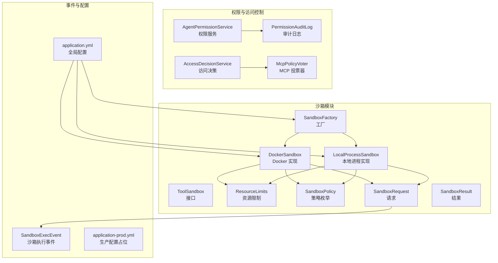
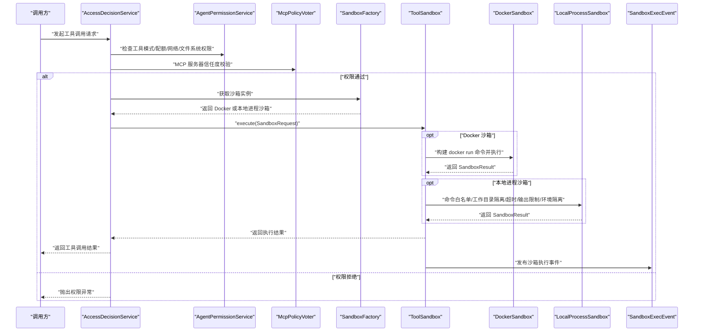
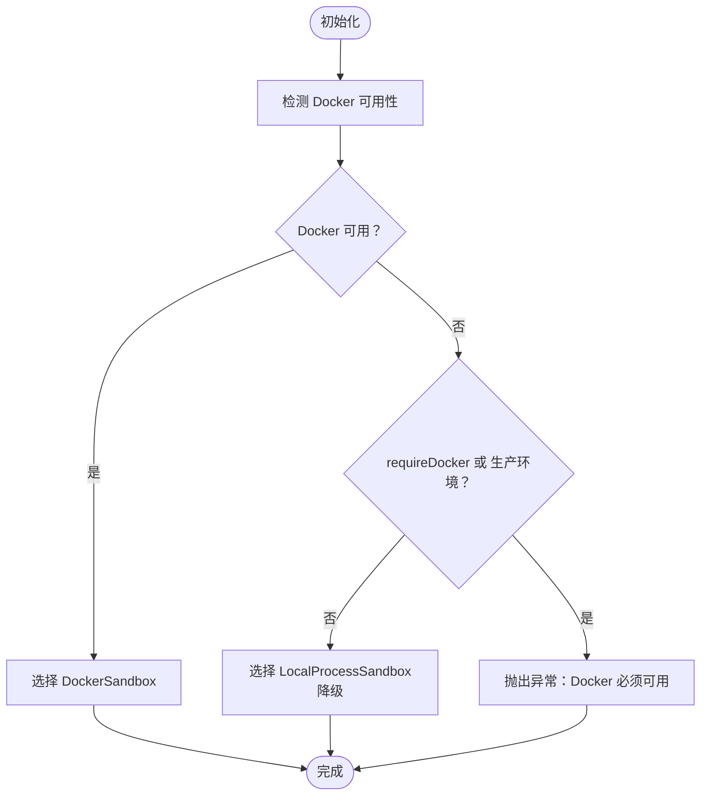
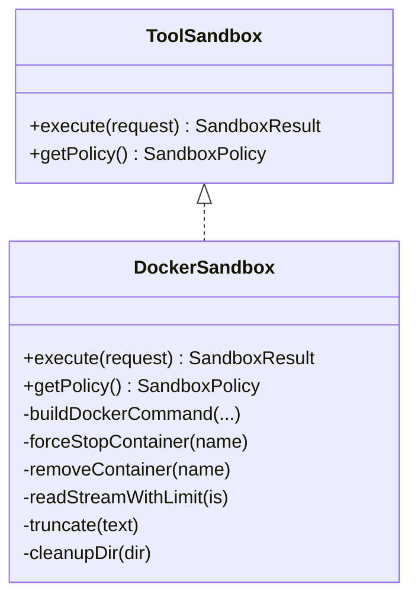
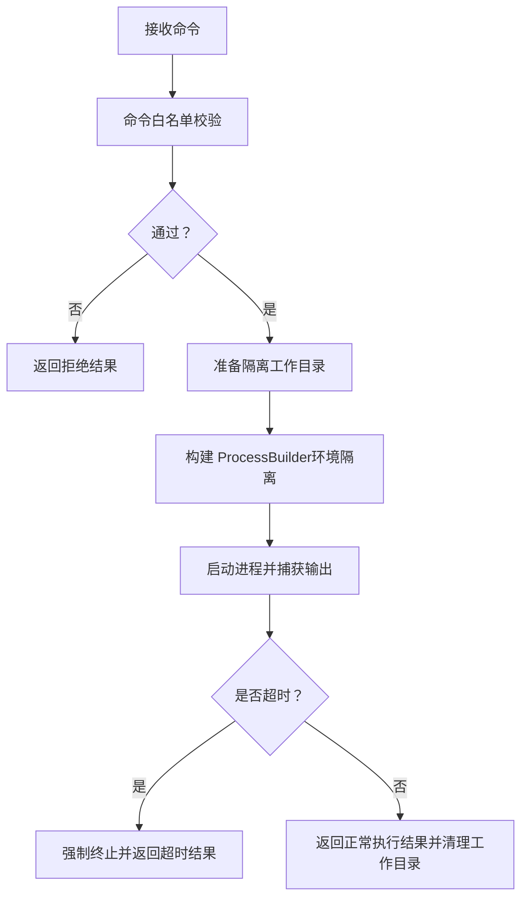
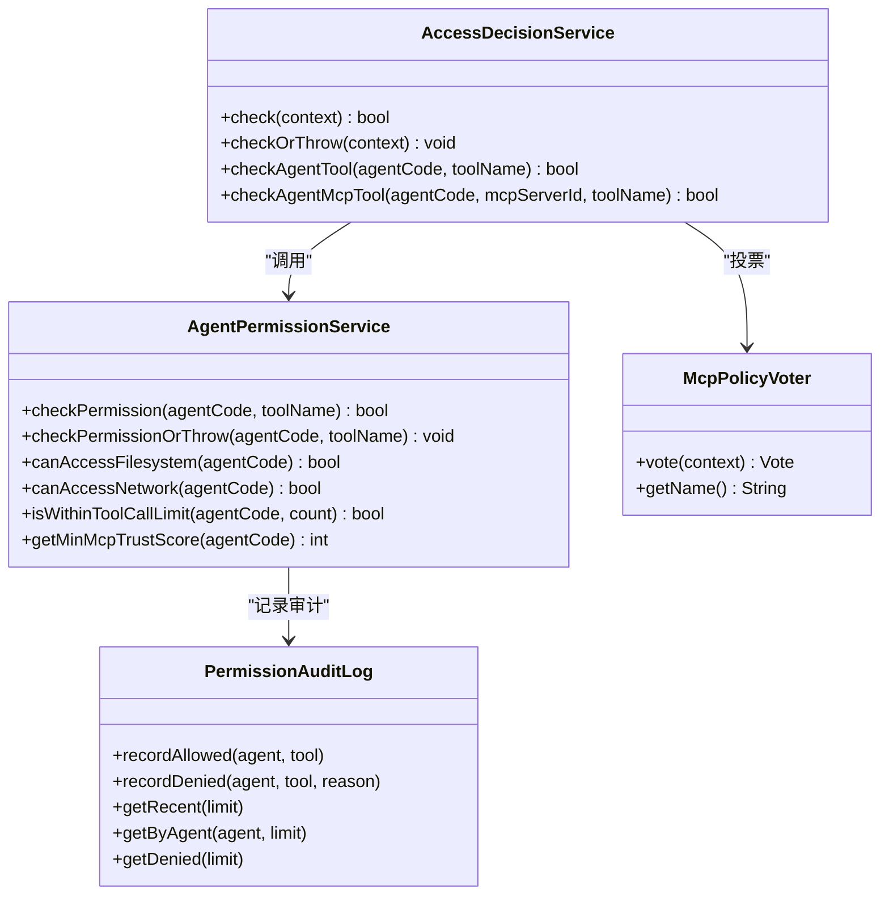
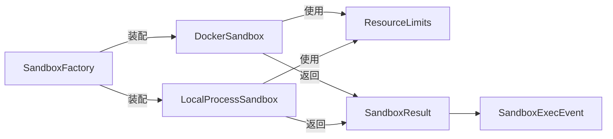

# 工具安全策略

<cite>
**本文引用的文件**
- [SandboxFactory.java](file://src/main/java/com/yupi/yuaiagent/sandbox/SandboxFactory.java)
- [ToolSandbox.java](file://src/main/java/com/yupi/yuaiagent/sandbox/ToolSandbox.java)
- [DockerSandbox.java](file://src/main/java/com/yupi/yuaiagent/sandbox/DockerSandbox.java)
- [LocalProcessSandbox.java](file://src/main/java/com/yupi/yuaiagent/sandbox/LocalProcessSandbox.java)
- [ResourceLimits.java](file://src/main/java/com/yupi/yuaiagent/sandbox/ResourceLimits.java)
- [SandboxPolicy.java](file://src/main/java/com/yupi/yuaiagent/sandbox/SandboxPolicy.java)
- [SandboxRequest.java](file://src/main/java/com/yupi/yuaiagent/sandbox/SandboxRequest.java)
- [SandboxResult.java](file://src/main/java/com/yupi/yuaiagent/sandbox/SandboxResult.java)
- [SandboxExecEvent.java](file://src/main/java/com/yupi/yuaiagent/event/SandboxExecEvent.java)
- [application.yml](file://src/main/resources/application.yml)
- [application-prod.yml](file://src/main/resources/application-prod.yml)
- [AgentPermissionService.java](file://src/main/java/com/yupi/yuaiagent/permission/AgentPermissionService.java)
- [AccessDecisionService.java](file://src/main/java/com/yupi/yuaiagent/access/AccessDecisionService.java)
- [McpPolicyVoter.java](file://src/main/java/com/yupi/yuaiagent/access/McpPolicyVoter.java)
- [PermissionAuditLog.java](file://src/main/java/com/yupi/yuaiagent/permission/PermissionAuditLog.java)
</cite>

## 目录
1. [简介](#简介)
2. [项目结构](#项目结构)
3. [核心组件](#核心组件)
4. [架构总览](#架构总览)
5. [详细组件分析](#详细组件分析)
6. [依赖分析](#依赖分析)
7. [性能考虑](#性能考虑)
8. [故障排查指南](#故障排查指南)
9. [结论](#结论)
10. [附录](#附录)

## 简介
本文件面向开发者与运维人员，系统性阐述工具安全策略的技术实现，重点包括：
- 沙箱机制设计原理与隔离边界
- 资源限制策略与安全防护措施
- SandboxFactory 的工厂模式与策略选择
- ToolSandbox 接口与具体实现（Docker 与本地进程）
- ResourceLimits 的资源约束与 SandboxPolicy 的策略枚举
- 工具调用的权限验证与访问控制
- 不同安全级别的执行环境、网络与文件系统保护
- 安全配置最佳实践、漏洞防护与合规要求
- 安全事件监控、审计日志与应急响应

## 项目结构
围绕“工具安全”主题，相关代码集中在 sandbox、event、permission、access 等包中，并通过配置文件集中管理沙箱参数与日志级别。

图示来源
- [SandboxFactory.java:24-116](file://src/main/java/com/yupi/yuaiagent/sandbox/SandboxFactory.java#L24-L116)
- [ToolSandbox.java:10-25](file://src/main/java/com/yupi/yuaiagent/sandbox/ToolSandbox.java#L10-L25)
- [DockerSandbox.java:30-256](file://src/main/java/com/yupi/yuaiagent/sandbox/DockerSandbox.java#L30-L256)
- [LocalProcessSandbox.java:34-321](file://src/main/java/com/yupi/yuaiagent/sandbox/LocalProcessSandbox.java#L34-L321)
- [ResourceLimits.java:11-46](file://src/main/java/com/yupi/yuaiagent/sandbox/ResourceLimits.java#L11-L46)
- [SandboxPolicy.java:10-33](file://src/main/java/com/yupi/yuaiagent/sandbox/SandboxPolicy.java#L10-L33)
- [SandboxRequest.java:13-44](file://src/main/java/com/yupi/yuaiagent/sandbox/SandboxRequest.java#L13-L44)
- [SandboxResult.java:11-73](file://src/main/java/com/yupi/yuaiagent/sandbox/SandboxResult.java#L11-L73)
- [SandboxExecEvent.java:8-29](file://src/main/java/com/yupi/yuaiagent/event/SandboxExecEvent.java#L8-L29)
- [application.yml:131-154](file://src/main/resources/application.yml#L131-L154)
- [application-prod.yml:1-2](file://src/main/resources/application-prod.yml#L1-L2)

章节来源
- [application.yml:131-154](file://src/main/resources/application.yml#L131-L154)
- [application-prod.yml:1-2](file://src/main/resources/application-prod.yml#L1-L2)

## 核心组件
- SandboxFactory：根据环境自动选择沙箱实现，支持强制 Docker、生产环境校验与降级策略。
- ToolSandbox：统一的沙箱执行接口，屏蔽具体实现差异。
- DockerSandbox：基于 Docker 的完全隔离执行环境，提供 CPU、内存、网络、文件系统隔离。
- LocalProcessSandbox：本地进程沙箱，采用五层安全防护（命令白名单、工作目录隔离、超时、输出限制、环境变量隔离）。
- ResourceLimits：资源限制配置（最大输出、内存、CPU、网络禁用、默认限制）。
- SandboxPolicy：策略枚举（不使用沙箱、本地进程沙箱、Docker 沙箱）。
- SandboxRequest/SandboxResult：请求与结果数据模型。
- SandboxExecEvent：沙箱执行事件，用于治理与审计。
- 权限与访问控制：AgentPermissionService、AccessDecisionService、McpPolicyVoter、PermissionAuditLog。

章节来源
- [SandboxFactory.java:24-116](file://src/main/java/com/yupi/yuaiagent/sandbox/SandboxFactory.java#L24-L116)
- [ToolSandbox.java:10-25](file://src/main/java/com/yupi/yuaiagent/sandbox/ToolSandbox.java#L10-L25)
- [DockerSandbox.java:30-256](file://src/main/java/com/yupi/yuaiagent/sandbox/DockerSandbox.java#L30-L256)
- [LocalProcessSandbox.java:34-321](file://src/main/java/com/yupi/yuaiagent/sandbox/LocalProcessSandbox.java#L34-L321)
- [ResourceLimits.java:11-46](file://src/main/java/com/yupi/yuaiagent/sandbox/ResourceLimits.java#L11-L46)
- [SandboxPolicy.java:10-33](file://src/main/java/com/yupi/yuaiagent/sandbox/SandboxPolicy.java#L10-L33)
- [SandboxRequest.java:13-44](file://src/main/java/com/yupi/yuaiagent/sandbox/SandboxRequest.java#L13-L44)
- [SandboxResult.java:11-73](file://src/main/java/com/yupi/yuaiagent/sandbox/SandboxResult.java#L11-L73)
- [SandboxExecEvent.java:8-29](file://src/main/java/com/yupi/yuaiagent/event/SandboxExecEvent.java#L8-L29)

## 架构总览
下图展示从“工具调用”到“沙箱执行”的整体流程，以及权限与访问控制如何前置介入。

图示来源
- [AccessDecisionService.java:70-104](file://src/main/java/com/yupi/yuaiagent/access/AccessDecisionService.java#L70-L104)
- [AgentPermissionService.java:40-119](file://src/main/java/com/yupi/yuaiagent/permission/AgentPermissionService.java#L40-L119)
- [McpPolicyVoter.java:37-59](file://src/main/java/com/yupi/yuaiagent/access/McpPolicyVoter.java#L37-L59)
- [SandboxFactory.java:41-93](file://src/main/java/com/yupi/yuaiagent/sandbox/SandboxFactory.java#L41-L93)
- [DockerSandbox.java:49-132](file://src/main/java/com/yupi/yuaiagent/sandbox/DockerSandbox.java#L49-L132)
- [LocalProcessSandbox.java:77-155](file://src/main/java/com/yupi/yuaiagent/sandbox/LocalProcessSandbox.java#L77-L155)
- [SandboxExecEvent.java:15-22](file://src/main/java/com/yupi/yuaiagent/event/SandboxExecEvent.java#L15-L22)

## 详细组件分析

### SandboxFactory：沙箱工厂模式与策略选择
- 初始化阶段检测 Docker 可用性，依据配置与环境选择策略：
  - Docker 可用 → 使用 DockerSandbox
  - Docker 不可用且 requireDocker 或生产环境 → 抛出非法状态异常
  - Docker 不可用且非生产 → 降级为 LocalProcessSandbox（仅开发环境）
- 支持按策略显式获取沙箱实例，若请求 Docker 但不可用则抛异常
- 提供当前激活策略查询与 Docker 可用性查询

图示来源
- [SandboxFactory.java:41-93](file://src/main/java/com/yupi/yuaiagent/sandbox/SandboxFactory.java#L41-L93)

章节来源
- [SandboxFactory.java:24-116](file://src/main/java/com/yupi/yuaiagent/sandbox/SandboxFactory.java#L24-L116)

### ToolSandbox：统一接口与策略标识
- 统一的执行入口 execute(SandboxRequest)，返回 SandboxResult
- 提供 getPolicy() 返回当前实现所遵循的策略类型

章节来源
- [ToolSandbox.java:10-25](file://src/main/java/com/yupi/yuaiagent/sandbox/ToolSandbox.java#L10-L25)

### DockerSandbox：Docker 完全隔离执行环境
- 隔离维度：
  - CPU：通过 --cpus 限制
  - Memory：通过 --memory 限制
  - Network：默认 --network none 禁用网络
  - Filesystem：仅挂载临时工作目录，容器内只读根文件系统
- 关键特性：
  - 命令构建：基于 sh -c 执行传入命令
  - 超时控制：waitFor + destroyForcibly 强制终止
  - 输出截断：超过 maxOutputSize 截断并提示
  - 容器清理：执行后移除容器与宿主工作目录
  - 环境变量隔离：仅传递沙箱标记变量，避免敏感变量泄露

图示来源
- [ToolSandbox.java:10-25](file://src/main/java/com/yupi/yuaiagent/sandbox/ToolSandbox.java#L10-L25)
- [DockerSandbox.java:30-256](file://src/main/java/com/yupi/yuaiagent/sandbox/DockerSandbox.java#L30-L256)

章节来源
- [DockerSandbox.java:30-256](file://src/main/java/com/yupi/yuaiagent/sandbox/DockerSandbox.java#L30-L256)

### LocalProcessSandbox：本地进程五层防护
- 五层防护：
  1) 命令白名单：仅允许安全命令（python、node、java、git、常用系统工具等）
  2) 工作目录隔离：严格限制在 baseDir/taskId，防止路径穿越
  3) 超时强制终止：超时后 destroyForcibly
  4) 输出大小限制：超过阈值截断
  5) 环境变量隔离：移除敏感变量，仅注入沙箱标记变量
- 适用场景：Docker 不可用时的降级方案，生产环境不推荐

图示来源
- [LocalProcessSandbox.java:77-155](file://src/main/java/com/yupi/yuaiagent/sandbox/LocalProcessSandbox.java#L77-L155)

章节来源
- [LocalProcessSandbox.java:34-321](file://src/main/java/com/yupi/yuaiagent/sandbox/LocalProcessSandbox.java#L34-L321)

### ResourceLimits：资源限制管理
- 字段含义：
  - 最大输出大小（字节）：超出后截断
  - 最大内存（MB）：Docker 模式下通过 --memory 限制
  - CPU 核数限制：Docker 模式下通过 --cpus 限制
  - 网络禁用：默认禁用网络访问
- 默认值：10MB 输出、256MB 内存、1.0 CPU、网络禁用
- 作用范围：Docker 与本地进程沙箱均使用该对象进行约束

章节来源
- [ResourceLimits.java:11-46](file://src/main/java/com/yupi/yuaiagent/sandbox/ResourceLimits.java#L11-L46)

### SandboxPolicy：安全策略配置
- UNSANDBOXED：不使用沙箱，适用于纯计算型安全工具
- PROCESS_SANDBOX：本地进程沙箱，仅在 Docker 不可用时降级
- DOCKER_SANDBOX：Docker 沙箱，生产环境强制要求

章节来源
- [SandboxPolicy.java:10-33](file://src/main/java/com/yupi/yuaiagent/sandbox/SandboxPolicy.java#L10-L33)

### SandboxRequest/SandboxResult：请求与结果模型
- SandboxRequest：包含命令、工作目录、超时、资源限制、任务 ID
- SandboxResult：包含退出码、标准输出/错误、是否被杀、是否超限、执行时间、输出是否截断、沙箱类型、错误信息；提供 isSuccess 判定与 failure 快捷构造

章节来源
- [SandboxRequest.java:13-44](file://src/main/java/com/yupi/yuaiagent/sandbox/SandboxRequest.java#L13-L44)
- [SandboxResult.java:11-73](file://src/main/java/com/yupi/yuaiagent/sandbox/SandboxResult.java#L11-L73)

### 权限验证与访问控制
- AgentPermissionService：检查工具模式（支持通配符）、文件系统/网络访问权限、单次请求调用次数限制、MCP 最低信任分
- AccessDecisionService：综合多个投票器（含 MCP 投票器）做出最终访问决策，支持抛出异常
- McpPolicyVoter：校验 MCP 服务器信任分是否满足 Agent 的最低要求
- PermissionAuditLog：记录允许/拒绝决策与原因，支持查询最近记录、按 Agent 查询、DENIED 统计

图示来源
- [AccessDecisionService.java:70-104](file://src/main/java/com/yupi/yuaiagent/access/AccessDecisionService.java#L70-L104)
- [AgentPermissionService.java:40-119](file://src/main/java/com/yupi/yuaiagent/permission/AgentPermissionService.java#L40-L119)
- [McpPolicyVoter.java:37-59](file://src/main/java/com/yupi/yuaiagent/access/McpPolicyVoter.java#L37-L59)
- [PermissionAuditLog.java:41-138](file://src/main/java/com/yupi/yuaiagent/permission/PermissionAuditLog.java#L41-L138)

章节来源
- [AccessDecisionService.java:70-104](file://src/main/java/com/yupi/yuaiagent/access/AccessDecisionService.java#L70-L104)
- [AgentPermissionService.java:40-119](file://src/main/java/com/yupi/yuaiagent/permission/AgentPermissionService.java#L40-L119)
- [McpPolicyVoter.java:37-59](file://src/main/java/com/yupi/yuaiagent/access/McpPolicyVoter.java#L37-L59)
- [PermissionAuditLog.java:41-138](file://src/main/java/com/yupi/yuaiagent/permission/PermissionAuditLog.java#L41-L138)

### 安全事件与审计
- SandboxExecEvent：封装沙箱执行事件（用户 ID、Agent 编码、命令、成功与否、耗时），可用于治理与审计
- PermissionAuditLog：维护固定容量的最近审计记录，支持 DENIED 统计与查询

章节来源
- [SandboxExecEvent.java:8-29](file://src/main/java/com/yupi/yuaiagent/event/SandboxExecEvent.java#L8-L29)
- [PermissionAuditLog.java:41-138](file://src/main/java/com/yupi/yuaiagent/permission/PermissionAuditLog.java#L41-L138)

## 依赖分析
- 组件耦合与内聚：
  - SandboxFactory 与 DockerSandbox、LocalProcessSandbox 之间为装配关系，降低上层对具体实现的感知
  - ToolSandbox 作为接口，提升扩展性与测试友好性
  - ResourceLimits 作为共享配置对象，被 Docker 与本地进程沙箱复用
- 外部依赖与集成点：
  - Docker 命令行工具：DockerSandbox 通过 ProcessBuilder 调用 docker run、docker kill、docker rm
  - 系统命令：LocalProcessSandbox 在 Windows 使用 cmd /c，在 Unix 使用 sh -c
- 风险点与潜在循环依赖：
  - 沙箱实现与权限模块解耦良好，权限模块通过服务接口调用，未见直接循环依赖

图示来源
- [SandboxFactory.java:32-36](file://src/main/java/com/yupi/yuaiagent/sandbox/SandboxFactory.java#L32-L36)
- [DockerSandbox.java:53-55](file://src/main/java/com/yupi/yuaiagent/sandbox/DockerSandbox.java#L53-L55)
- [LocalProcessSandbox.java:95-98](file://src/main/java/com/yupi/yuaiagent/sandbox/LocalProcessSandbox.java#L95-L98)
- [SandboxResult.java:11-73](file://src/main/java/com/yupi/yuaiagent/sandbox/SandboxResult.java#L11-L73)
- [SandboxExecEvent.java:8-29](file://src/main/java/com/yupi/yuaiagent/event/SandboxExecEvent.java#L8-L29)

章节来源
- [SandboxFactory.java:32-36](file://src/main/java/com/yupi/yuaiagent/sandbox/SandboxFactory.java#L32-L36)
- [DockerSandbox.java:53-55](file://src/main/java/com/yupi/yuaiagent/sandbox/DockerSandbox.java#L53-L55)
- [LocalProcessSandbox.java:95-98](file://src/main/java/com/yupi/yuaiagent/sandbox/LocalProcessSandbox.java#L95-L98)

## 性能考虑
- Docker 沙箱
  - 容器生命周期开销：每次执行新建/销毁容器，适合高隔离需求但有一定启动延迟
  - 资源限制：通过 --cpus 与 --memory 控制，避免资源滥用
  - 网络隔离：默认禁用网络，减少外部依赖带来的不确定性
- 本地进程沙箱
  - 启动更快，但隔离能力有限，仅适合开发与测试
  - 输出截断与超时控制避免长时间占用资源
- 统一超时与输出限制：两套实现均内置超时与输出大小限制，保障系统稳定性
- 建议
  - 生产环境优先使用 Docker 沙箱
  - 合理设置默认超时与最大输出，平衡功能与安全
  - 对高频工具调用建立缓存与队列，避免瞬时峰值

[本节为通用指导，无需特定文件来源]

## 故障排查指南
- Docker 不可用导致初始化失败
  - 现象：生产环境启动报错，提示 Docker 未安装或未运行
  - 处理：安装 Docker 或在开发环境设置 sandbox.require-docker=false
  - 参考：SandboxFactory 初始化逻辑与异常抛出位置
- 命令被拒绝（本地进程沙箱）
  - 现象：返回拒绝原因，包含命令不在白名单或包含不允许的链接符
  - 处理：检查命令是否在白名单中，避免使用 ; && || 等链接符
  - 参考：LocalProcessSandbox 命令校验逻辑
- 超时与输出截断
  - 现象：结果中标记 killed 或 outputTruncated
  - 处理：调整超时与 maxOutputSize，优化工具执行逻辑
  - 参考：DockerSandbox 与 LocalProcessSandbox 的超时与截断实现
- 权限拒绝
  - 现象：访问被拒绝，审计日志记录 DENIED
  - 处理：检查 Agent 的工具模式、网络/文件系统权限、MCP 信任分
  - 参考：AccessDecisionService、AgentPermissionService、PermissionAuditLog
- 审计与事件
  - 使用 PermissionAuditLog 查询 DENIED 记录，结合 SandboxExecEvent 分析执行耗时与成功率

章节来源
- [SandboxFactory.java:41-56](file://src/main/java/com/yupi/yuaiagent/sandbox/SandboxFactory.java#L41-L56)
- [LocalProcessSandbox.java:167-196](file://src/main/java/com/yupi/yuaiagent/sandbox/LocalProcessSandbox.java#L167-L196)
- [DockerSandbox.java:84-100](file://src/main/java/com/yupi/yuaiagent/sandbox/DockerSandbox.java#L84-L100)
- [LocalProcessSandbox.java:113-125](file://src/main/java/com/yupi/yuaiagent/sandbox/LocalProcessSandbox.java#L113-L125)
- [AccessDecisionService.java:70-104](file://src/main/java/com/yupi/yuaiagent/access/AccessDecisionService.java#L70-L104)
- [AgentPermissionService.java:40-119](file://src/main/java/com/yupi/yuaiagent/permission/AgentPermissionService.java#L40-L119)
- [PermissionAuditLog.java:41-138](file://src/main/java/com/yupi/yuaiagent/permission/PermissionAuditLog.java#L41-L138)
- [SandboxExecEvent.java:8-29](file://src/main/java/com/yupi/yuaiagent/event/SandboxExecEvent.java#L8-L29)

## 结论
本安全策略通过“权限前置 + 沙箱隔离 + 资源限制 + 审计监控”的组合拳，实现了对工具调用的全链路安全控制。生产环境应强制使用 Docker 沙箱，配合严格的资源限制与网络隔离；开发与测试环境可使用本地进程沙箱作为降级方案。通过权限服务与审计日志，系统具备完善的合规与可追溯能力。

[本节为总结，无需特定文件来源]

## 附录

### 安全配置最佳实践
- 生产环境
  - 设置 sandbox.require-docker=true，确保强制使用 Docker 沙箱
  - 明确 Docker 镜像与默认超时、内存/CPU 限制
  - 禁用网络访问（networkDisabled=true），必要时通过可信代理或白名单
- 开发/测试环境
  - 可设置 sandbox.require-docker=false，使用本地进程沙箱
  - 合理提高超时与输出限制，便于调试
- 敏感信息
  - 通过环境变量注入密钥，避免硬编码
  - 本地进程沙箱会移除敏感环境变量，仍需谨慎传递参数

章节来源
- [application.yml:131-154](file://src/main/resources/application.yml#L131-L154)
- [SandboxFactory.java:48-55](file://src/main/java/com/yupi/yuaiagent/sandbox/SandboxFactory.java#L48-L55)
- [LocalProcessSandbox.java:232-242](file://src/main/java/com/yupi/yuaiagent/sandbox/LocalProcessSandbox.java#L232-242)

### 漏洞防护与合规要点
- 命令注入防护：本地进程沙箱对命令进行白名单与特殊字符过滤
- 路径穿越防护：工作目录严格限制与规范化校验
- 资源滥用防护：CPU、内存、输出大小与超时三重限制
- 网络访问控制：默认禁用网络，避免工具无意间访问外部
- 审计与追踪：记录权限决策与沙箱执行事件，支持合规审计

章节来源
- [LocalProcessSandbox.java:167-196](file://src/main/java/com/yupi/yuaiagent/sandbox/LocalProcessSandbox.java#L167-L196)
- [LocalProcessSandbox.java:201-213](file://src/main/java/com/yupi/yuaiagent/sandbox/LocalProcessSandbox.java#L201-L213)
- [DockerSandbox.java:159-163](file://src/main/java/com/yupi/yuaiagent/sandbox/DockerSandbox.java#L159-L163)
- [PermissionAuditLog.java:41-138](file://src/main/java/com/yupi/yuaiagent/permission/PermissionAuditLog.java#L41-L138)

### 应急响应指南
- 发生超时或资源超限：检查工具执行逻辑与资源限制配置，必要时临时放宽限制并定位问题
- 权限频繁拒绝：核查 Agent 的权限配置与 MCP 信任分，确认策略是否合理
- Docker 异常：检查 Docker 服务状态、镜像可用性与磁盘空间，清理僵尸容器与工作目录
- 审计告警：基于 PermissionAuditLog 与 SandboxExecEvent 快速定位高风险行为与异常调用

章节来源
- [DockerSandbox.java:84-100](file://src/main/java/com/yupi/yuaiagent/sandbox/DockerSandbox.java#L84-L100)
- [LocalProcessSandbox.java:113-125](file://src/main/java/com/yupi/yuaiagent/sandbox/LocalProcessSandbox.java#L113-L125)
- [PermissionAuditLog.java:41-138](file://src/main/java/com/yupi/yuaiagent/permission/PermissionAuditLog.java#L41-L138)
- [SandboxExecEvent.java:8-29](file://src/main/java/com/yupi/yuaiagent/event/SandboxExecEvent.java#L8-L29)