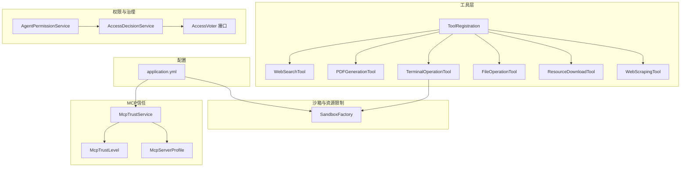
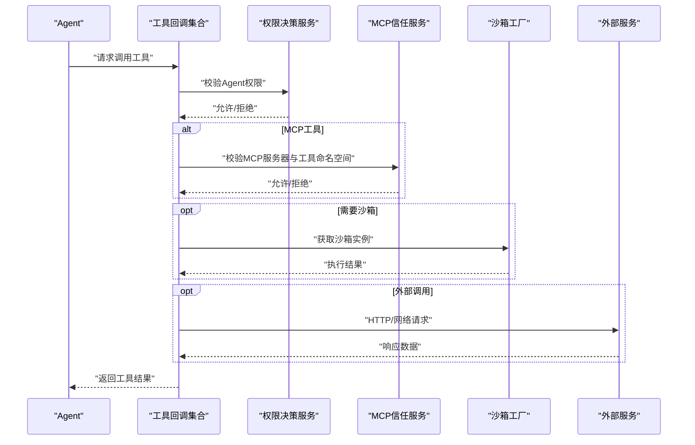
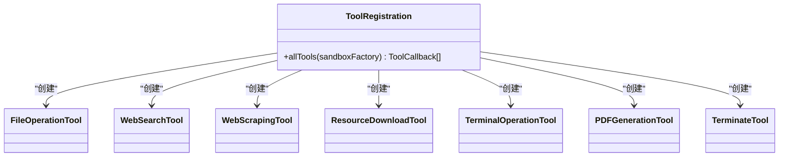
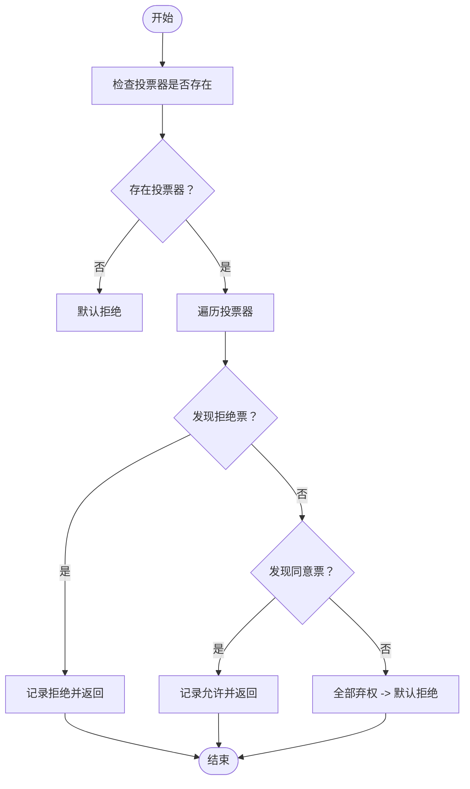
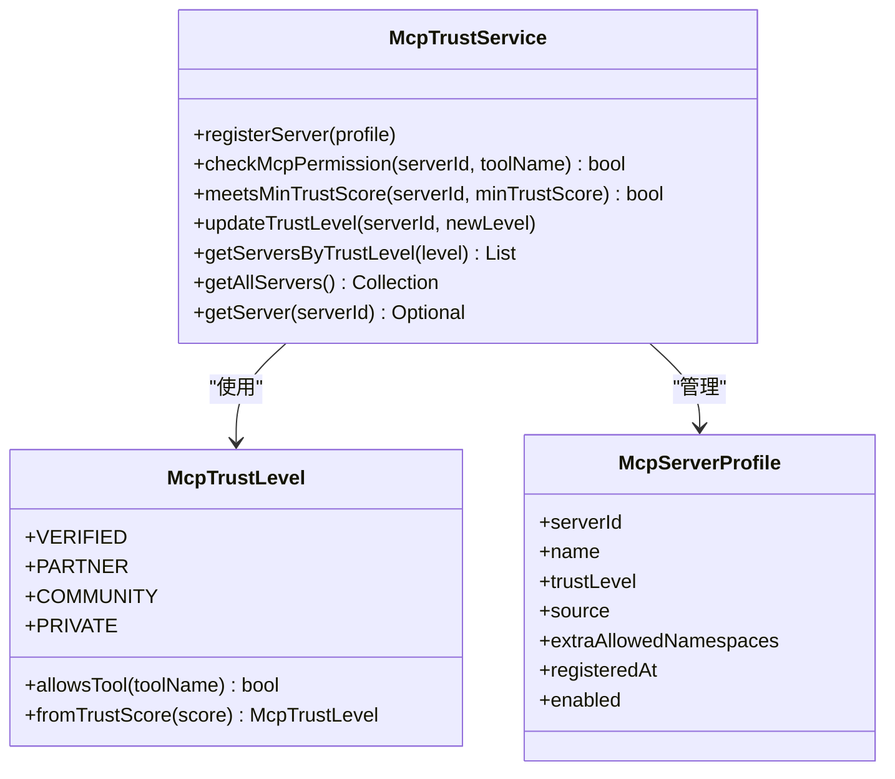
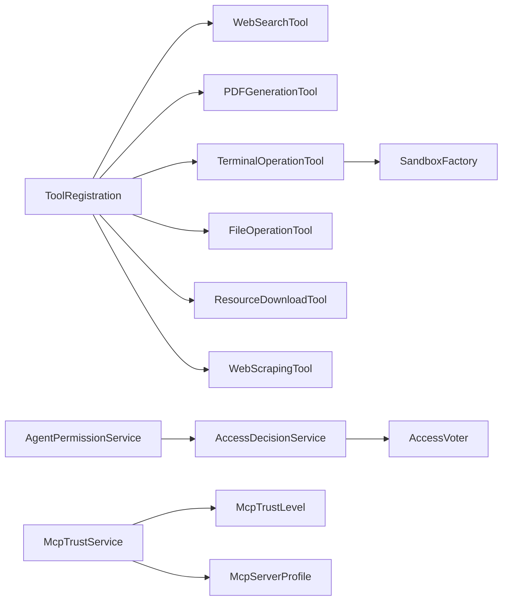

# 工具集成系统

<cite>
**本文引用的文件**
- [WebSearchTool.java](file://src/main/java/com/yupi/yuaiagent/tools/WebSearchTool.java)
- [PDFGenerationTool.java](file://src/main/java/com/yupi/yuaiagent/tools/PDFGenerationTool.java)
- [TerminalOperationTool.java](file://src/main/java/com/yupi/yuaiagent/tools/TerminalOperationTool.java)
- [FileOperationTool.java](file://src/main/java/com/yupi/yuaiagent/tools/FileOperationTool.java)
- [ResourceDownloadTool.java](file://src/main/java/com/yupi/yuaiagent/tools/ResourceDownloadTool.java)
- [WebScrapingTool.java](file://src/main/java/com/yupi/yuaiagent/tools/WebScrapingTool.java)
- [ToolRegistration.java](file://src/main/java/com/yupi/yuaiagent/tools/ToolRegistration.java)
- [McpTrustService.java](file://src/main/java/com/yupi/yuaiagent/mcp/McpTrustService.java)
- [McpTrustLevel.java](file://src/main/java/com/yupi/yuaiagent/mcp/McpTrustLevel.java)
- [McpServerProfile.java](file://src/main/java/com/yupi/yuaiagent/mcp/McpServerProfile.java)
- [SandboxFactory.java](file://src/main/java/com/yupi/yuaiagent/sandbox/SandboxFactory.java)
- [AccessDecisionService.java](file://src/main/java/com/yupi/yuaiagent/access/AccessDecisionService.java)
- [AccessVoter.java](file://src/main/java/com/yupi/yuaiagent/access/AccessVoter.java)
- [AgentPermissionService.java](file://src/main/java/com/yupi/yuaiagent/permission/AgentPermissionService.java)
- [application.yml](file://src/main/resources/application.yml)
</cite>

## 目录
1. [引言](#引言)
2. [项目结构](#项目结构)
3. [核心组件](#核心组件)
4. [架构总览](#架构总览)
5. [组件详解](#组件详解)
6. [依赖关系分析](#依赖关系分析)
7. [性能考量](#性能考量)
8. [故障排查指南](#故障排查指南)
9. [结论](#结论)
10. [附录](#附录)

## 引言
本文件面向开发者与运维人员，系统性阐述工具集成系统的架构设计、工具调用机制、外部服务集成与MCP协议支持，覆盖内置工具能力（Web搜索、PDF生成、终端操作、文件读写、资源下载、网页抓取）、工具注册与权限控制、资源限制策略、MCP信任体系与安全策略、性能监控与调用统计、故障诊断方法以及自定义工具开发指南与最佳实践。

## 项目结构
工具集成系统主要位于后端模块的工具包与相关子包中，围绕“工具注册—权限决策—沙箱执行—MCP信任”四条主线组织代码。核心位置如下：
- 工具实现：tools 包
- 工具注册：ToolRegistration 配置类
- 权限与访问控制：access、permission 子包
- 沙箱与资源限制：sandbox 子包
- MCP信任与策略：mcp 子包
- 配置中心：application.yml

图表来源
- [ToolRegistration.java:19-37](file://src/main/java/com/yupi/yuaiagent/tools/ToolRegistration.java#L19-L37)
- [SandboxFactory.java:24-63](file://src/main/java/com/yupi/yuaiagent/sandbox/SandboxFactory.java#L24-L63)
- [AccessDecisionService.java:22-74](file://src/main/java/com/yupi/yuaiagent/access/AccessDecisionService.java#L22-L74)
- [AgentPermissionService.java:20-53](file://src/main/java/com/yupi/yuaiagent/permission/AgentPermissionService.java#L20-L53)
- [McpTrustService.java:24-52](file://src/main/java/com/yupi/yuaiagent/mcp/McpTrustService.java#L24-L52)
- [McpTrustLevel.java:14-35](file://src/main/java/com/yupi/yuaiagent/mcp/McpTrustLevel.java#L14-L35)
- [McpServerProfile.java:20-47](file://src/main/java/com/yupi/yuaiagent/mcp/McpServerProfile.java#L20-L47)
- [application.yml:131-146](file://src/main/resources/application.yml#L131-L146)

章节来源
- [ToolRegistration.java:10-39](file://src/main/java/com/yupi/yuaiagent/tools/ToolRegistration.java#L10-L39)
- [application.yml:1-154](file://src/main/resources/application.yml#L1-L154)

## 核心组件
- 工具注册与集中管理：通过配置类统一装配内置工具，形成工具回调集合，供上层调用。
- 权限与访问控制：基于多维投票器的统一决策服务，结合Agent权限画像与MCP信任等级共同决定是否放行。
- 沙箱与资源限制：自动选择Docker或本地进程沙箱，统一超时、输出大小等限制策略。
- MCP信任体系：按来源推断信任等级，支持命名空间白名单与动态调整，保障外部工具调用安全。
- 外部服务集成：Web搜索、网页抓取、PDF生成、文件读写、资源下载等工具均封装为Spring AI工具注解形式，具备清晰参数与返回约定。

章节来源
- [ToolRegistration.java:19-37](file://src/main/java/com/yupi/yuaiagent/tools/ToolRegistration.java#L19-L37)
- [AccessDecisionService.java:22-74](file://src/main/java/com/yupi/yuaiagent/access/AccessDecisionService.java#L22-L74)
- [AgentPermissionService.java:20-53](file://src/main/java/com/yupi/yuaiagent/permission/AgentPermissionService.java#L20-L53)
- [SandboxFactory.java:24-63](file://src/main/java/com/yupi/yuaiagent/sandbox/SandboxFactory.java#L24-L63)
- [McpTrustService.java:24-52](file://src/main/java/com/yupi/yuaiagent/mcp/McpTrustService.java#L24-L52)

## 架构总览
系统采用“工具即服务”的理念，工具以Spring AI工具注解暴露，经由统一的工具回调集合注册；调用前通过权限与MCP信任双重校验；涉及系统调用与外部网络的工具统一走沙箱执行与资源限制；MCP服务器侧通过信任画像与命名空间白名单约束工具可见性与调用范围。

图表来源
- [ToolRegistration.java:19-37](file://src/main/java/com/yupi/yuaiagent/tools/ToolRegistration.java#L19-L37)
- [AccessDecisionService.java:37-74](file://src/main/java/com/yupi/yuaiagent/access/AccessDecisionService.java#L37-L74)
- [McpTrustService.java:80-112](file://src/main/java/com/yupi/yuaiagent/mcp/McpTrustService.java#L80-L112)
- [SandboxFactory.java:61-79](file://src/main/java/com/yupi/yuaiagent/sandbox/SandboxFactory.java#L61-L79)

## 组件详解

### 工具注册机制
- 集中式注册：在配置类中创建各工具实例并汇总为工具回调数组，供上层统一调度。
- 参数注入：Web搜索工具从配置读取API密钥，确保密钥不硬编码在代码中。
- 工具清单：文件读写、Web搜索、网页抓取、资源下载、终端命令执行、PDF生成、终止工具等。

图表来源
- [ToolRegistration.java:19-37](file://src/main/java/com/yupi/yuaiagent/tools/ToolRegistration.java#L19-L37)

章节来源
- [ToolRegistration.java:10-39](file://src/main/java/com/yupi/yuaiagent/tools/ToolRegistration.java#L10-L39)

### 权限控制与资源限制
- 统一决策：AccessDecisionService 汇总多个 AccessVoter 的投票，采用“一票否决 + 全部弃权拒绝”的默认安全策略。
- Agent权限：AgentPermissionService 基于 PermissionProfile 的工具模式白名单进行匹配（支持通配符），并提供文件系统/网络访问与调用次数限制检查。
- 资源限制：SandboxFactory 自动选择沙箱实现，支持超时、输出大小、Docker镜像等配置，生产环境可强制要求Docker可用。

图表来源
- [AccessDecisionService.java:37-74](file://src/main/java/com/yupi/yuaiagent/access/AccessDecisionService.java#L37-L74)

章节来源
- [AccessDecisionService.java:12-119](file://src/main/java/com/yupi/yuaiagent/access/AccessDecisionService.java#L12-L119)
- [AgentPermissionService.java:20-120](file://src/main/java/com/yupi/yuaiagent/permission/AgentPermissionService.java#L20-L120)
- [SandboxFactory.java:24-115](file://src/main/java/com/yupi/yuaiagent/sandbox/SandboxFactory.java#L24-L115)

### MCP信任与安全策略
- 信任等级：VERIFIED > PARTNER > COMMUNITY > PRIVATE，分别对应不同的工具命名空间白名单与信任分。
- 服务器画像：McpServerProfile 记录来源、信任等级、启用状态、额外允许命名空间与注册时间等。
- 校验流程：McpTrustService 在调用前校验服务器是否启用、信任等级是否允许该工具，支持额外命名空间覆盖。
- 初始化：内置注册官方与第三方MCP服务器，自动推断信任等级。

图表来源
- [McpTrustService.java:24-173](file://src/main/java/com/yupi/yuaiagent/mcp/McpTrustService.java#L24-L173)
- [McpTrustLevel.java:14-89](file://src/main/java/com/yupi/yuaiagent/mcp/McpTrustLevel.java#L14-L89)
- [McpServerProfile.java:20-65](file://src/main/java/com/yupi/yuaiagent/mcp/McpServerProfile.java#L20-L65)

章节来源
- [McpTrustService.java:12-173](file://src/main/java/com/yupi/yuaiagent/mcp/McpTrustService.java#L12-L173)
- [McpTrustLevel.java:6-89](file://src/main/java/com/yupi/yuaiagent/mcp/McpTrustLevel.java#L6-L89)
- [McpServerProfile.java:11-65](file://src/main/java/com/yupi/yuaiagent/mcp/McpServerProfile.java#L11-L65)

### 内置工具能力与特性

#### Web搜索工具
- 功能：调用外部搜索API，返回结构化结果（标题、摘要、链接），限制返回条目数量以降低token开销。
- 参数：查询关键词。
- 错误处理：捕获异常并返回错误信息。

章节来源
- [WebSearchTool.java:15-55](file://src/main/java/com/yupi/yuaiagent/tools/WebSearchTool.java#L15-L55)

#### PDF生成工具
- 功能：将Markdown风格内容渲染为PDF，支持标题、列表、加粗与分隔线，字体与排版适配中文。
- 参数：文件名、Markdown内容。
- 输出：文件保存路径或错误信息。

章节来源
- [PDFGenerationTool.java:21-115](file://src/main/java/com/yupi/yuaiagent/tools/PDFGenerationTool.java#L21-L115)

#### 终端操作工具
- 功能：通过沙箱执行命令，支持Docker沙箱与本地进程沙箱双栈，具备超时与退出码处理。
- 参数：待执行命令。
- 安全：统一走沙箱，避免直接系统调用。

章节来源
- [TerminalOperationTool.java:13-61](file://src/main/java/com/yupi/yuaiagent/tools/TerminalOperationTool.java#L13-L61)
- [SandboxFactory.java:10-115](file://src/main/java/com/yupi/yuaiagent/sandbox/SandboxFactory.java#L10-L115)

#### 文件操作工具
- 功能：安全地读写文件，路径穿越校验防止逃逸到沙箱目录之外。
- 参数：文件名、内容（写入时）。
- 安全：规范化路径并校验前缀。

章节来源
- [FileOperationTool.java:11-60](file://src/main/java/com/yupi/yuaiagent/tools/FileOperationTool.java#L11-L60)

#### 资源下载工具
- 功能：从URL下载资源并保存至本地，路径穿越校验。
- 参数：URL、目标文件名。
- 输出：保存路径或错误信息。

章节来源
- [ResourceDownloadTool.java:13-38](file://src/main/java/com/yupi/yuaiagent/tools/ResourceDownloadTool.java#L13-L38)

#### 网页抓取工具
- 功能：抓取网页正文文本，去除HTML噪音。
- 参数：URL。
- 输出：纯文本内容或错误信息。

章节来源
- [WebScrapingTool.java:8-27](file://src/main/java/com/yupi/yuaiagent/tools/WebScrapingTool.java#L8-L27)

### 自定义工具开发指南
- 实现步骤
  - 使用工具注解声明工具方法，明确描述与参数。
  - 在工具类中实现业务逻辑，必要时引入沙箱或外部服务。
  - 在工具注册类中添加新工具实例，纳入工具回调集合。
- 配置管理
  - 将敏感配置（如API密钥）通过环境变量注入，避免硬编码。
  - 在配置文件中设置默认行为与开关（如MCP启用、信任等级）。
- 错误处理
  - 明确返回格式（字符串或结构化结果），保证调用方可解析。
  - 记录日志并区分超时、权限、网络等异常类型，便于诊断。

章节来源
- [ToolRegistration.java:16-37](file://src/main/java/com/yupi/yuaiagent/tools/ToolRegistration.java#L16-L37)
- [application.yml:62-68](file://src/main/resources/application.yml#L62-L68)

## 依赖关系分析
- 工具层依赖：工具之间无直接耦合，统一通过工具回调集合暴露；部分工具依赖外部服务（HTTP/JSoup/PDF库）。
- 权限层依赖：AccessDecisionService 依赖多个 AccessVoter 实现；AgentPermissionService 依赖权限画像注册表。
- 沙箱层依赖：TerminalOperationTool 依赖 SandboxFactory；SandboxFactory 依赖Docker与本地沙箱实现。
- MCP层依赖：McpTrustService 依赖信任等级与服务器画像；信任等级与命名空间白名单共同决定工具可见性。

图表来源
- [ToolRegistration.java:19-37](file://src/main/java/com/yupi/yuaiagent/tools/ToolRegistration.java#L19-L37)
- [SandboxFactory.java:24-63](file://src/main/java/com/yupi/yuaiagent/sandbox/SandboxFactory.java#L24-L63)
- [AccessDecisionService.java:22-29](file://src/main/java/com/yupi/yuaiagent/access/AccessDecisionService.java#L22-L29)
- [AgentPermissionService.java:20-25](file://src/main/java/com/yupi/yuaiagent/permission/AgentPermissionService.java#L20-L25)
- [McpTrustService.java:24-52](file://src/main/java/com/yupi/yuaiagent/mcp/McpTrustService.java#L24-L52)
- [McpTrustLevel.java:14-35](file://src/main/java/com/yupi/yuaiagent/mcp/McpTrustLevel.java#L14-L35)
- [McpServerProfile.java:20-47](file://src/main/java/com/yupi/yuaiagent/mcp/McpServerProfile.java#L20-L47)

章节来源
- [ToolRegistration.java:10-39](file://src/main/java/com/yupi/yuaiagent/tools/ToolRegistration.java#L10-L39)
- [AccessDecisionService.java:22-74](file://src/main/java/com/yupi/yuaiagent/access/AccessDecisionService.java#L22-L74)
- [AgentPermissionService.java:20-120](file://src/main/java/com/yupi/yuaiagent/permission/AgentPermissionService.java#L20-L120)
- [SandboxFactory.java:24-115](file://src/main/java/com/yupi/yuaiagent/sandbox/SandboxFactory.java#L24-L115)
- [McpTrustService.java:24-173](file://src/main/java/com/yupi/yuaiagent/mcp/McpTrustService.java#L24-L173)

## 性能考量
- 工具调用性能
  - Web搜索限制返回条目数量，减少后续LLM处理负担。
  - PDF生成采用流式写入，避免大对象内存驻留。
- 沙箱性能
  - Docker沙箱提供更强隔离与可复现性；本地沙箱适合开发场景但需注意降级风险。
  - 统一超时与输出大小限制，防止资源滥用。
- 外部服务
  - HTTP请求设置合理超时与重试策略，避免阻塞主流程。
- 监控与统计
  - 建议在工具层增加调用计数与耗时埋点，结合访问审计日志进行趋势分析。

[本节为通用指导，无需具体文件引用]

## 故障排查指南
- 权限相关
  - 若工具调用被拒绝，检查Agent权限画像与工具模式匹配，确认未被AccessVoter投否决。
  - 查看权限审计日志定位拒绝原因。
- MCP相关
  - 若MCP工具不可用，确认服务器是否注册、启用，信任等级是否满足工具命名空间要求。
  - 必要时动态调整信任等级或补充额外允许命名空间。
- 沙箱相关
  - 生产环境未启用Docker导致沙箱初始化失败时，需安装Docker或在开发环境关闭强制要求。
  - 命令执行超时或失败时，检查超时配置与退出码，关注标准错误输出。
- 外部服务
  - Web搜索/抓取失败时，检查API密钥与网络连通性，关注超时与异常信息。
- 配置相关
  - 确认敏感配置通过环境变量注入，避免硬编码；核对MCP与沙箱相关开关。

章节来源
- [AccessDecisionService.java:37-74](file://src/main/java/com/yupi/yuaiagent/access/AccessDecisionService.java#L37-L74)
- [McpTrustService.java:80-112](file://src/main/java/com/yupi/yuaiagent/mcp/McpTrustService.java#L80-L112)
- [SandboxFactory.java:41-56](file://src/main/java/com/yupi/yuaiagent/sandbox/SandboxFactory.java#L41-L56)
- [application.yml:62-68](file://src/main/resources/application.yml#L62-L68)

## 结论
工具集成系统通过“集中注册、统一权限、沙箱执行、MCP信任”四大支柱，实现了安全、可控、可观测的工具调用体系。内置工具覆盖Web搜索、PDF生成、终端操作、文件与网络操作等高频场景；权限与信任策略确保最小授权与可追溯；资源限制与沙箱设计兼顾性能与安全。建议在生产环境中启用Docker沙箱与MCP信任校验，并完善监控与审计日志，持续优化工具调用体验与安全性。

[本节为总结性内容，无需具体文件引用]

## 附录

### 配置项速览（与工具系统相关）
- 外部服务密钥注入：通过环境变量注入，避免硬编码。
- MCP客户端配置：可启用SSE或STDIO连接方式，支持多服务器配置。
- 沙箱配置：基础目录、默认超时、最大输出、是否强制Docker、Docker镜像等。
- MCP信任配置：默认信任等级、是否启用信任校验。

章节来源
- [application.yml:62-68](file://src/main/resources/application.yml#L62-L68)
- [application.yml:131-146](file://src/main/resources/application.yml#L131-L146)