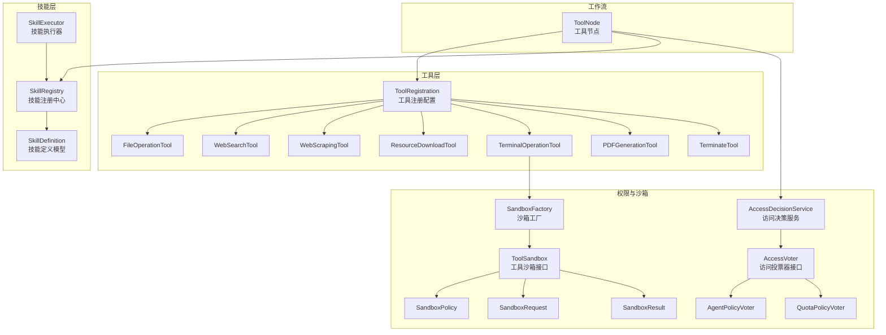
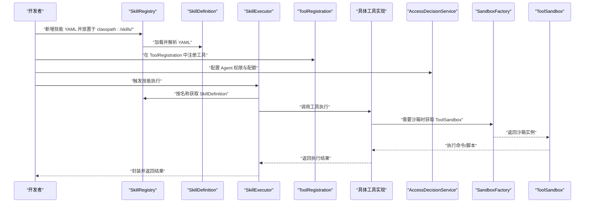
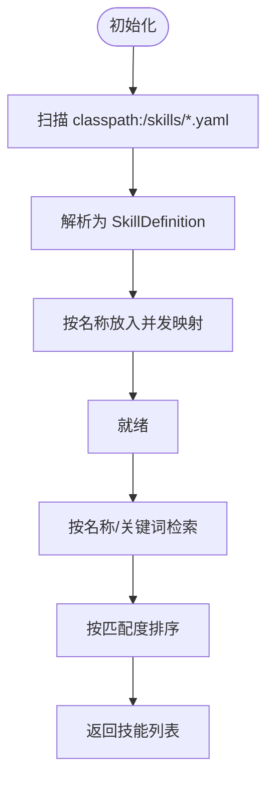
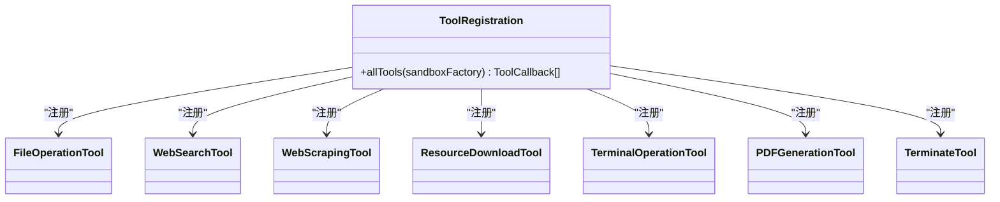
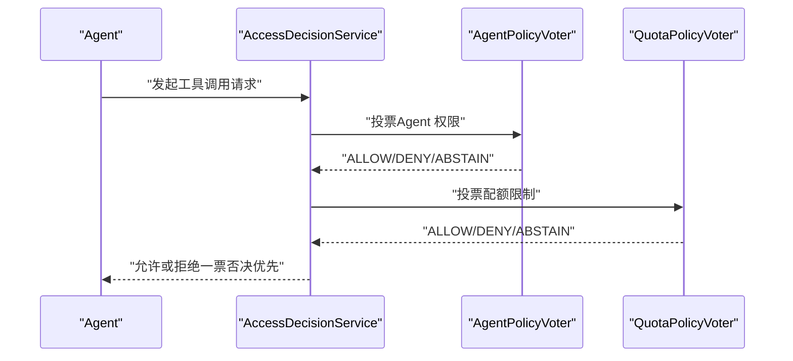
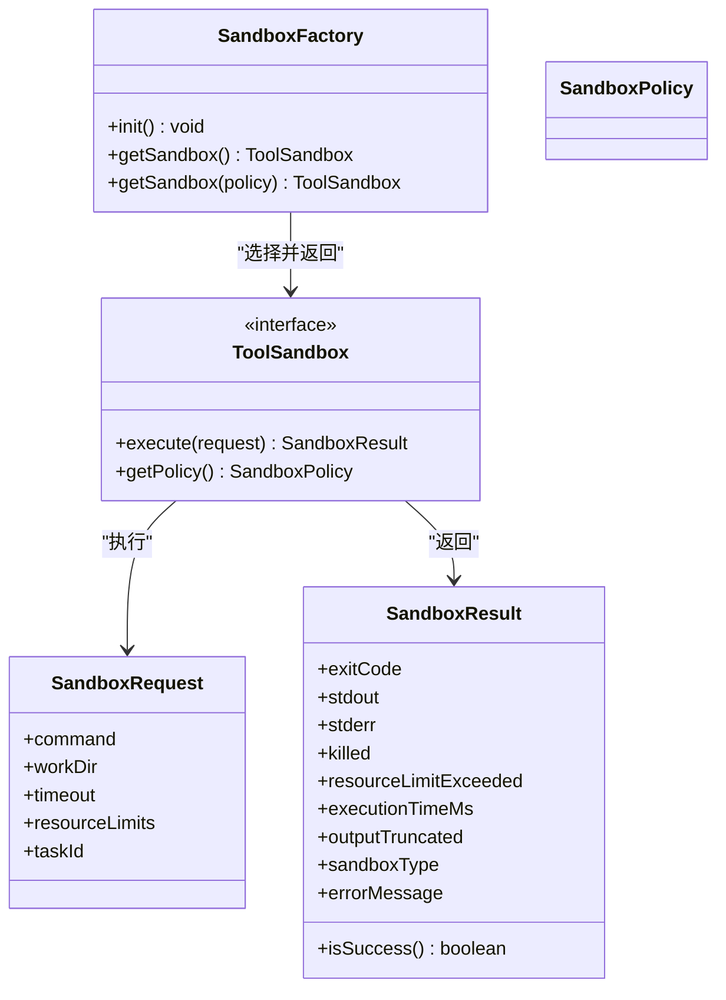
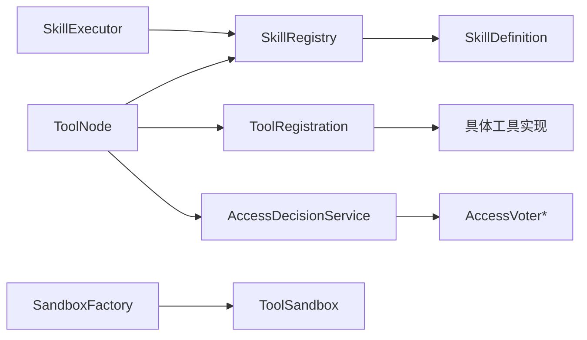

# 自定义工具开发

<cite>
**本文档引用的文件**
- [SkillRegistry.java](file://src/main/java/com/yupi/yuaiagent/skill/SkillRegistry.java)
- [SkillDefinition.java](file://src/main/java/com/yupi/yuaiagent/skill/SkillDefinition.java)
- [SkillExecutor.java](file://src/main/java/com/yupi/yuaiagent/skill/SkillExecutor.java)
- [ToolRegistration.java](file://src/main/java/com/yupi/yuaiagent/tools/ToolRegistration.java)
- [FileOperationTool.java](file://src/main/java/com/yupi/yuaiagent/tools/FileOperationTool.java)
- [WebSearchTool.java](file://src/main/java/com/yupi/yuaiagent/tools/WebSearchTool.java)
- [TerminalOperationTool.java](file://src/main/java/com/yupi/yuaiagent/tools/TerminalOperationTool.java)
- [PDFGenerationTool.java](file://src/main/java/com/yupi/yuaiagent/tools/PDFGenerationTool.java)
- [ResourceDownloadTool.java](file://src/main/java/com/yupi/yuaiagent/tools/ResourceDownloadTool.java)
- [WebScrapingTool.java](file://src/main/java/com/yupi/yuaiagent/tools/WebScrapingTool.java)
- [TerminateTool.java](file://src/main/java/com/yupi/yuaiagent/tools/TerminateTool.java)
- [AccessDecisionService.java](file://src/main/java/com/yupi/yuaiagent/access/AccessDecisionService.java)
- [AccessVoter.java](file://src/main/java/com/yupi/yuaiagent/access/AccessVoter.java)
- [AgentPolicyVoter.java](file://src/main/java/com/yupi/yuaiagent/access/AgentPolicyVoter.java)
- [QuotaPolicyVoter.java](file://src/main/java/com/yupi/yuaiagent/access/QuotaPolicyVoter.java)
- [SandboxFactory.java](file://src/main/java/com/yupi/yuaiagent/sandbox/SandboxFactory.java)
- [ToolSandbox.java](file://src/main/java/com/yupi/yuaiagent/sandbox/ToolSandbox.java)
- [SandboxRequest.java](file://src/main/java/com/yupi/yuaiagent/sandbox/SandboxRequest.java)
- [SandboxResult.java](file://src/main/java/com/yupi/yuaiagent/sandbox/SandboxResult.java)
- [SandboxPolicy.java](file://src/main/java/com/yupi/yuaiagent/sandbox/SandboxPolicy.java)
- [ToolNode.java](file://src/main/java/com/yupi/yuaiagent/workflow/node/ToolNode.java)
- [resignation-letter.yaml](file://src/main/resources/skills/resignation-letter.yaml)
- [salary-research.yaml](file://src/main/resources/skills/salary-research.yaml)
- [interview-prep.yaml](file://src/main/resources/skills/interview-prep.yaml)
</cite>

## 目录
1. [简介](#简介)
2. [项目结构](#项目结构)
3. [核心组件](#核心组件)
4. [架构概览](#架构概览)
5. [详细组件分析](#详细组件分析)
6. [依赖关系分析](#依赖关系分析)
7. [性能考虑](#性能考虑)
8. [故障排查指南](#故障排查指南)
9. [结论](#结论)
10. [附录](#附录)

## 简介
本文件面向开发者，系统性讲解自定义工具开发的技术文档，涵盖工具注册机制、技能定义与执行框架的设计原理。重点包括：
- ToolRegistration 的工具注册流程
- SkillDefinition 的技能描述格式
- SkillExecutor 的执行逻辑
- SkillRegistry 的注册表管理
- 自定义工具的开发步骤：接口实现、配置定义、权限设置、测试验证
- 完整工具开发示例：从简单文本处理到复杂外部服务集成
- 生命周期管理、错误处理策略、性能优化技巧
- 版本管理、兼容性处理与升级迁移指南
- 最佳实践与扩展指南

## 项目结构
围绕工具与技能的核心模块分布如下：
- 技能层：SkillDefinition、SkillExecutor、SkillRegistry
- 工具层：ToolRegistration、各类具体工具实现
- 权限与沙箱：AccessDecisionService、AccessVoter、SandboxFactory、ToolSandbox
- 工作流节点：ToolNode（用于直接调用指定工具）

图表来源
- [SkillRegistry.java:16-132](file://src/main/java/com/yupi/yuaiagent/skill/SkillRegistry.java#L16-L132)
- [SkillDefinition.java](file://src/main/java/com/yupi/yuaiagent/skill/SkillDefinition.java)
- [SkillExecutor.java](file://src/main/java/com/yupi/yuaiagent/skill/SkillExecutor.java)
- [ToolRegistration.java:10-38](file://src/main/java/com/yupi/yuaiagent/tools/ToolRegistration.java#L10-L38)
- [AccessDecisionService.java:40-118](file://src/main/java/com/yupi/yuaiagent/access/AccessDecisionService.java#L40-L118)
- [AccessVoter.java:1-37](file://src/main/java/com/yupi/yuaiagent/access/AccessVoter.java#L1-L37)
- [AgentPolicyVoter.java:1-44](file://src/main/java/com/yupi/yuaiagent/access/AgentPolicyVoter.java#L1-L44)
- [QuotaPolicyVoter.java:1-42](file://src/main/java/com/yupi/yuaiagent/access/QuotaPolicyVoter.java#L1-L42)
- [SandboxFactory.java:1-83](file://src/main/java/com/yupi/yuaiagent/sandbox/SandboxFactory.java#L1-L83)
- [ToolSandbox.java:1-24](file://src/main/java/com/yupi/yuaiagent/sandbox/ToolSandbox.java#L1-L24)
- [SandboxPolicy.java:1-32](file://src/main/java/com/yupi/yuaiagent/sandbox/SandboxPolicy.java#L1-L32)
- [SandboxRequest.java:1-43](file://src/main/java/com/yupi/yuaiagent/sandbox/SandboxRequest.java#L1-L43)
- [SandboxResult.java:1-72](file://src/main/java/com/yupi/yuaiagent/sandbox/SandboxResult.java#L1-L72)
- [ToolNode.java:1-26](file://src/main/java/com/yupi/yuaiagent/workflow/node/ToolNode.java#L1-L26)

章节来源
- [SkillRegistry.java:16-132](file://src/main/java/com/yupi/yuaiagent/skill/SkillRegistry.java#L16-L132)
- [ToolRegistration.java:10-38](file://src/main/java/com/yupi/yuaiagent/tools/ToolRegistration.java#L10-L38)

## 核心组件
本节对关键组件进行深入分析，包括职责、数据结构、依赖关系与性能特征。

- 技能注册中心（SkillRegistry）
  - 职责：启动时扫描 classpath:/skills/*.yaml 并加载技能；支持按名称、标签、意图关键词检索；支持运行时动态注册；提供总数统计与全量查询。
  - 关键实现要点：并发安全的内存注册表、YAML 解析、关键词匹配与排序、日志记录。
  - 复杂度：加载为 O(N)（N 为技能文件数），检索基于关键词匹配，平均 O(M×K)（M 为技能数，K 为关键词数）。

- 技能定义（SkillDefinition）
  - 职责：描述技能的元数据与行为，供 SkillRegistry 加载与 SkillExecutor 执行。
  - 数据结构：包含名称、描述、标签、意图、参数约束、执行策略等字段（具体字段以实际模型为准）。

- 技能执行器（SkillExecutor）
  - 职责：根据 SkillDefinition 解析参数、执行工具、封装结果、处理异常。
  - 与注册中心协作：通过名称索引定位技能定义，结合工具回调执行。

- 工具注册（ToolRegistration）
  - 职责：集中声明并注册所有可用工具，返回 ToolCallback 数组供上层使用。
  - 依赖注入：通过构造函数注入 SandboxFactory，确保终端操作等工具具备沙箱能力。

- 权限与访问控制（AccessDecisionService 与 AccessVoter）
  - 职责：多维投票决策（Agent 权限、配额限制等），一票否决，弃权默认拒绝。
  - 投票器：AgentPolicyVoter（基于权限档案）、QuotaPolicyVoter（调用次数限制）。

- 沙箱体系（SandboxFactory、ToolSandbox、SandboxPolicy、SandboxRequest、SandboxResult）
  - 职责：根据环境自动选择 Docker 或本地进程沙箱；统一执行接口；提供超时、资源限制、输出截断等保障。
  - 策略：UNSANDBOXED、PROCESS_SANDBOX、DOCKER_SANDBOX。

章节来源
- [SkillRegistry.java:16-132](file://src/main/java/com/yupi/yuaiagent/skill/SkillRegistry.java#L16-L132)
- [SkillDefinition.java](file://src/main/java/com/yupi/yuaiagent/skill/SkillDefinition.java)
- [SkillExecutor.java](file://src/main/java/com/yupi/yuaiagent/skill/SkillExecutor.java)
- [ToolRegistration.java:10-38](file://src/main/java/com/yupi/yuaiagent/tools/ToolRegistration.java#L10-L38)
- [AccessDecisionService.java:40-118](file://src/main/java/com/yupi/yuaiagent/access/AccessDecisionService.java#L40-L118)
- [AccessVoter.java:1-37](file://src/main/java/com/yupi/yuaiagent/access/AccessVoter.java#L1-L37)
- [AgentPolicyVoter.java:1-44](file://src/main/java/com/yupi/yuaiagent/access/AgentPolicyVoter.java#L1-L44)
- [QuotaPolicyVoter.java:1-42](file://src/main/java/com/yupi/yuaiagent/access/QuotaPolicyVoter.java#L1-L42)
- [SandboxFactory.java:1-83](file://src/main/java/com/yupi/yuaiagent/sandbox/SandboxFactory.java#L1-L83)
- [ToolSandbox.java:1-24](file://src/main/java/com/yupi/yuaiagent/sandbox/ToolSandbox.java#L1-L24)
- [SandboxPolicy.java:1-32](file://src/main/java/com/yupi/yuaiagent/sandbox/SandboxPolicy.java#L1-L32)
- [SandboxRequest.java:1-43](file://src/main/java/com/yupi/yuaiagent/sandbox/SandboxRequest.java#L1-L43)
- [SandboxResult.java:1-72](file://src/main/java/com/yupi/yuaiagent/sandbox/SandboxResult.java#L1-L72)

## 架构概览
下图展示工具开发与执行的关键交互路径：从技能定义到工具注册，再到权限校验与沙箱执行。

图表来源
- [SkillRegistry.java:16-132](file://src/main/java/com/yupi/yuaiagent/skill/SkillRegistry.java#L16-L132)
- [SkillDefinition.java](file://src/main/java/com/yupi/yuaiagent/skill/SkillDefinition.java)
- [SkillExecutor.java](file://src/main/java/com/yupi/yuaiagent/skill/SkillExecutor.java)
- [ToolRegistration.java:10-38](file://src/main/java/com/yupi/yuaiagent/tools/ToolRegistration.java#L10-L38)
- [AccessDecisionService.java:40-118](file://src/main/java/com/yupi/yuaiagent/access/AccessDecisionService.java#L40-L118)
- [SandboxFactory.java:1-83](file://src/main/java/com/yupi/yuaiagent/sandbox/SandboxFactory.java#L1-L83)
- [ToolSandbox.java:1-24](file://src/main/java/com/yupi/yuaiagent/sandbox/ToolSandbox.java#L1-L24)

## 详细组件分析

### 技能注册中心（SkillRegistry）
- 初始化与加载
  - 启动时扫描 classpath:/skills/*.yaml，使用 YAML 解析器读取为 SkillDefinition，并按名称存入并发映射。
  - 日志记录加载过程与技能数量。
- 查找与匹配
  - 支持按名称精确查找与按描述+标签关键词模糊匹配，匹配度排序后返回候选集。
- 动态注册
  - 提供运行时注册新技能的能力，便于热更新或插件式扩展。
- 性能与并发
  - 使用并发容器保证线程安全；匹配算法为简单关键词计数，适合中小规模技能集。

图表来源
- [SkillRegistry.java:31-108](file://src/main/java/com/yupi/yuaiagent/skill/SkillRegistry.java#L31-L108)

章节来源
- [SkillRegistry.java:16-132](file://src/main/java/com/yupi/yuaiagent/skill/SkillRegistry.java#L16-L132)

### 技能定义（SkillDefinition）
- 角色：承载技能元数据与行为规范，供 SkillExecutor 解析与执行。
- 建议字段（依据现有实现推断）：名称、描述、标签、意图、参数约束、执行策略等。
- 与 YAML 的绑定：通过 YAML 文件加载，字段命名需与模型一致。

章节来源
- [SkillDefinition.java](file://src/main/java/com/yupi/yuaiagent/skill/SkillDefinition.java)

### 技能执行器（SkillExecutor）
- 角色：根据 SkillDefinition 解析参数、调用工具、封装结果、处理异常。
- 与 SkillRegistry 协作：通过名称索引技能定义，结合工具回调执行。
- 执行策略：可扩展为同步/异步、重试、超时控制等。

章节来源
- [SkillExecutor.java](file://src/main/java/com/yupi/yuaiagent/skill/SkillExecutor.java)

### 工具注册（ToolRegistration）
- 角色：集中声明并注册所有可用工具，返回 ToolCallback 数组供上层使用。
- 注册清单：文件操作、网页搜索、网页抓取、资源下载、终端操作、PDF 生成、终止工具。
- 依赖注入：通过构造函数注入 SandboxFactory，确保终端操作等工具具备沙箱能力。

图表来源
- [ToolRegistration.java:10-38](file://src/main/java/com/yupi/yuaiagent/tools/ToolRegistration.java#L10-L38)

章节来源
- [ToolRegistration.java:10-38](file://src/main/java/com/yupi/yuaiagent/tools/ToolRegistration.java#L10-L38)

### 权限与访问控制（AccessDecisionService 与 AccessVoter）
- 决策模型：多维投票器（Agent 权限、配额限制等），一票否决，全部弃权默认拒绝。
- 投票器实现：
  - AgentPolicyVoter：基于权限档案判断 Agent 是否有权调用 Tool。
  - QuotaPolicyVoter：检查单次请求 Tool 调用次数是否超限。
- 审计与日志：记录允许/拒绝原因，便于追踪与排障。

图表来源
- [AccessDecisionService.java:40-118](file://src/main/java/com/yupi/yuaiagent/access/AccessDecisionService.java#L40-L118)
- [AccessVoter.java:1-37](file://src/main/java/com/yupi/yuaiagent/access/AccessVoter.java#L1-L37)
- [AgentPolicyVoter.java:1-44](file://src/main/java/com/yupi/yuaiagent/access/AgentPolicyVoter.java#L1-L44)
- [QuotaPolicyVoter.java:1-42](file://src/main/java/com/yupi/yuaiagent/access/QuotaPolicyVoter.java#L1-L42)

章节来源
- [AccessDecisionService.java:40-118](file://src/main/java/com/yupi/yuaiagent/access/AccessDecisionService.java#L40-L118)
- [AccessVoter.java:1-37](file://src/main/java/com/yupi/yuaiagent/access/AccessVoter.java#L1-L37)
- [AgentPolicyVoter.java:1-44](file://src/main/java/com/yupi/yuaiagent/access/AgentPolicyVoter.java#L1-L44)
- [QuotaPolicyVoter.java:1-42](file://src/main/java/com/yupi/yuaiagent/access/QuotaPolicyVoter.java#L1-L42)

### 沙箱体系（SandboxFactory、ToolSandbox、SandboxPolicy、SandboxRequest、SandboxResult）
- 选择策略：Docker 可用则使用 DockerSandbox；否则在开发环境降级为 LocalProcessSandbox；生产环境要求 Docker 可用。
- 统一接口：ToolSandbox 提供 execute 方法，接收 SandboxRequest，返回 SandboxResult。
- 请求与结果：包含命令、工作目录、超时、资源限制、任务 ID、退出码、标准输出/错误、截断标记、执行时间等。
- 策略枚举：UNSANDBOXED、PROCESS_SANDBOX、DOCKER_SANDBOX。

图表来源
- [SandboxFactory.java:1-83](file://src/main/java/com/yupi/yuaiagent/sandbox/SandboxFactory.java#L1-L83)
- [ToolSandbox.java:1-24](file://src/main/java/com/yupi/yuaiagent/sandbox/ToolSandbox.java#L1-L24)
- [SandboxRequest.java:1-43](file://src/main/java/com/yupi/yuaiagent/sandbox/SandboxRequest.java#L1-L43)
- [SandboxResult.java:1-72](file://src/main/java/com/yupi/yuaiagent/sandbox/SandboxResult.java#L1-L72)
- [SandboxPolicy.java:1-32](file://src/main/java/com/yupi/yuaiagent/sandbox/SandboxPolicy.java#L1-L32)

章节来源
- [SandboxFactory.java:1-83](file://src/main/java/com/yupi/yuaiagent/sandbox/SandboxFactory.java#L1-L83)
- [ToolSandbox.java:1-24](file://src/main/java/com/yupi/yuaiagent/sandbox/ToolSandbox.java#L1-L24)
- [SandboxRequest.java:1-43](file://src/main/java/com/yupi/yuaiagent/sandbox/SandboxRequest.java#L1-L43)
- [SandboxResult.java:1-72](file://src/main/java/com/yupi/yuaiagent/sandbox/SandboxResult.java#L1-L72)
- [SandboxPolicy.java:1-32](file://src/main/java/com/yupi/yuaiagent/sandbox/SandboxPolicy.java#L1-L32)

### 工具节点（ToolNode）
- 角色：工作流中直接调用指定 Tool 的节点，包含 toolName 与 toolArgs。
- 用途：在工作流模板中直接引用工具，简化编排。

章节来源
- [ToolNode.java:1-26](file://src/main/java/com/yupi/yuaiagent/workflow/node/ToolNode.java#L1-L26)

## 依赖关系分析
- 组件耦合
  - SkillRegistry 与 SkillDefinition：强耦合（加载与存储）
  - SkillExecutor 与 SkillRegistry：弱耦合（通过名称索引）
  - ToolRegistration 与具体工具：聚合关系（集中注册）
  - AccessDecisionService 与 AccessVoter：组合关系（多投票器）
  - ToolSandbox 与 SandboxFactory：工厂选择关系
- 外部依赖
  - YAML 解析（SkillRegistry）
  - Spring AI 工具回调（ToolRegistration）
  - 环境变量与配置（ToolRegistration 中的 API Key）

图表来源
- [SkillRegistry.java:16-132](file://src/main/java/com/yupi/yuaiagent/skill/SkillRegistry.java#L16-L132)
- [SkillExecutor.java](file://src/main/java/com/yupi/yuaiagent/skill/SkillExecutor.java)
- [ToolRegistration.java:10-38](file://src/main/java/com/yupi/yuaiagent/tools/ToolRegistration.java#L10-L38)
- [AccessDecisionService.java:40-118](file://src/main/java/com/yupi/yuaiagent/access/AccessDecisionService.java#L40-L118)
- [AccessVoter.java:1-37](file://src/main/java/com/yupi/yuaiagent/access/AccessVoter.java#L1-L37)
- [SandboxFactory.java:1-83](file://src/main/java/com/yupi/yuaiagent/sandbox/SandboxFactory.java#L1-L83)
- [ToolSandbox.java:1-24](file://src/main/java/com/yupi/yuaiagent/sandbox/ToolSandbox.java#L1-L24)
- [ToolNode.java:1-26](file://src/main/java/com/yupi/yuaiagent/workflow/node/ToolNode.java#L1-L26)

章节来源
- [SkillRegistry.java:16-132](file://src/main/java/com/yupi/yuaiagent/skill/SkillRegistry.java#L16-L132)
- [ToolRegistration.java:10-38](file://src/main/java/com/yupi/yuaiagent/tools/ToolRegistration.java#L10-L38)
- [AccessDecisionService.java:40-118](file://src/main/java/com/yupi/yuaiagent/access/AccessDecisionService.java#L40-L118)
- [SandboxFactory.java:1-83](file://src/main/java/com/yupi/yuaiagent/sandbox/SandboxFactory.java#L1-L83)
- [ToolNode.java:1-26](file://src/main/java/com/yupi/yuaiagent/workflow/node/ToolNode.java#L1-L26)

## 性能考虑
- 技能加载与检索
  - 技能文件数量有限时，YAML 解析与并发映射写入成本低；关键词匹配为线性扫描，建议控制关键词数量与长度。
- 工具执行
  - 对外部服务调用应设置合理超时与重试；对 I/O 密集型工具（如文件读写、PDF 生成）建议使用异步执行与结果缓存。
- 沙箱执行
  - 合理设置超时与资源限制，避免长时间阻塞；对大输出进行截断与分页处理。
- 权限校验
  - 投票器数量增加会线性增加决策时间，建议按需启用必要投票器。

## 故障排查指南
- 工具无法注册
  - 检查 ToolRegistration 中的 Bean 定义与构造函数注入是否正确。
  - 确认工具类具备必要的注解与签名。
- 技能未生效
  - 检查 YAML 文件是否位于 classpath:/skills/ 下且命名规范。
  - 确认 SkillRegistry 初始化日志显示已加载技能数量。
- 权限拒绝
  - 查看 AccessDecisionService 的日志，确认是 AgentPolicyVoter 还是 QuotaPolicyVoter 导致拒绝。
  - 核对 Agent 权限档案与配额配置。
- 沙箱执行失败
  - 检查 SandboxFactory 的环境选择与 Docker 可用性。
  - 查看 SandboxResult 的错误信息与截断标记，调整超时与资源限制。

章节来源
- [ToolRegistration.java:10-38](file://src/main/java/com/yupi/yuaiagent/tools/ToolRegistration.java#L10-L38)
- [SkillRegistry.java:31-108](file://src/main/java/com/yupi/yuaiagent/skill/SkillRegistry.java#L31-L108)
- [AccessDecisionService.java:40-118](file://src/main/java/com/yupi/yuaiagent/access/AccessDecisionService.java#L40-L118)
- [SandboxFactory.java:41-83](file://src/main/java/com/yupi/yuaiagent/sandbox/SandboxFactory.java#L41-L83)
- [SandboxResult.java:1-72](file://src/main/java/com/yupi/yuaiagent/sandbox/SandboxResult.java#L1-L72)

## 结论
本文档系统梳理了自定义工具开发的完整技术栈：从技能定义与注册、工具注册与执行，到权限控制与沙箱隔离。通过模块化设计与清晰的职责划分，开发者可以快速扩展新的工具能力，并在保证安全性与性能的前提下稳定运行。

## 附录

### 开发步骤与最佳实践
- 接口实现
  - 实现工具类，遵循 Spring AI 工具回调规范，使用描述与参数注解。
  - 对外部服务调用添加超时与重试策略。
- 配置定义
  - 将工具注册到 ToolRegistration，确保 Bean 可被发现。
  - 如需沙箱，注入 SandboxFactory 并在执行前选择合适策略。
- 权限设置
  - 在权限档案中授予 Agent 对工具的调用权限。
  - 设置合理的调用配额与频率限制。
- 测试验证
  - 编写单元测试覆盖正常路径与异常路径。
  - 对终端操作等高风险工具进行沙箱隔离测试。

### 完整开发示例（路径指引）
- 简单文本处理工具
  - 参考文件：[FileOperationTool.java:34-59](file://src/main/java/com/yupi/yuaiagent/tools/FileOperationTool.java#L34-L59)
  - 步骤：实现读写方法、添加注解、在 ToolRegistration 中注册、编写测试。
- 外部服务集成工具
  - 参考文件：[WebSearchTool.java](file://src/main/java/com/yupi/yuaiagent/tools/WebSearchTool.java)
  - 步骤：注入 API Key、实现搜索逻辑、设置超时、编写测试。
- 终端操作工具
  - 参考文件：[TerminalOperationTool.java](file://src/main/java/com/yupi/yuaiagent/tools/TerminalOperationTool.java)
  - 步骤：注入 SandboxFactory、构建 SandboxRequest、执行并返回 SandboxResult。
- PDF 生成工具
  - 参考文件：[PDFGenerationTool.java](file://src/main/java/com/yupi/yuaiagent/tools/PDFGenerationTool.java)
  - 步骤：实现生成逻辑、设置资源限制、测试输出完整性。
- 资源下载工具
  - 参考文件：[ResourceDownloadTool.java](file://src/main/java/com/yupi/yuaiagent/tools/ResourceDownloadTool.java)
  - 步骤：实现下载逻辑、设置超时与大小限制、测试断点续传。
- 网页抓取工具
  - 参考文件：[WebScrapingTool.java](file://src/main/java/com/yupi/yuaiagent/tools/WebScrapingTool.java)
  - 步骤：实现抓取逻辑、设置 UA 与超时、测试稳定性。
- 终止工具
  - 参考文件：[TerminateTool.java](file://src/main/java/com/yupi/yuaiagent/tools/TerminateTool.java)
  - 步骤：实现终止逻辑、记录审计日志、限制调用范围。

### 技能开发示例（路径指引）
- YAML 技能文件
  - 参考文件：[resignation-letter.yaml](file://src/main/resources/skills/resignation-letter.yaml)、[salary-research.yaml](file://src/main/resources/skills/salary-research.yaml)、[interview-prep.yaml](file://src/main/resources/skills/interview-prep.yaml)
  - 步骤：编写 YAML 描述技能名称、描述、标签、意图与参数；放置于 classpath:/skills/ 下；在 SkillRegistry 初始化后即可被检索。

### 生命周期管理
- 注册阶段：ToolRegistration 注册工具；SkillRegistry 加载技能 YAML。
- 执行阶段：SkillExecutor 解析参数并调用工具；权限校验通过后进入沙箱执行。
- 卸载阶段：通过重新部署或动态注销实现（视具体实现而定）。

### 错误处理策略
- 工具层：捕获并返回可读错误信息，避免泄露内部细节。
- 权限层：明确拒绝原因，便于审计与排障。
- 沙箱层：区分超时、资源超限与执行错误，提供截断输出与错误摘要。

### 性能优化技巧
- 缓存热点技能与工具结果
- 异步执行长耗时操作
- 合理设置超时与重试
- 控制沙箱资源上限

### 版本管理、兼容性与升级迁移
- 版本管理
  - 技能：在 YAML 中维护版本号与变更说明，逐步替换旧技能。
  - 工具：通过语义化版本与兼容性接口，确保向后兼容。
- 兼容性处理
  - 对外部服务 API 变更提供适配层与降级策略。
  - 对沙箱策略变更提供回退方案。
- 升级迁移
  - 采用灰度发布与回滚策略，先在小范围验证再全量上线。
  - 保留历史技能与工具的兼容映射，平滑过渡。