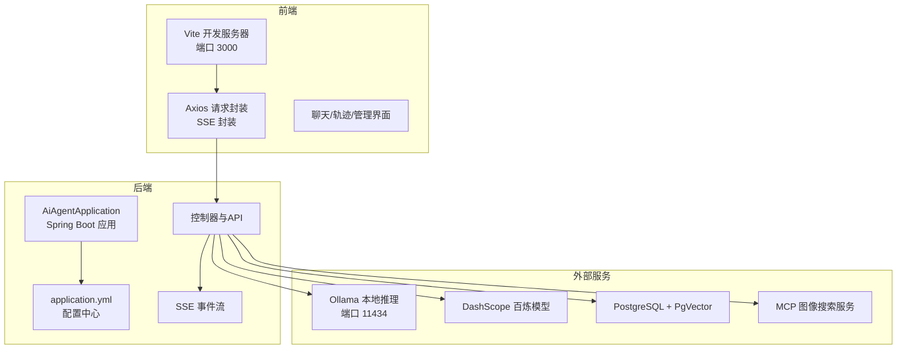
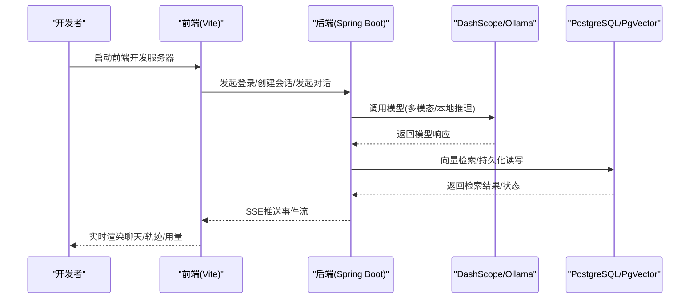
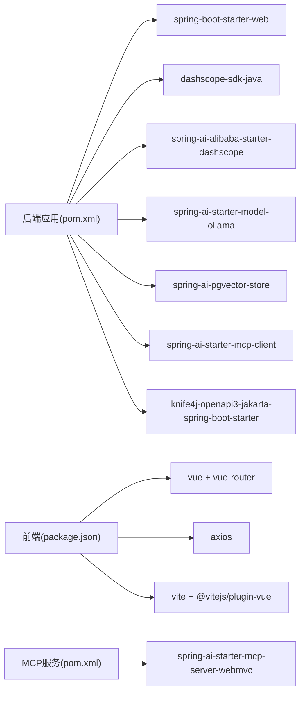

# 快速开始

<cite>
**本文引用的文件**
- [README.md](file://README.md)
- [pom.xml](file://pom.xml)
- [application.yml](file://src/main/resources/application.yml)
- [application-local.yml.example](file://src/main/resources/application-local.yml.example)
- [AiAgentApplication.java](file://src/main/java/com/yupi/yuaiagent/AiAgentApplication.java)
- [package.json](file://yu-ai-agent-frontend/package.json)
- [vite.config.js](file://yu-ai-agent-frontend/vite.config.js)
- [Dockerfile](file://yu-ai-agent-frontend/Dockerfile)
- [index.js](file://yu-ai-agent-frontend/src/api/index.js)
- [pom.xml（图像搜索MCP服务）](file://yu-image-search-mcp-server/pom.xml)
- [mcp-servers.json](file://src/main/resources/mcp-servers.json)
</cite>

## 目录
1. [简介](#简介)
2. [项目结构](#项目结构)
3. [核心组件](#核心组件)
4. [架构总览](#架构总览)
5. [详细组件分析](#详细组件分析)
6. [依赖关系分析](#依赖关系分析)
7. [性能注意事项](#性能注意事项)
8. [故障排查指南](#故障排查指南)
9. [结论](#结论)
10. [附录](#附录)

## 简介
本指南面向首次接触“全场景职场生存智囊Agent”项目的开发者，帮助你在30分钟内完成本地环境搭建、依赖安装、配置与启动，并进行首次运行验证。项目采用后端（Spring Boot + Spring AI）与前端（Vue 3 + Vite）分离架构，支持本地Ollama推理、DashScope百炼模型接入、PgVector向量检索、MCP服务扩展、SSE流式对话与多Agent协作。

## 项目结构
- 后端主工程：Spring Boot 应用，提供REST API与SSE事件流，包含多Agent运行时、工作流引擎、RAG、日历对接、收藏与用量统计等功能。
- 前端工程：Vue 3 应用，通过Vite开发服务器提供聊天界面、轨迹查看、管理员后台等页面。
- MCP服务：独立的图像搜索MCP服务，可作为外部工具服务被后端调用。
- 配置文件：application.yml集中管理后端配置，前端通过环境变量与代理决定API地址。

图表来源
- [AiAgentApplication.java:1-24](file://src/main/java/com/yupi/yuaiagent/AiAgentApplication.java#L1-L24)
- [application.yml:1-154](file://src/main/resources/application.yml#L1-L154)
- [index.js:1-210](file://yu-ai-agent-frontend/src/api/index.js#L1-L210)
- [vite.config.js:1-18](file://yu-ai-agent-frontend/vite.config.js#L1-L18)

章节来源
- [README.md:145-376](file://README.md#L145-L376)
- [pom.xml:1-233](file://pom.xml#L1-L233)
- [application.yml:1-154](file://src/main/resources/application.yml#L1-L154)

## 核心组件
- 后端启动类与排除配置：AiAgentApplication通过排除DataSource与Ollama自动配置，便于本地开发与DashScope优先使用。
- 配置体系：application.yml集中管理模型、向量库、日历、JWT、SSE、沙箱、MCP信任等配置；本地开发可复制application-local.yml.example生成本地配置文件。
- 前端请求封装：index.js封装Axios、SSE连接、登录与会话管理、收藏、导出导入、用量统计等API。
- 开发服务器：前端Vite默认监听3000端口，后端默认监听8123端口，API前缀为/api。

章节来源
- [AiAgentApplication.java:1-24](file://src/main/java/com/yupi/yuaiagent/AiAgentApplication.java#L1-L24)
- [application.yml:1-154](file://src/main/resources/application.yml#L1-L154)
- [application-local.yml.example:1-31](file://src/main/resources/application-local.yml.example#L1-L31)
- [index.js:1-210](file://yu-ai-agent-frontend/src/api/index.js#L1-L210)
- [vite.config.js:1-18](file://yu-ai-agent-frontend/vite.config.js#L1-L18)

## 架构总览
后端通过Spring MVC提供REST接口，使用Spring AI集成DashScope与Ollama，结合PgVector实现RAG检索；通过SSE向前端推送执行轨迹与对话事件。前端通过Axios与EventSource消费后端接口，提供聊天、收藏、轨迹、用量与管理员功能。

图表来源
- [index.js:78-107](file://yu-ai-agent-frontend/src/api/index.js#L78-L107)
- [application.yml:11-42](file://src/main/resources/application.yml#L11-L42)

章节来源
- [README.md:414-468](file://README.md#L414-L468)
- [application.yml:11-42](file://src/main/resources/application.yml#L11-L42)

## 详细组件分析

### 环境要求与安装步骤
- Java 与构建
  - JDK版本：Java 21（项目属性指定）
  - Maven：用于后端构建与依赖管理
- Node.js 与前端
  - Node.js 20+（前端Docker镜像使用node:20-alpine）
  - npm：用于安装依赖与构建
- 数据库与向量库
  - PostgreSQL（用于演示与后续扩展）
  - PgVector（向量检索，项目已集成依赖）
- 本地推理服务
  - Ollama（默认本地推理服务，端口11434）
- Docker（可选）
  - 用于打包前端静态资源或运行容器化服务
- 可选：MCP服务
  - 图像搜索MCP服务（独立Spring Boot应用）

章节来源
- [pom.xml:29-31](file://pom.xml#L29-L31)
- [pom.xml:75-94](file://pom.xml#L75-L94)
- [application.yml:21-24](file://src/main/resources/application.yml#L21-L24)
- [Dockerfile:1-17](file://yu-ai-agent-frontend/Dockerfile#L1-L17)

### 配置说明与本地开发准备
- 复制本地配置样例
  - 将application-local.yml.example复制为application-local.yml，填入DashScope与SearchAPI的API Key、JWT密钥与日历凭证（如需联调飞书/钉钉）
- 关键配置项
  - DashScope API Key：通过环境变量注入
  - Ollama基础URL与模型：默认指向本地11434端口
  - 向量库：PgVector相关配置在application.yml中预留，当前开发默认关闭数据源自动配置
  - JWT密钥：本地开发可使用示例密钥
  - 日历服务：provider与飞书/钉钉凭证
  - SSE与追踪：trace.stream.enabled默认开启
  - 沙箱：默认允许本地执行，生产建议启用Docker沙箱
- 启动类排除配置
  - AiAgentApplication排除了DataSource与Ollama自动配置，便于本地开发与DashScope优先使用

章节来源
- [application-local.yml.example:8-31](file://src/main/resources/application-local.yml.example#L8-L31)
- [application.yml:11-154](file://src/main/resources/application.yml#L11-L154)
- [AiAgentApplication.java:11-16](file://src/main/java/com/yupi/yuaiagent/AiAgentApplication.java#L11-L16)

### 首次运行验证
- 启动后端
  - 使用Maven启动Spring Boot应用（排除数据源与Ollama自动配置）
  - 端口：8123，API前缀：/api
- 启动前端
  - 安装依赖后启动Vite开发服务器（端口3000）
  - 访问 http://localhost:3000
- 登录与会话
  - 前端通过登录接口创建会话，随后发起对话
- SSE事件
  - 通过SSE订阅对话与轨迹事件，观察实时渲染

章节来源
- [AiAgentApplication.java:19-21](file://src/main/java/com/yupi/yuaiagent/AiAgentApplication.java#L19-L21)
- [vite.config.js:13-16](file://yu-ai-agent-frontend/vite.config.js#L13-L16)
- [index.js:78-107](file://yu-ai-agent-frontend/src/api/index.js#L78-L107)

### API测试示例与界面访问
- Swagger/Knife4j
  - Swagger UI路径：/swagger-ui.html
  - OpenAPI文档：/v3/api-docs
- SSE对话接口
  - 智能路由对话：/api/ai/orchestrator/chat（SSE）
  - 基础AI对话：/api/ai/ai_chat/chat/sse（SSE）
  - Manus超级智能体：/api/ai/manus/chat（SSE）
- 会话管理
  - 登录：POST /api/session/login
  - 创建会话：POST /api/session/create
  - 列表/归档/回收站/搜索/消息历史等
- 收藏与用量
  - 收藏：POST /api/favorite、DELETE /api/favorite/{id}、GET /api/favorite/list
  - 用量：GET /api/usage/stats
- 导出导入
  - 导出：GET /api/export/all（带token）
  - 导入：POST /api/export/import

章节来源
- [application.yml:45-61](file://src/main/resources/application.yml#L45-L61)
- [README.md:414-468](file://README.md#L414-L468)
- [index.js:78-209](file://yu-ai-agent-frontend/src/api/index.js#L78-L209)

### 常见环境配置问题与解决方案
- DashScope API Key未配置
  - 现象：模型调用失败或返回鉴权错误
  - 解决：在application-local.yml或环境变量中正确设置DASHSCOPE_API_KEY
- Ollama未启动或端口冲突
  - 现象：本地推理调用超时
  - 解决：确保Ollama服务运行于默认端口11434，或在application.yml中调整base-url
- PgVector未启用
  - 现象：向量检索报错或无数据
  - 解决：按需启用数据源与向量库配置（当前开发默认关闭数据源自动配置）
- JWT密钥不一致导致401
  - 现象：前端收到401并自动重试登录
  - 解决：前后端使用相同JWT密钥，或在本地开发使用示例密钥
- 前端跨域与代理
  - 现象：开发环境下CORS错误
  - 解决：Vite默认开启CORS；若使用代理，请确保代理转发至后端/api路径
- MCP服务未启动
  - 现象：MCP客户端无法连接
  - 解决：启动图像搜索MCP服务或在application.yml中注释相关配置

章节来源
- [application.yml:11-24](file://src/main/resources/application.yml#L11-L24)
- [application.yml:148-154](file://src/main/resources/application.yml#L148-L154)
- [index.js:12-67](file://yu-ai-agent-frontend/src/api/index.js#L12-L67)
- [pom.xml:75-94](file://pom.xml#L75-L94)

## 依赖关系分析
- 后端依赖
  - Spring Boot Starter Web、DashScope SDK、Spring AI DashScope Starter、Spring AI Ollama Starter、PgVector向量存储、Spring AI MCP客户端、Knife4j OpenAPI、Kryo序列化、Jsoup、iText PDF、Hutool等
- 前端依赖
  - Vue 3、Vue Router、Axios、marked、@vitejs/plugin-vue、Vite
- MCP服务
  - Spring AI MCP Server WebMVC Starter

图表来源
- [pom.xml:50-170](file://pom.xml#L50-L170)
- [package.json:6-21](file://yu-ai-agent-frontend/package.json#L6-L21)
- [pom.xml（图像搜索MCP服务）:43-66](file://yu-image-search-mcp-server/pom.xml#L43-L66)

章节来源
- [pom.xml:1-233](file://pom.xml#L1-L233)
- [package.json:1-23](file://yu-ai-agent-frontend/package.json#L1-L23)
- [pom.xml（图像搜索MCP服务）:1-121](file://yu-image-search-mcp-server/pom.xml#L1-L121)

## 性能注意事项
- SSE事件流：前端通过EventSource订阅，注意浏览器对SSE连接数量与断线重连的限制
- Token预算与记忆压缩：通过配置token阈值、轮数阈值与保留轮数控制长对话性能
- 向量检索：合理设置PgVector索引类型与距离度量，避免大规模检索阻塞
- 本地推理：Ollama模型大小与并发请求会影响响应时间，建议在开发环境使用轻量模型

章节来源
- [application.yml:120-129](file://src/main/resources/application.yml#L120-L129)
- [application.yml:110-119](file://src/main/resources/application.yml#L110-L119)

## 故障排查指南
- 后端启动失败
  - 检查Java版本是否为21，Maven依赖是否拉取成功
  - 确认application-local.yml已复制并正确填写密钥
- 前端无法访问后端API
  - 确认后端端口8123与API前缀/api
  - 检查Vite代理与CORS设置
- SSE连接异常
  - 检查后端SSE开关与事件流实现
  - 确保前端EventSource正确拼接参数
- MCP连接失败
  - 确认MCP服务已启动，或在application.yml中注释相关配置
- 导入导出失败
  - 确认token有效，导出ZIP路径与权限

章节来源
- [index.js:69-76](file://yu-ai-agent-frontend/src/api/index.js#L69-L76)
- [application.yml:114-116](file://src/main/resources/application.yml#L114-L116)
- [mcp-servers.json](file://src/main/resources/mcp-servers.json)

## 结论
按照本指南，你可以在30分钟内完成环境准备、依赖安装、配置与启动，并通过前端界面与SSE事件流验证后端核心能力。建议在本地开发完成后，逐步启用数据库与向量库配置，完善密钥注入与安全策略，最终完成容器化部署。

## 附录
- 前端Docker构建
  - 使用node:20-alpine构建，产物复制至nginx:alpine托管，暴露80端口
- 启动顺序建议
  - 先启动后端（8123），再启动前端（3000），最后按需启动Ollama/MCP服务

章节来源
- [Dockerfile:1-17](file://yu-ai-agent-frontend/Dockerfile#L1-L17)
- [vite.config.js:13-16](file://yu-ai-agent-frontend/vite.config.js#L13-L16)