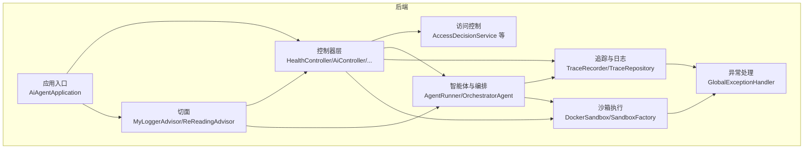
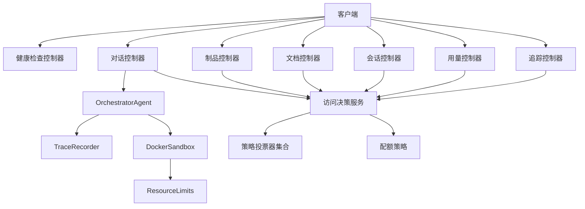
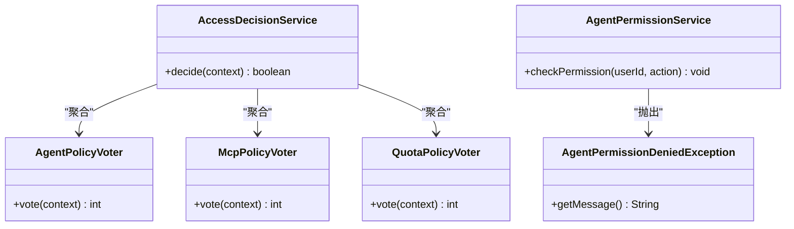
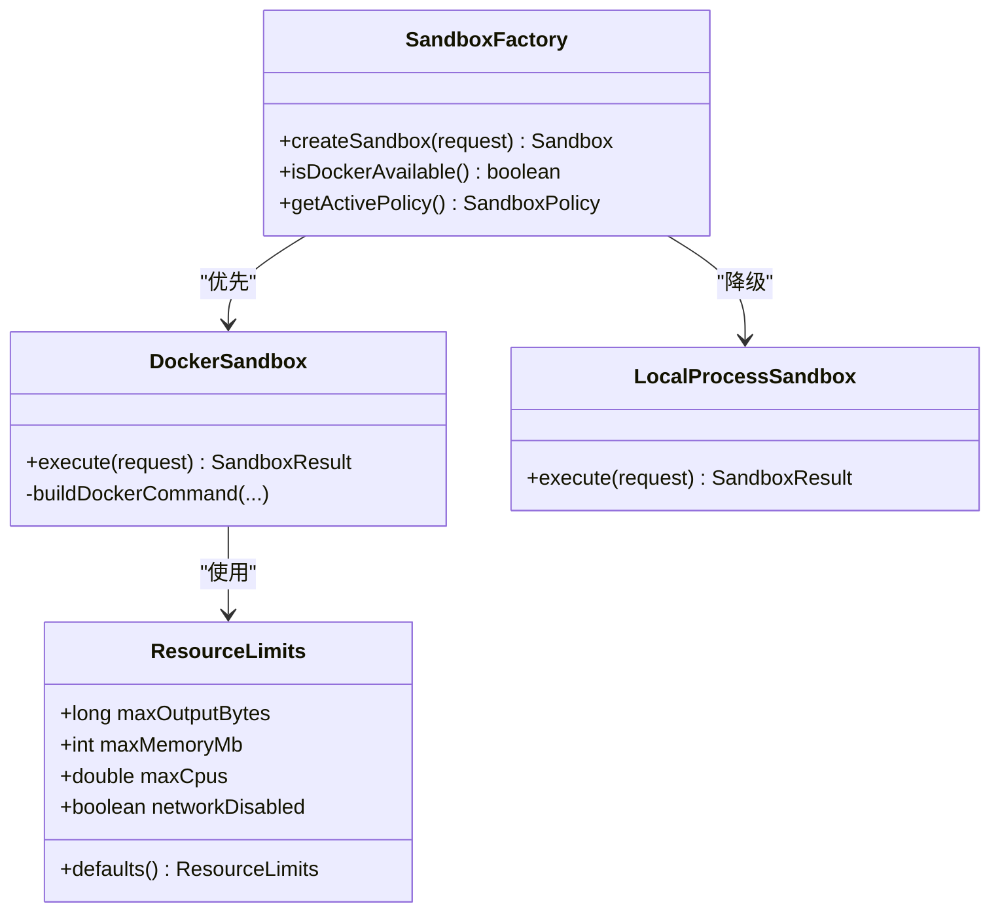
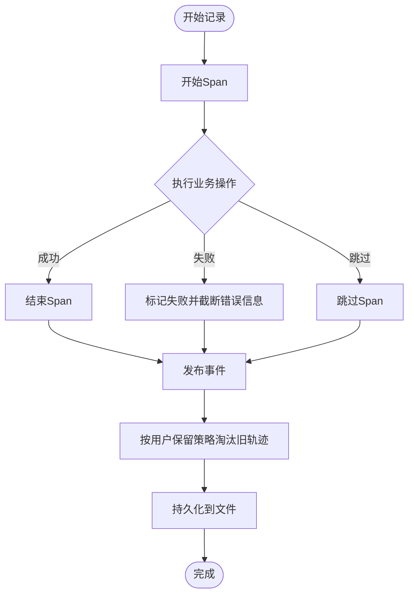
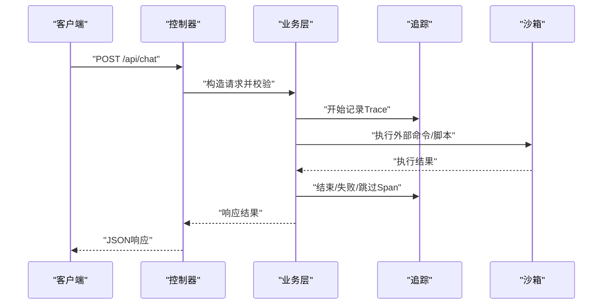
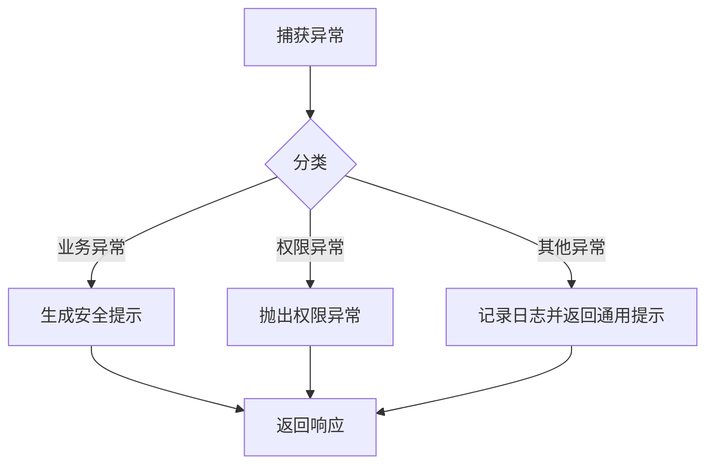
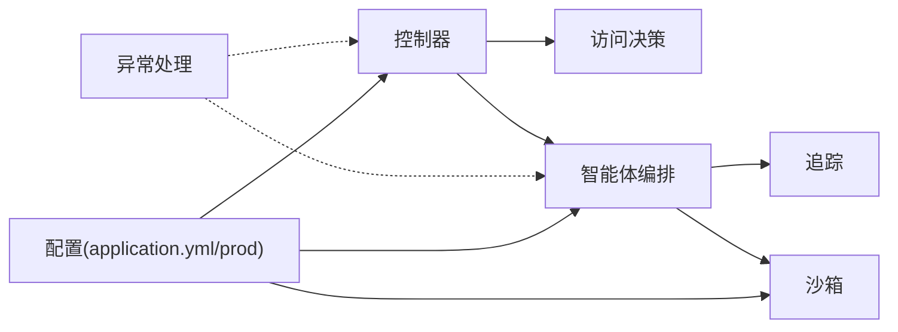

# 故障排除和常见问题

<cite>
**本文引用的文件**
- [GlobalExceptionHandler.java](file://src/main/java/com/yupi/yuaiagent/exception/GlobalExceptionHandler.java)
- [CalendarApiErrorHandlingPropertyTest.java](file://src/test/java/com/yupi/yuaiagent/calendar/CalendarApiErrorHandlingPropertyTest.java)
- [TraceRecorder.java](file://src/main/java/com/yupi/yuaiagent/trace/TraceRecorder.java)
- [TraceProperties.java](file://src/main/java/com/yupi/yuaiagent/trace/TraceProperties.java)
- [TraceRepository.java](file://src/main/java/com/yupi/yuaiagent/trace/TraceRepository.java)
- [TraceRecorderPropertyTest.java](file://src/test/java/com/yupi/yuaiagent/trace/TraceRecorderPropertyTest.java)
- [DockerSandbox.java](file://src/main/java/com/yupi/yuaiagent/sandbox/DockerSandbox.java)
- [ResourceLimits.java](file://src/main/java/com/yupi/yuaiagent/sandbox/ResourceLimits.java)
- [SandboxFactory.java](file://src/main/java/com/yupi/yuaiagent/sandbox/SandboxFactory.java)
- [application.yml](file://src/main/resources/application.yml)
- [application-prod.yml](file://src/main/resources/application-prod.yml)
- [AccessDecisionService.java](file://src/main/java/com/yupi/yuaiagent/access/AccessDecisionService.java)
- [AgentPolicyVoter.java](file://src/main/java/com/yupi/yuaiagent/access/AgentPolicyVoter.java)
- [McpPolicyVoter.java](file://src/main/java/com/yupi/yuaiagent/access/McpPolicyVoter.java)
- [QuotaPolicyVoter.java](file://src/main/java/com/yupi/yuaiagent/access/QuotaPolicyVoter.java)
- [AgentPermissionService.java](file://src/main/java/com/yupi/yuaiagent/permission/AgentPermissionService.java)
- [AgentPermissionDeniedException.java](file://src/main/java/com/yupi/yuaiagent/permission/AgentPermissionDeniedException.java)
- [HealthController.java](file://src/main/java/com/yupi/yuaiagent/controller/HealthController.java)
- [AiController.java](file://src/main/java/com/yupi/yuaiagent/controller/AiController.java)
- [ArtifactController.java](file://src/main/java/com/yupi/yuaiagent/controller/ArtifactController.java)
- [DocumentController.java](file://src/main/java/com/yupi/yuaiagent/controller/DocumentController.java)
- [SessionController.java](file://src/main/java/com/yupi/yuaiagent/controller/SessionController.java)
- [UsageController.java](file://src/main/java/com/yupi/yuaiagent/controller/UsageController.java)
- [TraceController.java](file://src/main/java/com/yupi/yuaiagent/controller/TraceController.java)
- [MyLoggerAdvisor.java](file://src/main/java/com/yupi/yuaiagent/advisor/MyLoggerAdvisor.java)
- [ReReadingAdvisor.java](file://src/main/java/com/yupi/yuaiagent/advisor/ReReadingAdvisor.java)
- [AiAgentApplication.java](file://src/main/java/com/yupi/yuaiagent/AiAgentApplication.java)
- [README.md](file://README.md)
</cite>

## 目录
1. [简介](#简介)
2. [项目结构](#项目结构)
3. [核心组件](#核心组件)
4. [架构总览](#架构总览)
5. [详细组件分析](#详细组件分析)
6. [依赖关系分析](#依赖关系分析)
7. [性能考虑](#性能考虑)
8. [故障排除指南](#故障排除指南)
9. [结论](#结论)
10. [附录](#附录)

## 简介
本指南聚焦于开发与运维过程中的常见问题与排错实践，涵盖环境配置、依赖冲突与版本兼容性、系统性能与并发、API调用与权限安全、数据库与外部服务集成、以及调试与日志分析等主题。文档基于实际代码实现与测试用例提炼，提供可操作的诊断步骤、修复建议与预防措施，帮助用户与开发者快速定位并解决问题。

## 项目结构
后端采用Spring Boot工程，核心模块包括：
- 访问控制与权限：访问决策、策略投票器、配额与策略
- 多智能体运行与编排：AgentRunner、OrchestratorAgent、TaskExecutor
- 日志与追踪：TraceRecorder、TraceRepository、TraceProperties
- 沙箱执行：DockerSandbox、LocalProcessSandbox、SandboxFactory、ResourceLimits
- 控制器层：健康检查、对话、制品、文档、会话、用量、追踪等
- 异常处理：全局异常处理器
- 辅助：日志切面、重读切面、应用入口

**图表来源**
- [AiAgentApplication.java](file://src/main/java/com/yupi/yuaiagent/AiAgentApplication.java)
- [AccessDecisionService.java](file://src/main/java/com/yupi/yuaiagent/access/AccessDecisionService.java)
- [DockerSandbox.java](file://src/main/java/com/yupi/yuaiagent/sandbox/DockerSandbox.java)
- [TraceRecorder.java](file://src/main/java/com/yupi/yuaiagent/trace/TraceRecorder.java)
- [GlobalExceptionHandler.java](file://src/main/java/com/yupi/yuaiagent/exception/GlobalExceptionHandler.java)
- [MyLoggerAdvisor.java](file://src/main/java/com/yupi/yuaiagent/advisor/MyLoggerAdvisor.java)

**章节来源**
- [AiAgentApplication.java](file://src/main/java/com/yupi/yuaiagent/AiAgentApplication.java)
- [README.md](file://README.md)

## 核心组件
- 访问控制与权限：通过策略投票器聚合多策略，结合配额与策略进行最终决策；权限不足抛出专用异常，便于统一拦截与提示。
- 沙箱执行：支持Docker与本地进程两种模式，具备CPU/内存/网络/输出大小等限制；自动检测Docker可用性并选择策略。
- 追踪与日志：提供链路追踪记录、分页查询、文件持久化与保留策略；对错误消息长度进行钳制，避免过大日志。
- 控制器层：提供健康检查、对话生成、制品管理、文档导入导出、会话检索、用量统计、追踪详情等接口。
- 全局异常处理：对外屏蔽内部细节，返回友好提示，并记录日志，保障用户体验与安全。

**章节来源**
- [AccessDecisionService.java](file://src/main/java/com/yupi/yuaiagent/access/AccessDecisionService.java)
- [AgentPolicyVoter.java](file://src/main/java/com/yupi/yuaiagent/access/AgentPolicyVoter.java)
- [McpPolicyVoter.java](file://src/main/java/com/yupi/yuaiagent/access/McpPolicyVoter.java)
- [QuotaPolicyVoter.java](file://src/main/java/com/yupi/yuaiagent/access/QuotaPolicyVoter.java)
- [AgentPermissionService.java](file://src/main/java/com/yupi/yuaiagent/permission/AgentPermissionService.java)
- [AgentPermissionDeniedException.java](file://src/main/java/com/yupi/yuaiagent/permission/AgentPermissionDeniedException.java)
- [DockerSandbox.java](file://src/main/java/com/yupi/yuaiagent/sandbox/DockerSandbox.java)
- [ResourceLimits.java](file://src/main/java/com/yupi/yuaiagent/sandbox/ResourceLimits.java)
- [SandboxFactory.java](file://src/main/java/com/yupi/yuaiagent/sandbox/SandboxFactory.java)
- [TraceRecorder.java](file://src/main/java/com/yupi/yuaiagent/trace/TraceRecorder.java)
- [TraceRepository.java](file://src/main/java/com/yupi/yuaiagent/trace/TraceRepository.java)
- [TraceProperties.java](file://src/main/java/com/yupi/yuaiagent/trace/TraceProperties.java)
- [HealthController.java](file://src/main/java/com/yupi/yuaiagent/controller/HealthController.java)
- [AiController.java](file://src/main/java/com/yupi/yuaiagent/controller/AiController.java)
- [ArtifactController.java](file://src/main/java/com/yupi/yuaiagent/controller/ArtifactController.java)
- [DocumentController.java](file://src/main/java/com/yupi/yuaiagent/controller/DocumentController.java)
- [SessionController.java](file://src/main/java/com/yupi/yuaiagent/controller/SessionController.java)
- [UsageController.java](file://src/main/java/com/yupi/yuaiagent/controller/UsageController.java)
- [TraceController.java](file://src/main/java/com/yupi/yuaiagent/controller/TraceController.java)
- [GlobalExceptionHandler.java](file://src/main/java/com/yupi/yuaiagent/exception/GlobalExceptionHandler.java)

## 架构总览
系统围绕“控制器-业务-追踪-沙箱”四层展开，控制器负责请求接入与参数校验，业务层执行智能体逻辑，追踪贯穿全程记录状态与错误，沙箱隔离执行外部命令与脚本，异常处理统一对外输出。

**图表来源**
- [HealthController.java](file://src/main/java/com/yupi/yuaiagent/controller/HealthController.java)
- [AiController.java](file://src/main/java/com/yupi/yuaiagent/controller/AiController.java)
- [ArtifactController.java](file://src/main/java/com/yupi/yuaiagent/controller/ArtifactController.java)
- [DocumentController.java](file://src/main/java/com/yupi/yuaiagent/controller/DocumentController.java)
- [SessionController.java](file://src/main/java/com/yupi/yuaiagent/controller/SessionController.java)
- [UsageController.java](file://src/main/java/com/yupi/yuaiagent/controller/UsageController.java)
- [TraceController.java](file://src/main/java/com/yupi/yuaiagent/controller/TraceController.java)
- [AccessDecisionService.java](file://src/main/java/com/yupi/yuaiagent/access/AccessDecisionService.java)
- [AgentPolicyVoter.java](file://src/main/java/com/yupi/yuaiagent/access/AgentPolicyVoter.java)
- [McpPolicyVoter.java](file://src/main/java/com/yupi/yuaiagent/access/McpPolicyVoter.java)
- [QuotaPolicyVoter.java](file://src/main/java/com/yupi/yuaiagent/access/QuotaPolicyVoter.java)
- [DockerSandbox.java](file://src/main/java/com/yupi/yuaiagent/sandbox/DockerSandbox.java)
- [ResourceLimits.java](file://src/main/java/com/yupi/yuaiagent/sandbox/ResourceLimits.java)
- [TraceRecorder.java](file://src/main/java/com/yupi/yuaiagent/trace/TraceRecorder.java)

## 详细组件分析

### 访问控制与权限
- 策略投票器：聚合多策略（如代理策略、MCP信任策略、配额策略），通过多数通过决定是否放行。
- 权限服务：集中判定与审计，权限不足抛出专用异常，便于全局拦截。
- 配额策略：限制资源消耗，防止滥用。

**图表来源**
- [AccessDecisionService.java](file://src/main/java/com/yupi/yuaiagent/access/AccessDecisionService.java)
- [AgentPolicyVoter.java](file://src/main/java/com/yupi/yuaiagent/access/AgentPolicyVoter.java)
- [McpPolicyVoter.java](file://src/main/java/com/yupi/yuaiagent/access/McpPolicyVoter.java)
- [QuotaPolicyVoter.java](file://src/main/java/com/yupi/yuaiagent/access/QuotaPolicyVoter.java)
- [AgentPermissionService.java](file://src/main/java/com/yupi/yuaiagent/permission/AgentPermissionService.java)
- [AgentPermissionDeniedException.java](file://src/main/java/com/yupi/yuaiagent/permission/AgentPermissionDeniedException.java)

**章节来源**
- [AccessDecisionService.java](file://src/main/java/com/yupi/yuaiagent/access/AccessDecisionService.java)
- [AgentPolicyVoter.java](file://src/main/java/com/yupi/yuaiagent/access/AgentPolicyVoter.java)
- [McpPolicyVoter.java](file://src/main/java/com/yupi/yuaiagent/access/McpPolicyVoter.java)
- [QuotaPolicyVoter.java](file://src/main/java/com/yupi/yuaiagent/access/QuotaPolicyVoter.java)
- [AgentPermissionService.java](file://src/main/java/com/yupi/yuaiagent/permission/AgentPermissionService.java)
- [AgentPermissionDeniedException.java](file://src/main/java/com/yupi/yuaiagent/permission/AgentPermissionDeniedException.java)

### 沙箱执行与资源限制
- Docker沙箱：支持CPU核数、内存、网络隔离、只读根文件系统、工作目录挂载与临时目录设置；默认最大输出大小用于防日志膨胀。
- 本地沙箱：作为降级方案，适合开发与测试。
- 资源限制：统一在ResourceLimits中定义默认值与构建器，便于统一配置与校验。
- 策略工厂：自动检测Docker可用性，选择合适策略；生产环境默认更严格。

**图表来源**
- [SandboxFactory.java](file://src/main/java/com/yupi/yuaiagent/sandbox/SandboxFactory.java)
- [DockerSandbox.java](file://src/main/java/com/yupi/yuaiagent/sandbox/DockerSandbox.java)
- [ResourceLimits.java](file://src/main/java/com/yupi/yuaiagent/sandbox/ResourceLimits.java)

**章节来源**
- [DockerSandbox.java](file://src/main/java/com/yupi/yuaiagent/sandbox/DockerSandbox.java)
- [ResourceLimits.java](file://src/main/java/com/yupi/yuaiagent/sandbox/ResourceLimits.java)
- [SandboxFactory.java](file://src/main/java/com/yupi/yuaiagent/sandbox/SandboxFactory.java)

### 追踪与日志
- 追踪记录：开始/结束/失败/跳过span，失败时截断错误信息长度，避免日志过大。
- 仓库与保留策略：按用户维度限制轨迹数量，超过上限按最早到最晚顺序淘汰。
- 属性钳制：对最大span数、元数据单值长度、每用户最大轨迹数进行范围钳制并记录告警。
- 测试验证：错误消息长度边界性测试，确保不会越界。

**图表来源**
- [TraceRecorder.java](file://src/main/java/com/yupi/yuaiagent/trace/TraceRecorder.java)
- [TraceRepository.java](file://src/main/java/com/yupi/yuaiagent/trace/TraceRepository.java)
- [TraceProperties.java](file://src/main/java/com/yupi/yuaiagent/trace/TraceProperties.java)

**章节来源**
- [TraceRecorder.java](file://src/main/java/com/yupi/yuaiagent/trace/TraceRecorder.java)
- [TraceRepository.java](file://src/main/java/com/yupi/yuaiagent/trace/TraceRepository.java)
- [TraceProperties.java](file://src/main/java/com/yupi/yuaiagent/trace/TraceProperties.java)
- [TraceRecorderPropertyTest.java](file://src/test/java/com/yupi/yuaiagent/trace/TraceRecorderPropertyTest.java)

### 控制器层与API调用
- 健康检查：快速判断服务可用性。
- 对话与会话：生成回复、检索会话、分页查询。
- 制品与文档：制品管理、导入导出、知识库浏览。
- 用量统计：追踪资源使用情况。
- 追踪详情：查看执行轨迹与状态。

**图表来源**
- [AiController.java](file://src/main/java/com/yupi/yuaiagent/controller/AiController.java)
- [SessionController.java](file://src/main/java/com/yupi/yuaiagent/controller/SessionController.java)
- [ArtifactController.java](file://src/main/java/com/yupi/yuaiagent/controller/ArtifactController.java)
- [DocumentController.java](file://src/main/java/com/yupi/yuaiagent/controller/DocumentController.java)
- [UsageController.java](file://src/main/java/com/yupi/yuaiagent/controller/UsageController.java)
- [TraceController.java](file://src/main/java/com/yupi/yuaiagent/controller/TraceController.java)
- [TraceRecorder.java](file://src/main/java/com/yupi/yuaiagent/trace/TraceRecorder.java)
- [DockerSandbox.java](file://src/main/java/com/yupi/yuaiagent/sandbox/DockerSandbox.java)

**章节来源**
- [HealthController.java](file://src/main/java/com/yupi/yuaiagent/controller/HealthController.java)
- [AiController.java](file://src/main/java/com/yupi/yuaiagent/controller/AiController.java)
- [ArtifactController.java](file://src/main/java/com/yupi/yuaiagent/controller/ArtifactController.java)
- [DocumentController.java](file://src/main/java/com/yupi/yuaiagent/controller/DocumentController.java)
- [SessionController.java](file://src/main/java/com/yupi/yuaiagent/controller/SessionController.java)
- [UsageController.java](file://src/main/java/com/yupi/yuaiagent/controller/UsageController.java)
- [TraceController.java](file://src/main/java/com/yupi/yuaiagent/controller/TraceController.java)

### 全局异常处理与安全
- 统一异常处理：对外屏蔽内部异常细节，返回用户友好的提示；记录日志以便排查。
- 测试验证：针对日历API异常场景，验证不泄露原始异常内容、固定友好提示、建议重试与人工客服。
- 权限异常：权限不足抛出专用异常，便于前端展示与审计。

**图表来源**
- [GlobalExceptionHandler.java](file://src/main/java/com/yupi/yuaiagent/exception/GlobalExceptionHandler.java)
- [CalendarApiErrorHandlingPropertyTest.java](file://src/test/java/com/yupi/yuaiagent/calendar/CalendarApiErrorHandlingPropertyTest.java)
- [AgentPermissionDeniedException.java](file://src/main/java/com/yupi/yuaiagent/permission/AgentPermissionDeniedException.java)

**章节来源**
- [GlobalExceptionHandler.java](file://src/main/java/com/yupi/yuaiagent/exception/GlobalExceptionHandler.java)
- [CalendarApiErrorHandlingPropertyTest.java](file://src/test/java/com/yupi/yuaiagent/calendar/CalendarApiErrorHandlingPropertyTest.java)
- [AgentPermissionDeniedException.java](file://src/main/java/com/yupi/yuaiagent/permission/AgentPermissionDeniedException.java)

## 依赖关系分析
- 组件耦合：控制器依赖访问决策与业务层；业务层依赖追踪与沙箱；异常处理横切所有路径。
- 外部依赖：Docker（沙箱）、外部日历服务（测试覆盖了多种失败场景）、文件I/O（追踪持久化）。
- 配置：application.yml与application-prod.yml提供运行时参数，注意敏感信息不应提交。

**图表来源**
- [AiAgentApplication.java](file://src/main/java/com/yupi/yuaiagent/AiAgentApplication.java)
- [application.yml](file://src/main/resources/application.yml)
- [application-prod.yml](file://src/main/resources/application-prod.yml)

**章节来源**
- [application.yml](file://src/main/resources/application.yml)
- [application-prod.yml](file://src/main/resources/application-prod.yml)

## 性能考虑
- 追踪与日志
  - 错误消息长度限制：避免超长错误文本导致日志膨胀与存储压力。
  - 保留策略：按用户维度限制轨迹数量，定期淘汰旧数据，降低内存占用。
  - 文件I/O：持久化采用异步写入与锁保护，避免并发写冲突。
- 沙箱执行
  - 资源限制：CPU核数、内存、网络隔离与输出大小限制，防止资源滥用。
  - Docker可用性检测：自动降级至本地沙箱，提升稳定性。
- 并发与线程
  - 追踪仓库使用读写锁，保障高并发下的数据一致性。
  - 控制器层应避免阻塞操作，必要时引入异步或队列。

**章节来源**
- [TraceRecorder.java](file://src/main/java/com/yupi/yuaiagent/trace/TraceRecorder.java)
- [TraceRepository.java](file://src/main/java/com/yupi/yuaiagent/trace/TraceRepository.java)
- [TraceProperties.java](file://src/main/java/com/yupi/yuaiagent/trace/TraceProperties.java)
- [DockerSandbox.java](file://src/main/java/com/yupi/yuaiagent/sandbox/DockerSandbox.java)
- [ResourceLimits.java](file://src/main/java/com/yupi/yuaiagent/sandbox/ResourceLimits.java)
- [SandboxFactory.java](file://src/main/java/com/yupi/yuaiagent/sandbox/SandboxFactory.java)

## 故障排除指南

### 环境配置问题
- Docker不可用
  - 症状：沙箱执行失败、提示Docker相关错误。
  - 排查：确认Docker服务状态、版本与权限；检查命令可用性。
  - 修复：安装/升级Docker，授予必要权限；或调整配置启用本地沙箱。
- 配置文件未生效
  - 症状：某些参数未按预期生效。
  - 排查：对比application.yml与application-prod.yml，确认覆盖顺序与键名正确。
  - 修复：修正键名与值范围，避免提交敏感信息。

**章节来源**
- [SandboxFactory.java](file://src/main/java/com/yupi/yuaiagent/sandbox/SandboxFactory.java)
- [application.yml](file://src/main/resources/application.yml)
- [application-prod.yml](file://src/main/resources/application-prod.yml)

### 依赖冲突与版本兼容性
- Docker CLI版本不匹配
  - 症状：沙箱启动失败或超时。
  - 排查：执行Docker版本检测命令，确认返回码与输出格式。
  - 修复：升级Docker CLI至受支持版本。
- 外部服务API变更
  - 症状：日历服务调用失败、返回未知错误码。
  - 排查：查看异常处理器日志，确认是否为超时、限流或鉴权失败。
  - 修复：根据错误类型增加重试、熔断或降级策略。

**章节来源**
- [SandboxFactory.java](file://src/main/java/com/yupi/yuaiagent/sandbox/SandboxFactory.java)
- [CalendarApiErrorHandlingPropertyTest.java](file://src/test/java/com/yupi/yuaiagent/calendar/CalendarApiErrorHandlingPropertyTest.java)

### 系统性能问题与并发
- 追踪数据过多导致内存/磁盘压力
  - 症状：内存占用升高、IO延迟增大。
  - 排查：检查TraceProperties配置与TraceRepository保留策略。
  - 修复：降低每用户最大轨迹数或缩短span上限，优化分页查询。
- 沙箱执行卡顿或超时
  - 症状：命令长时间无响应。
  - 排查：检查资源限制（CPU/内存/网络）、输出大小与工作目录权限。
  - 修复：提高资源限额或减少并发，必要时启用本地沙箱。

**章节来源**
- [TraceProperties.java](file://src/main/java/com/yupi/yuaiagent/trace/TraceProperties.java)
- [TraceRepository.java](file://src/main/java/com/yupi/yuaiagent/trace/TraceRepository.java)
- [DockerSandbox.java](file://src/main/java/com/yupi/yuaiagent/sandbox/DockerSandbox.java)
- [ResourceLimits.java](file://src/main/java/com/yupi/yuaiagent/sandbox/ResourceLimits.java)

### API调用错误、权限问题与安全异常
- API调用失败
  - 症状：返回用户友好提示但未说明具体原因。
  - 排查：查看全局异常处理器日志，确认是否为超时、限流或鉴权失败。
  - 修复：增加重试、指数退避与熔断；完善鉴权与配额策略。
- 权限不足
  - 症状：抛出权限异常，前端显示拒绝访问。
  - 排查：检查策略投票器与配额策略，确认当前用户角色与资源配额。
  - 修复：调整权限配置或提升配额。

**章节来源**
- [GlobalExceptionHandler.java](file://src/main/java/com/yupi/yuaiagent/exception/GlobalExceptionHandler.java)
- [CalendarApiErrorHandlingPropertyTest.java](file://src/test/java/com/yupi/yuaiagent/calendar/CalendarApiErrorHandlingPropertyTest.java)
- [AgentPermissionDeniedException.java](file://src/main/java/com/yupi/yuaiagent/permission/AgentPermissionDeniedException.java)

### 数据库连接、网络通信与外部服务集成
- 文件存储与追踪持久化
  - 症状：追踪无法保存或加载。
  - 排查：检查存储文件是否存在、权限是否正确、序列化/反序列化是否异常。
  - 修复：修复文件权限，清理损坏文件，必要时迁移数据。
- 外部服务集成
  - 症状：日历服务调用失败。
  - 排查：查看异常处理器日志，区分超时、限流、鉴权失败等场景。
  - 修复：增加超时与重试配置，必要时切换供应商或启用缓存。

**章节来源**
- [TraceRepository.java](file://src/main/java/com/yupi/yuaiagent/trace/TraceRepository.java)
- [CalendarApiErrorHandlingPropertyTest.java](file://src/test/java/com/yupi/yuaiagent/calendar/CalendarApiErrorHandlingPropertyTest.java)

### 调试工具使用、日志分析与问题定位
- 追踪与日志
  - 使用TraceRecorder记录关键节点，失败时截断错误信息长度，便于日志分析。
  - 查看TraceRepository保留策略与文件I/O日志，定位数据积压或写入失败。
- 切面与拦截
  - 使用日志切面记录请求/响应与耗时，辅助定位慢调用。
  - 使用重读切面复现实验性问题，便于回归测试。
- 全局异常处理
  - 关注异常处理器日志，确保不泄露内部细节；根据错误类型制定恢复策略。

**章节来源**
- [TraceRecorder.java](file://src/main/java/com/yupi/yuaiagent/trace/TraceRecorder.java)
- [TraceRepository.java](file://src/main/java/com/yupi/yuaiagent/trace/TraceRepository.java)
- [MyLoggerAdvisor.java](file://src/main/java/com/yupi/yuaiagent/advisor/MyLoggerAdvisor.java)
- [ReReadingAdvisor.java](file://src/main/java/com/yupi/yuaiagent/advisor/ReReadingAdvisor.java)
- [GlobalExceptionHandler.java](file://src/main/java/com/yupi/yuaiagent/exception/GlobalExceptionHandler.java)

## 结论
本指南从访问控制、沙箱执行、追踪日志、控制器与异常处理等维度梳理了常见问题与排错路径。建议在生产环境中：
- 明确配置范围与覆盖顺序，避免敏感信息泄露；
- 合理设置沙箱资源限制与保留策略，保障系统稳定；
- 通过全局异常处理与日志切面形成闭环，快速定位问题；
- 针对外部服务建立重试、熔断与降级机制，提升韧性。

## 附录
- 开发与测试最佳实践
  - 使用属性测试覆盖异常场景，确保异常处理稳健；
  - 对关键流程添加追踪span，失败时截断错误信息长度；
  - 在生产配置中仅保留必要参数，避免硬编码敏感信息。

**章节来源**
- [TraceRecorderPropertyTest.java](file://src/test/java/com/yupi/yuaiagent/trace/TraceRecorderPropertyTest.java)
- [CalendarApiErrorHandlingPropertyTest.java](file://src/test/java/com/yupi/yuaiagent/calendar/CalendarApiErrorHandlingPropertyTest.java)
- [application-prod.yml](file://src/main/resources/application-prod.yml)