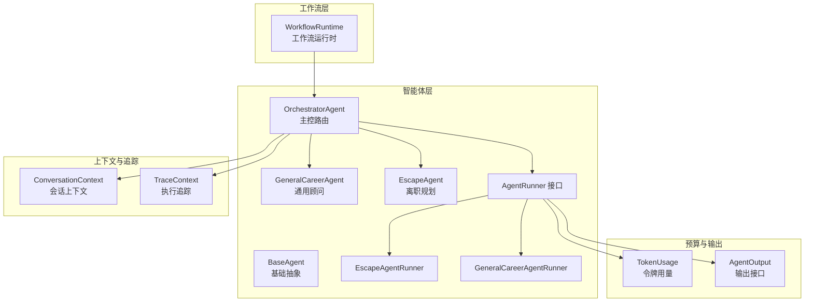
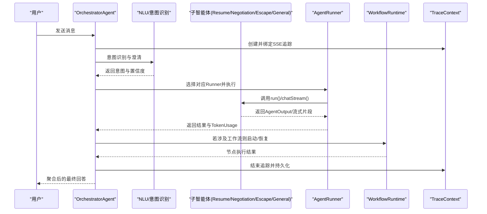
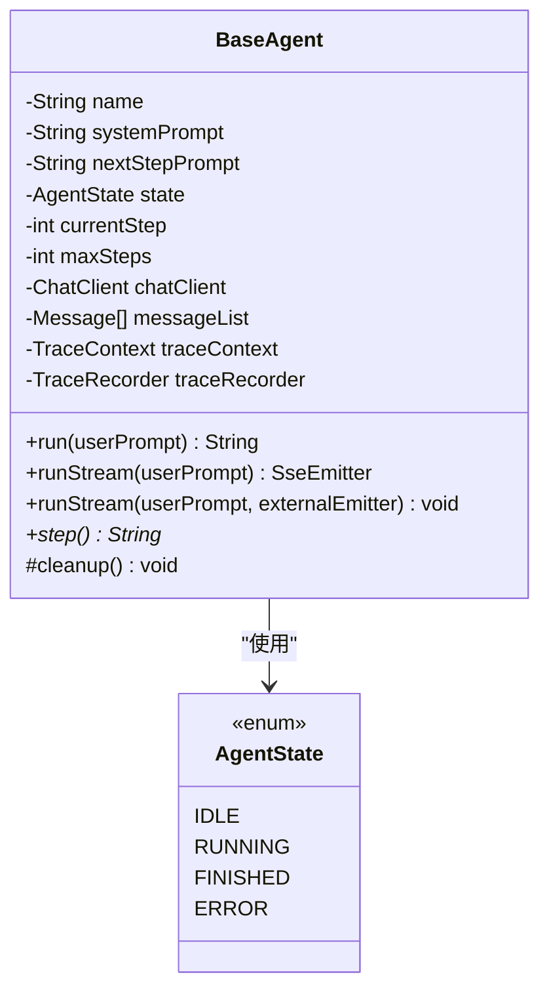
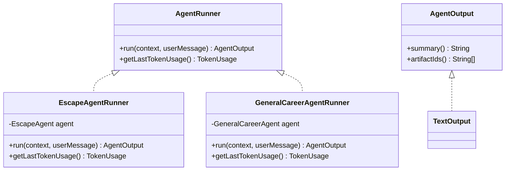
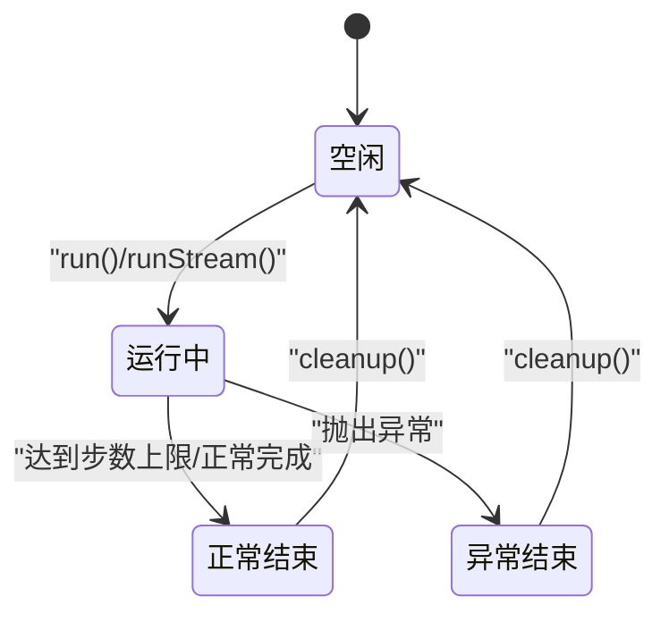
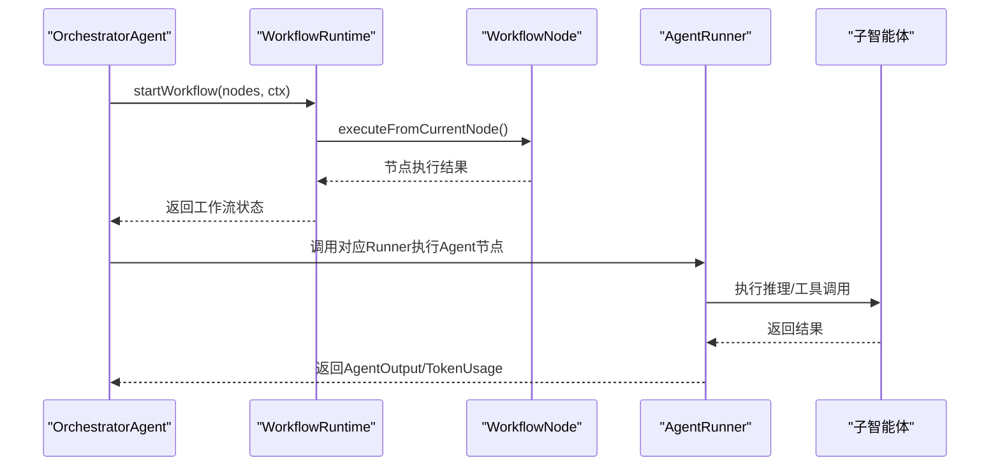
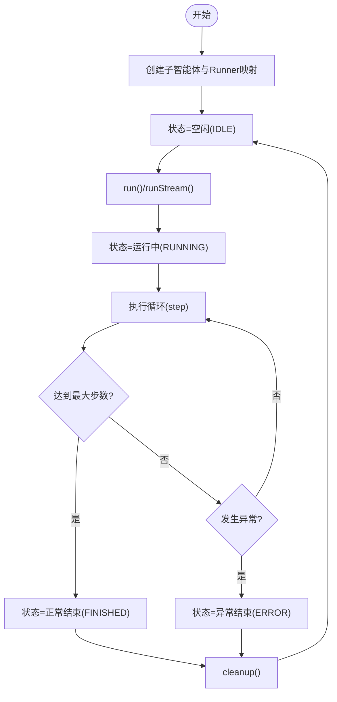
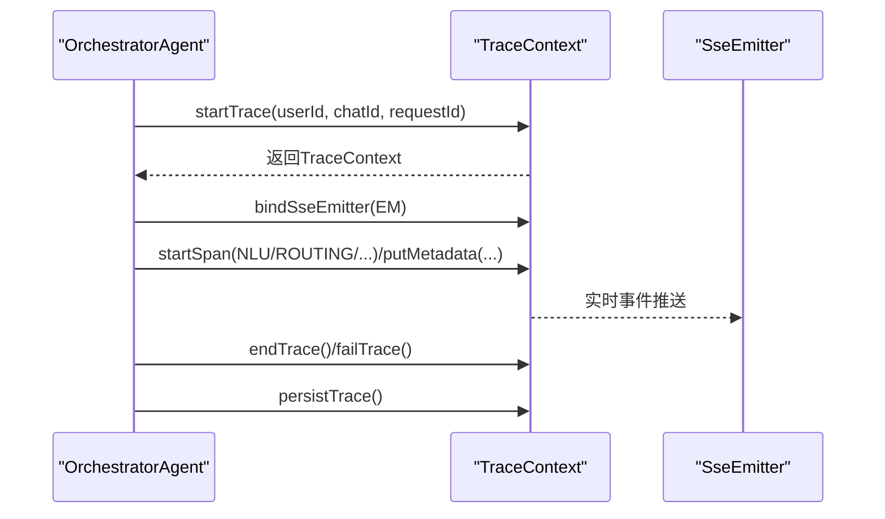
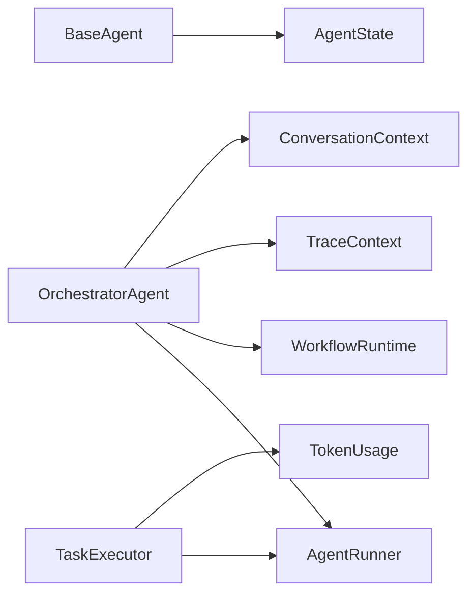

# 智能体架构设计

<cite>
**本文引用的文件**
- [BaseAgent.java](file://src/main/java/com/yupi/yuaiagent/agent/BaseAgent.java)
- [AgentRunner.java](file://src/main/java/com/yupi/yuaiagent/agent/AgentRunner.java)
- [AgentState.java](file://src/main/java/com/yupi/yuaiagent/agent/model/AgentState.java)
- [EscapeAgentRunner.java](file://src/main/java/com/yupi/yuaiagent/agent/runner/EscapeAgentRunner.java)
- [GeneralCareerAgentRunner.java](file://src/main/java/com/yupi/yuaiagent/agent/runner/GeneralCareerAgentRunner.java)
- [EscapeAgent.java](file://src/main/java/com/yupi/yuaiagent/agent/EscapeAgent.java)
- [GeneralCareerAgent.java](file://src/main/java/com/yupi/yuaiagent/agent/GeneralCareerAgent.java)
- [ConversationContext.java](file://src/main/java/com/yupi/yuaiagent/context/ConversationContext.java)
- [AgentOutput.java](file://src/main/java/com/yupi/yuaiagent/agent/output/AgentOutput.java)
- [TokenUsage.java](file://src/main/java/com/yupi/yuaiagent/budget/TokenUsage.java)
- [WorkflowRuntime.java](file://src/main/java/com/yupi/yuaiagent/workflow/runtime/WorkflowRuntime.java)
- [OrchestratorAgent.java](file://src/main/java/com/yupi/yuaiagent/agent/OrchestratorAgent.java)
- [TraceContext.java](file://src/main/java/com/yupi/yuaiagent/trace/TraceContext.java)
- [TaskExecutor.java](file://src/main/java/com/yupi/yuaiagent/agent/TaskExecutor.java)
- [ResultAggregator.java](file://src/main/java/com/yupi/yuaiagent/agent/ResultAggregator.java)
</cite>

## 目录
1. [引言](#引言)
2. [项目结构](#项目结构)
3. [核心组件](#核心组件)
4. [架构总览](#架构总览)
5. [详细组件分析](#详细组件分析)
6. [依赖分析](#依赖分析)
7. [性能考虑](#性能考虑)
8. [故障排查指南](#故障排查指南)
9. [结论](#结论)
10. [附录](#附录)

## 引言
本技术文档围绕智能体架构设计展开，重点阐释以下内容：
- BaseAgent 基础抽象类的设计理念与核心接口定义
- 智能体生命周期管理机制（初始化、运行、暂停、恢复、销毁）
- AgentRunner 执行器的作用与调度策略
- AgentState 状态模型与状态转换逻辑
- 智能体与工作流引擎的集成方式与通信机制
- 架构的扩展点与插件化设计
- 结合架构图表与代码示例，总结最佳实践

## 项目结构
本项目采用按领域分层与按功能模块划分相结合的组织方式。与智能体相关的核心包与文件如下：
- agent：基础智能体抽象、具体智能体实现、执行器与运行器
- context：会话上下文模型
- workflow/runtime：工作流运行时引擎
- trace：执行轨迹追踪
- budget：令牌用量统计
- agent/output：智能体输出接口
- agent/model：智能体状态模型

**图表来源**
- [BaseAgent.java:29-257](file://src/main/java/com/yupi/yuaiagent/agent/BaseAgent.java#L29-L257)
- [OrchestratorAgent.java:68-163](file://src/main/java/com/yupi/yuaiagent/agent/OrchestratorAgent.java#L68-L163)
- [GeneralCareerAgent.java:26-119](file://src/main/java/com/yupi/yuaiagent/agent/GeneralCareerAgent.java#L26-L119)
- [EscapeAgent.java:24-119](file://src/main/java/com/yupi/yuaiagent/agent/EscapeAgent.java#L24-L119)
- [AgentRunner.java:12-23](file://src/main/java/com/yupi/yuaiagent/agent/AgentRunner.java#L12-L23)
- [EscapeAgentRunner.java:12-22](file://src/main/java/com/yupi/yuaiagent/agent/runner/EscapeAgentRunner.java#L12-L22)
- [GeneralCareerAgentRunner.java:12-22](file://src/main/java/com/yupi/yuaiagent/agent/runner/GeneralCareerAgentRunner.java#L12-L22)
- [WorkflowRuntime.java:23-229](file://src/main/java/com/yupi/yuaiagent/workflow/runtime/WorkflowRuntime.java#L23-L229)
- [ConversationContext.java:16-20](file://src/main/java/com/yupi/yuaiagent/context/ConversationContext.java#L16-L20)
- [TraceContext.java:20-186](file://src/main/java/com/yupi/yuaiagent/trace/TraceContext.java#L20-L186)
- [TokenUsage.java:6-30](file://src/main/java/com/yupi/yuaiagent/budget/TokenUsage.java#L6-L30)
- [AgentOutput.java:11-18](file://src/main/java/com/yupi/yuaiagent/agent/output/AgentOutput.java#L11-L18)

**章节来源**
- [BaseAgent.java:29-257](file://src/main/java/com/yupi/yuaiagent/agent/BaseAgent.java#L29-L257)
- [OrchestratorAgent.java:68-163](file://src/main/java/com/yupi/yuaiagent/agent/OrchestratorAgent.java#L68-L163)
- [WorkflowRuntime.java:23-229](file://src/main/java/com/yupi/yuaiagent/workflow/runtime/WorkflowRuntime.java#L23-L229)

## 核心组件
本节聚焦于智能体架构的关键构件及其职责边界。

- BaseAgent：提供统一的状态机、执行循环、消息上下文与清理逻辑；子类仅需实现 step() 即可参与多步执行。
- AgentRunner：面向会话上下文的执行接口，屏蔽具体运行时细节，便于统一调度与预算控制。
- AgentState：定义智能体生命周期状态，支撑状态转换与错误处理。
- OrchestratorAgent：主控路由，负责意图识别、画像注入、跨智能体记忆同步、质量审查与最终聚合。
- WorkflowRuntime：工作流执行引擎，负责节点编排、状态推进与暂停恢复。
- ConversationContext：不可变会话上下文，承载用户画像、对话摘要与最近消息，供所有智能体共享。
- TraceContext：请求级追踪上下文，提供 Span 生命周期管理与 SSE 实时事件绑定。
- TaskExecutor：工作流任务执行器，负责令牌预算检查、失败策略与结果收集。
- ResultAggregator：结果聚合器，将多智能体输出格式化并合成最终答案。

**章节来源**
- [BaseAgent.java:29-257](file://src/main/java/com/yupi/yuaiagent/agent/BaseAgent.java#L29-L257)
- [AgentRunner.java:12-23](file://src/main/java/com/yupi/yuaiagent/agent/AgentRunner.java#L12-L23)
- [AgentState.java:6-27](file://src/main/java/com/yupi/yuaiagent/agent/model/AgentState.java#L6-L27)
- [OrchestratorAgent.java:68-163](file://src/main/java/com/yupi/yuaiagent/agent/OrchestratorAgent.java#L68-L163)
- [WorkflowRuntime.java:23-229](file://src/main/java/com/yupi/yuaiagent/workflow/runtime/WorkflowRuntime.java#L23-L229)
- [ConversationContext.java:16-20](file://src/main/java/com/yupi/yuaiagent/context/ConversationContext.java#L16-L20)
- [TraceContext.java:20-186](file://src/main/java/com/yupi/yuaiagent/trace/TraceContext.java#L20-L186)
- [TaskExecutor.java:32-145](file://src/main/java/com/yupi/yuaiagent/agent/TaskExecutor.java#L32-L145)
- [ResultAggregator.java:22-51](file://src/main/java/com/yupi/yuaiagent/agent/ResultAggregator.java#L22-L51)

## 架构总览
下图展示了智能体架构的高层交互：OrchestratorAgent 作为入口，结合 NLU 与会话上下文进行路由；子智能体通过 AgentRunner 执行；工作流引擎负责节点级编排；TraceContext 提供端到端追踪；TokenUsage 与 TaskExecutor 共同保障预算与稳定性。

**图表来源**
- [OrchestratorAgent.java:168-532](file://src/main/java/com/yupi/yuaiagent/agent/OrchestratorAgent.java#L168-L532)
- [AgentRunner.java:12-23](file://src/main/java/com/yupi/yuaiagent/agent/AgentRunner.java#L12-L23)
- [WorkflowRuntime.java:31-156](file://src/main/java/com/yupi/yuaiagent/workflow/runtime/WorkflowRuntime.java#L31-L156)
- [TraceContext.java:20-186](file://src/main/java/com/yupi/yuaiagent/trace/TraceContext.java#L20-L186)

## 详细组件分析

### BaseAgent 基础抽象类
设计理念：
- 将“状态机 + 步进执行循环”下沉为通用能力，子类只需关注单步逻辑（step()）
- 统一消息上下文管理与清理，保证实例可复用
- 支持同步与流式两种执行模式，满足不同前端需求

核心接口与行为：
- run(userPrompt)：状态校验、进入 RUNNING、执行循环、终止条件与清理
- runStream(userPrompt)：异步执行，逐步推送 SSE 事件
- step()：抽象方法，子类实现具体推理/工具调用逻辑
- cleanup()：清空消息、重置状态与步数

**图表来源**
- [BaseAgent.java:29-257](file://src/main/java/com/yupi/yuaiagent/agent/BaseAgent.java#L29-L257)
- [AgentState.java:6-27](file://src/main/java/com/yupi/yuaiagent/agent/model/AgentState.java#L6-L27)

**章节来源**
- [BaseAgent.java:61-255](file://src/main/java/com/yupi/yuaiagent/agent/BaseAgent.java#L61-L255)

### AgentRunner 执行器与调度策略
职责：
- 面向 ConversationContext 的统一执行接口
- 暴露上一次运行的 TokenUsage，便于预算控制
- 通过 TaskExecutor 注册与调度不同 Agent 的 Runner

典型实现：
- EscapeAgentRunner、GeneralCareerAgentRunner：封装具体 Agent 的调用与输出包装

**图表来源**
- [AgentRunner.java:12-23](file://src/main/java/com/yupi/yuaiagent/agent/AgentRunner.java#L12-L23)
- [AgentOutput.java:11-18](file://src/main/java/com/yupi/yuaiagent/agent/output/AgentOutput.java#L11-L18)
- [EscapeAgentRunner.java:12-22](file://src/main/java/com/yupi/yuaiagent/agent/runner/EscapeAgentRunner.java#L12-L22)
- [GeneralCareerAgentRunner.java:12-22](file://src/main/java/com/yupi/yuaiagent/agent/runner/GeneralCareerAgentRunner.java#L12-L22)

**章节来源**
- [AgentRunner.java:12-23](file://src/main/java/com/yupi/yuaiagent/agent/AgentRunner.java#L12-L23)
- [EscapeAgentRunner.java:12-22](file://src/main/java/com/yupi/yuaiagent/agent/runner/EscapeAgentRunner.java#L12-L22)
- [GeneralCareerAgentRunner.java:12-22](file://src/main/java/com/yupi/yuaiagent/agent/runner/GeneralCareerAgentRunner.java#L12-L22)

### AgentState 状态模型与转换逻辑
状态模型：
- IDLE：初始/可运行态
- RUNNING：执行中
- FINISHED：正常结束
- ERROR：异常结束

转换规则：
- run() 仅允许从 IDLE 启动，异常时进入 ERROR，达到步数上限或正常结束进入 FINISHED
- runStream() 同步校验与 run() 类似，异常时发送 error 事件并完成连接
- cleanup() 将状态回退至 IDLE，便于复用

**图表来源**
- [AgentState.java:6-27](file://src/main/java/com/yupi/yuaiagent/agent/model/AgentState.java#L6-L27)
- [BaseAgent.java:61-100](file://src/main/java/com/yupi/yuaiagent/agent/BaseAgent.java#L61-L100)

**章节来源**
- [AgentState.java:6-27](file://src/main/java/com/yupi/yuaiagent/agent/model/AgentState.java#L6-L27)
- [BaseAgent.java:61-100](file://src/main/java/com/yupi/yuaiagent/agent/BaseAgent.java#L61-L100)

### 智能体与工作流引擎的集成与通信
- OrchestratorAgent 作为入口，根据意图路由到子智能体；当需要复杂流程时，委托 WorkflowRuntime 启动/恢复工作流实例
- WorkflowRuntime 负责节点执行、状态推进与暂停恢复；对于 Agent 节点，记录意图与任务描述，实际执行由外部 AgentRuntime 接管
- 两者通过 ConversationContext 与 RuntimeContext 共享上下文信息，实现端到端一致性

**图表来源**
- [OrchestratorAgent.java:168-190](file://src/main/java/com/yupi/yuaiagent/agent/OrchestratorAgent.java#L168-L190)
- [WorkflowRuntime.java:31-156](file://src/main/java/com/yupi/yuaiagent/workflow/runtime/WorkflowRuntime.java#L31-L156)
- [AgentRunner.java:12-23](file://src/main/java/com/yupi/yuaiagent/agent/AgentRunner.java#L12-L23)

**章节来源**
- [WorkflowRuntime.java:23-229](file://src/main/java/com/yupi/yuaiagent/workflow/runtime/WorkflowRuntime.java#L23-L229)
- [OrchestratorAgent.java:168-190](file://src/main/java/com/yupi/yuaiagent/agent/OrchestratorAgent.java#L168-L190)

### 智能体生命周期管理机制
- 初始化：OrchestratorAgent 构造时创建各子智能体，并在 TaskExecutor 中注册 AgentRunner 映射
- 运行：run()/runStream() 触发状态切换与消息上下文维护；子类 step() 实现具体逻辑
- 暂停/恢复：工作流层面通过 WorkflowRuntime.pause/resume 控制；智能体内部通过状态机与清理逻辑保证幂等
- 销毁：cleanup() 清理消息与状态，使实例可复用

**图表来源**
- [BaseAgent.java:61-100](file://src/main/java/com/yupi/yuaiagent/agent/BaseAgent.java#L61-L100)
- [TaskExecutor.java:44-46](file://src/main/java/com/yupi/yuaiagent/agent/TaskExecutor.java#L44-L46)

**章节来源**
- [BaseAgent.java:61-100](file://src/main/java/com/yupi/yuaiagent/agent/BaseAgent.java#L61-L100)
- [TaskExecutor.java:44-46](file://src/main/java/com/yupi/yuaiagent/agent/TaskExecutor.java#L44-L46)

### 智能体与追踪系统的集成
- OrchestratorAgent 在流式路由过程中创建 TraceContext，并绑定 SSE 发射器以实时推送追踪事件
- TraceContext 提供 Span 的创建、结束、失败与跳过语义，最终汇总为 ExecutionTrace 并持久化
- 通过 failSpan/skipSpan/finalizeTrace 等方法，确保异常与降级路径的可观测性

**图表来源**
- [OrchestratorAgent.java:214-284](file://src/main/java/com/yupi/yuaiagent/agent/OrchestratorAgent.java#L214-L284)
- [TraceContext.java:20-186](file://src/main/java/com/yupi/yuaiagent/trace/TraceContext.java#L20-L186)

**章节来源**
- [OrchestratorAgent.java:214-284](file://src/main/java/com/yupi/yuaiagent/agent/OrchestratorAgent.java#L214-L284)
- [TraceContext.java:20-186](file://src/main/java/com/yupi/yuaiagent/trace/TraceContext.java#L20-L186)

### 扩展点与插件化设计
- 新增智能体：继承 BaseAgent 或组合已有智能体能力，实现 step() 或封装为 Runner
- 新增路由策略：在 OrchestratorAgent 中扩展意图识别与路由逻辑
- 新增工作流节点：在 WorkflowRuntime 中新增节点类型与执行分支
- 新增追踪步骤：在 TraceContext 中扩展 TraceStepType 与事件标签
- 预算与失败策略：在 TaskExecutor 中扩展 FailurePolicy 与估算策略

最佳实践：
- 将“状态机”与“执行循环”下沉至 BaseAgent，子类专注于业务逻辑
- 使用 AgentRunner 统一执行入口，便于接入预算与失败策略
- 使用 ConversationContext 传递只读上下文，避免状态泄露
- 使用 SSE + TraceContext 实现实时可观测性与用户体验

**章节来源**
- [BaseAgent.java:29-257](file://src/main/java/com/yupi/yuaiagent/agent/BaseAgent.java#L29-L257)
- [AgentRunner.java:12-23](file://src/main/java/com/yupi/yuaiagent/agent/AgentRunner.java#L12-L23)
- [TaskExecutor.java:32-145](file://src/main/java/com/yupi/yuaiagent/agent/TaskExecutor.java#L32-L145)
- [WorkflowRuntime.java:161-171](file://src/main/java/com/yupi/yuaiagent/workflow/runtime/WorkflowRuntime.java#L161-L171)

## 依赖分析
- 组件内聚与耦合
  - BaseAgent 与 AgentState 高内聚，低对外依赖
  - AgentRunner 与具体智能体解耦，便于替换与扩展
  - OrchestratorAgent 作为编排中心，依赖 NLU、记忆、工作流与追踪等子系统
  - TaskExecutor 与 TokenUsage、FailurePolicy 紧密耦合，保障预算与稳定性
- 外部依赖
  - Spring AI ChatClient/ChatMemory/Advisors
  - Reactor Flux（流式输出）
  - SSE（实时事件）

**图表来源**
- [BaseAgent.java:29-257](file://src/main/java/com/yupi/yuaiagent/agent/BaseAgent.java#L29-L257)
- [AgentRunner.java:12-23](file://src/main/java/com/yupi/yuaiagent/agent/AgentRunner.java#L12-L23)
- [WorkflowRuntime.java:23-229](file://src/main/java/com/yupi/yuaiagent/workflow/runtime/WorkflowRuntime.java#L23-L229)
- [TraceContext.java:20-186](file://src/main/java/com/yupi/yuaiagent/trace/TraceContext.java#L20-L186)
- [TaskExecutor.java:32-145](file://src/main/java/com/yupi/yuaiagent/agent/TaskExecutor.java#L32-L145)
- [ConversationContext.java:16-20](file://src/main/java/com/yupi/yuaiagent/context/ConversationContext.java#L16-L20)
- [TokenUsage.java:6-30](file://src/main/java/com/yupi/yuaiagent/budget/TokenUsage.java#L6-L30)

**章节来源**
- [BaseAgent.java:29-257](file://src/main/java/com/yupi/yuaiagent/agent/BaseAgent.java#L29-L257)
- [AgentRunner.java:12-23](file://src/main/java/com/yupi/yuaiagent/agent/AgentRunner.java#L12-L23)
- [WorkflowRuntime.java:23-229](file://src/main/java/com/yupi/yuaiagent/workflow/runtime/WorkflowRuntime.java#L23-L229)
- [TraceContext.java:20-186](file://src/main/java/com/yupi/yuaiagent/trace/TraceContext.java#L20-L186)
- [TaskExecutor.java:32-145](file://src/main/java/com/yupi/yuaiagent/agent/TaskExecutor.java#L32-L145)
- [ConversationContext.java:16-20](file://src/main/java/com/yupi/yuaiagent/context/ConversationContext.java#L16-L20)
- [TokenUsage.java:6-30](file://src/main/java/com/yupi/yuaiagent/budget/TokenUsage.java#L6-L30)

## 性能考虑
- 流式输出：优先使用 runStream 与 SSE，降低首字节延迟与带宽占用
- 记忆压缩：在跨智能体切换前自动压缩，减少上下文长度
- 预算估算：基于字符长度的粗略估算，结合 TokenUsage 实际值进行校准
- 失败策略：FAIL_FAST 与 RETRY_THEN_SKIP/FAIL 降低级联失败影响
- 并行化：工作流并行节点可扩展为真正并发（当前版本为顺序模拟）

[本节为通用性能讨论，无需列出具体文件来源]

## 故障排查指南
- 状态异常
  - 症状：从非空闲状态调用 run()/runStream()
  - 处理：检查调用前状态，确保正确复用实例或重新创建
  - 参考：[BaseAgent.java:61-100](file://src/main/java/com/yupi/yuaiagent/agent/BaseAgent.java#L61-L100)
- 流式输出中断
  - 症状：SSE 连接提前关闭或异常
  - 处理：检查 onTimeout/onCompletion 回调，确保状态回退至 FINISHED/ERROR 并清理
  - 参考：[BaseAgent.java:225-238](file://src/main/java/com/yupi/yuaiagent/agent/BaseAgent.java#L225-L238)
- 预算超限
  - 症状：某些步骤被跳过
  - 处理：调整估算策略或放宽预算，查看 TokenUsage 与失败原因
  - 参考：[TaskExecutor.java:72-76](file://src/main/java/com/yupi/yuaiagent/agent/TaskExecutor.java#L72-L76)
- 质量阻断
  - 症状：回答被质量守卫阻断
  - 处理：查看质量审查元数据与风险等级，必要时启用红队模式
  - 参考：[OrchestratorAgent.java:647-704](file://src/main/java/com/yupi/yuaiagent/agent/OrchestratorAgent.java#L647-L704)

**章节来源**
- [BaseAgent.java:61-100](file://src/main/java/com/yupi/yuaiagent/agent/BaseAgent.java#L61-L100)
- [BaseAgent.java:225-238](file://src/main/java/com/yupi/yuaiagent/agent/BaseAgent.java#L225-L238)
- [TaskExecutor.java:72-76](file://src/main/java/com/yupi/yuaiagent/agent/TaskExecutor.java#L72-L76)
- [OrchestratorAgent.java:647-704](file://src/main/java/com/yupi/yuaiagent/agent/OrchestratorAgent.java#L647-L704)

## 结论
本架构以 BaseAgent 为核心抽象，通过 AgentRunner 实现统一调度与预算控制，结合 OrchestratorAgent 的意图路由与跨智能体上下文同步，形成“状态机 + 流式输出 + 追踪 + 预算”的完整闭环。工作流引擎与追踪系统进一步增强了复杂场景下的可控性与可观测性。通过清晰的扩展点与插件化设计，可在不破坏核心稳定性的前提下快速迭代与演进。

[本节为总结性内容，无需列出具体文件来源]

## 附录
- 代码示例路径（不含具体代码内容）
  - 基础抽象与生命周期：[BaseAgent.java:29-257](file://src/main/java/com/yupi/yuaiagent/agent/BaseAgent.java#L29-L257)
  - 执行器接口与实现：[AgentRunner.java:12-23](file://src/main/java/com/yupi/yuaiagent/agent/AgentRunner.java#L12-L23)，[EscapeAgentRunner.java:12-22](file://src/main/java/com/yupi/yuaiagent/agent/runner/EscapeAgentRunner.java#L12-L22)，[GeneralCareerAgentRunner.java:12-22](file://src/main/java/com/yupi/yuaiagent/agent/runner/GeneralCareerAgentRunner.java#L12-L22)
  - 状态模型：[AgentState.java:6-27](file://src/main/java/com/yupi/yuaiagent/agent/model/AgentState.java#L6-L27)
  - 主控路由与追踪：[OrchestratorAgent.java:68-163](file://src/main/java/com/yupi/yuaiagent/agent/OrchestratorAgent.java#L68-L163)，[TraceContext.java:20-186](file://src/main/java/com/yupi/yuaiagent/trace/TraceContext.java#L20-L186)
  - 工作流运行时：[WorkflowRuntime.java:23-229](file://src/main/java/com/yupi/yuaiagent/workflow/runtime/WorkflowRuntime.java#L23-L229)
  - 任务执行与聚合：[TaskExecutor.java:32-145](file://src/main/java/com/yupi/yuaiagent/agent/TaskExecutor.java#L32-L145)，[ResultAggregator.java:22-51](file://src/main/java/com/yupi/yuaiagent/agent/ResultAggregator.java#L22-L51)
  - 会话上下文与令牌用量：[ConversationContext.java:16-20](file://src/main/java/com/yupi/yuaiagent/context/ConversationContext.java#L16-L20)，[TokenUsage.java:6-30](file://src/main/java/com/yupi/yuaiagent/budget/TokenUsage.java#L6-L30)