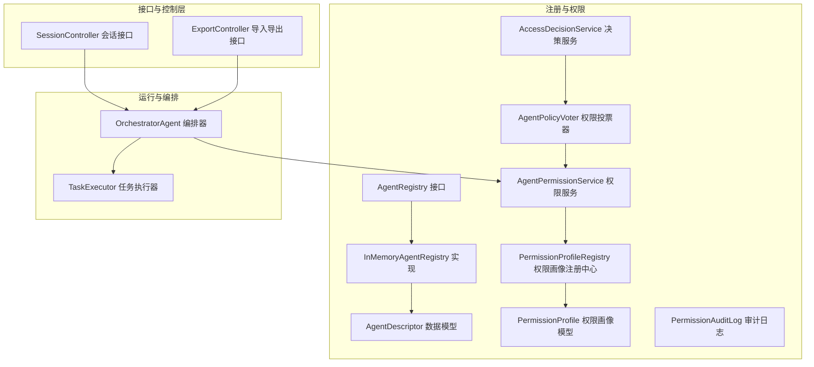
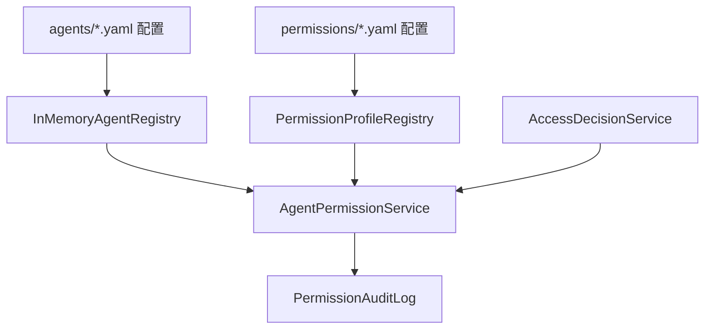
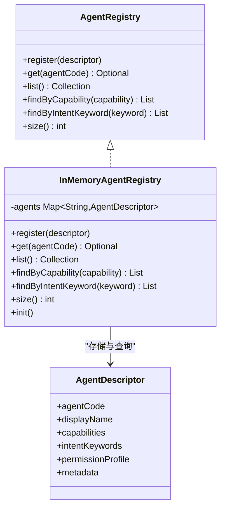
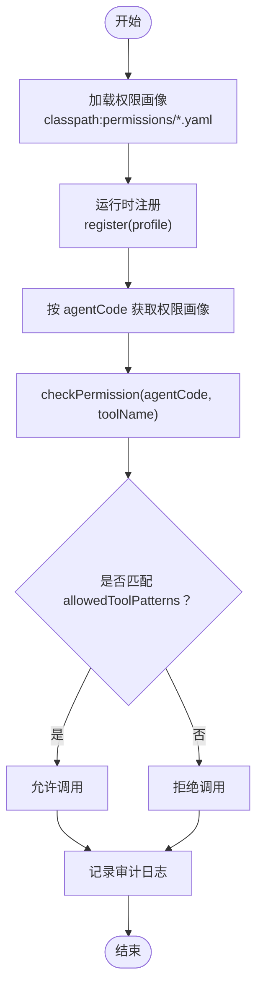
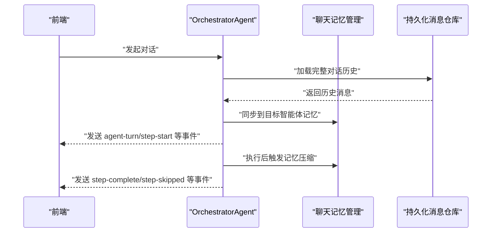
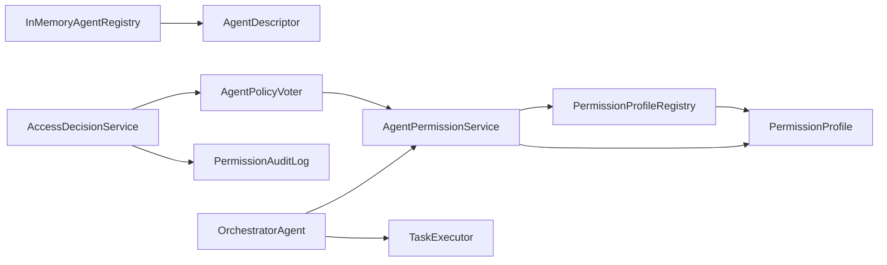

# 智能体注册与管理

<cite>
**本文档引用的文件**
- [AgentRegistry.java](file://src/main/java/com/yupi/yuaiagent/registry/AgentRegistry.java)
- [InMemoryAgentRegistry.java](file://src/main/java/com/yupi/yuaiagent/registry/InMemoryAgentRegistry.java)
- [AgentDescriptor.java](file://src/main/java/com/yupi/yuaiagent/registry/AgentDescriptor.java)
- [PermissionProfileRegistry.java](file://src/main/java/com/yupi/yuaiagent/permission/PermissionProfileRegistry.java)
- [PermissionProfile.java](file://src/main/java/com/yupi/yuaiagent/permission/model/PermissionProfile.java)
- [AgentPermissionService.java](file://src/main/java/com/yupi/yuaiagent/permission/AgentPermissionService.java)
- [AgentPolicyVoter.java](file://src/main/java/com/yupi/yuaiagent/access/AgentPolicyVoter.java)
- [AccessDecisionService.java](file://src/main/java/com/yupi/yuaiagent/access/AccessDecisionService.java)
- [PermissionAuditLog.java](file://src/main/java/com/yupi/yuaiagent/permission/PermissionAuditLog.java)
- [OrchestratorAgent.java](file://src/main/java/com/yupi/yuaiagent/agent/OrchestratorAgent.java)
- [SandboxExecEvent.java](file://src/main/java/com/yupi/yuaiagent/event/SandboxExecEvent.java)
- [SessionController.java](file://src/main/java/com/yupi/yuaiagent/controller/SessionController.java)
- [ExportController.java](file://src/main/java/com/yupi/yuaiagent/controller/ExportController.java)
- [TaskExecutor.java](file://src/main/java/com/yupi/yuaiagent/agent/TaskExecutor.java)
- [multi-agent-runtime-architecture.md](file://docs/multi-agent-runtime-architecture.md)
- [review-report-2026-06-10.md](file://docs/review-report-2026-06-10.md)
- [TraceControllerTest.java](file://src/test/java/com/yupi/yuaiagent/trace/TraceControllerTest.java)
</cite>

## 目录
1. [简介](#简介)
2. [项目结构](#项目结构)
3. [核心组件](#核心组件)
4. [架构总览](#架构总览)
5. [详细组件分析](#详细组件分析)
6. [依赖关系分析](#依赖关系分析)
7. [性能考量](#性能考量)
8. [故障排查指南](#故障排查指南)
9. [结论](#结论)
10. [附录](#附录)

## 简介
本技术文档聚焦“智能体注册与管理系统”，围绕以下主题展开：
- AgentRegistry 注册表的设计原理与实现机制
- AgentDescriptor 智能体描述符的结构与元数据管理
- 智能体发现策略与动态加载机制
- 权限配置文件格式与访问控制规则
- 智能体生命周期事件与状态同步机制
- 智能体注册的 API 接口与编程示例
- 最佳实践与性能优化建议
- 如何扩展注册表以支持新的智能体类型

## 项目结构
本项目采用分层与功能域划分的组织方式，智能体注册与管理相关的核心代码位于 registry、permission、access、agent、controller 等包中。资源层面通过 YAML 文件进行声明式配置，支持启动时批量加载与运行时动态注册。

图表来源
- [AgentRegistry.java:12-43](file://src/main/java/com/yupi/yuaiagent/registry/AgentRegistry.java#L12-L43)
- [InMemoryAgentRegistry.java:25-105](file://src/main/java/com/yupi/yuaiagent/registry/InMemoryAgentRegistry.java#L25-L105)
- [AgentDescriptor.java:23-92](file://src/main/java/com/yupi/yuaiagent/registry/AgentDescriptor.java#L23-L92)
- [PermissionProfileRegistry.java:28-104](file://src/main/java/com/yupi/yuaiagent/permission/PermissionProfileRegistry.java#L28-L104)
- [PermissionProfile.java:23-51](file://src/main/java/com/yupi/yuaiagent/permission/model/PermissionProfile.java#L23-L51)
- [AgentPermissionService.java:40-119](file://src/main/java/com/yupi/yuaiagent/permission/AgentPermissionService.java#L40-L119)
- [AgentPolicyVoter.java:16-44](file://src/main/java/com/yupi/yuaiagent/access/AgentPolicyVoter.java#L16-L44)
- [AccessDecisionService.java:70-104](file://src/main/java/com/yupi/yuaiagent/access/AccessDecisionService.java#L70-L104)
- [PermissionAuditLog.java:25-43](file://src/main/java/com/yupi/yuaiagent/permission/PermissionAuditLog.java#L25-L43)
- [OrchestratorAgent.java:283-493](file://src/main/java/com/yupi/yuaiagent/agent/OrchestratorAgent.java#L283-L493)
- [TaskExecutor.java:37-69](file://src/main/java/com/yupi/yuaiagent/agent/TaskExecutor.java#L37-L69)
- [SessionController.java:60-84](file://src/main/java/com/yupi/yuaiagent/controller/SessionController.java#L60-L84)
- [ExportController.java:42-50](file://src/main/java/com/yupi/yuaiagent/controller/ExportController.java#L42-L50)

章节来源
- [AgentRegistry.java:12-43](file://src/main/java/com/yupi/yuaiagent/registry/AgentRegistry.java#L12-L43)
- [InMemoryAgentRegistry.java:25-105](file://src/main/java/com/yupi/yuaiagent/registry/InMemoryAgentRegistry.java#L25-L105)
- [AgentDescriptor.java:23-92](file://src/main/java/com/yupi/yuaiagent/registry/AgentDescriptor.java#L23-L92)
- [PermissionProfileRegistry.java:28-104](file://src/main/java/com/yupi/yuaiagent/permission/PermissionProfileRegistry.java#L28-L104)
- [PermissionProfile.java:23-51](file://src/main/java/com/yupi/yuaiagent/permission/model/PermissionProfile.java#L23-L51)
- [AgentPermissionService.java:40-119](file://src/main/java/com/yupi/yuaiagent/permission/AgentPermissionService.java#L40-L119)
- [AgentPolicyVoter.java:16-44](file://src/main/java/com/yupi/yuaiagent/access/AgentPolicyVoter.java#L16-L44)
- [AccessDecisionService.java:70-104](file://src/main/java/com/yupi/yuaiagent/access/AccessDecisionService.java#L70-L104)
- [PermissionAuditLog.java:25-43](file://src/main/java/com/yupi/yuaiagent/permission/PermissionAuditLog.java#L25-L43)
- [OrchestratorAgent.java:283-493](file://src/main/java/com/yupi/yuaiagent/agent/OrchestratorAgent.java#L283-L493)
- [TaskExecutor.java:37-69](file://src/main/java/com/yupi/yuaiagent/agent/TaskExecutor.java#L37-L69)
- [SessionController.java:60-84](file://src/main/java/com/yupi/yuaiagent/controller/SessionController.java#L60-L84)
- [ExportController.java:42-50](file://src/main/java/com/yupi/yuaiagent/controller/ExportController.java#L42-L50)

## 核心组件
- AgentRegistry 接口：定义注册表的标准能力，包括注册、查询、列举、按能力标签与意图关键词检索、统计数量。
- InMemoryAgentRegistry 实现：基于内存的注册中心，启动时扫描 classpath:agents/*.yaml 动态加载智能体描述，支持运行时注册。
- AgentDescriptor：智能体描述符的数据模型，承载 agentCode、displayName、capabilities、intentKeywords、permissionProfile、metadata 等元数据。
- PermissionProfileRegistry：权限画像注册中心，启动时扫描 classpath:permissions/*.yaml 加载权限画像，支持运行时注册。
- PermissionProfile：权限画像模型，定义 allowedToolPatterns、最小 MCP 信任分、管理员/网络/文件系统访问等策略。
- AgentPermissionService：权限服务，提供工具调用许可判断、限额校验、网络/文件系统访问判定、MCP 信任分要求等。
- AgentPolicyVoter：基于权限画像的投票器，参与访问决策。
- AccessDecisionService：统一的访问决策服务，聚合多个投票器并输出最终决策，支持审计日志记录。
- PermissionAuditLog：权限审计日志，记录每次决策（通过/拒绝），用于安全审计与合规。

章节来源
- [AgentRegistry.java:12-43](file://src/main/java/com/yupi/yuaiagent/registry/AgentRegistry.java#L12-L43)
- [InMemoryAgentRegistry.java:25-105](file://src/main/java/com/yupi/yuaiagent/registry/InMemoryAgentRegistry.java#L25-L105)
- [AgentDescriptor.java:23-92](file://src/main/java/com/yupi/yuaiagent/registry/AgentDescriptor.java#L23-L92)
- [PermissionProfileRegistry.java:28-104](file://src/main/java/com/yupi/yuaiagent/permission/PermissionProfileRegistry.java#L28-L104)
- [PermissionProfile.java:23-51](file://src/main/java/com/yupi/yuaiagent/permission/model/PermissionProfile.java#L23-L51)
- [AgentPermissionService.java:40-119](file://src/main/java/com/yupi/yuaiagent/permission/AgentPermissionService.java#L40-L119)
- [AgentPolicyVoter.java:16-44](file://src/main/java/com/yupi/yuaiagent/access/AgentPolicyVoter.java#L16-L44)
- [AccessDecisionService.java:70-104](file://src/main/java/com/yupi/yuaiagent/access/AccessDecisionService.java#L70-L104)
- [PermissionAuditLog.java:25-43](file://src/main/java/com/yupi/yuaiagent/permission/PermissionAuditLog.java#L25-L43)

## 架构总览
智能体注册与管理贯穿“声明式配置 + 运行时发现 + 访问控制 + 生命周期观测”的闭环：
- 配置层：resources/agents/*.yaml 与 resources/permissions/*.yaml 提供声明式元数据与权限画像。
- 发现层：InMemoryAgentRegistry 与 PermissionProfileRegistry 在启动时加载并支持运行时注册。
- 控制层：AgentPermissionService 与 AgentPolicyVoter 提供细粒度的访问控制。
- 观测层：权限审计日志与轨迹系统（Trace）记录关键事件，便于追踪与合规。

图表来源
- [InMemoryAgentRegistry.java:36-57](file://src/main/java/com/yupi/yuaiagent/registry/InMemoryAgentRegistry.java#L36-L57)
- [PermissionProfileRegistry.java:42-62](file://src/main/java/com/yupi/yuaiagent/permission/PermissionProfileRegistry.java#L42-L62)
- [AgentPermissionService.java:40-119](file://src/main/java/com/yupi/yuaiagent/permission/AgentPermissionService.java#L40-L119)
- [AccessDecisionService.java:70-104](file://src/main/java/com/yupi/yuaiagent/access/AccessDecisionService.java#L70-L104)
- [PermissionAuditLog.java:38-43](file://src/main/java/com/yupi/yuaiagent/permission/PermissionAuditLog.java#L38-L43)

## 详细组件分析

### AgentRegistry 注册表与 InMemoryAgentRegistry 实现
- 设计要点
  - 接口抽象：统一注册、查询、列举、按能力标签与意图关键词检索、统计数量。
  - 内存实现：并发安全的 Map 存储，启动时扫描 classpath:agents/*.yaml 自动加载，支持运行时 register。
  - 查询策略：按 agentCode 精确匹配；按 capability 过滤；按 intentKeywords 的模糊匹配（大小写不敏感，支持子串互含）。
- 性能特征
  - register/get/list/size：O(1) 平摊时间复杂度。
  - findByCapability：线性遍历，时间复杂度 O(N)。
  - findByIntentKeyword：线性遍历 + 字符串匹配，时间复杂度 O(N·K)，K 为平均关键词数量。
- 扩展建议
  - 支持多级缓存与索引（如按 capability 与 intentKeywords 建立倒排索引）以降低查询开销。
  - 引入增量扫描与热更新，避免全量重载带来的抖动。

图表来源
- [AgentRegistry.java:12-43](file://src/main/java/com/yupi/yuaiagent/registry/AgentRegistry.java#L12-L43)
- [InMemoryAgentRegistry.java:25-105](file://src/main/java/com/yupi/yuaiagent/registry/InMemoryAgentRegistry.java#L25-L105)
- [AgentDescriptor.java:23-92](file://src/main/java/com/yupi/yuaiagent/registry/AgentDescriptor.java#L23-L92)

章节来源
- [AgentRegistry.java:12-43](file://src/main/java/com/yupi/yuaiagent/registry/AgentRegistry.java#L12-L43)
- [InMemoryAgentRegistry.java:25-105](file://src/main/java/com/yupi/yuaiagent/registry/InMemoryAgentRegistry.java#L25-L105)
- [AgentDescriptor.java:23-92](file://src/main/java/com/yupi/yuaiagent/registry/AgentDescriptor.java#L23-L92)

### AgentDescriptor 智能体描述符
- 结构要点
  - 标识与版本：agentCode（全局唯一）、agentVersion（语义化版本）。
  - 可读信息：displayName、description。
  - 能力与意图：capabilities（能力标签）、intentKeywords（意图关键词）。
  - 绑定关系：skillBindings（技能绑定）、mcpBindings（MCP 服务器绑定）。
  - 权限画像：permissionProfile（引用权限画像）。
  - 元数据：metadata（图标、分类、作者等）。
  - 状态与类型：enabled（是否启用）、agentType（类型枚举）。
- 元数据管理
  - 通过 YAML 文件声明，支持运行时动态注册。
  - 与权限画像、技能、MCP 服务器形成松耦合的声明式绑定。

章节来源
- [AgentDescriptor.java:23-92](file://src/main/java/com/yupi/yuaiagent/registry/AgentDescriptor.java#L23-L92)

### 权限画像注册中心与权限服务
- PermissionProfileRegistry
  - 启动时扫描 classpath:permissions/*.yaml 加载权限画像，支持运行时 register。
  - 提供 get、getAll、getOrDefault 等查询能力。
- PermissionProfile
  - allowedToolPatterns：支持通配符的工具命名空间模式（如 resume.*、rag.query、*）。
  - minMcpTrustScore：最低 MCP 信任分要求。
  - 其它策略：管理员、网络访问、文件系统访问、单次请求最大工具调用次数等。
- AgentPermissionService
  - checkPermission：基于 allowedToolPatterns 与通配符匹配规则判断工具调用许可。
  - canAccessFilesystem/canAccessNetwork/isWithinToolCallLimit/getMinMcpTrustScore：提供多维度策略查询。
  - checkPermissionOrThrow：无权限时抛出 AgentPermissionDeniedException。
- AgentPolicyVoter 与 AccessDecisionService
  - AgentPolicyVoter 基于 AgentPermissionService 的结果进行 ALLOW/DENY 投票。
  - AccessDecisionService 聚合多个投票器，输出最终决策，并记录审计日志。

图表来源
- [PermissionProfileRegistry.java:42-62](file://src/main/java/com/yupi/yuaiagent/permission/PermissionProfileRegistry.java#L42-L62)
- [PermissionProfileRegistry.java:67-72](file://src/main/java/com/yupi/yuaiagent/permission/PermissionProfileRegistry.java#L67-L72)
- [PermissionProfile.java:45-46](file://src/main/java/com/yupi/yuaiagent/permission/model/PermissionProfile.java#L45-L46)
- [AgentPermissionService.java:42-53](file://src/main/java/com/yupi/yuaiagent/permission/AgentPermissionService.java#L42-L53)
- [AgentPolicyVoter.java:20-38](file://src/main/java/com/yupi/yuaiagent/access/AgentPolicyVoter.java#L20-L38)
- [AccessDecisionService.java:70-74](file://src/main/java/com/yupi/yuaiagent/access/AccessDecisionService.java#L70-L74)
- [PermissionAuditLog.java:38-43](file://src/main/java/com/yupi/yuaiagent/permission/PermissionAuditLog.java#L38-L43)

章节来源
- [PermissionProfileRegistry.java:28-104](file://src/main/java/com/yupi/yuaiagent/permission/PermissionProfileRegistry.java#L28-L104)
- [PermissionProfile.java:23-51](file://src/main/java/com/yupi/yuaiagent/permission/model/PermissionProfile.java#L23-L51)
- [AgentPermissionService.java:40-119](file://src/main/java/com/yupi/yuaiagent/permission/AgentPermissionService.java#L40-L119)
- [AgentPolicyVoter.java:16-44](file://src/main/java/com/yupi/yuaiagent/access/AgentPolicyVoter.java#L16-L44)
- [AccessDecisionService.java:70-104](file://src/main/java/com/yupi/yuaiagent/access/AccessDecisionService.java#L70-L104)
- [PermissionAuditLog.java:25-43](file://src/main/java/com/yupi/yuaiagent/permission/PermissionAuditLog.java#L25-L43)

### 智能体生命周期事件与状态同步机制
- 生命周期事件
  - 编排器 OrchestratorAgent 在执行过程中通过 SSE 事件推送 agent-turn、workflow-start、step-start、step-complete、step-skipped 等事件，前端可据此渲染交互。
  - SandboxExecEvent 事件用于沙箱执行的治理事件记录。
- 状态同步
  - 跨智能体会话历史同步：当用户在不同智能体间切换时，OrchestratorAgent 从持久化消息仓库加载完整对话历史至目标智能体的聊天记忆，并处理前一个智能体未持久化的消息边角情况。
  - 记忆压缩：在执行前对聊天记忆进行压缩检查，确保上下文长度与性能平衡。

图表来源
- [OrchestratorAgent.java:300-336](file://src/main/java/com/yupi/yuaiagent/agent/OrchestratorAgent.java#L300-L336)
- [OrchestratorAgent.java:468-493](file://src/main/java/com/yupi/yuaiagent/agent/OrchestratorAgent.java#L468-L493)
- [multi-agent-runtime-architecture.md:1044-1070](file://docs/multi-agent-runtime-architecture.md#L1044-L1070)
- [SandboxExecEvent.java:8-28](file://src/main/java/com/yupi/yuaiagent/event/SandboxExecEvent.java#L8-L28)

章节来源
- [OrchestratorAgent.java:283-493](file://src/main/java/com/yupi/yuaiagent/agent/OrchestratorAgent.java#L283-L493)
- [multi-agent-runtime-architecture.md:1036-1070](file://docs/multi-agent-runtime-architecture.md#L1036-L1070)
- [SandboxExecEvent.java:1-28](file://src/main/java/com/yupi/yuaiagent/event/SandboxExecEvent.java#L1-L28)

### 智能体注册的 API 接口与编程示例
- 会话相关接口（示例）
  - GET /session/list：列出活跃会话
  - GET /session/archived：列出归档会话
  - GET /session/trash：列出回收站会话
  - 示例路径：[SessionController.java:60-84](file://src/main/java/com/yupi/yuaiagent/controller/SessionController.java#L60-L84)
- 导入导出接口（示例）
  - POST /export/import：导入数据
  - 示例路径：[ExportController.java:42-50](file://src/main/java/com/yupi/yuaiagent/controller/ExportController.java#L42-L50)
- 编程示例（概念性）
  - 注册智能体描述符：通过 InMemoryAgentRegistry.register(descriptor) 完成运行时注册。
  - 权限检查：使用 AgentPermissionService.checkPermissionOrThrow(agentCode, toolName) 进行权限校验。
  - 访问决策：通过 AccessDecisionService.check(context) 获取最终决策。

章节来源
- [SessionController.java:60-84](file://src/main/java/com/yupi/yuaiagent/controller/SessionController.java#L60-L84)
- [ExportController.java:42-50](file://src/main/java/com/yupi/yuaiagent/controller/ExportController.java#L42-L50)
- [InMemoryAgentRegistry.java:60-65](file://src/main/java/com/yupi/yuaiagent/registry/InMemoryAgentRegistry.java#L60-L65)
- [AgentPermissionService.java:58-65](file://src/main/java/com/yupi/yuaiagent/permission/AgentPermissionService.java#L58-L65)
- [AccessDecisionService.java:70-87](file://src/main/java/com/yupi/yuaiagent/access/AccessDecisionService.java#L70-L87)

### 如何扩展注册表以支持新的智能体类型
- 新增 YAML 配置
  - 在 resources/agents/ 下新增 *.yaml，定义新的 AgentDescriptor 元数据（agentCode、displayName、capabilities、intentKeywords、permissionProfile 等）。
  - InMemoryAgentRegistry 会在启动时自动扫描并加载。
- 运行时注册
  - 通过 InMemoryAgentRegistry.register(...) 动态注册新的智能体描述符。
- 权限画像联动
  - 在 resources/permissions/ 下新增对应的权限画像 YAML，或通过 PermissionProfileRegistry.register(...) 动态注册。
- 编排与执行
  - 在编排器或任务执行器中新增对该智能体类型的路由与执行逻辑。

章节来源
- [InMemoryAgentRegistry.java:36-57](file://src/main/java/com/yupi/yuaiagent/registry/InMemoryAgentRegistry.java#L36-L57)
- [InMemoryAgentRegistry.java:60-65](file://src/main/java/com/yupi/yuaiagent/registry/InMemoryAgentRegistry.java#L60-L65)
- [PermissionProfileRegistry.java:42-62](file://src/main/java/com/yupi/yuaiagent/permission/PermissionProfileRegistry.java#L42-L62)
- [PermissionProfileRegistry.java:67-72](file://src/main/java/com/yupi/yuaiagent/permission/PermissionProfileRegistry.java#L67-L72)

## 依赖关系分析
- 组件耦合
  - InMemoryAgentRegistry 依赖 AgentDescriptor。
  - AgentPermissionService 依赖 PermissionProfileRegistry 与 PermissionProfile。
  - AgentPolicyVoter 依赖 AgentPermissionService。
  - AccessDecisionService 依赖多个 AccessVoter（含 AgentPolicyVoter）与 PermissionAuditLog。
  - OrchestratorAgent 依赖 AgentPermissionService 与 TaskExecutor。
- 外部依赖
  - YAML 解析：Jackson YAML。
  - 资源扫描：Spring PathMatchingResourcePatternResolver。
  - 并发容器：ConcurrentHashMap、ConcurrentLinkedDeque。

图表来源
- [InMemoryAgentRegistry.java:25-105](file://src/main/java/com/yupi/yuaiagent/registry/InMemoryAgentRegistry.java#L25-L105)
- [AgentDescriptor.java:23-92](file://src/main/java/com/yupi/yuaiagent/registry/AgentDescriptor.java#L23-L92)
- [PermissionProfileRegistry.java:28-104](file://src/main/java/com/yupi/yuaiagent/permission/PermissionProfileRegistry.java#L28-L104)
- [PermissionProfile.java:23-51](file://src/main/java/com/yupi/yuaiagent/permission/model/PermissionProfile.java#L23-L51)
- [AgentPermissionService.java:40-119](file://src/main/java/com/yupi/yuaiagent/permission/AgentPermissionService.java#L40-L119)
- [AgentPolicyVoter.java:16-44](file://src/main/java/com/yupi/yuaiagent/access/AgentPolicyVoter.java#L16-L44)
- [AccessDecisionService.java:70-104](file://src/main/java/com/yupi/yuaiagent/access/AccessDecisionService.java#L70-L104)
- [PermissionAuditLog.java:25-43](file://src/main/java/com/yupi/yuaiagent/permission/PermissionAuditLog.java#L25-L43)
- [OrchestratorAgent.java:283-493](file://src/main/java/com/yupi/yuaiagent/agent/OrchestratorAgent.java#L283-L493)
- [TaskExecutor.java:37-69](file://src/main/java/com/yupi/yuaiagent/agent/TaskExecutor.java#L37-L69)

章节来源
- [AgentRegistry.java:12-43](file://src/main/java/com/yupi/yuaiagent/registry/AgentRegistry.java#L12-L43)
- [InMemoryAgentRegistry.java:25-105](file://src/main/java/com/yupi/yuaiagent/registry/InMemoryAgentRegistry.java#L25-L105)
- [AgentDescriptor.java:23-92](file://src/main/java/com/yupi/yuaiagent/registry/AgentDescriptor.java#L23-L92)
- [PermissionProfileRegistry.java:28-104](file://src/main/java/com/yupi/yuaiagent/permission/PermissionProfileRegistry.java#L28-L104)
- [PermissionProfile.java:23-51](file://src/main/java/com/yupi/yuaiagent/permission/model/PermissionProfile.java#L23-L51)
- [AgentPermissionService.java:40-119](file://src/main/java/com/yupi/yuaiagent/permission/AgentPermissionService.java#L40-L119)
- [AgentPolicyVoter.java:16-44](file://src/main/java/com/yupi/yuaiagent/access/AgentPolicyVoter.java#L16-L44)
- [AccessDecisionService.java:70-104](file://src/main/java/com/yupi/yuaiagent/access/AccessDecisionService.java#L70-L104)
- [PermissionAuditLog.java:25-43](file://src/main/java/com/yupi/yuaiagent/permission/PermissionAuditLog.java#L25-L43)
- [OrchestratorAgent.java:283-493](file://src/main/java/com/yupi/yuaiagent/agent/OrchestratorAgent.java#L283-L493)
- [TaskExecutor.java:37-69](file://src/main/java/com/yupi/yuaiagent/agent/TaskExecutor.java#L37-L69)

## 性能考量
- 查询优化
  - findByCapability 与 findByIntentKeyword 为 O(N) 线性扫描，建议在高并发场景引入倒排索引与缓存。
- 并发与一致性
  - 使用 ConcurrentHashMap 保障并发安全；注意在高频注册/注销场景下的锁竞争。
- I/O 与资源
  - YAML 解析与资源扫描可能带来启动时的 I/O 压力，建议采用懒加载或增量扫描策略。
- 事件与日志
  - SSE 事件与审计日志应避免阻塞主流程，采用异步与背压策略。

## 故障排查指南
- 权限拒绝
  - 现象：调用工具时报 AgentPermissionDeniedException。
  - 排查：确认 PermissionProfile.allowedToolPatterns 是否包含对应工具命名空间；检查 AgentPolicyVoter 与 AccessDecisionService 的决策路径。
  - 参考路径：[AgentPermissionService.java:58-65](file://src/main/java/com/yupi/yuaiagent/permission/AgentPermissionService.java#L58-L65)、[AccessDecisionService.java:70-87](file://src/main/java/com/yupi/yuaiagent/access/AccessDecisionService.java#L70-L87)
- 轨迹查询鉴权
  - 现象：用户 A 无法获取用户 B 的轨迹数据。
  - 排查：确认 TraceController 的鉴权逻辑与 SessionManager.isOwner 校验。
  - 参考路径：[TraceControllerTest.java:300-321](file://src/test/java/com/yupi/yuaiagent/trace/TraceControllerTest.java#L300-L321)
- 接口鉴权缺失风险
  - 现象：某些接口未进行鉴权，存在滥用风险。
  - 排查：参考评审报告中对 AiController、DocumentController 等接口的鉴权缺失问题。
  - 参考路径：[review-report-2026-06-10.md:23-39](file://docs/review-report-2026-06-10.md#L23-L39)

章节来源
- [AgentPermissionService.java:58-65](file://src/main/java/com/yupi/yuaiagent/permission/AgentPermissionService.java#L58-L65)
- [AccessDecisionService.java:70-87](file://src/main/java/com/yupi/yuaiagent/access/AccessDecisionService.java#L70-L87)
- [TraceControllerTest.java:300-321](file://src/test/java/com/yupi/yuaiagent/trace/TraceControllerTest.java#L300-L321)
- [review-report-2026-06-10.md:23-39](file://docs/review-report-2026-06-10.md#L23-L39)

## 结论
本系统通过声明式配置与运行时注册实现了灵活的智能体管理，结合细粒度的权限画像与访问控制，保障了平台的安全与可控。生命周期事件与状态同步机制提升了用户体验与可观测性。建议在高并发场景下引入索引与缓存、完善接口鉴权与审计日志，持续提升系统的稳定性与可维护性。

## 附录
- 最佳实践
  - 使用 YAML 声明式配置，避免硬编码；新增智能体只需新增 YAML 文件。
  - 权限画像与智能体描述符解耦，通过 permissionProfile 引用，便于统一管理。
  - 在编排器中统一接入权限服务与审计日志，确保所有访问均有据可循。
- 性能优化建议
  - 对高频查询建立倒排索引与缓存；对 YAML 解析与资源扫描进行懒加载或增量扫描。
  - SSE 事件与审计日志采用异步与背压策略，避免阻塞主流程。
- 扩展指南
  - 新增智能体类型：在 resources/agents/ 新增 YAML；必要时在编排器中增加路由逻辑。
  - 新增权限策略：在 resources/permissions/ 新增 YAML 或运行时注册 PermissionProfile。