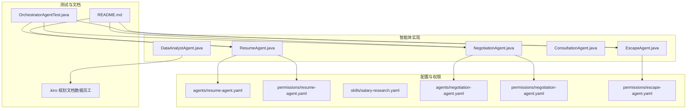
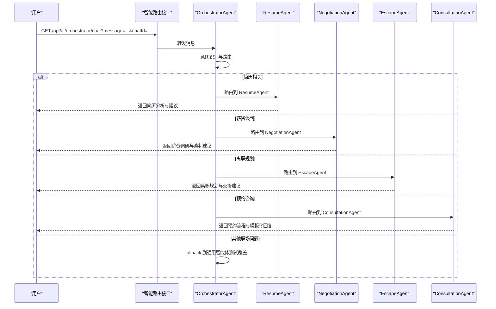
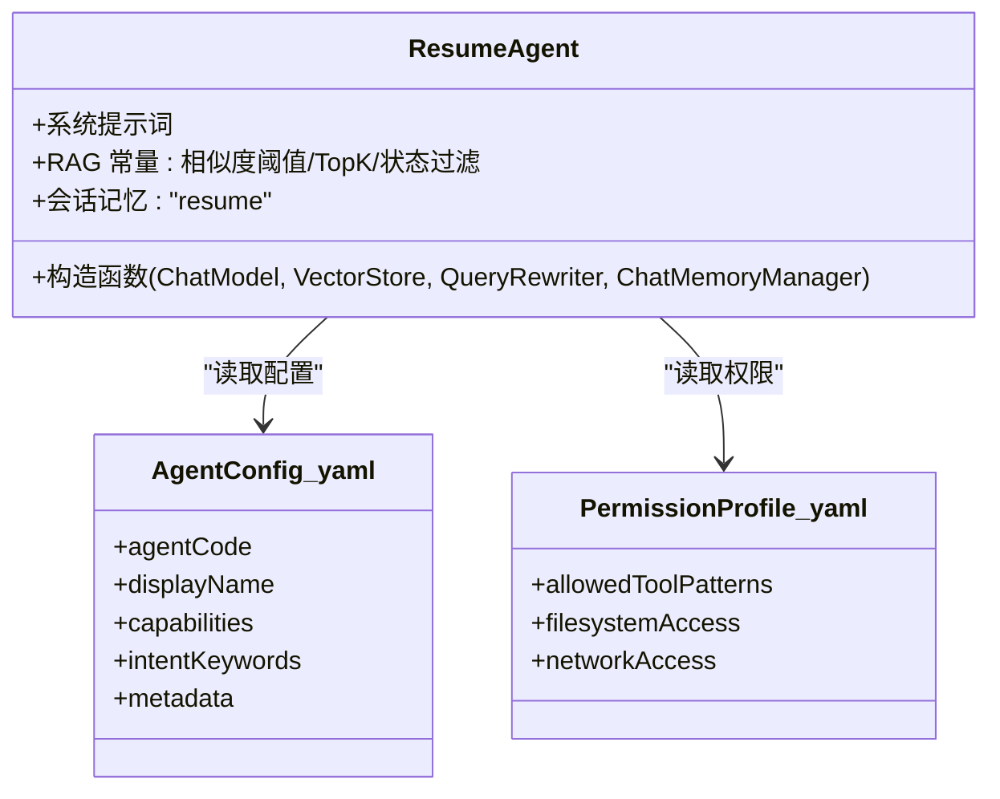
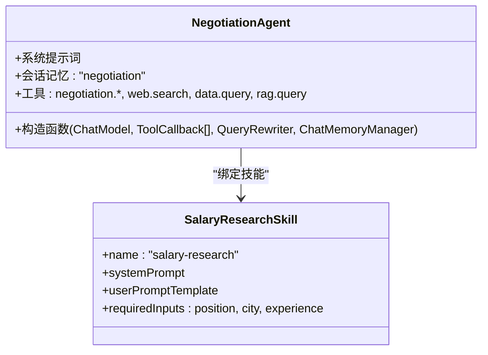
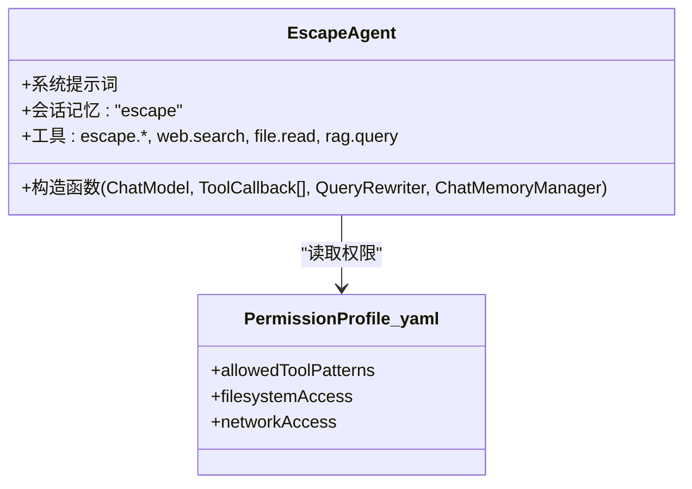
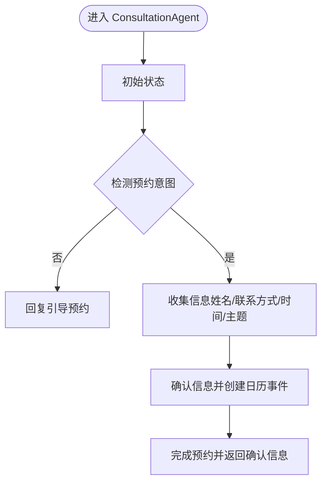
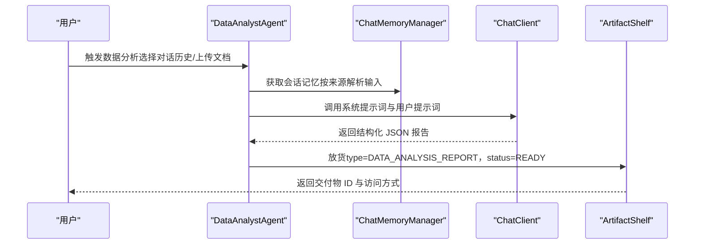
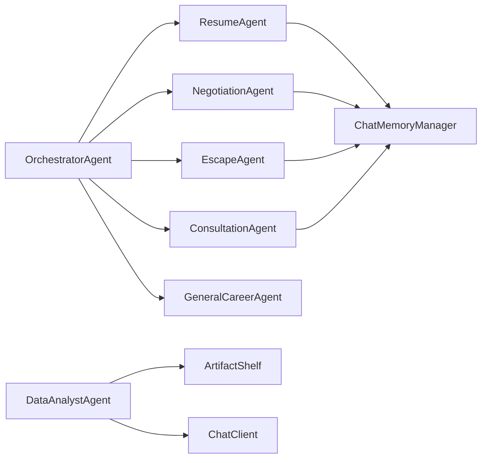

# 智能体类型详解

<cite>
**本文引用的文件**
- [ResumeAgent.java](file://src/main/java/com/yupi/yuaiagent/agent/ResumeAgent.java)
- [resume-agent.yaml](file://src/main/resources/agents/resume-agent.yaml)
- [resume-agent.yaml](file://src/main/resources/permissions/resume-agent.yaml)
- [salary-research.yaml](file://src/main/resources/skills/salary-research.yaml)
- [NegotiationAgent.java](file://src/main/java/com/yupi/yuaiagent/agent/NegotiationAgent.java)
- [negotiation-agent.yaml](file://src/main/resources/agents/negotiation-agent.yaml)
- [negotiation-agent.yaml](file://src/main/resources/permissions/negotiation-agent.yaml)
- [EscapeAgent.java](file://src/main/java/com/yupi/yuaiagent/agent/EscapeAgent.java)
- [escape-agent.yaml](file://src/main/resources/permissions/escape-agent.yaml)
- [ConsultationAgent.java](file://src/main/java/com/yupi/yuaiagent/agent/ConsultationAgent.java)
- [DataAnalystAgent.java](file://src/main/java/com/yupi/yuaiagent/agent/data/DataAnalystAgent.java)
- [.kiro 规划文档（数据员工）](file://.kiro/specs/data-employee-agents/design.md)
- [OrchestratorAgentTest.java](file://src/test/java/com/yupi/yuaiagent/agent/OrchestratorAgentTest.java)
- [README.md](file://README.md)
</cite>

## 目录
1. [简介](#简介)
2. [项目结构](#项目结构)
3. [核心组件](#核心组件)
4. [架构总览](#架构总览)
5. [详细组件分析](#详细组件分析)
6. [依赖分析](#依赖分析)
7. [性能考虑](#性能考虑)
8. [故障排查指南](#故障排查指南)
9. [结论](#结论)
10. [附录](#附录)

## 简介
本文件面向“智能体类型”主题，系统性梳理并说明以下智能体的能力边界、配置与行为特征，并提供典型使用场景与效果参考：
- 简历优化专家（ResumeAgent）：简历分析、优化建议、ATS 适配与面试指导
- 薪资谈判专家（NegotiationAgent）：市场薪资调研、谈判策略、报价建议
- 离职规划师（EscapeAgent）：法律咨询、补偿计算、工作交接与职业过渡
- 职场咨询师（ConsultationAgent）：预约咨询、状态机驱动的交互与模板化回复
- 数据分析师（DataAnalystAgent）：对话/文档数据挖掘、统计分析与结构化报告生成

同时，文档给出各智能体的配置文件格式、参数设置与行为特征，并结合现有测试与原型界面，提供典型使用场景与效果示例。

## 项目结构
围绕智能体的代码与资源分布如下：
- 智能体实现位于 src/main/java/com/yupi/yuaiagent/agent 及其子包
- 智能体与技能的配置位于 src/main/resources/agents、permissions、skills
- 数据员工（含 DataAnalystAgent）的设计与任务说明位于 .kiro/specs/data-employee-agents
- 测试用例位于 src/test/java/com/yupi/yuaiagent/agent，用于验证路由行为
- README.md 提供系统级路由与 API 接口说明

**图表来源**
- [ResumeAgent.java:1-120](file://src/main/java/com/yupi/yuaiagent/agent/ResumeAgent.java#L1-L120)
- [NegotiationAgent.java:1-120](file://src/main/java/com/yupi/yuaiagent/agent/NegotiationAgent.java#L1-L120)
- [EscapeAgent.java:1-120](file://src/main/java/com/yupi/yuaiagent/agent/EscapeAgent.java#L1-L120)
- [ConsultationAgent.java:170-210](file://src/main/java/com/yupi/yuaiagent/agent/ConsultationAgent.java#L170-L210)
- [DataAnalystAgent.java:1-120](file://src/main/java/com/yupi/yuaiagent/agent/data/DataAnalystAgent.java#L1-L120)
- [resume-agent.yaml:1-26](file://src/main/resources/agents/resume-agent.yaml#L1-L26)
- [resume-agent.yaml:1-14](file://src/main/resources/permissions/resume-agent.yaml#L1-L14)
- [salary-research.yaml:1-45](file://src/main/resources/skills/salary-research.yaml#L1-L45)
- [negotiation-agent.yaml:1-22](file://src/main/resources/agents/negotiation-agent.yaml#L1-L22)
- [negotiation-agent.yaml:1-14](file://src/main/resources/permissions/negotiation-agent.yaml#L1-L14)
- [escape-agent.yaml:1-14](file://src/main/resources/permissions/escape-agent.yaml#L1-L14)
- [OrchestratorAgentTest.java:96-113](file://src/test/java/com/yupi/yuaiagent/agent/OrchestratorAgentTest.java#L96-L113)
- [README.md:414-430](file://README.md#L414-L430)

**章节来源**
- [README.md:414-430](file://README.md#L414-L430)
- [OrchestratorAgentTest.java:96-113](file://src/test/java/com/yupi/yuaiagent/agent/OrchestratorAgentTest.java#L96-L113)

## 核心组件
本节概述五类智能体的核心职责与能力边界：
- 简历优化专家（ResumeAgent）：聚焦简历结构、成果量化、面试技巧、Offer 评估与求职策略
- 薪资谈判专家（NegotiationAgent）：市场薪资调研、谈判策略、话术指导、薪资包拆解与时机把握
- 离职规划师（EscapeAgent）：离职时机评估、证据链整理、工作交接清单、离职谈判与劳动权益保护
- 职场咨询师（ConsultationAgent）：预约咨询的状态机与模板化回复，非 LLM 自由生成为主
- 数据分析师（DataAnalystAgent）：对话/文档数据挖掘，生成结构化 JSON 报告并放入共享货架

**章节来源**
- [ResumeAgent.java:26-59](file://src/main/java/com/yupi/yuaiagent/agent/ResumeAgent.java#L26-L59)
- [NegotiationAgent.java:26-63](file://src/main/java/com/yupi/yuaiagent/agent/NegotiationAgent.java#L26-L63)
- [EscapeAgent.java:26-60](file://src/main/java/com/yupi/yuaiagent/agent/EscapeAgent.java#L26-L60)
- [ConsultationAgent.java:173-200](file://src/main/java/com/yupi/yuaiagent/agent/ConsultationAgent.java#L173-L200)
- [DataAnalystAgent.java:23-37](file://src/main/java/com/yupi/yuaiagent/agent/data/DataAnalystAgent.java#L23-L37)

## 架构总览
系统通过智能路由接口将用户消息分发至对应智能体。路由规则与 API 接口见 README；测试用例验证了从通用问题路由到 ResumeAgent 的行为。

**图表来源**
- [README.md:414-430](file://README.md#L414-L430)
- [OrchestratorAgentTest.java:96-113](file://src/test/java/com/yupi/yuaiagent/agent/OrchestratorAgentTest.java#L96-L113)

## 详细组件分析

### 简历优化专家（ResumeAgent）
- 能力要点
  - 简历结构优化：帮助用户打造清晰、有力的简历框架
  - 成果量化表达：将工作经历转化为可量化的成果描述
  - 面试技巧指导：提供 STAR 法则、常见问题应对策略
  - Offer 评估：从薪资、发展空间、公司文化等维度综合评估
  - 求职策略：内推渠道、简历投递时机、岗位匹配度分析
- RAG 配置
  - 相似度阈值、TopK、状态过滤等参数用于检索与增强
- 记忆与会话
  - 使用 ChatMemoryManager 获取共享的“resume”会话记忆
- 配置与权限
  - agent 配置包含显示名、能力标签、意图关键词、图标与分类
  - 权限配置允许 resume.*、rag.query、file.read、profile.read 等工具模式
- 典型使用场景
  - 用户投递简历后无回应，请求诊断与优化建议
  - 用户希望获得面试技巧与 Offer 评估
- 效果示例
  - 原型界面展示了“简历诊断结果”的交互形态与交付物入口

**图表来源**
- [ResumeAgent.java:26-63](file://src/main/java/com/yupi/yuaiagent/agent/ResumeAgent.java#L26-L63)
- [resume-agent.yaml:1-26](file://src/main/resources/agents/resume-agent.yaml#L1-L26)
- [resume-agent.yaml:1-14](file://src/main/resources/permissions/resume-agent.yaml#L1-L14)

**章节来源**
- [ResumeAgent.java:26-63](file://src/main/java/com/yupi/yuaiagent/agent/ResumeAgent.java#L26-L63)
- [resume-agent.yaml:1-26](file://src/main/resources/agents/resume-agent.yaml#L1-L26)
- [resume-agent.yaml:1-14](file://src/main/resources/permissions/resume-agent.yaml#L1-L14)

### 薪资谈判专家（NegotiationAgent）
- 能力要点
  - 市场薪资调研：分析目标岗位的市场薪资区间（可联网搜索）
  - 谈判策略制定：根据用户情况制定个性化的谈判方案
  - 话术指导：提供具体的谈判话术和应对策略
  - 薪资包拆解：分析基本薪资、绩效奖金、股权激励等综合薪酬结构
  - 时机把握：指导何时提出薪资要求、如何应对反压
- 记忆与会话
  - 使用 ChatMemoryManager 获取共享的“negotiation”会话记忆
- 技能绑定
  - salary-research.yaml 技能提供“薪资调研”能力，包含系统提示词、用户提示模板与输入参数定义
- 配置与权限
  - agent 配置包含显示名、能力标签、意图关键词与图标分类
  - 权限配置允许 negotiation.*、web.search、data.query、rag.query 等工具模式
- 典型使用场景
  - 用户收到 Offer，希望评估整体价值与谈判策略
  - 用户需要了解目标岗位的市场薪资范围与谈判话术
- 效果示例
  - 可结合 salary-research.yaml 的输入模板（岗位、城市、经验、附加信息）生成针对性建议

**图表来源**
- [NegotiationAgent.java:26-63](file://src/main/java/com/yupi/yuaiagent/agent/NegotiationAgent.java#L26-L63)
- [salary-research.yaml:1-45](file://src/main/resources/skills/salary-research.yaml#L1-L45)
- [negotiation-agent.yaml:1-22](file://src/main/resources/agents/negotiation-agent.yaml#L1-L22)
- [negotiation-agent.yaml:1-14](file://src/main/resources/permissions/negotiation-agent.yaml#L1-L14)

**章节来源**
- [NegotiationAgent.java:26-63](file://src/main/java/com/yupi/yuaiagent/agent/NegotiationAgent.java#L26-L63)
- [salary-research.yaml:1-45](file://src/main/resources/skills/salary-research.yaml#L1-L45)
- [negotiation-agent.yaml:1-22](file://src/main/resources/agents/negotiation-agent.yaml#L1-L22)
- [negotiation-agent.yaml:1-14](file://src/main/resources/permissions/negotiation-agent.yaml#L1-L14)

### 离职规划师（EscapeAgent）
- 能力要点
  - 离职时机评估：分析当前情况，判断是否是合适的离职时机
  - 证据链整理：指导用户整理工作成果、绩效记录等重要证据
  - 工作交接清单：生成详细的工作交接文档，确保平稳过渡
  - 离职谈判：如何与公司谈判离职条件（补偿、离职时间等）
  - 劳动权益保护：了解相关劳动法规，保护自身合法权益
  - 离职后规划：背调应对、竞业协议处理、下一步职业规划
- 记忆与会话
  - 使用 ChatMemoryManager 获取共享的“escape”会话记忆
- 配置与权限
  - 权限配置允许 escape.*、web.search、file.read、rag.query 等工具模式
- 典型使用场景
  - 用户准备离职，需要交接清单与证据整理指导
  - 用户需要了解劳动法规与离职谈判策略
- 效果示例
  - 可结合文件生成工具输出 PDF 文档（如交接清单）

**图表来源**
- [EscapeAgent.java:26-60](file://src/main/java/com/yupi/yuaiagent/agent/EscapeAgent.java#L26-L60)
- [escape-agent.yaml:1-14](file://src/main/resources/permissions/escape-agent.yaml#L1-L14)

**章节来源**
- [EscapeAgent.java:26-60](file://src/main/java/com/yupi/yuaiagent/agent/EscapeAgent.java#L26-L60)
- [escape-agent.yaml:1-14](file://src/main/resources/permissions/escape-agent.yaml#L1-L14)

### 职场咨询师（ConsultationAgent）
- 能力要点
  - 预约咨询：通过状态机与模板驱动，收集用户信息并创建日历事件
  - 模板化回复：基于 FollowUpTemplateConfig 与状态流转生成标准化回复
  - 结构化任务：意图识别与信息抽取等任务由 LLM 执行，避免污染模板化输出
- 典型使用场景
  - 用户需要预约咨询服务，系统引导完成信息收集与日历创建
- 效果示例
  - 原型界面展示了“预约咨询助手”的交互形态与状态流转

**图表来源**
- [ConsultationAgent.java:173-200](file://src/main/java/com/yupi/yuaiagent/agent/ConsultationAgent.java#L173-L200)

**章节来源**
- [ConsultationAgent.java:173-200](file://src/main/java/com/yupi/yuaiagent/agent/ConsultationAgent.java#L173-L200)

### 数据分析师（DataAnalystAgent）
- 能力要点
  - 数据挖掘：基于对话历史或上传文档进行分析
  - 统计分析：产出结构化 JSON 报告，包含摘要、关键发现、指标与建议
  - 报告生成：将分析结果放入共享货架（ArtifactShelf），类型为 DATA_ANALYSIS_REPORT
- 设计与任务
  - 采用 DataEmployeeAgent 抽象基类，实现 doProduce(ProductionContext) 模板方法
  - 支持两种输入来源：CONVERSATION（对话历史）与 UPLOADED_DOCUMENT（上传文档）
  - 若输入为空或无法解析，返回描述性错误且不产出交付物
  - 产出内容为合法 JSON，保证可解析性
- 典型使用场景
  - 用户希望对一次或多轮对话进行总结与洞察
  - 用户上传文档，要求生成数据分析报告
- 效果示例
  - 报告包含 summary、keyFindings、metrics、recommendations 等字段

**图表来源**
- [DataAnalystAgent.java:23-114](file://src/main/java/com/yupi/yuaiagent/agent/data/DataAnalystAgent.java#L23-L114)
- [.kiro 规划文档（数据员工）:376-434](file://.kiro/specs/data-employee-agents/design.md#L376-L434)

**章节来源**
- [DataAnalystAgent.java:23-114](file://src/main/java/com/yupi/yuaiagent/agent/data/DataAnalystAgent.java#L23-L114)
- [.kiro 规划文档（数据员工）:376-434](file://.kiro/specs/data-employee-agents/design.md#L376-L434)

## 依赖分析
- 智能体间耦合
  - ResumeAgent、NegotiationAgent、EscapeAgent、GeneralCareerAgent、ConsultationAgent 均通过 ChatMemoryManager 获取共享会话记忆，降低重复实现
  - DataAnalystAgent 依赖 ArtifactShelf 与 ChatClient，形成数据员工流水线
- 外部依赖
  - NegotiationAgent 与 EscapeAgent 的权限配置允许网络访问，便于检索与查询
  - ResumeAgent 的权限配置允许文件读取，便于简历相关文档处理
- 路由与测试
  - README 提供路由规则与 API 接口
  - 测试用例验证从通用问题路由到 ResumeAgent 的行为

**图表来源**
- [README.md:414-430](file://README.md#L414-L430)
- [ResumeAgent.java:52-59](file://src/main/java/com/yupi/yuaiagent/agent/ResumeAgent.java#L52-L59)
- [NegotiationAgent.java:45-52](file://src/main/java/com/yupi/yuaiagent/agent/NegotiationAgent.java#L45-L52)
- [EscapeAgent.java:46-53](file://src/main/java/com/yupi/yuaiagent/agent/EscapeAgent.java#L46-L53)
- [DataAnalystAgent.java:94-101](file://src/main/java/com/yupi/yuaiagent/agent/data/DataAnalystAgent.java#L94-L101)

**章节来源**
- [README.md:414-430](file://README.md#L414-L430)
- [OrchestratorAgentTest.java:96-113](file://src/test/java/com/yupi/yuaiagent/agent/OrchestratorAgentTest.java#L96-L113)

## 性能考虑
- 记忆压缩
  - 系统提供对话记忆压缩配置，可通过 Token 阈值、轮数阈值与最近轮数控制压缩触发与保留策略，提升长对话性能
- 工具调用限制
  - 各智能体权限配置包含最大工具调用次数限制，避免单次请求过度消耗资源
- RAG 检索参数
  - ResumeAgent 的 RAG 常量（相似度阈值、TopK、状态过滤）影响检索质量与性能平衡

**章节来源**
- [README.md:378-430](file://README.md#L378-L430)
- [ResumeAgent.java:44-48](file://src/main/java/com/yupi/yuaiagent/agent/ResumeAgent.java#L44-L48)

## 故障排查指南
- 路由失败或未命中预期智能体
  - 检查意图关键词与 agent 配置中的 intentKeywords 是否覆盖用户输入
  - 参考测试用例，确认模糊问题是否正确 fallback 到通用智能体
- 权限不足导致工具调用失败
  - 核对 permissions/*.yaml 中的 allowedToolPatterns、filesystemAccess、networkAccess 设置
- 报告生成失败或内容非法
  - DataAnalystAgent 对输出进行 JSON 合法性兜底，若仍失败，检查输入来源与 ChatClient 配置
- 记忆丢失或过期
  - 确认 ChatMemoryManager 的会话记忆键（如 "resume"/"negotiation"/"escape"）与智能体一致

**章节来源**
- [OrchestratorAgentTest.java:96-113](file://src/test/java/com/yupi/yuaiagent/agent/OrchestratorAgentTest.java#L96-L113)
- [resume-agent.yaml:1-14](file://src/main/resources/permissions/resume-agent.yaml#L1-L14)
- [negotiation-agent.yaml:1-14](file://src/main/resources/permissions/negotiation-agent.yaml#L1-L14)
- [escape-agent.yaml:1-14](file://src/main/resources/permissions/escape-agent.yaml#L1-L14)
- [DataAnalystAgent.java:87-89](file://src/main/java/com/yupi/yuaiagent/agent/data/DataAnalystAgent.java#L87-L89)

## 结论
本文件系统梳理了五类智能体的功能边界、配置与行为特征，并结合现有测试与原型界面提供了典型使用场景与效果参考。通过统一的记忆管理、权限控制与路由机制，系统实现了对简历优化、薪资谈判、离职规划、预约咨询与数据分析等职场场景的覆盖。建议在实际部署中结合业务需求调整意图关键词、权限配置与 RAG 参数，以获得更佳的用户体验与稳定性。

## 附录
- API 接口与路由规则
  - 智能路由接口：GET /api/ai/orchestrator/chat?message={message}&chatId={chatId}
  - 路由规则：简历相关 → ResumeAgent；薪资谈判 → NegotiationAgent；离职规划 → EscapeAgent；数据查询 → DataQueryRouter（零 LLM）；预约咨询 → ConsultationAgent；其他职场问题 → GeneralCareerAgent
- 配置文件位置
  - 智能体配置：src/main/resources/agents/*
  - 权限配置：src/main/resources/permissions/*
  - 技能配置：src/main/resources/skills/*
  - 数据员工设计与任务：.kiro/specs/data-employee-agents/*

**章节来源**
- [README.md:414-430](file://README.md#L414-L430)