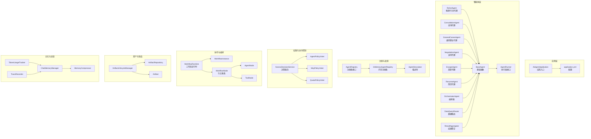
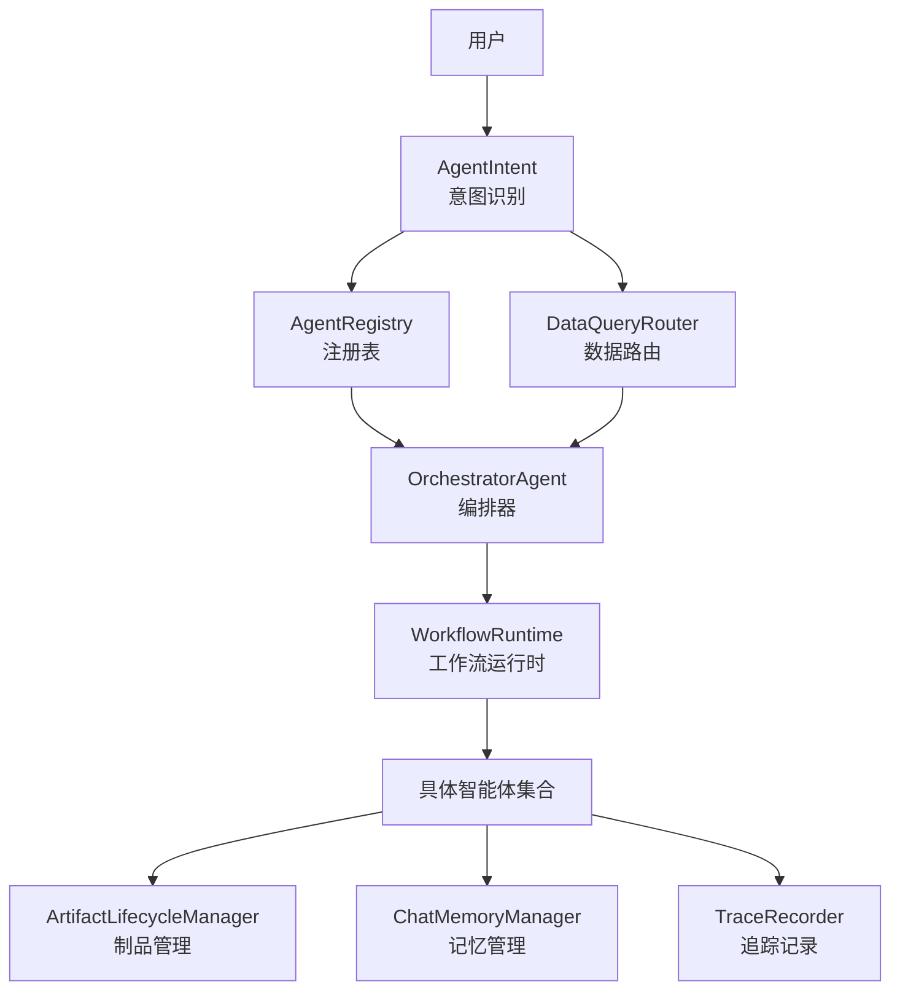
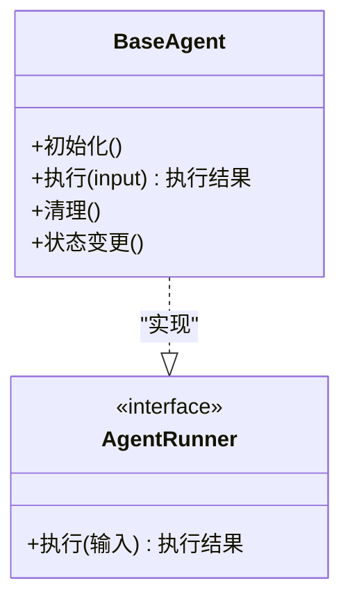
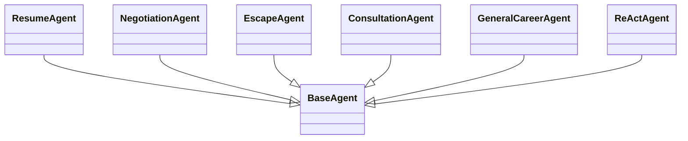
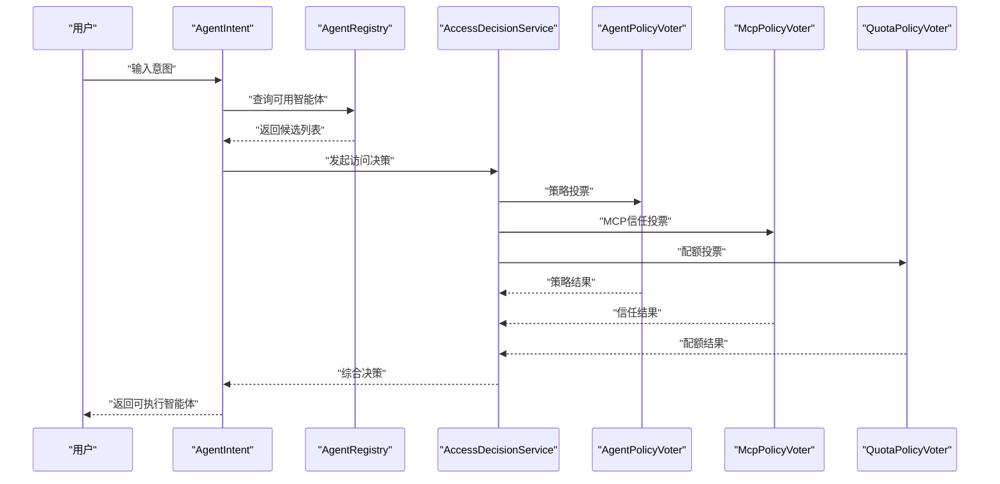
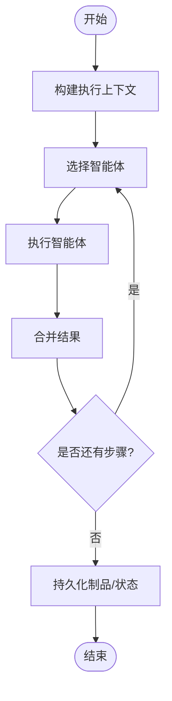
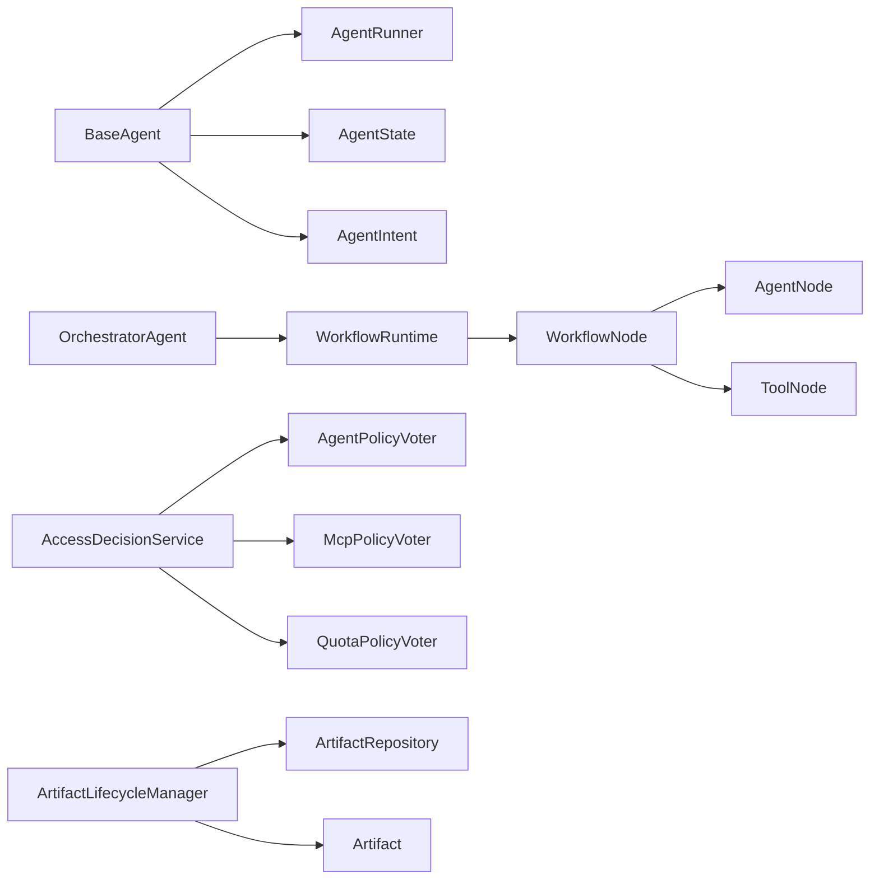

# 智能体系统

<cite>
**本文引用的文件**
- [AiAgentApplication.java](file://src/main/java/com/yupi/yuaiagent/AiAgentApplication.java)
- [BaseAgent.java](file://src/main/java/com/yupi/yuaiagent/agent/BaseAgent.java)
- [AgentRunner.java](file://src/main/java/com/yupi/yuaiagent/agent/AgentRunner.java)
- [ReActAgent.java](file://src/main/java/com/yupi/yuaiagent/agent/ReActAgent.java)
- [ConsultationAgent.java](file://src/main/java/com/yupi/yuaiagent/agent/ConsultationAgent.java)
- [GeneralCareerAgent.java](file://src/main/java/com/yupi/yuaiagent/agent/GeneralCareerAgent.java)
- [NegotiationAgent.java](file://src/main/java/com/yupi/yuaiagent/agent/NegotiationAgent.java)
- [EscapeAgent.java](file://src/main/java/com/yupi/yuaiagent/agent/EscapeAgent.java)
- [OrchestratorAgent.java](file://src/main/java/com/yupi/yuaiagent/agent/OrchestratorAgent.java)
- [ResumeAgent.java](file://src/main/java/com/yupi/yuaiagent/agent/ResumeAgent.java)
- [DataQueryRouter.java](file://src/main/java/com/yupi/yuaiagent/agent/DataQueryRouter.java)
- [ResultAggregator.java](file://src/main/java/com/yupi/yuaiagent/agent/ResultAggregator.java)
- [AgentIntent.java](file://src/main/java/com/yupi/yuaiagent/agent/AgentIntent.java)
- [TaskExecutor.java](file://src/main/java/com/yupi/yuaiagent/agent/TaskExecutor.java)
- [ExecutionResult.java](file://src/main/java/com/yupi/yuaiagent/agent/task/ExecutionResult.java)
- [FailurePolicy.java](file://src/main/java/com/yupi/yuaiagent/agent/task/FailurePolicy.java)
- [TaskStatus.java](file://src/main/java/com/yupi/yuaiagent/agent/task/TaskStatus.java)
- [AgentState.java](file://src/main/java/com/yupi/yuaiagent/agent/model/AgentState.java)
- [ProductionContext.java](file://src/main/java/com/yupi/yuaiagent/agent/data/ProductionContext.java)
- [ProductionResult.java](file://src/main/java/com/yupi/yuaiagent/agent/data/ProductionResult.java)
- [CoreInformation.java](file://src/main/java/com/yupi/yuaiagent/agent/model/CoreInformation.java)
- [FollowUpQuestion.java](file://src/main/java/com/yupi/yuaiagent/agent/model/FollowUpQuestion.java)
- [AgentRegistry.java](file://src/main/java/com/yupi/yuaiagent/registry/AgentRegistry.java)
- [InMemoryAgentRegistry.java](file://src/main/java/com/yupi/yuaiagent/registry/InMemoryAgentRegistry.java)
- [AgentDescriptor.java](file://src/main/java/com/yupi/yuaiagent/registry/AgentDescriptor.java)
- [AccessDecisionService.java](file://src/main/java/com/yupi/yuaiagent/access/AccessDecisionService.java)
- [AgentPolicyVoter.java](file://src/main/java/com/yupi/yuaiagent/access/AgentPolicyVoter.java)
- [McpPolicyVoter.java](file://src/main/java/com/yupi/yuaiagent/access/McpPolicyVoter.java)
- [QuotaPolicyVoter.java](file://src/main/java/com/yupi/yuaiagent/access/QuotaPolicyVoter.java)
- [AccessDecisionContext.java](file://src/main/java/com/yupi/yuaiagent/access/AccessDecisionContext.java)
- [AgentPermissionService.java](file://src/main/java/com/yupi/yuaiagent/permission/AgentPermissionService.java)
- [PermissionProfileRegistry.java](file://src/main/java/com/yupi/yuaiagent/permission/PermissionProfileRegistry.java)
- [PermissionProfile.java](file://src/main/java/com/yupi/yuaiagent/permission/model/PermissionProfile.java)
- [ArtifactLifecycleManager.java](file://src/main/java/com/yupi/yuaiagent/artifact/ArtifactLifecycleManager.java)
- [ArtifactRepository.java](file://src/main/java/com/yupi/yuaiagent/artifact/ArtifactRepository.java)
- [Artifact.java](file://src/main/java/com/yupi/yuaiagent/artifact/model/Artifact.java)
- [ArtifactLifecycleEvent.java](file://src/main/java/com/yupi/yuaiagent/artifact/model/ArtifactLifecycleEvent.java)
- [ArtifactQuery.java](file://src/main/java/com/yupi/yuaiagent/artifact/model/ArtifactQuery.java)
- [ArtifactScope.java](file://src/main/java/com/yupi/yuaiagent/artifact/model/ArtifactScope.java)
- [ArtifactStatus.java](file://src/main/java/com/yupi/yuaiagent/artifact/model/ArtifactStatus.java)
- [ArtifactSummary.java](file://src/main/java/com/yupi/yuaiagent/artifact/model/ArtifactSummary.java)
- [ChatMemoryManager.java](file://src/main/java/com/yupi/yuaiagent/chatmemory/ChatMemoryManager.java)
- [MemoryCompressor.java](file://src/main/java/com/yupi/yuaiagent/chatmemory/MemoryCompressor.java)
- [TokenCompressionStrategy.java](file://src/main/java/com/yupi/yuaiagent/chatmemory/TokenCompressionStrategy.java)
- [TurnCompressionStrategy.java](file://src/main/java/com/yupi/yuaiagent/chatmemory/TurnCompressionStrategy.java)
- [FileBasedChatMemory.java](file://src/main/java/com/yupi/yuaiagent/chatmemory/FileBasedChatMemory.java)
- [TokenUsageTracker.java](file://src/main/java/com/yupi/yuaiagent/budget/TokenUsageTracker.java)
- [TokenBudget.java](file://src/main/java/com/yupi/yuaiagent/budget/TokenBudget.java)
- [TokenUsage.java](file://src/main/java/com/yupi/yuaiagent/budget/TokenUsage.java)
- [TraceRecorder.java](file://src/main/java/com/yupi/yuaiagent/trace/TraceRecorder.java)
- [TraceContext.java](file://src/main/java/com/yupi/yuaiagent/trace/TraceContext.java)
- [TraceRepository.java](file://src/main/java/com/yupi/yuaiagent/trace/TraceRepository.java)
- [TraceStreamPublisher.java](file://src/main/java/com/yupi/yuaiagent/trace/TraceStreamPublisher.java)
- [ExecutionTrace.java](file://src/main/java/com/yupi/yuaiagent/trace/model/ExecutionTrace.java)
- [TraceSpan.java](file://src/main/java/com/yupi/yuaiagent/trace/model/TraceSpan.java)
- [TraceStatus.java](file://src/main/java/com/yupi/yuaiagent/trace/model/TraceStatus.java)
- [TraceStepStatus.java](file://src/main/java/com/yupi/yuaiagent/trace/model/TraceStepStatus.java)
- [TraceStepType.java](file://src/main/java/com/yupi/yuaiagent/trace/model/TraceStepType.java)
- [WorkflowRuntime.java](file://src/main/java/com/yupi/yuaiagent/workflow/runtime/WorkflowRuntime.java)
- [WorkflowInstance.java](file://src/main/java/com/yupi/yuaiagent/workflow/runtime/WorkflowInstance.java)
- [WorkflowRepository.java](file://src/main/java/com/yupi/yuaiagent/workflow/runtime/WorkflowRepository.java)
- [WorkflowStatus.java](file://src/main/java/com/yupi/yuaiagent/workflow/runtime/WorkflowStatus.java)
- [WorkflowNode.java](file://src/main/java/com/yupi/yuaiagent/workflow/node/WorkflowNode.java)
- [AgentNode.java](file://src/main/java/com/yupi/yuaiagent/workflow/node/AgentNode.java)
- [ToolNode.java](file://src/main/java/com/yupi/yuaiagent/workflow/node/ToolNode.java)
- [WorkflowRegistry.java](file://src/main/java/com/yupi/yuaiagent/workflow/WorkflowRegistry.java)
- [WorkflowTemplate.java](file://src/main/java/com/yupi/yuaiagent/workflow/WorkflowTemplate.java)
- [WorkflowMatcher.java](file://src/main/java/com/yupi/yuaiagent/workflow/WorkflowMatcher.java)
- [WorkflowMatchResult.java](file://src/main/java/com/yupi/yuaiagent/workflow/WorkflowMatchResult.java)
- [PlanStep.java](file://src/main/java/com/yupi/yuaiagent/workflow/PlanStep.java)
- [MatchType.java](file://src/main/java/com/yupi/yuaiagent/workflow/MatchType.java)
- [general-agent.yaml](file://src/main/resources/agents/general-agent.yaml)
- [negotiation-agent.yaml](file://src/main/resources/agents/negotiation-agent.yaml)
- [resume-agent.yaml](file://src/main/resources/agents/resume-agent.yaml)
- [admin-agent.yaml](file://src/main/resources/permissions/admin-agent.yaml)
- [consultation-agent.yaml](file://src/main/resources/permissions/consultation-agent.yaml)
- [data-agent.yaml](file://src/main/resources/permissions/data-agent.yaml)
- [escape-agent.yaml](file://src/main/resources/permissions/escape-agent.yaml)
- [general-agent.yaml](file://src/main/resources/permissions/general-agent.yaml)
- [negotiation-agent.yaml](file://src/main/resources/permissions/negotiation-agent.yaml)
- [resume-agent.yaml](file://src/main/resources/permissions/resume-agent.yaml)
- [resignation-letter.yaml](file://src/main/resources/skills/resignation-letter.yaml)
- [salary-research.yaml](file://src/main/resources/skills/salary-research.yaml)
- [application.yml](file://src/main/resources/application.yml)
- [application-local.yml.example](file://src/main/resources/application-local.yml.example)
- [mcp-servers.json](file://src/main/resources/mcp-servers.json)
</cite>

## 目录
1. [引言](#引言)
2. [项目结构](#项目结构)
3. [核心组件](#核心组件)
4. [架构总览](#架构总览)
5. [详细组件分析](#详细组件分析)
6. [依赖分析](#依赖分析)
7. [性能考虑](#性能考虑)
8. [故障排查指南](#故障排查指南)
9. [结论](#结论)
10. [附录](#附录)

## 引言
本技术文档面向多智能体协作系统，系统以“智能体”为核心单元，围绕基础抽象类与生命周期管理展开，提供简历专家、薪资谈判专家、离职规划师、职场咨询师等典型角色的实现思路与扩展指南。文档涵盖智能体注册机制、发现策略、权限控制、协作模式（编排器、工作流）、消息与状态管理、性能优化与资源管理、以及可操作的开发与调试建议。

## 项目结构
系统采用分层与功能域结合的组织方式：
- 应用入口与配置：应用启动类、全局配置与示例配置
- 智能体域：基础抽象、具体智能体、执行器、任务模型、状态模型
- 注册与发现：智能体注册表与描述符
- 权限与访问控制：策略投票与决策服务
- 协作与编排：编排器、工作流节点与运行时
- 资产与制品：制品生命周期管理
- 记忆与追踪：对话记忆压缩策略、令牌预算、执行追踪
- 工具与技能：工具集与技能模板
- 前端与集成：前端工程与MCP服务器配置

图表来源
- [AiAgentApplication.java](file://src/main/java/com/yupi/yuaiagent/AiAgentApplication.java)
- [BaseAgent.java](file://src/main/java/com/yupi/yuaiagent/agent/BaseAgent.java)
- [AgentRunner.java](file://src/main/java/com/yupi/yuaiagent/agent/AgentRunner.java)
- [ReActAgent.java](file://src/main/java/com/yupi/yuaiagent/agent/ReActAgent.java)
- [ConsultationAgent.java](file://src/main/java/com/yupi/yuaiagent/agent/ConsultationAgent.java)
- [GeneralCareerAgent.java](file://src/main/java/com/yupi/yuaiagent/agent/GeneralCareerAgent.java)
- [NegotiationAgent.java](file://src/main/java/com/yupi/yuaiagent/agent/NegotiationAgent.java)
- [EscapeAgent.java](file://src/main/java/com/yupi/yuaiagent/agent/EscapeAgent.java)
- [OrchestratorAgent.java](file://src/main/java/com/yupi/yuaiagent/agent/OrchestratorAgent.java)
- [ResumeAgent.java](file://src/main/java/com/yupi/yuaiagent/agent/ResumeAgent.java)
- [DataQueryRouter.java](file://src/main/java/com/yupi/yuaiagent/agent/DataQueryRouter.java)
- [ResultAggregator.java](file://src/main/java/com/yupi/yuaiagent/agent/ResultAggregator.java)
- [AgentRegistry.java](file://src/main/java/com/yupi/yuaiagent/registry/AgentRegistry.java)
- [InMemoryAgentRegistry.java](file://src/main/java/com/yupi/yuaiagent/registry/InMemoryAgentRegistry.java)
- [AgentDescriptor.java](file://src/main/java/com/yupi/yuaiagent/registry/AgentDescriptor.java)
- [AccessDecisionService.java](file://src/main/java/com/yupi/yuaiagent/access/AccessDecisionService.java)
- [AgentPolicyVoter.java](file://src/main/java/com/yupi/yuaiagent/access/AgentPolicyVoter.java)
- [McpPolicyVoter.java](file://src/main/java/com/yupi/yuaiagent/access/McpPolicyVoter.java)
- [QuotaPolicyVoter.java](file://src/main/java/com/yupi/yuaiagent/access/QuotaPolicyVoter.java)
- [WorkflowRuntime.java](file://src/main/java/com/yupi/yuaiagent/workflow/runtime/WorkflowRuntime.java)
- [WorkflowInstance.java](file://src/main/java/com/yupi/yuaiagent/workflow/runtime/WorkflowInstance.java)
- [WorkflowNode.java](file://src/main/java/com/yupi/yuaiagent/workflow/node/WorkflowNode.java)
- [AgentNode.java](file://src/main/java/com/yupi/yuaiagent/workflow/node/AgentNode.java)
- [ToolNode.java](file://src/main/java/com/yupi/yuaiagent/workflow/node/ToolNode.java)
- [ArtifactLifecycleManager.java](file://src/main/java/com/yupi/yuaiagent/artifact/ArtifactLifecycleManager.java)
- [ArtifactRepository.java](file://src/main/java/com/yupi/yuaiagent/artifact/ArtifactRepository.java)
- [Artifact.java](file://src/main/java/com/yupi/yuaiagent/artifact/model/Artifact.java)
- [ChatMemoryManager.java](file://src/main/java/com/yupi/yuaiagent/chatmemory/ChatMemoryManager.java)
- [MemoryCompressor.java](file://src/main/java/com/yupi/yuaiagent/chatmemory/MemoryCompressor.java)
- [TokenUsageTracker.java](file://src/main/java/com/yupi/yuaiagent/budget/TokenUsageTracker.java)
- [TraceRecorder.java](file://src/main/java/com/yupi/yuaiagent/trace/TraceRecorder.java)

章节来源
- [AiAgentApplication.java](file://src/main/java/com/yupi/yuaiagent/AiAgentApplication.java)
- [application.yml](file://src/main/resources/application.yml)

## 核心组件
- 基础抽象与生命周期
  - BaseAgent：定义智能体的统一抽象，承载状态、意图、上下文与执行入口
  - AgentRunner：智能体执行器接口，规范执行流程与返回值
  - AgentIntent：意图模型，用于识别用户意图与路由到对应智能体
  - AgentState：智能体状态枚举，用于生命周期与状态机管理
- 执行与任务模型
  - TaskExecutor：任务执行器，封装单步执行逻辑
  - ExecutionResult：执行结果模型，包含状态、输出与错误信息
  - TaskStatus/FailurePolicy：任务状态与失败策略，支撑重试与降级
- 数据与上下文
  - ProductionContext/ProductionResult：生产上下文与结果模型
  - CoreInformation/FollowUpQuestion：核心信息与追问模型
- 注册与发现
  - AgentRegistry/InMemoryAgentRegistry：智能体注册表与内存实现
  - AgentDescriptor：智能体元数据描述符，包含名称、类型、能力等
- 权限与访问控制
  - AccessDecisionService：访问决策服务，聚合多个投票器进行综合决策
  - AgentPolicyVoter/McpPolicyVoter/QuotaPolicyVoter：策略投票器，分别负责智能体策略、MCP信任与配额
- 协作与编排
  - OrchestratorAgent：编排器，协调多个智能体完成复杂任务
  - WorkflowRuntime/WorkflowNode：工作流运行时与节点基类，支持并行、条件、循环等
  - AgentNode/ToolNode：工作流中的智能体节点与工具节点
- 资产与制品
  - ArtifactLifecycleManager/ArtifactRepository/Artifact：制品生命周期管理与仓储
- 记忆与追踪
  - ChatMemoryManager/MemoryCompressor/TokenCompressionStrategy/TurnCompressionStrategy：对话记忆压缩策略
  - TokenUsageTracker/TokenBudget：令牌预算与使用统计
  - TraceRecorder/TraceContext/TraceRepository/TraceStreamPublisher：执行追踪与发布
- 配置与资源
  - YAML配置：agents/permissions/skills/templates 等资源文件
  - application.yml/application-local.yml.example：应用配置与本地示例
  - mcp-servers.json：MCP服务器配置

章节来源
- [BaseAgent.java](file://src/main/java/com/yupi/yuaiagent/agent/BaseAgent.java)
- [AgentRunner.java](file://src/main/java/com/yupi/yuaiagent/agent/AgentRunner.java)
- [AgentIntent.java](file://src/main/java/com/yupi/yuaiagent/agent/AgentIntent.java)
- [AgentState.java](file://src/main/java/com/yupi/yuaiagent/agent/model/AgentState.java)
- [TaskExecutor.java](file://src/main/java/com/yupi/yuaiagent/agent/TaskExecutor.java)
- [ExecutionResult.java](file://src/main/java/com/yupi/yuaiagent/agent/task/ExecutionResult.java)
- [TaskStatus.java](file://src/main/java/com/yupi/yuaiagent/agent/task/TaskStatus.java)
- [FailurePolicy.java](file://src/main/java/com/yupi/yuaiagent/agent/task/FailurePolicy.java)
- [ProductionContext.java](file://src/main/java/com/yupi/yuaiagent/agent/data/ProductionContext.java)
- [ProductionResult.java](file://src/main/java/com/yupi/yuaiagent/agent/data/ProductionResult.java)
- [CoreInformation.java](file://src/main/java/com/yupi/yuaiagent/agent/model/CoreInformation.java)
- [FollowUpQuestion.java](file://src/main/java/com/yupi/yuaiagent/agent/model/FollowUpQuestion.java)
- [AgentRegistry.java](file://src/main/java/com/yupi/yuaiagent/registry/AgentRegistry.java)
- [InMemoryAgentRegistry.java](file://src/main/java/com/yupi/yuaiagent/registry/InMemoryAgentRegistry.java)
- [AgentDescriptor.java](file://src/main/java/com/yupi/yuaiagent/registry/AgentDescriptor.java)
- [AccessDecisionService.java](file://src/main/java/com/yupi/yuaiagent/access/AccessDecisionService.java)
- [AgentPolicyVoter.java](file://src/main/java/com/yupi/yuaiagent/access/AgentPolicyVoter.java)
- [McpPolicyVoter.java](file://src/main/java/com/yupi/yuaiagent/access/McpPolicyVoter.java)
- [QuotaPolicyVoter.java](file://src/main/java/com/yupi/yuaiagent/access/QuotaPolicyVoter.java)
- [OrchestratorAgent.java](file://src/main/java/com/yupi/yuaiagent/agent/OrchestratorAgent.java)
- [WorkflowRuntime.java](file://src/main/java/com/yupi/yuaiagent/workflow/runtime/WorkflowRuntime.java)
- [WorkflowNode.java](file://src/main/java/com/yupi/yuaiagent/workflow/node/WorkflowNode.java)
- [AgentNode.java](file://src/main/java/com/yupi/yuaiagent/workflow/node/AgentNode.java)
- [ToolNode.java](file://src/main/java/com/yupi/yuaiagent/workflow/node/ToolNode.java)
- [ArtifactLifecycleManager.java](file://src/main/java/com/yupi/yuaiagent/artifact/ArtifactLifecycleManager.java)
- [ArtifactRepository.java](file://src/main/java/com/yupi/yuaiagent/artifact/ArtifactRepository.java)
- [Artifact.java](file://src/main/java/com/yupi/yuaiagent/artifact/model/Artifact.java)
- [ChatMemoryManager.java](file://src/main/java/com/yupi/yuaiagent/chatmemory/ChatMemoryManager.java)
- [MemoryCompressor.java](file://src/main/java/com/yupi/yuaiagent/chatmemory/MemoryCompressor.java)
- [TokenUsageTracker.java](file://src/main/java/com/yupi/yuaiagent/budget/TokenUsageTracker.java)
- [TraceRecorder.java](file://src/main/java/com/yupi/yuaiagent/trace/TraceRecorder.java)
- [application.yml](file://src/main/resources/application.yml)
- [mcp-servers.json](file://src/main/resources/mcp-servers.json)

## 架构总览
系统采用“智能体 + 编排器 + 工作流”的协作架构：
- 智能体层：以 BaseAgent 为抽象，不同专业领域智能体（如简历、谈判、咨询、离职）实现各自 Runner 与执行逻辑
- 发现与路由：通过 AgentRegistry 与 AgentDescriptor 进行注册与发现；DataQueryRouter 可按意图或上下文进行路由
- 权限与配额：AccessDecisionService 综合策略投票器进行访问决策，结合配额限制
- 协作与编排：OrchestratorAgent 负责跨智能体编排；WorkflowRuntime 将编排转化为可执行的工作流图
- 资产与制品：Artifact 系列贯穿产出物生命周期，从创建、流转到归档
- 记忆与追踪：ChatMemoryManager 与 TokenUsageTracker 管理对话与成本；TraceRecorder 提供执行链路追踪
- 配置与资源：YAML 配置文件定义智能体能力、权限与技能模板；application.yml 提供运行参数

图表来源
- [AgentIntent.java](file://src/main/java/com/yupi/yuaiagent/agent/AgentIntent.java)
- [AgentRegistry.java](file://src/main/java/com/yupi/yuaiagent/registry/AgentRegistry.java)
- [InMemoryAgentRegistry.java](file://src/main/java/com/yupi/yuaiagent/registry/InMemoryAgentRegistry.java)
- [DataQueryRouter.java](file://src/main/java/com/yupi/yuaiagent/agent/DataQueryRouter.java)
- [OrchestratorAgent.java](file://src/main/java/com/yupi/yuaiagent/agent/OrchestratorAgent.java)
- [WorkflowRuntime.java](file://src/main/java/com/yupi/yuaiagent/workflow/runtime/WorkflowRuntime.java)
- [ArtifactLifecycleManager.java](file://src/main/java/com/yupi/yuaiagent/artifact/ArtifactLifecycleManager.java)
- [ChatMemoryManager.java](file://src/main/java/com/yupi/yuaiagent/chatmemory/ChatMemoryManager.java)
- [TraceRecorder.java](file://src/main/java/com/yupi/yuaiagent/trace/TraceRecorder.java)

## 详细组件分析

### 基础抽象与生命周期（BaseAgent）
- 设计要点
  - 统一的状态管理与生命周期钩子
  - 上下文构建与意图解析
  - 与 AgentRunner 的解耦，便于替换执行策略
- 关键职责
  - 初始化、执行、清理
  - 状态转换与持久化
  - 与其他智能体的协作边界

图表来源
- [BaseAgent.java](file://src/main/java/com/yupi/yuaiagent/agent/BaseAgent.java)
- [AgentRunner.java](file://src/main/java/com/yupi/yuaiagent/agent/AgentRunner.java)

章节来源
- [BaseAgent.java](file://src/main/java/com/yupi/yuaiagent/agent/BaseAgent.java)
- [AgentRunner.java](file://src/main/java/com/yupi/yuaiagent/agent/AgentRunner.java)
- [AgentState.java](file://src/main/java/com/yupi/yuaiagent/agent/model/AgentState.java)

### 具体智能体与功能特性
- 简历专家（ResumeAgent）
  - 职责：简历内容优化、格式调整、关键词匹配、投递建议
  - 特性：与技能模板（如简历技能）联动，生成可执行的生产结果
- 薪资谈判专家（NegotiationAgent）
  - 职责：市场薪酬研究、谈判策略制定、模拟演练、风险评估
  - 特性：结合薪酬研究技能与历史数据，输出可量化的建议
- 离职规划师（EscapeAgent）
  - 职责：离职原因分析、交接计划、法律与补偿建议
  - 特性：与辞职信技能模板配合，形成完整流程
- 职场咨询师（ConsultationAgent/GeneralCareerAgent）
  - 职责：职业路径规划、技能补强建议、晋升通道分析
  - 特性：基于核心信息与追问模型，提供持续引导

图表来源
- [ResumeAgent.java](file://src/main/java/com/yupi/yuaiagent/agent/ResumeAgent.java)
- [NegotiationAgent.java](file://src/main/java/com/yupi/yuaiagent/agent/NegotiationAgent.java)
- [EscapeAgent.java](file://src/main/java/com/yupi/yuaiagent/agent/EscapeAgent.java)
- [ConsultationAgent.java](file://src/main/java/com/yupi/yuaiagent/agent/ConsultationAgent.java)
- [GeneralCareerAgent.java](file://src/main/java/com/yupi/yuaiagent/agent/GeneralCareerAgent.java)
- [ReActAgent.java](file://src/main/java/com/yupi/yuaiagent/agent/ReActAgent.java)
- [BaseAgent.java](file://src/main/java/com/yupi/yuaiagent/agent/BaseAgent.java)

章节来源
- [ResumeAgent.java](file://src/main/java/com/yupi/yuaiagent/agent/ResumeAgent.java)
- [NegotiationAgent.java](file://src/main/java/com/yupi/yuaiagent/agent/NegotiationAgent.java)
- [EscapeAgent.java](file://src/main/java/com/yupi/yuaiagent/agent/EscapeAgent.java)
- [ConsultationAgent.java](file://src/main/java/com/yupi/yuaiagent/agent/ConsultationAgent.java)
- [GeneralCareerAgent.java](file://src/main/java/com/yupi/yuaiagent/agent/GeneralCareerAgent.java)
- [ReActAgent.java](file://src/main/java/com/yupi/yuaiagent/agent/ReActAgent.java)

### 注册机制、发现策略与权限控制
- 注册与发现
  - AgentRegistry 接口与 InMemoryAgentRegistry 内存实现，提供智能体注册、查询与遍历
  - AgentDescriptor 描述智能体的能力、类型、标签等元信息，作为发现依据
- 权限控制
  - AccessDecisionService 聚合多个投票器（AgentPolicyVoter、McpPolicyVoter、QuotaPolicyVoter），在执行前进行综合决策
  - 结合 PermissionProfileRegistry 与 PermissionProfile，实现基于角色的权限配置
- 发现策略
  - 基于 AgentIntent 与 AgentDescriptor 的能力匹配，选择最合适的智能体
  - DataQueryRouter 可根据上下文与意图进行二次路由

图表来源
- [AgentIntent.java](file://src/main/java/com/yupi/yuaiagent/agent/AgentIntent.java)
- [AgentRegistry.java](file://src/main/java/com/yupi/yuaiagent/registry/AgentRegistry.java)
- [InMemoryAgentRegistry.java](file://src/main/java/com/yupi/yuaiagent/registry/InMemoryAgentRegistry.java)
- [AccessDecisionService.java](file://src/main/java/com/yupi/yuaiagent/access/AccessDecisionService.java)
- [AgentPolicyVoter.java](file://src/main/java/com/yupi/yuaiagent/access/AgentPolicyVoter.java)
- [McpPolicyVoter.java](file://src/main/java/com/yupi/yuaiagent/access/McpPolicyVoter.java)
- [QuotaPolicyVoter.java](file://src/main/java/com/yupi/yuaiagent/access/QuotaPolicyVoter.java)

章节来源
- [AgentRegistry.java](file://src/main/java/com/yupi/yuaiagent/registry/AgentRegistry.java)
- [InMemoryAgentRegistry.java](file://src/main/java/com/yupi/yuaiagent/registry/InMemoryAgentRegistry.java)
- [AgentDescriptor.java](file://src/main/java/com/yupi/yuaiagent/registry/AgentDescriptor.java)
- [AccessDecisionService.java](file://src/main/java/com/yupi/yuaiagent/access/AccessDecisionService.java)
- [AgentPolicyVoter.java](file://src/main/java/com/yupi/yuaiagent/access/AgentPolicyVoter.java)
- [McpPolicyVoter.java](file://src/main/java/com/yupi/yuaiagent/access/McpPolicyVoter.java)
- [QuotaPolicyVoter.java](file://src/main/java/com/yupi/yuaiagent/access/QuotaPolicyVoter.java)
- [AgentPermissionService.java](file://src/main/java/com/yupi/yuaiagent/permission/AgentPermissionService.java)
- [PermissionProfileRegistry.java](file://src/main/java/com/yupi/yuaiagent/permission/PermissionProfileRegistry.java)
- [PermissionProfile.java](file://src/main/java/com/yupi/yuaiagent/permission/model/PermissionProfile.java)

### 协作模式、消息传递与状态同步
- 协作模式
  - 编排器（OrchestratorAgent）：协调多个智能体，按顺序或并行执行，并进行结果汇聚
  - 工作流（WorkflowRuntime）：将编排逻辑图式化，支持条件、并行、循环等节点类型
- 消息传递
  - 通过 ChatMemoryManager 管理会话消息，结合 MemoryCompressor 与 TokenCompressionStrategy 控制成本
  - 通过 TraceRecorder 记录执行链路，便于回溯与审计
- 状态同步
  - 使用 AgentState 与 WorkflowStatus 管理状态机
  - 通过 ArtifactLifecycleManager 同步制品状态与版本

图表来源
- [OrchestratorAgent.java](file://src/main/java/com/yupi/yuaiagent/agent/OrchestratorAgent.java)
- [WorkflowRuntime.java](file://src/main/java/com/yupi/yuaiagent/workflow/runtime/WorkflowRuntime.java)
- [WorkflowNode.java](file://src/main/java/com/yupi/yuaiagent/workflow/node/WorkflowNode.java)
- [AgentNode.java](file://src/main/java/com/yupi/yuaiagent/workflow/node/AgentNode.java)
- [ToolNode.java](file://src/main/java/com/yupi/yuaiagent/workflow/node/ToolNode.java)
- [ChatMemoryManager.java](file://src/main/java/com/yupi/yuaiagent/chatmemory/ChatMemoryManager.java)
- [MemoryCompressor.java](file://src/main/java/com/yupi/yuaiagent/chatmemory/MemoryCompressor.java)
- [TokenCompressionStrategy.java](file://src/main/java/com/yupi/yuaiagent/chatmemory/TokenCompressionStrategy.java)
- [TraceRecorder.java](file://src/main/java/com/yupi/yuaiagent/trace/TraceRecorder.java)
- [ArtifactLifecycleManager.java](file://src/main/java/com/yupi/yuaiagent/artifact/ArtifactLifecycleManager.java)

章节来源
- [OrchestratorAgent.java](file://src/main/java/com/yupi/yuaiagent/agent/OrchestratorAgent.java)
- [WorkflowRuntime.java](file://src/main/java/com/yupi/yuaiagent/workflow/runtime/WorkflowRuntime.java)
- [WorkflowNode.java](file://src/main/java/com/yupi/yuaiagent/workflow/node/WorkflowNode.java)
- [AgentNode.java](file://src/main/java/com/yupi/yuaiagent/workflow/node/AgentNode.java)
- [ToolNode.java](file://src/main/java/com/yupi/yuaiagent/workflow/node/ToolNode.java)
- [ChatMemoryManager.java](file://src/main/java/com/yupi/yuaiagent/chatmemory/ChatMemoryManager.java)
- [MemoryCompressor.java](file://src/main/java/com/yupi/yuaiagent/chatmemory/MemoryCompressor.java)
- [TokenCompressionStrategy.java](file://src/main/java/com/yupi/yuaiagent/chatmemory/TokenCompressionStrategy.java)
- [TraceRecorder.java](file://src/main/java/com/yupi/yuaiagent/trace/TraceRecorder.java)
- [ArtifactLifecycleManager.java](file://src/main/java/com/yupi/yuaiagent/artifact/ArtifactLifecycleManager.java)

### 自定义智能体开发指南
- 继承关系与接口实现
  - 新智能体应继承 BaseAgent，并实现 AgentRunner 接口
  - 若需复杂交互，可参考 ReActAgent 的推理-行动范式
- 配置文件编写
  - 在 agents/ 下新增 YAML 文件，定义智能体能力、提示词模板与默认参数
  - 在 permissions/ 下新增 YAML 文件，定义权限与信任策略
  - 在 skills/ 下新增 YAML 文件，定义可复用技能模板
- 开发步骤
  - 定义 AgentIntent 与 AgentDescriptor，确保被注册与发现
  - 实现执行逻辑与结果聚合（可参考 ResultAggregator）
  - 配置权限与配额，确保安全可控
  - 添加追踪与日志，便于调试与审计

章节来源
- [BaseAgent.java](file://src/main/java/com/yupi/yuaiagent/agent/BaseAgent.java)
- [AgentRunner.java](file://src/main/java/com/yupi/yuaiagent/agent/AgentRunner.java)
- [ReActAgent.java](file://src/main/java/com/yupi/yuaiagent/agent/ReActAgent.java)
- [ResultAggregator.java](file://src/main/java/com/yupi/yuaiagent/agent/ResultAggregator.java)
- [AgentDescriptor.java](file://src/main/java/com/yupi/yuaiagent/registry/AgentDescriptor.java)
- [general-agent.yaml](file://src/main/resources/agents/general-agent.yaml)
- [negotiation-agent.yaml](file://src/main/resources/agents/negotiation-agent.yaml)
- [resume-agent.yaml](file://src/main/resources/agents/resume-agent.yaml)
- [admin-agent.yaml](file://src/main/resources/permissions/admin-agent.yaml)
- [consultation-agent.yaml](file://src/main/resources/permissions/consultation-agent.yaml)
- [data-agent.yaml](file://src/main/resources/permissions/data-agent.yaml)
- [escape-agent.yaml](file://src/main/resources/permissions/escape-agent.yaml)
- [general-agent.yaml](file://src/main/resources/permissions/general-agent.yaml)
- [negotiation-agent.yaml](file://src/main/resources/permissions/negotiation-agent.yaml)
- [resume-agent.yaml](file://src/main/resources/permissions/resume-agent.yaml)
- [resignation-letter.yaml](file://src/main/resources/skills/resignation-letter.yaml)
- [salary-research.yaml](file://src/main/resources/skills/salary-research.yaml)

## 依赖分析
- 组件耦合与内聚
  - 智能体与执行器解耦，提升可测试性与可替换性
  - 编排器与工作流运行时通过节点抽象解耦，便于扩展新节点类型
  - 权限控制通过投票器模式实现高内聚低耦合
- 外部依赖与集成点
  - MCP 服务器配置（mcp-servers.json）用于外部工具集成
  - YAML 配置文件作为外部化配置，便于环境隔离
- 循环依赖
  - 当前结构未见明显循环依赖；若扩展工作流节点，需避免节点间相互引用

图表来源
- [BaseAgent.java](file://src/main/java/com/yupi/yuaiagent/agent/BaseAgent.java)
- [AgentRunner.java](file://src/main/java/com/yupi/yuaiagent/agent/AgentRunner.java)
- [AgentState.java](file://src/main/java/com/yupi/yuaiagent/agent/model/AgentState.java)
- [AgentIntent.java](file://src/main/java/com/yupi/yuaiagent/agent/AgentIntent.java)
- [OrchestratorAgent.java](file://src/main/java/com/yupi/yuaiagent/agent/OrchestratorAgent.java)
- [WorkflowRuntime.java](file://src/main/java/com/yupi/yuaiagent/workflow/runtime/WorkflowRuntime.java)
- [WorkflowNode.java](file://src/main/java/com/yupi/yuaiagent/workflow/node/WorkflowNode.java)
- [AgentNode.java](file://src/main/java/com/yupi/yuaiagent/workflow/node/AgentNode.java)
- [ToolNode.java](file://src/main/java/com/yupi/yuaiagent/workflow/node/ToolNode.java)
- [AccessDecisionService.java](file://src/main/java/com/yupi/yuaiagent/access/AccessDecisionService.java)
- [AgentPolicyVoter.java](file://src/main/java/com/yupi/yuaiagent/access/AgentPolicyVoter.java)
- [McpPolicyVoter.java](file://src/main/java/com/yupi/yuaiagent/access/McpPolicyVoter.java)
- [QuotaPolicyVoter.java](file://src/main/java/com/yupi/yuaiagent/access/QuotaPolicyVoter.java)
- [ArtifactLifecycleManager.java](file://src/main/java/com/yupi/yuaiagent/artifact/ArtifactLifecycleManager.java)
- [ArtifactRepository.java](file://src/main/java/com/yupi/yuaiagent/artifact/ArtifactRepository.java)
- [Artifact.java](file://src/main/java/com/yupi/yuaiagent/artifact/model/Artifact.java)

章节来源
- [WorkflowRegistry.java](file://src/main/java/com/yupi/yuaiagent/workflow/WorkflowRegistry.java)
- [WorkflowTemplate.java](file://src/main/java/com/yupi/yuaiagent/workflow/WorkflowTemplate.java)
- [WorkflowMatcher.java](file://src/main/java/com/yupi/yuaiagent/workflow/WorkflowMatcher.java)
- [WorkflowMatchResult.java](file://src/main/java/com/yupi/yuaiagent/workflow/WorkflowMatchResult.java)
- [PlanStep.java](file://src/main/java/com/yupi/yuaiagent/workflow/PlanStep.java)
- [MatchType.java](file://src/main/java/com/yupi/yuaiagent/workflow/MatchType.java)

## 性能考虑
- 记忆与成本控制
  - 使用 TokenCompressionStrategy 与 TurnCompressionStrategy 控制上下文长度，降低令牌消耗
  - 通过 TokenUsageTracker 与 TokenBudget 实时监控与限制使用量
- 并行与批处理
  - 工作流中的并行节点（ParallelNode）提升吞吐；注意资源竞争与状态一致性
- 缓存与压缩
  - ChatMemoryManager 支持文件存储与压缩策略，减少内存占用
- 超时与重试
  - FailurePolicy 与 TaskStatus 配合，设置合理的超时与重试策略，避免阻塞

章节来源
- [TokenCompressionStrategy.java](file://src/main/java/com/yupi/yuaiagent/chatmemory/TokenCompressionStrategy.java)
- [TurnCompressionStrategy.java](file://src/main/java/com/yupi/yuaiagent/chatmemory/TurnCompressionStrategy.java)
- [TokenUsageTracker.java](file://src/main/java/com/yupi/yuaiagent/budget/TokenUsageTracker.java)
- [TokenBudget.java](file://src/main/java/com/yupi/yuaiagent/budget/TokenBudget.java)
- [TokenUsage.java](file://src/main/java/com/yupi/yuaiagent/budget/TokenUsage.java)
- [FileBasedChatMemory.java](file://src/main/java/com/yupi/yuaiagent/chatmemory/FileBasedChatMemory.java)
- [FailurePolicy.java](file://src/main/java/com/yupi/yuaiagent/agent/task/FailurePolicy.java)
- [TaskStatus.java](file://src/main/java/com/yupi/yuaiagent/agent/task/TaskStatus.java)

## 故障排查指南
- 权限与配额问题
  - 检查 AccessDecisionContext 与各投票器返回，确认策略与配额限制
  - 对照 permissions/ 下的 YAML 配置，核对角色与能力映射
- 执行异常
  - 查看 ExecutionResult 中的状态与错误信息，结合 TraceRecorder 的执行链路定位问题
  - 使用 TraceRepository 查询历史执行记录，辅助复盘
- 记忆溢出
  - 检查 MemoryCompressor 配置与 TokenCompressionStrategy 参数，必要时降低上下文窗口
- 工作流卡死
  - 检查 WorkflowStatus 与节点状态，确认是否存在死锁或无限循环

章节来源
- [AccessDecisionContext.java](file://src/main/java/com/yupi/yuaiagent/access/AccessDecisionContext.java)
- [AgentPolicyVoter.java](file://src/main/java/com/yupi/yuaiagent/access/AgentPolicyVoter.java)
- [McpPolicyVoter.java](file://src/main/java/com/yupi/yuaiagent/access/McpPolicyVoter.java)
- [QuotaPolicyVoter.java](file://src/main/java/com/yupi/yuaiagent/access/QuotaPolicyVoter.java)
- [ExecutionResult.java](file://src/main/java/com/yupi/yuaiagent/agent/task/ExecutionResult.java)
- [TraceRecorder.java](file://src/main/java/com/yupi/yuaiagent/trace/TraceRecorder.java)
- [TraceRepository.java](file://src/main/java/com/yupi/yuaiagent/trace/TraceRepository.java)
- [TraceContext.java](file://src/main/java/com/yupi/yuaiagent/trace/TraceContext.java)
- [WorkflowStatus.java](file://src/main/java/com/yupi/yuaiagent/workflow/runtime/WorkflowStatus.java)

## 结论
本系统通过清晰的基础抽象、灵活的注册与发现机制、完善的权限与配额控制、以及可扩展的编排与工作流框架，实现了多智能体的高效协作。开发者可基于 BaseAgent 快速扩展新的专业智能体，并通过 YAML 配置与工作流模板实现复杂业务流程的快速落地。配合记忆压缩、令牌预算与执行追踪，系统在性能与可观测性方面具备良好实践。

## 附录
- 配置文件位置与用途
  - agents/：智能体能力与模板
  - permissions/：权限与信任策略
  - skills/：技能模板
  - application.yml/application-local.yml.example：应用配置与本地示例
  - mcp-servers.json：MCP 服务器配置
- 常用开发与调试建议
  - 优先在本地示例配置文件中验证智能体行为
  - 使用 TraceRecorder 与 TraceRepository 进行链路追踪与回放
  - 通过 TokenUsageTracker 监控成本，及时调整压缩策略

章节来源
- [application.yml](file://src/main/resources/application.yml)
- [application-local.yml.example](file://src/main/resources/application-local.yml.example)
- [mcp-servers.json](file://src/main/resources/mcp-servers.json)