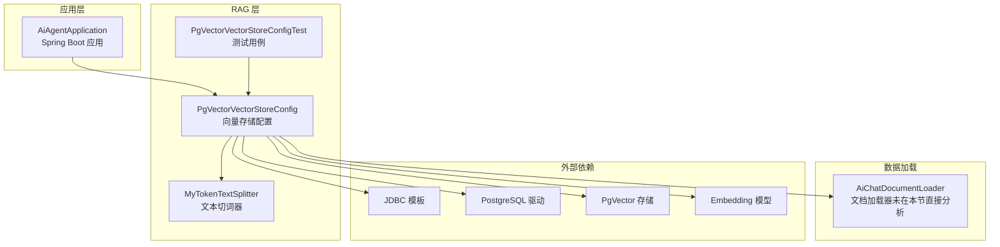
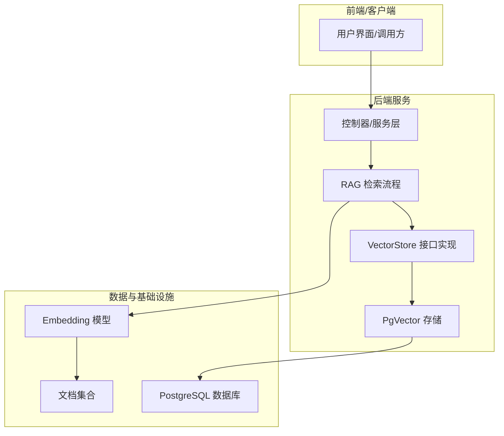
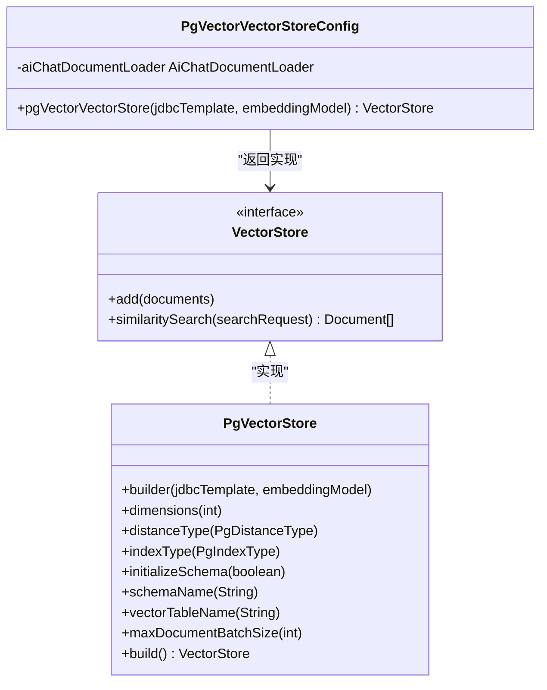
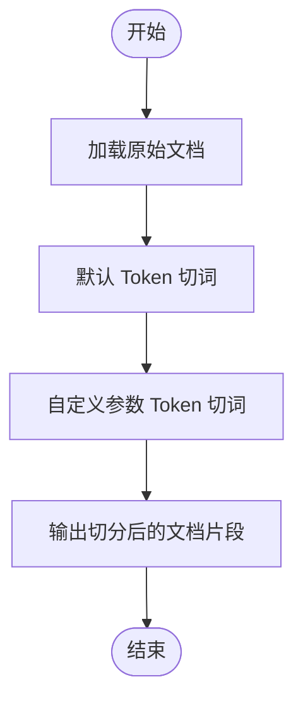
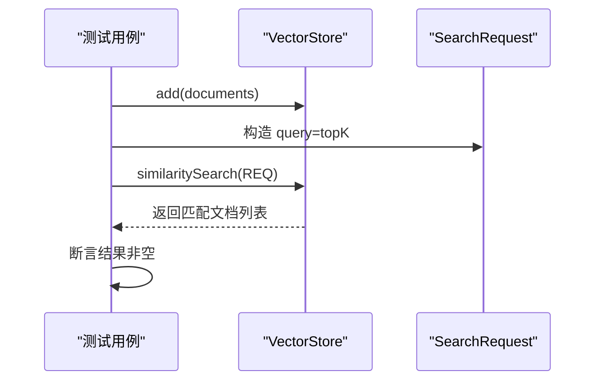
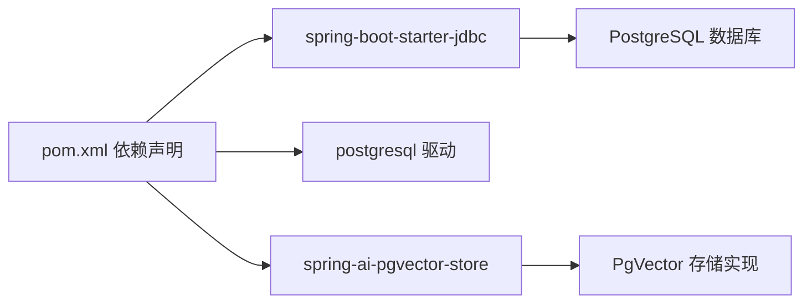

# 向量存储和索引

<cite>
**本文引用的文件**
- [PgVectorVectorStoreConfig.java](file://src/main/java/com/yupi/yuaiagent/rag/PgVectorVectorStoreConfig.java)
- [PgVectorVectorStoreConfigTest.java](file://src/test/java/com/yupi/yuaiagent/rag/PgVectorVectorStoreConfigTest.java)
- [MyTokenTextSplitter.java](file://src/main/java/com/yupi/yuaiagent/rag/MyTokenTextSplitter.java)
- [pom.xml](file://pom.xml)
- [architecture.html](file://docs/architecture.html)
</cite>

## 目录
1. [简介](#简介)
2. [项目结构](#项目结构)
3. [核心组件](#核心组件)
4. [架构总览](#架构总览)
5. [详细组件分析](#详细组件分析)
6. [依赖关系分析](#依赖关系分析)
7. [性能考量](#性能考量)
8. [故障排除指南](#故障排除指南)
9. [结论](#结论)
10. [附录](#附录)

## 简介
本技术文档聚焦于本项目中的向量存储与索引系统，围绕以下主题展开：
- PgVector 向量数据库的配置与连接设置（连接参数、索引类型、距离度量、初始化策略）
- 文本预处理与分词策略（基于 Token 的切词器）
- 向量索引的创建与维护（HNSW、IVFFlat 等算法的选择与参数建议）
- 向量相似度计算方法（余弦相似度、欧几里得距离等）
- 性能优化实践（批量插入、索引刷新、内存管理）
- 查询实现与结果排序策略
- 监控指标与故障排除
- 面向开发者的部署与维护方案

## 项目结构
本项目采用模块化组织，向量存储与检索相关能力主要集中在 RAG（检索增强生成）子系统中，并通过 Spring Boot 与 Spring AI 生态集成 JDBC 访问 PostgreSQL，结合 PgVector 实现向量存储。

图表来源
- [PgVectorVectorStoreConfig.java:18-39](file://src/main/java/com/yupi/yuaiagent/rag/PgVectorVectorStoreConfig.java#L18-L39)
- [MyTokenTextSplitter.java:12-23](file://src/main/java/com/yupi/yuaiagent/rag/MyTokenTextSplitter.java#L12-L23)
- [pom.xml:75-94](file://pom.xml#L75-L94)

章节来源
- [PgVectorVectorStoreConfig.java:1-39](file://src/main/java/com/yupi/yuaiagent/rag/PgVectorVectorStoreConfig.java#L1-L39)
- [MyTokenTextSplitter.java:1-23](file://src/main/java/com/yupi/yuaiagent/rag/MyTokenTextSplitter.java#L1-L23)
- [pom.xml:75-94](file://pom.xml#L75-L94)

## 核心组件
- 向量存储配置类：负责构建 PgVector 存储实例，设置维度、距离度量、索引类型、模式名、表名、批大小以及是否初始化模式；并在启动时加载文档并写入向量库。
- 文本切词器：提供基于 Token 的切词策略，默认与自定义参数版本，用于将长文档切分为适合嵌入模型处理的片段。
- 测试用例：验证向量存储的可用性与相似度检索功能。

章节来源
- [PgVectorVectorStoreConfig.java:18-39](file://src/main/java/com/yupi/yuaiagent/rag/PgVectorVectorStoreConfig.java#L18-L39)
- [MyTokenTextSplitter.java:12-23](file://src/main/java/com/yupi/yuaiagent/rag/MyTokenTextSplitter.java#L12-L23)
- [PgVectorVectorStoreConfigTest.java:14-32](file://src/test/java/com/yupi/yuaiagent/rag/PgVectorVectorStoreConfigTest.java#L14-L32)

## 架构总览
下图展示了向量存储在整体系统中的位置与交互关系，强调“持久化 + 向量检索”的双层存储理念与 PgVector 的集成方式。

图表来源
- [architecture.html:324-327](file://docs/architecture.html#L324-L327)
- [PgVectorVectorStoreConfig.java:24-38](file://src/main/java/com/yupi/yuaiagent/rag/PgVectorVectorStoreConfig.java#L24-L38)

## 详细组件分析

### 组件一：PgVector 向量存储配置
该组件负责：
- 初始化 JDBC 模板与嵌入模型
- 构建 PgVector 存储实例，设置维度、距离度量、索引类型、模式名、表名、批大小
- 可选初始化数据库模式
- 在启动阶段加载文档并批量写入向量库

图表来源
- [PgVectorVectorStoreConfig.java:24-38](file://src/main/java/com/yupi/yuaiagent/rag/PgVectorVectorStoreConfig.java#L24-L38)

章节来源
- [PgVectorVectorStoreConfig.java:18-39](file://src/main/java/com/yupi/yuaiagent/rag/PgVectorVectorStoreConfig.java#L18-L39)

### 组件二：文本切词与预处理
该组件提供两种切词策略：
- 默认 Token 切词
- 自定义参数切词（可调整窗口大小、重叠、最小长度、最大长度等）

图表来源
- [MyTokenTextSplitter.java:14-22](file://src/main/java/com/yupi/yuaiagent/rag/MyTokenTextSplitter.java#L14-L22)

章节来源
- [MyTokenTextSplitter.java:12-23](file://src/main/java/com/yupi/yuaiagent/rag/MyTokenTextSplitter.java#L12-L23)

### 组件三：相似度检索与查询流程
测试用例展示了典型的相似度检索流程：添加文档、构造查询请求、执行相似度搜索并断言结果非空。

图表来源
- [PgVectorVectorStoreConfigTest.java:20-31](file://src/test/java/com/yupi/yuaiagent/rag/PgVectorVectorStoreConfigTest.java#L20-L31)

章节来源
- [PgVectorVectorStoreConfigTest.java:14-32](file://src/test/java/com/yupi/yuaiagent/rag/PgVectorVectorStoreConfigTest.java#L14-L32)

## 依赖关系分析
项目通过 Maven 引入 JDBC、PostgreSQL 驱动与 PgVector 存储依赖，以支持向量数据的持久化与检索。

图表来源
- [pom.xml:75-94](file://pom.xml#L75-L94)

章节来源
- [pom.xml:75-94](file://pom.xml#L75-L94)

## 性能考量
- 连接与初始化
  - 使用 JdbcTemplate 连接 PostgreSQL，确保连接池参数合理配置（如最大连接数、空闲超时、查询超时），避免高并发下的连接争用。
  - 初始化模式仅在首次部署或迁移时启用，避免重复初始化带来的开销。
- 索引与距离度量
  - 距离度量建议根据语料特性选择：余弦相似度对方向敏感、归一化后的向量更稳定；欧几里得距离对绝对数值差异敏感，适合某些数值型特征。
  - 索引类型建议：
    - HNSW：适用于高维稠密向量的近似最近邻检索，召回率与吞吐兼顾，适合大多数场景。
    - IVFFlat：聚类中心划分向量空间，适合大规模数据与固定吞吐需求的场景，但通常不如 HNSW 在高维下表现稳定。
- 批量写入与内存管理
  - 使用 maxDocumentBatchSize 控制批量写入规模，平衡内存占用与写入效率；建议结合数据库连接池与事务提交策略进行调优。
  - 写入前进行去重与清洗，减少无效索引与查询开销。
- 查询与排序
  - topK 参数控制返回数量，结合元数据过滤与重排策略（如二次打分、重排序模型）提升最终质量。
  - 对高频查询建立缓存（如查询热点结果缓存），降低数据库压力。
- 监控与告警
  - 关键指标：向量表行数、索引大小、写入 QPS、查询延迟（P50/P95）、连接池使用率、数据库 CPU/IO。
  - 告警阈值：查询延迟突增、索引大小异常增长、写入失败率上升、连接池耗尽。

## 故障排除指南
- 无法连接数据库
  - 检查 JDBC URL、用户名、密码与网络连通性；确认 PostgreSQL 已安装并启用向量扩展。
- 初始化失败
  - 若 initializeSchema=true，请确认具备 DDL 权限；若已存在表结构，建议关闭初始化或清理旧表。
- 写入失败或性能异常
  - 检查 batch 大小与内存限制，适当减小 maxDocumentBatchSize；核对嵌入模型输出维度与向量列定义一致。
- 查询结果不准确
  - 校验距离度量与索引类型是否匹配业务需求；必要时重建索引或调整索引参数。
- 高延迟
  - 检查数据库资源使用情况与索引统计信息；考虑增加硬件资源或优化查询计划。

## 结论
本项目通过 PgVector 与 Spring AI 的集成，提供了可扩展的向量存储与检索能力。配置层明确了连接、索引与初始化策略；切词器为高质量嵌入提供基础；测试用例覆盖了核心检索流程。结合本文的性能优化与故障排除建议，可在生产环境中稳定运行并持续演进。

## 附录
- 部署建议
  - 数据库：PostgreSQL + 向量扩展，确保版本与驱动兼容。
  - 应用：合理配置 JVM 堆大小、GC 参数与线程池；开启连接池与慢查询日志。
  - 监控：接入 APM 与数据库性能监控，设置关键指标告警。
- 维护建议
  - 定期重建索引以保持查询性能；按需压缩向量表与统计信息更新。
  - 版本升级时先在测试环境验证，再灰度到生产。