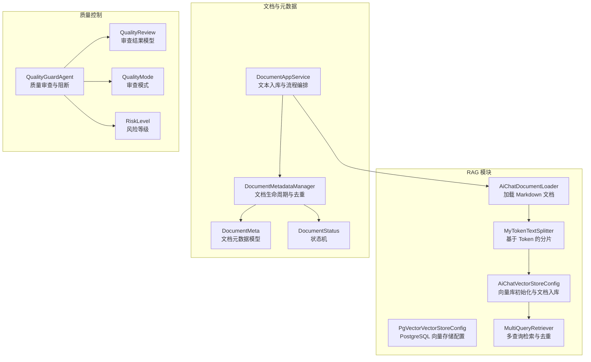
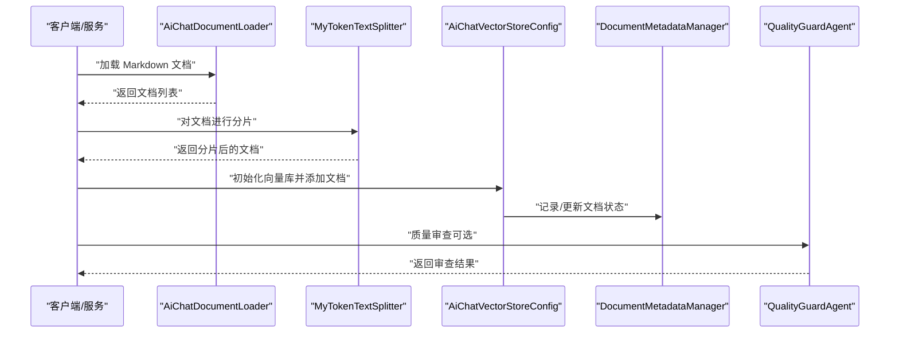
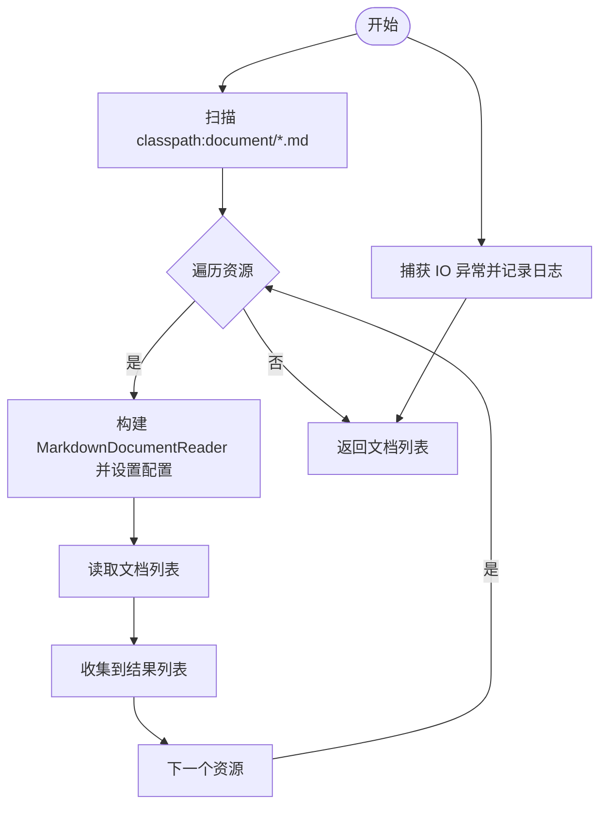
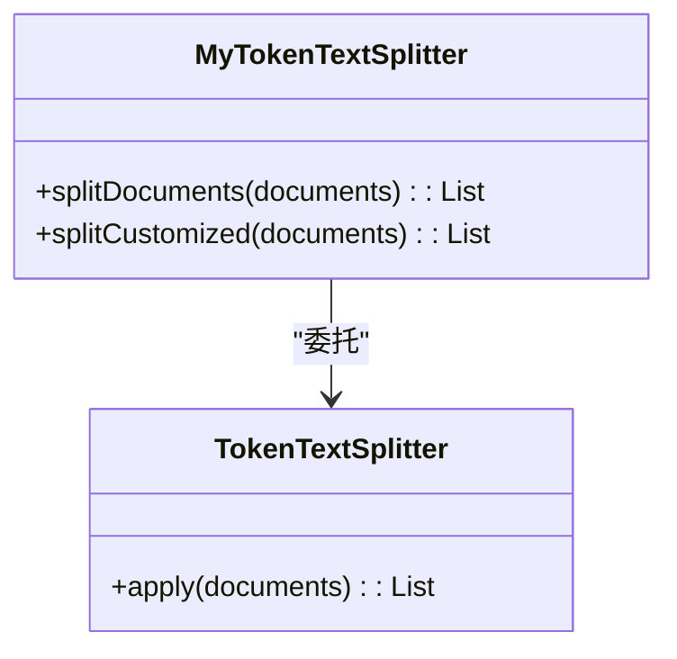
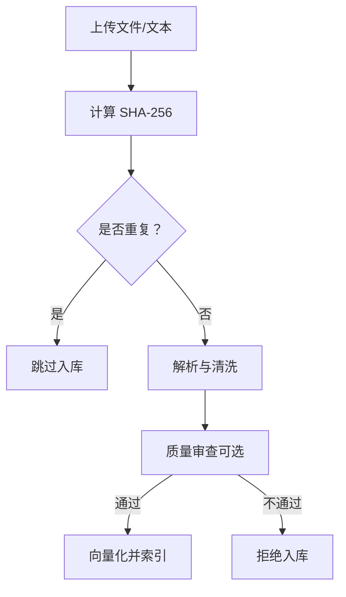
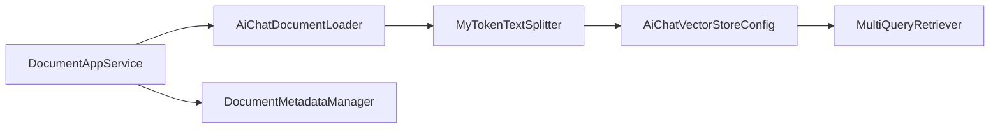

# 文本预处理和分片

<cite>
**本文引用的文件**
- [AiChatDocumentLoader.java](file://src/main/java/com/yupi/yuaiagent/rag/AiChatDocumentLoader.java)
- [MyTokenTextSplitter.java](file://src/main/java/com/yupi/yuaiagent/rag/MyTokenTextSplitter.java)
- [AiChatVectorStoreConfig.java](file://src/main/java/com/yupi/yuaiagent/rag/AiChatVectorStoreConfig.java)
- [PgVectorVectorStoreConfig.java](file://src/main/java/com/yupi/yuaiagent/rag/PgVectorVectorStoreConfig.java)
- [DocumentAppService.java](file://src/main/java/com/yupi/yuaiagent/service/DocumentAppService.java)
- [DocumentMetadataManager.java](file://src/main/java/com/yupi/yuaiagent/document/DocumentMetadataManager.java)
- [DocumentMeta.java](file://src/main/java/com/yupi/yuaiagent/document/DocumentMeta.java)
- [DocumentStatus.java](file://src/main/java/com/yupi/yuaiagent/document/DocumentStatus.java)
- [MultiQueryRetriever.java](file://src/main/java/com/yupi/yuaiagent/rag/MultiQueryRetriever.java)
- [AiChatAgentDocumentLoaderTest.java](file://src/test/java/com/yupi/yuaiagent/rag/AiChatAgentDocumentLoaderTest.java)
- [plan-quality-guard.md](file://docs/plan-quality-guard.md)
- [QualityGuardAgent.java](file://src/main/java/com/yupi/yuaiagent/quality/QualityGuardAgent.java)
- [QualityReview.java](file://src/main/java/com/yupi/yuaiagent/quality/QualityReview.java)
- [QualityMode.java](file://src/main/java/com/yupi/yuaiagent/quality/QualityMode.java)
- [RiskLevel.java](file://src/main/java/com/yupi/yuaiagent/quality/RiskLevel.java)
</cite>

## 目录
1. [简介](#简介)
2. [项目结构](#项目结构)
3. [核心组件](#核心组件)
4. [架构总览](#架构总览)
5. [详细组件分析](#详细组件分析)
6. [依赖分析](#依赖分析)
7. [性能考虑](#性能考虑)
8. [故障排查指南](#故障排查指南)
9. [结论](#结论)
10. [附录](#附录)

## 简介
本技术文档聚焦于文本预处理与分片系统，围绕以下目标展开：
- 解释文档加载器 AiChatDocumentLoader 的实现原理，包括 Markdown 文件的加载、元信息注入与错误处理。
- 说明文本分片器 MyTokenTextSplitter 的工作机制，涵盖默认分片与自定义分片策略。
- 阐述文本预处理流程（如 Markdown 清洗、编码处理、空白规范化等）。
- 解释分片参数配置与优化（最大长度、重叠率、分片策略选择）。
- 提供文本质量检查与清洗方法（重复内容检测、低质量过滤思路）。
- 给出分片效果评估与性能监控指标建议。
- 提供扩展与定制指南，帮助开发者在现有框架上进行二次开发。

## 项目结构
本项目采用模块化组织，RAG 相关能力集中在 rag 包中，文档元数据管理位于 document 包，质量控制位于 quality 包，服务层负责对外接口与流程编排。

图表来源
- [AiChatDocumentLoader.java:1-58](file://src/main/java/com/yupi/yuaiagent/rag/AiChatDocumentLoader.java#L1-L58)
- [MyTokenTextSplitter.java:1-24](file://src/main/java/com/yupi/yuaiagent/rag/MyTokenTextSplitter.java#L1-L24)
- [AiChatVectorStoreConfig.java:1-46](file://src/main/java/com/yupi/yuaiagent/rag/AiChatVectorStoreConfig.java#L1-L46)
- [PgVectorVectorStoreConfig.java:1-40](file://src/main/java/com/yupi/yuaiagent/rag/PgVectorVectorStoreConfig.java#L1-L40)
- [DocumentAppService.java:82-110](file://src/main/java/com/yupi/yuaiagent/service/DocumentAppService.java#L82-L110)
- [DocumentMetadataManager.java:1-163](file://src/main/java/com/yupi/yuaiagent/document/DocumentMetadataManager.java#L1-L163)
- [DocumentMeta.java:1-37](file://src/main/java/com/yupi/yuaiagent/document/DocumentMeta.java#L1-L37)
- [DocumentStatus.java:1-62](file://src/main/java/com/yupi/yuaiagent/document/DocumentStatus.java#L1-L62)
- [MultiQueryRetriever.java:40-111](file://src/main/java/com/yupi/yuaiagent/rag/MultiQueryRetriever.java#L40-L111)
- [QualityGuardAgent.java:96-198](file://src/main/java/com/yupi/yuaiagent/quality/QualityGuardAgent.java#L96-L198)
- [QualityReview.java:1-42](file://src/main/java/com/yupi/yuaiagent/quality/QualityReview.java#L1-L42)
- [QualityMode.java:1-31](file://src/main/java/com/yupi/yuaiagent/quality/QualityMode.java#L1-L31)
- [RiskLevel.java:1-34](file://src/main/java/com/yupi/yuaiagent/quality/RiskLevel.java#L1-L34)

章节来源
- [AiChatDocumentLoader.java:1-58](file://src/main/java/com/yupi/yuaiagent/rag/AiChatDocumentLoader.java#L1-L58)
- [MyTokenTextSplitter.java:1-24](file://src/main/java/com/yupi/yuaiagent/rag/MyTokenTextSplitter.java#L1-L24)
- [AiChatVectorStoreConfig.java:1-46](file://src/main/java/com/yupi/yuaiagent/rag/AiChatVectorStoreConfig.java#L1-L46)
- [PgVectorVectorStoreConfig.java:1-40](file://src/main/java/com/yupi/yuaiagent/rag/PgVectorVectorStoreConfig.java#L1-L40)
- [DocumentAppService.java:82-110](file://src/main/java/com/yupi/yuaiagent/service/DocumentAppService.java#L82-L110)
- [DocumentMetadataManager.java:1-163](file://src/main/java/com/yupi/yuaiagent/document/DocumentMetadataManager.java#L1-L163)
- [DocumentMeta.java:1-37](file://src/main/java/com/yupi/yuaiagent/document/DocumentMeta.java#L1-L37)
- [DocumentStatus.java:1-62](file://src/main/java/com/yupi/yuaiagent/document/DocumentStatus.java#L1-L62)
- [MultiQueryRetriever.java:40-111](file://src/main/java/com/yupi/yuaiagent/rag/MultiQueryRetriever.java#L40-L111)
- [QualityGuardAgent.java:96-198](file://src/main/java/com/yupi/yuaiagent/quality/QualityGuardAgent.java#L96-L198)
- [QualityReview.java:1-42](file://src/main/java/com/yupi/yuaiagent/quality/QualityReview.java#L1-L42)
- [QualityMode.java:1-31](file://src/main/java/com/yupi/yuaiagent/quality/QualityMode.java#L1-L31)
- [RiskLevel.java:1-34](file://src/main/java/com/yupi/yuaiagent/quality/RiskLevel.java#L1-L34)

## 核心组件
- 文档加载器 AiChatDocumentLoader：负责从资源目录加载 Markdown 文档，构建文档对象并注入元信息，捕获 IO 异常。
- 文本分片器 MyTokenTextSplitter：封装基于 Token 的分片器，提供默认分片与自定义分片两种策略。
- 向量库配置 AiChatVectorStoreConfig：在应用启动时加载文档、尝试关键词增强、将文档写入向量库。
- 文档服务 DocumentAppService：接收外部文本，进行去重、解析、向量化与索引，并返回响应。
- 元数据管理 DocumentMetadataManager：维护文档生命周期、文件级去重（SHA-256）、失败重试与持久化。
- 多查询检索 MultiQueryRetriever：对查询进行重写与扩展，执行相似度检索并合并去重后的文档。

章节来源
- [AiChatDocumentLoader.java:29-56](file://src/main/java/com/yupi/yuaiagent/rag/AiChatDocumentLoader.java#L29-L56)
- [MyTokenTextSplitter.java:14-22](file://src/main/java/com/yupi/yuaiagent/rag/MyTokenTextSplitter.java#L14-L22)
- [AiChatVectorStoreConfig.java:30-44](file://src/main/java/com/yupi/yuaiagent/rag/AiChatVectorStoreConfig.java#L30-L44)
- [DocumentAppService.java:82-110](file://src/main/java/com/yupi/yuaiagent/service/DocumentAppService.java#L82-L110)
- [DocumentMetadataManager.java:69-124](file://src/main/java/com/yupi/yuaiagent/document/DocumentMetadataManager.java#L69-L124)
- [MultiQueryRetriever.java:43-106](file://src/main/java/com/yupi/yuaiagent/rag/MultiQueryRetriever.java#L43-L106)

## 架构总览
下图展示了从文档加载到向量库入库、再到检索与质量控制的整体流程。

图表来源
- [AiChatDocumentLoader.java:33-56](file://src/main/java/com/yupi/yuaiagent/rag/AiChatDocumentLoader.java#L33-L56)
- [MyTokenTextSplitter.java:14-22](file://src/main/java/com/yupi/yuaiagent/rag/MyTokenTextSplitter.java#L14-L22)
- [AiChatVectorStoreConfig.java:30-44](file://src/main/java/com/yupi/yuaiagent/rag/AiChatVectorStoreConfig.java#L30-L44)
- [DocumentMetadataManager.java:69-124](file://src/main/java/com/yupi/yuaiagent/document/DocumentMetadataManager.java#L69-L124)
- [QualityGuardAgent.java:104-158](file://src/main/java/com/yupi/yuaiagent/quality/QualityGuardAgent.java#L104-L158)

## 详细组件分析

### 文档加载器 AiChatDocumentLoader
- 功能概述
  - 通过资源解析器扫描 classpath 下的 Markdown 文件集合。
  - 为每个资源构建 Markdown 文档读取器，设置配置项（如水平线拆分、是否包含代码块/引用块、附加元信息）。
  - 收集所有文档并返回列表；捕获 IO 异常并记录日志。
- 关键点
  - 元信息注入：将文件名与状态字段注入到文档元数据中，便于后续追踪与去重。
  - 错误处理：IO 异常被记录但不中断整体流程。
- 测试验证：单元测试确保加载流程可运行。

图表来源
- [AiChatDocumentLoader.java:33-56](file://src/main/java/com/yupi/yuaiagent/rag/AiChatDocumentLoader.java#L33-L56)

章节来源
- [AiChatDocumentLoader.java:29-56](file://src/main/java/com/yupi/yuaiagent/rag/AiChatDocumentLoader.java#L29-L56)
- [AiChatAgentDocumentLoaderTest.java:15-18](file://src/test/java/com/yupi/yuaiagent/rag/AiChatAgentDocumentLoaderTest.java#L15-L18)

### 文本分片器 MyTokenTextSplitter
- 功能概述
  - 默认分片：使用默认 TokenTextSplitter 对文档进行分片。
  - 自定义分片：传入最大长度、重叠长度、最小片段长度、最大分片数等参数，满足更严格的上下文约束。
- 分片参数说明
  - 最大长度：单段文本的最大 Token 数。
  - 重叠长度：相邻片段之间的重叠 Token 数，提升跨片段连贯性。
  - 最小片段长度：过滤过短片段，避免噪声。
  - 最大分片数：限制输出数量，防止爆炸式增长。
  - 语义分片开关：是否启用语义级别的分片策略（具体行为取决于底层实现）。
- 适用场景
  - 默认分片适用于通用场景。
  - 自定义分片适用于对上下文长度与重叠有明确要求的任务。

图表来源
- [MyTokenTextSplitter.java:14-22](file://src/main/java/com/yupi/yuaiagent/rag/MyTokenTextSplitter.java#L14-L22)

章节来源
- [MyTokenTextSplitter.java:9-23](file://src/main/java/com/yupi/yuaiagent/rag/MyTokenTextSplitter.java#L9-L23)

### 文本预处理流程
- Markdown 清洗
  - 通过 MarkdownDocumentReader 的配置项控制是否包含代码块、引用块与水平分割线，减少噪声并提升语义一致性。
  - 元信息注入：将文件名、状态等字段加入文档元数据，便于溯源与去重。
- 编码与内容提取
  - 使用资源读取器统一处理编码，默认以 UTF-8 进行解析与提取。
- 空白字符与格式规范化
  - 在解析阶段由读取器与分片器共同保证文本格式的一致性；如需额外清洗，可在业务层扩展清洗器（例如移除多余空白、统一换行符等）。

章节来源
- [AiChatDocumentLoader.java:41-48](file://src/main/java/com/yupi/yuaiagent/rag/AiChatDocumentLoader.java#L41-L48)
- [DocumentAppService.java:96-103](file://src/main/java/com/yupi/yuaiagent/service/DocumentAppService.java#L96-L103)

### 分片参数配置与优化
- 参数映射
  - 最大长度：对应 TokenTextSplitter 的最大分片长度。
  - 重叠长度：对应 TokenTextSplitter 的重叠长度。
  - 最小片段长度：用于过滤过短片段。
  - 最大分片数：限制输出数量。
  - 语义分片：根据底层实现决定是否启用。
- 优化建议
  - 上下文窗口：根据模型上下文长度调整最大长度。
  - 重叠率：在 10%~30% 范围内权衡连贯性与冗余。
  - 过滤噪声：设置最小片段长度，剔除无意义短片段。
  - 批量入库：结合向量库的批量写入能力，提升吞吐。

章节来源
- [MyTokenTextSplitter.java:19-22](file://src/main/java/com/yupi/yuaiagent/rag/MyTokenTextSplitter.java#L19-L22)

### 文本质量检查与清洗
- 重复内容检测
  - 文件级去重：基于文件内容的 SHA-256 哈希，避免重复入库。
  - 内容级去重：预留内容哈希字段，未来可用于内容级别去重。
- 低质量文本过滤
  - 可结合质量审查（QualityGuardAgent）对输出进行评分与阻断，降低低质量内容进入知识库的风险。
  - 在入库前增加内容质量阈值与关键词过滤策略（建议在业务层扩展）。

图表来源
- [DocumentMetadataManager.java:69-80](file://src/main/java/com/yupi/yuaiagent/document/DocumentMetadataManager.java#L69-L80)
- [DocumentAppService.java:82-110](file://src/main/java/com/yupi/yuaiagent/service/DocumentAppService.java#L82-L110)
- [QualityGuardAgent.java:104-158](file://src/main/java/com/yupi/yuaiagent/quality/QualityGuardAgent.java#L104-L158)

章节来源
- [DocumentMetadataManager.java:69-124](file://src/main/java/com/yupi/yuaiagent/document/DocumentMetadataManager.java#L69-L124)
- [DocumentMeta.java:19-23](file://src/main/java/com/yupi/yuaiagent/document/DocumentMeta.java#L19-L23)
- [QualityGuardAgent.java:104-158](file://src/main/java/com/yupi/yuaiagent/quality/QualityGuardAgent.java#L104-L158)

### 分片效果评估与性能监控
- 评估指标建议
  - 分片数量分布：统计平均分片长度、最长/最短分片长度。
  - 重叠覆盖率：计算相邻分片的重叠比例，评估连贯性。
  - 检索命中率：通过 MultiQueryRetriever 的检索结果评估召回与去重效果。
  - 向量库写入耗时：记录从加载到入库的时延。
- 性能监控
  - 记录分片前后文档数量变化、向量库写入速率与失败重试次数。
  - 结合 DocumentStatus 的状态机，跟踪失败与重试情况。

章节来源
- [MultiQueryRetriever.java:43-106](file://src/main/java/com/yupi/yuaiagent/rag/MultiQueryRetriever.java#L43-L106)
- [DocumentStatus.java:19-62](file://src/main/java/com/yupi/yuaiagent/document/DocumentStatus.java#L19-L62)

### 最佳实践与常见问题
- 最佳实践
  - 明确分片参数：根据模型上下文长度与任务需求设定最大长度与重叠率。
  - 元信息完整性：确保文件名、状态等元信息准确注入，便于溯源与治理。
  - 去重优先：先做文件级去重，再进行内容清洗与入库。
  - 质量前置：对高风险内容启用质量审查，必要时阻断。
- 常见问题
  - Markdown 解析异常：检查资源路径与编码，确认 IO 异常被捕获与记录。
  - 分片过多导致性能下降：调整最大长度与最小片段长度，限制最大分片数。
  - 向量库写入失败：检查网络与限流策略，利用失败重试与降级策略。

## 依赖分析
- 组件耦合
  - AiChatVectorStoreConfig 依赖 AiChatDocumentLoader 与 MyTokenTextSplitter，形成“加载-分片-入库”的流水线。
  - DocumentAppService 串联 DocumentMetadataManager 与 AiChatDocumentLoader，实现外部文本的全链路处理。
  - MultiQueryRetriever 依赖向量库与查询扩展器，负责检索与上下文构建。
- 外部依赖
  - Spring AI 的文档读取器与分片器、向量库实现。
  - PostgreSQL 向量存储（PgVector）配置可选启用。

图表来源
- [AiChatVectorStoreConfig.java:21-29](file://src/main/java/com/yupi/yuaiagent/rag/AiChatVectorStoreConfig.java#L21-L29)
- [DocumentAppService.java:82-110](file://src/main/java/com/yupi/yuaiagent/service/DocumentAppService.java#L82-L110)
- [DocumentMetadataManager.java:69-124](file://src/main/java/com/yupi/yuaiagent/document/DocumentMetadataManager.java#L69-L124)
- [MultiQueryRetriever.java:43-106](file://src/main/java/com/yupi/yuaiagent/rag/MultiQueryRetriever.java#L43-L106)

章节来源
- [AiChatVectorStoreConfig.java:21-29](file://src/main/java/com/yupi/yuaiagent/rag/AiChatVectorStoreConfig.java#L21-L29)
- [DocumentAppService.java:82-110](file://src/main/java/com/yupi/yuaiagent/service/DocumentAppService.java#L82-L110)
- [DocumentMetadataManager.java:69-124](file://src/main/java/com/yupi/yuaiagent/document/DocumentMetadataManager.java#L69-L124)
- [MultiQueryRetriever.java:43-106](file://src/main/java/com/yupi/yuaiagent/rag/MultiQueryRetriever.java#L43-L106)

## 性能考虑
- 分片策略
  - 控制最大长度与重叠长度，避免超长片段导致嵌入与检索性能下降。
  - 合理设置最小片段长度，减少无效分片带来的存储与检索开销。
- 批量写入
  - 利用向量库的批量写入能力，减少网络往返与事务开销。
- 失败与重试
  - 对可重试失败进行指数退避与最大重试次数限制，避免雪崩效应。
- 监控与告警
  - 记录分片耗时、入库速率、失败率与重试次数，建立告警阈值。

## 故障排查指南
- 文档加载失败
  - 现象：加载阶段抛出 IO 异常。
  - 排查：检查 classpath 资源路径、文件权限与编码；查看日志定位具体异常。
- 分片异常
  - 现象：分片后文档数量异常或片段过短。
  - 排查：调整最大长度、重叠长度与最小片段长度；确认底层分片器行为。
- 向量库写入失败
  - 现象：入库阶段抛出异常或部分文档未写入。
  - 排查：检查网络连接、限流策略与向量维度；启用降级策略并记录失败原因。
- 质量审查阻断
  - 现象：高风险回答被阻断。
  - 排查：查看审查结果与风险等级，必要时调整审查策略或人工复核。

章节来源
- [AiChatDocumentLoader.java:52-54](file://src/main/java/com/yupi/yuaiagent/rag/AiChatDocumentLoader.java#L52-L54)
- [AiChatVectorStoreConfig.java:39-42](file://src/main/java/com/yupi/yuaiagent/rag/AiChatVectorStoreConfig.java#L39-L42)
- [QualityGuardAgent.java:684-704](file://src/main/java/com/yupi/yuaiagent/quality/QualityGuardAgent.java#L684-L704)

## 结论
本系统以 AiChatDocumentLoader 为核心入口，配合 MyTokenTextSplitter 实现灵活的分片策略，并通过 AiChatVectorStoreConfig 完成文档入库。结合 DocumentMetadataManager 的去重与状态管理，以及 MultiQueryRetriever 的检索与上下文构建，形成了完整的文本预处理与分片流水线。质量控制模块进一步提升了内容质量与安全性。通过合理的参数配置与监控体系，可在不同规模与复杂度场景下获得稳定且高效的性能表现。

## 附录
- 扩展与定制指南
  - 新增文档格式支持：在 AiChatDocumentLoader 中引入新的读取器与配置项，保持元信息注入一致。
  - 自定义清洗器：在 DocumentAppService 或业务层扩展清洗逻辑，统一处理 HTML、特殊字符与空白规范化。
  - 分片策略定制：在 MyTokenTextSplitter 中新增策略工厂或配置项，支持按任务类型动态切换分片参数。
  - 质量审查增强：在 QualityGuardAgent 中扩展审查维度与评分权重，或引入外部 LLM 进行更细粒度的审查。
  - 向量存储适配：根据部署环境选择内存或 PostgreSQL 向量存储，调整索引类型与距离度量。