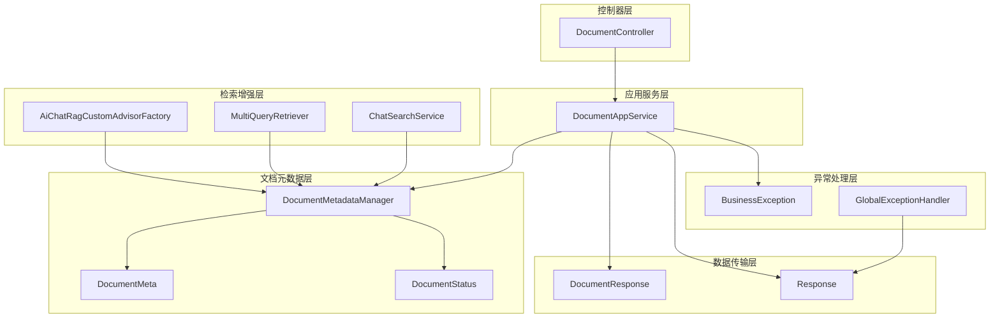
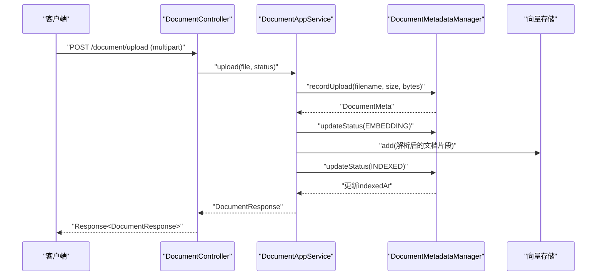
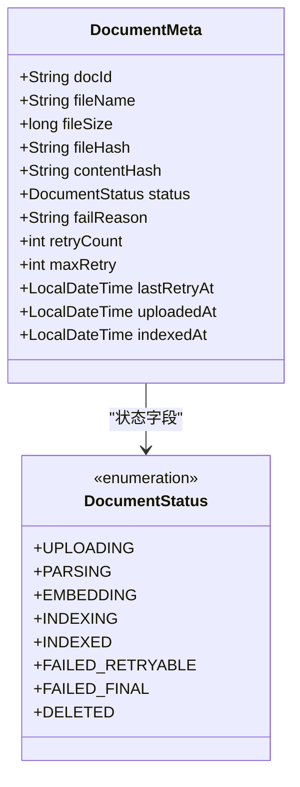
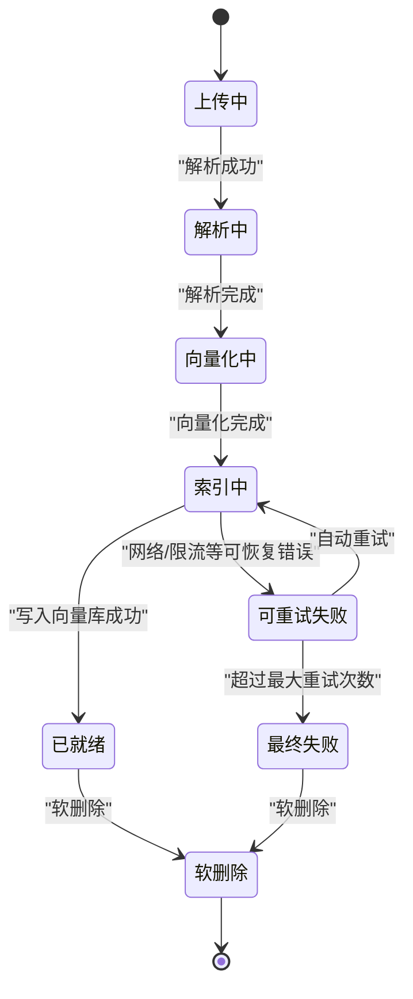
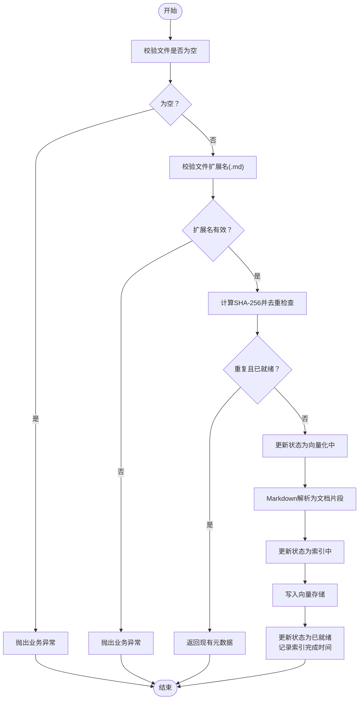
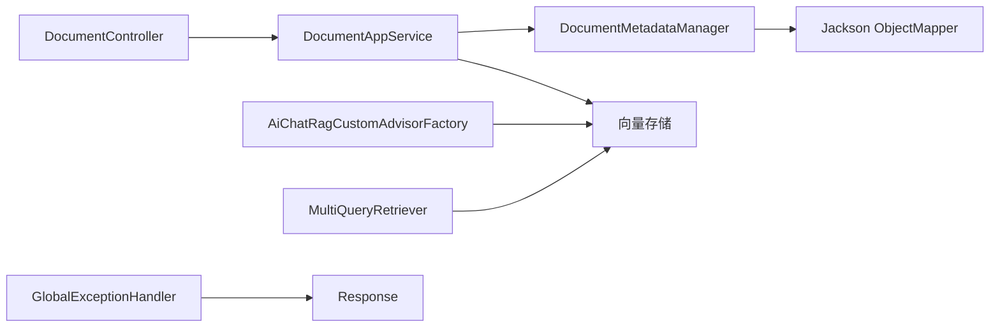

# 文档管理系统

<cite>
**本文引用的文件**
- [DocumentMeta.java](file://src/main/java/com/yupi/yuaiagent/document/DocumentMeta.java)
- [DocumentStatus.java](file://src/main/java/com/yupi/yuaiagent/document/DocumentStatus.java)
- [DocumentMetadataManager.java](file://src/main/java/com/yupi/yuaiagent/document/DocumentMetadataManager.java)
- [DocumentController.java](file://src/main/java/com/yupi/yuaiagent/controller/DocumentController.java)
- [DocumentAppService.java](file://src/main/java/com/yupi/yuaiagent/service/DocumentAppService.java)
- [DocumentResponse.java](file://src/main/java/com/yupi/yuaiagent/dto/DocumentResponse.java)
- [Response.java](file://src/main/java/com/yupi/yuaiagent/common/Response.java)
- [BusinessException.java](file://src/main/java/com/yupi/yuaiagent/exception/BusinessException.java)
- [GlobalExceptionHandler.java](file://src/main/java/com/yupi/yuaiagent/exception/GlobalExceptionHandler.java)
- [AiChatRagCustomAdvisorFactory.java](file://src/main/java/com/yupi/yuaiagent/rag/AiChatRagCustomAdvisorFactory.java)
- [MultiQueryRetriever.java](file://src/main/java/com/yupi/yuaiagent/rag/MultiQueryRetriever.java)
- [ChatSearchService.java](file://src/main/java/com/yupi/yuaiagent/search/ChatSearchService.java)
</cite>

## 目录
1. [简介](#简介)
2. [项目结构](#项目结构)
3. [核心组件](#核心组件)
4. [架构总览](#架构总览)
5. [详细组件分析](#详细组件分析)
6. [依赖分析](#依赖分析)
7. [性能考虑](#性能考虑)
8. [故障排查指南](#故障排查指南)
9. [结论](#结论)
10. [附录](#附录)

## 简介
本文件为文档管理系统的详细技术文档，面向开发者与维护者，系统性阐述文档元数据模型、状态管理机制、上传流程、格式与大小限制、分类与标签、元数据提取与验证、搜索与过滤、版本控制与历史回滚建议，以及完整的API接口与使用示例。系统采用Spring Boot构建，结合向量检索能力，提供从上传到检索的完整链路。

## 项目结构
文档管理相关模块主要分布在以下包与类中：
- document 包：文档元数据模型与生命周期管理
- controller 包：HTTP 控制器适配层
- service 包：应用服务层，封装业务逻辑
- dto 包：对外响应数据传输对象
- common 包：统一响应包装
- exception 包：业务异常与全局异常处理
- rag 包：检索增强与过滤策略
- search 包：检索服务（用于会话/聊天内容检索）

图表来源
- [DocumentController.java:19-51](file://src/main/java/com/yupi/yuaiagent/controller/DocumentController.java#L19-L51)
- [DocumentAppService.java:32-138](file://src/main/java/com/yupi/yuaiagent/service/DocumentAppService.java#L32-L138)
- [DocumentMetadataManager.java:36-189](file://src/main/java/com/yupi/yuaiagent/document/DocumentMetadataManager.java#L36-L189)
- [DocumentMeta.java:13-37](file://src/main/java/com/yupi/yuaiagent/document/DocumentMeta.java#L13-L37)
- [DocumentStatus.java:19-62](file://src/main/java/com/yupi/yuaiagent/document/DocumentStatus.java#L19-L62)
- [DocumentResponse.java:12-22](file://src/main/java/com/yupi/yuaiagent/dto/DocumentResponse.java#L12-L22)
- [Response.java:13-55](file://src/main/java/com/yupi/yuaiagent/common/Response.java#L13-L55)
- [BusinessException.java:11-50](file://src/main/java/com/yupi/yuaiagent/exception/BusinessException.java#L11-L50)
- [GlobalExceptionHandler.java:20-53](file://src/main/java/com/yupi/yuaiagent/exception/GlobalExceptionHandler.java#L20-L53)
- [AiChatRagCustomAdvisorFactory.java:45-61](file://src/main/java/com/yupi/yuaiagent/rag/AiChatRagCustomAdvisorFactory.java#L45-L61)
- [MultiQueryRetriever.java:43-106](file://src/main/java/com/yupi/yuaiagent/rag/MultiQueryRetriever.java#L43-L106)
- [ChatSearchService.java:107-177](file://src/main/java/com/yupi/yuaiagent/search/ChatSearchService.java#L107-L177)

章节来源
- [DocumentController.java:19-51](file://src/main/java/com/yupi/yuaiagent/controller/DocumentController.java#L19-L51)
- [DocumentAppService.java:32-138](file://src/main/java/com/yupi/yuaiagent/service/DocumentAppService.java#L32-L138)
- [DocumentMetadataManager.java:36-189](file://src/main/java/com/yupi/yuaiagent/document/DocumentMetadataManager.java#L36-L189)

## 核心组件
- 文档元数据模型：封装文档标识、文件信息、哈希、状态、重试计数与时间戳等
- 文档状态枚举：定义上传、解析、向量化、索引、就绪、可重试失败、最终失败、软删除等状态
- 元数据管理器：负责生命周期记录、去重、持久化、状态变更与查询
- 应用服务：封装上传、文本导入、列表、删除等业务逻辑
- 控制器：提供HTTP接口，适配请求与响应
- 统一响应与异常：规范返回结构与错误处理
- 检索增强：基于状态过滤与相似度阈值的检索策略

章节来源
- [DocumentMeta.java:13-37](file://src/main/java/com/yupi/yuaiagent/document/DocumentMeta.java#L13-L37)
- [DocumentStatus.java:19-62](file://src/main/java/com/yupi/yuaiagent/document/DocumentStatus.java#L19-L62)
- [DocumentMetadataManager.java:36-189](file://src/main/java/com/yupi/yuaiagent/document/DocumentMetadataManager.java#L36-L189)
- [DocumentAppService.java:32-138](file://src/main/java/com/yupi/yuaiagent/service/DocumentAppService.java#L32-L138)
- [DocumentController.java:19-51](file://src/main/java/com/yupi/yuaiagent/controller/DocumentController.java#L19-L51)
- [Response.java:13-55](file://src/main/java/com/yupi/yuaiagent/common/Response.java#L13-L55)
- [BusinessException.java:11-50](file://src/main/java/com/yupi/yuaiagent/exception/BusinessException.java#L11-L50)
- [GlobalExceptionHandler.java:20-53](file://src/main/java/com/yupi/yuaiagent/exception/GlobalExceptionHandler.java#L20-L53)

## 架构总览
系统采用“控制器-应用服务-元数据管理-向量存储”的分层架构。上传流程通过应用服务协调元数据管理器与向量存储，完成解析、向量化与索引；检索阶段通过检索增强工厂与多查询检索器进行过滤与召回。

图表来源
- [DocumentController.java:26-31](file://src/main/java/com/yupi/yuaiagent/controller/DocumentController.java#L26-L31)
- [DocumentAppService.java:38-80](file://src/main/java/com/yupi/yuaiagent/service/DocumentAppService.java#L38-L80)
- [DocumentMetadataManager.java:69-106](file://src/main/java/com/yupi/yuaiagent/document/DocumentMetadataManager.java#L69-L106)

## 详细组件分析

### 文档元数据模型与字段定义
- 字段说明
  - 文档ID：唯一标识
  - 文件名：原始文件名
  - 文件大小：字节数
  - 文件哈希：SHA-256，用于文件级去重
  - 内容哈希：预留的内容级去重（当前未使用）
  - 状态：生命周期状态
  - 失败原因：失败时记录
  - 重试次数：可重试失败的累计
  - 最大重试：最大重试上限
  - 最后重试时间：最近一次重试时间
  - 上传时间：记录上传时间
  - 索引完成时间：状态变为就绪的时间

图表来源
- [DocumentMeta.java:13-37](file://src/main/java/com/yupi/yuaiagent/document/DocumentMeta.java#L13-L37)
- [DocumentStatus.java:19-62](file://src/main/java/com/yupi/yuaiagent/document/DocumentStatus.java#L19-L62)

章节来源
- [DocumentMeta.java:13-37](file://src/main/java/com/yupi/yuaiagent/document/DocumentMeta.java#L13-L37)
- [DocumentStatus.java:19-62](file://src/main/java/com/yupi/yuaiagent/document/DocumentStatus.java#L19-L62)

### 文档状态管理机制
- 状态机
  - 上传中 → 解析中 → 向量化中 → 索引中 → 已就绪
  - 任一中间环节失败进入“可重试失败”，超过最大重试次数后进入“最终失败”
  - 支持软删除（DELETED），作为终止态之一
- 终止态判断：已就绪、最终失败、软删除
- 失败态判断：可重试失败、最终失败

图表来源
- [DocumentStatus.java:6-15](file://src/main/java/com/yupi/yuaiagent/document/DocumentStatus.java#L6-L15)

章节来源
- [DocumentStatus.java:19-62](file://src/main/java/com/yupi/yuaiagent/document/DocumentStatus.java#L19-L62)

### 文档上传流程与格式限制
- 接口
  - POST /document/upload：上传文件（multipart/form-data）
  - POST /document/add：直接导入文本内容
- 校验与限制
  - 文件不能为空
  - 当前仅支持 Markdown（.md）格式
  - 上传时进行文件级去重（基于SHA-256）
- 生命周期
  - 记录上传并去重检查
  - 更新状态为“向量化中”
  - 使用Markdown解析器提取文本片段
  - 写入向量存储
  - 更新状态为“已就绪”，记录索引完成时间
- 返回
  - 统一响应包装，包含文档元数据

图表来源
- [DocumentAppService.java:38-80](file://src/main/java/com/yupi/yuaiagent/service/DocumentAppService.java#L38-L80)
- [DocumentMetadataManager.java:69-96](file://src/main/java/com/yupi/yuaiagent/document/DocumentMetadataManager.java#L69-L96)

章节来源
- [DocumentController.java:26-31](file://src/main/java/com/yupi/yuaiagent/controller/DocumentController.java#L26-L31)
- [DocumentAppService.java:38-110](file://src/main/java/com/yupi/yuaiagent/service/DocumentAppService.java#L38-L110)
- [DocumentMetadataManager.java:69-106](file://src/main/java/com/yupi/yuaiagent/document/DocumentMetadataManager.java#L69-L106)

### 分类与标签系统
- 元数据中包含“状态”字段，作为文档分类依据
- 导入时可设置“状态”参数，默认值为“通用”
- 检索增强支持按“状态”过滤，结合相似度阈值与TopK返回

章节来源
- [DocumentController.java:29-38](file://src/main/java/com/yupi/yuaiagent/controller/DocumentController.java#L29-L38)
- [DocumentAppService.java:62-68](file://src/main/java/com/yupi/yuaiagent/service/DocumentAppService.java#L62-L68)
- [AiChatRagCustomAdvisorFactory.java:45-61](file://src/main/java/com/yupi/yuaiagent/rag/AiChatRagCustomAdvisorFactory.java#L45-L61)

### 元数据提取与验证规则
- 提取规则
  - Markdown解析器配置：水平分割线切分文档、可选择包含代码块与引用块、附加元数据（文件名、状态、文档ID）
- 验证规则
  - 文件非空
  - 扩展名为.md
  - 业务异常统一由BusinessException抛出，全局异常处理器转换为统一响应

章节来源
- [DocumentAppService.java:38-103](file://src/main/java/com/yupi/yuaiagent/service/DocumentAppService.java#L38-L103)
- [BusinessException.java:11-50](file://src/main/java/com/yupi/yuaiagent/exception/BusinessException.java#L11-L50)
- [GlobalExceptionHandler.java:20-53](file://src/main/java/com/yupi/yuaiagent/exception/GlobalExceptionHandler.java#L20-L53)

### 文档搜索与过滤
- 向量检索增强
  - 基于状态过滤（如“通用”）与相似度阈值
  - 设置TopK返回文档数量
- 多查询检索
  - 查询重写 → 查询扩展 → 多路相似检索 → 合并去重 → 构建上下文
- 会话检索（参考）
  - 三层匹配评分（完全相等>前缀>包含）
  - 提取命中片段与最佳命中位置

章节来源
- [AiChatRagCustomAdvisorFactory.java:45-61](file://src/main/java/com/yupi/yuaiagent/rag/AiChatRagCustomAdvisorFactory.java#L45-L61)
- [MultiQueryRetriever.java:43-106](file://src/main/java/com/yupi/yuaiagent/rag/MultiQueryRetriever.java#L43-L106)
- [ChatSearchService.java:107-177](file://src/main/java/com/yupi/yuaiagent/search/ChatSearchService.java#L107-L177)

### 版本控制、历史记录与回滚机制
- 当前实现
  - 未提供显式的文档版本控制与历史回滚机制
  - 通过状态机与软删除实现生命周期管理
- 建议
  - 引入版本表与快照机制
  - 回滚通过向量库与存储层的版本对比与替换实现
  - 增加“版本号”字段与“历史版本列表”

章节来源
- [DocumentStatus.java:19-62](file://src/main/java/com/yupi/yuaiagent/document/DocumentStatus.java#L19-L62)
- [DocumentMetadataManager.java:118-124](file://src/main/java/com/yupi/yuaiagent/document/DocumentMetadataManager.java#L118-L124)

## 依赖分析
- 控制器依赖应用服务
- 应用服务依赖元数据管理器与向量存储
- 元数据管理器依赖JSON序列化与并发Map进行内存索引与持久化
- 检索增强依赖向量存储与过滤表达式
- 统一响应与异常处理贯穿各层

图表来源
- [DocumentController.java:23-24](file://src/main/java/com/yupi/yuaiagent/controller/DocumentController.java#L23-L24)
- [DocumentAppService.java:34-36](file://src/main/java/com/yupi/yuaiagent/service/DocumentAppService.java#L34-L36)
- [DocumentMetadataManager.java:41-43](file://src/main/java/com/yupi/yuaiagent/document/DocumentMetadataManager.java#L41-L43)
- [AiChatRagCustomAdvisorFactory.java:55-61](file://src/main/java/com/yupi/yuaiagent/rag/AiChatRagCustomAdvisorFactory.java#L55-L61)
- [MultiQueryRetriever.java:49-53](file://src/main/java/com/yupi/yuaiagent/rag/MultiQueryRetriever.java#L49-L53)
- [GlobalExceptionHandler.java:20-53](file://src/main/java/com/yupi/yuaiagent/exception/GlobalExceptionHandler.java#L20-L53)

章节来源
- [DocumentController.java:19-51](file://src/main/java/com/yupi/yuaiagent/controller/DocumentController.java#L19-L51)
- [DocumentAppService.java:32-138](file://src/main/java/com/yupi/yuaiagent/service/DocumentAppService.java#L32-L138)
- [DocumentMetadataManager.java:36-189](file://src/main/java/com/yupi/yuaiagent/document/DocumentMetadataManager.java#L36-L189)

## 性能考虑
- 去重优化：基于SHA-256文件哈希避免重复解析与索引
- 并发安全：使用ConcurrentHashMap维护内存索引
- I/O优化：元数据持久化采用批量写入与Pretty Print
- 检索优化：通过状态过滤与相似度阈值减少无效召回
- 建议
  - 大文件拆分与分页索引
  - 引入缓存层（如Redis）存储热点文档元数据
  - TopK与阈值参数化配置，支持动态调整

章节来源
- [DocumentMetadataManager.java:46-49](file://src/main/java/com/yupi/yuaiagent/document/DocumentMetadataManager.java#L46-L49)
- [DocumentMetadataManager.java:182-188](file://src/main/java/com/yupi/yuaiagent/document/DocumentMetadataManager.java#L182-L188)
- [AiChatRagCustomAdvisorFactory.java:45-61](file://src/main/java/com/yupi/yuaiagent/rag/AiChatRagCustomAdvisorFactory.java#L45-L61)

## 故障排查指南
- 常见错误
  - 文件为空：抛出业务异常（400）
  - 非.md格式：抛出业务异常（400）
  - 文档不存在：删除时抛出业务异常（404）
  - 重试失败：超过最大重试次数后进入最终失败
- 统一响应
  - 成功：code=200，message=SUCCESS
  - 失败：code=业务码，message=错误信息
- 全局异常
  - BusinessException → 统一响应
  - 参数缺失 → 400
  - 其他异常 → 500

章节来源
- [DocumentAppService.java:38-45](file://src/main/java/com/yupi/yuaiagent/service/DocumentAppService.java#L38-L45)
- [DocumentAppService.java:118-123](file://src/main/java/com/yupi/yuaiagent/service/DocumentAppService.java#L118-L123)
- [BusinessException.java:11-50](file://src/main/java/com/yupi/yuaiagent/exception/BusinessException.java#L11-L50)
- [GlobalExceptionHandler.java:20-53](file://src/main/java/com/yupi/yuaiagent/exception/GlobalExceptionHandler.java#L20-L53)
- [Response.java:13-55](file://src/main/java/com/yupi/yuaiagent/common/Response.java#L13-L55)

## 结论
本系统提供了从上传、去重、解析、向量化到索引的完整文档处理链路，并通过状态机与软删除实现生命周期管理。检索增强支持按状态过滤与相似度阈值，具备良好的扩展性。建议后续引入版本控制与历史回滚机制，进一步提升系统的可维护性与可靠性。

## 附录

### API接口文档
- 上传文档
  - 方法：POST
  - 路径：/document/upload
  - 参数：
    - file：multipart文件（必填，仅.md）
    - status：状态（可选，默认“通用”）
  - 返回：Response<DocumentResponse>
- 直接添加文本
  - 方法：POST
  - 路径：/document/add
  - 参数：
    - content：文本内容（必填）
    - filename：文件名（必填）
    - status：状态（可选，默认“通用”）
  - 返回：Response<DocumentResponse>
- 列出文档
  - 方法：GET
  - 路径：/document/list
  - 返回：Response<List<DocumentResponse>>
- 删除文档
  - 方法：DELETE
  - 路径：/document/{docId}
  - 返回：Response<Void>

章节来源
- [DocumentController.java:26-50](file://src/main/java/com/yupi/yuaiagent/controller/DocumentController.java#L26-L50)
- [DocumentResponse.java:12-22](file://src/main/java/com/yupi/yuaiagent/dto/DocumentResponse.java#L12-L22)
- [Response.java:13-55](file://src/main/java/com/yupi/yuaiagent/common/Response.java#L13-L55)