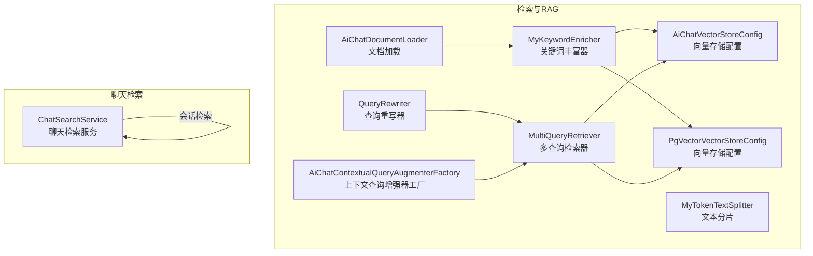
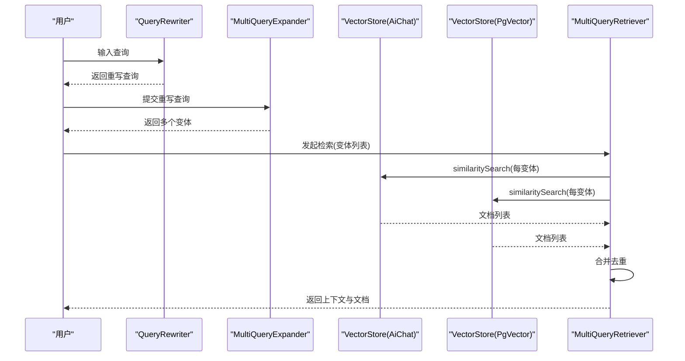
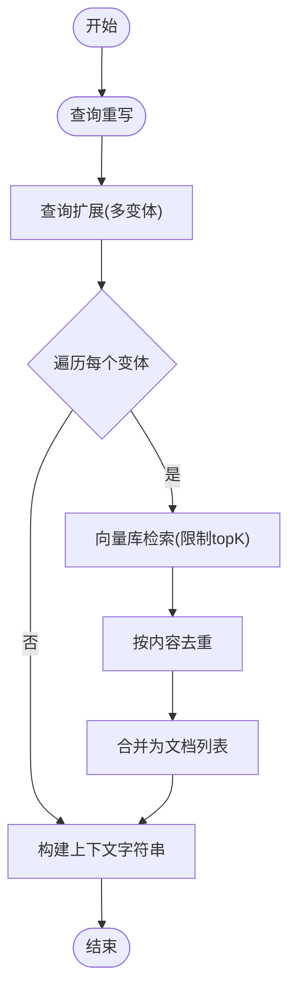
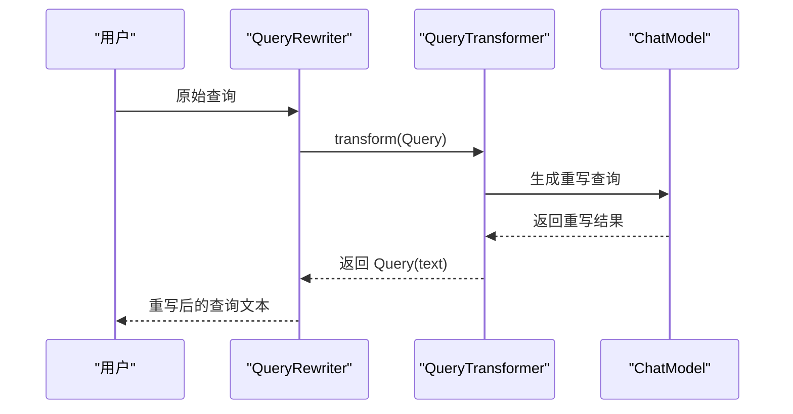
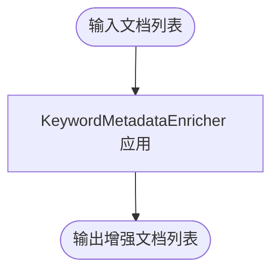
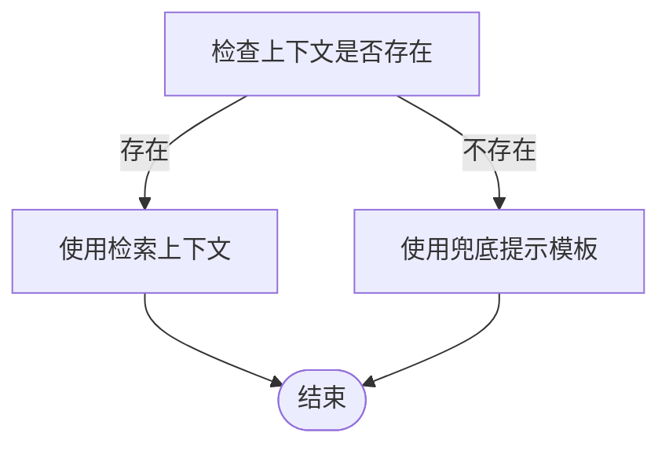
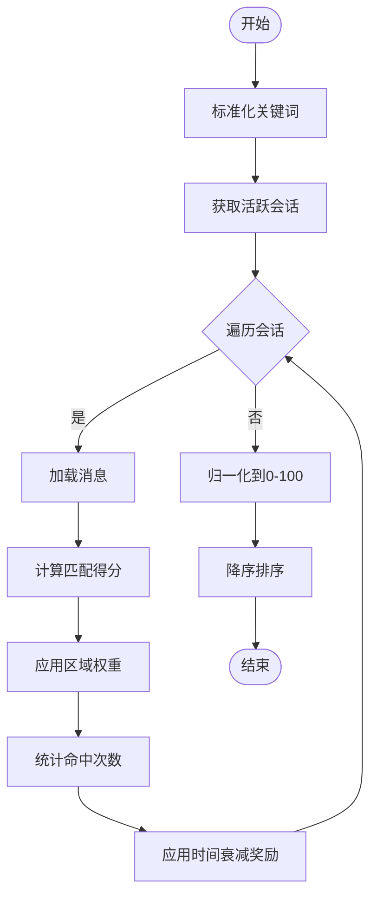
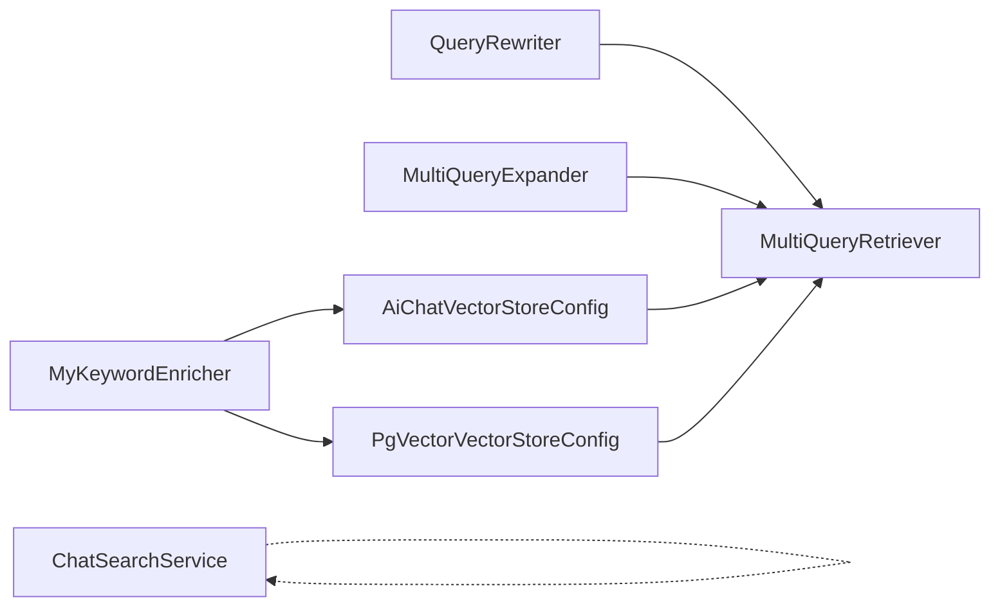

# 检索系统和查询优化

<cite>
**本文引用的文件**
- [MultiQueryRetriever.java](file://src/main/java/com/yupi/yuaiagent/rag/MultiQueryRetriever.java)
- [QueryRewriter.java](file://src/main/java/com/yupi/yuaiagent/rag/QueryRewriter.java)
- [MyKeywordEnricher.java](file://src/main/java/com/yupi/yuaiagent/rag/MyKeywordEnricher.java)
- [AiChatContextualQueryAugmenterFactory.java](file://src/main/java/com/yupi/yuaiagent/rag/AiChatContextualQueryAugmenterFactory.java)
- [ChatSearchService.java](file://src/main/java/com/yupi/yuaiagent/search/ChatSearchService.java)
- [AiChatVectorStoreConfig.java](file://src/main/java/com/yupi/yuaiagent/rag/AiChatVectorStoreConfig.java)
- [PgVectorVectorStoreConfig.java](file://src/main/java/com/yupi/yuaiagent/rag/PgVectorVectorStoreConfig.java)
- [MultiQueryExpanderDemo.java](file://src/main/java/com/yupi/yuaiagent/demo/rag/MultiQueryExpanderDemo.java)
- [AiChatDocumentLoader.java](file://src/main/java/com/yupi/yuaiagent/rag/AiChatDocumentLoader.java)
- [MyTokenTextSplitter.java](file://src/main/java/com/yupi/yuaiagent/rag/MyTokenTextSplitter.java)
</cite>

## 目录
1. [简介](#简介)
2. [项目结构](#项目结构)
3. [核心组件](#核心组件)
4. [架构总览](#架构总览)
5. [详细组件分析](#详细组件分析)
6. [依赖分析](#依赖分析)
7. [性能考虑](#性能考虑)
8. [故障排查指南](#故障排查指南)
9. [结论](#结论)
10. [附录](#附录)

## 简介
本文件聚焦于检索系统与查询优化的技术实现，围绕多查询检索器（MultiQueryRetriever）、查询重写器（QueryRewriter）、关键词丰富器（MyKeywordEnricher）以及上下文查询增强器展开，系统性阐述查询扩展、同义词生成、上下文感知查询、TF-IDF权重与关键词重要性评分、对话历史融合与相关性提升等关键技术点，并给出性能优化策略、评估指标与A/B测试方法、监控与调试工具及定制化开发指南。

## 项目结构
检索与查询优化相关模块主要位于后端工程的 rag 与 search 包中，配合向量存储配置与文档加载/分片组件，形成从“查询重写/扩展”到“相似度检索/合并”的完整链路；聊天检索服务提供会话级全文检索与加权排序。

图表来源
- [MultiQueryRetriever.java:1-129](file://src/main/java/com/yupi/yuaiagent/rag/MultiQueryRetriever.java#L1-L129)
- [QueryRewriter.java:1-41](file://src/main/java/com/yupi/yuaiagent/rag/QueryRewriter.java#L1-L41)
- [MyKeywordEnricher.java:1-26](file://src/main/java/com/yupi/yuaiagent/rag/MyKeywordEnricher.java#L1-L26)
- [AiChatContextualQueryAugmenterFactory.java:1-23](file://src/main/java/com/yupi/yuaiagent/rag/AiChatContextualQueryAugmenterFactory.java#L1-L23)
- [AiChatVectorStoreConfig.java](file://src/main/java/com/yupi/yuaiagent/rag/AiChatVectorStoreConfig.java)
- [PgVectorVectorStoreConfig.java](file://src/main/java/com/yupi/yuaiagent/rag/PgVectorVectorStoreConfig.java)
- [AiChatDocumentLoader.java](file://src/main/java/com/yupi/yuaiagent/rag/AiChatDocumentLoader.java)
- [MyTokenTextSplitter.java](file://src/main/java/com/yupi/yuaiagent/rag/MyTokenTextSplitter.java)
- [ChatSearchService.java:1-178](file://src/main/java/com/yupi/yuaiagent/search/ChatSearchService.java#L1-L178)

章节来源
- [MultiQueryRetriever.java:1-129](file://src/main/java/com/yupi/yuaiagent/rag/MultiQueryRetriever.java#L1-L129)
- [QueryRewriter.java:1-41](file://src/main/java/com/yupi/yuaiagent/rag/QueryRewriter.java#L1-L41)
- [MyKeywordEnricher.java:1-26](file://src/main/java/com/yupi/yuaiagent/rag/MyKeywordEnricher.java#L1-L26)
- [AiChatContextualQueryAugmenterFactory.java:1-23](file://src/main/java/com/yupi/yuaiagent/rag/AiChatContextualQueryAugmenterFactory.java#L1-L23)
- [ChatSearchService.java:1-178](file://src/main/java/com/yupi/yuaiagent/search/ChatSearchService.java#L1-L178)

## 核心组件
- 多查询检索器（MultiQueryRetriever）
  - 功能：对原始查询进行重写与扩展，生成多个变体，分别向向量库检索，最后合并去重并构建上下文。
  - 关键点：支持传入 MultiQueryExpander 进行查询扩展；按 topKPerQuery 控制每变体返回数量；使用内容哈希去重。
- 查询重写器（QueryRewriter）
  - 功能：通过 LLM 将用户输入改写为更利于向量检索的查询表达，提升召回质量。
  - 关键点：封装 QueryTransformer，统一执行重写逻辑。
- 关键词丰富器（MyKeywordEnricher）
  - 功能：为文档补充关键词元信息，便于后续检索与排序。
  - 关键点：基于 KeywordMetadataEnricher，调用 ChatModel 生成关键词。
- 上下文查询增强器工厂（AiChatContextualQueryAugmenterFactory）
  - 功能：在无上下文时返回兜底提示，避免直接拒绝用户问题。
  - 关键点：允许空上下文场景，提供固定兜底模板。
- 聊天检索服务（ChatSearchService）
  - 功能：跨会话检索，按标题/消息内容/角色/时效等维度加权打分并排序。
  - 关键点：三层匹配规则（完全相等/前缀/包含），命中计数与时间衰减奖励，结果归一化至0-100。

章节来源
- [MultiQueryRetriever.java:13-129](file://src/main/java/com/yupi/yuaiagent/rag/MultiQueryRetriever.java#L13-L129)
- [QueryRewriter.java:10-41](file://src/main/java/com/yupi/yuaiagent/rag/QueryRewriter.java#L10-L41)
- [MyKeywordEnricher.java:11-26](file://src/main/java/com/yupi/yuaiagent/rag/MyKeywordEnricher.java#L11-L26)
- [AiChatContextualQueryAugmenterFactory.java:6-23](file://src/main/java/com/yupi/yuaiagent/rag/AiChatContextualQueryAugmenterFactory.java#L6-L23)
- [ChatSearchService.java:20-178](file://src/main/java/com/yupi/yuaiagent/search/ChatSearchService.java#L20-L178)

## 架构总览
下图展示从“用户输入”到“检索结果与上下文”的端到端流程，包括查询重写、查询扩展、向量检索、合并去重与上下文构建。

图表来源
- [MultiQueryRetriever.java:90-106](file://src/main/java/com/yupi/yuaiagent/rag/MultiQueryRetriever.java#L90-L106)
- [QueryRewriter.java:33-39](file://src/main/java/com/yupi/yuaiagent/rag/QueryRewriter.java#L33-L39)

章节来源
- [MultiQueryRetriever.java:82-106](file://src/main/java/com/yupi/yuaiagent/rag/MultiQueryRetriever.java#L82-L106)
- [QueryRewriter.java:27-39](file://src/main/java/com/yupi/yuaiagent/rag/QueryRewriter.java#L27-L39)

## 详细组件分析

### 多查询检索器（MultiQueryRetriever）
- 工作原理
  - 查询重写：先由 QueryRewriter 对原始查询进行改写，提升语义一致性。
  - 查询扩展：使用 MultiQueryExpander 将重写后的查询扩展为多个变体。
  - 多路检索：对每个变体调用向量库 similaritySearch，限制每变体 topK 结果。
  - 合并去重：以文档内容为键进行去重，保持顺序稳定。
  - 上下文构建：将去重后的文档文本拼接为上下文字符串，供下游生成使用。
- 数据结构与复杂度
  - 变体数量为 N，每变体检索 topK 文档；整体时间复杂度近似 O(N·topK)；空间复杂度受去重集合与结果集大小影响。
- 错误处理
  - 单个变体检索异常会被捕获并记录告警，不影响其他变体的检索。
- 性能要点
  - topKPerQuery 参数控制每变体返回上限，平衡召回与延迟。
  - 去重采用内容哈希，避免重复内容多次参与上下文。

图表来源
- [MultiQueryRetriever.java:43-106](file://src/main/java/com/yupi/yuaiagent/rag/MultiQueryRetriever.java#L43-L106)

章节来源
- [MultiQueryRetriever.java:36-106](file://src/main/java/com/yupi/yuaiagent/rag/MultiQueryRetriever.java#L36-L106)

### 查询重写器（QueryRewriter）
- 功能概述
  - 利用 LLM 将用户输入改写为更适合向量检索的查询表达，减少歧义、提升召回质量。
- 实现要点
  - 基于 QueryTransformer 的重写管线，封装 ChatClient 与 ChatModel。
  - 统一入口 doQueryRewrite 接收原始查询，返回重写后的文本。
- 适用场景
  - 用户输入口语化或模糊；需要将意图转化为结构化查询。

图表来源
- [QueryRewriter.java:19-39](file://src/main/java/com/yupi/yuaiagent/rag/QueryRewriter.java#L19-L39)

章节来源
- [QueryRewriter.java:10-41](file://src/main/java/com/yupi/yuaiagent/rag/QueryRewriter.java#L10-L41)

### 关键词丰富器（MyKeywordEnricher）
- 作用
  - 为文档补充关键词元信息，辅助检索与排序；例如用于后续的 TF-IDF 权重计算或关键词重要性评分。
- 实现机制
  - 基于 KeywordMetadataEnricher，调用 ChatModel 生成关键词列表，应用于文档集合。
- 与检索的关系
  - 丰富后的文档可被向量库索引，提升检索相关性；也可作为后续排序/过滤的特征。

图表来源
- [MyKeywordEnricher.java:21-24](file://src/main/java/com/yupi/yuaiagent/rag/MyKeywordEnricher.java#L21-L24)

章节来源
- [MyKeywordEnricher.java:11-26](file://src/main/java/com/yupi/yuaiagent/rag/MyKeywordEnricher.java#L11-L26)

### 上下文查询增强器工厂（AiChatContextualQueryAugmenterFactory）
- 作用
  - 在检索无上下文时，返回预设兜底提示，避免直接拒绝用户问题，保证用户体验连续性。
- 设计要点
  - 允许空上下文场景，提供固定 PromptTemplate，确保兜底文案一致。
- 与检索器协作
  - 当 MultiQueryRetriever.buildContext 返回空时，可结合该增强器输出引导性回复。

图表来源
- [AiChatContextualQueryAugmenterFactory.java:11-21](file://src/main/java/com/yupi/yuaiagent/rag/AiChatContextualQueryAugmenterFactory.java#L11-L21)

章节来源
- [AiChatContextualQueryAugmenterFactory.java:6-23](file://src/main/java/com/yupi/yuaiagent/rag/AiChatContextualQueryAugmenterFactory.java#L6-L23)

### 聊天检索服务（ChatSearchService）
- 功能
  - 跨会话检索，按标题/消息内容/角色/时效等维度加权打分，返回带高亮命中位置的会话列表。
- 评分规则
  - 匹配层：完全相等=100，前缀=70，包含=50；区域权重：标题=100，用户消息=30，AI消息=20；命中次数奖励=count×10；时间衰减奖励：≤1天=30，≤7天=20，≤30天=10。
- 输出
  - 归一化至0-100的相关度分数，排序后返回会话摘要、最佳命中片段与高亮偏移。

图表来源
- [ChatSearchService.java:53-124](file://src/main/java/com/yupi/yuaiagent/search/ChatSearchService.java#L53-L124)

章节来源
- [ChatSearchService.java:20-178](file://src/main/java/com/yupi/yuaiagent/search/ChatSearchService.java#L20-L178)

## 依赖分析
- 组件耦合
  - MultiQueryRetriever 依赖 QueryRewriter 与向量存储（AiChat/PgVector）配置类；与 MultiQueryExpander 解耦，通过接口扩展查询变体。
  - MyKeywordEnricher 依赖 ChatModel，独立于检索链路，可前置用于文档元数据增强。
  - AiChatContextualQueryAugmenterFactory 与检索器解耦，提供兜底策略。
  - ChatSearchService 与会话管理与消息仓储交互，不依赖 RAG 子系统。
- 外部依赖
  - 向量存储配置类（AiChatVectorStoreConfig、PgVectorVectorStoreConfig）负责具体向量库接入。
  - 文档加载与分片组件（AiChatDocumentLoader、MyTokenTextSplitter）支撑知识入库与预处理。

图表来源
- [MultiQueryRetriever.java:22-34](file://src/main/java/com/yupi/yuaiagent/rag/MultiQueryRetriever.java#L22-L34)
- [QueryRewriter.java:17-25](file://src/main/java/com/yupi/yuaiagent/rag/QueryRewriter.java#L17-L25)
- [MyKeywordEnricher.java:18-24](file://src/main/java/com/yupi/yuaiagent/rag/MyKeywordEnricher.java#L18-L24)
- [AiChatVectorStoreConfig.java](file://src/main/java/com/yupi/yuaiagent/rag/AiChatVectorStoreConfig.java)
- [PgVectorVectorStoreConfig.java](file://src/main/java/com/yupi/yuaiagent/rag/PgVectorVectorStoreConfig.java)
- [ChatSearchService.java:40-44](file://src/main/java/com/yupi/yuaiagent/search/ChatSearchService.java#L40-L44)

章节来源
- [MultiQueryRetriever.java:22-34](file://src/main/java/com/yupi/yuaiagent/rag/MultiQueryRetriever.java#L22-L34)
- [QueryRewriter.java:17-25](file://src/main/java/com/yupi/yuaiagent/rag/QueryRewriter.java#L17-L25)
- [MyKeywordEnricher.java:18-24](file://src/main/java/com/yupi/yuaiagent/rag/MyKeywordEnricher.java#L18-L24)
- [AiChatVectorStoreConfig.java](file://src/main/java/com/yupi/yuaiagent/rag/AiChatVectorStoreConfig.java)
- [PgVectorVectorStoreConfig.java](file://src/main/java/com/yupi/yuaiagent/rag/PgVectorVectorStoreConfig.java)
- [ChatSearchService.java:40-44](file://src/main/java/com/yupi/yuaiagent/search/ChatSearchService.java#L40-L44)

## 性能考虑
- 缓存机制
  - 查询重写结果缓存：对相同输入的重写结果进行短期缓存，降低重复 LLM 调用开销。
  - 变体检索结果缓存：对热门变体的检索结果进行缓存，避免重复相似度检索。
- 并行查询
  - 变体检索并发执行，缩短总延迟；注意线程池与资源限制，防止过载。
- 结果合并
  - 去重采用内容哈希，建议使用稳定的哈希算法并控制最大去重集合大小，避免内存膨胀。
- 向量检索参数
  - topKPerQuery 与相似度阈值需结合业务调优；过小导致漏召回，过大增加延迟与成本。
- 文档预处理
  - 关键词丰富与文本分片应前置执行，减少检索时的计算负担；分片长度与重叠策略影响召回粒度。

## 故障排查指南
- 多查询检索失败
  - 现象：某变体检索抛出异常。
  - 排查：查看日志中的告警信息；确认向量库连接、索引状态与权限；逐步缩小到具体变体。
  - 处理：对异常变体进行降级（跳过或回退），保证主流程可用。
- 无上下文兜底
  - 现象：检索结果为空但用户期望得到回复。
  - 排查：确认上下文查询增强器是否启用；检查 MultiQueryRetriever.buildContext 是否为空。
  - 处理：启用兜底提示模板，引导用户重新提问或提供更多信息。
- 聊天检索相关度低
  - 现象：命中关键词但相关度不高。
  - 排查：检查评分权重与匹配规则；确认会话标题/消息内容是否合理；评估时间衰减奖励设置。
  - 处理：调整权重或引入额外特征（如关键词匹配强度、消息角色权重）。

章节来源
- [MultiQueryRetriever.java:61-64](file://src/main/java/com/yupi/yuaiagent/rag/MultiQueryRetriever.java#L61-L64)
- [AiChatContextualQueryAugmenterFactory.java:11-21](file://src/main/java/com/yupi/yuaiagent/rag/AiChatContextualQueryAugmenterFactory.java#L11-L21)
- [ChatSearchService.java:126-146](file://src/main/java/com/yupi/yuaiagent/search/ChatSearchService.java#L126-L146)

## 结论
本检索系统通过“查询重写 + 查询扩展 + 多路检索 + 合并去重 + 上下文构建”的链路，显著提升了召回质量与稳定性；结合关键词元信息增强与会话级检索，形成覆盖多场景的检索能力。通过缓存、并行与参数调优可进一步优化性能；通过兜底提示与评分规则保障用户体验。建议在生产环境中持续进行 A/B 测试与监控评估，迭代优化检索策略。

## 附录

### 检索质量评估指标与A/B测试方法
- 评估指标
  - 召回率（Recall@K）：衡量检索到相关文档的比例。
  - 精准率（Precision@K）：衡量检索结果中相关文档的比例。
  - MRR（Mean Reciprocal Rank）：首个相关文档的倒数排名平均值。
  - NDCG@K：考虑相关性等级的归一化折扣累积增益。
  - 用户满意度（US）：通过问卷或点击反馈估算。
- A/B测试方法
  - 分组策略：随机分配用户至不同检索策略（如是否启用查询重写、是否启用关键词丰富器）。
  - 指标收集：对比各组的点击率、转化率、任务完成率、平均响应时间。
  - 统计显著性：使用t检验或Mann–Whitney U检验验证差异显著性。
  - 持续监控：上线后持续跟踪关键指标，及时发现回归。

### 监控与调试工具
- 日志与追踪
  - 记录查询重写前后文本、变体数量、每变体检索耗时、合并去重数量、兜底触发情况。
- 指标埋点
  - 检索延迟、吞吐量、错误率、命中率、相关度分布。
- 可视化
  - Dashboard 展示检索链路关键节点的耗时与成功率；提供样本查询与命中高亮。

### 定制化开发指南
- 自定义查询扩展器
  - 实现 MultiQueryExpander 接口，按业务需求生成变体（如同义词、反义词、上下文相关变体）。
- 自定义向量存储
  - 新增向量存储配置类，适配新引擎；确保兼容 similaritySearch/SearchRequest。
- 自定义关键词丰富策略
  - 替换 KeywordMetadataEnricher 为自定义策略（如 TF-IDF 重要性评分、主题模型关键词抽取）。
- 自定义上下文增强
  - 扩展 AiChatContextualQueryAugmenterFactory，根据业务领域定制兜底提示模板。
- 调优建议
  - 从 topKPerQuery、相似度阈值、匹配规则权重入手；结合 A/B 测试验证效果；逐步引入更复杂的特征与排序模型。