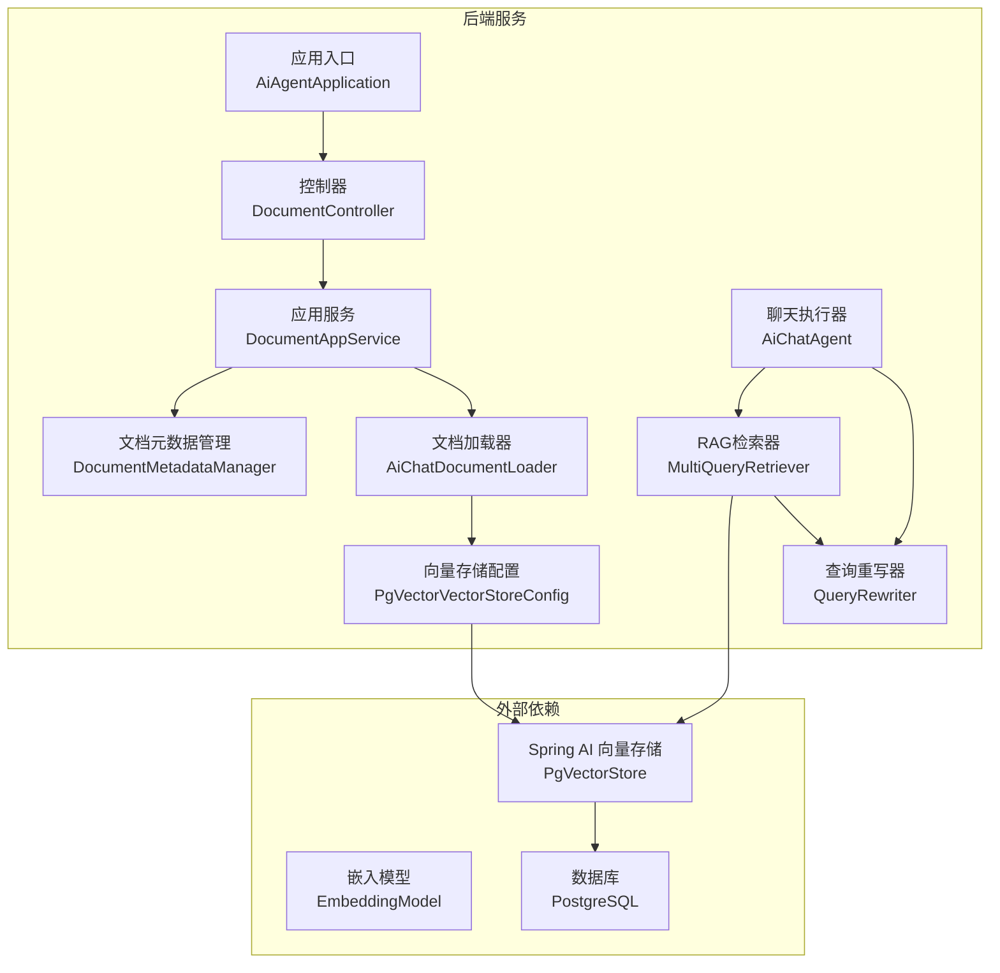
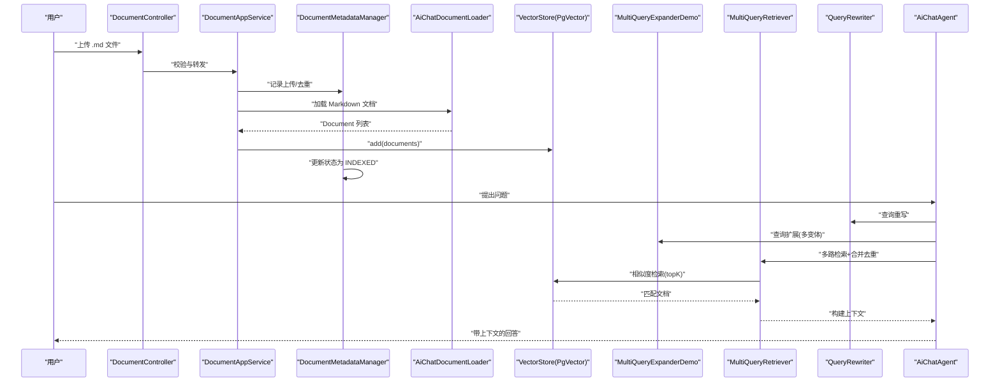
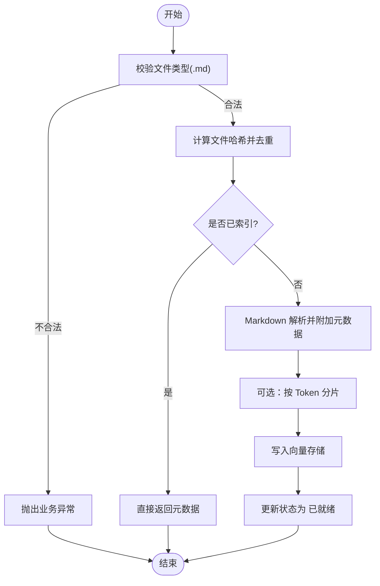
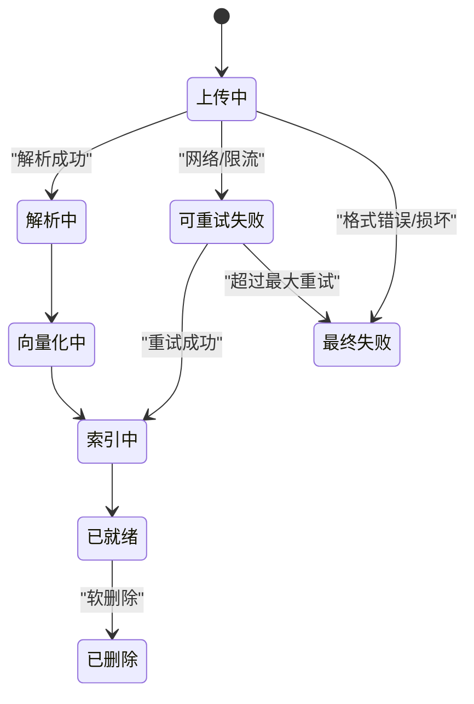
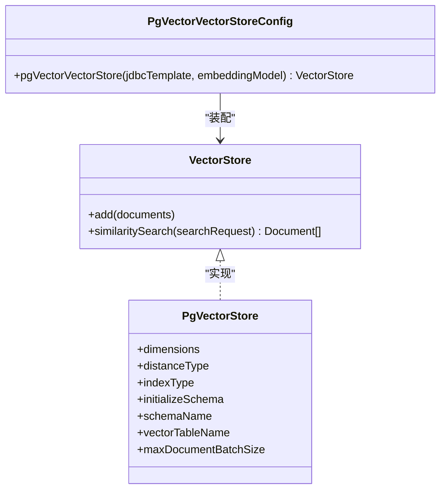
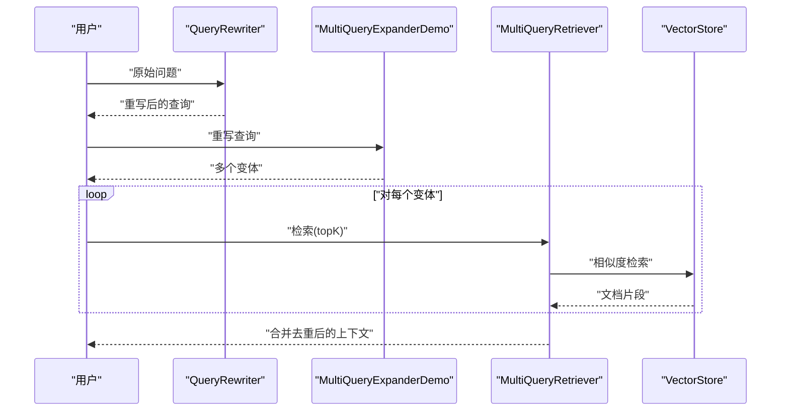
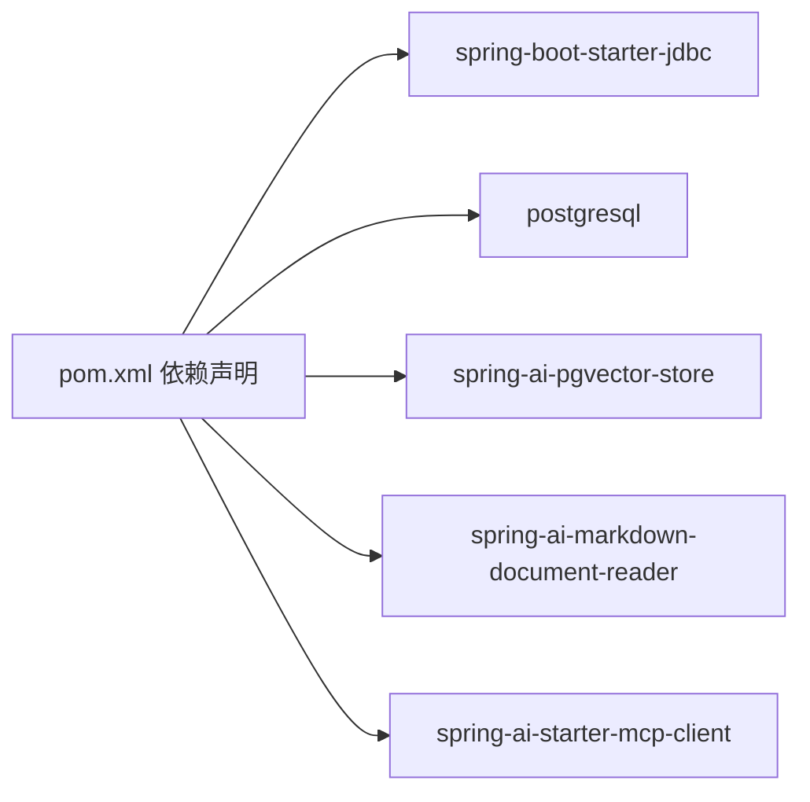

# 知识库和RAG系统

<cite>
**本文引用的文件**
- [PgVectorVectorStoreConfig.java](file://src/main/java/com/yupi/yuaiagent/rag/PgVectorVectorStoreConfig.java)
- [PgVectorVectorStoreConfigTest.java](file://src/test/java/com/yupi/yuaiagent/rag/PgVectorVectorStoreConfigTest.java)
- [AiChatRagCustomAdvisorFactory.java](file://src/main/java/com/yupi/yuaiagent/rag/AiChatRagCustomAdvisorFactory.java)
- [MultiQueryRetriever.java](file://src/main/java/com/yupi/yuaiagent/rag/MultiQueryRetriever.java)
- [MultiQueryExpanderDemo.java](file://src/main/java/com/yupi/yuaiagent/demo/rag/MultiQueryExpanderDemo.java)
- [MultiQueryExpanderDemoTest.java](file://src/test/java/com/yupi/yuaiagent/demo/rag/MultiQueryExpanderDemoTest.java)
- [MyTokenTextSplitter.java](file://src/main/java/com/yupi/yuaiagent/rag/MyTokenTextSplitter.java)
- [DocumentAppService.java](file://src/main/java/com/yupi/yuaiagent/service/DocumentAppService.java)
- [DocumentMetadataManager.java](file://src/main/java/com/yupi/yuaiagent/document/DocumentMetadataManager.java)
- [DocumentStatus.java](file://src/main/java/com/yupi/yuaiagent/document/DocumentStatus.java)
- [DocumentResponse.java](file://src/main/java/com/yupi/yuaiagent/dto/DocumentResponse.java)
- [AiChatAgent.java](file://src/main/java/com/yupi/yuaiagent/app/AiChatAgent.java)
- [pom.xml](file://pom.xml)
</cite>

## 目录
1. [简介](#简介)
2. [项目结构](#项目结构)
3. [核心组件](#核心组件)
4. [架构总览](#架构总览)
5. [详细组件分析](#详细组件分析)
6. [依赖关系分析](#依赖关系分析)
7. [性能与优化](#性能与优化)
8. [故障排查指南](#故障排查指南)
9. [结论](#结论)
10. [附录](#附录)

## 简介
本文件面向开发者与运维人员，系统性梳理该知识库与RAG（检索增强生成）系统的实现原理、架构设计与工程实践。内容涵盖文档导入流程、文本预处理与向量嵌入、PgVector向量存储配置与查询策略、文档管理系统（上传、分类、元数据与版本控制）、多查询检索器与查询重写、相似度计算、性能优化与缓存策略、增量更新机制，以及实际使用示例与最佳实践。

## 项目结构
该项目采用分层与模块化组织方式，RAG相关能力集中在 rag、demo.rag、service、document、controller、app 等包中；向量存储通过 Spring AI 的 PgVector Store 实现；前端位于 yu-ai-agent-frontend。

图表来源
- [DocumentAppService.java:38-110](file://src/main/java/com/yupi/yuaiagent/service/DocumentAppService.java#L38-L110)
- [DocumentMetadataManager.java:69-120](file://src/main/java/com/yupi/yuaiagent/document/DocumentMetadataManager.java#L69-L120)
- [MultiQueryRetriever.java:1-128](file://src/main/java/com/yupi/yuaiagent/rag/MultiQueryRetriever.java#L1-L128)
- [AiChatRagCustomAdvisorFactory.java:36-61](file://src/main/java/com/yupi/yuaiagent/rag/AiChatRagCustomAdvisorFactory.java#L36-L61)
- [PgVectorVectorStoreConfig.java:18-39](file://src/main/java/com/yupi/yuaiagent/rag/PgVectorVectorStoreConfig.java#L18-L39)
- [AiChatAgent.java:129-156](file://src/main/java/com/yupi/yuaiagent/app/AiChatAgent.java#L129-L156)

章节来源
- [DocumentAppService.java:38-110](file://src/main/java/com/yupi/yuaiagent/service/DocumentAppService.java#L38-L110)
- [DocumentMetadataManager.java:35-120](file://src/main/java/com/yupi/yuaiagent/document/DocumentMetadataManager.java#L35-L120)
- [MultiQueryRetriever.java:1-128](file://src/main/java/com/yupi/yuaiagent/rag/MultiQueryRetriever.java#L1-L128)
- [AiChatRagCustomAdvisorFactory.java:36-61](file://src/main/java/com/yupi/yuaiagent/rag/AiChatRagCustomAdvisorFactory.java#L36-L61)
- [PgVectorVectorStoreConfig.java:18-39](file://src/main/java/com/yupi/yuaiagent/rag/PgVectorVectorStoreConfig.java#L18-L39)
- [AiChatAgent.java:129-156](file://src/main/java/com/yupi/yuaiagent/app/AiChatAgent.java#L129-L156)

## 核心组件
- 文档导入与索引管线：负责接收 Markdown 文件、去重、解析、分片、向量化与入库。
- 文档元数据管理：统一记录生命周期状态、失败重试、软删除等。
- 向量存储与检索：基于 PgVector 的向量表、索引类型与相似度策略。
- 多查询检索器：查询重写 + 查询扩展 + 多路召回 + 合并去重。
- 聊天与提示工程：将检索上下文注入提示，驱动大模型生成回答。

章节来源
- [DocumentAppService.java:38-110](file://src/main/java/com/yupi/yuaiagent/service/DocumentAppService.java#L38-L110)
- [DocumentMetadataManager.java:69-120](file://src/main/java/com/yupi/yuaiagent/document/DocumentMetadataManager.java#L69-L120)
- [MultiQueryRetriever.java:1-128](file://src/main/java/com/yupi/yuaiagent/rag/MultiQueryRetriever.java#L1-L128)
- [PgVectorVectorStoreConfig.java:18-39](file://src/main/java/com/yupi/yuaiagent/rag/PgVectorVectorStoreConfig.java#L18-L39)

## 架构总览
下图展示从“上传文档”到“RAG问答”的完整链路，包括数据流与控制流。

图表来源
- [DocumentAppService.java:38-110](file://src/main/java/com/yupi/yuaiagent/service/DocumentAppService.java#L38-L110)
- [DocumentMetadataManager.java:69-120](file://src/main/java/com/yupi/yuaiagent/document/DocumentMetadataManager.java#L69-L120)
- [AiChatDocumentLoader.java](file://src/main/java/com/yupi/yuaiagent/rag/AiChatDocumentLoader.java)
- [MultiQueryExpanderDemo.java:24-36](file://src/main/java/com/yupi/yuaiagent/demo/rag/MultiQueryExpanderDemo.java#L24-L36)
- [MultiQueryRetriever.java:90-106](file://src/main/java/com/yupi/yuaiagent/rag/MultiQueryRetriever.java#L90-L106)
- [AiChatAgent.java:129-156](file://src/main/java/com/yupi/yuaiagent/app/AiChatAgent.java#L129-L156)

## 详细组件分析

### 文档导入与索引流程
- 输入校验：仅接受 .md 文件；记录上传元数据并进行文件级去重（SHA-256）。
- 解析与分片：使用 Markdown 文档读取器提取文本并附加元数据；可选自定义 Token 分片器进行切分。
- 向量化与入库：将文档写入向量存储；状态流转为“已就绪”，可用于检索。
- 元数据持久化：以 JSON 文件形式保存在本地目录，便于重启恢复。

图表来源
- [DocumentAppService.java:38-110](file://src/main/java/com/yupi/yuaiagent/service/DocumentAppService.java#L38-L110)
- [DocumentMetadataManager.java:69-120](file://src/main/java/com/yupi/yuaiagent/document/DocumentMetadataManager.java#L69-L120)
- [MyTokenTextSplitter.java:14-22](file://src/main/java/com/yupi/yuaiagent/rag/MyTokenTextSplitter.java#L14-L22)

章节来源
- [DocumentAppService.java:38-110](file://src/main/java/com/yupi/yuaiagent/service/DocumentAppService.java#L38-L110)
- [DocumentMetadataManager.java:69-120](file://src/main/java/com/yupi/yuaiagent/document/DocumentMetadataManager.java#L69-L120)
- [MyTokenTextSplitter.java:14-22](file://src/main/java/com/yupi/yuaiagent/rag/MyTokenTextSplitter.java#L14-L22)

### 文档元数据管理与版本控制
- 生命周期状态机：上传中 → 解析中 → 向量化中 → 索引中 → 已就绪；失败分为可重试与最终失败；支持软删除。
- 去重策略：基于文件内容哈希，避免重复入库。
- 版本与重试：记录失败原因、重试次数与时间，支持有限次自动重试。
- 数据持久化：以 JSON 文件保存在配置目录，启动时加载。

图表来源
- [DocumentStatus.java:19-62](file://src/main/java/com/yupi/yuaiagent/document/DocumentStatus.java#L19-L62)
- [DocumentMetadataManager.java:98-120](file://src/main/java/com/yupi/yuaiagent/document/DocumentMetadataManager.java#L98-L120)

章节来源
- [DocumentStatus.java:19-62](file://src/main/java/com/yupi/yuaiagent/document/DocumentStatus.java#L19-L62)
- [DocumentMetadataManager.java:98-120](file://src/main/java/com/yupi/yuaiagent/document/DocumentMetadataManager.java#L98-L120)
- [DocumentResponse.java:12-22](file://src/main/java/com/yupi/yuaiagent/dto/DocumentResponse.java#L12-L22)

### 向量存储与检索策略（PgVector）
- 存储实现：基于 Spring AI 的 PgVectorStore，使用 PostgreSQL 表存储向量与元数据。
- 初始化参数：维度、距离类型（余弦）、索引类型（HNSW）、模式名、表名、批量大小等。
- 查询策略：支持相似度检索与过滤表达式；可结合状态字段进行条件过滤。
- 测试验证：单元测试覆盖 add 与 similaritySearch 基本流程。

图表来源
- [PgVectorVectorStoreConfig.java:18-39](file://src/main/java/com/yupi/yuaiagent/rag/PgVectorVectorStoreConfig.java#L18-L39)
- [PgVectorVectorStoreConfigTest.java:20-32](file://src/test/java/com/yupi/yuaiagent/rag/PgVectorVectorStoreConfigTest.java#L20-L32)

章节来源
- [PgVectorVectorStoreConfig.java:18-39](file://src/main/java/com/yupi/yuaiagent/rag/PgVectorVectorStoreConfig.java#L18-L39)
- [PgVectorVectorStoreConfigTest.java:20-32](file://src/test/java/com/yupi/yuaiagent/rag/PgVectorVectorStoreConfigTest.java#L20-L32)

### 多查询检索器与查询重写
- 多查询检索器：对每个查询变体执行相似度检索，合并后按文档内容去重，返回上下文字符串。
- 查询重写：在检索前对用户问题进行语义改写，提升召回质量。
- 查询扩展：使用 MultiQueryExpander 生成多个变体，再逐一检索并合并。
- 完整流程：重写 → 扩展 → 多路检索 → 合并去重 → 构建上下文 → 生成回答。

图表来源
- [MultiQueryRetriever.java:90-106](file://src/main/java/com/yupi/yuaiagent/rag/MultiQueryRetriever.java#L90-L106)
- [MultiQueryExpanderDemo.java:24-36](file://src/main/java/com/yupi/yuaiagent/demo/rag/MultiQueryExpanderDemo.java#L24-L36)
- [AiChatAgent.java:129-156](file://src/main/java/com/yupi/yuaiagent/app/AiChatAgent.java#L129-L156)

章节来源
- [MultiQueryRetriever.java:1-128](file://src/main/java/com/yupi/yuaiagent/rag/MultiQueryRetriever.java#L1-L128)
- [MultiQueryExpanderDemo.java:24-36](file://src/main/java/com/yupi/yuaiagent/demo/rag/MultiQueryExpanderDemo.java#L24-L36)
- [AiChatAgent.java:129-156](file://src/main/java/com/yupi/yuaiagent/app/AiChatAgent.java#L129-L156)

### 文档管理系统使用指南
- 上传：仅支持 .md 文件；接口会进行校验并触发解析与索引。
- 分类与元数据：解析时可附加状态、文件名、文档 ID 等元数据，便于后续过滤与检索。
- 版本控制：当前实现未提供显式的版本号字段；可通过文档 ID 与哈希进行去重与幂等处理。
- 状态查看：通过响应对象中的状态字段了解处理进度与结果。

章节来源
- [DocumentAppService.java:38-110](file://src/main/java/com/yupi/yuaiagent/service/DocumentAppService.java#L38-L110)
- [DocumentResponse.java:12-22](file://src/main/java/com/yupi/yuaiagent/dto/DocumentResponse.java#L12-L22)
- [DocumentMetadataManager.java:69-120](file://src/main/java/com/yupi/yuaiagent/document/DocumentMetadataManager.java#L69-L120)

## 依赖关系分析
- 向量存储依赖：Spring Boot Starter JDBC、PostgreSQL 驱动、Spring AI PgVector Store。
- 文档解析：Spring AI Markdown 文档读取器。
- 查询扩展：Spring AI MultiQueryExpander。
- 构建与打包：Maven 项目，包含上述依赖声明。

图表来源
- [pom.xml:70-101](file://pom.xml#L70-L101)

章节来源
- [pom.xml:70-101](file://pom.xml#L70-L101)

## 性能与优化
- 向量索引与查询
  - 索引类型：HNSW；距离类型：余弦距离；建议根据数据规模调整索引参数与批量写入大小。
  - 查询：合理设置 topK 与相似度阈值，避免过多无关文档影响生成质量。
- 文本预处理
  - 使用 Token 分片器控制单段长度与重叠，平衡召回与上下文长度。
  - 对长文档进行结构化切分（如标题、段落），提升检索粒度。
- 缓存策略
  - 对热点查询与扩展结果进行短期缓存，降低重复检索开销。
  - 对相似度检索结果进行去重与排序缓存，减少重复计算。
- 增量更新
  - 基于文件哈希与文档 ID 的去重机制，支持重复上传幂等处理。
  - 支持失败重试与最终失败标记，保障数据一致性。
- 并发与批处理
  - 批量写入向量存储，减少事务开销；根据硬件资源调整批量大小。
  - 异步化解析与索引流程，避免阻塞请求线程。

[本节为通用性能指导，无需具体文件引用]

## 故障排查指南
- 上传失败或格式不支持
  - 确认文件为 .md；检查业务异常抛出点与错误信息。
- 向量存储初始化失败
  - 检查数据库连接、表权限与模式名；确认 initializeSchema 参数与表名配置。
- 相似度检索无结果
  - 检查相似度阈值与 topK 设置；确认文档已成功入库且状态为“已就绪”。
- 查询扩展或重写异常
  - 核对 MultiQueryExpander 的构建参数与 ChatClient 配置；查看日志输出定位问题。
- 元数据状态异常
  - 查看 JSON 元数据文件是否被意外修改；必要时重建索引。

章节来源
- [DocumentAppService.java:38-45](file://src/main/java/com/yupi/yuaiagent/service/DocumentAppService.java#L38-L45)
- [PgVectorVectorStoreConfigTest.java:20-32](file://src/test/java/com/yupi/yuaiagent/rag/PgVectorVectorStoreConfigTest.java#L20-L32)
- [MultiQueryExpanderDemoTest.java:19-24](file://src/test/java/com/yupi/yuaiagent/demo/rag/MultiQueryExpanderDemoTest.java#L19-L24)

## 结论
本知识库与RAG系统通过清晰的文档导入流水线、可靠的元数据管理、灵活的多查询检索与查询重写、以及基于 PgVector 的高效向量存储，实现了从“文档入库”到“智能问答”的完整闭环。建议在生产环境中进一步完善版本控制、缓存与监控体系，并结合业务场景优化索引参数与批处理策略，以获得更优的性能与稳定性。

## 附录
- 实际使用示例
  - 上传 .md 文档并等待状态变为“已就绪”。
  - 在聊天界面提出问题，系统将自动进行查询重写、多查询扩展与检索合并，最终返回带上下文的回答。
- 最佳实践
  - 控制单段长度与重叠，确保检索精度与上下文长度平衡。
  - 合理设置相似度阈值与 topK，避免噪声干扰。
  - 对高频查询进行缓存，降低延迟。
  - 定期清理失败重试过多的文档，保持索引健康。

[本节为概念性总结，无需具体文件引用]